# Instalación de Debian 13 (Trixie) Paso a Paso

## Índice

1. [Inicio del instalador](#1-inicio-del-instalador)
2. [Configuración regional e idioma](#2-configuración-regional-e-idioma)
3. [Carga de componentes del instalador](#3-carga-de-componentes-del-instalador)
4. [Configuración de la red](#4-configuración-de-la-red)
5. [Configuración de usuarios y contraseñas](#5-configuración-de-usuarios-y-contraseñas)
6. [Configuración del reloj y zona horaria](#6-configuración-del-reloj-y-zona-horaria)
7. [Particionado de discos](#7-particionado-de-discos)
8. [Configuración del gestor de paquetes (APT)](#8-configuración-del-gestor-de-paquetes-apt)
9. [Encuesta de uso de paquetes (Popularity-Contest)](#9-encuesta-de-uso-de-paquetes-popularity-contest)
10. [Selección e instalación de software](#10-selección-e-instalación-de-software)
11. [Instalación del cargador de arranque GRUB](#11-instalación-del-cargador-de-arranque-grub)
12. [Finalización de la instalación y primer arranque](#12-finalización-de-la-instalación-y-primer-arranque)

---

## 1. Inicio del instalador

Al iniciar el equipo desde la imagen ISO o medio de instalación de Debian 13 (Trixie), el sistema carga el menú principal del instalador (*debian-installer* o *d-i*). En este menú inicial se presentan las distintas modalidades de instalación adaptadas a las necesidades del usuario o del sistema objetivo.

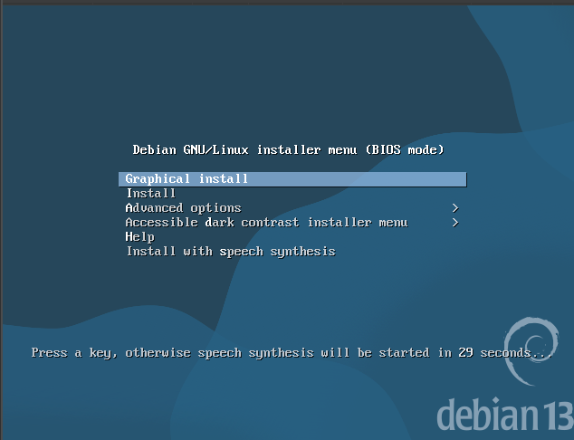

A continuación se describen las opciones disponibles en el menú de inicio:

| Opción | Descripción |
|---|---|
| `Graphical install` | Inicia el instalador en modo gráfico utilizando una interfaz accesible e intuitiva. Es la opción recomendada para la mayoría de instalaciones en equipos personales o servidores de desarrollo. |
| `Install` | Inicia el instalador en modo texto (`ncurses`). Ofrece las mismas funcionalidades que el modo gráfico pero consumiendo menos recursos de vídeo y memoria RAM. Ideal para instalaciones en hardware antiguo o mediante consola serie. |
| `Advanced options` | Proporciona acceso a opciones avanzadas de instalación como el modo experto (*expert install*), el modo rescate (*rescue mode*) o la instalación automatizada (*automated install* mediante archivos preseed). |
| `Accessible dark contrast installer menu` | Menú con tema de alto contraste oscuro pensado para mejorar la accesibilidad visual. |
| `Help` | Muestra una guía de ayuda rápida con parámetros de arranque que se pueden pasar al kernel Linux. |
| `Install with speech synthesis` | Inicia la instalación con síntesis de voz activada para usuarios con discapacidad visual. |

> **Nota:** Para este proceso guiado se selecciona la opción `Graphical install`, la cual facilita la interacción mediante ratón o touchpad durante las fases de configuración.

---

## 2. Configuración regional e idioma

La primera etapa de la configuración consiste en definir la localización e idioma del sistema. Esta elección influye directamente en las variables de entorno de localización (`LC_*` y `LANG`), la zona horaria sugerida y la disposición por defecto del teclado.

### Selección de idioma

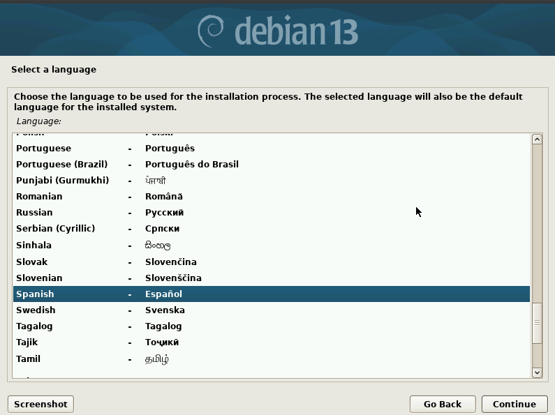

En esta pantalla se selecciona el idioma principal que utilizará tanto el instalador durante el proceso como el sistema operativo resultante una vez instalado. Al elegir `Spanish - Español`, el instalador traducirá los menús y configurará los mensajes del sistema en castellano.

> **Importante:** El idioma seleccionado establecerá el valor predeterminado del locale del sistema (por ejemplo, `es_ES.UTF-8`), afectando a la codificación de caracteres y traducciones en la consola y aplicaciones.

### Selección de ubicación

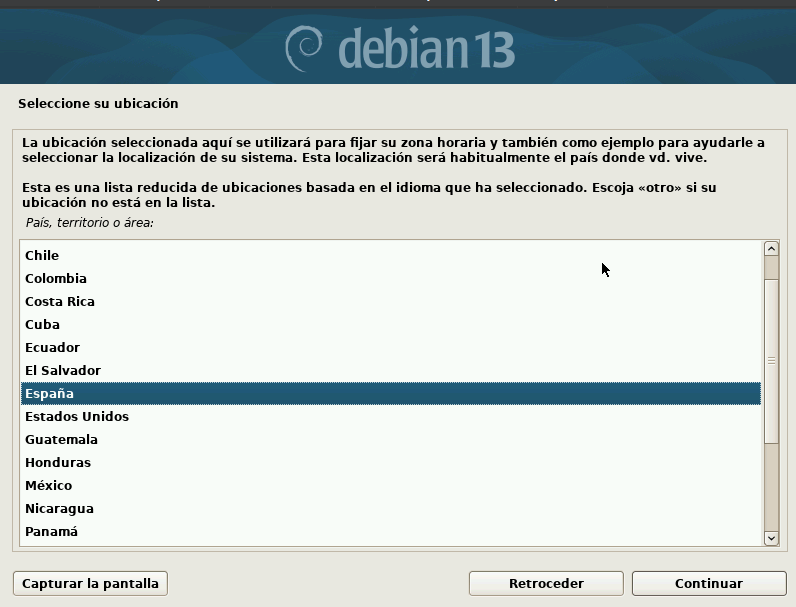

A continuación, se define el país o territorio de residencia. Al seleccionar `España`, el instalador ajustará automáticamente los parámetros de formato de fecha, moneda, separadores decimales y determinará la zona horaria predeterminada.

> **Recuerda:** Si estás instalando el sistema en una ubicación distinta, seleccionar el país adecuado garantiza la sincronización correcta con los servidores NTP locales y los repositorios espejo más cercanos.

### Selección del mapa de teclado

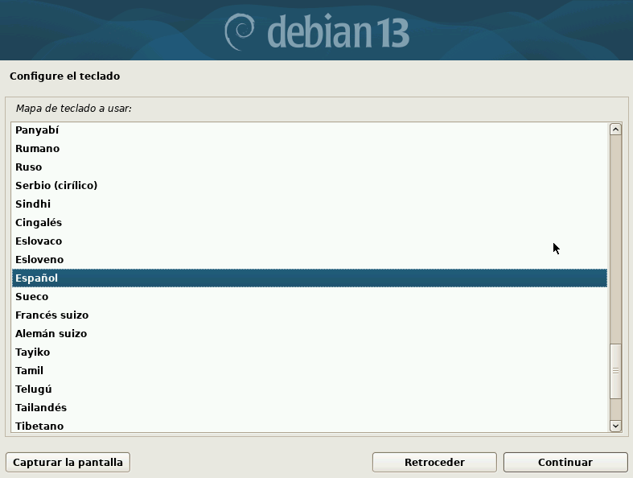

En esta pantalla se establece la distribución física de las teclas. Seleccionar `Español` asegura el mapeo adecuado para teclas especiales como la `ñ`, los acentos (`á`, `é`, etc.) y caracteres del teclado ISO estándar en español.

> **Nota:** La configuración del teclado se guardará en el fichero `/etc/default/keyboard` del sistema instalado y aplicará tanto para la consola virtual como para los entornos gráficos.

---

## 3. Carga de componentes del instalador

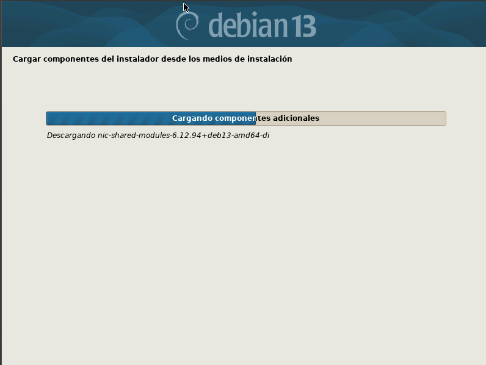

Una vez definidos los parámetros regionales básicos, el instalador procede a la detección de hardware y a la carga de módulos adicionales del kernel desde el medio de instalación (como `nic-shared-modules`).

Durante este paso:
- Se identifican las tarjetas de red físicas y virtuales.
- Se cargan los controladores necesarios para acceder a discos duros, controladores SATA/NVMe y dispositivos PCI.
- Se configura la pila de red básica para permitir la comunicación por DHCP en los siguientes pasos.

---

## 4. Configuración de la red

La configuración de red permite identificar al equipo de forma única dentro de una red local o corporativa y le proporciona acceso a internet para descargar paquetes durante la instalación.

### Nombre de la máquina (Hostname)

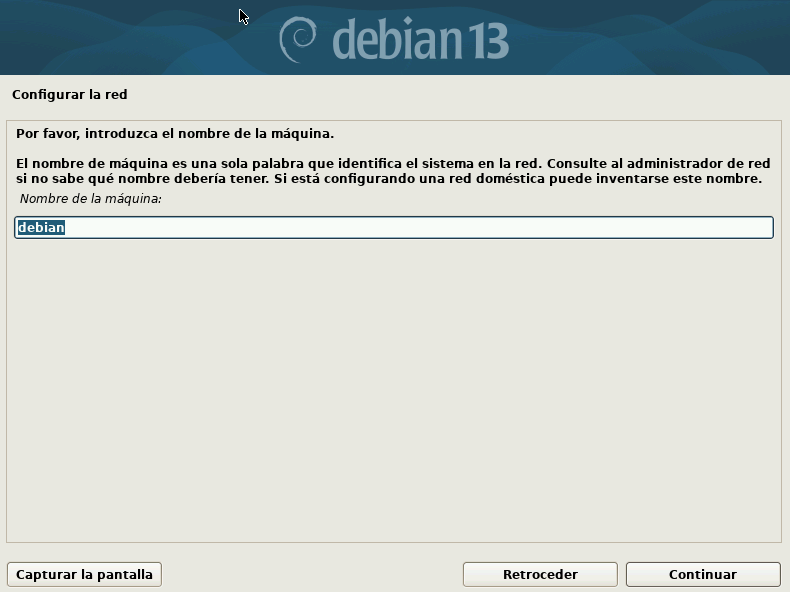

El nombre de la máquina (*hostname*) es la etiqueta alfa-numérica que identifica al sistema en la red. En este ejemplo se establece como `debian`.

> **Nota:** El nombre asignado aquí se registrará automáticamente en el archivo `/etc/hostname` y se asociará a la dirección `127.0.1.1` dentro del archivo `/etc/hosts`.

### Nombre de dominio

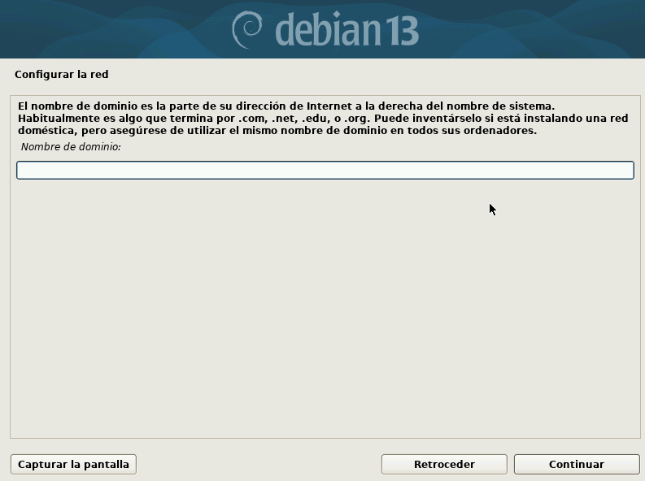

El nombre de dominio es la parte que complementa al nombre de máquina para formar su nombre de dominio completo o FQDN (*Fully Qualified Domain Name*), como por ejemplo `debian.local` o `debian.empresa.com`.

> **Nota:** En redes domésticas o laboratorios personales se puede dejar este campo en blanco. Si se especifica, se almacenará en `/etc/resolv.conf` y `/etc/hosts`.

---

## 5. Configuración de usuarios y contraseñas

Debian aplica un estricto modelo de seguridad UNIX que distingue entre la cuenta del administrador del sistema (`root`) y las cuentas de usuario estándar sin privilegios.

### Contraseña de superusuario (root)

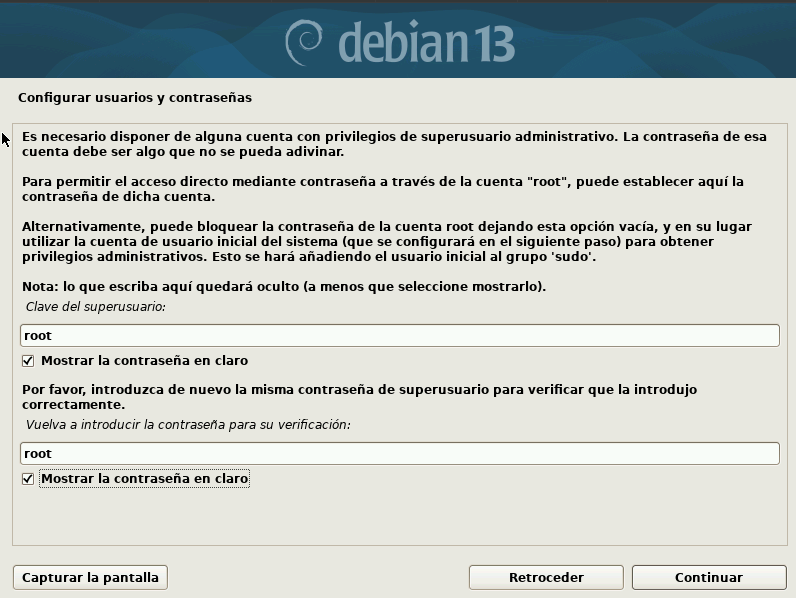

El superusuario `root` posee acceso ilimitado a todos los archivos, procesos y comandos del sistema operativo. En este paso se especifica y confirma la clave para la cuenta de `root`.

> **Advertencia:** Si se deja la clave de `root` vacía en este paso, la cuenta de `root` quedará desactivada para el inicio de sesión directo y el instalador configurará el usuario estándar (creado en los siguientes pasos) con permisos para ejecutar comandos administrativos mediante `sudo`.

### Creación del usuario estándar

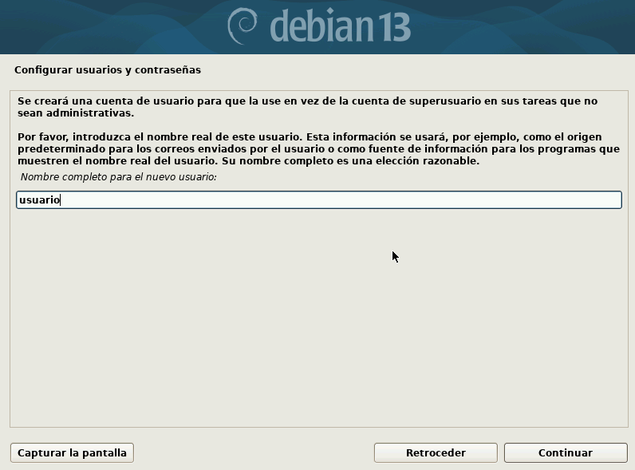

Se solicita el nombre real o completo del primer usuario común del sistema (en este ejemplo, `usuario`). Esta información se guarda en el campo GECOS del fichero `/etc/passwd`.

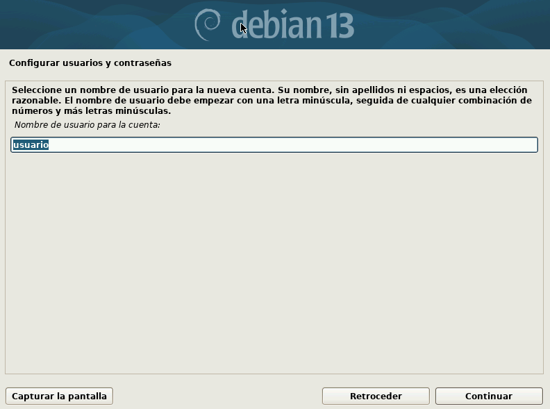

A continuación, se define el identificador de cuenta de usuario (*username*). Debe comenzar por una letra minúscula y contener solo letras minúsculas, números y guiones. En la imagen se asigna `usuario`.

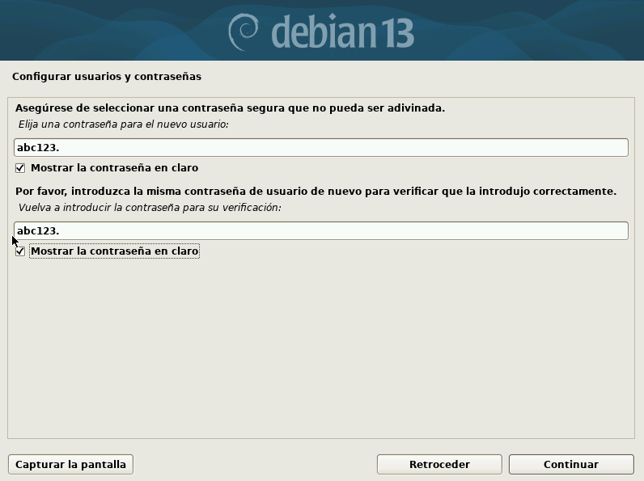

Se establece y confirma la contraseña para el nuevo usuario. Esta cuenta será utilizada para la sesión habitual de trabajo diario.

> **Importante:** La información de las contraseñas cifradas para cada usuario del sistema se almacena en el fichero `/etc/shadow`, accesible únicamente con permisos de superusuario.

---

## 6. Configuración del reloj y zona horaria

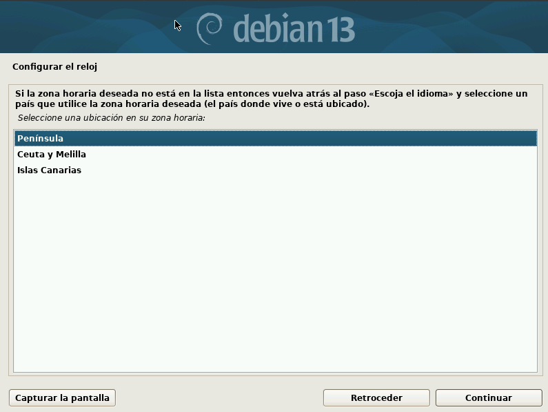

Dado que anteriormente se seleccionó `España` como país de ubicación, el instalador solicita ajustar la zona horaria concreta entre las opciones disponibles: `Península`, `Ceuta y Melilla` o `Islas Canarias`. Para este ejemplo elegimos `Península`.

> **Nota:** En sistemas Linux, el reloj del sistema opera habitualmente en hora UTC (*Coordinated Universal Time*) a nivel de hardware, mientras que el sistema operativo aplica el desfase correspondiente mediante un enlace simbólico desde `/etc/localtime` apuntando a la zona definida en `/usr/share/zoneinfo/Europe/Madrid`.

---

## 7. Particionado de discos

El particionado de discos es uno de los pasos más críticos en la instalación de un sistema operativo, ya que define cómo se estructurará el almacenamiento físico para albergar el sistema de ficheros.

### Selección del método de particionado

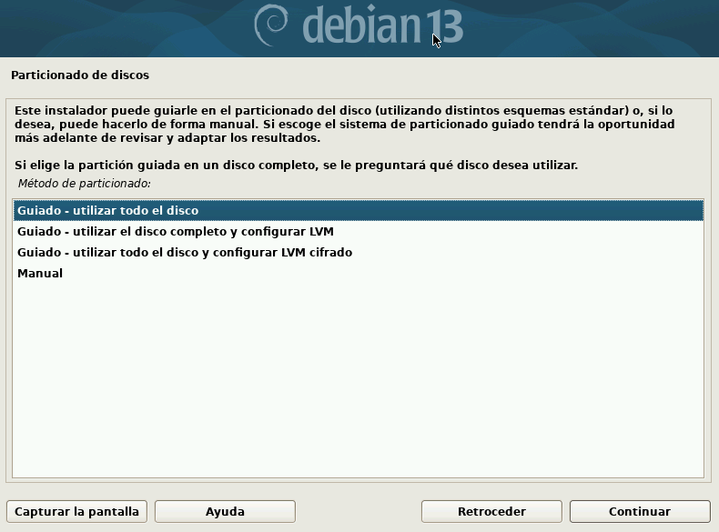

El instalador ofrece diferentes esquemas para preparar los discos de almacenamiento:

| Método | Descripción |
|---|---|
| `Guiado - utilizar todo el disco` | Formatea el disco completo creando automáticamente una partición raíz `/` y una partición de intercambio (*swap*). Es el método más sencillo y rápido. |
| `Guiado - utilizar el disco completo y configurar LVM` | Utiliza todo el disco creando volúmenes lógicos con LVM (*Logical Volume Manager*), lo que permite redimensionar particiones fácilmente en el futuro. |
| `Guiado - utilizar todo el disco y configurar LVM cifrado` | Crea una estructura LVM donde todos los datos guardados en disco quedan cifrados mediante LUKS (*Linux Unified Key Setup*). |
| `Manual` | Permite al administrador crear, modificar o redimensionar particiones manualmente con tamaños, tipos de sistema de archivos y puntos de montaje personalizados. |

> **Nota:** Para esta instalación de referencia se selecciona `Guiado - utilizar todo el disco`.

### Selección de la unidad de disco

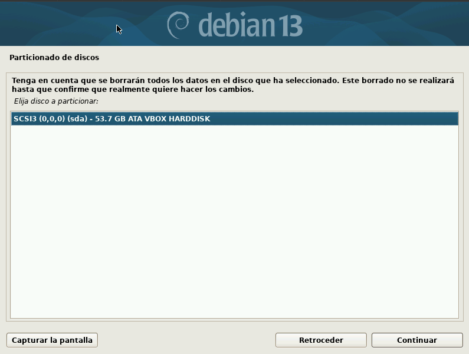

Se elige la unidad física donde se aplicará el particionado. En este caso se selecciona la unidad `/dev/sda` (`SCSI3 (0,0,0) - 53.7 GB ATA VBOX HARDDISK`), correspondiente al disco virtual de la máquina.

### Esquema de particionado

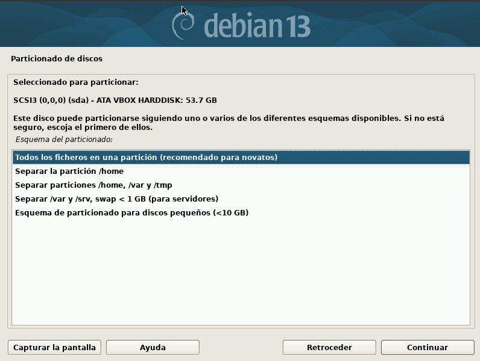

El instalador permite estructurar las particiones según el propósito del sistema:
- `Todos los ficheros en una partición (recomendado para novatos)`: Crea una sola partición para el punto de montaje raíz `/` más la partición `swap`.
- `Separar la partición /home`: Crea una partición independiente para los datos personales de los usuarios (`/home`), facilitando la reinstalación del sistema sin perder archivos personales.
- `Separar particiones /home, /var y /tmp`: Recomendado para servidores o entornos corporativos con cuotas de almacenamiento y requisitos de seguridad específicos.

> **Nota:** Seleccionamos `Todos los ficheros en una partición (recomendado para novatos)`.

### Resumen y confirmación de particiones

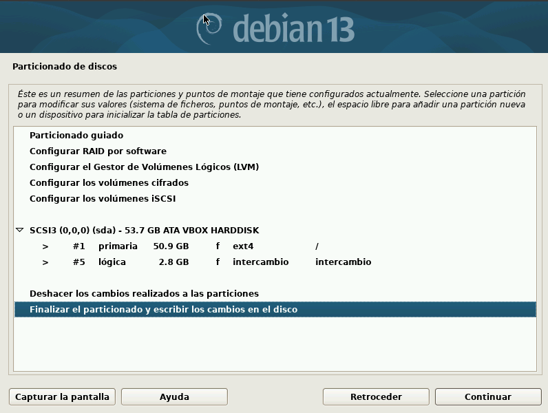

Se muestra la tabla propuesta de particiones:
1. Partición primaria `#1` formateada en `ext4` con punto de montaje en la raíz `/`.
2. Partición lógica `#5` configurada como área de `intercambio` (*swap*).

Se selecciona `Finalizar el particionado y escribir los cambios en el disco`.

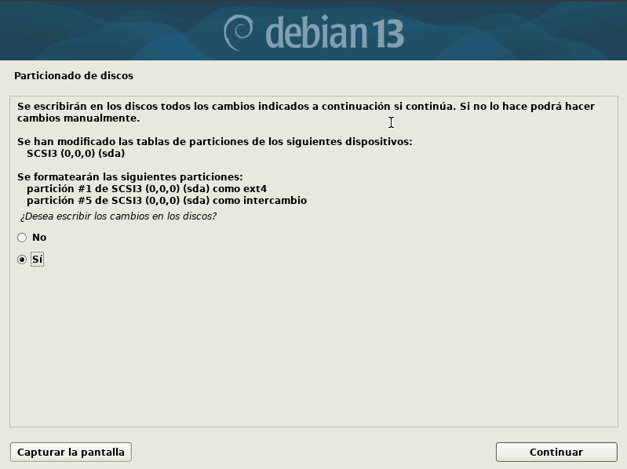

Por motivos de seguridad, el instalador requiere una confirmación explícita antes de modificar la tabla de particiones y aplicar el formato a las unidades. Seleccionamos `Sí` y pulsamos `Continuar`.

> **Advertencia:** Una vez confirmado este paso seleccionando `Sí`, se borrarán irreversiblemente todos los datos previamente existentes en las particiones indicadas de `/dev/sda`.

---

## 8. Configuración del gestor de paquetes (APT)

El gestor de paquetes APT (*Advanced Package Tool*) requiere configurar los orígenes de software y repositorios desde los que se actualizarán e instalarán las aplicaciones del sistema.

### Medios de instalación adicionales

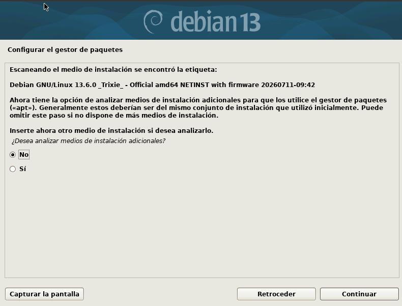

El instalador detecta el medio utilizado (`Debian GNU/Linux 13.6.0 NETINST`) y pregunta si se desea escanear DVDs o CDs adicionales. Dado que la instalación se realiza con conexión a red a través del instalador de red (*NETINST*), seleccionamos `No`.

### Selección de la réplica de Debian (Espejo / Mirror)

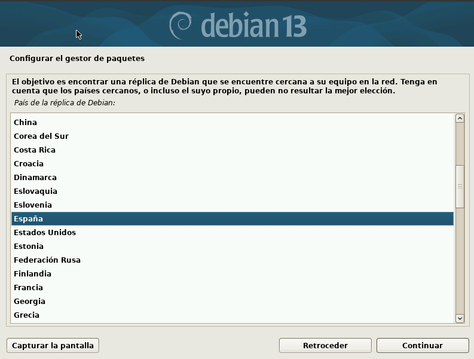

Para obtener descargas rápidas se selecciona el país donde se ubica el espejo de paquetes más cercano. Seleccionamos `España`.

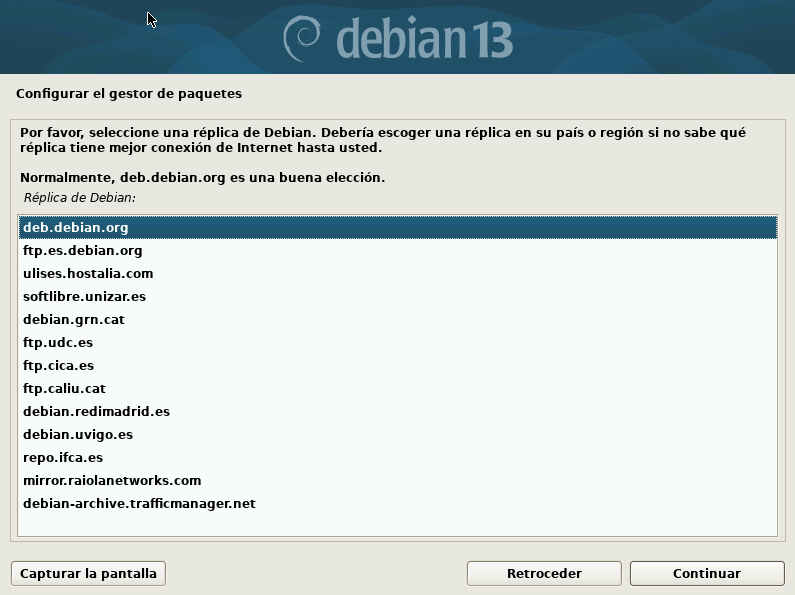

A continuación se elige el servidor espejo concreto. Se selecciona `deb.debian.org`.

> **Nota:** `deb.debian.org` es el servicio oficial de redirección de réplicas de Debian. Utiliza CDN y geolocalización por DNS para dirigir las peticiones al servidor más rápido y cercano disponible automáticamente.

### Configuración del proxy HTTP

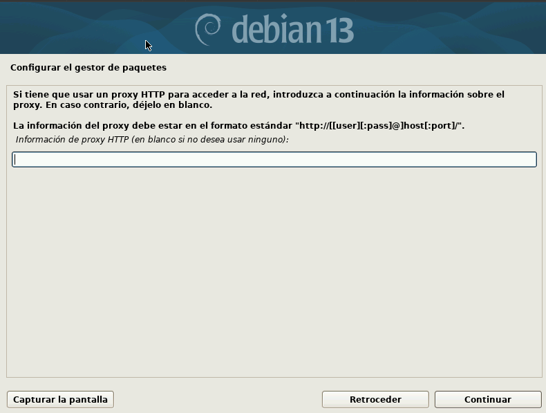

Si la red requiere salir a internet a través de un servidor Proxy HTTP intermediario, se introduce la URL de acceso con el formato `http://[[user][:pass]@]host[:port]/`. En redes convencionales se deja este campo en blanco y se pulsa `Continuar`.

---

## 9. Encuesta de uso de paquetes (Popularity-Contest)

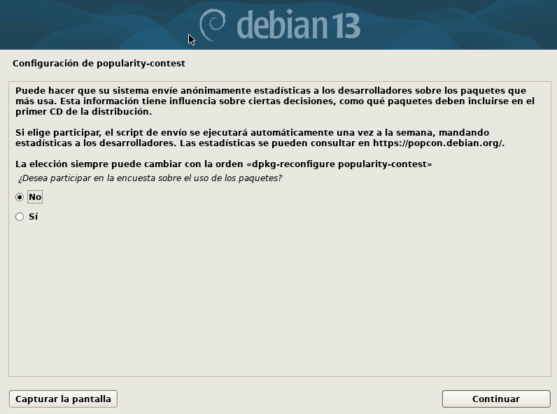

El instalador ofrece la posibilidad de enviar estadísticas anónimas periódicas a los desarrolladores de Debian mediante el paquete `popularity-contest` (`popcon`). Estos datos ayudan a la comunidad a decidir qué software se incluye en los medios de instalación principales.

> **Nota:** La participación es totalmente voluntaria. En esta instalación de ejemplo se selecciona `No`. Si en el futuro se desea activar, se puede reconfigurar ejecutando el comando `dpkg-reconfigure popularity-contest`.

---

## 10. Selección e instalación de software

Debian permite personalizar la colección de paquetes (*tasks*) que se instalarán durante la configuración inicial del sistema.

### Selección de colecciones de programas

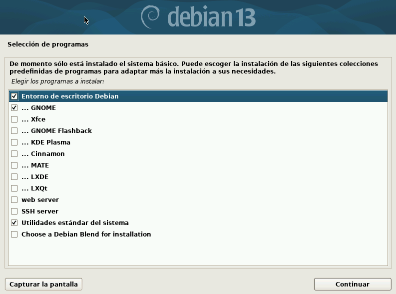

En esta pantalla se seleccionan los entornos de escritorio y componentes del servidor a instalar:

| Entorno / Colección | Uso y Descripción |
|---|---|
| `GNOME` | Entorno de escritorio predeterminado de Debian, moderno y completo con integración con Wayland. |
| `Xfce` | Entorno de escritorio ligero, ideal para equipos con recursos de hardware limitados. |
| `KDE Plasma` | Entorno gráfico altamente personalizable con interfaz basada en Qt. |
| `Cinnamon / MATE` | Entornos gráficos con disposición tradicional de barra de tareas y menú de inicio clásico. |
| `web server` | Instala el servidor web Apache (`apache2`) y herramientas asociadas. |
| `SSH server` | Instala el servidor OpenSSH (`openssh-server`) para permitir la administración remota por consola. |
| `Utilidades estándar del sistema` | Conjunto de herramientas básicas de administración de sistemas e intérprete de comandos en consola. |

> **Nota:** Seleccionamos `Entorno de escritorio Debian` con `GNOME` y las `Utilidades estándar del sistema`.

### Descarga e instalación de paquetes

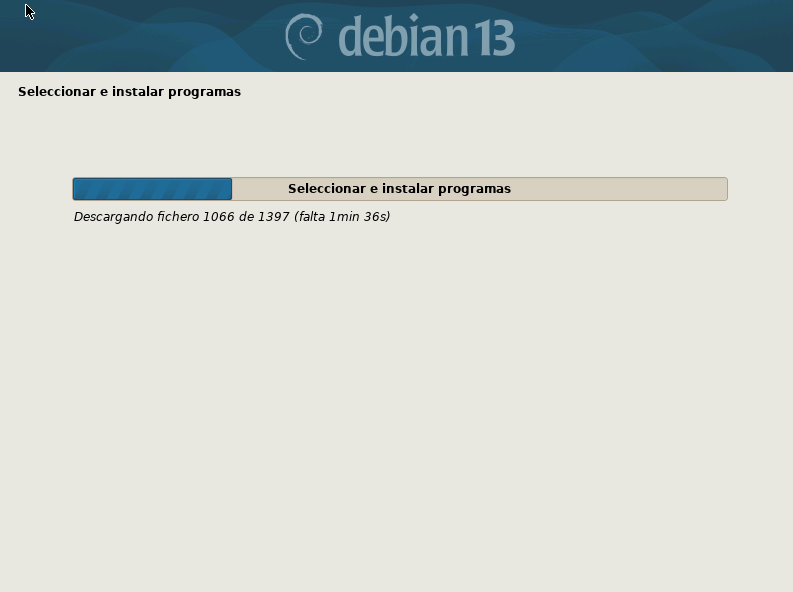

El instalador descarga y configura todos los paquetes correspondientes a las colecciones seleccionadas a través del gestor `apt`.

---

## 11. Instalación del cargador de arranque GRUB

El cargador de arranque GRUB 2 (*Grand Unified Bootloader*) es el programa encargado de tomar el control del hardware tras el firmware del equipo (BIOS/UEFI) y cargar el kernel de Linux en memoria RAM.

### Confirmación de instalación de GRUB

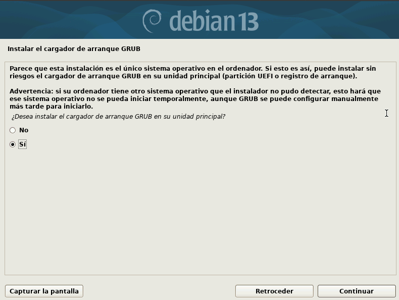

Dado que Debian es el único sistema operativo detectado en la máquina, el instalador consulta si se debe escribir GRUB en el sector de arranque de la unidad principal. Seleccionamos `Sí`.

### Selección del dispositivo de arranque

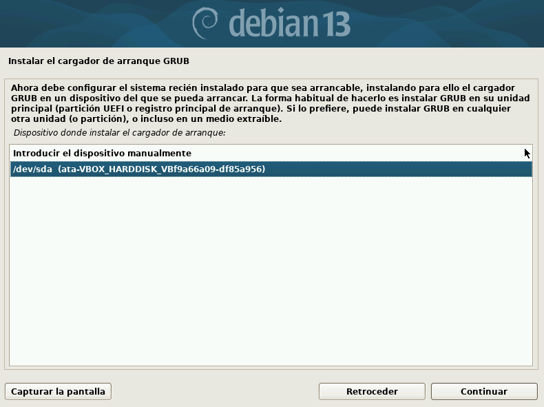

Se indica explícitamente el dispositivo físico donde se registrará el cargador de arranque. Seleccionamos `/dev/sda` (`ata-VBOX_HARDDISK`).

> **Importante:** No debe seleccionarse una partición específica (como `/dev/sda1`), sino la unidad de disco completa (`/dev/sda`) para garantizar que la tabla de particiones MBR/UEFI sea leída correctamente al encender la máquina.

---

## 12. Finalización de la instalación y primer arranque

### Aviso de fin de instalación

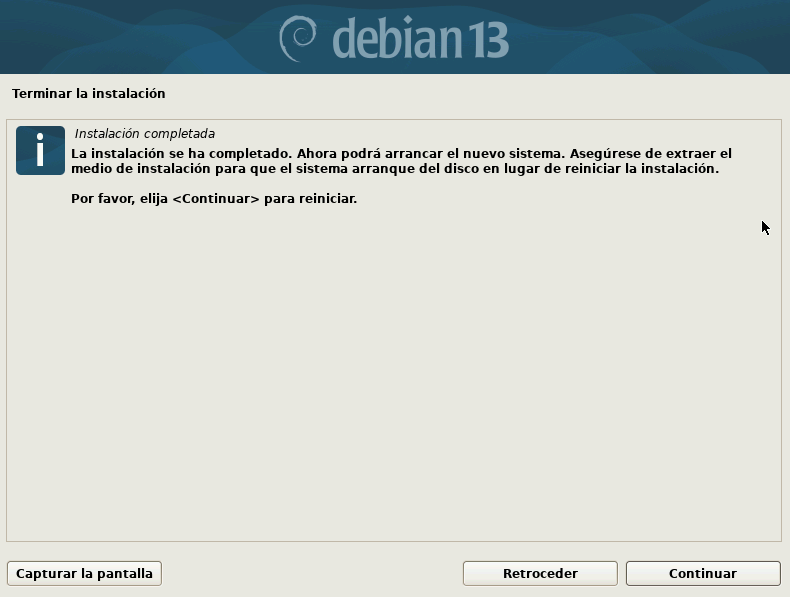

El instalador notifica que el proceso se ha completado con éxito. Se debe retirar el medio de instalación (imagen ISO en la máquina virtual o pendrive USB físico) antes de pulsar `Continuar` para evitar que el equipo vuelva a arrancar el instalador.

### Menú de arranque de GRUB

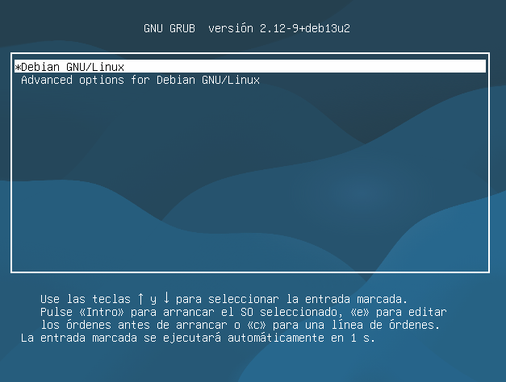

Al reiniciar el equipo, se presenta el menú de arranque de GNU GRUB. Tras esperar 5 segundos o pulsar `Intro` sobre la opción `Debian GNU/Linux`, el gestor carga el kernel de Linux y los servicios iniciales del sistema (`systemd`).

### Pantalla de inicio de sesión (GDM)

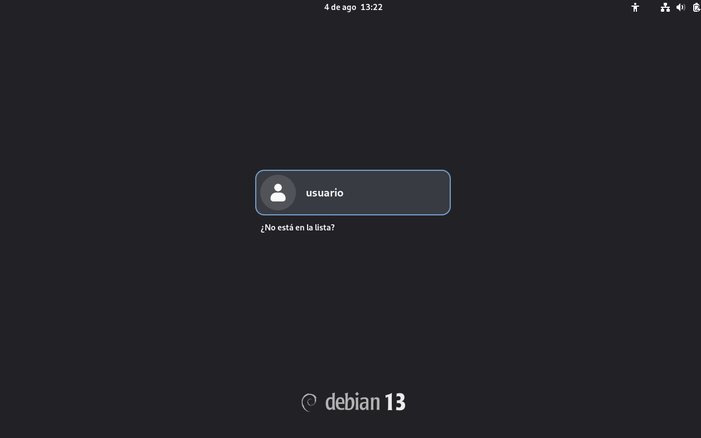

El gestor de pantalla de GNOME (*GDM - GNOME Display Manager*) muestra la interfaz gráfica para seleccionar el usuario `usuario` e introducir la contraseña establecida durante la instalación.

### Escritorio GNOME activo

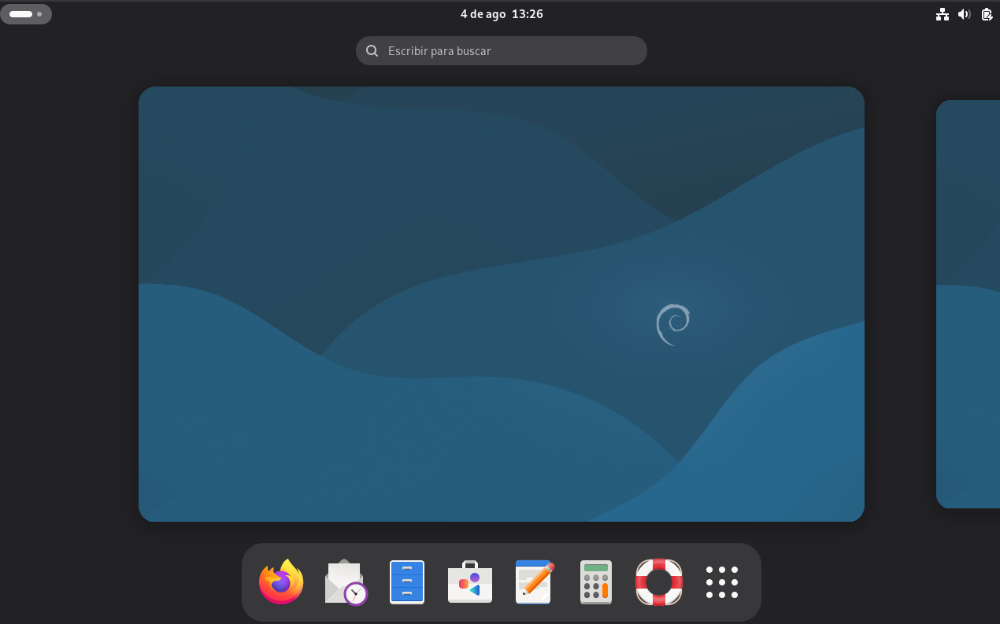

Tras validar la contraseña, se inicia la sesión gráfica en el entorno de escritorio **GNOME** de Debian 13 (Trixie), mostrando el panel superior, la barra de accesos directos (dock) y el menú de aplicaciones listo para su uso.
