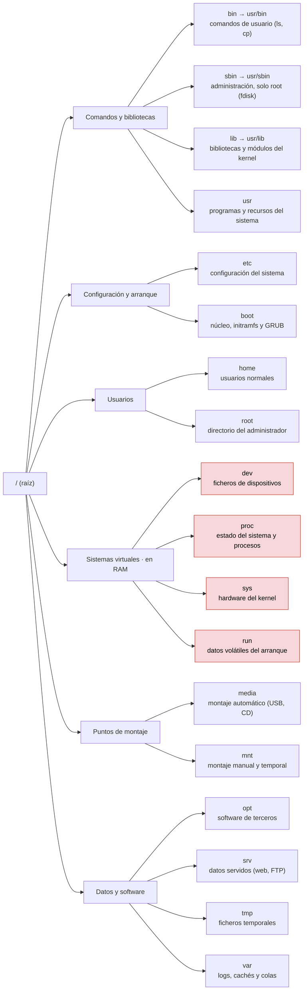

# Sistema de ficheros

## Índice

1. [/bin y /sbin](#1-bin-y-sbin)
2. [/boot](#2-boot)
3. [/etc](#3-etc)
4. [/home y /root](#4-home-y-root)
5. [/lib](#5-lib)
6. [/media y /mnt](#6-media-y-mnt)
7. [/usr y /opt](#7-usr-y-opt)
8. [/dev](#8-dev)
9. [/proc y /sys](#9-proc-y-sys)
10. [/srv](#10-srv)
11. [/tmp](#11-tmp)
12. [/var](#12-var)
13. [/run](#13-run)
14. [Resumen del árbol de directorios](#14-resumen-del-árbol-de-directorios)
15. [Criterios de particionado](#15-criterios-de-particionado)

---

## 1. /bin y /sbin

Directorios estáticos donde se encuentran los **binarios** propios del usuario y sistema. Es aquí donde podemos tener los binarios o archivos ejecutables del sistema, es decir, código compilado de comandos como `cp`, `ls`, `mv`, `rm`, entre otros.

Tenemos que hablar de dos directorios cuando hablamos de binarios del sistema:

- `/bin/`: Programas básicos. Almacena todos los binarios necesarios para garantizar las funciones básicas a nivel de usuario (herramientas esenciales de línea de comandos). Por ejemplo, `ls` (listar el contenido de un directorio) o `cp` (copiar ficheros), que puede ejecutar cualquier usuario.
- `/sbin/`: Programas de sistema. Almacena los binarios necesarios para tareas administrativas del sistema (como herramientas de gestión de red o particiones) y solo pueden ser gestionadas por el usuario `root`. Por ejemplo, `fdisk` (crear y modificar particiones de disco) o `mkfs` (formatear una partición con un sistema de ficheros), que requieren privilegios de administrador.

En las distribuciones actuales (Debian 12 en adelante, Ubuntu, Fedora, etc.) ambos son ya simples **enlaces simbólicos** a `/usr/bin` y `/usr/sbin`. Este cambio estructural, conocido como *UsrMerge*, unifica todas las herramientas y bibliotecas del sistema bajo una misma ruta para facilitar la compatibilidad, las actualizaciones atómicas y el montaje de `/usr` en modo solo lectura.

```bash
lrwxrwxrwx   1 root root     7 Feb 10 11:41 bin -> usr/bin
lrwxrwxrwx   1 root root     8 Feb 10 11:41 sbin -> usr/sbin
```

---

## 2. /boot

Directorio estático que incluye los **archivos** necesarios para el **proceso de arranque del sistema**. Deberían ser utilizados antes de que el kernel comience a dar las instrucciones de arranque de los diferentes módulos del sistema. En este directorio podemos encontrar archivos como los `/boot/vmlinuz`, los cuales son archivos *Linux kernel x86 boot executable bzImage*.

- `/boot/`: núcleo Linux (kernel) y otros archivos esenciales como el `initrd` (ramdisk inicial) necesarios para las primeras etapas del proceso de arranque.
- Destacamos el directorio `/boot/grub` donde se contiene la información del GRUB (Grand Unified Bootloader) y existen archivos como el `grub.cfg` donde está la información del menú del gestor de arranque. Este gestor es el responsable de cargar el kernel en memoria.

Listado del contenido del directorio de configuración de GRUB:

```bash
root@usuario:/boot/grub# ls
fonts             grubenv  unicode.pf2
gfxblacklist.txt  i386-pc  x86_64-efi
grub.cfg          locale
```

Detalles del archivo de configuración principal de GRUB (`grub.cfg`):

```bash
root@usuario:/boot/grub# ls -l grub.cfg
-rw-rw-r-- 1 root root 9986 dic 10 22:36 grub.cfg
```

---

## 3. /etc

Almacena los archivos de configuración tanto a nivel de componentes del sistema operativo como de los programas instalados. Debería tener únicamente archivos de configuración en formato de texto plano y no debería contener binarios. La centralización de configuraciones aquí facilita las copias de seguridad del estado del sistema.

- `/etc/`: archivos de configuración globales del sistema.
- `/etc/opt`: Ficheros de configuración para los programas adicionales alojados dentro de `/opt`.

---

## 4. /home y /root

Directorios destinados a almacenar los archivos personales y perfiles de los usuarios. También incluye archivos temporales u ocultos de aplicaciones ejecutadas en modo usuario que sirven para guardar las configuraciones específicas de programas para cada cuenta.

- `/home/`: archivos personales de los usuarios regulares del sistema. Cada usuario tendrá su propio subdirectorio (ej. `/home/usuario`).
- `/root/`: archivos personales del administrador (`root`). Separar la carpeta del administrador del resto de usuarios previene problemas críticos si el sistema de archivos `/home` sufre de corrupción o falta de espacio.

---

## 5. /lib

Incluye las bibliotecas esenciales (archivos `.so` o *shared objects*) para que se puedan ejecutar correctamente todos los binarios de los directorios `/bin` y `/sbin` así como los módulos propios del kernel que están en la ruta `/lib/modules`. Tenemos también los directorios `/lib32` y `/lib64` para aquellas bibliotecas propias de arquitecturas de 32 y 64 bits respectivamente.

- `/lib/`: bibliotecas compartidas para binarios y módulos del núcleo del sistema, que añaden funcionalidades de hardware u opciones de red al vuelo.

```bash
lrwxrwxrwx   1 root root     7 Feb 10 11:41 lib -> usr/lib
lrwxrwxrwx   1 root root     9 Feb 10 11:41 lib32 -> usr/lib32
lrwxrwxrwx   1 root root     9 Feb 10 11:41 lib64 -> usr/lib64
```

> **Nota:** Un apunte de vocabulario antes de empezar: el término correcto en español es **biblioteca** (traducción de *library*), pero es muy habitual llamarla *librería* por calco del inglés. En rigor no son lo mismo, ya que en español una *librería* es la tienda donde se venden libros; aun así, ambos términos se usan indistintamente en informática y se entienden. En estos apuntes se emplea *biblioteca*.
>
> Aclarado esto, aunque las bibliotecas y los módulos conviven bajo `/lib` y a veces se confunden, una **biblioteca** y un **módulo del kernel** son cosas distintas. Una biblioteca es código que amplía a los **programas** y se ejecuta en el **espacio de usuario**; un módulo del kernel es código que amplía al **propio núcleo** y se ejecuta en el **espacio de kernel** (por ejemplo, para dar soporte a un dispositivo de hardware o a un sistema de ficheros).
>
> | | Biblioteca | Módulo del kernel |
> |---|---|---|
> | Qué amplía | A los programas (aplicaciones) | Al núcleo del sistema |
> | Dónde se ejecuta | Espacio de usuario | Espacio de kernel |
> | Extensión | `.so` (*shared object*) | `.ko` (*kernel object*) |
> | Ubicación | `/lib`, `/usr/lib` | `/lib/modules/<versión>/` |
> | Cómo se carga | El enlazador dinámico `ld.so`, al ejecutar un programa | Con `modprobe` o `insmod` (documento 04) |
> | Ejemplo | `libc.so.6` (funciones básicas de C), `libssl.so` (cifrado) | `e1000` (tarjeta de red), `ext4` (sistema de ficheros) |
>
> Un término muy relacionado es el de **driver** (controlador): el software que sabe manejar un dispositivo de hardware concreto, traduciendo las órdenes genéricas del sistema a las señales que ese hardware entiende. En Linux, la mayoría de los drivers **se entregan como módulos del kernel**, de modo que *driver* describe la **función** (controlar un hardware) y *módulo* describe la **forma** de empaquetarla y cargarla. No son sinónimos: no todos los módulos son drivers (`ext4` es un módulo, pero es un sistema de ficheros, no un driver), y no todos los drivers son módulos (algunos van compilados dentro del propio núcleo).
>
> En una frase: la biblioteca `libssl.so` la usa un **programa** como un navegador para cifrar, y el módulo `e1000` —que contiene el **driver** de esa tarjeta— lo usa el **kernel** para hablar con la red. Los módulos y drivers del kernel se tratan en detalle en el documento 04.

Para ver los módulos del kernel podemos revisar la ruta `/lib/modules` y para saber la versión exacta de nuestro kernel actual disponemos del comando `uname -r`.

Comprobación de la versión del kernel:

```bash
root@usuario:~# uname -r
6.8.0-49-generic
```

Exploración de los módulos del sistema disponibles para esa versión:

```bash
root@usuario:~# cd /lib/modules/6.8.0-49-generic/
root@usuario:/lib/modules/6.8.0-49-generic# ls
build          modules.alias.bin          modules.builtin.modinfo  modules.order        vdso
initrd         modules.builtin            modules.dep              modules.softdep
kernel         modules.builtin.alias.bin  modules.dep.bin          modules.symbols
modules.alias  modules.builtin.bin        modules.devname          modules.symbols.bin
```

Por otra parte, existe la posibilidad de tener librerías compartidas a utilizar por diferentes programas o binarios del sistema. Para poder acceder a ellas se tienen que configurar en el fichero de configuración `/etc/ld.so.conf` o preferiblemente en el directorio `/etc/ld.so.conf.d` mediante ficheros con extensión `.conf`. Posteriormente tenemos que hacer uso del comando `ldconfig` para que la caché de librerías se actualice y los programas sepan que hay una nueva ruta con diferentes librerías disponibles.

El comando `ldconfig`:

- Actualiza la caché para las rutas definidas en `/etc/ld.so.conf` y asociadas, así como para `/usr/lib` y `/lib`.
- Actualiza los vínculos simbólicos en las librerías para referenciar las versiones correctas.
- Permite también listar las librerías conocidas actualmente en la caché.

> **Importante:** Cada vez que se compila y se instala una librería compartida desde las fuentes manualmente, es necesario ejecutar `ldconfig` para que el sistema operativo la registre correctamente en su caché.

Por otra parte, existe la variable de entorno `$LD_LIBRARY_PATH` donde se pueden asignar rutas temporales de las librerías compartidas. La información de esta variable tiene preferencia sobre la información del fichero de configuración, lo cual es útil para pruebas o desarrollos locales.

Para saber las librerías que utiliza un ejecutable concreto, tenemos a nuestra disposición el comando `ldd`.

```bash
root@usuario:/usr# which ls
/usr/bin/ls
root@usuario:/usr# ldd $(which ls)
        linux-vdso.so.1 (0x00007ffe2911e000)
        libselinux.so.1 => /lib/x86_64-linux-gnu/libselinux.so.1 (0x000078f496675000)
        libc.so.6 => /lib/x86_64-linux-gnu/libc.so.6 (0x000078f496400000)
        libpcre2-8.so.0 => /lib/x86_64-linux-gnu/libpcre2-8.so.0 (0x000078f496369000)
        /lib64/ld-linux-x86-64.so.2 (0x000078f4966d6000)
```

---

## 6. /media y /mnt

Punto de montaje de los volúmenes lógicos que se montan en el sistema de forma temporal, dando acceso al sistema de archivos de medios externos.

- `/media/`: puntos de montaje automático para dispositivos removibles gestionados por el entorno gráfico (CD-ROM, llaves USB, discos externos, etc.).
- `/mnt/`: punto de montaje temporal y manual no gestionado automáticamente. Usado tradicionalmente por administradores para montar particiones de disco durante mantenimientos o copias de seguridad.

> **Importante:** Tanto `/media` como `/mnt` están reservados para montajes **no permanentes** (removibles o temporales). Entonces, ¿dónde se monta lo que queremos de forma **persistente**, como el disco de datos de un servidor? La respuesta es que **lo que hace persistente a un montaje no es el directorio donde se monta, sino que esté declarado en `/etc/fstab`** (documento 37). El directorio de montaje es libre y se elige según la **función** de esos datos:
>
> | Qué se monta | Dónde suele montarse |
> |---|---|
> | Datos que **sirve** el sistema a la red (web, FTP, Git) | `/srv` (por ejemplo `/srv/www`), que el FHS reserva para eso |
> | `/home` o `/var` en una partición o disco aparte | Sobre esos mismos directorios del sistema |
> | Almacenamiento adicional de datos | Un directorio propio creado por el administrador (`/datos`, `/almacen`, `/backup`…) |
>
> Montar algo permanente en `/media` o `/mnt` técnicamente funciona, pero rompe la convención: cualquier administrador que vea un disco importante montado en `/mnt` pensará que es temporal. En resumen: **lo efímero va a `/media` (removible) o `/mnt` (temporal); lo persistente va al directorio que le corresponda por su función y se declara en `/etc/fstab`**.

---

## 7. /usr y /opt

Directorios destinados a almacenar archivos del sistema y aplicaciones de terceros que no son estrictamente necesarias para un entorno monousuario mínimo.

- `/usr`: Es donde se almacenan los archivos del sistema que son compartidos entre todos los usuarios, como bibliotecas, programas y documentación de sólo lectura. Es la ubicación estándar para software que se instala desde los repositorios del sistema o por el administrador del sistema. Este directorio está subdividido en `bin`, `sbin`, `lib` siendo estos enlaces simbólicos como se mostraba anteriormente y a los que tendrán acceso todos los usuarios del sistema. Su nombre proviene históricamente de *user*, porque en los primeros UNIX alojaba los directorios personales de los usuarios; hoy suele reinterpretarse como *Unix System Resources*, aunque se trata de un acrónimo retrospectivo y no de su significado original.
- `/usr/local`: Reservado al software que el administrador compila e instala **manualmente**, al margen del gestor de paquetes. Replica internamente la estructura de `/usr` (`/usr/local/bin`, `/usr/local/lib`, `/usr/local/share`). Mantenerlo separado evita que una actualización de la distribución sobrescriba o elimine lo instalado a mano.
- `/opt`: Se utiliza para instalar software adicional que no forma parte del sistema base o de los repositorios oficiales. Aquí suelen ir programas o aplicaciones de terceros, frecuentemente comerciales o privativas, que instalan todo su paquete en un solo directorio en lugar de esparcir sus archivos (no siguen la estructura estándar del sistema). Es común en aplicaciones grandes (como bases de datos de terceros o ciertas suites de software).

---

## 8. /dev

Incluye todos los dispositivos de almacenamiento o hardware conectados al sistema y que este entienda como un volumen lógico o archivo de dispositivo, permitiendo interactuar con el hardware leyendo o escribiendo como si fuera un archivo.

- `/dev/`: archivos de dispositivo especiales o *device nodes*.
- El demonio que se encarga de crear y eliminar dinámicamente los ficheros que representan los dispositivos según estén disponibles o no se conoce como `udev`, es decir, detecta cuando un dispositivo se conecta o desconecta y actúa en consecuencia para crear o borrar su nodo en `/dev`.
- Ejemplos de dispositivos en esta ruta serían:
  - `/dev/fd0`: Primera disquetera del sistema. No debe confundirse con `/dev/fd`, que es un enlace simbólico a `/proc/self/fd` y expone los descriptores de fichero del proceso en curso.
  - `/dev/hda`: Primer disco IDE/PATA en sistemas antiguos. En los núcleos modernos este esquema de nombres ha desaparecido y todos los discos se presentan como `/dev/sdX`.
  - `/dev/sda`: Primer disco gestionado por el subsistema SCSI, que hoy engloba también discos SATA, SAS y unidades USB. Sus particiones se numeran a continuación: `/dev/sda1`, `/dev/sda2`, etc.
  - `/dev/nvme0n1`: Primer disco NVMe. Al depender de un subsistema distinto, sus particiones se nombran con el sufijo `p`: `/dev/nvme0n1p1`.
  - `/dev/sr0`: Lector de DVD o CD-ROM SCSI/SATA.
  - `/dev/null`, `/dev/zero`, `/dev/random`: Dispositivos virtuales sin hardware detrás. `/dev/null` descarta todo lo que se le escribe, `/dev/zero` devuelve bytes nulos de forma indefinida y `/dev/random` genera datos aleatorios.

> **Advertencia:** Las interfaces de red son la gran excepción a la regla de que todo es un fichero: **no tienen nodo de dispositivo en `/dev`**. No existen `/dev/eth0` ni `/dev/enp0s3`. El núcleo las expone mediante *sockets* y a través de los pseudo-sistemas de ficheros `/sys/class/net` y `/proc/net`, y se administran con herramientas como `ip` o `ethtool`.

---

## 9. /proc y /sys

Conviene entender `/proc` y `/sys` juntos, porque comparten una naturaleza poco intuitiva: son **pseudo-sistemas de ficheros** (sistemas de ficheros virtuales). Esto quiere decir que **no están en el disco**: viven en la memoria RAM y ocupan cero bytes reales. El **núcleo los genera al vuelo**, de modo que cuando se lee uno de sus ficheros no se está leyendo algo guardado, sino preguntándole al kernel su estado **en ese preciso instante**.

Su razón de ser es la idea que vertebra todo Linux, "todo es un fichero": en lugar de necesitar programas especiales para consultar o configurar el núcleo, el kernel **se expone a sí mismo como ficheros**, de manera que se puede **leer su estado con `cat`** y **cambiar su comportamiento con `echo`**. Es como abrir el capó del sistema: `/proc` y `/sys` dejan ver los "sensores" del kernel y tocar algunos "mandos", usando comandos de ficheros corrientes.

**`/proc`: el estado del sistema y de los procesos.** Gestionado por el controlador `procfs`, contiene información sobre los **procesos en ejecución** y el **estado general del sistema**. Al listarlo aparecen muchos **directorios con nombre numérico**: cada número es el **PID** (*Process Identifier*) de un proceso vivo, y dentro está todo lo relativo a él.

```bash
usuario@usuario:/proc$ ls
1     21    2350  2525  2747  4183  59   66   92             fs             partitions
10    22    2355  2542  28    4188  592  68   94             interrupts     pressure
11    2236  2361  2553  2802  4194  593  69   95             iomem          schedstat
111   2241  2365  2555  281   4234  598  691  96             ioports        scsi
...
```

Junto a esos directorios de procesos hay ficheros que reflejan el estado del sistema. Estos son algunos de los más útiles:

| Fichero | Qué muestra |
|---|---|
| `/proc/cpuinfo` | Información del procesador: núcleos, características y extensiones soportadas. |
| `/proc/meminfo` | Uso y estado de la memoria RAM y la swap. |
| `/proc/mounts` | Sistemas de ficheros montados actualmente (enlace a `/proc/self/mounts`). |
| `/proc/partitions` | Bloques y particiones de disco reconocidos por el núcleo. |
| `/proc/swaps` | Áreas de intercambio (swap) activas. |
| `/proc/cmdline` | Parámetros con los que arrancó el kernel. |
| `/proc/interrupts` | Interrupciones (IRQ): qué canal usa cada dispositivo para avisar a la CPU. |
| `/proc/sys/` | Parámetros ajustables del núcleo, los que gestiona el comando `sysctl`. |

> **Nota:** Muchos comandos de administración no hacen nada mágico: en realidad **leen de `/proc`** y presentan el resultado de forma legible. `free` no es más que una lectura formateada de `/proc/meminfo`, y `ps` o `top` recorren los directorios numéricos de `/proc` para listar los procesos.

**`/sys`: el hardware y los dispositivos.** Gestionado por `sysfs`, es más moderno y está mejor organizado. Expone de forma **jerárquica el hardware y los dispositivos** que el núcleo conoce: interfaces de red, discos, batería, USB, etc. Por ejemplo, la velocidad de una tarjeta de red se lee en `/sys/class/net`:

```bash
usuario@usuario:/sys/class/net$ ls
enp0s3  lo
usuario@usuario:/sys/class/net$ cat enp0s3/speed
1000
```

Que la tarjeta `enp0s3` reporte `1000` indica que es una Ethernet de 1000 Mbps (Gigabit).

**La diferencia entre ambos.** Los dos son pseudo-sistemas de ficheros en RAM y ventanas al kernel, pero con enfoques distintos:

| | `/proc` | `/sys` |
|---|---|---|
| Antigüedad | El histórico (heredado de UNIX) | Más moderno (desde el kernel 2.6) |
| Orientado a | **Procesos** y estado general del sistema | **Dispositivos y hardware** |
| Organización | Algo desordenado, mezcla muchas cosas | Estructurado y jerárquico |
| Ejemplo típico | `/proc/meminfo`, `/proc/1234/` | `/sys/class/net/enp0s3/speed` |

**No solo se lee: también se configura.** La parte más potente es que en muchos de estos ficheros no solo se puede **leer**, sino también **escribir**, y al hacerlo se le da una orden directa al núcleo. El ejemplo clásico, que reaparece en el documento 31, es activar el reenvío de paquetes para convertir la máquina en un router:

```bash
root@debian:~# cat /proc/sys/net/ipv4/ip_forward      # muestra 0 (desactivado)
0
root@debian:~# echo 1 > /proc/sys/net/ipv4/ip_forward  # lo activa al instante
```

> **Recuerda:** El comando `sysctl` no es más que una forma cómoda y segura de leer y escribir esos mismos ficheros de `/proc/sys/`. Escribir directamente en ellos surte efecto **de inmediato**, pero se pierde al reiniciar; para que el cambio sea permanente hay que declararlo en `/etc/sysctl.conf`, como se explica en el documento 31.

> **Nota:** Junto con `/dev`, los directorios `/proc` y `/sys` forman el conjunto de interfaces con las que el sistema operativo expone su interior. Son la primera parada para **diagnosticar** problemas de hardware, memoria o procesos, porque reflejan el estado real del núcleo en cada momento.

---

## 10. /srv

Almacena información propia de servidores en forma de archivo que puedan estar instalados en el sistema (por ejemplo, datos de servidores web o FTP).

- `/srv/`: datos específicos del sitio servidos o utilizados por los servicios en este sistema (ej. el directorio raíz de documentos de un servidor web o los repositorios de un servidor CVS/Git). Su existencia busca separar datos de servicios ofrecidos del propio SO y evitar usar `/var` de forma indiscriminada.

---

## 11. /tmp

Su uso está enfocado en almacenar contenido temporal de poca duración generados por aplicaciones o usuarios durante su ejecución.

- `/tmp/`: archivos temporales de cualquier usuario o aplicación. Generalmente, un servicio automático vacía o purga los archivos antiguos de este directorio periódicamente o durante el arranque del sistema. Es un directorio con permisos especiales (Sticky Bit) para que los usuarios no puedan borrar archivos que no les pertenecen a pesar de tener permisos de escritura públicos.

---

## 12. /var

Contiene información del sistema altamente dinámica, actuando a modo de registro o estado variable del sistema.

- `/var/`: datos variables administrados por demonios del sistema. Esto incluye archivos de registro (*logs*), colas (*spools*), cachés, bases de datos y otros archivos que cambian de tamaño o contenido constantemente con el tiempo. El contenido de esta carpeta puede cambiar con la actividad del sistema, y su tamaño puede aumentar drásticamente debido a la acumulación de registros y otros datos generados dinámicamente.
  Ejemplos comunes:
  - `/var/log`: contiene archivos de registro del sistema y de servicios (como Apache o Nginx), donde se guardan cronológicamente los mensajes del sistema, errores, accesos y eventos importantes.
  - `/var/cache`: almacena archivos de caché pre-generados de aplicaciones y servicios, como la caché de paquetes del gestor `apt`.
  - `/var/spool`: contiene colas de trabajos que esperan ser procesados secuencialmente, como correos electrónicos salientes o trabajos enviados a la impresora (*CUPS*).
  - `/var/tmp`: archivos temporales que, a diferencia de `/tmp`, están diseñados para que sobrevivan a reinicios del sistema o purgas estándar.

---

## 13. /run

Para almacenar en tiempo de ejecución datos no persistentes requeridos para el funcionamiento del sistema desde el último arranque.

- `/run/`: datos volátiles en tiempo de ejecución que no persisten entre reinicios. Suele estar montado directamente en la memoria RAM (`tmpfs`). Los archivos dentro de esta carpeta son necesarios para el funcionamiento del sistema mientras está en ejecución, pero no se mantienen después de un apagado o reinicio. Esta carpeta contiene información crítica sobre el estado del sistema, como identificadores de procesos actuales (archivos `.pid`), información temporal de red, sesiones de usuario, y otros archivos efímeros que se recrean en cada ciclo de arranque.
  Ejemplos comunes:
  - `/run/lock`: archivos de bloqueo (*lockfiles*) que previenen la ejecución simultánea de procesos que podrían interferir entre sí al intentar acceder a un mismo recurso a la vez.
  - `/run/user/`: directorios efímeros específicos para cada usuario con sesión activa, donde se almacenan datos temporales (como variables de entorno o *sockets*) relacionados con sus sesiones.
  - `/run/systemd/`: contiene información interna sobre el gestor de sistema e inicio (`systemd`), sus unidades de servicio en curso y su estado de seguimiento durante el arranque.

---

## 14. Resumen del árbol de directorios

A modo de mapa, este diagrama recoge el árbol raíz completo **agrupado por función**, con una nota de para qué sirve cada directorio. Sirve como referencia rápida de todo lo visto en las secciones anteriores (los directorios resaltados en rojo son los **sistemas de ficheros virtuales**, que no ocupan disco y se generan en memoria):



Y así se ve en la práctica: este es el aspecto de la raíz de un sistema Debian real. Conviene fijarse en los enlaces simbólicos de la parte superior (`bin`, `lib`, `lib64`, `sbin`), consecuencia del *UsrMerge*, y en los permisos `drwxrwxrwt` de `/tmp`, donde la `t` final delata el Sticky Bit:

```bash
root@debian:/# ls -l
total 68
lrwxrwxrwx   1 root root     7 may  2 16:27 bin -> usr/bin
drwxr-xr-x   3 root root  4096 may  2 16:50 boot
drwxr-xr-x  18 root root  3340 sep  5 06:02 dev
drwxr-xr-x 122 root root 12288 sep  5 06:17 etc
drwxr-xr-x   3 root root  4096 may  2 16:46 home
lrwxrwxrwx   1 root root    30 may  2 16:32 initrd.img -> boot/initrd.img-6.1.0-34-amd64
lrwxrwxrwx   1 root root    30 may  2 16:29 initrd.img.old -> boot/initrd.img-6.1.0-32-amd64
lrwxrwxrwx   1 root root     7 may  2 16:27 lib -> usr/lib
lrwxrwxrwx   1 root root     9 may  2 16:27 lib64 -> usr/lib64
drwx------   2 root root 16384 may  2 16:27 lost+found
drwxr-xr-x   3 root root  4096 may  2 16:27 media
drwxr-xr-x   2 root root  4096 may  2 16:27 mnt
drwxr-xr-x   3 root root  4096 may  2 17:04 opt
dr-xr-xr-x 245 root root     0 sep  5 06:02 proc
drwx------   5 root root  4096 may  2 16:56 root
drwxr-xr-x  26 root root   720 sep  5 06:02 run
lrwxrwxrwx   1 root root     8 may  2 16:27 sbin -> usr/sbin
drwxr-xr-x   2 root root  4096 may  2 16:27 srv
dr-xr-xr-x  13 root root     0 sep  5 06:02 sys
drwxrwxrwt  18 root root  4096 sep  5 06:17 tmp
drwxr-xr-x  12 root root  4096 may  2 16:27 usr
drwxr-xr-x  11 root root  4096 may  2 16:27 var
lrwxrwxrwx   1 root root    27 may  2 16:32 vmlinuz -> boot/vmlinuz-6.1.0-34-amd64
lrwxrwxrwx   1 root root    27 may  2 16:29 vmlinuz.old -> boot/vmlinuz-6.1.0-32-amd64
```

---

## 15. Criterios de particionado

No todos los directorios del árbol admiten el mismo tratamiento a la hora de diseñar el particionado de un servidor.

> **Advertencia:** Directorios esenciales como el `/etc`, `/bin`, `/sbin`, `/lib` y `/dev` nunca deberían asignarse a una partición separada de la del sistema (raíz `/`), ya que sus contenidos son imprescindibles para que el núcleo pueda arrancar en modo monousuario y lograr montar otros sistemas de ficheros.

> **Nota:** Por el contrario, los siguientes directorios pueden o incluso deben separarse en particiones independientes por razones de seguridad, espacio y rendimiento:
> 
> - `/boot`: Se tiene que separar obligatoriamente si usamos LVM para la partición raíz o sistemas de archivos que el gestor de arranque GRUB no pueda interpretar de forma nativa.
> - `/boot/efi`: Partición ESP para el arranque en sistemas modernos UEFI. Es muy recomendable (y a menudo obligatorio) que esté formateada nativamente en FAT32.
> - `/usr`: Útil separarla en entornos muy específicos o si se van a instalar muchos programas estáticos y se quiere montar la partición como solo lectura (`ro`) para mayor seguridad.
> - `/var`, `/tmp` y `/home`: Es una excelente práctica separarlas en sistemas multiusuario o de servidor. `/var` y `/tmp` porque su tamaño crece incontrolablemente y pueden colapsar el sistema. `/home` porque facilita reinstalar el sistema operativo sin perder los datos personales de los usuarios.
