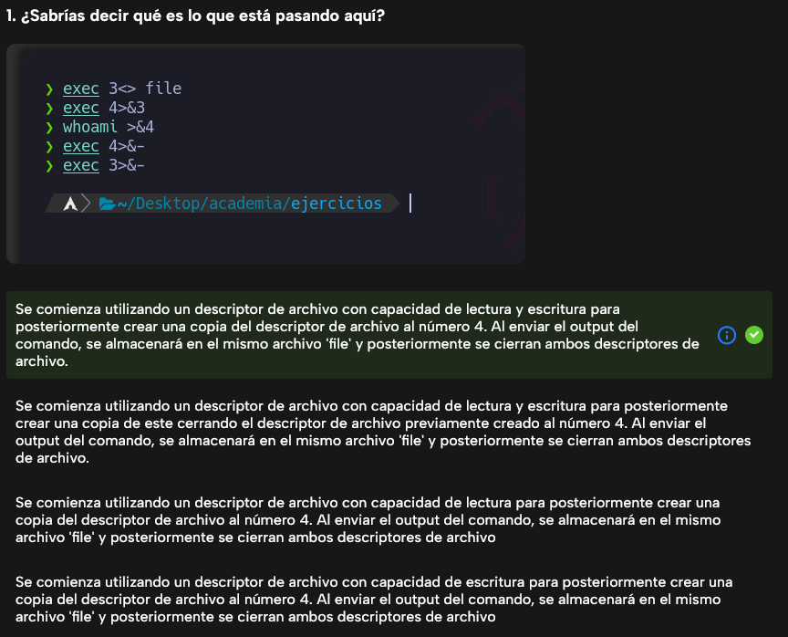
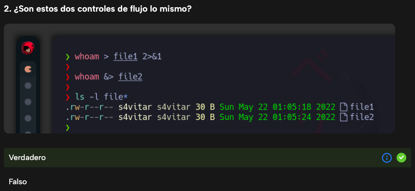
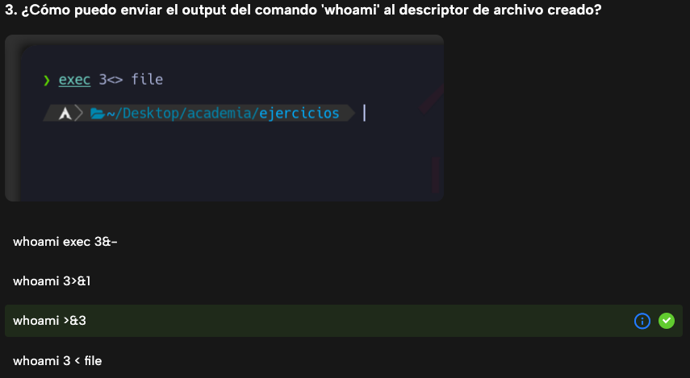
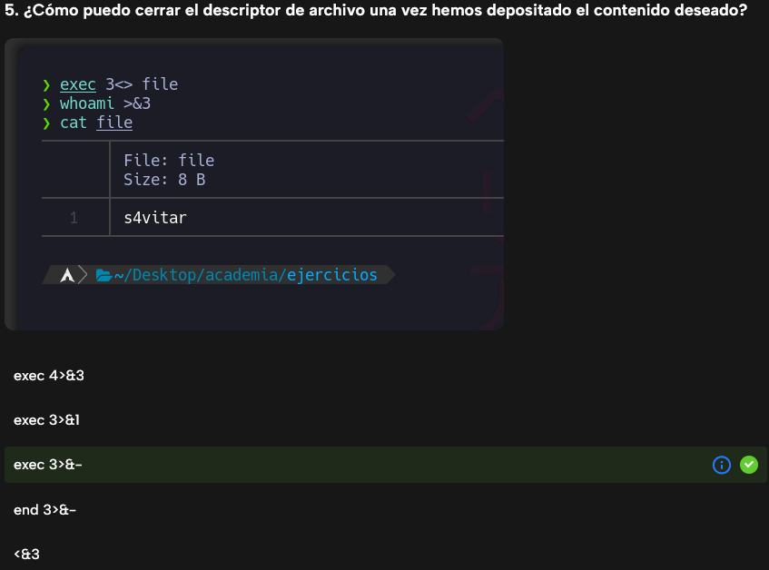

# Redirecciones

```bash
martin@debian12:~$ ls -l > fichero.txt
martin@debian12:~$ ls -l >> fichero.txt
martin@debian12:~$ ls -li > fichero.txt 2>&1
martin@debian12:~$ ls -li &> fichero.txt
martin@debian12:~$ cat < fichero.txt
```

```bash
martin@debian12:~$ cat > fichero.txt << VAI
> hola
> Que
> Tal?
> VAI
martin@debian12:~$ cat fichero.txt
hola
Que
Tal?
```

```bash
martin@debian12:~$ cat /etc/passwd | tail -2 | tee /tmp/pass.tmp
martin:x:1000:1000:martin,,,:/home/martin:/bin/bash
vboxadd:x:999:1::/var/run/vboxadd:/bin/false

martin@debian12:~$ cat /tmp/pass.tmp
martin:x:1000:1000:martin,,,:/home/martin:/bin/bash
vboxadd:x:999:1::/var/run/vboxadd:/bin/false

martin@debian12:~$ sudo cat /etc/shadow | tail -2 | tee -a /tmp/pass.tmp
martin:$y$j9T$D1YstIGhwPXktsEmolZg./$I7fKcY0m9yE2LYgGBEn8yolExy5PLvBTIlZf5keudM3:19770:0:99999:7:::
vboxadd:!:19755::::::

martin@debian12:~$ cat /tmp/pass.tmp
martin:x:1000:1000:martin,,,:/home/martin:/bin/bash
vboxadd:x:999:1::/var/run/vboxadd:/bin/false
martin:$y$j9T$D1YstIGhwPXktsEmolZg./$I7fKcY0m9yE2LYgGBEn8yolExy5PLvBTIlZf5keudM3:19770:0:99999:7:::
vboxadd:!:19755::::::
```

```bash
si@si-VirtualBox:~$ ls > prueba.txt 2>&1
si@si-VirtualBox:~$ cat prueba.txt
Desktop
Documents
Downloads
Music
Pictures
prueba.txt
Public
snap
Templates
Videos
si@si-VirtualBox:~$ lss > prueba.txt 2>&1
si@si-VirtualBox:~$ cat prueba.txt
Command 'lss' not found, but there are 15 similar ones.
```

Hay que tener en cuenta que las salidas de información de `stdin`, `stdout` y `stderr` redirigen al mismo lugar y son los `fd/num` los descriptiones utilizados a la hora de redireccionar la información.

```bash
si@si-VirtualBox:~/Downloads$ ls -l /dev/stdin
lrwxrwxrwx 1 root root 15 jun 15 09:12 /dev/stdin -> /proc/self/fd/0
si@si-VirtualBox:~/Downloads$ ls -l /dev/stdout
lrwxrwxrwx 1 root root 15 jun 15 09:12 /dev/stdout -> /proc/self/fd/1
si@si-VirtualBox:~/Downloads$ ls -l /dev/stderr
lrwxrwxrwx 1 root root 15 jun 15 09:12 /dev/stderr -> /proc/self/fd/2
si@si-VirtualBox:~/Downloads$ ls -l /proc/self/fd/0
lrwx------ 1 si si 64 jun 15 13:16 /proc/self/fd/0 -> /dev/pts/1
si@si-VirtualBox:~/Downloads$ ls -l /proc/self/fd/1
lrwx------ 1 si si 64 jun 15 13:16 /proc/self/fd/1 -> /dev/pts/1
si@si-VirtualBox:~/Downloads$ ls -l /proc/self/fd/2
lrwx------ 1 si si 64 jun 15 13:16 /proc/self/fd/2 -> /dev/pts/1
si@si-VirtualBox:~/Downloads$ ls -l /dev/pts/1
crw--w---- 1 si tty 136, 1 jun 15 13:17 /dev/pts/1
```

_*Nota*_: Tambien existen códigos de error como en el siguiente ejemplo.

## **1. `echo $?` (Código de salida del último comando)**
```bash
┌──(kali㉿kali)-[~]
└─$ whoami
kali

┌──(kali㉿kali)-[~]
└─$ echo $?
0
```
- **Explicación:**  
  - El comando `whoami` muestra el nombre del usuario actual que está ejecutando la terminal. En este caso, el usuario es `kali`.
  - El comando `echo $?` muestra el código de salida del último comando ejecutado.  
  - Como `whoami` se ejecutó correctamente, devuelve `0`, lo que indica **éxito**.

---

## **2. `echo $?` (Código de salida de `ls /noEncontrado`)**
```bash
┌──(kali㉿kali)-[~]
└─$ ls /noEncontrado
ls: cannot access '/noEncontrado': No such file or directory

┌──(kali㉿kali)-[~]
└─$ echo $?
1
```
- **Explicación:**  
  - El comando `ls /noEncontrado` intenta listar el contenido del directorio `/noEncontrado`, pero este no existe.  
  - El error `"No such file or directory"` indica que la ruta especificada no fue encontrada.
  - El código `1` indica un **error de uso incorrecto del comando o fallo específico**. En este caso, se debe a que `ls` no encontró el directorio especificado.

---

## **3. `echo $?` (Código de salida de `whoam`)**
```bash

┌──(kali㉿kali)-[~]
└─$ echo $?
127
```
- **Explicación:**  
  - Esto ocurre porque el comando `whoam` no está en el `PATH` del sistema.
  - El código `127` significa **"comando no encontrado"**, indicando que `whoam` no existe en el sistema.

---

### **Resumen de códigos de salida en este ejemplo**
| Código | Significado |
|--------|------------|
| `0`    | Éxito (el comando `whoami` se ejecutó correctamente). |
| `1`    | Uso incorrecto del comando (`ls` no encontró el directorio especificado). |
| `127`  | Comando no encontrado (`whoam` no existe en el sistema). |

---

### Tabla de ejemplo de las principales redirecciones

| Comando | Descripción |
|---------|------------|
| `cmd > archivo` | Redirige la salida estándar (stdout) de `cmd` a un archivo. |
| `cmd 1> archivo` | Igual que `cmd > archivo`. El descriptor de archivo (fd) predeterminado para stdout es `1`. |
| `cmd 2> archivo` | Redirige la salida de error estándar (stderr) de `cmd` a un archivo. `2` es el fd predeterminado para stderr. |
| `cmd >> archivo` | Agrega la salida estándar de `cmd` a un archivo. |
| `cmd 2>> archivo` | Agrega la salida de error estándar de `cmd` a un archivo. |
| `cmd &> archivo` | Redirige stdout y stderr de `cmd` a un archivo. |
| `cmd > archivo 2>&1` | Otra forma de redirigir stdout y stderr de `cmd` a un archivo. ¡El orden de redirección importa! |
| `cmd > /dev/null` | Descarta la salida estándar de `cmd`. |
| `cmd 2> /dev/null` | Descarta la salida de error estándar de `cmd`. |
| `cmd &> /dev/null` | Descarta stdout y stderr de `cmd`. |
| `cmd < archivo` | Redirige el contenido del archivo a la entrada estándar (stdin) de `cmd`. |
| `cmd <<< "texto"` | Redirige una única línea de texto a stdin de `cmd`. Se llama *here-string*. |
| `exec 2> archivo` | Redirige stderr de todos los comandos a un archivo de manera permanente. |
| `exec 3< archivo` | Abre un archivo para lectura usando un descriptor de archivo personalizado. |
| `exec 3> archivo` | Abre un archivo para escritura usando un descriptor de archivo personalizado. |
| `exec 3<> archivo` | Abre un archivo para lectura y escritura usando un descriptor de archivo personalizado. |
| `exec 3>&-` | Cierra un descriptor de archivo. |
| `exec 4>&3` | Hace que el descriptor de archivo `4` sea una copia del descriptor de archivo `3`. |
| `exec 4>&3-` | Copia el descriptor de archivo `3` en `4` y cierra `3`. |
| `echo "foo" >&3` | Escribe en un descriptor de archivo personalizado. |
| `cat <&3` | Lee desde un descriptor de archivo personalizado. |
| `(cmd1; cmd2) > archivo` | Redirige stdout de múltiples comandos a un archivo (usando un sub-shell). |
| `{ cmd1; cmd2; } > archivo` | Redirige stdout de múltiples comandos a un archivo sin usar un sub-shell (más eficiente). |
| `exec 3<> /dev/tcp/host/puerto` | Abre una conexión TCP a `host:puerto`. (Funcionalidad de Bash, no de Linux). |
| `exec 3<> /dev/udp/host/puerto` | Abre una conexión UDP a `host:puerto`. (Funcionalidad de Bash, no de Linux). |
| `cmd <(cmd1)` | Redirige stdout de `cmd1` a un FIFO anónimo y pasa el FIFO como argumento a `cmd`. |
| `cmd < <(cmd1)` | Redirige stdout de `cmd1` a un FIFO anónimo y lo redirige a stdin de `cmd`. Ejemplo: `diff <(find /ruta1 | sort) <(find /ruta2 | sort)`. |
| `cmd <(cmd1) <(cmd2)` | Redirige stdout de `cmd1` y `cmd2` a dos FIFOs anónimos y los pasa como argumentos a `cmd`. |
| `cmd1 >(cmd2)` | Ejecuta `cmd2` con su stdin conectado a un FIFO anónimo y pasa el nombre del FIFO como argumento a `cmd1`. |
| `cmd1 > >(cmd2)` | Ejecuta `cmd2` con su stdin conectado a un FIFO anónimo y redirige stdout de `cmd1` a este FIFO. |
| `exec {fd}> archivo` | Abre un archivo para escritura usando un descriptor de archivo nombrado `{fd}` (Bash 4.1+). |
| `cmd 3>&1 1>&2 2>&3` | Intercambia stdout y stderr de `cmd`. |
| `cmd > >(cmd1) 2> >(cmd2)` | Envía stdout de `cmd` a `cmd1` y stderr de `cmd` a `cmd2`. |

---

```bash
exec 3<> file
```
(No hay salida)  
Explicación: Se abre el archivo `file` y se asigna al descriptor de archivo 3 en modo lectura y escritura.  

---

```bash
ls      
Desktop  Documents  Downloads  Music  Pictures  Public  Templates  Videos  file
```
Explicación: Lista los archivos y directorios en el directorio actual. Se observa que el archivo `file` ya existe.  

---

```bash
file file
file: empty
```
Explicación: Muestra que `file` existe pero está vacío.  

---

```bash
cat file
```
(Sin salida, porque `file` está vacío)  
Explicación: Intenta mostrar el contenido de `file`, pero no hay nada en él.  

---

```bash
whoami >&3              
```
(No hay salida en la terminal porque se redirigió al descriptor de archivo 3)  
Explicación: `whoami` imprime el nombre del usuario (`kali`), pero la salida se guarda en `file` en lugar de mostrarse en pantalla.  

---

```bash
cat file 
kali
```
Explicación: Ahora `file` contiene `kali`, que fue la salida del comando `whoami`.  

---

```bash
pwd >&3   
```
(No hay salida en la terminal porque se redirigió al descriptor de archivo 3)  
Explicación: `pwd` imprime el directorio actual (`/home/kali`), pero la salida se guarda en `file`.  

---

```bash
cat file
kali
/home/kali
```
Explicación: `file` ahora contiene `kali` y `/home/kali` porque las salidas de `whoami` y `pwd` se guardaron en él.  

---

```bash
exec 3>&-    
```
(No hay salida)  
Explicación: Cierra el descriptor de archivo 3.  

---

```bash
whoami >&3
zsh: 3: bad file descriptor
```
Explicación: Como el descriptor de archivo 3 se cerró previamente, ya no se puede escribir en él.

---

### Cuestionarios





