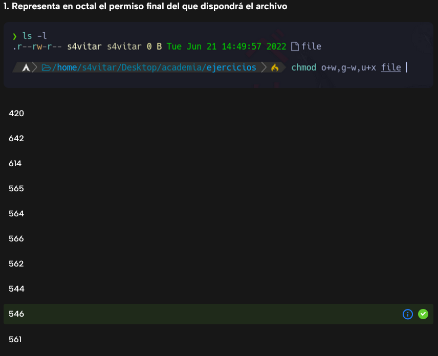
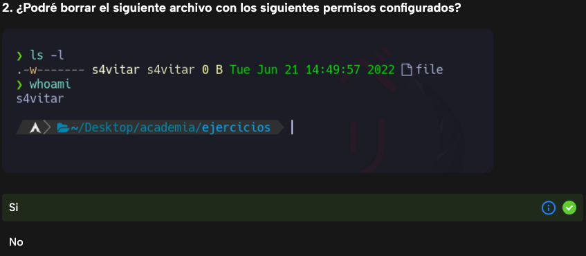
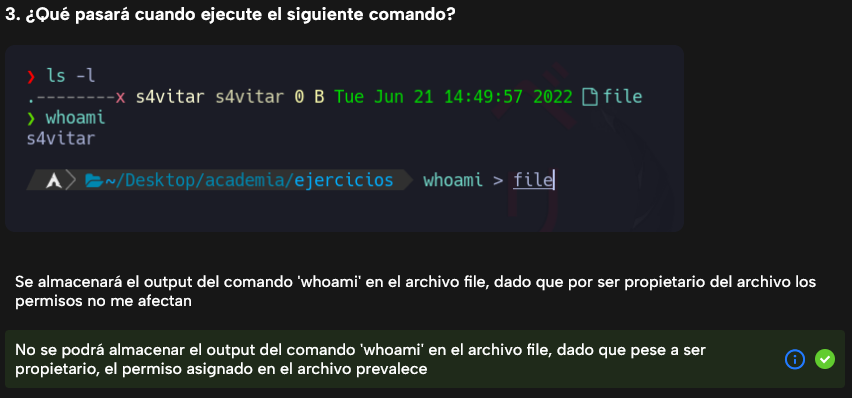
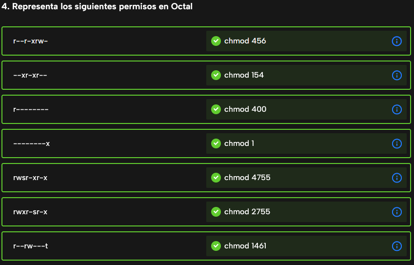
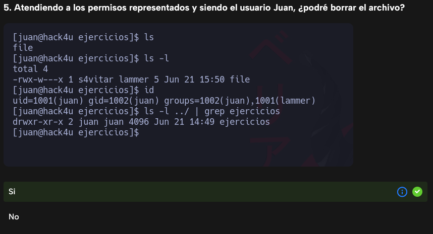
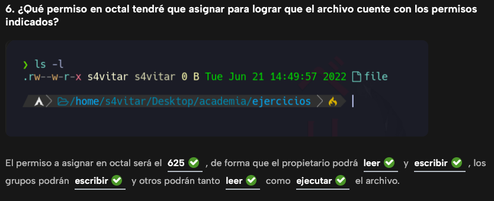
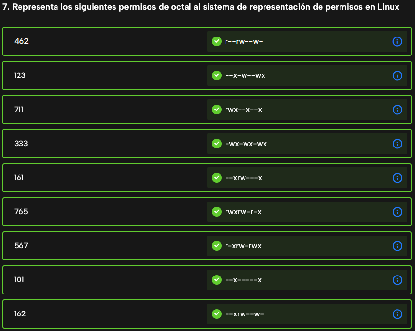
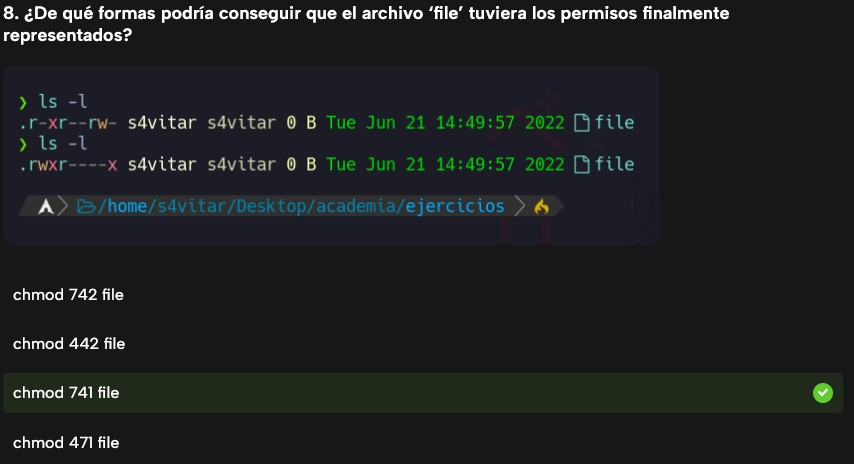

# Gestion de usuarios y permisos

## Archivos de configuración

Los archivos de configuración importantes en sistemas Linux referentes a la gestión de usuarios y grupos son:

- **/etc/passwd**: Almacena información sobre usuarios del sistema, como nombres de usuario, IDs de usuario, directorios de inicio y shell predeterminada.

````bash
martin:x:1000:1000:martin,23,666777888,981234567:/home/martin:/bin/bash```
````

1. `martin`: Usuario.
2. `x`: Usado antiguamente para colocar la clave. En la actualidad no se coloca la clave en este campo (se pone siempre una x) y la clave se coloca en /etc/shadow.
3. `1000`: UID.
4. `1000`: GID.
5. `martin,23,666777888,981234567`: Datos del usuario.
6. `/home/martin`: Directorio de trabajo.
7. `/bin/bash`: Shell.

- **/etc/shadow**: Contiene contraseñas encriptadas de los usuarios y datos de seguridad relacionados, como políticas de contraseñas y fechas de caducidad.

```bash
martin:$6$QeYgJjn3$WUebH8Ku2cb3ZOUVpqA3c.zrCzH38hJrM7m3cE8HQitQBr6FF/4Ussq/gnGzBomMBmCxgjyQamLE8V3GHe.rn1:18792:0:99999:7:::
```

1. `martin`: Nombre de usuario.
2. `$6$QeYgJjn3$WUebH8Ku2cb3ZOUVpqA3c.zrCzH38hJrM7m3cE8HQitQBr6FF/4Ussq/gnGzBomMBmCxgjyQamLE8V3GHe.rn1`: Contraseña cifrada (hash de la contraseña, incluye información sobre el algoritmo de cifrado y la sal).
3. `18792`: Fecha del último cambio de contraseña (en días desde el 1 de enero de 1970).
4. `0`: Días mínimos requeridos antes de poder cambiar la contraseña nuevamente.
5. `99999`: Días máximos que puede usarse la contraseña antes de que expire.
6. `7`: Días de aviso antes de que la contraseña expire.
7. ``: Días de inactividad permitidos después de que la contraseña ha expirado (vacío significa sin restricción).
8. ``: Fecha de expiración de la cuenta (vacío significa que la cuenta no expira).
9. ``: Campo reservado para uso futuro.

- **/etc/group**: Guarda información sobre los grupos del sistema, incluyendo nombres de grupo y listas de usuarios asociados a cada grupo.

```bash
dam:x:1001:martin,lucas
```

1. `dam`: Nombre del grupo.
2. `x`: Contraseña del grupo (generalmente se coloca una "x" para indicar que está encriptada en `/etc/gshadow`).
3. `1001`: GID (identificador de grupo).
4. `martin,lucas`: Lista de usuarios secundarios separados por comas.

- **/etc/gshadow**: Similar a `/etc/shadow`, pero para grupos, almacena contraseñas encriptadas para grupos y datos de seguridad relacionados.

```bash
dam:RsdRTGHtdrs:moncho:lipido,rivelora
```

1. `dam`: Nombre del grupo.
2. `RsdRTGHtdrs`: Contraseña del grupo, así un usuario podrá ingresar al grupo si conoce la contraseña.
3. `moncho`: Administrador del grupo.
4. `lipido,rivelora`: Usuarios que no se quiere que se conozca su pertenencia al grupo.

## su y sudo

```bash
martin@debian12:/etc/sudoers.d$ sudo su -
martin@debian12:/etc/sudoers.d$ sudo su
martin@debian12:/etc/sudoers.d$ sudo -i
martin@debian12:/etc/sudoers.d$ su juan
martin@debian12:/etc/sudoers.d$ su - juan
martin@debian12:/etc/sudoers.d$ su - juan -c "pwd"
martin@debian12:/etc/sudoers.d$ su -l juan
martin@debian12:/etc/sudoers.d$ su --c "pwd"
```

1. `sudo su -`: Inicia un shell interactivo como el usuario root, cargando el entorno de inicio de sesión del usuario root.
2. `sudo su`: Inicia un shell interactivo como el usuario root, heredando el entorno del usuario actual.
3. `sudo -i`: Inicia un nuevo shell interactivo como el usuario root, cargando completamente el entorno de inicio de sesión del usuario root.
4. `su juan`: Cambia al usuario "juan" iniciando un nuevo shell pero sin cargar su entorno de inicio de sesión.
5. `su - juan`: Cambia al usuario "juan" iniciando un nuevo shell y cargando su entorno de inicio de sesión.
6. `su - juan -c "pwd"`: Cambia al usuario "juan", ejecuta el comando "pwd" y luego regresa al usuario actual.
7. `su -l juan`: Cambia al usuario "juan" iniciando un nuevo shell y cargando su entorno de inicio de sesión (equivalente a `su - juan`).
8. `su --c "pwd"`: Intenta ejecutar el comando "pwd" en el shell actual, pero probablemente generaría un error ya que la opción "--c" no es válida para el comando `su`.

## visudo y sudoers

`visudo` es el editor que permite modificar el archivo sudoers.

`sudoers` es el fichero donde se especifican las reglas para poder establecer quienes pueden ejecutar que comandos en nombre de sudo y en que hosts.

```bash
# Alias
Cmnd_Alias RECARGAR_SSH = systemctl restart sshd.service
Host_Alias PC_ALEX = 192.168.1.22

# User privilege specification
root    ALL=(ALL:ALL) ALL

# Allow members of group sudo to execute any command
%sudo   ALL=(ALL:ALL) ALL

martin 192.168.1.14,192.168.1.15=(juan:dam) NOPASSWD: /bin/pwd

%asir 192.168.1.14,192.168.1.15=(juan:dam) /bin/pwd

martin PC_ALEX=(alex) NOPASSWD: RECARGAR_SSH
```

Al final estas entradas especifican para el usuario martin (analogo para el grupo asir) lo siguiente:

- **martin**: El usuario al que se aplica la regla. En este caso, el usuario "martin" puede ejecutar el comando especificado.
- **192.168.1.14,192.168.1.15**: Las direcciones IP de los Host de la red donde el usuario "martin" puede ejecutar el comando.
- **(juan:dam)**: El usuario y el grupo sobre los que martin puede ejecutar comandos en su nombre.
- **NOPASSWD: **: Indica que se puede ejecutar el comando sin que se pregunte la contraseña.
- **/bin/pwd**: El comando permitido.

En el archivo sudoers, cuando especificas una entrada como esta:

```
martin 192.168.1.14,192.168.1.15=(juan:dam) /bin/pwd
```

Significa que el usuario "martin" puede ejecutar el comando `/bin/pwd` **en el host 192.168.1.14** en nombre de juan o del grupo dam. Esto no significa que el usuario "martin" pueda ejecutar el comando `pwd` en su propio sistema local desde cualquier host.

#### id, groups, passwd

**id**: Permite ver uid, gid y grupos secundarios a los que pertenece el usuario.

**groups**: Permite ver unicamente los grupos secundarios del usuario.

```bash
martin@debian12:~$ id
uid=1000(martin) gid=1000(martin) grupos=1000(martin),24(cdrom),25(floppy),27(sudo),29(audio),30(dip),44(video),46(plugdev),100(users),106(netdev),113(bluetooth),116(lpadmin),119(scanner)
martin@debian12:~$ groups
martin cdrom floppy sudo audio dip video plugdev users netdev bluetooth lpadmin scanner

martin@debian12:~$ sudo su -
root@debian12:~# id
uid=0(root) gid=0(root) grupos=0(root)
root@debian12:~# groups
root
```

_*Nota*_: Nótese que el grupo root tiene el id 0.

**passwd**: Permite modificar la contraseña. Los parametros destacables son:

- l: Bloquea el acceso al sistema al usuario (usermod -L). Se pone un ! en el campo de contraseña en el `/etc/shadow`.
- u: Desbloquea el acceso al sistema del usuario (usermod -U).

```bash
martin@debian12:~$ sudo passwd -l martin && sudo tail /etc/shadow | grep martin
passwd: contraseña cambiada.
martin:!$y$j9T$D1YstIGhwPXktsEmolZg./$I7fKcY0m9yE2LYgGBEn8yolExy5PLvBTIlZf5keudM3:19770:0:99999:7:::
martin@debian12:~$ sudo passwd -u martin && sudo tail /etc/shadow | grep martin
passwd: contraseña cambiada.
martin:$y$j9T$D1YstIGhwPXktsEmolZg./$I7fKcY0m9yE2LYgGBEn8yolExy5PLvBTIlZf5keudM3:19770:0:99999:7:::
```

## useradd, usermod, userdel, groupadd, groupdel

**useradd**: Permite añadir nuevos usuarios al sistema.

```bash
useradd -m -d /home/juan -p "$(mkpasswd 'abc123..')" -g sistemas -G dam -s /bin/bash juan
```

```bash
si@si-VirtualBox:~$ sudo useradd -m -d /home/user1 -s /bin/bash -p $(mkpasswd -m sha-512 'abc123.') -G sudo user1
si@si-VirtualBox:~$ tail -1 /etc/passwd && sudo tail -1 /etc/shadow
user1:x:1011:1011::/home/user1:/bin/bash
user1:$6$j0kV4V7Uc2t9RDrY$XHh4NJsZA73bCXMDPkNtU.6D1TC2snGxByWwlwyyaedOd8GMPwG.6jiBxe2ecIIDbOCdBKj04oWUA.77Vrbjo/:19890:0:99999:7:::
si@si-VirtualBox:~$ ls /etc/skel/
scripts_bash
si@si-VirtualBox:~$ sudo ls /home/user1/
scripts_bash
```

```bash
si@si-VirtualBox:~$ sudo useradd -M -d /home/user2 -s /bin/bash -p $(mkpasswd -m sha-512 'abc123.') -G sudo user2
si@si-VirtualBox:~$ sudo ls /home/user2
ls: cannot access '/home/user2': No such file or directory
si@si-VirtualBox:~$ ls /home
nuevo  si  user1
si@si-VirtualBox:~$ tail -1 /etc/passwd
user2:x:1012:1012::/home/user2:/bin/bash
```

_*Nota: Si queremos que un usuario tenga un grupo principal con el mismo nombre, no hay que indicarlo con la opción -g, es automático.*_
_*Nota2: Podemos indicar el algoritmo de cifrado de la contraseña si queremos.*_
_*Nota3: Con el parametro `-m` estamos indicando que se copie la estructura de `/etc/skel` para el nuevo usuario.*_
_*Nota4: Con el parametro `-M` estamos indicando que el usuario no ha de tener un `/home` para el. A pesar de ello en el `/etc/passwd` si va a figurar como que existe la ruta.*_ -_Nota5: Con los parametros `-u` podemos dar un uid específico, `-g` un gid específico y con `-l` cambiar el nombre del usuario._\_

```bash
si@si-VirtualBox:~/Desktop/scripts/ejercicios/ej2$ sudo useradd -m -d /home/alumno -p $(mkpasswd 'abc123.') -s "/bin/bash" alumno

si@si-VirtualBox:~/Desktop/scripts/ejercicios/ej2$ tail -1 /etc/passwd
geoclue:x:124:131::/var/lib/geoclue:/usr/sbin/nologin
pulse:x:125:132:PulseAudio daemon,,,:/run/pulse:/usr/sbin/nologin
gnome-initial-setup:x:126:65534::/run/gnome-initial-setup/:/bin/false
hplip:x:127:7:HPLIP system user,,,:/run/hplip:/bin/false
gdm:x:128:134:Gnome Display Manager:/var/lib/gdm3:/bin/false
si:x:1000:1000:si,,,:/home/si:/bin/bash
vboxadd:x:999:1::/var/run/vboxadd:/bin/false
sshd:x:129:65534::/run/sshd:/usr/sbin/nologin
mysql:x:130:137:MySQL Server,,,:/nonexistent:/bin/false
alumno:x:1001:1001::/home/alumno:/bin/bash

si@si-VirtualBox:~/Desktop/scripts/ejercicios/ej2$ tail -1 /etc/group
pulse:x:132:
pulse-access:x:133:
gdm:x:134:
lxd:x:135:si
si:x:1000:
sambashare:x:136:si
vboxsf:x:999:
vboxdrmipc:x:998:
mysql:x:137:
alumno:x:1001:
```

_*Nota*_: Mótese que hay varios usuarios con el shell como `/bin/false` ya que están pensados para no conectarse al sistema sino ser los propios usuarios de los servicios y no precisan conectarse ni interpretar comandos. Actualmente es más común encontrarse con `/sbin/nologin`.

**usermod**: Permite modificar las propiedades de un usuario existente en el sistema.

```bash
usermod -d /home/juan_nuevo -s /bin/zsh juan
```

**userdel**: Permite eliminar un usuario del sistema.

```bash
userdel -r juan
```

- _*Nota Este comando eliminaría el usuario "juan" del sistema, junto con su directorio de inicio (`-r`), así como cualquier archivo o directorio relacionado con el usuario.*_

**groupadd**: Permite crear un nuevo grupo en el sistema.

```bash
groupadd dam
```

**groupdel**: Permite eliminar un grupo del sistema.

```bash
groupdel dam
```

#### chfn, chsh

**chage**: Permite modificar todos los datos del usuario.
**chfn**: Permite editar los datos personales del usuario.
**chsh**: Permite editar la shell del usuario.

_*Nota*_: Supongamos que creamos un usuario y queremos que en el próximo inicio de sesión, el usuario modifique su password. Para ello podemos usar los comandos `chage -d 0 usuario` o `passwd -e usuario`.

#### gpasswd

Este comando establece la contraseña del grupo y lo administra pudiendo agregar o eliminar un usuario de un grupo. Los usuarios y grupos deben existir.
- *-r*: Elimina la contraseña.
- *-a*: Añade usuario al grupo.
- *-d*: Elimina usuario del grupo.
- *-A*: Añade un administrador o varios al grupo, el cual va a poder agregar o eliminar usuarios del grupo, modificar la contraseña del grupo

La contraseña de grupo le permite a los usuarios añadirse al mismo y poder usar los permisos de este, para ello pueden hacer uso del comando *newgrp*.

#### ulimit

Este comando da control sobre los recursos que dispone el shell y los procesos lanzando por ella. Se puede inicializar en `/etc/profile` o en `~/.bashrc` de cada usuario.

- *-a*: Despliega todas las limitaciones.
- *-f*: Cantidad máxima de archivos creados por la shell.
- *-n*: Cantidad máxima de archivos abiertos.
- *-u*: Cantidad máxima de procesos por usuario.

_*Nota*_: Se pueden establecer límites blandos y duros, en el caso de los blandos nos saldrá una alerta de advertencia diciendo que excedemos dicho límite.

## Campo tipo

Antes de la terna de permisos tendremos un caracter que indica el tipo de archivo en cuestión. Como resumen del campo tipo tenemos:
- -: Archivo regular.
- d: Directorio.
- l: Enlace simbólico.
- b: Dispositivo de bloque.
- c: Dispositivo de carácter.
- p: Pipe con nombre.
- s: Socket.

```bash
root@debian:~# ls
-rw-r--r--: archivo.txt              es un archivo regular.
drwxr-xr-x: directorio               carpeta es un directorio.
lrwxrwxrwx: enlace -> directorio     es un enlace simbólico que apunta a archivo.txt.
brw-rw----: /dev/sda                 es un dispositivo de bloque (probablemente un disco duro).
crw-rw-rw-: /dev/tty0                es un dispositivo de carácter (un terminal).
prw-r--r--: pipe                     es un pipe con nombre.
srwxrwxrwx: socket                   es un socket.
```

## Permisos

A continuación se van a explicar los permisos que pueden existir en un fichero o directorio y como editarlos. Supongamos que tienes un archivo llamado "documento.txt".

1. **Permisos ugo para fichero:**

   - **r (read):** Permite leer el contenido del archivo.
   - **w (write):** Permite modificar el contenido del archivo.
   - **x (execute):** Permite ejecutar el archivo como un programa o script. El propietario o los usuarios autorizados pueden ejecutar el archivo si es ejecutable.

2. **Permisos ugo para directorio:**

   - **r (read):** Permite ver el listado de archivos que contiene el directorio.
   - **w (write):** Permite modificar el contenido del directorio.
   - **x (execute):** Permite acceder al contenido del directorio.

**Ejemplo 1:**

El archivo "documento.txt" tiene permisos de lectura y escritura para el propietario, permisos de lectura para el grupo y permisos de lectura para otros usuarios.

**Representación con números:**

- Propietario: Lectura y escritura (4 + 2 = 6)
- Grupo: Lectura (4)
- Otros: Lectura (4)

Por lo tanto, el comando para establecer estos permisos sería:

```
chmod 644 documento.txt
```

**Representación con letras:**

- Propietario: Lectura y escritura (rw)
- Grupo: Lectura (r)
- Otros: Lectura (r)

El comando sería el mismo:

```
chmod u=rw,g=r,o=r documento.txt
```

**Ejemplo 2:**

El archivo "documento.txt" tiene permisos de lectura, escritura y ejecución para el propietario, permisos de lectura y ejecución para el grupo, y permisos de ejecución para otros usuarios.

**Representación con números:**

- Propietario: Lectura, escritura y ejecución (4 + 2 + 1 = 7)
- Grupo: Lectura y ejecución (4 + 1 = 5)
- Otros: Ejecución (1)

El comando sería:

```
chmod 755 documento.txt
```

**Representación con letras:**

- Propietario: Lectura, escritura y ejecución (rwx)
- Grupo: Lectura y ejecución (r-x)
- Otros: Ejecución (--x)

El comando equivalente sería:

```
chmod u=rwx,g=rx,o=x documento.txt
```

**Ejemplo 3:**

```
chmod u-r,g+rw,o=w documento.txt
```

**Ejemplo 4:**

```
chmod u=rwx,g=rw,o=w documento.txt
```

**Ejemplo 5:**

```
chmod u+wx,g-rw,a=w documento.txt
```

## Máscara de permisos en linux

En Linux, la máscara de permisos (`umask`) es un valor que determina los permisos predeterminados que se asignan a los nuevos archivos y directorios. Cuando se crea un archivo o directorio, el sistema aplica la `umask` para determinar los permisos efectivos.

### Comando `umask`

- **`umask`**: Este comando se utiliza para mostrar o establecer la máscara de permisos actual.

  - **Mostrar la máscara de permisos actual**:

    ```sh
    umask
    ```

    Esto devuelve la máscara de permisos actual en formato octal.

  - **Establecer una nueva máscara de permisos**:
    ```sh
    umask 022
    ```
    Esto establece la máscara de permisos a `022`, que significa que los archivos nuevos tendrán permisos `rw-r--r--` y los directorios `rwxr-xr-x`.

### `umask -S`

- **`umask -S`**: Este comando muestra la máscara de permisos actual en formato simbólico, que puede ser más fácil de entender que el formato octal.

  - **Ejemplo**:
    ```sh
    umask -S
    ```
    Esto podría devolver algo como `u=rwx,g=rx,o=rx`, lo que significa que los permisos de usuario son `rwx`, los permisos de grupo son `rx` y los permisos para otros son `rx`.

### Diferencia en la Asignación de Permisos entre Directorios y Archivos

- **Archivos**:
  Los archivos en Linux nunca se crean con permisos de ejecución por defecto, incluso si la `umask` lo permitiría. Esto es por razones de seguridad para evitar que los archivos de texto o de datos se ejecuten accidentalmente.

  - **Permisos predeterminados**: `666` (rw-rw-rw-)
  - **Aplicación de `umask`**:
    ```sh
    umask 022
    ```
    Resulta en permisos efectivos de `644` (rw-r--r--)

- **Directorios**:
  Los directorios requieren permisos de ejecución para permitir la navegación dentro de ellos. Por lo tanto, se crean con permisos de ejecución si la `umask` lo permite.

  - **Permisos predeterminados**: `777` (rwxrwxrwx)
  - **Aplicación de `umask`**:
    ```sh
    umask 022
    ```
    Resulta en permisos efectivos de `755` (rwxr-xr-x)

## Permisos especiales: Setuid, Setgid, Sticky Bit

### Setuid (Set User ID - SUID)

Es un mecanismo en sistemas Unix y Unix-like que permite que un programa sea ejecutado con los privilegios del propietario del archivo, en lugar de los del usuario que lo ejecuta. Se denota por la letra 's' en el lugar del bit de ejecución del propietario.

Este permiso es fundamental para que un usuario pueda hacer cosas tan simples como cambiar su contraseña de acceso. Básicamente cambiar la contraseña de un usuario distinto de root implica modificar el fichero /etc/shadow el cual tiene permisos rw-r----- y pertenece al usuario root grupo shadow. Con esta configuración de permisos sólo el usuario root puede realizar modificaciones sobre este fichero. Para realizar este cambio de contraseña se usa la herramienta passwd la cual tiene unos permisos especiales (rwsr-xr-x):

```bash
si@si-VirtualBox:~$ which passwd
/usr/bin/passwd
si@si-VirtualBox:~$ ls -la $(which passwd)
-rwsr-xr-x 1 root root 59976 feb  6 13:54 /usr/bin/passwd
si@si-VirtualBox:~$ ls -l /etc/shadow
-rw-r----- 1 root shadow 1536 abr  9 13:07 /etc/shadow
si@si-VirtualBox:~$ sudo cat /etc/shadow | grep -n si:
48:si:$y$j9T$xzdCWBCAVajtbrVsu/dPu0$7bIViJJgWzNPhkT5yk1YLQkZNhhDfdN/vlXO5LB.B49:19725:0:99999:7:::
```

El cambio está en que en los permisos del usuario propietario se ha sustituido una x por una s. Y así es como se representa el permiso Set UID en los ficheros ejecutables el cual es un acrónimo de “set user ID upon execution”. **Un ejecutable con este permiso activado se ejecuta como el usuario propietario (el usuario root en este caso) y no con los privilegios del usuario actual.**

Por último, en Linux cuando un fichero tiene permiso Set UID pero no tiene permiso de ejecución, Linux marca esta circunstancia con una “S” (mayúscula).

```bash
si@si-VirtualBox:~$ echo "Permisos" > fichero.txt
si@si-VirtualBox:~$ ls -l fichero.txt
-rw-rw-r-- 1 si si 9 jun 12 09:23 fichero.txt

si@si-VirtualBox:~$ chmod 4700 fichero.txt
si@si-VirtualBox:~$ ls -l fichero.txt
-rws------ 1 si si 9 jun 12 09:23 fichero.txt

si@si-VirtualBox:~$ chmod u-x fichero.txt
si@si-VirtualBox:~$ ls -l fichero.txt
-rwS------ 1 si si 9 jun 12 09:23 fichero.txt
```

### Setgid (Set Group ID - SGID)

Similar al setuid, el setgid es un mecanismo que permite que un programa se ejecute con los privilegios del grupo del archivo, en lugar de los del usuario que lo ejecuta. Se denota por la letra 's' en el lugar del bit de ejecución del grupo. El permiso Set GID, de forma paralela a Set UID, hace que el grupo de ejecución de un fichero sea el grupo propietario del fichero y no el grupo principal al que pertenece el usuario que lo ejecuta.

El ejemplo más conocido de este tipo de permisos está relacionado también con el fichero /etc/shadow y con /sbin/unix_chkpwd que es un programa que participa en la autentificación de los usuarios junto con PAM.

Como se puede ver en el ejemplo, el fichero /etc/shadow tiene permiso de lectura para el grupo propietario (shadow) de la misma forma que /sbin/unix_chkpwd es un ejecutable cuyo grupo propietario es shadow. Si se ejecuta este programa con el grupo shadow, se obtendrán permisos de acceso de sólo lectura a /etc/shadow y, de esta forma, será posible comprobar la contraseña.

Para asignar permisos de Set GID habrá que anteponer un 2 al permiso en formato numérico (2755) ó usar g+s. Por otra banda, es posible activar Set UID y Set GID a la vez empleando chmod con las especificaciones de permisos 6755 ó u+s g+s.

```bash
si@si-VirtualBox:~$ echo "Permisos" > fichero.txt
si@si-VirtualBox:~$ ls -l fichero.txt
-rw-rw-r-- 1 si si 9 jun 12 10:50 fichero.txt

si@si-VirtualBox:~$ chmod 2070 fichero.txt
si@si-VirtualBox:~$ ls -l fichero.txt
----rws--- 1 si si 9 jun 12 10:50 fichero.txt

si@si-VirtualBox:~$ chmod g-x fichero.txt
si@si-VirtualBox:~$ ls -l fichero.txt
----rwS--- 1 si si 9 jun 12 10:50 fichero.txt
```

### Sticky bit

El Sticky bit es un permiso especial aplicado a directorios en sistemas Unix. Cuando se establece en un directorio, **solo el propietario del archivo o superusuario puede eliminar o renombrar sus archivos**, aunque otros tengan permisos de escritura en el directorio. Se denota por la letra 't' en el lugar del bit de ejecución del otros.

Este permiso permite proteger ficheros dentro de un directorio. Concretamente evita que un usuario pueda borrar ficheros de otros usuarios que se sitúan en una carpeta pública como el directorio /tmp.

Por otro lado, indicar que con la T (mayúscula) indica que no existe el permiso de ejecución para el colectivo otros usuarios que en carpetas significa poder acceder a la carpeta.

```bash
si@si-VirtualBox:~$ sudo groupadd secundaria
si@si-VirtualBox:~$ sudo useradd -m -d /home/juan -p $(mkpasswd 'abc123.') -s /bin/bash -g secundaria -G sudo juan
si@si-VirtualBox:~$ sudo useradd -m -d /home/mateo -p $(mkpasswd 'abc123.') -s /bin/bash -g secundaria -G sudo mateo

si@si-VirtualBox:~$ id juan
uid=1001(juan) gid=1001(secundaria) groups=1001(secundaria),27(sudo)
si@si-VirtualBox:~$ id mateo
uid=1002(mateo) gid=1001(secundaria) groups=1001(secundaria),27(sudo)

si@si-VirtualBox:~$ mkdir /tmp/sticky
si@si-VirtualBox:~$ ls -ld /tmp/sticky/
drwxrwxr-x 2 si si 4096 jun 12 10:58 /tmp/sticky/

si@si-VirtualBox:~$ chmod 1777 /tmp/sticky/
si@si-VirtualBox:~$ ls -ld /tmp/sticky/
drwxrwxrwt 2 si si 4096 jun 12 10:58 /tmp/sticky/

si@si-VirtualBox:~$ su - juan -c "touch /tmp/sticky/fi1.txt"
Password:
si@si-VirtualBox:~$ su - mateo -c "rm /tmp/sticky/fi1.txt"
Password:
rm: remove write-protected regular empty file '/tmp/sticky/fi1.txt'? yes
rm: cannot remove '/tmp/sticky/fi1.txt': Operation not permitted
si@si-VirtualBox:~$ tree /tmp/sticky/
/tmp/sticky/
└── fi1.txt

0 directories, 1 file

si@si-VirtualBox:~$ chmod o-t /tmp/sticky/
si@si-VirtualBox:~$ ls -ld /tmp/sticky/
drwxrwxrwx 2 si si 4096 jun 12 11:04 /tmp/sticky/

si@si-VirtualBox:~$ su - mateo -c "rm /tmp/sticky/fi1.txt"
Password:
rm: remove write-protected regular empty file '/tmp/sticky/fi1.txt'? yes

si@si-VirtualBox:~$ ls -ld /tmp/sticky/
drwxrwxrwx 2 si si 4096 jun 12 11:08 /tmp/sticky/
si@si-VirtualBox:~$ tree /tmp/sticky/
/tmp/sticky/

0 directories, 0 files
```

_*Nota*_: Tambien podríamos hacerlo con `chmod +t`.

### Comando install


El comando `install` en Linux se utiliza para **copiar archivos y establecer permisos** en el sistema de archivos. Aunque su nombre puede ser confuso, no se utiliza para instalar paquetes, sino para mover o copiar archivos de manera controlada.

install [opciones] origen destino

- -d	Crea directorios, similar a mkdir -p.
- -m	Establece los permisos de archivo (por ejemplo, 755).
- -o	Especifica el propietario del archivo.
- -g	Especifica el grupo del archivo.
- -t	Especifica el directorio de destino.
- -v	Muestra información detallada del proceso.
- -p	Preserva los tiempos de acceso y modificación.

1. Copiar un Archivo con Permisos Específicos:
```bash
sudo install -m 755 script.sh /usr/local/bin
```

Copia el archivo script.sh al directorio /usr/local/bin.
Establece permisos 755 (ejecutable para todos, escritura solo para el propietario).

2. Crear un Directorio con Permisos:
```bash
sudo install -d -m 755 /opt/mi_directorio
```

Crea el directorio /opt/mi_directorio con permisos 755.

3. Copiar un Archivo con Propietario y Grupo Específicos:
```bash
sudo install -o root -g root -m 644 archivo.txt /etc/mi_archivo.txt
```

Copia el archivo archivo.txt a /etc/mi_archivo.txt.
El propietario y grupo serán root, y los permisos serán 644.

4. Copiar Múltiples Archivos a un Directorio:
```bash
sudo install -v archivo1 archivo2 archivo3 -t /usr/local/bin
```

Copia varios archivos al directorio /usr/local/bin.
La opción -v muestra detalles de la copia.

#### Usos Comunes:
Instalación Manual de Scripts: Colocar scripts en directorios como /usr/local/bin.
Despliegue de Archivos de Configuración: Copiar archivos de configuración con permisos específicos.
Creación de Estructura de Directorios: Crear rutas completas para aplicaciones.

#### Ejemplo Completo: Despliegue de un Script
Imagina que tienes un script llamado mi_script.sh que deseas copiar a /usr/local/bin con permisos ejecutables para todos:
```bash
sudo install -m 755 mi_script.sh /usr/local/bin
```

### `chattr` y `lsattr`

A mayores existen en Linux a editar con los comandos `chattr` y listar con `lsattr` otros permisos. `chattr` es un comando en sistemas Unix y Linux que se utiliza para cambiar los `atributos` de un archivo en el sistema de archivos. Estos atributos pueden controlar varios aspectos del archivo, como su capacidad de modificación, eliminación o incluso si puede ser movido o renombrado. Uno de los atributos más comunes es el atributo de solo lectura.

- `a` (append only) permite solo añadir datos, útil para registros.
- `i` (immutable) hace el archivo inmutable, impidiendo modificaciones, borrados o renombrados, común en archivos críticos del sistema.

Como ejemplos tenemos:

```bash
si@si-VirtualBox:/tmp/prueba$ ls -l fichero1.txt
-rw-rw-r-- 1 si si 9 abr 13 22:42 fichero1.txt

si@si-VirtualBox:/tmp/prueba$ lsattr fichero1.txt
--------------e------- fichero1.txt

si@si-VirtualBox:/tmp/prueba$ sudo chattr +a fichero1.txt
[sudo] password for si:

si@si-VirtualBox:/tmp/prueba$ lsattr fichero1.txt
-----a--------e------- fichero1.txt

si@si-VirtualBox:/tmp/prueba$ echo "Otra linea" > fichero1.txt
-bash: fichero1.txt: Operation not permitted

si@si-VirtualBox:/tmp/prueba$ echo "Otra linea" >> fichero1.txt

si@si-VirtualBox:/tmp/prueba$ cat fichero1.txt
Fichero1
Otra linea

si@si-VirtualBox:/tmp/prueba$ sudo chattr +i fichero1.txt

si@si-VirtualBox:/tmp/prueba$ echo "Otra nueva linea" >> fichero1.txt
-bash: fichero1.txt: Operation not permitted

si@si-VirtualBox:/tmp/prueba$ sudo echo "Otra nueva linea" >> fichero1.txt
-bash: fichero1.txt: Operation not permitted

si@si-VirtualBox:/tmp/prueba$ lsattr fichero1.txt
----ia--------e------- fichero1.txt

si@si-VirtualBox:/tmp/prueba$ sudo chattr -ai fichero1.txt

si@si-VirtualBox:/tmp/prueba$ lsattr fichero1.txt
--------------e------- fichero1.txt
```

Del mismo modo, ambos comandos son aplicables tambien a directorios, no unicamente a ficheros.

```bash
si@si-VirtualBox:/tmp$ lsattr -d COMUN/
--------------e------- COMUN/

si@si-VirtualBox:/tmp$ sudo chattr +i COMUN/
si@si-VirtualBox:/tmp$ lsattr -d COMUN/
----i---------e------- COMUN/
```

## ACLs

En caso de conflicto entre el usuario propietario/otros (uo de ugo) y las ACLs, prevalecen los permisos uo de ugo.

- `Atributos` → `uo de ugo` → `ACLs`:

En caso de conflicto entre el grupo propietario (g de ugo)/otros grupos distintos del propietario/otros usuarios distintos del propietario y las ACLs, prevalecen las ACLs.

- `Atributos` → `mascara` → `ACLs` → `g de ugo`:

### `Asignar ACLs a usuario`

```bash
setfacl -R -m u:mateo:rwx prueba/
```

```bash
root@si-VirtualBox:/mnt# setfacl -R -m u:mateo:rwx prueba/

root@si-VirtualBox:/mnt# getfacl -R prueba/
# file: prueba/
# owner: root
# group: root
user::rwx
user:mateo:rwx
group::r--
mask::rwx
other::---

# file: prueba//fichero1.txt
# owner: root
# group: root
user::rw-
user:mateo:rwx
group::r--
mask::rwx
other::r--
```

### `Asignar ACLs a grupo`

```bash
setfacl -R -m g:dam:r-x prueba/
```

```bash
root@si-VirtualBox:/mnt# setfacl -R -m g:dam:r-x prueba/

root@si-VirtualBox:/mnt# getfacl -R prueba/
# file: prueba/
# owner: root
# group: root
user::rwx
group::r--
group:dam:r-x
mask::r-x
other::---

# file: prueba//fichero1.txt
# owner: root
# group: root
user::rw-
group::r--
group:dam:r-x
mask::r-x
other::r--
```

### `Asignación de ACL por defecto`

```bash
setfacl -R -d -m g:dam:w prueba/
```

```bash
root@si-VirtualBox:/mnt# setfacl -R -d -m g:dam:w prueba/

root@si-VirtualBox:/mnt# getfacl -R prueba/
# file: prueba/
# owner: root
# group: root
user::rwx
group::r--
other::---
default:user::rwx
default:group::r--
default:group:dam:-w-
default:mask::rw-
default:other::---

# file: prueba//fichero1.txt
# owner: root
# group: root
user::rw-
group::r--
other::r--
```

### `Máscara en ACLs`

```bash
setfacl -m m::rwx prueba/
```

```bash
root@si-VirtualBox:/mnt# setfacl -m m::rwx prueba/

root@si-VirtualBox:/mnt# getfacl -R prueba/
# file: prueba/
# owner: root
# group: root
user::rwx
group::r--
mask::rwx
other::---

# file: prueba//fichero1.txt
# owner: root
# group: root
user::rw-
group::r--
other::r--
```

### `Otros en ACLs`

```bash
setfacl -R -m u::x prueba/
setfacl -R -m g::r prueba/
setfacl -R -m o::w prueba/
```

```bash
root@si-VirtualBox:/mnt# setfacl -R -m u::x prueba/
root@si-VirtualBox:/mnt# setfacl -R -m g::r prueba/
root@si-VirtualBox:/mnt# setfacl -R -m o::w prueba/
root@si-VirtualBox:/mnt# getfacl -R prueba/
# file: prueba/
# owner: root
# group: root
user::--x
group::r--
mask::r--
other::-w-

# file: prueba//fichero1.txt
# owner: root
# group: root
user::--x
group::r--
other::-w-
```

### `Eliminar ACLs`

```bash
setfacl -R -b -k datosEmpresa/
```

- -R: Para que el comando se aplique de forma recursiva.
- -b: Elimina las ACL.
- -k: Elimina las ACL por defecto.

```bash
root@si-VirtualBox:/mnt# setfacl -R -b -k prueba/

root@si-VirtualBox:/mnt# getfacl -R prueba/
# file: prueba/
# owner: root
# group: root
user::rwx
group::r--
other::---

# file: prueba//fichero1.txt
# owner: root
# group: root
user::rw-
group::r--
other::r--
```

### `Eliminar ACLs de un usuario/grupo`

```bash
si@si-VirtualBox:/tmp$ getfacl prueba/
# file: prueba/
# owner: si
# group: si
user::rwx
user:carmencita:r-x
group::rwx
mask::rwx
other::r-x

si@si-VirtualBox:/tmp$ setfacl -x u:carmencita prueba/
si@si-VirtualBox:/tmp$ getfacl prueba/
# file: prueba/
# owner: si
# group: si
user::rwx
group::rwx
mask::rwx
other::r-x
```

```bash
si@si-VirtualBox:/tmp$ getfacl prueba/
# file: prueba/
# owner: si
# group: si
user::rwx
group::rwx
group:primaria:r-x
mask::rwx
other::r-x

si@si-VirtualBox:/tmp$ setfacl -x g:primaria prueba/
si@si-VirtualBox:/tmp$ getfacl prueba/
# file: prueba/
# owner: si
# group: si
user::rwx
group::rwx
mask::rwx
other::r-x
```

_*Notas: Es importante tener en cuenta que las ACL añaden tal cual los permisos que se especifican, es decir `g:dam:r-x` asigna solo permisos a dam de lectura y ejecución, igual que `g:dam:rx`. En caso de que existiera el permiso de escritura, este habría desaparecido.*_

_*Notas 2: Cuando añadimos ACLs a un fichero o directorio aparece un signo `+` al final de los permisos UGO.*_

```bash
-rw-rwx---+ 1 root root 8 abr 13 20:29 fichero1.txt
```

_*Notas 3: Es incorrecto hacer `setfacl -m u:rw prueba/` o `setfacl -m g:r-w prueba/` pero **si es correcto** hacer `setfacl -m o:rw prueba/` o `setfacl -m m:rw prueba/`.*_

_*Nota 4: Se pueden juntar los parametros de una ACL para realzar algo como lo siguiente `setfacl -Rbk prueba/`.*_

_*Nota 5: Los permisos de otros son acumulativos, como podemos ver en el siguiente ejemplo, si no eliminamos los permisos de otros se van a añadir a los del usuario. Este es el motivo por el cual lucia que pertenece a dam puede en el primer caso listar el contenido de `/tmp/prueba` y una vez eliminamos los permisos de otros ya no puede.*_

```bash
si@si-VirtualBox:/tmp$ id lucia
uid=1001(lucia) gid=1001(lucia) groups=1001(lucia),27(sudo),1003(dam)
si@si-VirtualBox:/tmp$ getfacl prueba/ -e
# file: prueba/
# owner: si
# group: si
user::rwx
group::rwx                      #effective:---
group:dam:r-x                   #effective:---
mask::---
other::r-x

si@si-VirtualBox:/tmp$ sudo -u lucia ls -l /tmp/prueba
total 0
-rw-rw-r-- 1 si si 0 jun 11 11:29 fichero.txt
si@si-VirtualBox:/tmp$ sudo setfacl -R -m o::- prueba/
si@si-VirtualBox:/tmp$ sudo setfacl -R -m m::- prueba/
si@si-VirtualBox:/tmp$ getfacl prueba/ -e
# file: prueba/
# owner: si
# group: si
user::rwx
group::rwx                      #effective:---
group:dam:r-x                   #effective:---
mask::---
other::---

si@si-VirtualBox:/tmp$ sudo -u lucia ls -l /tmp/prueba
ls: cannot open directory '/tmp/prueba': Permission denied
```

## Capabilities

**getcap, setcap**

- **getcap**: Visualiza las capabilities de archivos.
- **setcap**: Modifica las capabilities de archivos.

### **Capabilities**
Las capabilities en GNU/Linux son un sistema más granular de control de acceso que se utiliza principalmente para elevar los privilegios de ejecución de un programa o binario específico sin otorgarle privilegios totales.

Permiten a los programas realizar operaciones específicas que normalmente requerirían privilegios elevados, pero solo durante la ejecución de ese programa en particular. En las capabilities, la cadena `=eip` se utiliza para asignar capacidades específicas a un archivo binario. Cada letra en la cadena tiene un significado particular:

- **e → "Effective" (Efectiva)**: Indica que la capacidad se aplica al usuario efectivo del proceso, es decir, al usuario que está ejecutando el programa.
- **i → "Inheritable" (Hereditaria)**: Indica que la capacidad es heredada por los procesos creados por el programa actual.
- **p → "Permitted" (Permitida)**: Indica que la capacidad está permitida para el programa actual.

Cuando se asigna `=eip` a un archivo binario, se otorgan las capabilities especificadas de la siguiente manera:

- El usuario efectivo del proceso puede utilizar la capability especificada (**Effective**).
- Los procesos creados por este programa heredan la capability (**Inheritable**).
- La capability está permitida para el programa actual (**Permitted**).

En resumen, `=eip` establece las capabilities de manera efectiva, heredable y permitida para el programa binario al que se le asigna. Este tipo de configuración puede utilizarse para permitir que un programa ejecute operaciones específicas con privilegios elevados sin otorgarle todos los privilegios de root.

Para más información, se puede consultar la página de manual referente a capabilities:
```bash
$ man capabilities
```

### **Tipos de capabilities**
Existen diferentes tipos de capabilities que se pueden asignar a un binario. Algunas de ellas son:

| **Capability**           | **Explicación** |
|--------------------------|-------------------------------------------|
| **CAP_CHOWN**            | Permite cambiar el propietario de archivos. |
| **CAP_DAC_OVERRIDE**     | Permite anular permisos de acceso a archivos. |
| **CAP_DAC_READ_SEARCH**  | Permite leer archivos y directorios. |
| **CAP_FOWNER**           | Permite eludir restricciones de control de acceso a archivos. |
| **CAP_FSETID**           | Permite establecer bits setuid y setgid en archivos. |
| **CAP_KILL**             | Permite enviar señales a otros procesos. |
| **CAP_SETGID**           | Permite cambiar el grupo efectivo del proceso. |
| **CAP_SETUID**           | Permite cambiar el usuario efectivo del proceso. |
| **CAP_NET_BIND_SERVICE** | Permite enlazar sockets a puertos privilegiados (<1024). |
| **CAP_NET_RAW**          | Permite usar sockets de red RAW. |

Este sistema proporciona un mayor control y seguridad en la ejecución de programas sin necesidad de conceder permisos root completos.

```bash
┌──(kali㉿kali)-[~]
└─$ getcap -r / 2>/dev/null
/usr/lib/x86_64-linux-gnu/gstreamer1.0/gstreamer-1.0/gst-ptp-helper cap_net_bind_service,cap_net_admin,cap_sys_nice=ep
/usr/lib/nmap/nmap cap_net_bind_service,cap_net_admin,cap_net_raw=eip
/usr/bin/ping cap_net_raw=ep
/usr/bin/fping cap_net_raw=ep
/usr/bin/dumpcap cap_net_admin,cap_net_raw=eip
```

Como prueba vamos a otorgar capabilities a vim para que cualquier usuario modifique el /etc/passwd.

En el siguiente conjunto de comandos se inspecciona la ubicación y permisos del editor **Vim** y revisa si tiene **capabilities** asignadas:  

1. `ls -l /etc/passwd` → Muestra los permisos y detalles del archivo `/etc/passwd`, donde se almacenan los usuarios del sistema.  
2. `whereis vim` → Localiza los archivos relacionados con Vim.  
3. `ls -l $(which vim)` → Verifica qué binario se ejecuta al usar `vim`, revelando que es un enlace simbólico.  
4. `ls -l /etc/alternatives/vim` → Confirma que Vim apunta a `/usr/bin/vim.basic` mediante el sistema de alternativas.  
5. `ls -l /usr/bin/vim.basic` → Muestra permisos y detalles del binario real de Vim.  
6. `getcap /usr/bin/vim.basic` → Comprueba si el binario tiene **capabilities** especiales asignadas.

```bash
┌──(kali㉿kali)-[~]
└─$ ls -l /etc/passwd
-rw-r--r-- 1 root root 3364 Feb 11 09:30 /etc/passwd

┌──(kali㉿kali)-[~]
└─$ whereis vim
vim: /usr/bin/vim /etc/vim /usr/share/vim /usr/share/man/man1/vim.1.gz

┌──(kali㉿kali)-[~]
└─$ ls -l $(which vim)
lrwxrwxrwx 1 root root 21 Feb 10 11:47 /usr/bin/vim -> /etc/alternatives/vim

┌──(kali㉿kali)-[~]
└─$ ls -l /etc/alternatives/vim
lrwxrwxrwx 1 root root 18 Feb 10 11:47 /etc/alternatives/vim -> /usr/bin/vim.basic

┌──(kali㉿kali)-[~]
└─$ ls -l /usr/bin/vim.basic
-rwxr-xr-x 1 root root 3883352 Nov 13 12:33 /usr/bin/vim.basic

┌──(kali㉿kali)-[~]
└─$ getcap /usr/bin/vim.basic
```

En el siguiente conjunto de comandos se otorga y verifica una **capability** especial al binario de Vim:  

1. `sudo setcap cap_dac_override=ep /usr/bin/vim.basic` → Asigna la capability **CAP_DAC_OVERRIDE** a Vim, permitiéndole ignorar permisos de acceso a archivos.  
2. `getcap /usr/bin/vim.basic` → Verifica que la capability fue aplicada correctamente, mostrando que Vim ahora tiene **CAP_DAC_OVERRIDE** activado. 🚀

```bash
┌──(kali㉿kali)-[~]
└─$ sudo setcap cap_dac_override=ep /usr/bin/vim.basic
[sudo] password for kali:

┌──(kali㉿kali)-[~]
└─$ getcap /usr/bin/vim.basic
/usr/bin/vim.basic cap_dac_override=ep
```

En el siguiente conjunto de comandos se crea un usuario, inicia sesión con él y verifica su información:  

1. `sudo useradd -s /bin/bash -p $(mkpasswd 'abc123.') -m -d /home/pepe pepe` → Crea el usuario **pepe** con el shell Bash, establece su contraseña y genera su directorio home.  
2. `su - pepe` → Inicia sesión como el usuario **pepe**.  
3. `pwd` → Confirma que la sesión está en el directorio home del usuario (**/home/pepe**).  
4. `id` → Muestra el UID, GID y grupos a los que pertenece **pepe**.  
5. `exit` → Cierra la sesión del usuario **pepe** y vuelve al usuario anterior. 🚀

```bash
┌──(kali㉿kali)-[~]
└─$ sudo useradd -s /bin/bash -p $(mkpasswd 'abc123.' ) -m -d /home/pepe pepe

┌──(kali㉿kali)-[~]
└─$ su - pepe
Password:
┌──(pepe㉿kali)-[~]
└─$ pwd
/home/pepe

┌──(pepe㉿kali)-[~]
└─$ id
uid=1001(pepe) gid=1001(pepe) groups=1001(pepe)

┌──(pepe㉿kali)-[~]
└─$ exit
logout
```

En el siguiente conjunto de comandos se **otorga privilegios de root** al usuario **pepe** editando el archivo `/etc/passwd`:  

1. `vim /etc/passwd` → Abre el archivo de usuarios del sistema para edición.  
2. `cat /etc/passwd | grep ':0:'` → Busca usuarios con **UID 0**, que tienen privilegios de **root**.  
   - Se observa que **pepe** tiene `0:1001`, lo que significa que ahora tiene UID 0 (equivalente a root).  
3. `su - pepe` → Inicia sesión como **pepe**, pero debido a su UID 0, se convierte en **root**.  
4. `whoami` → Confirma que ahora el usuario **pepe** es en realidad **root**.  

Modificar `/etc/passwd` para asignar UID 0 a un usuario es un **gran riesgo de seguridad**, ya que cualquier usuario con UID 0 tiene **control total** del sistema.

```bash
┌──(kali㉿kali)-[~]
└─$ vim /etc/passwd

┌──(kali㉿kali)-[~]
└─$ cat /etc/passwd | grep ':0:'
root:x:0:0:root:/root:/usr/bin/zsh
pepe:x:0:1001::/home/pepe:/bin/bash

┌──(kali㉿kali)-[~]
└─$ su - pepe

Password:
┌──(root㉿kali)-[~]
└─# whoami
root
```

En el siguiente conjunto de comandos se **elimina las capabilities de Vim**, pero el usuario **pepe** sigue teniendo privilegios de root:  

1. `sudo setcap -r /usr/bin/vim.basic` → **Elimina todas las capabilities** de Vim, incluyendo `CAP_DAC_OVERRIDE`, que permitía ignorar permisos de archivos.  
2. `getcap /usr/bin/vim.basic` → Verifica que Vim ya **no tiene capabilities asignadas**.  
3. `su - pepe` → Inicia sesión como **pepe**, pero sigue teniendo UID `0`, es decir, aún es **root**.  
4. `vim /etc/passwd` → Abre `/etc/passwd` con Vim, lo que sigue siendo posible porque **pepe sigue siendo root**, aunque ya no tenga capabilities en Vim.  

__*Nota*_: Aunque se eliminaron las capabilities de Vim, el usuario **pepe** aún es root debido a su UID 0.

```bash
┌──(kali㉿kali)-[~]
└─$ sudo setcap -r /usr/bin/vim.basic

┌──(kali㉿kali)-[~]
└─$ getcap /usr/bin/vim.basic

┌──(kali㉿kali)-[~]
└─$ su - pepe
Password:
┌──(root㉿kali)-[~]
└─# vim /etc/passwd
ERROR, ya no se puede modificar de esta forma el /etc/passwd
```

Especialmente interesante es el recurso [gtfobins](https://gtfobins.github.io/) donde tenemos diferentes formas de **explotar capabilities** en un sistema.

## Comandos para ver a usuarios conectados en el sistema

| Comando              | Descripción                                                                                     |
|----------------------|-------------------------------------------------------------------------------------------------|
| who                  | Muestra los usuarios actualmente conectados.                                                    |
| w                    | Muestra usuarios conectados y sus actividades actuales.                                         |
| last                 | Muestra el historial de inicios de sesión.                                                      |
| lastlog              | Muestra el último inicio de sesión de cada usuario.                                             |
| whoami               | Muestra el nombre del usuario actual.                                                           |
| id                   | Muestra el UID, GID y grupos del usuario actual.                                                |
| finger               | Muestra información detallada sobre un usuario.                                                 |
| uptime               | Muestra el tiempo de actividad del sistema y el número de usuarios conectados.                  |
| ps aux               | Muestra todos los procesos del sistema, incluyendo los de los usuarios.                         |
| watch                | Ejecuta un comando repetidamente para monitorear en tiempo real.                                |
| pkill -KILL -u       | Termina todos los procesos de un usuario específico.                                            |
| loginctl             | Gestiona y monitorea sesiones de usuarios en sistemas con systemd (systemd-logind).             |

## Comando loginctl

El comando **loginctl** es una herramienta para gestionar y monitorizar sesiones de usuario, usuarios y asientos en sistemas Linux que usan systemd (systemd-logind).Sus principales comandos y opciones:
- **list-sessions**: Lista todas las sesiones de usuario activas en el sistema.
- **session-status ID**: Muestra información resumida sobre una sesión específica.
- **show-session ID**: Muestra información detallada y propiedades de una sesión específica.
- **terminate-session ID**: Finaliza una sesión de usuario específica de forma controlada.
- **kill-session ID**: Finaliza abruptamente una sesión y todos sus procesos asociados.
- **list-users**: Muestra los usuarios conectados actualmente al sistema.
- **user-status usuario**: Muestra todas las sesiones abiertas por un usuario específico.
- **show-user usuario**: Muestra información detallada sobre un usuario conectado.
- **terminate-user usuario**: Finaliza todas las sesiones de un usuario específico.
- **kill-user usuario**: Mata todos los procesos y sesiones de un usuario específico de forma inmediata.

---
Respuesta de Perplexity: pplx.ai/share
---

### Cuestionarios








