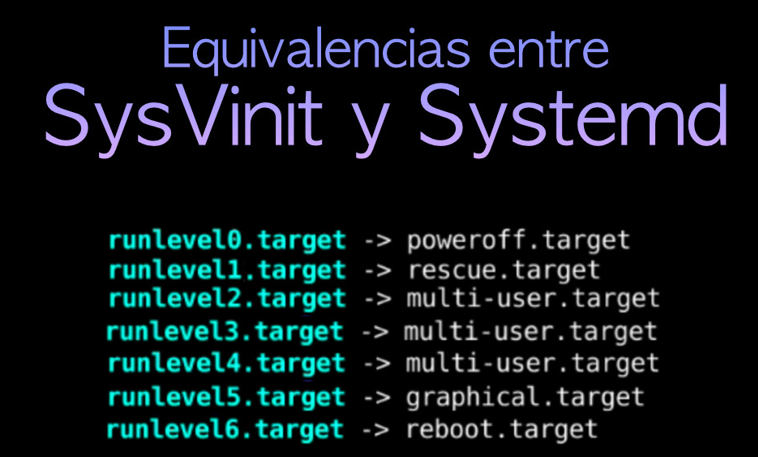

# Iniciadores del sistema: SysVinit, Systemd, Upstart

Podemos encontrar tres tipos de procesos encargados de iniciar y gestionar los servicios o demonios de entornos Linux.

- **SysVinit**: Utiliza Script y niveles de ejecución para controlar el inicio, apagado y gestión de los procesos del sistema.
- **Systemd**: Desde el 2015, las principales distribuciones de Linux lo han adoptado como su sistema de inicio. Agrupa los servicios en "target" en lugar de runlevel, estableciendo en ellos dependencias y el orden de ejecución de los procesos.
- **Upstar**: Utiliza eventos para gestionar el arranque o parada de los procesos.

En SysVinit el fichero `/etc/inittab` tiene la configuración básica como el nivel de ejecución por defecto y las acciones a tomar en determinadas situaciones.

- Se definen niveles de ejecución y qué se hará en cada uno de ellos. Se invoca al script rc que puede estar en `/etc/rc.d/` , `/etc/init.d/` (depende de la distribución), pasándole por parámetro el nivel de ejecución. En `/etc/init.d/` están los scripts reales para gestionar los servicios del sistema. Los enlaces en `/etc/rcN.d/` apuntan a estos scripts y determinan qué servicios se inician o detienen en cada nivel de ejecución
- rc ejecuta los ficheros que hay en el directorio `/etc/rcN.d/` por orden numérico (siendo N el nivel de ejecución). Estos ficheros serán enlaces que empiezan por S o K y que apuntan a script que están en `/etc/init.d/`
- Si el enlace empieza por S, rc le pasará el comando start y si empieza por K le pasará stop.
- Los runlevels (niveles de ejecución) son una característica del sistema init de Unix y Linux que determinan qué servicios y procesos se ejecutan en un momento dado. En sistemas modernos basados en systemd, que es el caso de muchas distribuciones recientes, los runlevels tradicionales han sido reemplazados por "targets". Sin embargo, la idea general sigue siendo la misma: diferentes niveles de ejecución representan diferentes configuraciones del sistema.

A continuación se adjunta una descripción general de los runlevels tradicionales en sistemas que utilizan System V init:

- **Runlevel 0**: Apagado del sistema.
- **Runlevel 1 o S**: Monousuario sin red para rescate del sistema operativo. Solo se ejecuta un conjunto mínimo de servicios y no se inicia el entorno gráfico.
- **Runlevel 2**: Multiusuario sin red. Similar al nivel de ejecución 3, pero sin servicios de red.
- **Runlevel 3**: Multiusuario con red. El sistema arranca en modo multiusuario y se inician todos los servicios necesarios para permitir conexiones de red.
- **Runlevel 4**: Reservado para un uso personalizado. Por lo general, no se utiliza en las distribuciones estándar de Linux.
- **Runlevel 5**: Multiusuario con interfaz gráfica (GUI). Similar al nivel de ejecución 3, pero también inicia el entorno gráfico.
- **Runlevel 6**: Reinicio del sistema.

## `SysVinit`

En SysVinit partiendo de la configuración del `/etc/inittab`.

El script `rc` ejecuta los ficheros que existen en `/etc/rcN.d` siendo `N` el nivel de ejecución. Estos ficheros serán enlaces a /etc/init.d que comenzarán por `S` para iniciar el servicio o `K` para terminar con el servicio, en un primer momento se detienen los procesos que comienzan por `K` y a continuación se arrancan aquellos que comienzan por `S`. Como podemos ver los servicios son enlaces simbólicos a la dirección `/etc/init.d` y la nomenclaruta de estos servicios siempre es _S|K[orden numérica][nombre servicio]_

```bash
root@debian:/# ls -ld /etc/rc*
drwxr-xr-x 2 root root 4096 abr 13 14:05 /etc/rc0.d
drwxr-xr-x 2 root root 4096 abr 13 14:05 /etc/rc1.d
drwxr-xr-x 2 root root 4096 feb  2 17:52 /etc/rcS.d
drwxr-xr-x 2 root root 4096 abr 13 14:05 /etc/rc2.d
drwxr-xr-x 2 root root 4096 abr 13 14:05 /etc/rc3.d
drwxr-xr-x 2 root root 4096 abr 13 14:05 /etc/rc4.d
drwxr-xr-x 2 root root 4096 abr 13 14:05 /etc/rc5.d
drwxr-xr-x 2 root root 4096 abr 13 14:05 /etc/rc6.d

root@debian:/# ls -l /etc/rc*

/etc/rc0.d:
total 0
lrwxrwxrwx 1 root root 20 feb  2 17:52 K01alsa-utils -> ../init.d/alsa-utils
lrwxrwxrwx 1 root root 19 feb  2 17:52 K01bluetooth -> ../init.d/bluetooth
lrwxrwxrwx 1 root root 20 feb  2 17:52 K01cryptdisks -> ../init.d/cryptdisks
lrwxrwxrwx 1 root root 26 feb  2 17:52 K01cryptdisks-early -> ../init.d/cryptdisks-early
lrwxrwxrwx 1 root root 22 feb  2 17:52 K01cups-browsed -> ../init.d/cups-browsed
lrwxrwxrwx 1 root root 15 feb  2 17:52 K01exim4 -> ../init.d/exim4
lrwxrwxrwx 1 root root 20 feb  2 17:52 K01hwclock.sh -> ../init.d/hwclock.sh
lrwxrwxrwx 1 root root 17 feb  2 17:52 K01lightdm -> ../init.d/lightdm
lrwxrwxrwx 1 root root 20 feb  2 17:52 K01live-tools -> ../init.d/live-tools
lrwxrwxrwx 1 root root 15 feb  2 17:52 K01mdadm -> ../init.d/mdadm
lrwxrwxrwx 1 root root 24 feb  2 17:52 K01mdadm-waitidle -> ../init.d/mdadm-waitidle
lrwxrwxrwx 1 root root 20 feb  2 17:52 K01networking -> ../init.d/networking
lrwxrwxrwx 1 root root 18 feb  2 17:52 K01plymouth -> ../init.d/plymouth
lrwxrwxrwx 1 root root 37 feb  2 17:52 K01pulseaudio-enable-autospawn -> ../init.d/pulseaudio-enable-autospawn
lrwxrwxrwx 1 root root 15 feb  2 17:52 K01saned -> ../init.d/saned
lrwxrwxrwx 1 root root 23 feb  2 17:52 K01smartmontools -> ../init.d/smartmontools
lrwxrwxrwx 1 root root 27 feb  2 17:52 K01speech-dispatcher -> ../init.d/speech-dispatcher
lrwxrwxrwx 1 root root 14 feb  2 17:52 K01udev -> ../init.d/udev
lrwxrwxrwx 1 root root 15 feb  2 17:52 K01uuidd -> ../init.d/uuidd

/etc/rc1.d:
total 0
lrwxrwxrwx 1 root root 20 feb  2 17:52 K01alsa-utils -> ../init.d/alsa-utils
lrwxrwxrwx 1 root root 19 feb  2 17:52 K01bluetooth -> ../init.d/bluetooth
lrwxrwxrwx 1 root root 14 feb  2 17:52 K01cups -> ../init.d/cups
lrwxrwxrwx 1 root root 22 feb  2 17:52 K01cups-browsed -> ../init.d/cups-browsed
lrwxrwxrwx 1 root root 15 feb  2 17:52 K01exim4 -> ../init.d/exim4
lrwxrwxrwx 1 root root 17 feb  2 17:52 K01lightdm -> ../init.d/lightdm
lrwxrwxrwx 1 root root 15 feb  2 17:52 K01mdadm -> ../init.d/mdadm
lrwxrwxrwx 1 root root 37 feb  2 17:52 K01pulseaudio-enable-autospawn -> ../init.d/pulseaudio-enable-autospawn
lrwxrwxrwx 1 root root 15 feb  2 17:52 K01saned -> ../init.d/saned
lrwxrwxrwx 1 root root 23 feb  2 17:52 K01smartmontools -> ../init.d/smartmontools
lrwxrwxrwx 1 root root 27 feb  2 17:52 K01speech-dispatcher -> ../init.d/speech-dispatcher
lrwxrwxrwx 1 root root 15 feb  2 17:52 K01uuidd -> ../init.d/uuidd

/etc/rc2.d:
total 0
lrwxrwxrwx 1 root root 27 feb  2 17:52 K01speech-dispatcher -> ../init.d/speech-dispatcher
lrwxrwxrwx 1 root root 17 feb  2 17:52 S01anacron -> ../init.d/anacron
lrwxrwxrwx 1 root root 19 feb  2 17:52 S01bluetooth -> ../init.d/bluetooth
lrwxrwxrwx 1 root root 26 feb  2 17:52 S01console-setup.sh -> ../init.d/console-setup.sh
lrwxrwxrwx 1 root root 14 feb  2 17:52 S01cron -> ../init.d/cron
lrwxrwxrwx 1 root root 14 feb  2 17:52 S01cups -> ../init.d/cups
lrwxrwxrwx 1 root root 22 feb  2 17:52 S01cups-browsed -> ../init.d/cups-browsed
lrwxrwxrwx 1 root root 14 feb  2 17:52 S01dbus -> ../init.d/dbus
lrwxrwxrwx 1 root root 15 feb  2 17:52 S01exim4 -> ../init.d/exim4
lrwxrwxrwx 1 root root 17 feb  2 17:52 S01lightdm -> ../init.d/lightdm
lrwxrwxrwx 1 root root 15 feb  2 17:52 S01mdadm -> ../init.d/mdadm
lrwxrwxrwx 1 root root 18 feb  2 17:52 S01plymouth -> ../init.d/plymouth
lrwxrwxrwx 1 root root 37 feb  2 17:52 S01pulseaudio-enable-autospawn -> ../init.d/pulseaudio-enable-autospawn
lrwxrwxrwx 1 root root 15 feb  2 17:52 S01rsync -> ../init.d/rsync
lrwxrwxrwx 1 root root 15 feb  2 17:52 S01saned -> ../init.d/saned
lrwxrwxrwx 1 root root 23 feb  2 17:52 S01smartmontools -> ../init.d/smartmontools
lrwxrwxrwx 1 root root 13 abr 12 19:14 S01ssh -> ../init.d/ssh
lrwxrwxrwx 1 root root 14 feb  2 17:52 S01sudo -> ../init.d/sudo
lrwxrwxrwx 1 root root 17 feb  2 17:52 S01sysstat -> ../init.d/sysstat
lrwxrwxrwx 1 root root 15 feb  2 17:52 S01uuidd -> ../init.d/uuidd

/etc/rc3.d:
...

/etc/rc4.d:
...

/etc/rc5.d:
...

/etc/rc6.d:
...
```

Como comandos destacamos:

- El comando **runlevel** muestra el nivel de ejecución.

```bash
root@usuario:/etc# runlevel
N 5
```

- Para cambiar entre niveles puedo usar los comandos **init** o **telinit**.

```bash
root@usuario:/etc# init 6
Connection to localhost closed by remote host.
Connection to localhost closed.
```

```bash
root@usuario:~# telinit 6
Connection to localhost closed by remote host.
Connection to localhost closed.
```

- Con el comando **update-rc.d** puedo indicar si quiero habilitar o deshabilitar un servicio concreto para un runlevel. Este comando genera los enlaces simbólicos a las carpetas correspondientes de `rcN.d`. Este comando se emplea en distribuciones Debian, su equivalencia en distribuciones Red Hat es **chkconfig**. El comando chkconfig es una herramienta utilizada en sistemas Linux basados en SysVinit (como algunas distribuciones antiguas de Red Hat) para gestionar la configuración de los servicios (daemons) en los diferentes niveles de ejecución (runlevels).

```bash
update-rc.d network-manager disable 2
```

A mayores, en distribuciones debian se puede crear el enlance de forma manual

```bash
cd /etc/rc3.d
ln -s /etc/init.d/iniciar-supervisamem /etc/rc3.d/S99iniciar-supervisamem
```

```bash
Borrar el enlance de forma manual por ejemplo en debian:
rm -rf  /etc/rc3.d/S99iniciar-supervisamem
```

En distribuciones red-hat tenemos el comando _chkconfig_.

```bash
chkconfig --list  network

chkconfig --level 3 httpd on
/etc/rc3/S85httpd --> /etc/init.d/httpd

chkconfig --level 3 httpd off
/etc/rc3/K85httpd --> /etc/init.d/httpd
```

## `SystemD`

SystemD apareció por primera vez en 2010, cuando fue anunciado por Lennart Poettering y Kay Sievers, ingenieros de Red Hat. Fue diseñado como un reemplazo moderno para el tradicional System V init y Upstart, con el objetivo de mejorar la gestión de servicios en sistemas Linux. SystemD es un sistema de inicialización y gestor de servicios ampliamente utilizado en sistemas operativos basados en Linux. Fue diseñado para reemplazar sistemas de inicialización tradicionales como SysVinit y Upstart, proporcionando una forma más eficiente y flexible de gestionar los servicios del sistema.

Puedo saber si tengo un sistema equipado con _SystemD_ de la siguiete forma:

```bash
usuario@debian:~$ ps -ef | head -2
UID          PID    PPID  C STIME TTY          TIME CMD
root           1       0  0 18:56 ?        00:00:01 /sbin/init

usuario@debian:~$ ls -l /sbin/init
lrwxrwxrwx 1 root root 20 jun 16  2024 /sbin/init -> /lib/systemd/systemd
```

- Se ejecuta un único programa `systemd` que utilizará ficheros de configuración para cada elemento a gestionar llamados `unidades`, que pueden ser de diversos tipos: automount, device, mount, path, **service**, snapshot, socket y target. Podemos decir que SystemD permite iniciar, detener y supervisar servicios del sistema mediante unidades (units)
- Las `unidades`, es decir, los ficheros de configuración, se agrupan en diferentes `target`, donde también podemos definir el orden de ejecución y las dependencias con otros target o services. Son los equivalentes a los runlevels en SysVinit (hay target compatibles con estos). Ofrece compatibilidad con scripts de inicio de SysVinit para facilitar la transición. Tipos comunes de unidades:
  - _service_: Un servicio (e.g., nginx, sshd).
  - _target_: Agrupaciones de unidades (equivalente a los runlevels tradicionales).
  - _timer_: Tareas programadas.
  - _mount_: Puntos de montaje.
- `Paralelismo`: Utiliza un enfoque basado en sockets para iniciar servicios de manera paralela, mejorando los tiempos de arranque.
- `Journaling`: SystemD incluye journald, un sistema de logging centralizado que almacena logs binarios del sistema y servicios.
- A continuación se adjunta una equivalencia aproximada entre los runlevels en SysVinit y los targets en systemd:

  - **Runlevel 0**: Apagado del sistema.
    - **Systemd Target**: `poweroff.target` o `runlevel0.target`.
  - **Runlevel 1**: Modo de rescate o de un solo usuario.
    - **Systemd Target**: `rescue.target` o `runlevel1.target`.
  - **Runlevel 2**: Multiusuario sin red.
    - **Systemd Target**: `multi-user.target` o `runlevel2.target`.
  - **Runlevel 3**: Multiusuario con red.
    - **Systemd Target**: `multi-user.target` o `runlevel3.target`.
  - **Runlevel 4**: Reservado para un uso personalizado.
    - **Systemd Target**: `multi-user.target` o `runlevel4.target`. No tiene un equivalente directo, se puede personalizar según las necesidades.
  - **Runlevel 5**: Multiusuario con interfaz gráfica (GUI).
    - **Systemd Target**: `graphical.target` o `runlevel5.target`.
  - **Runlevel 6**: Reinicio del sistema.
    - **Systemd Target**: `reboot.target` o `runlevel6.target`.



- Es importante tener en cuenta que, aunque hay una cierta correspondencia entre los runlevels de SysVinit y los targets de systemd, systemd es más flexible y puede tener una configuración diferente en diferentes distribuciones y sistemas. Además, systemd introduce conceptos adicionales como "targets especiales" (`default.target`, `emergency.target`, etc.) que no tienen un equivalente directo en SysVinit.
- Cada unidad se define en un fichero con el nombre de dicha unidad y en la extensión se indica el tipo de unidad, por ejemplo ssh.service que se encuentra en `/etc/systemd/system`. Destacamos `/usr/lib/systemd/system`, `/lib/systemd/system` y `/etc/systemd/system` siendo esta última la de máxima prioridad. Destacamos:
  - `/lib/systemd/system`: Directorio donde se encuentran todas las units del sistema instaladas.
  - `/run/systemd/system`: Unidades creadas en tiempo de ejecución, tienen prioridad sobre las unidades existentes en el directorio anterior.
  - `/etc/systemd/system`: Espacio donde se encuentran las units creadas por los usuarios y tienen máxima prioridad por lo que la unidad aquí creada tiene más preferencia sobre la indicada en `/lib/systemd/system`, tienen prioridad sobre las unidades existentes en el directorio anterior.
  - `/etc/systemd/system/name.unit.d/*.conf`: Ampliación de configuraciones para una unidad.
  - `/etc/systemd/system/name.unit.wants/*.conf`: Requisitos para arrancar una unidad.

```bash
root@debian:/# cat /etc/systemd/system/sshd.service

# Define la unidad
[Unit]
Description=OpenBSD Secure Shell server
Documentation=man:sshd(8) man:sshd_config(5)
After=network.target auditd.service
ConditionPathExists=!/etc/ssh/sshd_not_to_be_run

# Define el servicio
[Service]
EnvironmentFile=-/etc/default/ssh
ExecStartPre=/usr/sbin/sshd -t --> Comando concreto que ejecuta la unidad.
ExecStart=/usr/sbin/sshd -D $SSHD_OPTS
ExecReload=/usr/sbin/sshd -t
ExecReload=/bin/kill -HUP $MAINPID
KillMode=process
Restart=on-failure
RestartPreventExitStatus=255
Type=notify
RuntimeDirectory=sshd
RuntimeDirectoryMode=0755

# Que ocurre cuando se carga el servicio.
[Install]
WantedBy=multi-user.target --> Cuando se cargue esta unidad, carga otra unidad de tipo target.
Alias=sshd.service --> Alias del servicio.
```

Aquí podemos ver la correspondencia entre los diferentes`target`actuales y el`runlevel`. Podemos ver que mediante enlaces simbólicos se mantiene la relación con los antiguos `runlevel`.

```bash
root@debian:/# ls -ld /usr/lib/systemd/system/
drwxr-xr-x 29 root root 20480 abr 13 14:05 /usr/lib/systemd/system/
root@debian:/# ls -ld /usr/lib/systemd/system/runlevel*
lrwxrwxrwx 1 root root   15 feb  2 17:48 /usr/lib/systemd/system/runlevel0.target -> poweroff.target
lrwxrwxrwx 1 root root   13 feb  2 17:48 /usr/lib/systemd/system/runlevel1.target -> rescue.target
drwxr-xr-x 2 root root 4096 nov 10 01:25 /usr/lib/systemd/system/runlevel1.target.wants
lrwxrwxrwx 1 root root   17 feb  2 17:48 /usr/lib/systemd/system/runlevel2.target -> multi-user.target
drwxr-xr-x 2 root root 4096 nov 10 01:25 /usr/lib/systemd/system/runlevel2.target.wants
lrwxrwxrwx 1 root root   17 feb  2 17:48 /usr/lib/systemd/system/runlevel3.target -> multi-user.target
drwxr-xr-x 2 root root 4096 nov 10 01:25 /usr/lib/systemd/system/runlevel3.target.wants
lrwxrwxrwx 1 root root   17 feb  2 17:48 /usr/lib/systemd/system/runlevel4.target -> multi-user.target
drwxr-xr-x 2 root root 4096 nov 10 01:25 /usr/lib/systemd/system/runlevel4.target.wants
lrwxrwxrwx 1 root root   16 feb  2 17:48 /usr/lib/systemd/system/runlevel5.target -> graphical.target
drwxr-xr-x 2 root root 4096 nov 10 01:25 /usr/lib/systemd/system/runlevel5.target.wants
lrwxrwxrwx 1 root root   13 feb  2 17:48 /usr/lib/systemd/system/runlevel6.target -> reboot.target
```

## systemctl

| Comando                                       | Descripción                                               |
| --------------------------------------------- | --------------------------------------------------------- |
| systemctl start                               | Iniciar un servicio                                       |
| systemctl stop                                | Detener un servicio                                       |
| systemctl restart                             | Reiniciar un servicio                                     |
| systemctl reload                              | Recargar la configuración de un servicio                  |
| systemctl enable                              | Habilitar un servicio en el arranque                      |
| systemctl disable                             | Deshabilitar un servicio en el arranque                   |
| systemctl status                              | Ver el estado de un servicio                              |
| systemctl list-units --type=service           | Ver todos los servicios                                   |
| systemctl daemon-reload                       | Recargar configuraciones de systemd                       |
| journalctl -u                                 | Ver logs de un servicio específico                        |
| systemctl reboot                              | Reiniciar el sistema                                      |
| systemctl poweroff                            | Apagar el sistema                                         |
| sudo systemctl enable                         | Habilita un servicio para que se inicie al arrancar       |
| sudo systemctl disable                        | Deshabilita un servicio para que no se inicie al arrancar |
| systemctl is-enabled                          | Verifica si un servicio está habilitado o deshabilitado   |
| systemctl list-units --type=target            | Listar todos los targets disponibles                      |
| systemctl isolate nombre_del_target           | Cambiar al target especificado                            |
| systemctl set-default nombre_del_target       | Establecer el target por defecto al arrancar              |
| systemctl get-default                         | Ver el target por defecto                                 |
| systemctl list-dependencies nombre_del_target | Listar todas las dependencias del target                  |
| systemctl start nombre_del_target             | Activar un target sin cambiar inmediatamente              |
| systemctl disable nombre_del_target           | Deshabilitar un target                                    |

- **get-default**: Muestra el _target_ (objetivo) por defecto que se utiliza al iniciar el sistema. A continuación podemos ver que el target por defecto es graphical.target que equivale al runlevel 5.

```bash
root@usuario:~# systemctl get-default
graphical.target

root@usuario:/etc/systemd/system# ls -l /usr/lib/systemd/system/default.target
lrwxrwxrwx 1 root root 16 dic 10 22:26 /usr/lib/systemd/system/default.target -> graphical.target
```

- **start/stop/status/etc... unit[.service]**: Permite iniciar, detener, reiniciar, recargar o consultar el estado de una unidad de servicio.

```bash
root@usuario:~# systemctl status ssh
● ssh.service - OpenBSD Secure Shell server
     Loaded: loaded (/lib/systemd/system/ssh.service; enabled; vendor preset: enabled)
     Active: active (running) since Wed 2025-04-23 23:50:58 CEST; 3min 27s ago
       Docs: man:sshd(8)
             man:sshd_config(5)
    Process: 773 ExecStartPre=/usr/sbin/sshd -t (code=exited, status=0/SUCCESS)
   Main PID: 789 (sshd)
      Tasks: 1 (limit: 9438)
     Memory: 7.4M
        CPU: 1.454s
     CGroup: /system.slice/ssh.service
             └─789 "sshd: /usr/sbin/sshd -D [listener] 0 of 10-100 startups"

abr 23 23:50:56 usuario systemd[1]: Starting OpenBSD Secure Shell server...
abr 23 23:50:58 usuario sshd[789]: Server listening on 0.0.0.0 port 22.
abr 23 23:50:58 usuario systemd[1]: Started OpenBSD Secure Shell server.
abr 23 23:50:58 usuario sshd[789]: Server listening on :: port 22.
abr 23 23:51:26 usuario sshd[1295]: Accepted password for usuario from 10.0.2.2 port 49974 ssh2
abr 23 23:51:27 usuario sshd[1295]: pam_unix(sshd:session): session opened for user usuario(uid=1000)
```

_*Nota*_: En las distribuciones donde se hace uso de SysVinit este proceso se realiza mediante el comando **service** o con la ruta del servicio.

_*Nota*_: Al ser la unit por defecto las de tipo service, nosotros podemos hacer: `systemctl status ssh` o `systemctl status ssh.service`, pero el resto es necesario especificar el tipo de unidad en concreto.

```bash
service ssh [start|stop|restart...]
/etc/init.d/nombre_servicio [start|stop|restart...]
```

- **isolate unit.target**: Cambia el sistema al _target_ especificado, deteniendo los servicios no requeridos por ese target.

```bash
root@usuario:~# systemctl isolate rescue.target --> Este comando cambia al modo de rescate o runlevel 1.
```

- **list-units [--type=service]**: Lista todas las unidades cargadas actualmente.  
  Puedes filtrar por tipo, por ejemplo, solo servicios.

```bash
root@usuario:~# systemctl list-units --type=service
  UNIT                                                  LOAD   ACTIVE SUB     DESCRIPTION
  accounts-daemon.service                               loaded active running Accounts Service
  acpid.service                                         loaded active running ACPI event daemon
  alsa-restore.service                                  loaded active exited  Save/Restore Sound Card State
  apparmor.service                                      loaded active exited  Load AppArmor profiles
  apport.service                                        loaded active exited  LSB: automatic crash report generation
```

- **enable/disable**: Habilita o deshabilita una unidad para que se inicie automáticamente al arrancar el sistema. Ejemplo:

```bash
systemctl enable apache2
systemctl disable apache2
```

- **cat**: Muestra el contenido del archivo de definición de la unidad.

```bash
root@usuario:~# systemctl cat ssh
# /lib/systemd/system/ssh.service
[Unit]
Description=OpenBSD Secure Shell server
Documentation=man:sshd(8) man:sshd_config(5)
After=network.target auditd.service
ConditionPathExists=!/etc/ssh/sshd_not_to_be_run

[Service]
EnvironmentFile=-/etc/default/ssh
ExecStartPre=/usr/sbin/sshd -t
ExecStart=/usr/sbin/sshd -D $SSHD_OPTS
ExecReload=/usr/sbin/sshd -t
ExecReload=/bin/kill -HUP $MAINPID
KillMode=process
Restart=on-failure
RestartPreventExitStatus=255
Type=notify
RuntimeDirectory=sshd
RuntimeDirectoryMode=0755

[Install]
WantedBy=multi-user.target
Alias=sshd.service
```

- **list-dependencies**: Muestra un árbol con las dependencias de una unidad específica.

```bash
root@usuario:~# systemctl list-dependencies
default.target
● ├─accounts-daemon.service
● ├─apport.service
● ├─gdm.service
● ├─power-profiles-daemon.service
● ├─switcheroo-control.service
○ ├─systemd-update-utmp-runlevel.service
● ├─udisks2.service
● └─multi-user.target
○   ├─anacron.service
●   ├─apport.service
●   ├─avahi-daemon.service
●   ├─console-setup.service
●   ├─cron.service
●   ├─cups-browsed.service
●   ├─cups.path
●   ├─cups.service
●   ├─dbus.service
○   ├─dmesg.service
○   ├─e2scrub_reap.service
○   ├─grub-common.service
○   ├─grub-initrd-fallback.service
●   ├─irqbalance.service
```

## Comparación entre Systemd y SysVinit

| Característica                 | systemd                                                  | SysV (SysVinit)                                       |
| ------------------------------ | -------------------------------------------------------- | ----------------------------------------------------- |
| Concepto principal             | Unidades (_units_)                                       | Scripts de inicio                                     |
| Organización de estados        | _Targets_ (objetivos)                                    | _Runlevels_ (niveles de ejecución)                    |
| Archivos principales           | Archivos _.service, _.target, etc.                       | Scripts en /etc/init.d/ y enlaces en /etc/rc\*.d/     |
| Ejecución de servicios         | Basada en dependencias y paralelismo                     | Secuencial según orden en scripts                     |
| Gestión de recursos            | Soporte nativo para dependencias, cgroups, sockets, etc. | No soporta dependencias ni recursos avanzados         |
| Ejemplo de estado multiusuario | multi-user.target                                        | runlevel 3                                            |
| Ejemplo de estado gráfico      | graphical.target                                         | runlevel 5                                            |
| Personalización                | Se pueden crear nuevos targets y unidades fácilmente     | Personalización mediante scripts y enlaces simbólicos |
| Herramienta de gestión         | systemctl                                                | service, chkconfig, update-rc.d                       |

## Comando journalctl

La llegada de systemd a la mayoría de distribuciones de GNU/Linux, como sistema de inicio reemplazando a init, ha supuesto una nueva manera de ver de los mensajes del sistema, como pueden ser los del kernel y los diferentes servicios o procesos.

Journalctl es ahora la herramienta utilizada para acceder a los registros del sistema y en este laboratorio vamos a ver cómo trabajar con la utilidad journalctl. Por defecto todos los mensajes generados por systemd se guardan como registros journal en `/run/log/journal/`, este directorio por defecto se vacía en cada reinicio del servidor, es decir no es persistente

### Comandos Básicos

| Comando                                       | Descripción                                       |
| --------------------------------------------- | ------------------------------------------------- |
| `journalctl`                                  | Ver todos los logs del sistema                    |
| `journalctl -f`                               | Seguir los logs en tiempo real (modo "tail")      |
| `journalctl -b`                               | Ver logs desde el último arranque                 |
| `journalctl -u nombre_servicio`               | Ver logs de un servicio específico                |
| `journalctl -u httpd.service -u sshd.service` | Ver logs de varios servicios específicos          |
| `journalctl -p err`                           | Ver solo logs de nivel de error                   |
| `journalctl --since "YYYY-MM-DD HH:MM:SS"`    | Ver logs desde una fecha y hora específica        |
| `journalctl --vacuum-size=500M`               | Limpiar logs antiguos que excedan 500 MB          |
| `journalctl -r`                               | Ver logs en orden inverso (más recientes primero) |
| `journalctl -xe`                              | Ver logs extendidos y seguir el final del log     |

### Permisos de Acceso

**¿Quién puede ver los registros de journald?**  
Solo el usuario **root** por defecto.

**Permitir acceso a otros usuarios:**  
Agrega el usuario al grupo `systemd-journal`:

```bash
adduser operador
passwd operador
usermod -G systemd-journal operador
```

### Persistencia del Journal

Por defecto, los logs pueden no persistir tras reiniciar. Para habilitar la persistencia:

```bash
mkdir -p /var/log/journal/
systemd-tmpfiles --create --prefix /var/log/journal
chown root:systemd-journal /var/log/journal
chmod 2775 /var/log/journal
systemctl restart systemd-journald
```

## Comando dmesg

Al arrancar el sistema se muestran mensajes según se van cargando controladores o funciones del sistema. Para revisarlos se usa dmesg y es equivalente a journalctl -b -k Opciones:

- T : Muestra las marcas de tiempo más claramente
- k : Sólo mensajes del kernel
- l : filtra por niveles de aviso (warn, err, etc..)

## Otros comandos del sistema de apagado y reinicio

Desde el terminal podemos enviar comandos para la parada o reinicio del sistema, veamos cuales son:

- halt : apaga el sistema sin enviar señal ACPI de apagado de alimentación eléctrica.
- poweroff : apaga el sistema con señal ACPI.
- reboot : reinicia el sistema.
- shutdown [opción] TIEMPO [mensaje] : apaga el sistema de forma planificada. Opciones
  - c: Cancela una orden programada de shutdown.
  - k: Envia mensajes pero no apaga.
  - _*Nota*_: El tiempo se puede expresar en horas y minutos (HH:MM), en el tiempo en
    minutos que faltan para el apagado: +M o con la palabra now.
- wall: Envia un mensaje a todos los terminales.
- mesg: Gestiona la admisión o recepción de mensajes: y (si), n (no). Si lo ejecutamos sin parámetros consultar el valor, si le pasamos y o n lo modifica.
