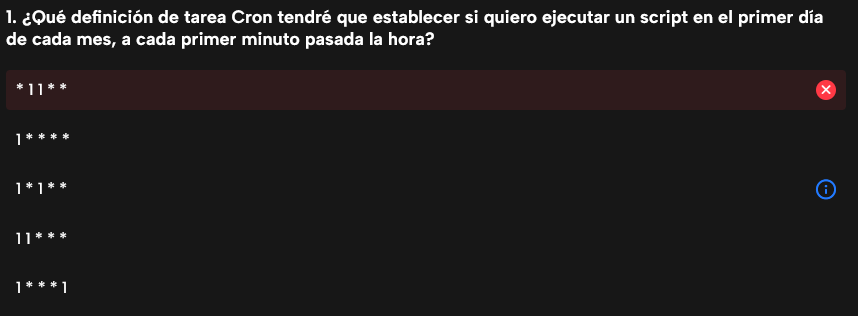
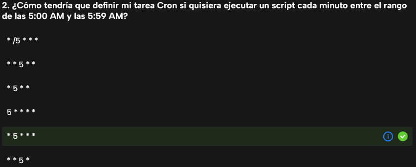
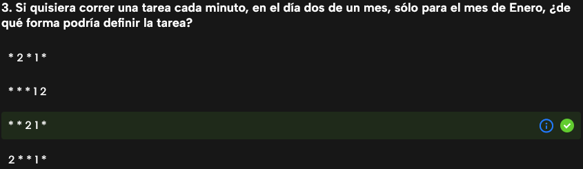
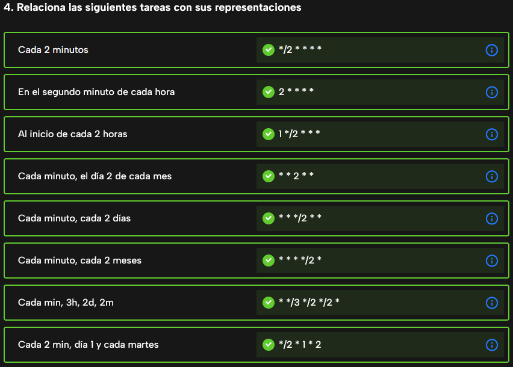
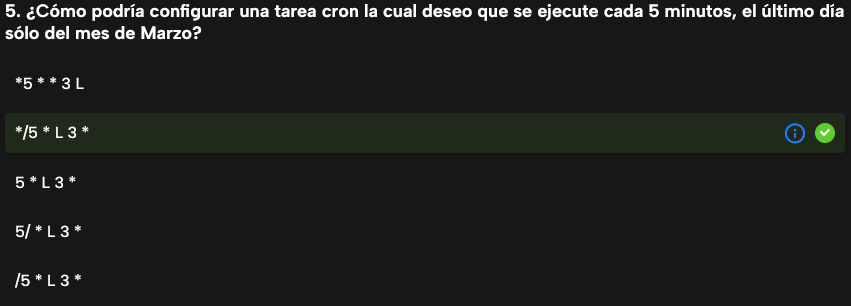
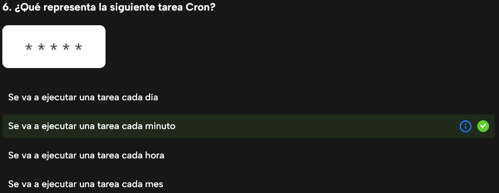
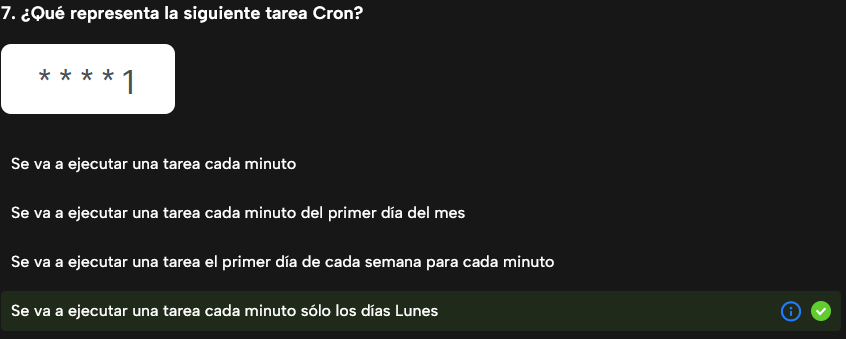
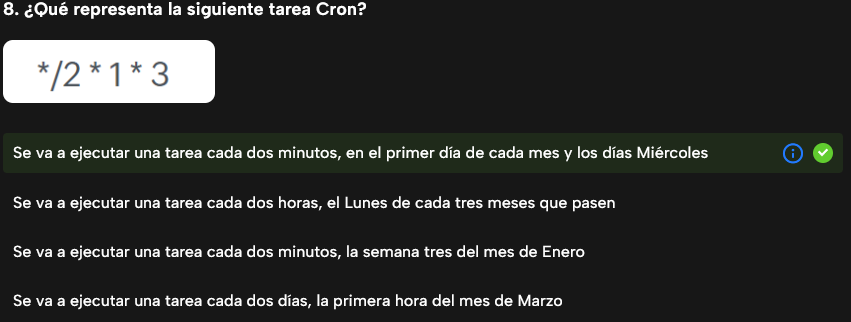
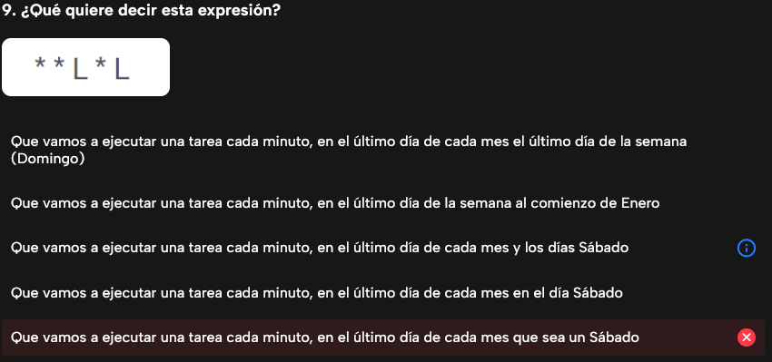

# crontab y at

## Cron

Crond es un servicio del sistema que ejecuta mandatos en horarios determinados. Los mandatos programados pueden definirse en el archivo de configuración `/etc/crontab`. Se puede utilizar además el directorio `/etc/cron.d`, que sirve para almacenar archivos con el mismo formato del archivo `/etc/crontab`.

El sistema dispone además de varios directorios utilizados por el servicio crond:
- `/etc/cron.daily`: todo lo que se coloque dentro de este directorios, se ejecutará una vez todos los días.
- `/etc/cron.hourly`: todo lo que se coloque dentro de este directorios, se ejecutará una vez cada hora.
- `/etc/cron.monthly`: todo lo que se coloque dentro de este directorios, se ejecutará una vez al mes.
- `/etc/cron.weekly`: todo lo que se coloque dentro de este directorios, se ejecutará una vez cada semana.
- `/etc/cron.yearly`: todo lo que se coloque dentro de este directorios, se ejecutará una vez al año.

```bash
vagrant@debian:~$ systemctl status cron
● cron.service - Regular background program processing daemon
     Loaded: loaded (/lib/systemd/system/cron.service; enabled; preset: enabled)
     Active: active (running) since Thu 2025-05-08 14:21:05 CEST; 1 day 5h ago
       Docs: man:cron(8)
   Main PID: 570 (cron)
      Tasks: 1 (limit: 2303)
     Memory: 436.0K
        CPU: 434ms
     CGroup: /system.slice/cron.service
             └─570 /usr/sbin/cron -f

Warning: some journal files were not opened due to insufficient permissions.
```

El archivo `/etc/crontab` es un archivo global de configuración de cron en sistemas Linux. A diferencia del *crontab -e* (que es específico por usuario), este archivo puede contener tareas programadas para cualquier usuario, ya que incluye el campo del usuario en cada línea.

  m h dom mon dow user  command
17 *    * * *   usuario    run-parts /etc/cron.hourly
25 6    * * *   root    /usr/local/bin/backup.sh


| Característica           | crontab -e                              | /etc/crontab                              |
|--------------------------|-----------------------------------------|-------------------------------------------|
| Especifica usuario       | ❌ No                                   | ✅ Sí                                     |
| Alcance                  | Usuario actual                          | Global (multiusuario)                     |
| Ubicación física         | ~/.crontab gestionado (en /var/spool/cron/crontabs) | Archivo real: /etc/crontab                |
| Editable por             | Solo el usuario                         | Root o sudoers                            |
| Formato de línea         | m h dom mon dow comando                 | m h dom mon dow usuario comando           |
| Recarga tras edición     | Automática al guardar                   | No requiere comando especial tras editar  |
| Permite variables globales | No habitualmente                       | Sí (SHELL, PATH, etc.)                    |

Se recomienda no editar `/etc/crontab` si puedes usar *crontab -e*, para mantener las tareas separadas y más seguras. Todos los usuarios del sistema operativo pueden utilizar cron.
- *crontab -l*: Permite mostrar la lista de las tareas del cron del usuario.
- *crontab -e*: Permite editar el cron del usuario en cuestión.

Como usuario root podemos ver las tareas programadas de otros usuarios / incluso programarles tareas.
- crontab -l -u berto
- crontab -e -u berto

```bash
##Tarea cada 5 minutos
*/5 * * * *  /sbin/service httpd reload > /dev/null 2>&1
*/5 * * * *  /usr/bin/systemctl reload httpd.service > /dev/null 2>&1
```

```bash
##No funciona ruta absoluta a el comando systemctl:
*/5 * * * *  systemctl reload httpd.service > /dev/null 2>&1
```

```bash
##a las 23h de todos los viernes
0 23 * * 5 root /usr/bin/yum -y update > /dev/null 2>&1
```

```bash
##Tarea cada 3 dias:
* * */3 * * root /sbin/service httpd reload > /dev/null 2>&1
```

```bash
##Se ejecuta cada 5 minutos. los dias laborables de lunes a viernes:
*/5 * * * 1-5 /usr/bin/rsync -av  -e ssh /datos/   vagrant@192.168.33.10:/datos/
```

```bash
@reboot  mail -s "El sistema de  ha reiniciado" alguien@gmail.com vagrant
0 22 * * * find /web -mtime 3 -print 2>&1 |mail -s "Ficheros modificados en los ultimos 3 dias"  usuario@correo.es
```

```bash
##Ejecuta la tarea a las 14:1 solo de lunes a Viernes
1 14 * * 1-5 fulano /home/fulano/bin/tarea.sh > /dev/null
```

```bash
##Ejecución de df todos los días, todo el año, cada cuarto de hora:
0,15,30,45 * * * * /usr/bin/df > /tmp/libre
```

```bash
##Arranque de un comando cada 5 minutos a partir de 2 (2, 7, 12, etc.) a las 18 horas los días 1 y 15 de cada mes:
2-57/5 18, 1,15 * * comando
```

Se puede controlar el acceso con el comando crontab por usuario con los archivos `/etc/cron.allow`  y `/etc/cron.deny`. 
- En nuestro sistema por defecto existe el fichero `/etc/cron.deny` donde se puede especificar que usuarios no pueden usar el servicio cron.
- Si creamos el archivo `/etc/cron.allow`, solomanete los usuarios que esten en este archivo pueden utilizar cron. En el momento que se crea este archivo todo el mundo queda denegado para el uso del servicio cron salvo los que figuren en el archivo. Usamos *touch /etc/cron.allow && echo "usuario" >> /etc/cron.allow* para ello.
-El usuario root no le afecta `/etc/cron.allow` y `/etc/cron.deny`.

## atd

Los mandatos at y batch se utilizan sólo para programar la ejecución de mandatos de una sola ocasión. En el caso de que se requiera programar mandatos para ser ejecutados periódicamente, se sugiere hacerlo a través de crontab.

```bash
vagrant@debian:~$ sudo apt install -y atd
...
vagrant@debian:~$ systemctl status atd
● atd.service - Deferred execution scheduler
     Loaded: loaded (/lib/systemd/system/atd.service; enabled; preset: enabled)
     Active: active (running) since Fri 2025-05-09 20:09:13 CEST; 20s ago
       Docs: man:atd(8)
   Main PID: 17851 (atd)
      Tasks: 1 (limit: 2303)
     Memory: 248.0K
        CPU: 35ms
     CGroup: /system.slice/atd.service
             └─17851 /usr/sbin/atd -f
```

Puedo crear una tarea de la siguiente forma con at, listar las tareas programadas y eliminarlas por su identificador:
```bash
vagrant@debian:~$ at 23:00
warning: commands will be executed using /bin/sh
at Fri May  9 23:00:00 2025
at> ./opt/scripts/supervisamen
at> <EOT> # con Ctrl+d para finalizar
job 1 at Fri May  9 23:00:00 2025

vagrant@debian:~$ atq
1       Fri May  9 23:00:00 2025 a vagrant

vagrant@debian:~$ atrm 1
```

Puedo crear la tarea en una sola linea.
```bash
vagrant@debian:~$ at -f ./opt/scripts/supervisamen 20:15
```

Hora Se puede formatear la hora de la manera siguiente:
- HHMM o HH:MM.
- La hora puede tener el formato de 12 o 24 h. Con el formato de 12 horas, puede especificar AM (mañana) o PM (tarde). • Midnight (medianoche), noon (mediodía), teatime (16:00 h, típicamente inglés). • MMJJAA, MM/JJ/AA o JJ.MM.AA para una fecha particular. 
- • Now: ahora.
- • + n minutes/hours/days/weeks: la hora actual a la que se añaden n minutos/horas/días/semanas.

También permite establecer la ejecución utilizando today (hoy) y tomorrow (mañana) como argumentos. Ejemplo
```bash
vagrant@debian:~$ at 12:25 tomorrow -f /opt/scripts/supervisamem
vagrant@debian:~$ at 08:25 today -f    /usr/bin/systemctl status httpd.service > /tmt/status-apache 2>&1
```

Se colocan los jobs (tareas) en el directorio `/var/spool/atjobs`, a razón de un ejecutable por tarea `/var/spool/at`.
Es posible controlar el acceso al comando at por usuario con los archivos `/etc/at.allow` y `/etc/at.deny`.	
Todo el mundo puede utiliza *at* porque solo existe el archivo `/etc/at.deny`. Si creamos el archivo `/etc/at.allow` solomente los que estan en este archivo pueden utizar *at*.


---

### Cuestionarios










