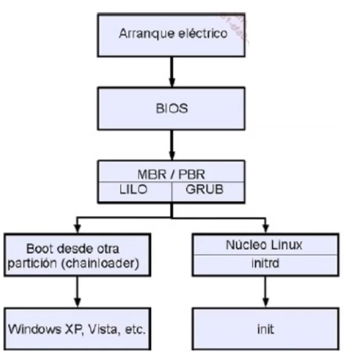

# Secuencia de Arranque

El proceso de arranque de una máquina linux se define a continuación en la siguiente imagen.

- Inicialmente se enciende la computadora (BIOS/UEFI detecta y selecciona dispositivos).
- GRUB carga el kernel y sus dependencias.
- systemd toma el control para inicializar servicios y preparar el sistema.


En mayor nivel de detalle podemos decir:

El proceso de arranque de un sistema Linux se desarrolla en varias etapas consecutivas, desde el encendido hasta que el usuario puede iniciar sesión:

1. **Power On (Encendido):**  
   El proceso comienza al encender la computadora. El hardware activa el firmware del sistema, que puede ser BIOS en sistemas antiguos o UEFI en los modernos.

2. **BIOS/UEFI:**  
   El firmware inicializa el hardware, verifica que los dispositivos esenciales funcionen correctamente (como CPU, RAM y discos) y localiza un dispositivo de arranque. Aquí se realiza la detección básica de los componentes del sistema. Este proceso lo realiza el POST (power-on self-test) y las modificaciones de la BIOS se realizan a través del SETUP de la misma.

   2.1. **BIOS**: Basic Input/Output System. Es un firmware en ROM (o PROM). El BIOS supone que los primeros 446 bytes en el primer dispositivo corresponden a la primera etapa del cargador de arranque (también llamada *código de arranque o bootstrap*). Los primeros 512 bytes de un dispositivo de almacenamiento se denominan MBR (Master Boot Record), en dispositivos de almacenamiento que utilizan el esquema de partición estándar de DOS y, además de la primera etapa del cargador de arranque, tambien contiene la tabla de particiones y la firma de arranque. En pocas palabras, el esquema de los primeros 512 bytes del MBR es:

      - **Bytes 0–445 (446 bytes):** Código de arranque (bootstrap).
      - **Bytes 446–509 (64 bytes):** Tabla de particiones (hasta 4 entradas de 16 bytes).
      - **Bytes 510–511 (2 bytes):** Firma de arranque (valor 0x55AA).

   En Linux decimos que el *cargador de arranque* (bootloader) es el programa encargado de cargar el núcleo del sistema operativo o kernel en memoria RAM y transferirle el control, para ello interviene el *código de arranque o bootstrap* que es un pequeño programa inicial que reside en el MBR y solo inicia el proceso de arranque localizando la partición activa donde está la imagen del sistema operativo. Para decidir que sistema operativo cargar en memoria RAM existe el *gestor de arranque* (boot manager) suele ser la parte del cargador y tambien permite ralizar ciertas configuraciones antes de arrancar, normalmente a través de un menú. En la práctica, programas como GRUB en su segunda versión son los encargados de decidir que sistema operativo cargar. La configuración del *gestor de arranque* está en la partición `/boot` la cual corresponde con `/dev/sda2`. A continuación tenemos una salida del comando `df -Th`.
   
   ```bash
      # BIOS
      /dev/sda1      ext4       50G  1.2G   48G   3% /
      /dev/sda2      ext4      512M   60M  428M  13% /boot
   ```
  
   2.2. **EFI/UEFI**: EFI/UEFI. Unified Extensible Firmware Interface.
      - Compatibilidad y emulación del BIOS.
      - Soporte para la Tabla de particiones GUID (GPT).  
      - Capacidad de gestionar y arrancar desde unidades de almacenamiento grandes (MBR no soporta más de 2 TB).  
      - Entorno amigable y flexible, incluyendo capacidades de red.  
      - Diseño modular.  
      - Opción de “arranque seguro” (Secure Boot).

   A diferencia de BIOS, UEFI presenta la partición *ESP* (EFI System Partition), la cual contiene la información del *gestor de arranque* o gestores, en este caso la partición ESP es la `/dev/sda2` que es la partición de arranque. En caso de estar el **Secure boot* activado, estos gestores tienen que estar firmados digitalmente para no tener problemas con malware. *Secure Boot* es una función propia de UEFI que verifica la autenticidad del software al iniciar el equipo, asegurando que solo se cargue código confiable y protegiendo contra amenazas.

   ```bash
      # UEFI
      /dev/sda3      ext4     49G    12G   35G  26% /
      /dev/sda2      vfat    512M   6,1M  506M   2% /boot/efi
   ```

3. **Detectar dispositivos:**  
   El sistema verifica la presencia de hardware conectado, identificando el disco que contiene el sistema operativo y otros dispositivos relevantes.

4. **Seleccionar un dispositivo de arranque:**  
   Se elige el dispositivo desde donde se iniciará el sistema operativo (disco duro, USB, CD/DVD, etc.). El cargador de arranque, como GRUB, se localiza en el dispositivo seleccionado.

5. **Cargador de arranque GRUB:**  
   GRUB (GRand Unified Bootloader) lee su archivo de configuración (habitualmente en `/etc/grub2.cfg` o similar). GRUB carga el núcleo (kernel) de Linux y las bibliotecas necesarias para inicializar el sistema, y transfiere el control al kernel.

6. **Ejecución de systemd (primer proceso en espacio de usuario):**  
   
   El núcleo del sistema operativo abrirá el *initramfs* (initial RAM filesystem). Initramfs es un archivo que contiene un sistema de archivos utilizado como un sistema de archivos raíz temporal durante el proceso de arranque. El objetivo principal de un archivo initramfs es proporcionar los módulos necesarios para que el núcleo pueda acceder al sistema de archivos raíz "real" del sistema operativo. Tan pronto como el sistema de archivos raíz esté disponible, el núcleo montará todos los sistemas de archivos configurados en `/etc/fstab` y luego ejecutará el primer programa, una utilidad llamada init. 
   
   El programa init es responsable de ejecutar todos los scripts de inicialización y demonios del sistema. Existen implementaciones distintas de tales iniciadores de sistemas aparte del *init* tradicional, como systemd y Upstart. Una vez que se carga el programa init, initramfs se elimina de la RAM.
   
   En resumen, una vez cargado el kernel, este inicializa el sistema en el espacio de usuario ejecutando el primer proceso, generalmente `systemd` (PID 1). `systemd` coordina el inicio de todos los servicios necesarios para el funcionamiento del sistema.

7. **Ejecución de targets de systemd:**  
   `systemd` gestiona *targets* (objetivos), que agrupan servicios y procesos para distintas configuraciones del sistema. Ejemplos de targets son:
   - `default.target`: configuración estándar.
   - `multi-user.target`: modo multiusuario sin entorno gráfico.
   - `getty.target`: gestión de terminales de texto.

   _*Nota*_: Estos targets 

8. **Ejecución de scripts de inicio:**  
   `systemd` ejecuta scripts que inicializan servicios y preparan el entorno para los usuarios, incluyendo configuraciones como `/systemd-logind`, `/etc/profile` (global), y `~/.bashrc` (específica del usuario).

9. **Inicio de sesión de usuarios:**  
   Tras completar todos los pasos anteriores, el sistema está listo para que los usuarios inicien sesión, ya sea mediante terminales locales o conexiones remotas como SSH.

A modo de resumen:
1. Arranque eléctrico una vez pulsado el botón de encender.
2. BIOS/UEFI.
3. Lectura del MBR del Boot Loader que carga el Gestor de arranque (GRUBv2).
4.  Opción A
    1.  Se carga el Kernel, lo que implica lanzar el *Initial Ramdisk o initrd* para cargar los módulos necesarios.
    2.  Inicia el proceso init (PID 1) en SysVinit o el proceso systemd.
5.  Opción B
    1.  Se carga el cargador de arranque de otro Sistema Operativo.
    2.  Carga el Kernel del otro Sistema Operativo.


