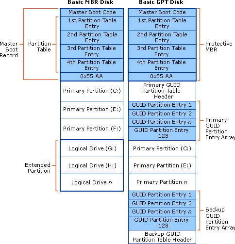
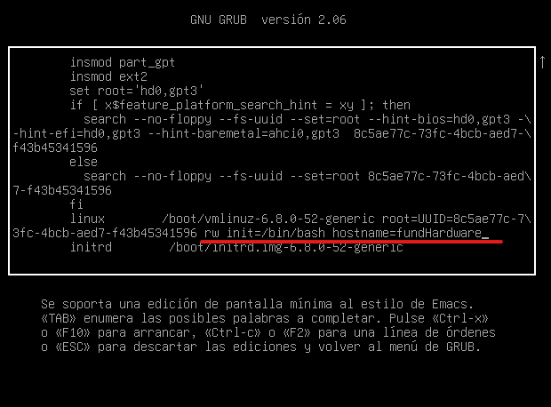

# Particionado con fdisk

## Tipos de particionado

### Tipos de particionado: MBR y GPT

#### MBR (Master Boot Record)

El esquema **MBR** es el más antiguo y se introdujo en 1983 con IBM PC DOS 2.0. Sus características principales son:

- **Límite de almacenamiento**: Soporta discos de hasta **2 TB**.
- **Número de particiones**: Solo permite **cuatro particiones primarias**, aunque una de ellas puede ser una **partición extendida** que permite múltiples particiones lógicas.
- **Ubicación del registro de arranque**: Se encuentra en el primer sector del disco (sector 0) y contiene la tabla de particiones junto con el **código de arranque**.
- **Compatibilidad**: Es compatible con sistemas operativos más antiguos y con el modo BIOS.

#### GPT (GUID Partition Table)

El esquema **GPT** es más moderno y forma parte del estándar UEFI. Sus características principales son:

- **Límite de almacenamiento**: Puede gestionar discos de **hasta 9.4 ZB** (zettabytes).
- **Número de particiones**: Permite hasta **128 particiones** sin necesidad de una partición extendida.
- **Ubicación del registro de arranque**: No depende de un solo sector, ya que almacena copias redundantes de la tabla de particiones en distintas partes del disco, lo que lo hace más seguro ante fallos.
- **Compatibilidad**: Es necesario para discos de más de 2 TB y funciona con el modo **UEFI**. Algunos sistemas antiguos no pueden arrancar desde discos GPT.

En resumen:

| Característica          | BIOS/MBR                  | UEFI/GPT            |
| ----------------------- | ------------------------- | ------------------- |
| Tipo de firmware        | BIOS                      | UEFI                |
| Ubicación del cargador  | MBR (sector 0)            | Partición EFI       |
| Seguridad               | Sin protección avanzada   | Soporta Secure Boot |
| Límite de particiones   | 4 primarias (o extendida) | Hasta 128           |
| Tamaño máximo del disco | 2 TB                      | 9.4 ZB              |

En pocas palabras:

- **MBR**: Usa el **BIOS** y una **partición activa** para arrancar, donde se carga el cargador de arranque desde el primer sector del disco.
- **GPT**: Usa **UEFI** y una **partición EFI** para arrancar, donde se almacenan los archivos necesarios para iniciar el sistema desde una partición separada.



## Estado de partida

A continuación, vamos a realizar el particionado de un disco y vamos a proceder a su montado. Inicialmente partimos de la siguiente situación.

```bash
root@debian:~# df -Th
S.ficheros     Tipo  Tamaño Usados  Disp Uso% Montado en
tmpfs          tmpfs   795M   1,4M  793M   1% /run
/dev/sda3      ext4     49G    12G   35G  26% /
tmpfs          tmpfs   3,9G      0  3,9G   0% /dev/shm
tmpfs          tmpfs   5,0M   4,0K  5,0M   1% /run/lock
/dev/sda2      vfat    512M   6,1M  506M   2% /boot/efi
tmpfs          tmpfs   795M    72K  795M   1% /run/user/1000
tmpfs          tmpfs   795M    84K  795M   1% /run/user/128
```

Es conveniente indicar que en un sistema Linux podemos tener los siguientes indicadores de particiones.

Tipo de particiones para GPT ---> UEFI --> con gdisk.

- _8300_ : partición de tipo Linux (datos).
- _8200_ : partición de tipo swap.
- _fd00_ : partición de tipo RAID.
- _8e00_ : partición de tipo LVM.

Tipo de particiones MBR --> BIOS-->fdisk.

- _83_ : partición de tipo Linux (datos).
- _82_ : partición de tipo swap.
- _fd_ : partición de tipo RAID.
- _8e_ : partición de tipo LVM.

```bash
root@debian:/tmp# fdisk -l /dev/sda
Disco /dev/sda: 64 GiB, 68719476736 bytes, 134217728 sectores
Modelo de disco: VBOX HARDDISK
Unidades: sectores de 1 * 512 = 512 bytes
Tamaño de sector (lógico/físico): 512 bytes / 512 bytes
Tamaño de E/S (mínimo/óptimo): 512 bytes / 512 bytes
Tipo de etiqueta de disco: dos
Identificador del disco: 0x82270e73

Disposit.  Inicio Comienzo     Final  Sectores Tamaño Id Tipo
/dev/sda1  *          2048    999423    997376   487M 83 Linux
/dev/sda2          1001470 134215679 133214210  63,5G  5 Extendida
/dev/sda5          1001472 134215679 133214208  63,5G 8e Linux LVM
```

## lsblk

Nos muestra información relevante de los dispositivos de almacenamiento.

- _-f_: Muestra información del sistema de archivos, como el tipo (xfs, ext4), el UUID, y la etiqueta (LABEL).
- _-p_: Muestra la ruta completa del dispositivo, como `/dev/sda1` en lugar de _sda1_.

```bash
root@debian:/tmp/prueba# lsblk
NAME                      MAJ:MIN RM  SIZE RO TYPE MOUNTPOINTS
sda                         8:0    0   64G  0 disk
├─sda1                      8:1    0  487M  0 part /boot
├─sda2                      8:2    0    1K  0 part
└─sda5                      8:5    0 63,5G  0 part
  ├─debian--12--vg-root   254:0    0 62,6G  0 lvm  /
  └─debian--12--vg-swap_1 254:1    0  980M  0 lvm  [SWAP]
```

- _NAME_: Nombre del dispositivo.
- _MAJ:MIN_: Número mayor y menor del dispositivo.
- _RM_: 1 si es extraíble, 0 si no lo es.
- _SIZE_: Tamaño del dispositivo.
- _RO_: 1 si es de solo lectura.
- _TYPE_: Tipo de dispositivo (disk, part, rom, lvm, etc.).
- _MOUNTPOINT_: Punto de montaje del dispositivo.

### Dispositivos `loop`

Un dispositivo `loop` es un disco virtual que permite montar un archivo como si fuera un dispositivo de almacenamiento real. Se usa para acceder a archivos de imagen (ISO, IMG) o paquetes Snap sin necesidad de grabarlos en un disco físico.

```bash
loop2    7:2    0 271,2M  1 loop /snap/firefox/4848
```

### Disco principal `sda`

```bash
sda      8:0    0    50G  0 disk
├─sda1   8:1    0     1M  0 part
├─sda2   8:2    0   513M  0 part /boot/efi
└─sda3   8:3    0  49,5G  0 part /
```

`sda` es un disco de 50 GB con **tres particiones**:

- `sda1` (1 MB) → Pequeña partición reservada (uso de GRUB). Si usas BIOS antiguo, el código de GRUB suele guardarse en el MBR (Master Boot Record), que es el primer sector del disco. En modo GPT, una pequeña partición (como sda1) puede ser usada para el **gestor de arranque**.
- `sda2` (513 MB) → Montada en `/boot/efi` (para arranque UEFI). Esta partición contiene el **cargador de arranque** y los archivos necesarios para que UEFI inicie Linux.
- `sda3` (49.5 GB) → Montada en `/` (almacena el sistema operativo).

_*Nota*_: Diferencia entre **gestor de arranque** y **cargador de arranque**

- Gestor de arranque (Boot Manager): Decide qué sistema operativo arrancar si hay más de uno. Ejemplo: GRUB.
- Cargador de arranque (Boot Loader): Carga el núcleo del sistema operativo en la memoria para que el SO se inicie.

Si tienes Windows y Linux en el mismo PC, el **gestor de arranque (GRUB)** te permite elegir cuál arrancar. Una vez elegido el sistema, el **cargador de arranque** carga el kernel de Linux o Windows en la memoria.

### Segundo disco `sdb`

```bash
sdb      8:16   0    25G  0 disk
```

- `sdb` es un disco de **25 GB sin particiones ni sistema de archivos**. Para usarlo, se debe **particionar y formatear** antes de montarlo.

```bash
root@debian:~# lsblk
NAME   MAJ:MIN RM   SIZE RO TYPE MOUNTPOINTS
loop0    7:0    0     4K  1 loop /snap/bare/5
loop1    7:1    0  74,3M  1 loop /snap/core22/1612
loop2    7:2    0 271,2M  1 loop /snap/firefox/4848
loop3    7:3    0 505,1M  1 loop /snap/gnome-42-2204/176
loop4    7:4    0  91,7M  1 loop /snap/gtk-common-themes/1535
loop5    7:5    0  12,9M  1 loop /snap/snap-store/1113
loop6    7:6    0  38,8M  1 loop /snap/snapd/21759
loop7    7:7    0   500K  1 loop /snap/snapd-desktop-integration/178
loop8    7:8    0  44,4M  1 loop /snap/snapd/23545
loop9    7:9    0  73,9M  1 loop /snap/core22/1748
sda      8:0    0    50G  0 disk
├─sda1   8:1    0     1M  0 part
├─sda2   8:2    0   513M  0 part /boot/efi
└─sda3   8:3    0  49,5G  0 part /
sdb      8:16   0    25G  0 disk
```

## fdisk

`fdisk` es la herramienta de administración de discos y particiones tradicional del shell de Linux.

`fdisk -l`: Tabla de particiones de todos los discos.
`fdisk -l /dev/sdb`: Tabla de particiones de `/dev/sdb`.
`fdisk /dev/sdb`: Modo de edición del disco `/dev/sdb`.
Opciones de `fdisk`

- `w`: Guardar.
- `q`: Salir.
- `n`: Crear partición.
- `p`: Permite crear una partición primaria.
- `e`: Permite crear una partición extendida.
- `m`: Ayuda.
- `d`: Eliminar una partición.
- `g`: Cambiamos la etiqueta DOS(MBR) a GPT. Eliminaría la tabla de particiones.
- `o`: Cambiamos la etiqueta GPT a MBR(DOS). Eliminaría la tabla de particiones.

A continuación creamos una partición primaria en el disco `/dev/sdb` de 10GiB sobre un disco de 25GiB de partida.

```bash
root@debian:~# fdisk /dev/sdb

Welcome to fdisk (util-linux 2.37.2).
Changes will remain in memory only, until you decide to write them.
Be careful before using the write command.


Command (m for help): n
Partition type
   p   primary (0 primary, 0 extended, 4 free)
   e   extended (container for logical partitions)
Select (default p): p
Partition number (1-4, default 1):
First sector (2048-52428799, default 2048):
Last sector, +/-sectors or +/-size{K,M,G,T,P} (2048-52428799, default 52428799): +10G

Created a new partition 1 of type 'Linux' and of size 10 GiB.

Command (m for help): p
Disk /dev/sdb: 25 GiB, 26843545600 bytes, 52428800 sectors
Disk model: VBOX HARDDISK
Units: sectors of 1 * 512 = 512 bytes
Sector size (logical/physical): 512 bytes / 512 bytes
I/O size (minimum/optimal): 512 bytes / 512 bytes
Disklabel type: dos
Disk identifier: 0xceaf73bb

Device     Boot Start      End  Sectors Size Id Type
/dev/sdb1        2048 20973567 20971520  10G 83 Linux
```

Una vez creada la partición vamos a partición extendida de 15GiB.

```bash
Command (m for help): n
Partition type
   p   primary (1 primary, 0 extended, 3 free)
   e   extended (container for logical partitions)
Select (default p): e
Partition number (2-4, default 2):
First sector (20973568-52428799, default 20973568):
Last sector, +/-sectors or +/-size{K,M,G,T,P} (20973568-52428799, default 52428799):

Created a new partition 2 of type 'Extended' and of size 15 GiB.

Command (m for help): p
Disk /dev/sdb: 25 GiB, 26843545600 bytes, 52428800 sectors
Disk model: VBOX HARDDISK
Units: sectors of 1 * 512 = 512 bytes
Sector size (logical/physical): 512 bytes / 512 bytes
I/O size (minimum/optimal): 512 bytes / 512 bytes
Disklabel type: dos
Disk identifier: 0xceaf73bb

Device     Boot    Start      End  Sectors Size Id Type
/dev/sdb1           2048 20973567 20971520  10G 83 Linux
/dev/sdb2       20973568 52428799 31455232  15G  5 Extended
```

Añadimos ahora una partición lógica de 5GiB y guardamos la configuración.

```bash
Command (m for help): n
All space for primary partitions is in use.
Adding logical partition 5
First sector (20975616-52428799, default 20975616):
Last sector, +/-sectors or +/-size{K,M,G,T,P} (20975616-52428799, default 52428799): +5G

Created a new partition 5 of type 'Linux' and of size 5 GiB.

Command (m for help): p
Disk /dev/sdb: 25 GiB, 26843545600 bytes, 52428800 sectors
Disk model: VBOX HARDDISK
Units: sectors of 1 * 512 = 512 bytes
Sector size (logical/physical): 512 bytes / 512 bytes
I/O size (minimum/optimal): 512 bytes / 512 bytes
Disklabel type: dos
Disk identifier: 0xceaf73bb

Device     Boot    Start      End  Sectors Size Id Type
/dev/sdb1           2048 20973567 20971520  10G 83 Linux
/dev/sdb2       20973568 52428799 31455232  15G  5 Extended
/dev/sdb5       20975616 31461375 10485760   5G 83 Linux

Command (m for help): w
The partition table has been altered.
Calling ioctl() to re-read partition table.
Syncing disks.

root@debian:~#
```

Veamos ahora el resultado final.

```bash
root@debian:~# fdisk -l /dev/sdb
Disk /dev/sdb: 25 GiB, 26843545600 bytes, 52428800 sectors
Disk model: VBOX HARDDISK
Units: sectors of 1 * 512 = 512 bytes
Sector size (logical/physical): 512 bytes / 512 bytes
I/O size (minimum/optimal): 512 bytes / 512 bytes
Disklabel type: dos
Disk identifier: 0xceaf73bb

Device     Boot    Start      End  Sectors Size Id Type
/dev/sdb1           2048 20973567 20971520  10G 83 Linux
/dev/sdb2       20973568 52428799 31455232  15G  5 Extended
/dev/sdb5       20975616 31461375 10485760   5G 83 Linux
```

Si quisiéramos borrar una tabla de particiones en fdisk nos bastaría con cambiar la etiqueta, por ejemplo de DOS (MBR) a GPT con la opción `g`, o a la inversa con la opción `o`. Si nos fijamos, la etiqueta de la tabla de particiones se va a modificar.

```bash
root@debian:~# fdisk -l /dev/sdb
Disk /dev/sdb: 25 GiB, 26843545600 bytes, 52428800 sectors
Disk model: VBOX HARDDISK
Units: sectors of 1 * 512 = 512 bytes
Sector size (logical/physical): 512 bytes / 512 bytes
I/O size (minimum/optimal): 512 bytes / 512 bytes
Disklabel type: dos
Disk identifier: 0xceaf73bb

Device     Boot    Start      End  Sectors Size Id Type
/dev/sdb1           2048 20973567 20971520  10G 83 Linux
/dev/sdb2       20973568 52428799 31455232  15G  5 Extended
/dev/sdb5       20975616 31461375 10485760   5G 83 Linux
root@debian:~# fdisk /dev/sdb

Welcome to fdisk (util-linux 2.37.2).
Changes will remain in memory only, until you decide to write them.
Be careful before using the write command.


Command (m for help): g
Created a new GPT disklabel (GUID: 9D46AE3B-2D99-F94C-8C2F-3A58DB60DC6F).
The device contains 'dos' signature and it will be removed by a write command. See fdisk(8) man page and --wipe option for more details.

Command (m for help): p

Disk /dev/sdb: 25 GiB, 26843545600 bytes, 52428800 sectors
Disk model: VBOX HARDDISK
Units: sectors of 1 * 512 = 512 bytes
Sector size (logical/physical): 512 bytes / 512 bytes
I/O size (minimum/optimal): 512 bytes / 512 bytes
Disklabel type: gpt
Disk identifier: 9D46AE3B-2D99-F94C-8C2F-3A58DB60DC6F
```

## blkid

`blkid`: Permite consultar el identificador único de cada disco. Como no tienen un sistema de ficheros asignado el identificador va a tener el tamaño que se muestra a continuación.

```bash
root@debian:~# blkid | grep sdb
/dev/sdb5: PARTUUID="20eab2f1-05"
/dev/sdb1: PARTUUID="20eab2f1-01"
```

## mkfs

`mkfs` Permite aplicar un formato de sistema de ficheros a una partición.

`mkfs.ext4 /dev/sdb1` Formatea la partición 1 del disco /dev/sdb con formato ext4.
`mkfs -t ext4 /dev/sdb5` Igual al anterior.

```bash
root@debian:~# mkfs.ext4 /dev/sdb1
mke2fs 1.46.5 (30-Dec-2021)
Creating filesystem with 2621440 4k blocks and 655360 inodes
Filesystem UUID: c5e35664-cef9-4345-afbb-82a6723b2659
Superblock backups stored on blocks:
        32768, 98304, 163840, 229376, 294912, 819200, 884736, 1605632

Allocating group tables: done
Writing inode tables: done
Creating journal (16384 blocks): done
Writing superblocks and filesystem accounting information: done

root@debian:~# mkfs -t ext4 /dev/sdb5
mke2fs 1.46.5 (30-Dec-2021)
Creating filesystem with 1310720 4k blocks and 327680 inodes
Filesystem UUID: 054a4742-ad44-4132-bfb9-ce927f9bfdc3
Superblock backups stored on blocks:
        32768, 98304, 163840, 229376, 294912, 819200, 884736

Allocating group tables: done
Writing inode tables: done
Creating journal (16384 blocks): done
Writing superblocks and filesystem accounting information: done
```

A continuación vamos a ver el identificador que se ha asociado a las particiones con un sistema de ficheros asignado.

```bash
root@debian:~# blkid | grep sdb
/dev/sdb1: UUID="c5e35664-cef9-4345-afbb-82a6723b2659" BLOCK_SIZE="4096" TYPE="ext4" PARTUUID="20eab2f1-01"
/dev/sdb5: UUID="054a4742-ad44-4132-bfb9-ce927f9bfdc3" BLOCK_SIZE="4096" TYPE="ext4" PARTUUID="20eab2f1-05"
```

## mount y umount

El paso final para poder leer y escribir de particiones es montarlas en una ruta del sistema de archivos para lo cual utilizaremos el comando mount:

- `mount /dev/sdb1 /media/datos1` Monta la partición 1 del disco /dev/sdb en la ruta /media/datos1.
- `umount /media/datos1` Desmonta la partición 1 del disco /dev/sdb de donde esté montada.

Vamos a montar la partición en la ruta `/media/datos1`. Una vez montada podremos crear contenido en su interior que se guardará en el dispositivo `/dev/sdb1`.

```bash
root@debian:~# mkdir /media/datos1 && mount /dev/sdb1 /media/datos1
root@debian:~# mount | grep /dev/sdb1
/dev/sdb1 on /media/datos1 type ext4 (rw,relatime)
root@debian:~# df -Th
Filesystem     Type   Size  Used Avail Use% Mounted on
tmpfs          tmpfs  391M  1,5M  390M   1% /run
/dev/sda3      ext4    49G   16G   30G  35% /
tmpfs          tmpfs  2,0G     0  2,0G   0% /dev/shm
tmpfs          tmpfs  5,0M  4,0K  5,0M   1% /run/lock
/dev/sda2      vfat   512M  6,1M  506M   2% /boot/efi
tmpfs          tmpfs  391M   80K  391M   1% /run/user/128
tmpfs          tmpfs  391M   68K  391M   1% /run/user/1000
/dev/sdb1      ext4   9,8G  8,0K  9,3G   1% /media/datos1

root@debian:~# for i in $(seq 1 10); do echo "Fichero ${i}" > /media/datos1/fichero${i}.txt; done
root@debian:~# ls /media/datos1/
fichero10.txt  fichero2.txt  fichero4.txt  fichero6.txt  fichero8.txt  fichero.txt
fichero1.txt   fichero3.txt  fichero5.txt  fichero7.txt  fichero9.txt
```

## fstab

Para que el montaje de la partición `/dev/sdb1` sea persistente y no tener que volver a realizar este proceso cuando encendamos de nuevo el ordenador tenemos que añadir la configuración correspondiente en el fichero `/etc/fstab`. Tenemos que tener cuidado con las modificaciones realizadas en este fichero ya que si los datos introducidos son incorrectos podría no iniciarse el ordenador. Para ello vamos a hacer un `cp -pv /etc/fstab /etc/fstab_VIEJO` y ejecutar el comando `mount -a` para ver si tenemos algún error antes de reiniciar la máquina.

```bash
root@debian:~# cp -pv /etc/fstab /etc/fstab_VIEJO
'/etc/fstab' -> '/etc/fstab_VIEJO'
```

Neceitamos añadir en una nueva entrada del `/etc/fstab` el identificador de la partición. Dentro del `/etc/fstab` la entrada va a tener 6 columnas de datos:

- El UUID o nombre de partición, el punto de montaje y el tipo de sistema de archivos.
- Opciones de montaje. Si dejamos `defaults` se aplicarán opciones por defecto según el sistema de archivos, pero hay múltiples opciones que nos permite configurar: si queremos o no montaje automático, modo de sólo lectura o lectura/escritura, permitir o bloquear el uso de los bits suid y sgid, limitar los usuarios que pueden montar la partición, ...
- Opción dump: Número de veces que se aplicará un backup al sistema de ficheros por el programa dump (0 indica que no se aplica).
- Opción pass: Orden en el que se comprobará el sistema de archivos en el arranque. El 1 se reservar para el sistema raíz (/). Si ponemos un 0 no se comprueba en el arranque.

```bash
root@usuario:/home/usuario# blkid | grep sdb | awk -F ' ' '{print $2}' | sed 's/"//g'
UUID=79d603be-d399-400e-b3d8-63ca1ebf5d95
UUID=42ec4832-6a90-465b-943b-d523c45b8137
```

```bash
root@debian:~# nano /etc/fstab
```

```bash
root@usuario:/home/usuario# cat /etc/fstab
# /etc/fstab: static file system information.
#
# Use 'blkid' to print the universally unique identifier for a
# device; this may be used with UUID= as a more robust way to name devices
# that works even if disks are added and removed. See fstab(5).
#
# <file system> <mount point>   <type>  <options>       <dump>  <pass>
# / was on /dev/sda3 during installation
UUID=8c5ae77c-73fc-4bcb-aed7-f43b45341596 /               ext4    errors=remount-ro 0       1
# /boot/efi was on /dev/sda2 during installation
UUID=1A8A-1C88  /boot/efi       vfat    umask=0077      0       1
/swapfile                                 none            swap    sw              0       0
# sdb1
UUID=79d603be-d399-400e-b3d8-63ca1ebf5d95       /media/sdb1     ext4    defaults        0       2
# sdb2
UUID=42ec4832-6a90-465b-943b-d523c45b8137       /media/sdb5     ext4    defaults        0       2
```

El archivo **`/etc/fstab`** en Linux contiene información sobre los sistemas de archivos que deben montarse al iniciar el sistema. Cada línea en **`fstab`** describe un sistema de archivos y cómo debe ser montado. Aquí te explico los valores que puede tener:

1. **file system**

- Especifica el dispositivo o sistema de archivos a montar.
- Puede ser:
- **UUID**: Identificador único del dispositivo (por ejemplo, `UUID=887fddd5-c130-4d0e-a814-03c02bdd0050`).
- **LABEL**: Etiqueta del dispositivo (por ejemplo, `LABEL=mydata`).
- **Dispositivo**: Nombre del dispositivo de bloque, como `/dev/sda1` o `/dev/sdb2`.

2. **mount point**

- Especifica el punto de montaje, que es el directorio donde se montará el sistema de archivos.
- Ejemplo: `/`, `/boot/efi`, `/media/datos1`.

3. **type**

- Especifica el tipo de sistema de archivos.
- Algunos ejemplos:
- **ext4**: Sistema de archivos de Linux moderno.
- **vfat**: Sistema de archivos FAT, generalmente usado para particiones EFI.
- **swap**: Espacio de intercambio de memoria.
- **ntfs**: Sistema de archivos de Windows (si se monta con `ntfs-3g`).

4. **options**

- Especifica las opciones de montaje del sistema de archivos.
- Algunos ejemplos:
- **defaults**: Opciones predeterminadas para el montaje.
- **errors=remount-ro**: Remonta el sistema de archivos como solo lectura si ocurre un error (común en `ext4`).
- **umask=0077**: Establece los permisos de los archivos y directorios en la partición (común en sistemas FAT).
- **sw**: Indica que es una partición de intercambio (swap).

5. **dump**

- Especifica si el sistema de archivos debe ser respaldado por **dump** (una herramienta de respaldo para copias de seguridad).
- **0**: No se hace respaldo.
- **1**: Se hace respaldo.

6. **pass**

- Especifica el orden en que los sistemas de archivos deben ser revisados durante el arranque por **fsck** (herramienta de chequeo de sistemas de archivos).
- **0**: No se realiza chequeo en el arranque.
- **1**: Se realiza chequeo en la raíz (`/`).
- **2**: Se realiza chequeo en otros sistemas de archivos después de la raíz.

Resumen de lo que pueden contener los campos:

1. **file system**: UUID, LABEL, /dev/sdX
2. **mount point**: Directorios donde se monta.
3. **type**: Tipo de sistema de archivos (ext4, vfat, swap, etc.).
4. **options**: Opciones como `defaults`, `errors=remount-ro`, etc.
5. **dump**: 0 o 1 para respaldo con `dump`, es decir, si hay un fallo en disco se almacena en un log dicha información.
6. **pass**: 0 (sin chequeo), 1 (chequeo para raíz), 2 (chequeo para otras particiones).

_*Nota*_: Este funcionamiento era el empleado en SystemV, actualmente con SystemD esto ha quedado desactualizado y los campos 5 y 6 deben ser 0.

Si tuvieramos algún error en la configuración del `/etc/fstab` debería notificarmelo por pantalla. Como no exite ningún error reiniciamos la máquina.

```bash
root@debian:~# mount -a
```

Despues de volver a iniciar el sistema tenemos montados las particiones `sdb1` y `sdb5`.

```bash
root@usuario:~# ls /media/sdb*
/media/sdb1:
lost+found

/media/sdb5:
lost+found  prueba

root@usuario:~# cat /media/sdb5/prueba/prueba.txt
Hola Mundo!
```

### Como recuperar el sistema si cometemos un error en el archivo /etc/fstab

Vamos a cometer un error en el `/etc/fstab` para que el sistema no pueda cargar las particiones, esto producirá que el sistema no carge correctamente.

```bash
root@usuario:~# mount -a
mount: /media/sdb1: no se puede encontrar UUID=9d603be-d399-400e-b3d8-63ca1ebf5d95.
mount: /media/sdb5: no se puede encontrar UUID=2ec4832-6a90-465b-943b-d523c45b8137.
```

Si no arranca el sistema ya que el archivo `/etc/fstab` está incorrectamente formado podemos hacer lo siguiente:

1. Editamos los parametros de arranque.
2. Modificamos `/etc/fstab` para que se produzca el arranque del sistema. Si hemos realizado el proceso como se ha indicado, tendremos el archivo inicial `/etc/fstab_VIEJO` con los datos correctos de arranque.



# Particionado con parted

1. Asignamos el tipo de particionado.

**MBR**

```bash
root@debian:~# parted -s /dev/sdb mklabel msdos
```

**GPT**

```bash
root@debian:~# parted -s /dev/sdb mklabel gpt
```

2. Creamos particiones primarias, extendidas y lógicas.

```bash
root@debian:~# parted -s /dev/sdb mkpart primary 0% 5G
root@debian:~# parted -s /dev/sdb mkpart primary 5G 5G
root@debian:~# parted -s /dev/sdb mkpart extended 10G 100%
root@debian:~# parted -s /dev/sdb mkpart logical 10G 13G
root@debian:~# parted -s /dev/sdb print
Model: ATA VBOX HARDDISK (scsi)
Disk /dev/sdb: 26,8GB
Sector size (logical/physical): 512B/512B
Partition Table: msdos
Disk Flags:

Number  Start   End     Size    Type      File system  Flags
 1      1049kB  5000MB  4999MB  primary
 2      5000MB  5001MB  1049kB  primary
 3      10,0GB  26,8GB  16,8GB  extended               lba
 5      10,0GB  13,0GB  2999MB  logical
```

_*Nota*_: A diferencia de MBR, en GPT no hay distinción entre particiones primarias, extendidas o lógicas. Todas las particiones son "primarias".

3. Tambien puedo eliminar particiones de la siguiente forma.

```bash
root@debian:~# parted -s /dev/sdb rm 1
```

4. Proceso de montado.
   Una vez realizado todo este proceso, lo siguiente sería realizar el montado de las particiones o realizar las modificaciones en el `/etc/fstab` para que se cargen en el inicio.

### Ejercicio

Crear un script bash llamado **`particionar.sh`** que realice las siguientes acciones:

1. Crear una tabla de particiones **GPT** en el disco **`/dev/sdb`**.
2. Crear tres particiones de tipo **ext4** con las siguientes distribuciones:
   - **Partición 1**: 0% a 50% del disco.
   - **Partición 2**: 50% a 75% del disco.
   - **Partición 3**: 75% a 100% del disco.
3. Formatear cada partición recién creada con el sistema de archivos **ext4**.
4. Mostrar la tabla de particiones del disco **`/dev/sdb`**.

Notas:

1. El script debe ejecutarse con permisos de administrador, ya que se manipula un disco.
2. Añadir comentarios explicativos para cada comando que se ejecute.
3. El script debe ser ejecutado con el siguiente comando: `sudo bash particionar.sh`

#### Solución:

```bash
#!/bin/bash
parted -s /dev/sdb mklabel gpt
parted -s /dev/sdb mkpart primary ext4 0% 50%
parted -s /dev/sdb mkpart primary ext4 50% 75%
parted -s /dev/sdb mkpart primary ext4 75% 100%
parted -s /dev/sdb print

# Formatear las particiones
mkfs.ext4 /dev/sdb1
mkfs.ext4 /dev/sdb2
mkfs.ext4 /dev/sdb3
```

# Partición de swap

La partición o espacio swap en Linux es un área del disco duro que el sistema usa como extensión de la memoria RAM. Cuando la RAM se llena, Linux mueve datos menos usados a la swap para liberar memoria y evitar que el sistema se quede sin recursos, aunque acceder a swap es mucho más lento que a la RAM física.

En sistemas con gran cantidad de memoria RAM, el uso de swap puede ser innecesario y, en algunos casos perjudicial para el rendimiento. No hay una regla estricta, pero generalmente se recomienda desactivar swap a partir de los 32/64 GB de RAM en adelante, dependiendo del caso de uso.

| Cantidad de RAM | Swap Recomendada         | Notas                                            |
| --------------- | ------------------------ | ------------------------------------------------ |
| 0 - 2 GB        | 2 veces la RAM           | Sistemas con poca memoria requieren swap.        |
| 2 - 8 GB        | Igual o 1.5 veces la RAM | Uso moderado de swap en cargas ligeras.          |
| 8 - 16 GB       | Igual a la RAM           | Solo para hibernación o picos de carga.          |
| 16 - 32 GB      | 4 - 8 GB de swap         | Útil en servidores de aplicaciones.              |
| 64 GB o más     | Desactivada o 4 GB       | Swap puede ser innecesaria salvo cargas pesadas. |

En el sistema, según la salida de los comandos:

- No tienes una partición swap dedicada (no aparece ninguna partición con tipo "swap" en `lsblk` ni en `df -Th`).
- En cambio, tienes un archivo de swap llamado `/swapfile` de 2 GB y que actualmente al no tener ningún servicio o estar en ejecución una gran cantidad de datos está vacio, que es el que está activo según el comando `swapon`:

```bash
root@usuario:/# swapon
NAME      TYPE SIZE USED PRIO
/swapfile file   2G   0B   -2
root@usuario:/# ls -l swapfile
-rw------- 1 root root 2147483648 dic 10 22:25 swapfile
```

Este archivo swap (`/swapfile`) se encuentra en la raíz del sistema de archivos, es decir, está almacenado dentro de la partición `/dev/sda3`, que es la partición principal montada en `/`. Por tanto, el swap en tu sistema corresponde a un archivo y no a una partición, y reside en el disco `/dev/sda`, dentro de la partición `/dev/sda3`. Podemos ver y modificar el swap con los comandos `swapon`, `swapoff`, y editar su configuración en `/etc/fstab` si lo necesitas.

```bash
<file system> <mount point>  <type>  <options>  <dump>  <pass>
/swapfile      none           swap    sw           0       0
```

Si quisieramos configurar una partición como swap tendriamos que hacer lo siguiente:

- Desactiva el swap actual (opcional, recomendado si hay swap activa).

```bash
swapoff -a | swapoff /swapfile
```

- Prepara la partición /dev/sdb1 como swap.

```bash
mkswap /dev/sdb1
```

- Activa la partición swap.

```bash
swapon /dev/sdb1
```

- A mayores tendríamos que editar el `/etc/fstab` para poder añadir la partición de swap en el arranque.

Por otra parte, para ampliar una partición de swap a través de una partición de nuestro disco `/dev/sdb` con 2GB:

```bash
free -h
#Creo la particion /dev/sdb1, la creo  y el tipo 82:
fdisk /dev/sdb

#se dará formato como partición de memoria de intercambio
mkswap -c /dev/sdb1

#En el siguiente ejemplo se activa como partición de memoria de intercambio a la partición /dev/sdb1:
swapon /dev/sdb1
free -h

##Desactivo la swap del /dev/sdb1
swapoff /dev/sdb1
free -h

##Persistir la swap en el fstab:
vim /etc/fstab
/dev/sdb1  swap  swap  defaults  0 0

#Resumen de todas las áreas de swap activas en el sistema.
swapon -s
```
