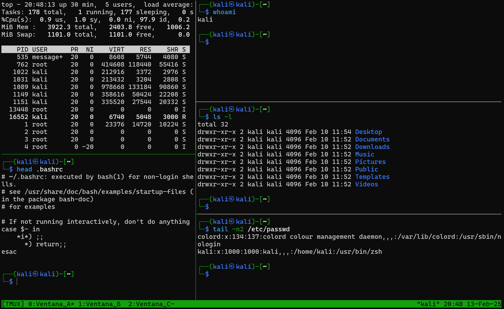

# Herramienta tmux

`tmux` (Terminal Multiplexer) es una herramienta que permite administrar múltiples sesiones de terminal en una sola ventana. Es especialmente útil para sesiones remotas, ya que permite desconectar y reconectar sin perder procesos en ejecución.

## Instalación de tmux

Si `tmux` no está instalado en tu sistema, puedes instalarlo con los siguientes comandos según tu sistema operativo:

- **Ubuntu/Debian**

```bash
sudo apt update && sudo apt install tmux -y
```

## Principales Comandos de tmux

Los comandos en `tmux` se ejecutan mediante un **prefijo** (por defecto `Ctrl+b`), seguido de una tecla o combinación.

### 1. Gestión de Sesiones

Crear una nueva sesión o con un nombre específico

```bash
tmux
tmux new -s mi_sesion
```

Listar sesiones activas

```bash
tmux ls
```

### 2. Gestión de Ventanas

Crear una nueva ventana

```bash
Ctrl+b, c
```

Moverse entre ventanas

```bash
Ctrl+b, n  # Siguiente ventana
Ctrl+b, p  # Ventana anterior
Ctrl+b, 0-9  # Ir a una ventana específica
```

Cerrar una ventana  
Dentro de `tmux`, escribe `exit` o usa:

```bash
Ctrl+b, &
```

Renombrar una ventana

```bash
Ctrl+b, ,
```

### 3. Gestión de Paneles (Splits)

Dividir la ventana en dos paneles **verticales**

```bash
Ctrl+b, %
```

Dividir la ventana en dos paneles **horizontales**

```bash
Ctrl+b, "
```

Moverse entre paneles

```bash
Ctrl+b, ←/→/↑/↓
```

Cerrar un panel

```bash
Ctrl+b, x
```

---


