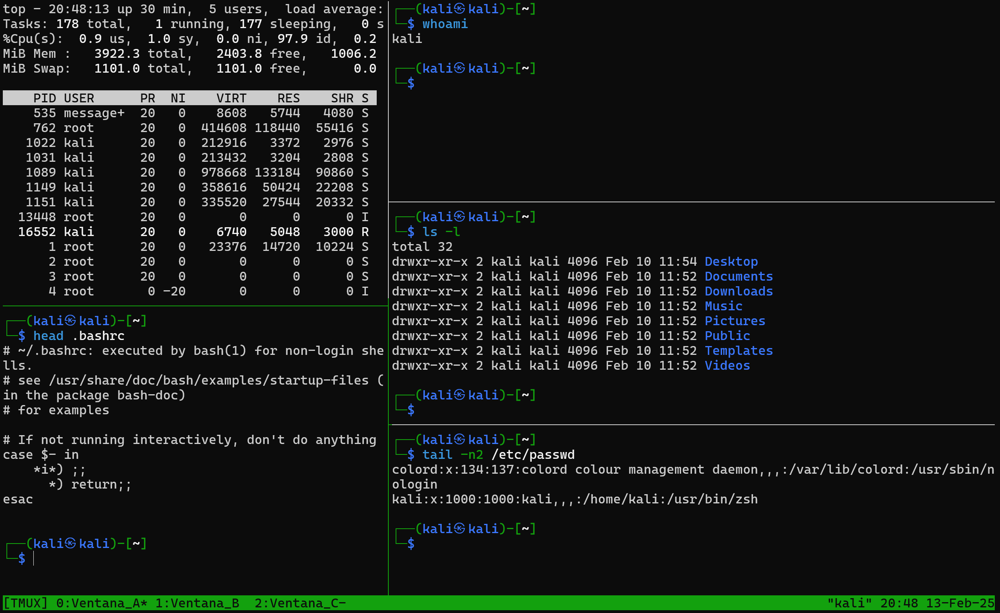

# Herramienta tmux

## Índice

1. [Instalación de tmux](#1-instalacion-de-tmux)
2. [Principales comandos de tmux](#2-principales-comandos-de-tmux)
   2.1. [Gestión de sesiones](#21-gestion-de-sesiones)
   2.2. [Gestión de ventanas](#22-gestion-de-ventanas)
   2.3. [Gestión de paneles (Splits)](#23-gestion-de-paneles-splits)

---

`tmux` (Terminal Multiplexer) es una herramienta que permite administrar múltiples sesiones de terminal en una sola ventana. Es útil para sesiones remotas, ya que permite desconectar y reconectar sin perder procesos en ejecución.

> **Nota:** El prefijo por defecto de `tmux` es `Ctrl+b`. Todos los atajos de teclado se activan pulsando primero el prefijo y luego la tecla indicada.

---

## 1. Instalación de tmux

Si `tmux` no está instalado en tu sistema, puedes instalarlo con los siguientes comandos según tu sistema operativo:

```bash
sudo apt update && sudo apt install tmux -y
```

---

## 2. Principales comandos de tmux

### 2.1. Gestión de sesiones

| Comando / Atajo | Descripción |
|-----------------|-------------|
| `tmux` | Crea una nueva sesión sin nombre. |
| `tmux new -s mi_sesion` | Crea una nueva sesión con nombre. |
| `tmux ls` | Lista todas las sesiones activas. |
| `tmux attach -t mi_sesion` | Se conecta (attach) a una sesión existente. |
| `Ctrl+b, d` | Desconecta (detach) de la sesión actual sin terminarla. |
| `Ctrl+b, $` | Renombra la sesión actual. |

### 2.2. Gestión de ventanas

| Atajo | Descripción |
|-------|-------------|
| `Ctrl+b, c` | Crea una nueva ventana. |
| `Ctrl+b, n` | Va a la siguiente ventana. |
| `Ctrl+b, p` | Va a la ventana anterior. |
| `Ctrl+b, 0-9` | Va a la ventana con ese número. |
| `Ctrl+b, ,` | Renombra la ventana actual. |
| `Ctrl+b, &` | Cierra la ventana actual (pide confirmación). |

### 2.3. Gestión de paneles (Splits)

| Atajo | Descripción |
|-------|-------------|
| `Ctrl+b, %` | Divide la ventana en dos paneles **verticales**. |
| `Ctrl+b, "` | Divide la ventana en dos paneles **horizontales**. |
| `Ctrl+b, ←/→/↑/↓` | Mueve el foco entre paneles. |
| `Ctrl+b, x` | Cierra el panel actual (pide confirmación). |
| `Ctrl+b, z` | Maximiza/restaura el panel actual (zoom). |
| `Ctrl+b, q` | Muestra brevemente los números de los paneles. |

---


