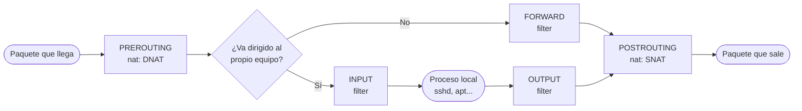

# Cortafuegos con iptables

## Índice

1. [Qué es iptables](#1-qué-es-iptables)
2. [Tablas y cadenas](#2-tablas-y-cadenas)
3. [Sintaxis y gestión de las reglas](#3-sintaxis-y-gestión-de-las-reglas)
4. [Criterios de selección](#4-criterios-de-selección)
5. [Seguimiento de estados (conntrack)](#5-seguimiento-de-estados-conntrack)
6. [Acciones](#6-acciones)
7. [Políticas por defecto](#7-políticas-por-defecto)
8. [Cadenas de usuario](#8-cadenas-de-usuario)
9. [NAT: SNAT, MASQUERADE y DNAT](#9-nat-snat-masquerade-y-dnat)
10. [Guardar y restaurar las reglas](#10-guardar-y-restaurar-las-reglas)
11. [Método: de un requisito a sus reglas](#11-método-de-un-requisito-a-sus-reglas)
12. [Ejemplo completo: cortafuegos de una pequeña empresa](#12-ejemplo-completo-cortafuegos-de-una-pequeña-empresa)
13. [iptables y nftables](#13-iptables-y-nftables)

---

## 1. Qué es iptables

El núcleo de Linux incluye un sistema para inspeccionar, filtrar y modificar los paquetes de red llamado **netfilter**. `iptables` es la herramienta clásica con la que el administrador le indica a netfilter qué reglas debe aplicar. Con ella se puede convertir un equipo Linux en un **cortafuegos**: tanto para proteger al propio equipo como para controlar el tráfico que pasa a través de él entre varias redes, que es el caso de un **cortafuegos perimetral** o *firewall fronterizo*.

Su sucesor es **nftables** (documento 44), pero iptables sigue muy presente en guiones, documentación y exámenes, y su forma de razonar (tablas, cadenas y reglas) es la base para entender cualquier cortafuegos.

| Distribución | Situación de iptables |
|---|---|
| Ubuntu Server 26.04 | Viene instalado de serie, porque lo necesita `ufw`. |
| Debian 13 | No viene instalado: `apt install iptables`. |

```bash
root@cortafuegos:~# iptables -V
iptables v1.8.11 (nf_tables)
```

> **Nota:** El `(nf_tables)` de la salida indica que se usa la variante **iptables-nft**: la orden y su sintaxis son las de siempre, pero las reglas se guardan internamente en el motor de nftables. Existe también la variante antigua, `iptables-legacy`, que no conviene mezclar con la nueva. Por la misma razón, si se va a usar iptables directamente hay que tener **desactivado `ufw`** (`ufw status` debe mostrar `inactive`), porque `ufw` también gestiona las reglas de netfilter y unas pisarían a las otras.

---

## 2. Tablas y cadenas

Las reglas de iptables se organizan en **tablas**, según lo que hacen, y dentro de cada tabla en **cadenas**, según el momento en que se aplican al paquete:

| Tabla | Para qué sirve | Cadenas |
|---|---|---|
| `filter` | **Filtrar**: decidir si un paquete pasa o no. Es la tabla por defecto. | `INPUT`, `FORWARD`, `OUTPUT` |
| `nat` | **Traducir direcciones** (NAT): cambiar la IP o el puerto de origen o de destino. | `PREROUTING`, `OUTPUT`, `POSTROUTING` (y `INPUT`) |
| `mangle` | Modificar otros campos del paquete, como la prioridad o las marcas. | Todas |
| `raw` | Excluir paquetes del seguimiento de conexiones. | `PREROUTING`, `OUTPUT` |

| Cadena | Cuándo se aplica |
|---|---|
| `PREROUTING` | Nada más llegar el paquete, **antes** de decidir a dónde va. Aquí se hace el **DNAT** (cambiar el destino). |
| `INPUT` | Al paquete que va dirigido **al propio equipo**. |
| `FORWARD` | Al paquete que **atraviesa** el equipo, de una red a otra. Es la cadena principal de un cortafuegos perimetral. |
| `OUTPUT` | Al paquete que **genera el propio equipo**. |
| `POSTROUTING` | Justo antes de que el paquete salga, **después** de decidir por dónde. Aquí se hace el **SNAT** (cambiar el origen). |

El recorrido de un paquete por las cadenas depende de su origen y su destino:



| Tráfico | Recorrido | Ejemplo |
|---|---|---|
| Hacia el propio cortafuegos | `PREROUTING` → `INPUT` | Un administrador se conecta por SSH al cortafuegos. |
| Desde el propio cortafuegos | `OUTPUT` → `POSTROUTING` | El cortafuegos hace una consulta DNS. |
| A través del cortafuegos | `PREROUTING` → `FORWARD` → `POSTROUTING` | Un equipo de la red interna navega por Internet. |

> **Importante:** Como el DNAT se hace en `PREROUTING`, **antes** de `FORWARD`, las reglas de `FORWARD` ya ven la dirección de destino **traducida** (la IP privada del servidor, no la pública). Y como el SNAT se hace en `POSTROUTING`, **después** de `FORWARD`, las reglas de `FORWARD` todavía ven la dirección de origen **original** (la IP privada del equipo interno). Es la clave para escribir bien las reglas de filtrado cuando hay NAT.

---

## 3. Sintaxis y gestión de las reglas

Todas las órdenes siguen el mismo esquema:

```text
iptables [-t tabla] ORDEN cadena [criterios] -j ACCIÓN
```

Si no se indica `-t`, se trabaja con la tabla `filter`. Cuando llega un paquete, las reglas de la cadena se recorren **en orden, de arriba abajo**, y se aplica la **primera** que coincide. Por eso el orden de las reglas importa tanto como su contenido.

| Orden | Acción |
|---|---|
| `-A cadena regla` | Añade la regla **al final** de la cadena (*append*). |
| `-I cadena [n] regla` | Inserta la regla en la **posición `n`**; sin número, en la primera. Las reglas que había desde esa posición bajan un puesto. |
| `-D cadena n` | Borra la regla número `n` de la cadena. También se puede borrar escribiendo la regla completa: `-D cadena regla`. |
| `-R cadena n regla` | Reemplaza la regla número `n`. |
| `-L [cadena]` | Lista las reglas. Se combina con `-n` (no resolver nombres), `-v` (detalles y contadores) y `--line-numbers` (número de cada regla). |
| `-S [cadena]` | Lista las reglas con la misma sintaxis con la que se crearon. |
| `-F [cadena]` | Borra todas las reglas de la cadena, o de todas (*flush*). |
| `-Z [cadena]` | Pone a cero los contadores de paquetes y bytes. |
| `-P cadena acción` | Fija la **política por defecto** de una cadena predefinida. |
| `-N cadena` | Crea una **cadena de usuario**. |
| `-X [cadena]` | Elimina una cadena de usuario vacía y que no se use en ninguna regla. |

```bash
root@cortafuegos:~# iptables -L INPUT -n -v --line-numbers
Chain INPUT (policy DROP 25 packets, 1500 bytes)
num   pkts bytes target     prot opt in      out     source               destination
1       84  6720 ACCEPT     0    --  lo      *       0.0.0.0/0            0.0.0.0/0
2      512 41300 ACCEPT     0    --  *       *       0.0.0.0/0            0.0.0.0/0            ctstate RELATED,ESTABLISHED
3        0     0 DROP       0    --  *       *       0.0.0.0/0            0.0.0.0/0            ctstate INVALID
4        3   252 ACCEPT     1    --  enp0s9  *       192.168.1.0/24       0.0.0.0/0            icmptype 8 ctstate NEW
root@cortafuegos:~# iptables -S INPUT
-P INPUT DROP
-A INPUT -i lo -j ACCEPT
-A INPUT -m conntrack --ctstate RELATED,ESTABLISHED -j ACCEPT
-A INPUT -m conntrack --ctstate INVALID -j DROP
-A INPUT -s 192.168.1.0/24 -i enp0s9 -p icmp -m icmp --icmp-type 8 -m conntrack --ctstate NEW -j ACCEPT
```

Las columnas `pkts` y `bytes` son los **contadores**: cuántos paquetes y bytes han coincidido con cada regla. Son la mejor forma de comprobar si una regla está funcionando. Con `-n`, la columna `prot` muestra el número del protocolo: `0` es cualquiera, `1` ICMP, `6` TCP y `17` UDP.

> **Advertencia:** `-I cadena n` solo funciona si la cadena tiene ya al menos `n - 1` reglas. Insertar en la posición 5 de una cadena con dos reglas da el error `Index of insertion too big`.

---

## 4. Criterios de selección

Los criterios indican a qué paquetes se aplica la regla. Todos los que se pongan en una misma regla deben cumplirse a la vez, y casi todos admiten `!` delante para negarlos:

| Criterio | Significado | Ejemplo |
|---|---|---|
| `-p protocolo` | Protocolo: `tcp`, `udp`, `icmp`... | `-p tcp` |
| `-s origen`, `-d destino` | Dirección o red de origen o de destino. | `-s 192.168.1.0/24`, `-d 203.0.113.254` |
| `-i interfaz` | Interfaz por la que **entra** el paquete. | `-i enp0s9` |
| `-o interfaz` | Interfaz por la que **sale** el paquete. | `-o enp0s3` |
| `--sport`, `--dport` | Puerto de origen o de destino. Exigen `-p tcp` o `-p udp`. | `-p tcp --dport 22000` |
| `-m multiport --dports` | Varios puertos en una sola regla. | `-p tcp -m multiport --dports 80,443` |
| `-m iprange --src-range` | Un **rango** de direcciones de origen que no coincide con una red completa. También existe `--dst-range`. | `-m iprange --src-range 192.168.1.2-192.168.1.10` |
| `-m conntrack --ctstate` | Estado de la conexión (apartado siguiente). | `-m conntrack --ctstate NEW` |
| `-p icmp --icmp-type` | Tipo de mensaje ICMP. | `-p icmp --icmp-type echo-request` |
| `-m comment --comment` | Añade un comentario a la regla, visible al listarla. | `-m comment --comment "SSH admin"` |

> **Importante:** `-i` solo tiene sentido en las cadenas por las que entran paquetes (`PREROUTING`, `INPUT` y `FORWARD`), y `-o` en las cadenas por las que salen (`FORWARD`, `OUTPUT` y `POSTROUTING`). Usar `-i` en `OUTPUT` da error. En un cortafuegos con varias redes, indicar siempre la interfaz es la forma de asegurar que los paquetes **entran por donde deben**: así, un equipo de la red de invitados que falsificara la IP de un administrador de la LAN no coincidiría con la regla, porque llegaría por otra interfaz.

> **Nota:** Si una interfaz tiene varias direcciones IP, `-d` permite que una regla se aplique solo a una de ellas. Por ejemplo, para publicar un servidor web en una IP pública concreta y no en las demás.

---

## 5. Seguimiento de estados (conntrack)

iptables es un cortafuegos **con estado** (*stateful*): netfilter lleva la cuenta de todas las conexiones en curso y sabe a cuál pertenece cada paquete. El módulo `conntrack` permite usar ese estado en las reglas:

| Estado | Significado |
|---|---|
| `NEW` | El paquete inicia una conexión nueva (en TCP, el primer `SYN`). |
| `ESTABLISHED` | El paquete pertenece a una conexión ya establecida, en cualquiera de los dos sentidos. |
| `RELATED` | El paquete inicia una conexión nueva pero **relacionada** con otra existente, como un mensaje de error ICMP. |
| `INVALID` | El paquete no encaja con ninguna conexión conocida. Lo normal es descartarlo. |

Gracias a los estados, un cortafuegos se construye siempre con el mismo esquema:

1. Al principio de cada cadena, una regla que acepta los paquetes `ESTABLISHED` y `RELATED`. Con ella pasan todas las **respuestas** de las conexiones permitidas, sin escribir reglas para el sentido de vuelta.
2. Después, una regla por cada conexión que se quiere permitir, solo para el estado **`NEW`**.

```bash
root@cortafuegos:~# iptables -A FORWARD -m conntrack --ctstate ESTABLISHED,RELATED -j ACCEPT
root@cortafuegos:~# iptables -A FORWARD -i enp0s9 -o enp0s3 -p tcp --dport 443 -m conntrack --ctstate NEW -j ACCEPT
```

Con estas dos reglas, los equipos de `enp0s9` pueden abrir conexiones HTTPS hacia `enp0s3`, y las respuestas vuelven por la primera regla. Desde `enp0s3` no se puede iniciar nada hacia dentro.

> **Nota:** En guiones antiguos aparece `-m state --state NEW` en lugar de `-m conntrack --ctstate NEW`. Hacen lo mismo; `conntrack` es la forma actual. Las conexiones que está siguiendo netfilter se pueden consultar con la orden `conntrack -L`, del paquete `conntrack`.

---

## 6. Acciones

La acción (`-j`, de *jump*) indica qué se hace con el paquete que cumple la regla:

| Acción | Efecto | ¿Termina el recorrido? |
|---|---|---|
| `ACCEPT` | Deja pasar el paquete. | Sí |
| `DROP` | Descarta el paquete **en silencio**: el emisor no recibe ninguna respuesta. | Sí |
| `REJECT` | Descarta el paquete y **avisa** al emisor con un mensaje de error. | Sí |
| `LOG` | Escribe el paquete en el registro del núcleo. | **No**: el paquete sigue con la regla siguiente. |
| `RETURN` | Sale de la cadena de usuario actual y vuelve a la que la llamó. | Sí, para esta cadena |
| *nombre de cadena* | Salta a esa cadena de usuario. | Depende de lo que pase allí |
| `SNAT`, `MASQUERADE`, `DNAT` | Traducen direcciones. Solo en la tabla `nat`. | Sí |

**DROP frente a REJECT**

| | `DROP` | `REJECT` |
|---|---|---|
| Qué ve el emisor | Nada: su conexión espera hasta agotar el tiempo (*timeout*). | Un error inmediato. |
| Ventaja | No revela que hay un equipo ni un cortafuegos. | El usuario legítimo que se equivoca sabe al momento que no tiene acceso. |

`REJECT` puede responder con distintos mensajes, que se eligen con `--reject-with`:

| Opción | Qué recibe el emisor |
|---|---|
| `icmp-port-unreachable` | «Puerto inalcanzable». Es la respuesta por defecto. |
| `icmp-host-prohibited` | «Equipo prohibido». |
| `icmp-admin-prohibited` | «Prohibido por el administrador». |
| `tcp-reset` | Un segmento TCP `RST`, exactamente lo que respondería un equipo sin ningún servicio en ese puerto. El cliente ve `Connection refused`. **Exige `-p tcp`** en la regla. |

**LOG: registrar los paquetes**

Como `LOG` no termina el recorrido, para registrar y a la vez descartar un paquete se usan **dos reglas seguidas** con los mismos criterios: la primera registra y la segunda descarta.

```bash
root@cortafuegos:~# iptables -A INPUT -p tcp --dport 23 -j LOG --log-prefix "telnet bloqueado "
root@cortafuegos:~# iptables -A INPUT -p tcp --dport 23 -j DROP
```

`--log-prefix` añade un texto al principio de cada línea del registro, para encontrarla fácilmente. Admite hasta 29 caracteres, y conviene terminarlo con un **espacio** para que no quede pegado al resto de la línea. Los mensajes van al registro del núcleo:

```bash
root@cortafuegos:~# journalctl -k -g "telnet bloqueado"
oct 07 12:30:15 cortafuegos kernel: telnet bloqueado IN=enp0s9 OUT= MAC=08:00:27:3a:51:0c:08:00:27:9e:12:44:08:00 SRC=192.168.1.20 DST=192.168.1.254 LEN=60 TOS=0x00 PREC=0x00 TTL=64 ID=48211 DF PROTO=TCP SPT=51234 DPT=23 WINDOW=64240 RES=0x00 SYN URGP=0
```

| Campo | Significado |
|---|---|
| `IN=enp0s9`, `OUT=` | Interfaz de entrada y de salida (vacía: el paquete iba al propio equipo). |
| `SRC=`, `DST=` | IP de origen y de destino. |
| `PROTO=TCP`, `SPT=`, `DPT=` | Protocolo y puertos de origen y destino. |
| `SYN` | Indicadores TCP: un `SYN` solo es un intento de iniciar conexión. |

> **Nota:** `journalctl -k` muestra los mensajes del núcleo en cualquier sistema con systemd, y es la forma de consultarlos en Debian 13, que no instala `rsyslog`. Donde sí hay `rsyslog`, como en Ubuntu Server, se guardan también en `/var/log/kern.log`. `dmesg` muestra igualmente los últimos mensajes del núcleo.

> **Advertencia:** Un atacante puede generar miles de paquetes por segundo y llenar el disco de registros. En un sistema real, las reglas `LOG` se limitan con `-m limit --limit 5/min`, que solo registra un número máximo de paquetes por minuto.

---

## 7. Políticas por defecto

Cada cadena **predefinida** tiene una **política**: la acción que se aplica al paquete que llega al final de la cadena sin coincidir con ninguna regla. Solo puede ser `ACCEPT` o `DROP`:

```bash
root@cortafuegos:~# iptables -P INPUT DROP
root@cortafuegos:~# iptables -P FORWARD DROP
root@cortafuegos:~# iptables -P OUTPUT DROP
```

Con las políticas en `DROP` se aplica el principio de **lista blanca**: todo lo que no esté expresamente permitido queda prohibido. Es lo que hace un cortafuegos bien configurado.

> **Advertencia:** Hay dos formas habituales de quedarse sin acceso a un cortafuegos remoto:
>
> - Poner la política de `INPUT` en `DROP` **antes** de permitir las conexiones ya establecidas y el acceso SSH: la propia sesión se corta.
> - Usar `iptables -F` para empezar de cero: borra las reglas, pero **no cambia las políticas**. Si estaban en `DROP`, el equipo queda completamente aislado.
>
> Por eso conviene trabajar desde la **consola** de la máquina. El apartado 4 del documento 44 recoge otras precauciones, como mantener abierta una segunda sesión mientras se prueban las reglas o programar con `at` su restauración pasados unos minutos.

---

## 8. Cadenas de usuario

Además de las cadenas predefinidas se pueden crear **cadenas de usuario**, con el nombre que se quiera. Sirven para agrupar las reglas de un servicio en un solo sitio, lo que hace el cortafuegos más fácil de leer y de mantener:

```bash
root@cortafuegos:~# iptables -N SSH_ADMIN
root@cortafuegos:~# iptables -A INPUT -p tcp --dport 2222 -m conntrack --ctstate NEW -j SSH_ADMIN
root@cortafuegos:~# iptables -A SSH_ADMIN -i enp0s8 -s 10.0.0.5 -j ACCEPT
root@cortafuegos:~# iptables -A SSH_ADMIN -j LOG --log-prefix "ssh rechazado "
root@cortafuegos:~# iptables -A SSH_ADMIN -p tcp -j REJECT --reject-with tcp-reset
```

1. `-N SSH_ADMIN` crea la cadena, vacía.
2. La regla de `INPUT` **desvía** a `SSH_ADMIN` los intentos de conexión nuevos al puerto `2222`.
3. Dentro de `SSH_ADMIN` se decide: el equipo autorizado se acepta y el resto se registra y se rechaza.

Si un paquete llega al final de una cadena de usuario sin coincidir con ninguna regla, **vuelve** a la cadena que lo envió y sigue con la regla siguiente a la del salto (las cadenas de usuario no tienen política). Lo mismo ocurre con la acción `RETURN`.

> **Nota:** Para borrar una cadena de usuario, primero hay que quitar las reglas que saltan a ella y vaciarla (`-F`); después, `iptables -X SSH_ADMIN`.

---

## 9. NAT: SNAT, MASQUERADE y DNAT

La **traducción de direcciones** (NAT) permite que los equipos de una red privada salgan a Internet con la IP pública del cortafuegos, y que un servidor privado se publique en Internet a través de esa IP pública. El tema se introduce en el documento 05 de la serie [Active-Directory-Samba](../sistemas_operativos_en_red/Active-Directory-Samba/05_snat_con_nftables_ubuntu_server.md).

> **Importante:** Para que el cortafuegos pase paquetes de una red a otra (cadena `FORWARD` y NAT), debe tener activado el **reenvío IP**: `net.ipv4.ip_forward = 1`, de forma persistente en `/etc/sysctl.d/` (apartado 3.1 del documento 31). Sin él, ninguna regla de `FORWARD` tiene efecto.

**SNAT: cambiar la dirección de origen**

Los equipos internos tienen IP privadas, que no se pueden usar en Internet. El **SNAT** (*Source NAT*) sustituye su IP de origen por una IP pública del cortafuegos al salir. Se hace en `POSTROUTING`, con la interfaz de salida:

```bash
root@cortafuegos:~# iptables -t nat -A POSTROUTING -o enp0s3 -s 10.0.0.0/24 -j SNAT --to-source 203.0.113.10
```

Si el cortafuegos tiene **varias IP públicas**, `--to-source` permite elegir con cuál sale cada red. Cuando la IP pública no es fija (por ejemplo, la asigna el proveedor por DHCP), se usa **`MASQUERADE`**, que toma automáticamente la IP que tenga en cada momento la interfaz de salida:

```bash
root@cortafuegos:~# iptables -t nat -A POSTROUTING -o enp0s3 -s 10.0.0.0/24 -j MASQUERADE
```

**DNAT: cambiar la dirección de destino**

El **DNAT** (*Destination NAT*) redirige las conexiones que llegan a una IP pública del cortafuegos hacia un servidor interno. Es lo que en un router doméstico se llama «abrir puertos». Se hace en `PREROUTING`, con la interfaz de entrada:

```bash
root@cortafuegos:~# iptables -t nat -A PREROUTING -i enp0s3 -d 203.0.113.10 -p tcp --dport 25 -j DNAT --to-destination 10.0.1.25
root@cortafuegos:~# iptables -A FORWARD -i enp0s3 -o enp0s9 -d 10.0.1.25 -p tcp --dport 25 -m conntrack --ctstate NEW -j ACCEPT
```

El DNAT **solo cambia el destino**: el paquete todavía tiene que atravesar el cortafuegos, así que hace falta además una regla en `FORWARD` que lo permita. Y esa regla, como se explicó en el apartado 2, ya ve la IP **privada** del servidor (`10.0.1.25`). Con `--to-destination 10.0.1.25:2525` se podría cambiar también el puerto.

Este es el recorrido completo de una conexión publicada con DNAT:

| Momento | Origen | Destino |
|---|---|---|
| Llega del cliente de Internet | `198.51.100.7:40000` | `203.0.113.10:25` |
| Tras `PREROUTING` (DNAT) | `198.51.100.7:40000` | `10.0.1.25:25` |
| La respuesta sale del servidor | `10.0.1.25:25` | `198.51.100.7:40000` |
| La respuesta sale del cortafuegos | `203.0.113.10:25` | `198.51.100.7:40000` |

La traducción inversa de la respuesta la hace netfilter **automáticamente**, gracias al seguimiento de conexiones: no hace falta escribir ninguna regla para ella.

> **Nota:** Si un equipo de la **red interna** intenta acceder al servidor publicado usando la **IP pública**, la conexión no funciona solo con estas reglas: el servidor respondería directamente al equipo interno, sin pasar por el cortafuegos. Resolverlo requiere el llamado **NAT en horquilla** (*hairpin NAT*). Lo habitual es que los equipos internos accedan al servidor por su IP privada.

---

## 10. Guardar y restaurar las reglas

Las reglas de iptables están **en memoria**: se pierden al reiniciar el equipo. Hay dos formas de conservarlas:

| Orden | Acción |
|---|---|
| `iptables-save > fichero` | Vuelca todas las reglas a un fichero, en el formato de `-S`. |
| `iptables-restore < fichero` | Carga todas las reglas de un fichero, sustituyendo las actuales. |

En Debian y Ubuntu, el paquete **`iptables-persistent`** carga las reglas automáticamente en cada arranque desde `/etc/iptables/rules.v4` (y `rules.v6` para IPv6). Para guardar las reglas actuales en ese fichero:

```bash
root@cortafuegos:~# apt -y install iptables-persistent
root@cortafuegos:~# netfilter-persistent save
run-parts: executing /usr/share/netfilter-persistent/plugins.d/15-ip4tables save
run-parts: executing /usr/share/netfilter-persistent/plugins.d/25-ip6tables save
```

> **Advertencia:** `iptables` solo controla el tráfico **IPv4**. El tráfico IPv6 tiene su propia orden, **`ip6tables`**, con la misma sintaxis y sus propias políticas. Un cortafuegos que cierra IPv4 pero deja IPv6 con las políticas en `ACCEPT` está abierto por IPv6. Si no se usa IPv6, conviene fijar también sus políticas: `ip6tables -P INPUT DROP`, y lo mismo para `FORWARD` y `OUTPUT`.

---

## 11. Método: de un requisito a sus reglas

Ante un requisito del tipo «permitir que X acceda a Y», estas preguntas llevan casi siempre a las reglas correctas:

| Pregunta | Respuesta y consecuencia |
|---|---|
| 1. ¿El tráfico va **al** cortafuegos, sale **del** cortafuegos o lo **atraviesa**? | `INPUT`, `OUTPUT` o `FORWARD`. |
| 2. ¿Hay que cambiar alguna dirección? | El destino, con DNAT en `PREROUTING`; el origen, con SNAT en `POSTROUTING`. |
| 3. ¿Por qué interfaz entra y por cuál sale? | `-i` y `-o`. |
| 4. ¿Qué protocolo, puertos y direcciones? | `-p`, `--dport`, `-s`, `-d`, `iprange`, `multiport`. |
| 5. ¿Hay que seguir el estado? | En casi todas las reglas de permiso, `-m conntrack --ctstate NEW`; las respuestas ya las acepta la regla `ESTABLISHED,RELATED`. |
| 6. ¿Al final de la cadena o en una posición concreta? | `-A` o `-I cadena n`. |
| 7. ¿Qué se hace con lo que no está permitido? | Basta la política `DROP`, salvo que haya que **registrarlo** (`LOG`) o **avisar** al emisor (`REJECT`). |
| 8. ¿Hace falta una regla de vuelta? | Casi nunca: la regla `ESTABLISHED,RELATED` y la traducción inversa del NAT se encargan de ello. |

> **Recuerda:** Un error muy habitual es pensar que el tráfico **a través** del cortafuegos pasa por `INPUT` u `OUTPUT`. Un equipo de la LAN que navega por Internet solo pasa por `PREROUTING`, `FORWARD` y `POSTROUTING`, y las reglas de `INPUT` no le afectan en absoluto.

---

## 12. Ejemplo completo: cortafuegos de una pequeña empresa

Una empresa tiene un cortafuegos Linux con tres redes: Internet (`enp0s3`, IP pública fija `203.0.113.10`), la red de oficina (`enp0s8`, `10.0.0.0/24`) y una DMZ con un servidor de correo (`enp0s9`, `10.0.1.0/24`, servidor `10.0.1.25`). Los requisitos son:

- El cortafuegos puede hacer consultas DNS a `1.1.1.1` y sincronizar la hora con cualquier servidor NTP.
- Solo los equipos de administración (`10.0.0.2` a `10.0.0.9`) pueden conectarse por SSH al cortafuegos, en el puerto `2222`, desde la red de oficina. El resto de intentos se registran y se rechazan.
- La oficina navega por Internet saliendo con la IP pública.
- El servidor de correo se publica en Internet (SMTP, puerto 25, e IMAPS, puerto 993).

```bash
#!/bin/bash
# Cortafuegos de la empresa (ejemplo). Ejecutar como root desde la consola.

# Punto de partida: sin reglas ni cadenas de usuario, y políticas restrictivas
iptables -F ; iptables -X ; iptables -t nat -F
iptables -P INPUT DROP
iptables -P FORWARD DROP
iptables -P OUTPUT DROP

# Bucle local y respuestas de las conexiones permitidas, en las tres cadenas
iptables -A INPUT  -i lo -j ACCEPT
iptables -A OUTPUT -o lo -j ACCEPT
iptables -A INPUT   -m conntrack --ctstate ESTABLISHED,RELATED -j ACCEPT
iptables -A OUTPUT  -m conntrack --ctstate ESTABLISHED,RELATED -j ACCEPT
iptables -A FORWARD -m conntrack --ctstate ESTABLISHED,RELATED -j ACCEPT

# Tráfico del propio cortafuegos: DNS (UDP y TCP) y NTP
iptables -A OUTPUT -o enp0s3 -d 1.1.1.1 -p udp --dport 53 -m conntrack --ctstate NEW -j ACCEPT
iptables -A OUTPUT -o enp0s3 -d 1.1.1.1 -p tcp --dport 53 -m conntrack --ctstate NEW -j ACCEPT
iptables -A OUTPUT -o enp0s3 -p udp --dport 123 -m conntrack --ctstate NEW -j ACCEPT

# Administración por SSH mediante una cadena de usuario
iptables -N SSH_ADMIN
iptables -A INPUT -p tcp --dport 2222 -m conntrack --ctstate NEW -j SSH_ADMIN
iptables -A SSH_ADMIN -i enp0s8 -m iprange --src-range 10.0.0.2-10.0.0.9 -j ACCEPT
iptables -A SSH_ADMIN -j LOG --log-prefix "ssh rechazado "
iptables -A SSH_ADMIN -p tcp -j REJECT --reject-with tcp-reset

# La oficina sale a Internet con la IP pública
iptables -A FORWARD -i enp0s8 -o enp0s3 -s 10.0.0.0/24 -m conntrack --ctstate NEW -j ACCEPT
iptables -t nat -A POSTROUTING -o enp0s3 -s 10.0.0.0/24 -j SNAT --to-source 203.0.113.10

# Publicación del servidor de correo
iptables -t nat -A PREROUTING -i enp0s3 -d 203.0.113.10 -p tcp -m multiport --dports 25,993 -j DNAT --to-destination 10.0.1.25
iptables -A FORWARD -i enp0s3 -o enp0s9 -d 10.0.1.25 -p tcp -m multiport --dports 25,993 -m conntrack --ctstate NEW -j ACCEPT
```

| Requisito | Cadenas | Por qué |
|---|---|---|
| DNS y NTP del cortafuegos | `OUTPUT` | Es tráfico que genera el propio cortafuegos. Las respuestas entran por la regla `ESTABLISHED,RELATED` de `INPUT`. DNS usa sobre todo UDP, pero recurre a TCP con las respuestas grandes. |
| SSH al cortafuegos | `INPUT` y la cadena `SSH_ADMIN` | Es tráfico dirigido al propio cortafuegos. La interfaz `-i enp0s8` garantiza que el rango de administración solo se acepta si llega desde la oficina. |
| Navegación de la oficina | `FORWARD` y `POSTROUTING` (SNAT) | El tráfico atraviesa el cortafuegos y sale con la IP pública. |
| Servidor de correo | `PREROUTING` (DNAT) y `FORWARD` | El DNAT cambia el destino al servidor privado y `FORWARD` permite el paso. La regla de `FORWARD` usa la IP privada (`10.0.1.25`). |

> **Nota:** El guion no incluye `ip_forward`, que se activa de forma persistente en `/etc/sysctl.d/`, ni guarda las reglas: al terminar habría que ejecutar `netfilter-persistent save`. La tarea 6.2 de los apuntes aplica todo lo de este documento a un cortafuegos perimetral con cuatro redes.

---

## 13. iptables y nftables

iptables y nftables comparten el mismo motor del núcleo, netfilter, y los mismos conceptos. La orden **`iptables-translate`** muestra la regla equivalente de nftables para cualquier regla de iptables, lo que facilita el paso de uno a otro:

```bash
root@cortafuegos:~# iptables-translate -A INPUT -i enp0s8 -p tcp --dport 2222 -m conntrack --ctstate NEW -j ACCEPT
nft 'add rule ip filter INPUT iifname "enp0s8" tcp dport 2222 ct state new counter accept'
```

El documento 44 explica nftables y recoge una tabla de equivalencias entre las dos herramientas.
