# Preguntas de Linux

## Cuestionario 101

**La utilidad 'lsmod' lista cuál de las siguientes opciones cuando se ejecuta?**  
Seleccione una:  
- A. Todos los módulos del kernel y sus atributos  
- B. Ninguna de las anteriores  
- C. Los módulos del kernel que están cargados en memoria  
- D. Todos los módulos del kernel disponibles en el sistema
```
Respuesta correcta: C
```

**¿Cuál de los siguientes tipos de sistema de archivos se conoce como 'pseudofilesystem'?**  
Seleccione una:  
- A. sysfs  
- B. dev  
- C. ext2  
- D. xfs
```
Respuesta correcta: A
```

**¿Cuál de las siguientes opciones representa el orden correcto de arranque de un sistema con 'sysvinit'?**  
Seleccione una:  
- A. BIOS, kernel, boot loader, init, login  
- B. BIOS, MBR, boot loader, kernel, inicialización de dispositivos, montaje del sistema de archivos raíz  
- C. Ninguna de las anteriores  
- D. Boot loader, BIOS, init, inicialización de dispositivos, montaje de sistemas de archivos, login
```
Respuesta correcta: B
```

**¿Cuál de los siguientes números de runlevel corresponde al runlevel 'reboot' (ya sea en 'sysvinit' o en 'systemd')?**  
Seleccione una:  
- A. 1  
- B. 0  
- C. 5  
- D. 6
```
Respuesta correcta: D
```

**El sistema de archivos 'procfs' es considerado un 'pseudofilesystem'. Seleccione una** 
- A. Verdadero  
- B. Falso
```
Respuesta correcta: A
```

---

## Cuestionario 102

**¿Cuál de los siguientes comandos haría que el enlazador dinámico (ld.so) regenere la caché de enlaces en tiempo de ejecución para las bibliotecas compartidas?**
Seleccione una:
- A. ldconfig
- B. updatedb
- C. ldd
- D. ld.so.conf
```
Respuesta correcta: A
```

**¿Cuál de los siguientes contiene el archivo de menú generado para el gestor de arranque GRUB2?**
Seleccione una:
- A. /etc/grub/menu.lst
- B. /boot/grub2/grub.cfg
- C. /boot/grub/menu.lst
- D. /boot/grub/grub.con
```
Respuesta correcta: B
```

**¿Cuál de las siguientes aplicaciones de Debian/Ubuntu puede utilizarse para instalar paquetes (junto con las dependencias necesarias) en el sistema? (Elija todas las que correspondan)**  
Seleccione una o más de una:  
- A. aptitude  
- B. yum  
- C. apt-get  
- D. synaptic
```
Respuesta correcta: A
```

**¿Cuál de los siguientes nombres de dispositivo sería válido para la primera partición en un disco SCSI instalado como segunda unidad en el sistema?**  
Seleccione una:  
- A. /dev/sdb0  
- B. /dev/sdb2-1  
- C. /dev/scsi0  
- D. /dev/sdb1
```
Respuesta correcta: D
```

**En una implementación de discos con Gestor de Volúmenes Lógicos (LVM), el grupo de volúmenes (VG) solo puede tener un disco disponible para usar a la vez.**
Seleccione una:
- A. Verdadero
- B. Falso
```
Respuesta correcta: B
```

---

## Cuestionario 103

**¿Cuáles de las siguientes son alternativas al shell 'bash'? (Elige todas las opciones que correspondan.)**
Seleccione una o más de una:
- A. cash
- B. ksh
- C. zsh
- D. tcl
```
Respuesta correcta: B,C
```

**¿Cuál de los siguientes comandos puede tomar un flujo de texto y anteponer un número de línea a cada línea?**
Seleccione una:
- A. expand
- B. wc
- C. nl
- D. list
```
Respuesta correcta: C
```

**¿Cuál de los siguientes comandos tomará el contenido de una imagen de CD-ROM y creará una copia local en un solo archivo?**
Seleccione una:
- A. dd if=/dev/sr0 of=/tmp/cdrom.iso
- B. dd of=/dev/sr0 if=/tmp/cdrom.iso
- C. dd if=/media/cdrom of=/tmp/cdrom.iso
- D. dd if=/dev/cdrom.iso of=/tmp/sr0
```
Respuesta correcta: A
```

**¿Cuál de los siguientes archivos, contenido en el directorio de un usuario, se ejecutará cuando se conecta a través de un shell de inicio de sesión (login shell)?**
Seleccione una:
- A. bashrc
- B. .login_shell
- C. .bashrc
- D. .bash_profile
```
Respuesta correcta: D
```

**Puedes volver a tu directorio home desde cualquier otro directorio del sistema con el comando 'cd ~'.**
Seleccione una:
- Verdadero
- Falso
```
Respuesta correcta: A
```

---

## Cuestionario 104

**¿Cuáles de las siguientes herramientas pueden utilizarse para particionar dispositivos de disco? (Seleccione todas las que correspondan)**
Seleccione una o más de una:
- A. parted
- B. gdisk
- C. fdisk
- D. loadlin
```
Respuesta correcta: A,B,C
```

**¿Cuál de los siguientes comandos crearía un sistema de archivos 'ext4' en la segunda partición del segundo disco del sistema?**
Seleccione una:
- A. Ninguna de las anteriores
- B. mkfs -f /ext4 /dev/sdb1
- C. mkfs -t ext -n4 /dev/sda2
- D. mkfs -t ext4 /dev/sdb2
```
Respuesta correcta: D
```

**¿Cuál de los siguientes archivos de configuración contiene las opciones por defecto para la utilidad 'mke2fs'?**
Seleccione una:
- A. /etc/mke2fs.conf
- B. /etc/mkfs/mke2fs.conf
- C. Ninguna de las anteriores
- D. /etc/mke2fs/mke2fs.conf
```
Respuesta correcta: A
```

**¿Cuál de los siguientes tipos de sistema de archivos NO ofrece journaling?**
Seleccione una:
- A. ext2
- B. ext4
- C. ext3
- D. ReiserFS
```
Respuesta correcta: A
```

**La regla principal del Estándar de Jerarquía del Sistema de Archivos (Filesystem Hierarchy Standard) es que todos los demás sistemas de archivos deben formar parte del sistema de archivos raíz (es decir, /).**
Seleccione una:
- Verdadero
- Falso
```
Respuesta correcta: B
```

---

## Test 1

**Un software de copia de seguridad utiliza intensivamente enlaces duros entre archivos que no han cambiado entre dos ejecuciones de respaldo. ¿Qué beneficios se obtienen gracias a estos enlaces duros? (Elija DOS respuestas correctas)**  
Seleccione una o más de una:  
- A. La copia de seguridad anterior puede moverse a medios lentos (como cintas) y seguir sirviendo como destino de enlace duro en nuevos respaldos. 
- B. La copia de seguridad está garantizada como inmutable porque los enlaces duros apuntan a los mismos datos en disco en lugar de almacenar copias redundantes. 
- C. El respaldo es más rápido porque, en lugar de copiar datos, los enlaces duros solo cambian metadatos del sistema de archivos.  
- D. El respaldo es más rápido porque los enlaces duros son operaciones asíncronas que postergan la copia.
- E. El respaldo consume menos espacio porque los enlaces duros apuntan a los mismos datos en disco en lugar de almacenar copias redundantes.
```
Respuesta correcta: A,E
```

**Un repositorio de yum puede declarar conjuntos de paquetes relacionados. ¿Qué comando de yum instala todos los paquetes pertenecientes al grupo admintools?**  
Seleccione una:  
- A. yum groupinstall admintools  
- B. yum taskinstall admintools  
- C. yum pkgsel -- install admintools  
- D. yum collection install admintools  
- E. yum install admintools/*
```
Respuesta correcta: A
```

**Después de un corte de energía, el sistema de archivos XFS de /dev/sda3 es inconsistente. ¿Cómo se pueden corregir los errores existentes en el sistema de archivos?**  
Seleccione una:  
- A. Ejecutando xfsck en el sistema de archivos 
- B. Montando el sistema de archivos con la opción xfs_repair  
- C. Usando mount -f para forzar el montaje del sistema de archivos  
- D. Ejecutando xfs_repair en el sistema de archivos   
- E. Ejecutando xfsadmin repair en el sistema de archivos
```
Respuesta correcta: D  
```

**En lugar de proporcionar un dispositivo explícito en /etc/fstab para el montaje, ¿qué otras opciones pueden usarse para identificar la partición deseada? (Elija DOS respuestas correctas)**  
Seleccione una o más de una:  
- A. LABEL 
- B. NAME  
- C. ID  
- D. UUID  
- E. FIND
```
Respuesta correcta: A,D  
```

**La instalación de un paquete local de Debian falló debido a dependencias no satisfechas. ¿Cuál de los siguientes comandos instala las dependencias faltantes y completa la instalación interrumpida del paquete?**  
Seleccione una:  
- A. apt-get install -f 
- B. apt-get autoinstall  
- C. dpkg reconfigure --all  
- D. dpkg --fix --all  
- E. apt-fix all
```
Respuesta correcta: A
```

**¿Cuáles son las principales diferencias entre las tablas de particiones GPT y MBR con respecto al número máximo y el tamaño de las particiones? (Elija DOS respuestas correctas)**  
Seleccione una o más de una:  
- A. Por defecto, GPT puede gestionar hasta 64 particiones mientras que MBR solo admite 16 particiones primarias  
- B. Por defecto, GPT puede gestionar hasta 128 particiones mientras que MBR solo admite cuatro particiones primarias  
- C. Tanto GPT como MBR admiten hasta cuatro particiones primarias, cada una de hasta 4096 TB  
- D. MBR puede manejar tamaños de partición de hasta 2.2 TB, mientras que GPT admite tamaños de hasta 9.4 ZB  
- E. MBR puede manejar tamaños de partición de hasta 4 TB, mientras que GPT admite tamaños de hasta 128 ZB
```
Respuesta correcta: B,D
```

**¿Para qué se puede utilizar el Logical Volume Manager (LVM)? (Elija TRES respuestas correctas)**  
Seleccione una o más de una:  
- A. Para crear arreglos RAID 9 
- B. Para crear o eliminar volúmenes lógicos de forma dinámica 
- C. Para cifrar volúmenes lógicos 
- D. Para crear instantáneas (snapshots) 
- E. Para cambiar dinámicamente el tamaño de los volúmenes lógicos
```
Respuesta correcta: B,D,E
```

**¿Cuál es el propósito del comando ldd?**  
Seleccione una:  
- A. Ejecuta un binario con una ruta de búsqueda de bibliotecas alternativa.  
- B. Instala y actualiza las bibliotecas compartidas instaladas.  
- C. Convierte un binario enlazado dinámicamente en uno estático.  
- D. Define qué versión de una biblioteca debe utilizarse por defecto.  
- E. Enumera qué bibliotecas compartidas necesita un binario para ejecutarse.
```
Respuesta correcta: E
```

**Cuando se elimina un paquete en un sistema que utiliza la gestión de paquetes dpkg, ¿qué opción de dpkg asegura que los archivos de configuración también sean eliminados?**  
Seleccione una:  
- A. --purge 
- B. --vacuum  
- C. --remove  
- D. --clean  
- E. --delete
```
Respuesta correcta: A
```

**¿Qué archivo define las ubicaciones de la red desde donde el gestor de paquetes de Debian descarga los paquetes de software?**  
Seleccione una:  
- A. /etc/dpkg/dselect.cfg  
- B. /etc/apt/sources.list  
- C. /etc/dpkg/dpkg.cfg  
- D. /etc/apt/apt.conf.d  
- E. /etc/apt/apt.conf
```
Respuesta correcta: B
```

**¿Cuál de los siguientes comandos lista todos los paquetes actualmente instalados al usar la gestión de paquetes RPM?**  
Seleccione una:  
- A. yum --list --installed  
- B. rpm --list --installed  
- C. rpm --query --list  
- D. rpm --query --all   
- E. yum --query --all 
```
Respuesta correcta: D
```

**¿Cuáles de los siguientes comandos son válidos en el archivo de configuración de GRUB 2? (Elija DOS respuestas correctas)**  
Seleccione una o más de una:  
- A. uefi  
- B. pxe-ifconfig  
- C. kpartx   
- D. menuentry  
- E. insmod 
```
Respuesta correcta: D,E
```

**¿Cuál de los siguientes comandos instala los archivos de arranque de GRUB en el sistema de archivos actualmente activo y el gestor de arranque en la primera partición del primer disco?**  
Seleccione una:  
- A. grub-install current /dev/sda1  
- B. grub-install /dev/sda 
- C. grub-install current /dev/sda0  
- D. grub-install /dev/sda0  
- E. grub-install /dev/sda1
```
Respuesta correcta: E
```

**¿Cuál de los siguientes comandos establece el permiso SetUID en el ejecutable /bin/foo?**  
Seleccione una:  
- A. chmod 2755 /bin/foo  
- B. chmod u-s /bin/foo  
- C. chmod 1755 /bin/foo  
- D. chmod 4755 /bin/foo 
- E. chmod 755+s /bin/foo
```
Respuesta correcta: D
```

**¿Qué archivos de los siguientes se encuentran en el sistema de archivos /boot/? (Elija DOS respuestas correctas)**  
Seleccione una o más de una:  
- A. Binarios de fsck  
- B. Imágenes del kernel de Linux 
- C. Unidades de destino y servicio de systemd 
- D. Imágenes de la ramdisk inicial  
- E. Binarios del shell Bash
```
Respuesta correcta: B,D
```

**¿Cuáles de los siguientes sistemas de archivos de Linux preasignan un número fijo de inodos al crear un nuevo sistema de archivos, en lugar de generarlos según sea necesario? (Elija DOS respuestas correctas)**  
Seleccione una o más de una:  
- A. JFS  
- B. XFS  
- C. ext3   
- D. ext2   
- E. procfs
```
Respuesta correcta: C,D
```

**¿Cuál de los siguientes valores para umask asegura que los archivos nuevos (sin permisos de ejecución por defecto) tengan los permisos predeterminados -rw-r-----?**  
Seleccione una:  
- A. 0227  
- B. 0017  
- C. 0038  
- D. 0640 
- E. 0026
```
Respuesta correcta: E
```

**¿Cuáles de las siguientes afirmaciones son correctas al comparar contenedores Linux con máquinas virtuales tradicionales (por ejemplo, LXC vs KVM)? (Elija TRES respuestas correctas)**  
Seleccione una o más de una:  
- A. Los contenedores son un método de virtualización ligero donde el kernel controla el aislamiento de procesos y la gestión de recursos.  
- B. Las máquinas virtualizadas por completo pueden ejecutar cualquier sistema operativo para un hardware específico y solo pueden usar máquinas virtuales emuladas.  
- C. Los contenedores están completamente desacoplados del hardware físico del sistema anfitrión y solo pueden usar dispositivos de hardware virtual emulados. 
- D. Los contenedores en el mismo host pueden usar diferentes sistemas operativos, ya que el hipervisor de contenedores crea entornos de ejecución de kernel separados.  
- E. El entorno invitado para máquinas virtualizadas por completo es creado por un hipervisor que proporciona dispositivos de hardware virtual y emulados. 
```
Respuesta correcta: A,B,E
```

**¿Qué directorio contiene los archivos de configuración para repositorios adicionales de yum? (Especifica la ruta completa al directorio.)**
```
Respuesta correcta: /etc/yum.repos.d/
```

**El archivo del sistema de archivos /proc/ que contiene una lista de todos los dispositivos montados actualmente es:**
```
Respuesta correcta: /proc/self/mounts
```

---

## Test 2

**¿Cuántos campos tiene una línea sintácticamente correcta de /etc/fstab?**  
Seleccione una:  
- A. 6  
- B. 3  
- C. 7  
- D. 5  
- E. 4
```
Respuesta correcta: A
```

**Si el archivo comprimido con gzip texts.tgz contiene los archivos a.txt y b.txt, ¿qué archivos estarán presentes en el directorio actual después de ejecutar gunzip texts.tgz?**  
Seleccione una:  
- A. Solo texts.tar  
- B. Solo a.txt, b.txt y texts.tgz  
- C. Solo a.txt.gz y b.txt.gz  
- D. Solo a.txt y b.txt  
- E. Solo texts.tar y texts.tgz
```
Respuesta correcta: A
```

**En una estructura de directorios anidados, ¿qué opción de la línea de comandos de find se usaría para limitar la búsqueda a un número determinado de subdirectorios?**  
Seleccione una:  
- A. -n  
- B. -maxdepth  
- C. -maxlevels  
- D. -dirmax  
- E. -s
```
Respuesta correcta: B
```

**En Bash, insertar 1>&2 después de un comando redirige...**  
Seleccione una:  
- A. ...la salida estándar de error a la entrada estándar  
- B. ...la salida estándar de error a la salida estándar  
- C. ...la salida estándar a la entrada estándar  
- D. ...la entrada estándar a la salida estándar de error  
- E. ...la salida estándar a la salida estándar de error
```
Respuesta correcta: E
```

**Ejecutar `chmod 640 files.txt` como usuario normal no actualiza los permisos de files.txt. ¿Cuál podría ser una razón por la que chmod no puede modificar los permisos? (Elige DOS respuestas correctas)**  
Seleccione una o más de una:  
- A. files.txt es un enlace duro cuyos permisos se heredan del objetivo y no se pueden establecer directamente  
- B. files.txt pertenece a otro usuario y un usuario normal no puede cambiar los permisos de un archivo de otro usuario  
- C. files.txt es un enlace simbólico cuyos permisos tienen un valor fijo que no se puede cambiar  
- D. files.txt tiene el sticky bit activado y un usuario normal no puede eliminar este permiso  
- E. files.txt tiene el bit SetUID activado, lo que impone la restricción de que solo el usuario root puede hacer cambios en el archivo
```
Respuesta correcta: B,C
```

**¿Cuál es el nivel de nice predeterminado cuando se inicia un proceso usando el comando nice?**  
Seleccione una:  
- A. 0  
- B. 10  
- C. 15  
- D. 20  
- E. -10
```
Respuesta correcta: B
```

**¿Cuál es el efecto de la opción -v para el comando grep?**  
Seleccione una:  
- A. Cambia el orden de la salida, mostrando la última línea coincidente primero  
- B. Imprime todas las líneas y pone un prefijo (+) a las líneas coincidentes  
- C. Muestra la información de versión del comando  
- D. Solo imprime las líneas que no coinciden  
- E. Habilita el color para resaltar las partes coincidentes
```
Respuesta correcta: D
```

**Cuando estás en modo normal en vi, ¿qué carácter se puede usar para comenzar una búsqueda inversa (hacia atrás) en el texto?**  
Seleccione una:  
- A. r  
- B. ?  
- C. s  
- D. F  
- E. /
```
Respuesta correcta: B
```

**¿Cuál de los siguientes comandos determina el formato de un archivo usando una base de datos de definiciones que contiene información sobre todos los tipos de archivo comunes?**  
Seleccione una:  
- A. file  
- B. pmagic  
- C. magic  
- D. hash  
- E. type
```
Respuesta correcta: A
```

**¿Cuál de los siguientes comandos puede utilizarse para mostrar el número de inodo de un archivo dado? (Elige DOS respuestas correctas)**  
Seleccione una o más de una:  
- A. inode  
- B. ln  
- C. cp  
- D. ls  
- E. stat
```
Respuesta correcta: D,E
```

**¿Cuál de los siguientes comandos muestra los IDs de todos los procesos propiedad de root? (Elige DOS respuestas correctas)**  
Seleccione una o más de una:  
- A. pgrep -c 0  
- B. pgrep -c root  
- C. pgrep -u 0  
- D. pgrep -f root  
- E. pgrep -u root
```
Respuesta correcta: C,E
```

**¿Cuál de los siguientes comandos lee un archivo y crea fragmentos separados de un tamaño dado a partir del contenido del archivo?**
Seleccione una:
- A. break
- B. split
- C. ar
- D. head
- E. tail
```
Respuesta correcta: B
```

**¿Cuál de los siguientes comandos genera una lista de nombres de usuario de /etc/passwd junto con su shell de inicio de sesión?**  
Seleccione una:  
- A. column -s : 1,7 /etc/passwd  
- B. sort -t: -k1,7 /etc/passwd  
- C. cut -d: -f1,7 /etc/passwd  
- D. chop -c : 1,7 /etc/passwd  
- E. colrm 1,7 /etc/passwd
```
Respuesta correcta: C
```

**¿Cuál de los siguientes comandos imprime el directorio de trabajo actual al usar un shell Bash? (Elige DOS respuestas correctas)**  
Seleccione una o más de una:  
- A. pwd  
- B. printwd  
- C. echo "${pwd}"  
- D. echo "${WD}"  
- E. echo "${PWD}"
```
Respuesta correcta: A,E
```

**¿Cuál de los siguientes comandos muestra cómo el shell maneja un comando específico?**  
Seleccione una:  
- A. type  
- B. case  
- C. where  
- D. stat  
- E. fileinfo
```
Respuesta correcta: A
```

**¿Cuál de las siguientes propiedades de un archivo existente cambia cuando se crea un enlace duro (hard link) que apunta a ese archivo?**  
Seleccione una:  
- A. Tamaño del archivo  
- B. Marca de tiempo de modificación  
- C. Contador de enlaces  
- D. Permisos  
- E. Número de inodo
```
Respuesta correcta: C
```

**¿Cuál de las siguientes secuencias en el editor vi guarda el documento abierto y sale del editor? (Elige DOS respuestas correctas)**  
Seleccione una o más de una:  
- A. Esc :wq  
- B. Esc ZZ  
- C. Ctrl :w  
- D. Ctrl XX  
- E. Esc zz
```
Respuesta correcta: A,B
```

**¿Cuál de las siguientes herramientas puede mostrar la ruta completa de un archivo ejecutable que el shell actual ejecutaría al iniciar un comando sin especificar su ruta completa? (Elige DOS respuestas correctas)**  
Seleccione una o más de una:  
- A. pwd  
- B. find  
- C. locate  
- D. which  
- E. type
```
Respuesta correcta: D,E
```

**Siguiendo el Estándar de Jerarquía del Sistema de Archivos (FHS), ¿dónde deben colocarse los binarios que han sido compilados por el administrador del sistema para que estén disponibles para todos los usuarios del sistema? (Especifica la ruta completa al directorio.)**
```
Respuesta correcta: /usr/local/bin
```

**¿Qué comando muestra una lista de todas las tareas en segundo plano que se están ejecutando en el shell actual? (Especifica SOLO el comando, sin ninguna ruta o parámetros adicionales)**
```
Respuesta correcta: jobs
```

---

## Test 3


**Un usuario creó por accidente el subdirectorio \dir en su directorio personal. ¿Cuál de los siguientes comandos eliminará ese directorio?**  
Seleccione una:  
- A. rmdir ~/'dir'  
- B. rmdir ~/\\dir  
- C. rmdir ~/\dir  
- D. rmdir "~/\dir"  
- E. rmdir '~/\dir'
```
Respuesta correcta: B
```

**Dados los siguientes dos enlaces simbólicos en una configuración de init System V:**

**/etc/rc1.d/K01apache2**

**/etc/rc2.d/S02apache2**

**¿Cuándo se ejecutan los scripts a los que hacen referencia estos enlaces? (Elige DOS respuestas correctas)**  

Seleccione una o más de una:  
- A. Tanto S02apache2 como K01apache2 se ejecutan durante el apagado del sistema  
- B. K01apache2 se ejecuta cuando se entra al nivel de ejecución 1  
- C. S02apache2 se ejecuta cuando se sale del nivel de ejecución 2  
- D. K01apache2 nunca se ejecuta porque la k indica un servicio desactivado  
- E. S02apache2 se ejecuta cuando se entra al nivel de ejecución 2
```
Respuesta correcta: B,E
```

**En el editor vi, ¿cómo pueden emitirse comandos como mover el cursor o copiar líneas al buffer varias veces o aplicarlos a varias filas?**  
Seleccione una:  
- A. Usando el comando :repeat seguido del número y el comando  
- B. Emitiendo un comando como :set repetition=4, que repite cada comando posterior 4 veces  
- C. Seleccionando todas las líneas afectadas usando las teclas Shift y las flechas antes de aplicar el comando  
- D. Especificando el número después de un comando como l4 o yj2 seguido de escape  
- E. Especificando el número justo delante de un comando como 4l o 2yj
```
Respuesta correcta: E
```

**¿Qué información puede mostrar el comando lspci sobre el hardware del sistema? (Elige TRES respuestas correctas)**  
Seleccione una o más de una:  
- A. Tipo de batería del sistema  
- B. Velocidad del bus PCI  
- C. Identificación del fabricante del dispositivo  
- D. Configuración de IRQ del dispositivo  
- E. Dirección MAC de Ethernet
```
Respuesta correcta: B,C,D
```

**¿Cuál es la forma correcta de establecer el target de arranque predeterminado de systemd a multi-user?**  
Seleccione una:  
- A. systemctl isolate multi-user.target  
- B. systemctl boot -p multi-user.target  
- C. systemctl set-default multi-user.target  
- D. systemctl set-runlevel multi-user.target  
- E. systemctl set-boot multi-user.target
```
Respuesta correcta: C
```

**¿Cuál es la salida cuando se aplica la expresión regular s/[ABC][abc]/xx/ a la siguiente cadena? ABCabc**  
Seleccione una:  
- A. ABxxbc  
- B. xxxxxx  
- C. Axxaxx  
- D. ABCabc  
- E. xxCxxc
```
Respuesta correcta: A
```

**¿Cuál es el propósito del comando xargs?**  
Seleccione una:  
- A. Hace una pregunta, gráficamente, y devuelve la respuesta al shell  
- B. Lee la entrada estándar y construye comandos para ejecutar  
- C. Permite especificar opciones largas (como --help) para comandos que normalmente solo aceptan opciones cortas (como -h)  
- D. Repite la ejecución de un comando usando diferentes parámetros para cada invocación  
- E. Pasa argumentos a un servidor X
```
Respuesta correcta: B
```

**Cuando se arranca desde el disco duro, una computadora carga con éxito el kernel de Linux y el initramfs pero se queda colgada durante las tareas posteriores de inicio. El sistema se arranca usando un CD de rescate basado en Linux para investigar el problema. ¿Cuál de los siguientes métodos ayuda a identificar la causa raíz del problema?**  
Seleccione una:  
- A. Investigar el archivo /proc/kmsg en el disco duro de la computadora en busca de posibles errores  
- B. Usar chroot para cambiar al sistema de archivos del disco duro y usar dmesg para ver los registros  
- C. Usar el comando dmesg desde la shell del CD de rescate para ver los registros de arranque del sistema original  
- D. Reiniciar de nuevo desde el disco duro, ya que el sistema arrancó correctamente desde el CD de rescate
```
Respuesta correcta: B
```

**¿Dónde se almacena el cargador de arranque (bootloader) en el disco duro de un sistema UEFI?**  
Seleccione una:  
- A. En la partición etiquetada como boot  
- B. En el Registro de Arranque EFI (EBR)  
- C. En el Registro Maestro de Arranque (MBR)  
- D. En la Partición del Sistema EFI (ESP)  
- E. En la partición número 127
```
Respuesta correcta: D
```

**¿Cuál de los siguientes comandos puede realizar búsquedas en el contenido de archivos usando expresiones regulares?**  
Seleccione una:  
- A. pgrep  
- B. find  
- C. grep  
- D. locate  
- E. reggrep
```
Respuesta correcta: C
```

**¿Cuál de los siguientes comandos se utiliza para cambiar opciones y parámetros posicionales dentro de un shell Bash en ejecución?**  
Seleccione una:  
- A. setsh  
- B. envsetup  
- C. bashcong  
- D. history  
- E. set
```
Respuesta correcta: E
```

**¿Cuál de los siguientes comandos carga un módulo del kernel junto con cualquier módulo dependiente que sea necesario?**  
Seleccione una:  
- A. depmod  
- B. module_install  
- C. insmod  
- D. modprobe  
- E. loadmod
```
Respuesta correcta: D
```

**¿Cuál de los siguientes comandos imprime "test" en la shell?**  
Seleccione una:  
- A. cat < | EOT  
test  
EOT  
- B. cat  ! < EOT  
test  
EOT  
- C. cat < ! EOT  
test  
EOT  
- D. cat  &<EOT  
test  
EOT  
- E. cat  << EOT  
test  
EOT
```
Respuesta correcta: E
```

**¿Cuál de las siguientes opciones muestra la página del manual del comando de la sección 1?**  
Seleccione una:  
- A. man 1 command  
- B. man -s 1 command  
- C. man command (1)  
- D. man 1.command  
- E. man command@1
```
Respuesta correcta: A
```

**¿Cuál de las siguientes señales se envía a un proceso cuando se presiona la combinación de teclas Ctrl+Z en el teclado?**  
Seleccione una:  
- A. SIGSTOP  
- B. SIGCONT  
- C. SIGTERM  
- D. SIGINT  
- E. SIGKILL
```
Respuesta correcta: A
```

**¿Cuáles de las siguientes afirmaciones son correctas sobre el disco RAM inicial (initramfs) involucrado en el proceso de arranque de Linux? (Elige DOS respuestas correctas)**
Seleccione una o más de una:
- A. Un initramfs no depende de una versión específica del kernel y no se cambia después de la instalación
- B. Después de un arranque exitoso, los contenidos del initramfs están disponibles en /run/initramfs/
- C. El kernel usa el initramfs temporalmente antes de acceder al sistema de archivos raíz real
- D. Un initramfs es un archivo comprimido del sistema de archivos, que se puede descomprimir para examinar su contenido
- E. Un archivo initramfs contiene el MBR, el gestor de arranque y el kernel de Linux
```
Respuesta correcta: C,D
```

**¿Cuál de las siguientes afirmaciones es correcta para un comando que termina con el carácter &?**  
Seleccione una:  
- A. El comando se ejecuta en segundo plano en el shell actual  
- B. La salida del comando es ejecutada por el shell  
- C. La salida del comando se redirige a /dev/null  
- D. La entrada del comando se lee desde /dev/null  
- E. El comando se ejecuta como un hijo directo del proceso init
```
Respuesta correcta: A
```

**¿Qué comando se utiliza para cambiar la prioridad de un proceso que ya está en ejecución? (Especifica SOLO el comando, sin ninguna ruta ni parámetros)**
```
Respuesta correcta: renice
```

**¿Qué archivo de configuración de System V init se utiliza comúnmente para establecer el runlevel predeterminado? (Especifica el nombre completo del archivo, incluyendo la ruta)**
```
Respuesta correcta: /etc/inittab
```

--- 

## Test 4

**¿Qué tipo de sistema de archivos crea mkfs cuando se ejecuta solo con el nombre del dispositivo de bloque y sin ningún parámetro adicional?**  
Seleccione una:  
- A. ext3  
- B. VFAT  
- C. ext2  
- D. ext4  
- E. XFS
```
Respuesta correcta: C
```

**Para mostrar todos los sistemas de archivos actualmente montados, ¿cuál de los siguientes comandos se puede usar? (Elige dos.)**  
Seleccione una o más de una:  
- A. free  
- B. cat /proc/filesystems  
- C. lsmounts  
- D. cat /proc/self/mounts  
- E. mount
```
Respuesta correcta: D,E
```

**¿Qué comando chown cambia la propiedad a dave y el grupo a staff en un archivo llamado data.txt?**  
Seleccione una:  
- A. chown --user dave --group staff data.txt  
- B. chown dave+staff data.txt  
- C. chown dave:staff data.txt  
- D. chown –u dave –g staff data.txt  
- E. chown dave/staff data.txt
```
Respuesta correcta: C
```

**¿Cuáles son razones válidas para no usar enlaces duros (hard links)?**  
Seleccione una:  
- A. Si usuarios distintos a root necesitan crear enlaces duros, debe instalarse y configurarse suln  
- B. Los enlaces duros no están disponibles en todos los sistemas Linux porque sistemas de archivos tradicionales como ext4 no los admiten  
- C. Cada enlace duro tiene propiedad, permisos y ACL individuales, lo que puede llevar a divulgación no intencionada del contenido del archivo  
- D. Los enlaces duros son específicos de un sistema de archivos y no pueden apuntar a archivos en otro sistema de archivos  
- E. Cuando se modifica un archivo con enlaces duros, se crea una copia que consume espacio adicional  
```
Respuesta correcta: D
```

**Según el FHS (Filesystem Hierarchy Standard), ¿en cuál de los siguientes directorios se encuentran las páginas del manual (man pages)?**  
Seleccione una:  
- A. /usr/share/man/  
- B. /usr/doc/  
- C. /var/man/  
- D. /opt/man/  
- E. /var/pkg/man  
```
Respuesta correcta: A
```

**¿Cuál es el número de ID de proceso (PID) del proceso init en un sistema basado en System V init?**  
Seleccione una:  
- A. -1  
- B. 1  
- C. Se establece al nivel de ejecución actual  
- D. Es diferente con cada reinicio  
- E. 0  
```
Respuesta correcta: B
```

**¿Qué demonio gestiona los eventos de gestión de energía en un sistema Linux?**  
Seleccione una:  
- A. inetd  
- B. psd  
- C. pwrmgntd  
- D. batteryd  
- E. acpid  
```
Respuesta correcta: E
```

**¿Cuáles de las siguientes afirmaciones son verdaderas sobre la secuencia de arranque de una PC usando BIOS? (Elige dos.)**  
Seleccione una o más de una:  
- A. La BIOS se inicia cargando controladores de hardware desde almacenamiento secundario, como el disco duro  
- B. La BIOS inicia el proceso de arranque después de encender la computadora  
- C. El proceso de arranque de la BIOS comienza solo si el almacenamiento secundario, como el disco duro, está operativo  
- D. Algunas partes del proceso de arranque pueden configurarse desde la BIOS  
- E. Linux no requiere la asistencia de la BIOS para arrancar una computadora  
```
Respuesta correcta: B,D
```

**¿Qué es cierto respecto al firmware UEFI? (Elige dos.)**  
Seleccione una o más de una:  
- A. Se carga desde una posición fija del disco de arranque  
- B. Puede usar y leer ciertos sistemas de archivos  
- C. Se almacena en un área especial dentro de los metadatos GPT  
- D. Almacena toda su configuración en la partición /boot/  
- E. Puede leer e interpretar tablas de particiones  
```
Respuesta correcta: B,C
```

**¿Qué valor umask asegura que los nuevos directorios puedan ser leídos, escritos y listados por su usuario propietario, leídos y listados por su grupo propietario, y no sean accesibles en absoluto para los demás usuarios?**  
Seleccione una:  
- A. 7640  
- B. 0027  
- C. 0750  
- D. 0036  
- E. 0029  
```
Respuesta correcta: B
```

**Un módulo del kernel defectuoso está causando problemas con una tarjeta de red. ¿Cuál de las siguientes acciones asegura que este módulo no se cargue automáticamente cuando el sistema arranque?**  
Seleccione una:  
- A. Agregar una línea blacklist incluyendo el nombre del módulo problemático al archivo /etc/modprobe.d/blacklist.conf  
- B. Usar modprobe –r seguido del nombre del módulo problemático  
- C. Usar modinfo –k seguido del nombre del módulo problemático  
- D. Usar lsmod --remove --autoclean sin especificar el nombre de un módulo específico  
- E. Eliminar el directorio del módulo del kernel del sistema de archivos y recompilar el kernel, incluyendo sus módulos  
```
Respuesta correcta: A
```

**¿Cuál de los siguientes comandos cambia el número de días antes de que el sistema de archivos ext3 en /dev/sda1 tenga que ejecutar una verificación completa del sistema de archivos durante el arranque?**  
Seleccione una:  
- A. tune2fs –i 200 /dev/sda1  
- B. tune2fs –c 200 /dev/sda1  
- C. tune2fs –d 200 /dev/sda1  
- D. tune2fs –n 200 /dev/sda1  
- E. tune2fs --days 200 /dev/sda1  
```
Respuesta correcta: A
```

**¿Cuál es el porcentaje predeterminado de espacio reservado para el usuario root en sistemas de archivos ext4 nuevos?**  
Seleccione una:  
- A. 0%  
- B. 15%  
- C. 5%  
- D. 3%  
- E. 10%  
```
Respuesta correcta: C
```

**¿Cuál de las siguientes afirmaciones es cierta cuando se monta manualmente un sistema de archivos que no está listado en /etc/fstab ni es conocido por systemd?**  
Seleccione una:  
- A. Se debe usar `systemctl unmount` para eliminar el montaje porque systemd mantiene un descriptor de archivo en el punto de montaje  
- B. A menos que se cree una unidad de montaje de systemd, systemd desmontará el sistema de archivos después de un período corto  
- C. systemd ignora cualquier montaje manual que no se realice usando el comando `systemctl mount`  
- D. systemd genera automáticamente una unidad de montaje y monitorea el punto de montaje sin modificarlo  
- E. El comando `systemctl mountsync` puede usarse para crear una unidad de montaje basada en el montaje existente  
```
Respuesta correcta: E
```

**¿Qué hace el comando `mount --bind`?**  
Seleccione una:  
- A. Monta todos los sistemas de archivos montables por el usuario en su directorio home  
- B. Hace que el contenido de un directorio esté disponible en otro directorio  
- C. Monta todos los sistemas de archivos disponibles en el directorio actual  
- D. Monta todos los sistemas de archivos listados en /etc/fstab que tengan la opción userbind configurada  
- E. Monta permanentemente un archivo regular en un directorio  
```
Respuesta correcta: B
```

**Considera la siguiente salida del comando `ls -i`:**  
```bash
525385 -rw-rw-r-- 2 1000 1000 0 Feb 12 19:44 a.txt
526255 lrwxrwxrwx 1 1000 1000 5 Feb 12 19:44 b.txt
```
*(Supón que `a.txt` tiene el inodo 525385.)*

**¿Cómo se crearía un nuevo archivo llamado `c.txt` con el mismo número de inodo que `a.txt` (Inodo 525385)?**  
Seleccione una:  
- A. ln a.txt c.txt  
- B. ln –f c.txt a.txt  
- C. ln c.txt a.txt  
- D. ln –i 525385 c.txt  
- E. ln –h a.txt c.txt  
```
Respuesta correcta: A
```

**Considera el siguiente directorio:**
```bash
drwxrwxr-x 2 root sales 4096 Jan 1 15:21 sales
```
**¿Qué comando asegura que los nuevos archivos creados dentro del directorio sales sean propiedad del grupo sales? (Elige dos.)**
Seleccione una o más de una:
- A. chown --persistent .sales sales
- B. setpol –R newgroup=sales sales
- C. chgrp –p sales sales
- D. chmod g+s sales
- E. chmod 2775 sales
```
Respuesta correcta: D,E
```

**¿Qué comando muestra el uso actual del espacio en disco en todos los sistemas de archivos montados? (Especifica SOLAMENTE el comando, sin ninguna ruta ni parámetros.)**
```
Respuesta correcta: df
```

**¿Qué archivo en el sistema de archivos /proc lista los parámetros pasados desde el gestor de arranque (bootloader) al kernel? (Especifica SOLAMENTE el nombre del archivo, sin ninguna ruta.)**
```
Respuesta correcta: cmdline
```

**¿Cuál programa actualiza la base de datos que usa el comando locate? (Especifica SOLO el comando, sin ninguna ruta o parámetros).**
```
Respuesta correcta: updatedb
```

--- 

## Test 5

**¿Cuándo se restablece el contenido del buffer circular (ring buffer) del kernel? (Elige dos.)**  
Seleccione una o más de una:  
- A. Cuando el buffer circular se restablece explícitamente usando el comando `dmesg --clear`  
- B. Cuando el buffer circular se lee usando `dmesg` sin parámetros adicionales  
- C. Cuando el kernel carga un módulo del kernel previamente descargado  
- D. Cuando ha pasado una cantidad configurable de tiempo, 15 minutos por defecto  
- E. Cuando el sistema se apaga o se reinicia  
```
Respuesta correcta: A,E
```

**¿Cuál de los siguientes tipos de partición se utiliza para espacios de intercambio (swap) de Linux al particionar discos duros?**  
Seleccione una:  
- A. 83  
- B. 82  
- C. 7  
- D. fd  
- E. 8e  
```
Respuesta correcta: B
```

**¿Qué es cierto respecto a la configuración de yum? (Elige dos.)**  
Seleccione una o más de una:  
- A. Las configuraciones de los repositorios pueden incluir variables como $basearch o $releasever  
- B. La configuración de los repositorios de paquetes puede dividirse en múltiples archivos  
- C. Los cambios en la configuración de yum se activan después de reiniciar el servicio yumd  
- D. Los cambios en la configuración de los repositorios se activan después de ejecutar yum confupdate  
- E. Si /etc/yum.repos.d/ contiene archivos, /etc/yum.conf es ignorado  
```
Respuesta correcta: A,B
```

**¿Cuál de los siguientes subcomandos de apt-get instala las versiones más nuevas de todos los paquetes instalados actualmente?**  
Seleccione una:  
- A. install  
- B. dist-upgrade  
- C. auto-update  
- D. update  
- E. full-upgrade  
```
Respuesta correcta: B
```

**¿Qué comando desinstala un paquete pero mantiene sus archivos de configuración en caso de que el paquete se reinstale?**  
Seleccione una:  
- A. dpkg –s pkgname  
- B. dpkg –v pkgname  
- C. dpkg –P pkgname  
- D. dpkg –L pkgname  
- E. dpkg –r pkgname  
```
Respuesta correcta: E
```

**¿Cuál de los siguientes comandos lista las dependencias del paquete RPM foo.rpm?**  
Seleccione una:  
- A. rpm –R foo.rpm  
- B. rpm –pD foo  
- C. rpm –ld foo.rpm  
- D. rpm –qpR foo.rpm  
- E. rpm –dep foo  
```
Respuesta correcta: D
```

**¿Cuál es el valor máximo de "niceness" que un usuario regular puede asignar a un proceso con el comando nice al ejecutar un nuevo proceso?**  
Seleccione una:  
- A. 9  
- B. 19  
- C. 49  
- D. 99  
- E. 15  
```
Respuesta correcta: B
```

**¿Cuáles de los siguientes comandos listan todos los archivos y directorios dentro del directorio /tmp/ y sus subdirectorios que son propiedad del usuario root? (Elige dos.)**  
Seleccione una o más de una:  
- A. find –path /tmp –user root -print  
- B. find –path /tmp –uid root  
- C. find /tmp –user root -print  
- D. find /tmp –uid root -print  
- E. find /tmp –user root  
```
Respuesta correcta: C,E
```

**¿Cuáles de los siguientes son operadores válidos de redirección de flujos en Bash? (Elige dos.)**  
Seleccione una o más de una:
- A. %>
- B. 2>&1
- C. <
- D. >>>
- E. #>
```
Respuesta correcta: B,C
```

**¿Cuál de los siguientes comandos de vi elimina dos líneas, la actual y la siguiente?**  
Seleccione una:
- A. d2  
- B. dd2  
- C. 2dd  
- D. 2d  
- E. de12
```
Respuesta correcta: C
```

**El comando `dbmaint &` fue utilizado para ejecutar dbmaint en segundo plano. Sin embargo, dbmaint se termina después de cerrar la sesión en el sistema. ¿Qué alternativa de invocación permite que dbmaint continúe ejecutándose incluso cuando el usuario que ejecutó el programa cierra la sesión?**  
Seleccione una:
- A. bg dbmaint  
- B. job –b dmaint  
- C. wait dbmaint  
- D. dbmaint &>/dev/pts/null  
- E. nohup dbmaint &
```
Respuesta correcta: E
```

**¿Cuál es el primer programa que el kernel de Linux inicia durante el arranque del sistema cuando se utiliza System V init?**  
Seleccione una:
- A. /boot/init
- B. /proc/sys/kernel/init
- C. /etc/rc.d/rcinit
- D. /sbin/init
- E. /lib/init.so
```
Respuesta correcta: D
```

**Desde una shell Bash, ¿cuáles de los siguientes comandos ejecutan directamente las instrucciones del archivo /usr/local/bin/runme.sh sin iniciar una subshell? (Elige dos.)**  
Seleccione una o más de una:
- A. source /usr/local/bin/runme.sh
- B. . /usr/local/bin/runme.sh
- C. run /usr/local/bin/runme.sh
- D. /bin/bash /usr/local/bin/runme.sh
- E. /usr/local/bin/runme.sh
```
Respuesta correcta: A,B
```

**Un paquete Debian crea varios archivos durante su instalación. ¿Cuál de los siguientes comandos busca los paquetes que son propietarios del archivo /etc/debian_version?**  
Seleccione una:
- A. find /etc/debian_version -dpkg
- B. apt-file /etc/debian_version
- C. apt-get search /etc/debian_version
- D. apt –r /etc/debian_version
- E. dpkg –S /etc/debian_version
```
Respuesta correcta: E
```

**¿Qué contiene la partición EFI System (ESP)?**  
Seleccione una:
- A. El cargador de arranque de primera etapa
- B. El sistema de archivos raíz de Linux
- C. Los binarios del shell por defecto de Linux
- D. Los directorios home de los usuarios
- E. El archivo de espacio de intercambio (swap) por defecto
```
Respuesta correcta: A
```

**¿Cuáles de los siguientes directorios en un sistema Linux de 64 bits suelen contener bibliotecas compartidas? (Elige dos.)**  
Seleccione una o más de una:
- A. ~/.lib64/
- B. /usr/lib64/
- C. /opt/lib64/
- D. /lib64/
- E. /var/lib64/
```
Respuesta correcta: B,D
```

**¿Cuáles de los siguientes archivos existen en una instalación estándar de GRUB 2? (Elige dos.)**  
Seleccione una o más de una:
- A. /boot/grub/stages/stage0
- B. /boot/grub/i386-pc/lvm.mod
- C. /boot/grub/fstab
- D. /boot/grub/linux/vmlinuz
- E. /boot/grub/grub.cfg
```
Respuesta correcta: B,E
```

**¿Cuál de los siguientes comandos instala todos los paquetes cuyo nombre termina con la cadena "foo"?**  
Seleccione una:
- A. zypper get "*foo"
- B. zypper install "*foo"
- C. zypper add ".*foo"
- D. zypper force "foo*"
- E. zypper update "foo?"
```
Respuesta correcta: B
```

**¿Cuáles de las siguientes propiedades de un sistema Linux deben cambiarse cuando se clona una máquina virtual? (Elige dos.)**  
Seleccione una o más de una:
- A. El esquema de particionado
- B. Los permisos de /root/
- C. El ID de máquina D-Bus
- D. El sistema de archivos
- E. Las claves SSH del host
```
Respuesta correcta: C,E
```

**¿Cuál de los siguientes comandos instala GRUB 2 en el registro de arranque maestro (MBR) del tercer disco duro?**  
Seleccione una:
- A. grub-mkrescue /dev/sdc
- B. grub-install /dev/sdc
- C. grub-setup /dev/sdc
- D. grub-mbrinstall /dev/sdc
- E. grub2 install /dev/sdc
```
Respuesta correcta: B
```

---

## Test 6

**Al redirigir la salida del comando find a xargs, ¿qué opción de find es útil si los nombres de archivo contienen espacios?**  
Seleccione una:
- A. -nospace
- B. –ignore-space
- C. -printnul
- D. –rep-space
- E. –print0
```
Respuesta correcta: E
```

**¿Cuáles de los siguientes comandos se pueden utilizar para determinar cuánto tiempo lleva el sistema en funcionamiento? (Elige dos.)**  
Seleccione una o más de una:
- A. up
- B. top
- C. time --up
- D. uname –u
- E. uptime
```
Respuesta correcta: B,E
```

**¿Qué es cierto respecto al comando ls > files si el archivo "files" no existe?**  
Seleccione una:
- A. Cualquier salida de ls se descarta
- B. files se crea y contiene la salida de ls
- C. Se ejecuta el comando files y recibe la salida de ls
- D. La salida de ls se imprime en la terminal
- E. Se muestra un mensaje de error y ls no se ejecuta
```
Respuesta correcta: B
```

**¿Cuál de los siguientes archivos, ubicado en el directorio personal de un usuario, contiene el historial de Bash?**  
Seleccione una:
- A. .history
- B. .bash_histfile
- C. .bash_history
- D. .history_bash
- E. .bashrc_history
```
Respuesta correcta: C
```

**¿Qué comodines (wildcards) coincidirán con los siguientes nombres de archivo? (Elige dos.)**  
ttyS0  
ttyS1  
ttyS2  
Seleccione una o más de una:
- a. tty?[0-5]
- b. tty[A-Z][012]
- c. tty*2
- d. ttyS[1-5]
- e. tty[Ss][02]
```
Respuesta correcta: A,B
```

**¿Cuál de los siguientes comandos redirige la salida de ls al error estándar?**  
Seleccione una:
- A. ls >&2
- B. ls |error
- C. ls >-1
- D. ls >>2
- E. ls <<ERR
```
Respuesta correcta: A
```

**¿Cuál de los siguientes comandos muestra el contenido de un archivo tar comprimido con gzip?**  
Seleccione una:
- A. tar ztf archive.tgz
- B. tar –fzt archive.tgz
- C. gzip –d archive.tgz | tar tvf -
- D. tar cf archive.tgz
- E. gzip archive.tgz | tar xvf -
```
Respuesta correcta: A
```

**¿Cuál de los siguientes comandos imprime una lista de nombres de usuario (primera columna) y su grupo principal (cuarta columna) del archivo /etc/passwd?**  
Seleccione una:
- A. split –c 1,4 /etc/passwd
- B. cut –d : -f 1,4 /etc/passwd
- C. fmt –f 1,4 /etc/passwd
- D. sort –t : -k 1,4 /etc/passwd
- E. paste –f 1,4 /etc/passwd
```
Respuesta correcta: B
```

**¿Cuál de las siguientes expresiones regulares representa una única letra mayúscula?**  
Seleccione una:
- A. :UPPER:
- B. {AZ}
- C. [A-Z]
- D. !a-z
- E. %C
```
Respuesta correcta: C
```

**Inmediatamente después de borrar 3 líneas de texto en vi y mover el cursor a una línea diferente, ¿qué comando de un solo carácter insertará el contenido eliminado debajo de la línea actual?**  
Seleccione una:
- A. U (mayúscula)
- B. u (minúscula)
- C. i (minúscula)
- D. p (minúscula)
- E. P (mayúscula)
```
Respuesta correcta: D
```

**Dado un archivo de log loga.log con marcas de tiempo en el formato DD/MM/YYYY:hh:mm:ss, ¿qué comando filtra todas las entradas del log en el periodo entre las 8:00 am y las 8:59 am?**  
Seleccione una:
- A. grep –E ':08:[0-9]+:[0-9]+' loga.log
- B. grep –E ':08:[00]+' loga.log
- C. grep –E loga.log ':08:[0-9]+:[0-9]+'
- D. grep –E ':08:[09]+:[09]+' loga.log
- E. grep loga.log ':08:[0-9]:[0-9]'
```
Respuesta correcta: A
```

**¿Cuál de los siguientes comandos cambia todos los saltos de línea CR-LF en el archivo de texto userlist.txt a saltos de línea estándar LF de Linux y almacena el resultado en newlist.txt?**  
Seleccione una:
- A. tr '\r\n' '' <userlist.txt> newlist.txt
- B. tr –s '/^M/^J/' userlist.txt newlist.txt
- C. tr –c '\n\r' '' <newlist.txt> userlist.txt
- D. tr '\r' '\n' userlist.txt newlist.txt
- E. tr –d '\r' < userlist.txt > newlist.txt
```
Respuesta correcta: E
```

**Dado el siguiente flujo de entrada:**  
txt1.txt  
atxt.txt  
txtB.txt  
**¿Cuál de las siguientes expresiones regulares convierte este flujo de entrada en el siguiente flujo de salida?**  
txt1.bak.txt  
atxt.bak.txt  
txtB.bak.txt  
Seleccione una:
- A. s/txt$/bak.txt/
- B. s/[.txt]/.bak$1/
- C. s/^txt$/.bak^/
- D. s/txt/bak.txt/
- E. s/^.txt/.bak/
```
Respuesta correcta: A
```

**¿Qué comando debe introducirse antes de salir de vi para guardar el archivo actual como filea.txt?**  
Seleccione una:
- A. %w filea.txt
- B. :w filea.txt
- C. :s filea.txt
- D. :save filea.txt
- E. %s filea.txt
```
Respuesta correcta: B
```

**¿Cuál de las siguientes señales se envía a un proceso cuando se pulsa la combinación de teclas Ctrl+C en el teclado?**  
Seleccione una:
- A. SIGCONT
- B. SIGTERM
- C. SIGINT
- D. SIGKILL
- E. SIGSTOP
```
Respuesta correcta: C
```

**¿Cuál de los siguientes comandos muestra la salida del comando foo en pantalla y también la escribe en un archivo llamado /tmp/foodata?**  
Seleccione una:
- A. foo | cp /tmp/foodata
- B. foo | tee /tmp/foodata
- C. foo > stdout >> /tmp/foodata
- D. foo | less /tmp/foodata
- E. foo > /tmp/foodata
```
Respuesta correcta: B
```

**¿Qué salida se mostrará cuando el usuario fred ejecuta el siguiente comando?**
echo 'fred $USER'  
Seleccione una:
- A. 'fred fred'
- B. fred fred
- C. 'fred $USER'
- D. fred /home/fred/
- E. fred $USER
```
Respuesta correcta: E
```

**¿Cuál de los siguientes comandos muestra la ruta al archivo ejecutable que se ejecutaría al invocar el comando foo?**  
Seleccione una:
- A. locate foo
- B. apropos foo
- C. whatis foo
- D. lsattr foo
- E. which foo
```
Respuesta correcta: E
```

**¿Qué programa ejecuta un comando en intervalos específicos y actualiza la visualización de la salida del programa?**  
```
Respuesta correcta: watch
```

**¿Qué comando se utiliza para iniciar otro comando con un nivel de nice determinado?**
```
Respuesta correcta: watch
```

---

## Test 7

**En lugar de proporcionar un dispositivo explícito en /etc/fstab para el montaje, ¿qué otras opciones se pueden utilizar para identificar la partición deseada? (Elige dos.)**  
Seleccione una o más de una:
- A. FIND
- B. LABEL
- C. NAME
- D. UUID
- E. ID
```
Respuesta correcta: B,D
```

**¿Cuál de los siguientes comandos lista todos los paquetes actualmente instalados cuando se utiliza la gestión de paquetes RPM?**  
Seleccione una:
- A. yum --list --installed
- B. yum --query --all
- C. rpm --query --list
- D. rpm --query --all
- E. rpm --list --installed
```
Respuesta correcta: D
```

**¿Cuáles de los siguientes comandos son válidos en el archivo de configuración de GRUB 2? (Elige dos.)**  
Seleccione una o más de una:
- A. insmod
- B. kpartx
- C. uefi
- D. pxe-ifconfig
- E. menuentry
```
Respuesta correcta: A,E
```

**¿Cuál es el propósito del comando ldd?**  
Seleccione una:
- A. Enumera las bibliotecas compartidas que un binario necesita para ejecutarse.
- B. Ejecuta un binario con una ruta de búsqueda de bibliotecas alternativa.
- C. Convierte un binario vinculado dinámicamente en un binario estático.
- D. Instala y actualiza bibliotecas compartidas instaladas.
- E. Define qué versión de una biblioteca debe usarse por defecto.
```
Respuesta correcta: A
```

**¿Para qué se puede utilizar el Logical Volume Manager (LVM)? (Elige tres.)**  
Seleccione una o más de una:
- A. Para crear instantáneas (snapshots).
- B. Para crear arrays RAID 9.
- C. Para crear o eliminar volúmenes lógicos dinámicamente.
- D. Para cambiar el tamaño de los volúmenes lógicos dinámicamente.
- E. Para cifrar volúmenes lógicos.
```
Respuesta correcta: A,C,D
```

**¿Cuáles son las principales diferencias entre las tablas de particiones GPT y MBR con respecto al número máximo y al tamaño de las particiones? (Elige dos.)**  
Seleccione una o más de una:
- A. Por defecto, GPT puede gestionar hasta 64 particiones mientras que MBR solo admite 16 particiones primarias.
- B. MBR puede manejar tamaños de partición de hasta 2,2 TB, mientras que GPT admite tamaños de hasta 9,4 ZB.
- C. Por defecto, GPT puede gestionar hasta 128 particiones mientras que MBR solo admite cuatro particiones primarias.
- D. Tanto GPT como MBR admiten hasta cuatro particiones primarias, cada una con hasta 4096 TB.
- E. MBR puede manejar tamaños de partición de hasta 4 TB, mientras que GPT admite tamaños de partición de hasta 128 ZB.
```
Respuesta correcta: B,C
```

**Un software de copia de seguridad utiliza en gran medida enlaces duros entre archivos que no han cambiado entre dos ejecuciones de copia de seguridad. ¿Qué beneficios se obtienen gracias a estos enlaces duros? (Elige dos.)**  
Seleccione una o más de una:
- A. La copia de seguridad se ejecuta más rápido porque, en lugar de copiar los datos de cada archivo, los enlaces duros solo cambian los metadatos del sistema de archivos.
- B. La copia de seguridad consume menos espacio porque los enlaces duros apuntan a los mismos datos en el disco en lugar de almacenar copias redundantes.
- C. La copia de seguridad está garantizada como inalterada porque un archivo con enlace duro no puede modificarse después de su creación.
- D. La copia de seguridad se ejecuta más rápido porque los enlaces duros son operaciones asíncronas, posponiendo la operación de copia a un momento posterior.
- E. Las copias de seguridad antiguas pueden moverse a medios de copia de seguridad lentos, como cintas, y seguir sirviendo como destino de enlace duro en nuevas copias de seguridad.
```
Respuesta correcta: B,E
```

**¿Cuántos campos tiene una línea sintácticamente correcta de /etc/fstab?**  
Seleccione una:
- A. 6
- B. 7
- C. 5
- D. 4
- E. 3
```
Respuesta correcta: A
```

**Ejecutar `chmod 640 filea.txt` como usuario regular no actualiza los permisos de filea.txt. ¿Qué podría ser una razón por la que chmod no puede modificar los permisos? (Elige dos.)**  
Seleccione una o más de una:
- A. filea.txt tiene el sticky bit establecido y un usuario regular no puede eliminar este permiso.
- B. filea.txt es propiedad de otro usuario y un usuario regular no puede cambiar los permisos de un archivo de otro usuario.
- C. filea.txt tiene el bit SetUID establecido, lo que impone la restricción de que solo el usuario root puede realizar cambios en el archivo.
- D. filea.txt es un enlace simbólico cuyos permisos son un valor fijo que no se puede cambiar.
- E. filea.txt es un enlace duro cuyos permisos se heredan del destino y no se pueden establecer directamente.
```
Respuesta correcta: B,D
```

**¿Cuáles de los siguientes sistemas de archivos de Linux preasignan un número fijo de inodos al crear un nuevo sistema de archivos en lugar de generarlos según sea necesario? (Elige dos.)**  
Seleccione una o más de una:
- A. XFS
- B. JFS
- C. ext2
- D. procfs
- E. ext3
```
Respuesta correcta: C,E
```

**Un repositorio yum puede declarar conjuntos de paquetes relacionados. ¿Qué comando yum instala todos los paquetes pertenecientes al grupo admintools?**  
Seleccione una:
- A. yum taskinstall admintools
- B. yum groupinstall admintools
- C. yum install admintools/*
- D. yum collection install admintools
- E. yum pkgsel --install admintools
```
Respuesta correcta: B
```

**¿Cuál de los siguientes comandos establece el permiso SetUID en el ejecutable /bin/foo?**  
Seleccione una:
- A. chmod 755+s /bin/foo
- B. chmod u-s /bin/foo
- C. chmod 4755 /bin/foo
- D. chmod 2755 /bin/foo
- E. chmod 1755 /bin/foo
```
Respuesta correcta: C
```

**¿Cuál de los siguientes comandos instala los archivos de arranque de GRUB en los sistemas de archivos actualmente activos y el cargador de arranque en la primera partición del primer disco?**  
Seleccione una:
- A. grub-install current /dev/sda1
- B. grub-install /dev/sda1
- C. grub-install current /dev/sda0
- D. grub-install /dev/sda
- E. grub-install /dev/sda0
```
Respuesta correcta: B
```

**¿Cuáles de los siguientes archivos se encuentran en el sistema de archivos /boot/? (Elige dos.)**  
Seleccione una o más de una:
- A. Imágenes de disco RAM inicial (initrd)
- B. Binarios de fsck
- C. Unidades de destino y servicio de systemd
- D. Binarios del shell Bash
- E. Imágenes del kernel de Linux
```
Respuesta correcta: A,E
```

**¿Qué archivo define las ubicaciones de red desde donde el gestor de paquetes Debian descarga los paquetes de software?**  
Seleccione una:
- A. /etc/dpkg/dpkg.cfg
- B. /etc/apt/apt.conf.d
- C. /etc/dpkg/dselect.cfg
- D. /etc/apt/sources.list
- E. /etc/apt/apt.conf
```
Respuesta correcta: D
```

**Al eliminar un paquete en un sistema que utiliza la gestión de paquetes dpkg, ¿qué opción de dpkg garantiza que los archivos de configuración también sean eliminados?**  
Seleccione una:
- A. --remove
- B. --purge
- C. --clean
- D. --vacuum
- E. --declare
```
Respuesta correcta: B
```

**¿Cuáles de las siguientes afirmaciones son correctas al comparar contenedores Linux con máquinas virtuales tradicionales (por ejemplo, LXC vs. KVM)? (Elige tres.)**  
Seleccione una o más de una:
- A. Las máquinas completamente virtualizadas pueden ejecutar cualquier sistema operativo para una arquitectura de hardware específica dentro de la máquina virtual.
- B. Los contenedores son un método de virtualización ligero donde el kernel controla el aislamiento de procesos y la gestión de recursos.
- C. El entorno invitado para máquinas completamente virtualizadas es creado por un hipervisor que proporciona dispositivos de hardware virtuales y emulados.
- D. Los contenedores están completamente desacoplados del hardware físico del sistema anfitrión y solo pueden usar dispositivos de hardware virtuales emulados.
- E. Los contenedores en el mismo host pueden usar diferentes sistemas operativos, ya que el hipervisor de contenedores crea una ejecución de kernel separada.
```
Respuesta correcta: A,B,C
```

**La instalación de un paquete Debian local falló debido a dependencias insatisfechas. ¿Cuál de los siguientes comandos instala las dependencias faltantes y completa la instalación interrumpida del paquete?**  
Seleccione una:
- A. dpkg --fix --all
- B. apt-get all
- C. apt-get autoinstall
- D. dpkg-reconfigure --all
- E. apt-get install -f
```
Respuesta correcta: E
```

**¿Qué archivo del sistema de archivos /proc/ contiene una lista de todos los dispositivos actualmente montados? (Especifica el nombre completo del archivo, incluyendo la ruta.)**
```
Respuesta correcta: /proc/self/mounts
```

**¿Qué directorio contiene archivos de configuración para repositorios yum adicionales? (Especifica la ruta completa al directorio.)**
```
Respuesta correcta: /etc/yum.repos.d
```

---

## Test 8

**¿Cuáles de los siguientes comandos se pueden usar para mostrar el número de inodo de un archivo dado? (Elige dos.)**  
Seleccione una o más de una:
- A. ln
- B. stat
- C. cp
- D. ls
- E. inode
```
Respuesta correcta: B,D
```

**¿Cuál de los siguientes comandos se utiliza para cambiar opciones y parámetros posicionales dentro de una shell Bash en ejecución?**  
Seleccione una:
- A. envsetup
- B. history
- C. setsh
- D. set
- E. bashconf
```
Respuesta correcta: D
```

**¿Cuáles de los siguientes comandos muestran los IDs de todos los procesos propiedad de root? (Elige dos.)**  
Seleccione una o más de una:
- A. pgrep -c root
- B. pgrep -U 0
- C. pgrep -f root
- D. pgrep -c 0
- E. pgrep -u root
```
Respuesta correcta: B,E
```

**¿Cuáles de las siguientes secuencias en el editor vi guardan el documento abierto y salen del editor? (Elige dos.)**  
Seleccione una o más de una:
- A. Ctrl :W
- B. Esc zz
- C. Esc ZZ
- D. Esc :wq
- E. Ctrl XX
```
Respuesta correcta: C,D
```

**¿Cuál es el efecto de la opción -v para el comando grep?**  
Seleccione una:
- A. Solo muestra las líneas que no coinciden.
- B. Cambia el orden de salida mostrando la última línea coincidente primero.
- C. Muestra todas las líneas y antepone un + a las líneas coincidentes.
- D. Activa el color para resaltar las partes coincidentes.
- E. Muestra la información de la versión del comando.
```
Respuesta correcta: A
```

**¿Cuáles de las siguientes herramientas pueden mostrar la ruta completa del archivo ejecutable que la shell actual ejecutaría al iniciar un comando sin especificar su ruta completa? (Elige dos.)**  
Seleccione una o más de una:
- A. type
- B. pwd
- C. find
- D. locate
- E. which
```
Respuesta correcta: A,E
```

**¿Cuál de las siguientes señales se envía a un proceso cuando se presiona la combinación de teclas Ctrl+Z en el teclado?**  
Seleccione una:
- A. SIGKILL
- B. SIGTERM
- C. SIGINT
- D. SIGSTOP
- E. SIGCONT
```
Respuesta correcta: D
```

**¿Cuál es la salida cuando se aplica la expresión regular s/[ABC] [abc]/xx/ a la siguiente cadena?**  
ABCabc  
Seleccione una:
- A. ABCabc
- B. xxxxxx
- C. ABxxbc
- D. Axxaxx
- E. xxCxxc
```
Respuesta correcta: C
```

**¿Cuáles de los siguientes comandos imprimen el directorio de trabajo actual al usar una shell Bash? (Elige dos.)**  
Seleccione una o más de una:
- A. echo "${WD}"
- B. echo "${PWD}"
- C. printwd
- D. pwd
- E. echo "${pwd}"
```
Respuesta correcta: B,D
```

**¿Cuál de los siguientes comandos envía la palabra "test" a la shell?**  
Seleccione una:
- A. cat <<EOT  
test  
EOT
- B. cat !<EOT  
test  
EOT
- C. cat <|EOT  
test  
EOT
- D. cat <!EOT  
test  
EOT
- E. cat &<EOT  
test  
EOT
```
Respuesta correcta: A
```

**¿Cuál es el nivel nice por defecto cuando un proceso se inicia usando el comando nice?**  
Seleccione una:
- A. -10
- B. 20
- C. 15
- D. 0
- E. 10
```
Respuesta correcta: E
```

**¿Cuál de los siguientes valores para umask asegura que los nuevos archivos tengan los permisos por defecto -rw-r-----?**  
Seleccione una:
- A. 0017
- B. 0027
- C. 0038
- D. 0227
- E. 0640
```
Respuesta correcta: B
```

**Un usuario creó accidentalmente el subdirectorio \dir en su directorio personal. ¿Cuál de los siguientes comandos eliminará ese directorio?**  
Seleccione una:
- A. rmdir ~/\\dir
- B. rmdir ~/\dir
- C. rmdir ~/'dir'
- D. rmdir "~/\dir"
- E. rmdir ‘~/\dir'
```
Respuesta correcta: A
```

**Después de un corte de energía, el sistema de archivos XFS de /dev/sda3 está inconsistente. ¿Cómo se pueden corregir los errores existentes del sistema de archivos?**  
Seleccione una:
- A. Montando el sistema de archivos con la opción xfs_repair
- B. Ejecutando xfsck en el sistema de archivos
- C. Ejecutando xfs_repair en el sistema de archivos
- D. Ejecutando xfsadmin repair en el sistema de archivos
- E. Usando mount -f para forzar el montaje del sistema de archivos
```
Respuesta correcta: C
```

**¿Cuál de las siguientes propiedades de un archivo existente cambia cuando se crea un enlace duro que apunta a ese archivo?**  
Seleccione una:
- A. Tamaño del archivo
- B. Número de inodo
- C. Contador de enlaces
- D. Permisos
- E. Marca de tiempo de modificación
```
Respuesta correcta: C
```

**¿Cuál de los siguientes comandos muestra cómo la shell maneja un comando específico?**  
Seleccione una:
- A. where
- B. case
- C. type
- D. stat
- E. fileinfo
```
Respuesta correcta: C 
```

**Cuando se está en modo Normal en vi, ¿qué carácter se puede utilizar para comenzar una búsqueda inversa del texto?**  
Seleccione una:
- A. /
- B. s
- C. ?
- D. r
- E. F
```
Respuesta correcta: C
```

**¿Cuál de los siguientes comandos muestra la página del manual para el comando de la sección 1?**  
Seleccione una:
- A. man 1 command
- B. man -s 1 command
- C. man command(1)
- D. man 1.command
- E. man command@1
```
Respuesta correcta: A
```

**¿Cuál de los siguientes comandos crea o, en caso de que ya exista, sobrescribe un archivo llamado data con la salida de ls?**  
Seleccione una:
- A. ls >>> data
- B. ls >> data
- C. ls >& data
- D. ls > data
- E. ls 3> data
```
Respuesta correcta: B
```

**Siguiendo el Estándar de Jerarquía del Sistema de Archivos (FHS), ¿dónde deberían colocarse los binarios compilados por el administrador del sistema para que estén disponibles para todos los usuarios? (Especifica la ruta completa al directorio.)**
```
Respuesta correcta: /usr/local/bin/
```

---

## Test 9

**¿Cuál de los siguientes comandos puede realizar búsquedas en el contenido de archivos usando expresiones regulares?**  
Seleccione una:
- A. grep
- B. locate
- C. reggrep
- D. pgrep
- E. find
```
Respuesta correcta: A
```

**En Bash, insertar 1>&2 después de un comando redirige…**  
Seleccione una:
- A. …la entrada estándar a la salida de error estándar.
- B. …la salida de error estándar a la entrada estándar.
- C. …la salida de error estándar a la salida estándar.
- D. …la salida estándar a la entrada estándar.
- E. …la salida estándar a la salida de error estándar.
```
Respuesta correcta: E
```

**Al arrancar desde el disco duro, una computadora carga con éxito el kernel de Linux y el initramfs, pero se bloquea durante las tareas de inicio posteriores. El sistema se inicia utilizando un CD de rescate basado en Linux para investigar el problema. ¿Cuál de los siguientes métodos ayuda a identificar la causa principal del problema?**  
Seleccione una:
- A. Reiniciar nuevamente desde el disco duro, ya que el sistema se inició correctamente desde el CD de rescate.
- B. Usar el comando dmesg desde el shell del CD de rescate para ver los registros de arranque del sistema original.
- C. Investigar el archivo /var/log en el disco duro de la computadora en busca de posibles errores.
- D. Usar chroot para cambiar al sistema de archivos en el disco duro y usar dmesg para ver los registros.
- E. Investigar el archivo /proc/kmsg en el disco duro de la computadora en busca de posibles errores.
```
Respuesta correcta: D
```

**¿Dónde se almacena el cargador de arranque (bootloader) en el disco duro de un sistema UEFI?**  
Seleccione una:
- A. En el Master Boot Record (MBR).
- B. En la partición etiquetada como boot.
- C. En el EFI Boot Record (EBR).
- D. En la partición número 127.
- E. En la EFI System Partition (ESP).
```
Respuesta correcta: E
```

**¿Cuál es la forma correcta de establecer el objetivo de arranque predeterminado de systemd en multi-user?**  
Seleccione una:
- A. systemctl boot -p multi-user.target
- B. systemctl set-default multi-user.target
- C. systemctl set-boot multi-user.target
- D. systemctl isolate multi-user.target
- E. systemctl set-runlevel multi-user.target
```
Respuesta correcta: B
```

**¿Cuáles de las siguientes afirmaciones son correctas sobre el disco RAM inicial (initramfs) involucrado en el proceso de arranque de Linux? (Elige dos.)**  
Seleccione una o más de una:
- A. Después de un arranque exitoso, el contenido de initramfs está disponible en /run/initramfs/.  
- B. El kernel utiliza el initramfs temporalmente antes de acceder al sistema de archivos raíz real.  
- C. Un archivo initramfs contiene el MBR, el gestor de arranque y el kernel de Linux.  
- D. Un initramfs es un archivo comprimido del sistema de archivos, que puede descomprimirse para examinar su contenido.  
- E. Un initramfs no depende de una versión específica del kernel y no se cambia después de la instalación inicial.
```
Respuesta correcta: B,D
```

**¿Cuál de los siguientes comandos carga un módulo del kernel junto con cualquier módulo dependiente requerido?**  
Seleccione una:
- A. insmod
- B. depmod
- C. loadmod
- D. modprobe
- E. module_install
```
Respuesta correcta: D
```

**¿Qué información puede mostrar el comando lspci sobre el hardware del sistema? (Elige tres.)**  
Seleccione una o más de una:
- A. Identificación del fabricante del dispositivo
- B. Configuración de IRQ del dispositivo
- C. Tipo de batería del sistema
- D. Velocidad del bus PCI
- E. Dirección MAC de Ethernet
```
Respuesta correcta: A,B,D
```

**¿Cuándo se ejecutan los scripts referenciados por estos enlaces simbólicos en una configuración init de System V? (Elige dos.)**  
Seleccione una o más de una:  
- A. S02apache2 se ejecuta cuando se ingresa al nivel de ejecución 2  
- B. K01apache2 nunca se ejecuta porque K indica un servicio desactivado  
- C. K01apache2 se ejecuta cuando se ingresa al nivel de ejecución 1  
- D. S02apache2 se ejecuta cuando se sale del nivel de ejecución 2  
- E. Tanto S02apache2 como K01apache2 se ejecutan durante un apagado del sistema  
```
Respuesta correcta: A,C
```

**En una estructura de directorios anidados, ¿qué opción de línea de comandos de find se usaría para restringir la búsqueda a un número particular de subdirectorios?**  
Seleccione una:  
- A. -maxlevels  
- B. -dirmax  
- C. -maxdepth  
- D. -n  
- E. -s  
```
Respuesta correcta: C
```

**¿Cuál de los siguientes comandos determina el formato de un archivo utilizando una base de datos de definición que contiene información sobre todos los tipos de archivo comunes?**  
Seleccione una:  
- A. file  
- B. magic  
- C. hash  
- D. type  
- E. pmagic  
```
Respuesta correcta: A
```

**¿Cuál de los siguientes comandos genera una lista de nombres de usuario de /etc/passwd junto con su shell de inicio de sesión?**  
Seleccione una:  
- A. column -s : 1,7 /etc/passwd  
- B. colrm 1,7 /etc/passwd  
- C. cut -d: -f1,7 /etc/passwd  
- D. chop -c 1,7 /etc/passwd  
- E. sort -t: -k1,7 /etc/passwd  
```
Respuesta correcta: C
```

**Si el archivo tar comprimido con gzip `texts.tgz` contiene los archivos `a.txt` y `b.txt`, ¿qué archivos estarán presentes en el directorio actual después de ejecutar `gunzip texts.tgz`?**  
Seleccione una:  
- A. Solo texts.tar  
- B. Solo a.txt, b.txt y texts.tgz  
- C. Solo a.txt y b.txt  
- D. Solo texts.tar y texts.tgz  
- E. Solo a.txt.gz y b.txt.gz  
```
Respuesta correcta: A
```

**En el editor vi, ¿cómo se pueden emitir comandos como mover el cursor o copiar líneas al búfer varias veces o aplicarlos a varias filas?**  
Seleccione una:  
- A. Usando el comando `:repeat` seguido del número y el comando  
- B. Especificando el número después de un comando como `14` o `yj2` seguido de escape  
- C. Especificando el número justo delante de un comando como `41` o `2yj`  
- D. Emitiendo un comando como `:set repetition=4` que repite cada comando siguiente 4 veces  
- E. Seleccionando todas las líneas afectadas usando las teclas shift y cursor antes de aplicar el comando  
```
Respuesta correcta: C
```

**¿Cuál de las siguientes afirmaciones es correcta para un comando que termina con el carácter &?**  
Seleccione una:  
- A. La salida del comando es ejecutada por el shell  
- B. El comando se ejecuta como hijo directo del proceso init  
- C. La salida del comando es redirigida a /dev/null  
- D. La entrada del comando se lee desde /dev/null  
- E. El comando se ejecuta en segundo plano en el shell actual  
```
Respuesta correcta: E
```

**¿Cuál de los siguientes comandos lee un archivo y crea fragmentos separados de un tamaño dado a partir del contenido del archivo?**  
Seleccione una:  
- A. split  
- B. cat  
- C. break  
- D. ar  
- E. parted  
```
Respuesta correcta: A
```

**¿Cuál es el propósito del comando xargs?**  
Seleccione una:  
- A. Lee la entrada estándar y construye comandos para ejecutar  
- B. Permite especificar opciones largas (como --help) para comandos que normalmente solo aceptan opciones cortas (como -h)  
- C. Repite la ejecución de un comando usando diferentes parámetros para cada invocación  
- D. Pasa argumentos a un servidor X  
- E. Hace una pregunta, gráficamente, y devuelve la respuesta al shell  
```
Respuesta correcta: A
```

**¿Qué comando muestra una lista de todas las tareas en segundo plano que se están ejecutando en el shell actual? (Especifica ÚNICAMENTE el comando, sin ruta ni parámetros.)**
```
Respuesta correcta: jobs
```

**¿Qué archivo de configuración de System V init se utiliza comúnmente para establecer el nivel de ejecución (runlevel) predeterminado? (Especifica el nombre completo del archivo, incluyendo la ruta.)**
```
Respuesta correcta: /etc/inittab
```

**¿Qué comando se utiliza para cambiar la prioridad de un proceso que ya está en ejecución? (Especifica ÚNICAMENTE el comando, sin ruta ni parámetros.)**
```
Respuesta correcta: renice
```

---

## Examen 1

**¿Qué archivo en el sistema de archivos /proc lista los parámetros pasados desde el gestor de arranque al kernel? (Especifica solo el nombre del archivo, sin ruta.)**
```
Respuesta correcta: cmdline
```

**Durante el ciclo de arranque del sistema, ¿qué programa se ejecuta después de que el BIOS completa sus tareas?**  
Seleccione una o más de una:  
- A. El gestor de arranque (bootloader)  
- B. El programa inetd  
- C. El programa init  
- D. El kernel  
```
Respuesta correcta: A
```

**¿Qué información puede mostrar el comando lspci sobre el hardware del sistema? (Elige TRES respuestas correctas.)**  
Seleccione una o más de una:  
- A. Configuración de IRQ del dispositivo  
- B. Velocidad del bus PCI  
- C. Tipo de batería del sistema  
- D. Identificación del fabricante del dispositivo  
- E. Dirección MAC de Ethernet  
```
Respuesta correcta: A,B,D
```

**¿Cuál es el primer programa que normalmente es iniciado, durante el arranque, por el kernel de Linux cuando se utiliza SysV init?**  
Seleccione una o más de una:  
- A. /lib/init.so  
- B. /sbin/init  
- C. /etc/rc.d/rcinit  
- D. /proc/sys/kernel/init  
- E. /boot/init  
```
Respuesta correcta: B
```

**¿Cuáles de las siguientes afirmaciones son verdaderas respecto a /dev/ cuando se utiliza udev? (Elige DOS respuestas correctas.)**  
Seleccione una o más de una:  
- A. Se crean entradas para todos los dispositivos posibles durante el arranque, incluso si esos dispositivos no están conectados  
- B. Se pueden crear reglas adicionales para udev añadiéndolas en /etc/udev/rules.d/  
- C. Cuando se usa udev, no es posible crear dispositivos de bloque o carácter en /dev/ usando mknod  
- D. El directorio /dev/ es un sistema de archivos de tipo tmpfs y es montado por udev durante el arranque del sistema  
- E. El contenido de /dev/ se almacena en /etc/udev/dev y se restaura durante el arranque del sistema  
```
Respuesta correcta: B,D
```

**¿Cuáles de los siguientes son sistemas de inicialización utilizados en sistemas Linux? (Elige TRES respuestas correctas.)**  
Seleccione una o más de una:  
- A. startd  
- B. systemd  
- C. Upstart  
- D. SysInit  
- E. SysV init 
```
Respuesta correcta: B,C,E
``` 

**¿Cuál de los siguientes comandos lleva a un sistema que ejecuta SysV init a un estado en el que es seguro realizar tareas de mantenimiento? (Elige DOS respuestas correctas.)**  
Seleccione una o más de una:  
- A. shutdown -R 1 now  
- B. shutdown -single now  
- C. init 1  
- D. telinit 1  
- E. runlevel 1  
```
Respuesta correcta: C,D
```

**¿Cuál de los siguientes comandos reinicia el sistema cuando se utiliza SysV init? (Elige DOS respuestas correctas.)**  
Seleccione una o más de una:  
- A. shutdown -r now  
- B. shutdown -r "rebooting"  
- C. telinit 6  
- D. telinit 0  
- E. shutdown -k now "rebooting"  
```
Respuesta correcta: A,C
```

**¿Cuál de los siguientes comandos enviará un mensaje a los terminales de todos los usuarios que han iniciado sesión?**  
Seleccione una:  
- A. bcast  
- B. mesg  
- C. print  
- D. wall  
- E. yell  
```
Respuesta correcta: D
```

**¿Cuál de la siguiente información se almacena dentro de la BIOS? (Elige DOS respuestas correctas.)**  
Seleccione una o más de una:  
- A. Orden de dispositivos de arranque  
- B. Versión del kernel de Linux  
- C. Zona horaria  
- D. Configuración del hardware  
- E. El nombre de host del sistema  
```
Respuesta correcta: A,D
```

**¿Cuál de los siguientes parámetros del kernel le indica al kernel que suprima la mayoría de los mensajes de arranque?**  
Seleccione una:  
- A. silent  
- B. verbose=0  
- C. nomesg  
- D. quiet  
```
Respuesta correcta: D
```

**¿Cuál de las siguientes opciones para la línea de comandos del kernel cambia el objetivo de arranque de systemd a rescue.target en lugar del objetivo predeterminado?**  
Seleccione una:  
- A. systemd.target=rescue.target  
- B. systemd.runlevel=rescue.target  
- C. systemd.service=rescue.target  
- D. systemd.default=rescue.target  
- E. systemd.unit=rescue.target  
```
Respuesta correcta: E
```

**¿Cuál de las siguientes afirmaciones es correcta al hablar de /proc/?**  
Seleccione una:  
- A. Todos los cambios en los archivos de /proc/ se almacenan en /etc/proc.d/ y se restauran al reiniciar  
- B. Todos los archivos dentro de /proc/ son de solo lectura y su contenido no puede ser modificado  
- C. Todos los cambios en los archivos de /proc/ son reconocidos inmediatamente por el kernel  
- D. Todos los archivos dentro de /proc/ solo pueden ser leídos por el usuario root  
```
Respuesta correcta: C
```

**¿Qué niveles de ejecución nunca deben declararse como nivel de ejecución predeterminado cuando se utiliza SysV init? (Elige DOS respuestas correctas.)**  
Seleccione una o más de una:  
- A. 0  
- B. 1  
- C. 3  
- D. 5  
- E. 6  
```
Respuesta correcta: A,E
```

**¿Qué archivo de configuración de SysV init debería modificarse para deshabilitar la combinación de teclas ctrl-alt-delete?**  
Seleccione una o más de una:  
- A. /etc/keys  
- B. /proc/keys  
- C. /etc/inittab  
- D. /proc/inittab  
- E. /etc/reboot  
```
Respuesta correcta: C
```

**Después de modificar el archivo de configuración de GNU GRUB, ¿qué comando debe ejecutarse para que los cambios surtan efecto?**  
Seleccione una o más de una:  
- A. kill -HUP $(pidof grub)  
- B. grub-install  
- C. grub-update  
- D. No se requiere ninguna acción  
```
Respuesta correcta: D
```

**¿Para qué se puede utilizar el Logical Volume Manager (LVM)? (Elige TRES respuestas correctas.)**  
Seleccione una o más de una:  
- A. Para crear arrays RAID 9  
- B. Para cambiar dinámicamente el tamaño de los volúmenes lógicos  
- C. Para cifrar volúmenes lógicos  
- D. Para crear instantáneas (snapshots)  
- E. Para crear o eliminar dinámicamente volúmenes lógicos  
```
Respuesta correcta: B,D,E
```

**Cuando se utiliza `rpm --verify` para verificar archivos creados durante la instalación de paquetes RPM, ¿qué información se toma en consideración? (Elige TRES respuestas correctas.)**  
Seleccione una o más de una:  
- A. Marcas de tiempo (timestamps)  
- B. Sumas de verificación MD5  
- C. Inodos  
- D. Tamaños de archivo  
- E. Firmas GnuPG  
```
Respuesta correcta: A,B,D
```

**¿Qué archivo se debe editar para seleccionar las ubicaciones de red desde las que se cargan los archivos de paquetes de instalación de Debian?**  
Seleccione una:  
- A. /etc/dpkg/dpkg.cfg  
- B. /etc/apt/apt.conf  
- C. /etc/apt/apt.conf.d  
- D. /etc/apt/sources.list  
- E. /etc/dpkg/dselect.cfg  
```
Respuesta correcta: D
```

**¿Cuál de los siguientes comandos puede utilizarse para descargar el paquete RPM kernel sin instalarlo?**  
Seleccione una o más de una:  
- A. yum download --no-install kernel  
- B. yumdownloader kernel  
- C. rpm --download --package kernel  
- D. rpmdownload kernel  
```
Respuesta correcta: B
```

**¿Cuál de los siguientes comandos se utiliza para actualizar la lista de paquetes disponibles cuando se utiliza la gestión de paquetes basada en dpkg?**  
Seleccione una o más de una:  
- A. apt-get update  
- B. apt-get upgrade  
- C. apt-cache update  
- D. apt-get refresh  
- E. apt-cache upgrade  
```
Respuesta correcta: A
```

**¿Cuál de los siguientes comandos lista todos los paquetes actualmente instalados cuando se utiliza la gestión de paquetes RPM?**  
Seleccione una:  
- A. yum --query --all  
- B. yum --list --installed  
- C. rpm --query --all  
- D. rpm --list --installed  
```
Respuesta correcta: C
```

**¿Cuál de los siguientes comandos lista las dependencias de un paquete dpkg determinado?**  
Seleccione una:  
- A. apt-cache depends-on package  
- B. apt-cache dependencies package  
- C. apt-cache depends package  
- D. apt-cache requires package  
```
Respuesta correcta: C
```

**¿Cuál de los siguientes comandos sobrescribe el gestor de arranque ubicado en /dev/sda sin sobrescribir la tabla de particiones ni los datos posteriores?**  
Seleccione una o más de una:  
- A. dd if=/dev/zero of=/dev/sda bs=512  
- B. dd if=/dev/zero of=/dev/sda bs=512 count=1  
- C. dd if=/dev/zero of=/dev/sda bs=440 count=1  
- D. dd if=/dev/zero of=/dev/sda bs=440  
```
Respuesta correcta: C
```

**¿Cuál de los siguientes comandos actualiza la caché del enlazador de bibliotecas compartidas?**  
Seleccione una o más de una:  
- A. mkcache  
- B. soconfig  
- C. mkldconfig  
- D. lddconfig  
- E. ldconfig  
```
Respuesta correcta: E
```

**¿Cuál de las siguientes variables de entorno anula o amplía la lista de directorios que contienen bibliotecas compartidas?**  
Seleccione una o más de una:  
- A. LD_LOAD_PATH  
- B. LD_LIB_PATH  
- C. LD_LIBRARY_PATH  
- D. LD_SHARE_PATH  
- E. LD_RUN_PATH  
```
Respuesta correcta: C
```

**¿Cuál de las siguientes afirmaciones es correcta al hablar de puntos de montaje?**  
Seleccione una:  
- A. Los archivos dentro de un directorio se eliminan cuando el directorio se utiliza como punto de montaje.  
- B. Solo los directorios vacíos pueden usarse como punto de montaje.  
- C. Cualquier directorio existente puede usarse como punto de montaje.  
- D. Los directorios deben tener el flag SetUID activado para usarse como punto de montaje.  
```
Respuesta correcta: C
```

**¿Qué comando de RPM mostrará el nombre del paquete que proporcionó el archivo /etc/exports?**  
Seleccione una o más de una:  
- A. rpm -F /etc/exports  
- B. rpm -qf /etc/exports  
- C. rpm -Kl /etc/exports  
- D. rpm -qp /etc/exports  
- E. rpm -qi /etc/exports  
```
Respuesta correcta: B
```

**Al eliminar un paquete, ¿qué opción de dpkg eliminará completamente los archivos, incluyendo los archivos de configuración?**  
Seleccione una o más de una:  
- A. --clean  
- B. --delete  
- C. --purge  
- D. --remove  
```
Respuesta correcta: C
```

**¿Cuál de las siguientes opciones se utiliza en un archivo de configuración de GRUB Legacy para definir la cantidad de tiempo que se mostrará el menú de GRUB al usuario?**  
Seleccione una o más de una:  
- A. hidemenu  
- B. splash  
- C. timeout  
- D. showmenu  
```
Respuesta correcta: C
```

**De acuerdo con el FHS, ¿en cuáles de los siguientes directorios se encuentran las páginas de manual (man pages)?**  
Seleccione una o más de una:  
- A. /usr/share/man  
- B. /opt/man  
- C. /usr/doc/  
- D. /var/pkg/man  
- E. /var/man  
```
Respuesta correcta: A
```

**En el editor vi, ¿cómo se pueden emitir comandos como mover el cursor o copiar líneas al búfer varias veces o aplicarlos a varias filas?**  
Seleccione una o más de una:  
- A. Usando el comando :repeat seguido del número y el comando.  
- B. Especificando el número justo delante de un comando como 4l o 2yj.  
- C. Seleccionando todas las líneas afectadas usando las teclas shift y cursor antes de aplicar el comando.  
- D. Emitiendo un comando como :set repetition=4 que repite cada comando siguiente 4 veces.  
```
Respuesta correcta: B
```

**Con respecto al comando:**
**nice -5 /usr/bin/prog**
**¿Cuál de las siguientes afirmaciones es correcta?**  
Seleccione una o más de una:  
- A. /usr/bin/prog se ejecuta con un valor nice de -5.  
- B. /usr/bin/prog se ejecuta con un valor nice de 5.  
- C. /usr/bin/prog se ejecuta con una prioridad de -5.  
- D. /usr/bin/prog se ejecuta con una prioridad de 5.  
```
Respuesta correcta: B
```

**¿Qué comando generará una lista de nombres de usuario de /etc/passwd junto con su shell de inicio de sesión?**  
Seleccione una o más de una:  
- A. column -s : 1,7 /etc/passwd  
- B. chop -c 1,7 /etc/passwd  
- C. colrm 1,7 /etc/passwd  
- D. cut -d: -f1,7 /etc/passwd  
```
Respuesta correcta: D
```

**¿Cuál es el valor nice predeterminado cuando un proceso se inicia usando el comando nice?**  
Seleccione una o más de una:  
- A. -10  
- B. 10  
- C. 20  
- D. 0  
```
Respuesta correcta: B
```

**¿Cuál es la salida del siguiente comando?**

**echo "Hello World" | tr -d aieou**
Seleccione una o más de una:  
- A. Hello World  
- B. eoo  
- C. eoo Hll Wrld  
- D. Hll Wrld  
```
Respuesta correcta: D
```

**Al ejecutar el comando**
**sed -e "s/a/b/" /tmp/file >/tmp/file**
**mientras /tmp/file contiene datos, ¿por qué /tmp/file está vacío después?**  
Seleccione una o más de una:  
- A. El orden del archivo es incorrecto. El archivo destino debe mencionarse antes del comando para asegurar la redirección.  
- B. El comando sed no encontró coincidencias en ese archivo, por lo tanto la salida está vacía.  
- C. Cuando el shell establece la redirección, sobrescribe el archivo destino antes de que el comando redirigido comience y lo abra para lectura.  
- D. La redirección para comandos shell no funciona usando el carácter >. Solo funciona usando el carácter | en su lugar.  
```
Respuesta correcta: C
```

**Al iniciar un programa con el comando nice sin ningún parámetro adicional, ¿qué nivel nice se asigna al proceso resultante?**  
Seleccione una o más de una:  
- A. -10  
- B. 0  
- C. 10  
- D. 20  
```
Respuesta correcta: C
```

**¿Cuál de los siguientes comandos muestra el contenido de un archivo tar comprimido con gzip?**  
Seleccione una o más de una:  
- A. gzip archive.tgz | tar xvf -  
- B. tar ztf archive.tgz  
- C. gzip -d archive.tgz | tar tvf -  
- D. tar cf archive.tgz  
```
Respuesta correcta: B
```

**¿Cuál de los siguientes comandos se utiliza para cambiar opciones y parámetros posicionales para una instancia de Bash en ejecución?**  
Seleccione una o más de una:  
- A. history  
- B. set  
- C. bashconf  
- D. setsh  
- E. envsetup  
```
Respuesta correcta: B
```

**¿Cuál de los siguientes comandos imprime todos los archivos y directorios dentro del directorio /tmp o sus subdirectorios que además pertenezcan al usuario root? (Elige DOS respuestas correctas.)**  
Seleccione una o más de una:  
- A. find /tmp -uid root -print  
- B. find -path /tmp -uid root  
- C. find /tmp -user root -print  
- D. find /tmp -user root  
- E. find -path /tmp -user root –print  
```
Respuesta correcta: A,D
```

**¿Cuál de los siguientes comandos enviará la salida del programa myapp tanto a la salida estándar (stdout) como al archivo file1.log?**  
Seleccione una o más de una:  
- A. cat < myapp | cat > file1.log  
- B. myapp 0>&1 | cat > file1.log  
- C. myapp | cat > file1.log  
- D. myapp | tee file1.log  
- E. tee myapp file1.log  
```
Respuesta correcta: D
```

**¿Cuál de las siguientes redirecciones de shell escribirá tanto la salida estándar (stdout) como la salida de error estándar (stderr) en un archivo llamado filename?**  
Seleccione una o más de una:  
- A. 2>&1 >filename  
- B. >filename 2>&1  
- C. 1>&2>filename  
- D. >>filename  
- E. 1&2>filename  
```
Respuesta correcta: B
```

**¿Cuál de las siguientes señales se envía a un proceso cuando se presiona la combinación de teclas CTRL+C en el teclado?**  
Seleccione una o más de una:  
- A. SIGTERM  
- B. SIGINT  
- C. SIGSTOP  
- D. SIGKILL  
```
Respuesta correcta: B
```

**¿Cuál de las siguientes afirmaciones es correcta respecto al comando foo 1> bar?**  
Seleccione una o más de una:  
- A. La salida estándar (stdout) del comando foo se añade al archivo bar.  
- B. La salida estándar (stdout) del comando foo sobrescribe el archivo bar.  
- C. El comando foo recibe su entrada estándar (stdin) desde el archivo bar.  
- D. El comando foo recibe su entrada estándar (stdin) desde la salida estándar (stdout) del comando bar.  
- E. La salida de error estándar (stderr) del comando foo se guarda en el archivo bar.  
```
Respuesta correcta: B
```

**Después de mover datos a un nuevo sistema de archivos, ¿cómo se puede mantener la ruta anterior de los datos intacta para evitar la reconfiguración de aplicaciones existentes? (Elige DOS respuestas correctas.)**  
Seleccione una o más de una:  
- A. Creando una redirección ACL desde la ruta antigua a la nueva ruta de los datos.  
- B. Creando un enlace duro (hard link) desde la ruta antigua a la nueva ruta de los datos.  
- C. Creando un enlace simbólico (symbolic link) desde la ruta antigua a la nueva ruta de los datos.  
- D. Ejecutando el comando touch en la ruta antigua.  
- E. Montando el nuevo sistema de archivos en la ruta original de los datos.  
```
Respuesta correcta: C,E
```

**Crear un enlace duro a un archivo ordinario devuelve un error. ¿Cuál podría ser la razón de esto?**  
Seleccione una:  
- A. El archivo fuente está oculto.  
- B. El archivo fuente es de solo lectura.  
- C. El archivo fuente es un script de shell.  
- D. El archivo fuente ya es un enlace duro.  
- E. El origen y el destino están en diferentes sistemas de archivos.  
```
Respuesta correcta: E
```

**¿Qué significan los permisos -rwSr-xr-x para un archivo binario cuando se ejecuta como comando?**  
Seleccione una:  
- A. El comando es SetUID y se ejecutará con los derechos efectivos del propietario  
- B. El comando se ejecutará con los derechos efectivos del grupo en vez del propietario  
- C. El flag de ejecución no está activado para el propietario. Por lo tanto, el flag SetUID se ignora  
- D. El comando se ejecutará con los derechos efectivos del propietario y del grupo  
```
Respuesta correcta: C
```

**¿Qué hace el comando mount -a?**  
Seleccione una:  
- A. Asegura que todos los sistemas de archivos listados con la opción noauto en /etc/fstab sean montados.  
- B. Muestra todos los sistemas de archivos montados que han sido montados automáticamente.  
- C. Abre un editor con privilegios de root y carga /etc/fstab para editarlo.  
- D. Asegura que todos los sistemas de archivos listados con la opción auto en /etc/fstab sean montados.  
- E. Asegura que todos los sistemas de archivos listados en /etc/fstab sean montados independientemente de sus opciones.  
```
Respuesta correcta: D
```

**¿Qué hace el comando mount -a?**  
Seleccione una:  
- A. Monta todos los sistemas de archivos disponibles en el directorio actual.  
- B. Muestra todos los sistemas de archivos montados.  
- C. Monta todos los sistemas de archivos que pueden ser montados por el usuario actual.  
- D. Monta todos los sistemas de archivos listados en /etc/fstab que tienen la opción auto establecida.  
- E. Monta todos los sistemas de archivos listados en /etc/fstab que no tienen la opción noauto establecida.  
```
Respuesta correcta: E
```

**¿Cuál es el propósito del Filesystem Hierarchy Standard (FHS)?**  
Seleccione una:  
- A. Es un modelo de seguridad usado para asegurar que los archivos estén organizados según sus permisos y accesibilidad.  
- B. Proporciona herramientas unificadas para crear, mantener y gestionar múltiples sistemas de archivos de una manera común.  
- C. Define una estructura interna común de inodos para todos los sistemas de archivos compatibles.  
- D. Es una descripción independiente de la distribución de las ubicaciones de archivos y directorios.  
```
Respuesta correcta: D
```

**¿Cuál de los siguientes comandos puede utilizarse para mostrar el número de inodo de un archivo dado?**  
Seleccione una:  
- A. inode  
- B. ls  
- C. ln  
- D. cp  
```
Respuesta correcta: B
```

**¿Cuál de los siguientes comandos cambia la propiedad de file.txt al usuario dan y al grupo staff?**  
Seleccione una:  
- A. chown dan/staff file.txt  
- B. chown dan:staff file.txt  
- C. chown -u dan -g staff file.txt  
- D. chown dan -g staff file.txt  
```
Respuesta correcta: B
```

**¿Cuál de los siguientes comandos crea un sistema de archivos ext3 en /dev/sdb1? (Elige DOS respuestas correctas.)**  
Seleccione una o más de una:  
- A. /sbin/mke2fs -j /dev/sdb1  
- B. /sbin/mkfs -t ext3 /dev/sdb1  
- C. /sbin/mkfs -c ext3 /dev/sdb1  
- D. /sbin/mke3fs -j /dev/sdb1  
```
Respuesta correcta: B
```

**¿Cuál de los siguientes comandos hace que /bin/foo sea ejecutable por todos pero solo modificable por su propietario?**  
Seleccione una:  
- A. chmod u=rwx,go=rx /bin/foo  
- B. chmod o+rwx,a+rx /bin/foo  
- C. chmod 577 /bin/foo  
- D. chmod 775 /bin/foo  
```
Respuesta correcta: A
```

**¿Cuál de los siguientes comandos establece el sticky bit para el directorio /tmp? (Elige DOS respuestas correctas.)**  
Seleccione una o más de una:  
- A. chmod +s /tmp  
- B. chmod +t /tmp  
- C. chmod 1775 /tmp  
- D. chmod 4775 /tmp  
- E. chmod 2775 /tmp  
```
Respuesta correcta: B,C
```

**¿Cuál de los siguientes comandos muestra la definición de un comando de shell dado?**  
Seleccione una:  
- A. where  
- B. stat  
- C. type  
- D. case  
```
Respuesta correcta: C
```

**¿Cuál de los siguientes comandos cambiará la cuota de un usuario específico?**  
Seleccione una:  
- A. edquota  
- B. repquota  
- C. quota -e  
- D. quota  
```
Respuesta correcta: A
```

**¿Cuál de los siguientes permisos de archivo pertenece a un enlace simbólico?**  
Seleccione una:  
- A. -rwxrwxrwx  
- B. +rwxrwxrwx  
- C. lrwxrwxrwx  
- D. srwxrwxrwx  
```
Respuesta correcta: C
```

**¿Qué utilidad se utilizaría para cambiar la frecuencia con la que se realiza la verificación de un sistema de archivos ext2 sin perder los datos almacenados en dicho sistema de archivos?**  
Seleccione una:  
- A. mod2fs  
- B. fsck  
- C. tune2fs  
- D. mke2fs  
- E. fixe2fs  
```
Respuesta correcta: C
```

---

## Cuestionario 105

**¿Qué identificador debe llevar todo script de shell diseñado para ejecutarse en un entorno bash situado en la parte superior del archivo del script?**
Seleccione una:
- A. !/bin/bash
- B. #!/bin/bash
- C. !#/bin/bash
- D. #/bin/bash
```
Respuesta correcta: B
```

**De las siguientes sentencias condicionales dentro de un script de shell, ¿cuál probará la existencia de un archivo llamado 'mytest.txt' en el directorio actual?**
Seleccione una:
- A. if [[$FILE is 'mytest.txt' ]];then
- B. if [[ -f mytest.txt ]];
- C. if [[ $1='mytest.txt' ]];then
- D. if [[ filename='mytest.txt' ]]; then
```
Respuesta correcta: B
```

**¿Qué script de usuario (si existe) se ejecuta, desde el directorio personal del usuario, cada vez que se conecta al sistema?**
Seleccione una:
- A. ~/.bash_profile
- B. ~/.bashrc
- C. /etc/rc.local
- D. /etc/rc.local
```
Respuesta correcta: A,B
```

**¿Cuál de los siguientes shells especiales, cuando se asigna a una cuenta de usuario como shell predeterminado, evitará que esa cuenta pueda iniciar sesión?**
Elige las 2 respuestas correctas:
- A. /etc/users.deny
- B. /etc/users.allow
- C. /sbin/nologin
- D. /bin/false
```
Respuesta correcta: C,D
```

**¿Cuál de las siguientes definiciones de variables estará disponible para los subshells en el entorno?**
- A. env MYVAR="Some Value"
- B. export MYVAR="Some Value"
- C. None of the Above
- D. MYVAR="Some Value"
```
Respuesta correcta: B
```

---

## Cuestionario 106

**Los lectores de pantalla, los magnificadores, los temas de alto contraste, los teclados en pantalla y las teclas de ratón son ejemplos de ¿qué?**
Seleccione una
- A. Configuraciones del sistema
- B. Configuraciones de discapacidad
- C. Ninguna de las anteriores
- D. Funciones de accesibilidad
```
Respuesta correcta: D
```

**¿Cuál de las siguientes aplicaciones puede funcionar como lector de pantalla audible?**
Seleccione una
- A. GOK
- B. System Beep
- C. Orca
- D. Hot Key
```
Respuesta correcta: C
```

**¿Cuál de los siguientes gestores de pantalla reemplazó al gestor de pantalla antiguo 'kdm'?**
Seleccione una
- A. xdm
- B. gdm
- C. kwin
- D. lightdm
```
Respuesta correcta: D
```

**¿Qué utilidad puede utilizarse para mostrar la resolución de la pantalla del escritorio X Windows tal como está configurada?**
Seleccione una
- A. X -configure
- B. xdm
- C. xdpyinfo
- D. startx
```
Respuesta correcta: C
```

**Dentro del archivo de configuración del servidor X /etc/xorg.conf, ¿cuál de las siguientes secciones definirá el teclado detectado?**
Seleccione una:
- A. Keyboard
- B. Device
- C. InputDevice
- D. None of the Above
```
Respuesta correcta: C
```

---

## Cuestionario 107
**¿Cuántos campos tiene en total una línea de trabajo de CRON?**
Seleccione una:
- A. 7
- B. 6
- C. 4
- D. 5
```
Respuesta correcta: B
```

**¿Cuál de los siguientes números corresponde al ID de grupo (GID) predeterminado del grupo 'users'?**
Seleccione una:
- A. 100
- B. 0
- C. 1
- D. 99
```
Respuesta correcta: A
```

**El ID de usuario (UID) del usuario root siempre se identifica con ¿qué número?**
Seleccione una:
- A. 99
- B. 1
- C. 0
- D. 45
```
Respuesta correcta: C
```

**¿Cuál de los siguientes comandos mostrará la cola de trabajos programados con 'at'?**
Seleccione una:
- A. Ninguna de las siguientes
- B. atstat
- C. atqueue
- D. atq
```
Respuesta correcta: D
```

**¿Cuál de los siguientes directorios contiene archivos que se copiarán al directorio personal de cualquier nuevo usuario cuando se cree?**
Seleccione una:
- A. /etc/users
- B. /etc/skel
- C. /etc/login
- D. /etc/profile
```
Respuesta correcta: B
```

---

## Cuestionario 108

**¿Cuál de los siguientes comandos puede renovar una dirección de red asignada por DHCP? (ELIGE TODAS LAS QUE CORRESPONDAN)**
Seleccione una o más de una:
- A. pump
- B. dhclient
- C. systemctl network restart
- D. dhcpd -k
```
Respuesta correcta: A
```

**¿Qué es la definición de 'time drift'?**
Seleccione una:
- A. La cantidad de tiempo que difieren los relojes de hardware y del sistema
- B. La cantidad de tiempo que tarda el comando 'date' en devolver la fecha/hora
- C. La cantidad de tiempo transcurrido desde la última vez que se ejecutó el comando 'date'
- D. Ninguna de las anteriores
```
Respuesta correcta: A
```

**¿Cuáles de las siguientes opciones son alternativas a 'syslog'? (SELECCIONE TODAS LAS QUE CORRESPONDAN)**
Seleccione una o más de una:
- A. Ninguna de las anteriores
- B. messages
- C. syslog-ng
- D. rsyslog
```
Respuesta correcta: C,D
```

**¿Cuál de las siguientes opciones es el formato correcto para una entrada en el archivo /etc/aliases para correo electrónico?**
Seleccione una:
- A. root : fred : sam
- B. Ninguna de las anteriores
- C. root: fred,sam
- D. root: mail fred;mail sam
```
Respuesta correcta: C
```

**¿Cuál de las siguientes combinaciones de caracteres especiales, cuando se utiliza con el comando 'date', mostrará SOLO el mes de dos dígitos?**
Seleccione una:
- A. %M
- B. Ninguna de las anteriores
- C. %m
- D. %MM
```
Respuesta correcta: C
```

---

## Cuestionario 109

**¿Qué comando, distinto de 'ifconfig', puede utilizarse para mostrar la configuración activa de las interfaces de red?**
Seleccione una:
- A. ip
- B. network
- C. nwmgr
- D. show
```
Respuesta correcta: A
```

**¿Cuál de los siguientes comandos puede renovar una dirección de red asignada por DHCP? (ELIGE TODAS LAS QUE CORRESPONDAN)**
Seleccione una o más de una:
- A. pump
- B. dhclient
- C. systemctl network restart
- D. dhcpd -k
```
Respuesta correcta: A,B,D
```

**¿Qué puerto es el predeterminado para el servicio 'LDAPS'?**
Seleccione una:
- A. 995
- B. 993
- C. 636
- D. 514
```
Respuesta correcta: C 
```

**¿Cuál es el puerto predeterminado para el servicio 'POP3'?**
Seleccione una:
- A. 110
- B. 123
- C. 139
- D. 143
```
Respuesta correcta: A
```

**¿Cuál es el puerto predeterminado para el servicio 'SSH'?**
Seleccione una:
- A. 22
- B. 23
- C. 21
- D. 20
```
Respuesta correcta: A
```

---

## Cuestionario 110

**¿Qué comando usarías para convertirte en root de forma que NO heredes la configuración de los scripts de usuario de root al iniciar sesión?**
Seleccione una:
- A. su
- B. su -
- C. sudo su -
- D. None of the Above
```
Respuesta correcta: A
```

**¿Qué comando de Gnu Privacy Guard usarías para generar una nueva clave pública y privada para cifrar e intercambiar archivos con un tercero?**
Seleccione una:
- A. gpg --gen-key
- B. gnupg --key
- C. gpg --key
- D. gnupg --gen-key
```
Respuesta correcta: A
```

**¿Cuál de los siguientes archivos es el archivo de configuración predeterminado de SSH?**
Seleccione una:
- A. /etc/sshd/ssh_config
- B. /etc/ssh/sshd_config
- C. /etc/ssh.conf
- D. /etc/sshd.conf
```
Respuesta correcta: B
```

**¿Qué tipo de clave se genera de forma predeterminada con el comando 'ssh-keygen'?**
Seleccione una:
- A. None of the Above
- B. DSA
- C. SHA256
- D. RSA
```
Respuesta correcta: D
```

**¿Cuál de los siguientes servicios puede configurarse para gestionar otros servicios de forma "bajo demanda" (on demand)?**
Seleccione una:
- A. service
- B. None of the Above
- C. xinetd
- D. systemctl
```
Respuesta correcta: C
```

---

## Test 1

**¿Cuáles de los siguientes subcomandos de nmcli existen? (Elige dos.)**  
Seleccione una o más de una:  
- A. nmcli ethernet  
- B. nmcli wifi  
- C. nmcli device  
- D. nmcli address  
- E. nmcli connection  
```
Respuesta correcta: C,E
```

**¿Qué cambios pueden ocurrir como consecuencia de usar el comando ip? (Elige tres.)**  
Seleccione una o más de una:  
- A. La tabla de enrutamiento puede cambiar.  
- B. El nombre de host del sistema puede cambiar.  
- C. Las direcciones IP pueden cambiar.  
- D. Las interfaces de red pueden activarse o desactivarse.  
- E. Se pueden añadir nuevos servidores de nombres a la configuración del resolvedor.  
```
Respuesta correcta: A,C,D
```

**¿Cuántas direcciones IP pueden utilizarse para hosts únicos dentro de la subred IPv4 192.168.2.128/26?**  
Seleccione una:  
- A. 6  
- B. 126  
- C. 14  
- D. 30  
- E. 62  
```
Respuesta correcta: E
```

**¿Cuáles de las siguientes redes IPv4 están reservadas por IANA para la asignación de direcciones privadas y el enrutamiento privado? (Elige tres.)**  
Seleccione una o más de una:  
- A. 127.0.0.0/8  
- B. 192.168.0.0/16  
- C. 10.0.0.0/8  
- D. 172.16.0.0/12  
- E. 169.255.0.0/16  
```
Respuesta correcta: B,C,D
```

**¿Cuáles de los siguientes comandos configuran las interfaces de red basándose en los archivos de configuración específicos de la distribución existentes en el sistema? (Elige dos.)**  
Seleccione una o más de una:  
- A. ifpause  
- B. ifconf  
- C. ifstart  
- D. ifdown  
- E. ifup  
```
Respuesta correcta: D,E
```

**¿Cuál de las siguientes afirmaciones es verdadera si el UID de un usuario regular es idéntico al GID de un grupo?**  
Seleccione una:  
- A. Los UID tienen prioridad sobre los GID, por lo tanto el usuario está disponible mientras que el grupo no.  
- B. Tanto el usuario como el grupo no están disponibles para evitar ambigüedad debido al conflicto de ID.  
- C. El usuario es el único miembro del grupo, incluso si la configuración del grupo contiene otros miembros.  
- D. Los GID tienen prioridad sobre los UID, por lo tanto el grupo está disponible mientras que el usuario no.  
- E. Los UID y los GID son independientes entre sí, por lo tanto tanto el usuario como el grupo siguen disponibles.  
```
Respuesta correcta: E
```

**¿Cuál de la siguiente información se almacena en /etc/shadow para cada usuario?**  
Seleccione una:  
- A. El identificador numérico de usuario (UID)  
- B. La contraseña cifrada del usuario  
- C. La ruta al directorio personal del usuario  
- D. La marca de tiempo del último inicio de sesión del usuario  
- E. Las claves privadas SSH del usuario  
```
Respuesta correcta: B
```

**¿Cuál de los siguientes comandos muestra todos los temporizadores (timers) activos de systemd?**  
Seleccione una:  
- A. timeq  
- B. systemctl-timer show  
- C. systemctl list-timers  
- D. timectl list  
- E. systemctl –t  
```
Respuesta correcta: C
```

**¿Cuáles de las siguientes tareas puede realizar el comando date? (Elige dos.)**  
Seleccione una o más de una:  
- A. Calcular el intervalo de tiempo entre dos fechas.  
- B. Establecer la fecha del sistema pero no la hora.  
- C. Imprimir un calendario para un mes o un año.  
- D. Mostrar la hora en un formato específico.  
- E. Establecer la fecha y hora del sistema.  
```
Respuesta correcta: D,E
```

**¿Cuál de las siguientes es una dirección IPv6 válida?**  
Seleccione una:  
- A. 2001:db8:3241::1  
- B. 2001:db8:0g21::1  
- C. 2001%db8%9990%%1  
- D. 2001.db8.819f..1  
- E. 2001::db8:4581::1  
```
Respuesta correcta: A
```

**¿Qué se puede especificar con useradd? (Elige dos.)**  
Seleccione una o más de una:  
- A. La ruta absoluta al directorio personal del usuario.  
- B. Las claves SSH utilizadas para iniciar sesión en la nueva cuenta.  
- C. Qué impresoras están disponibles para el nuevo usuario.  
- D. Los comandos que el usuario puede ejecutar usando sudo.  
- E. El identificador numérico de usuario (UID) del usuario.  
```
Respuesta correcta: A,E
```

**¿Cuál de las siguientes herramientas, utilizadas para depuración de DNS, informa no solo la respuesta del servidor de nombres, sino también detalles sobre la consulta?**  
Seleccione una:  
- A. dnsq  
- B. hostname  
- C. dig  
- D. dnslookup  
- E. zoneinfo  
```
Respuesta correcta: C
```

**¿Cuál de las siguientes afirmaciones es válida en el archivo /etc/nsswitch.conf?**  
Seleccione una:  
- A. multi on  
- B. include /etc/nsswitch.d/  
- C. hosts: files dns  
- D. 192.168.168.4 dns-server  
- E. namespaces: net mount procs  
```
Respuesta correcta: C
```

**¿Cuáles de los siguientes tipos de conexión, como se ven en el comando nmcli connection show, pueden existir en NetworkManager? (Elige tres.)**
Seleccione una o más de una:
- A. ethernet
- B. tcp
- C. ipv6
- D. wifi
- E. bridge
```
Respuesta correcta: A,D,E
```

**En una estación de trabajo Linux, el comando route tarda mucho tiempo antes de mostrar la tabla de rutas. ¿Cuál de los siguientes errores indica eso?**
Seleccione una:
- A. Uno de los routers en la tabla de rutas no está disponible, lo que hace que el mecanismo de detección automática de fallos de router (ARF-D) espere hasta que se agote el tiempo de espera.
- B. Puede haber accidentalmente más de un router predeterminado, en cuyo caso debe realizarse una elección de router predeterminado en la red para elegir uno como predeterminado.
- C. La resolución DNS puede no estar funcionando, ya que route por defecto intenta resolver los nombres de los routers y destinos y puede encontrar un tiempo de espera agotado.
- D. La información de rutas local puede estar corrupta y debe ser revalidada usando un protocolo de enrutamiento.
- E. El daemon de enrutamiento del kernel de Linux (LKRD) no está ejecutándose y debe iniciarse usando su script init o unidad systemd.
```
Respuesta correcta: C
```

**¿Qué es cierto acerca del campo Hop Limit en la cabecera IPv6?**
Seleccione una:
- A. El campo no se modifica durante el transporte del paquete.
- B. El campo se transmite dentro de una cabecera de extensión de salto por salto.
- C. Cada router que reenvía el paquete decrementa el valor del campo.
- D. Para paquetes multicast, el valor del campo es siempre 1.
- E. Cada router que reenvía el paquete incrementa el valor del campo.
```
Respuesta correcta: C
```

**¿Qué comando se utiliza para establecer el nombre de host del sistema local? (Especifique únicamente el comando, sin ruta ni parámetros.)**
```
Respuesta correcta: hostname
```

**¿Qué archivo, si está presente, debe contener a todos los usuarios que pueden utilizar el sistema de planificación cron? (Especifica el nombre completo del archivo, incluyendo la ruta.)**
```
Respuesta correcta: /etc/cron.allow
```

**¿Qué comando, dependiendo de sus opciones, puede mostrar las conexiones TCP abiertas, las tablas de rutas y las estadísticas de las interfaces de red? (Especifica solo el comando, sin ruta ni parámetros.)**
```
Respuesta correcta: netstat
```

**¿Qué comando incluido en NetworkManager es una aplicación curses que proporciona acceso sencillo a NetworkManager desde la línea de comandos? (Especifica solo el comando, sin ruta ni parámetros.)**
```
Respuesta correcta: nmtui
```

---

## Test 2

**¿Qué es cierto acerca del archivo /etc/localtime?**
Seleccione una:
- A. Es un enlace simbólico o una copia de un archivo de información de zona horaria como /usr/share/zoneinfo/Europe/Berlin.
- B. Después de cambiar este archivo, hay que ejecutar newtzconfig para que los cambios surtan efecto.
- C. Es creado y mantenido por el servicio NTP según la ubicación de la dirección IP del sistema.
- D. Es un archivo de texto plano que contiene una cadena como Europe/Berlin.
- E. Es un enlace simbólico a /sys/device/clock/ltime y siempre contiene la hora local actual.
```
Respuesta correcta: A
```

**¿Qué opción en el archivo de configuración de chrony cambia el intervalo inicial de sondeos a un servidor NTP para acelerar la sincronización inicial?**
Seleccione una:
- A. quickstart
- B. iburst
- C. fsync
- D. flood
- E. fast
```
Respuesta correcta: B
```

**¿Cuál de los siguientes comandos se utiliza para rotar, comprimir y enviar por correo los registros del sistema?**
Seleccione una:
- A. striplog
- B. logrotate
- C. logger
- D. syslogd –-rotate
- E. rotatelog
```
Respuesta correcta: B
```

**¿Por qué es importante la configuración correcta de la zona horaria de un sistema?**
Seleccione una:
- A. Porque NTP elige servidores cercanos basándose en la zona horaria configurada.
- B. Porque la conversión de marcas de tiempo Unix a hora local depende de la configuración de la zona horaria.
- C. Porque la zona horaria se guarda como parte de los tiempos de modificación de los archivos y no se puede cambiar después de crear un archivo.
- D. Porque las variables de entorno LANG y LC_MESSAGES, por defecto, se establecen según la zona horaria.
- E. Porque la zona horaria se incluye en los cálculos de suma de verificación y los cambios de zona horaria invalidan las sumas de verificación existentes.
```
Respuesta correcta: B
```

**¿Cuál de los siguientes comandos lista todos los trabajos de impresión en espera?**
Seleccione una:
- A. lpr
- B. lpq
- C. lp
- D. lsq
- E. lpd
```
Respuesta correcta: B
```

**¿Cuál de las siguientes entradas en /etc/syslog.conf escribe todos los eventos relacionados con correo en el archivo /var/log/maillog y envía todos los eventos críticos al servidor remoto logger.example.com?**  
Seleccione una:  
- A.  
  `mail.* /var/log/maillog`  
  `mail.crit @logger.example.org`  
- B.  
  `mail.* /var/log/maillog`  
  `mail,crit @logger.example.org`  
- C.  
  `mail.* /var/log/maillog`  
  `mail.crit syslog://logger.example.org`  
- D.  
  `mail /var/log/maillog`  
  `mail.crit @logger.example.org`  
- E.  
  `mail * /var/log/maillog`  
  `mail crit @logger.example.org`  
```
Respuesta correcta: A
```

**¿Cuál de los siguientes protocolos está relacionado con el término open relay?**
Seleccione una:
- A. SMTP
- B. POP3
- C. NTP
- D. IMAP
- E. LDAP
```
Respuesta correcta: A
```

**¿Cuál de los siguientes comandos muestra todas las variables de entorno y del shell?**
Seleccione una:
- A. ls
- B. getargs
- C. lsshell
- D. lsenv
- E. env
```
Respuesta correcta: E
```

**¿Cuál de las siguientes afirmaciones es verdadera respecto a las unidades de temporizador de systemd?**
Seleccione una:
- A. El comando ejecutado por el temporizador se especifica en la sección [Cmd] de la unidad del temporizador.
- B. Las unidades de temporizador solo pueden definirse dentro del archivo de una unidad de servicio.
- C. Un servicio dedicado del sistema, systemd-cron, gestiona la ejecución de las unidades de temporizador.
- D. Cada unidad de temporizador de systemd controla una unidad de servicio de systemd específica.
- E. Las unidades de temporizador solo existen en el ámbito del sistema y no están disponibles para los usuarios.
```
Respuesta correcta: D
```

**¿Cuáles de los siguientes operadores de comparación para el comando test funcionan sobre elementos del sistema de archivos? (Elige dos.)**
Seleccione una o más de una:
- A. –lt
- B. –z
- C. –f
- D. –eq
- E. –d
```
Respuesta correcta: C,E
```

**¿Cuáles de los siguientes campos están disponibles en el formato estándar tanto del archivo global /etc/crontab como en los archivos crontab específicos de usuario? (Elige dos.)**
Seleccione una o más de una:
- A. Username
- B. Command
- C. Effective group ID
- D. Minute
- E. Year
```
Respuesta correcta: C,D
```

**¿Cuál de los siguientes comandos debe ejecutarse al iniciar un shell de inicio de sesión para cambiar el idioma de los mensajes de un programa internacionalizado a portugués (pt)?**
Seleccione una:
- A. export UI_MESSAGES="pt"
- B. export ALL_MESSAGES="pt"
- C. export LC_MESSAGES="pt"
- D. export MESSAGE="pt"
- E. export LANGUAGE="pt"
```
Respuesta correcta: C
```

**¿Cuál de los siguientes archivos asigna un usuario a su grupo primario?**
Seleccione una:
- A. /etc/passwd
- B. /etc/group
- C. /etc/pgroup
- D. /etc/shadow
- E. /etc/gshadow
```
Respuesta correcta: A
```

**¿Cuál de los siguientes pasos impide que un usuario obtenga una sesión de inicio de sesión interactiva?**
Seleccione una:
- A. Crear un archivo .nologin en el directorio principal del usuario.
- B. Ejecutar el comando chsh –s /bin/false con el nombre de usuario.
- C. Añadir el usuario a /etc/noaccess.
- D. Eliminar al usuario del grupo staff.
- E. Establecer el UID del usuario en 0.
```
Respuesta correcta: B
```

**¿Cuáles de las siguientes afirmaciones sobre systemd-journald son verdaderas? (Elige tres.)**  
Seleccione una o más de una:  
- A. Solo procesa mensajes de systemd y no de otras herramientas.  
- B. Es incompatible con syslog y no puede instalarse en un sistema que use syslog regular.  
- C. Admite facilidades de syslog como kern, user y auth.  
- D. Mantiene metadatos como _UID o _PID para cada mensaje.  
- E. Puede pasar mensajes de registro a syslog para su posterior procesamiento.  
```
Respuesta correcta: C,D,E
```

**¿Qué comando, disponible en todos los MTA compatibles con sendmail, se utiliza para listar el contenido de la cola de correo del MTA? (Especifica solo el comando, sin ruta ni parámetros.)**
```
Respuesta correcta: mailq
```

**¿Cuál es el directorio de nivel superior que contiene los archivos de configuración para CUPS? (Especifique la ruta completa al directorio.)**
```
Respuesta correcta: /etc/cups
```

**¿Qué opción en el archivo /etc/ntp.conf especifica una fuente NTP externa a consultar para obtener información de tiempo? (Especifica solo la opción, sin valores ni parámetros.)**
```
Respuesta correcta: server
```

**¿Qué comando incluido en systemd permite seleccionar mensajes del diario de systemd por criterios como la hora o el nombre de la unidad? (Especifica solo el comando, sin ruta ni parámetros.)**
```
Respuesta correcta: journalctl
```

**¿Qué comando debe ejecutarse después de añadir un nuevo alias de correo electrónico a la configuración para que el cambio surta efecto? (Especifica el comando sin ruta, pero incluyendo todos los parámetros requeridos.)**
```
Respuesta correcta: newaliases
```

---

## Test 3

**¿Qué información proporciona el comando echo `$$?`**
Seleccione una:
- A. El ID del proceso del último comando que se ha puesto en segundo plano.
- B. El ID del proceso del comando echo.
- C. El ID del proceso del último comando ejecutado.
- D. El ID del proceso del shell actual.
- E. El ID del proceso para el siguiente comando.
```
Respuesta correcta: D
```

**Dado el siguiente fragmento de la configuración de sudo:**
```bash
jane ANY=NOPASSWD: /bin/kill, /bin/id, PASSWD: /sbin/fdisk
```
**¿Cuáles de las siguientes afirmaciones son verdaderas? (Elige tres.)**

Seleccione una o más de una:
- A. Jane puede ejecutar /sbin/fdisk después de especificar la contraseña de root.
- B. Jane puede ejecutar /bin/id solo después de especificar su contraseña.
- C. Jane puede ejecutar /bin/kill sin especificar una contraseña.
- D. Jane puede ejecutar /sbin/fdisk después de especificar su contraseña.
- E. Jane puede ejecutar /bin/id sin especificar su contraseña.
```
Respuesta correcta: C,D,E
```

**¿Qué archivo de configuración contiene las opciones predeterminadas para los clientes SSH?**
Seleccione una:
- A. /etc/ssh/client
- B. /etc/ssh/ssh_client
- C. /etc/ssh/ssh
- D. /etc/ssh/ssh_config
- E. /etc/ssh/sshd_config
```
Respuesta correcta: D
```

**Dependiendo de la configuración del sistema, ¿cuál de los siguientes archivos puede usarse para habilitar y deshabilitar servicios de red que se ejecutan en este host?**
Seleccione una:
- A. /etc/xinetd.conf
- B. /etc/host.conf
- C. /etc/ports
- D. /etc/profile
- E. /etc/services
```
Respuesta correcta: A
```

**¿Cuál de los siguientes comandos puede identificar el PID de un proceso que abrió un puerto TCP?**
Seleccione una:
- A. debug
- B. strace
- C. lsof
- D. ptrace
- E. nessus
```
Respuesta correcta: C
```

**¿Cuál de los siguientes comandos precarga y gestiona claves SSH existentes que se usan para la autenticación automática al iniciar sesión en otras máquinas mediante SSH?**
Seleccione una:
- A. sshd
- B. ssh-keyring
- C. ssh-keygen
- D. ssh-pki
- E. ssh-agent
```
Respuesta correcta: E
```

**En una máquina que ejecuta varios servidores X, ¿cómo identifican los programas las diferentes instancias del servidor X11?**
Seleccione una:
- A. Mediante una dirección IPv6 única de la subred fe80::/64.
- B. Mediante un UUID fijo definido en el archivo de configuración de X11.
- C. Mediante un nombre de dispositivo como /dev/X11/xservers/1.
- D. Mediante un nombre de pantalla como: 1.
- E. Mediante el nombre del usuario que ejecuta el servidor X, como x11:bob.
```
Respuesta correcta: D
```

**¿Cuál es el propósito de un lector de pantalla (screen reader)?**
Seleccione una:
- A. Muestra líneas y marcadores para ayudar a las personas a usar técnicas de lectura rápida.
- B. Lee el texto mostrado para satisfacer las necesidades de personas ciegas o con discapacidad visual.
- C. Gestiona teclados virtuales en pantallas táctiles.
- D. Gestiona y muestra archivos que contienen libros electrónicos.
- E. Lee los parámetros de los monitores conectados y crea una configuración X11 adecuada.
```
Respuesta correcta: B
```

**El archivo de configuración de X11, xorg.conf, está organizado en secciones. ¿Cómo se representa el contenido de la sección SectionName?**
Seleccione una:
- A. Se coloca después de la línea [SectionName].
- B. Se coloca entre una línea que contiene Section "SectionName" y una línea que contiene EndSection.
- C. Se coloca entre las etiquetas <Section name="SectionName"> y </Section>.
- D. Se coloca entre llaves como en Section SectionName {…}.
- E. Se coloca después de una línea inicial sin sangría Section "SectionName" y debe tener exactamente un carácter de tabulador de sangría.
```
Respuesta correcta: B
```

**¿Qué comando hace que la variable de shell llamada VARIABLE sea visible para los subshells?**
Seleccione una:
- A. export $VARIABLE
- B. export VARIABLE
- C. set $VARIABLE
- D. env VARIABLE
- E. set VARIABLE
```
Respuesta correcta: B
```

**¿Cuáles de las siguientes características proporciona SPICE? (Elige dos.)**
Seleccione una o más de una:
- A. Descargar e instalar localmente aplicaciones desde una máquina remota.
- B. Acceder a aplicaciones gráficas en un host remoto.
- C. Conectar dispositivos USB locales a aplicaciones remotas.
- D. Reemplazar Xorg como servidor X11 local.
- E. Subir y ejecutar un programa binario en una máquina remota.
```
Respuesta correcta: B,C
```

**¿Qué salida produce la siguiente secuencia de comandos?**
```bash
echo '1 2 3 4 5 6' | while read a b c; do
echo result $c $b $a;
done
```
Seleccione una:
- A. result: 3 2 1
- B. result: 1 2 3 4 5 6
- C. result: 3 4 5 6 2 1
- D. result: 6 5 4
- E. result: 6 5 4 3 2 1
```
Respuesta correcta: C
```

**¿Qué archivo de configuración debe modificarse para establecer variables de shell globalmente para todos los usuarios?**
Seleccione una:
- A. /etc/shellenv
- B. ~/.bash_profile
- C. /etc/profile
- D. /etc/.bashrc
- E. /etc/bashrc
```
Respuesta correcta: C
```

**¿Qué salida produce el comando seq 10?**
Seleccione una:
- A. No produce salida porque falta un segundo parámetro.
- B. Un flujo continuo de números incrementándose en pasos de 10 hasta que el comando se detenga.
- C. Los números del 0 al 9, uno por línea.
- D. Los números del 1 al 10, uno por línea.
- E. El número 10 a la salida estándar.
```
Respuesta correcta: D
```

**¿Cuál de los siguientes comandos puede usarse para limitar la cantidad de memoria que un usuario puede usar?**
Seleccione una:
- A. passwd
- B. ulimit
- C. umask
- D. chage
- E. usermod
```
Respuesta correcta: B
```

**¿Cuál es el propósito de una clave de host SSH?**
Seleccione una:
- A. Autentica a cualquier usuario que inicie sesión en una máquina remota desde el host de la clave.
- B. Proporciona la información de identidad del servidor a los clientes SSH que se conectan.
- C. Debe enviarse por cualquier cliente SSH además de una clave de usuario para identificar el host del cliente.
- D. Es utilizada por servicios del sistema como cron, syslog o trabajos de copia de seguridad para conectarse automáticamente a hosts remotos.
- E. Es la clave raíz con la que deben firmarse todas las claves SSH de usuario.
```
Respuesta correcta: B
```

**¿Cuál es el propósito de TCP wrapper?**
Seleccione una:
- A. Vincular un servicio de red a un puerto TCP.
- B. Gestionar y ajustar el ancho de banda utilizado por los servicios TCP.
- C. Añadir soporte SSL a servicios TCP de texto plano.
- D. Limitar el acceso a un servicio de red.
- E. Encapsular mensajes TCP en paquetes IP.
```
Respuesta correcta: D
```

**Cuando se utiliza el reenvío X11 en SSH, ¿qué variable de entorno se establece automáticamente en el shell remoto para ayudar a las aplicaciones a conectarse al servidor X11 correcto? (Especifica solo la variable de entorno, sin comandos ni valores adicionales.)**
```
Respuesta correcta: DISPLAY
```

**¿La presencia de qué archivo evitará temporalmente que todos los usuarios excepto root inicien sesión en el sistema? (Especifica el nombre completo del archivo, incluyendo la ruta.)**
```
Respuesta correcta: /etc/nologin
```

**¿Qué comando lista los alias definidos en el shell Bash actual? (Especifica solo el comando, sin ruta ni parámetros.)**
```
Respuesta correcta: alias
```

---

## Test 4

**¿Dónde se almacena el diario de systemd (systemd journal)?**
Seleccione una:
- A. /var/log/syslog.bin o /var/log/syslog.jrn
- B. /run/log/journal/ o /var/log/journal/
- C. /var/jlog/ y /var/jlogd/
- D. /proc/log/ y /proc/klog/
- E. /etc/systemd/journal/ o /usr/lib/systemd/journal/
```
Respuesta correcta: B
```

**¿Cuáles de las siguientes opciones en el archivo de configuración de chrony definen fuentes de tiempo remotas? (Elige dos.)**
Seleccione una o más de una:
- A. pool
- B. server
- C. clock
- D. source
- E. remote
```
Respuesta correcta: A,B
```

**¿Cuál de las siguientes situaciones es observada y corregida por un cliente NTP?**
Seleccione una:
- A. El desfase de tiempo entre el reloj del sistema y el reloj de referencia.
- B. Los cambios en la zona horaria de la ubicación actual del ordenador.
- C. El desfase de tiempo entre el reloj del sistema y el reloj de hardware del ordenador.
- D. El ajuste necesario para soportar el horario de verano.
- E. La ubicación física y la configuración de la zona horaria.
```
Respuesta correcta: A
```

**Si existe un alias llamado ls, ¿cuál de los siguientes comandos actualiza el alias para que apunte al comando ls -l en lugar del destino actual del alias?**
Seleccione una:
- A. realias ls='ls -l'
- B. alias --force ls='ls -l'
- C. alias --update ls ls='ls -l'
- D. set ls='ls -l'
- E. alias ls='ls -l'
```
Respuesta correcta: E
```

**¿Cuál de los siguientes comandos coloca la salida del comando date en la variable de shell mydate?**
Seleccione una:
- A. mydate="${date}"
- B. mydate="exec date"
- C. mydate="date"
- D. mydate="$((date))"
- E. mydate="$(date)"
```
Respuesta correcta: E
```

**¿Qué información muestra el comando echo $? ?**
Seleccione una:
- A. El ID del proceso del comando echo.
- B. El ID del proceso que se utilizará para el siguiente comando.
- C. El ID del proceso del shell actual.
- D. El valor de salida del comando echo.
- E. El valor de salida del comando ejecutado inmediatamente antes de echo.
```
Respuesta correcta: E
```

**¿Cuál de los siguientes archivos no es leído directamente por un shell Bash de inicio de sesión (login shell)?**
Seleccione una:
- A. ~/.profile
- B. /etc/profile
- C. ~/.bash_profile
- D. ~/.bashrc
- E. ~/.bash_login
```
Respuesta correcta: D
```

**¿Qué es cierto sobre el archivo .profile en el directorio personal de un usuario?**
Seleccione una:
- A. Debe ser ejecutable.
- B. Debe llamar al binario del shell de inicio de sesión.
- C. Debe comenzar con una línea shebang.
- D. Debe usar una sintaxis válida de script de shell.
- E. Debe ser legible solo para su propietario.
```
Respuesta correcta: E
```

**¿Qué es cierto sobre la declaración que comienza con #! que se encuentra en la primera línea de un script? (Elige dos.)**  
Seleccione una o más de una:  
- A. Es un comentario que es ignorado por el intérprete del script.  
- B. Desencadena la instalación del intérprete del script.  
- C. Especifica la ruta y los argumentos del intérprete utilizado para ejecutar el script.  
- D. Define la codificación de caracteres del script.  
- E. Evita que los scripts se ejecuten hasta que se elimina el !.  
```
Respuesta correcta: B,C
```

**¿Qué salida produce el comando seq 1 5 20?**
Seleccione una:
- A. 2  
3  
4  
5  
- B. 1  
2  
3  
4  
- C. 1  
5  
10  
15  
- D. 1  
6  
11  
16  
- E. 5  
10  
15  
20
```
Respuesta correcta: D
```

**¿Cuál de las siguientes afirmaciones es cierta respecto al comando sendmail?**
Seleccione una:
- A. Solo está disponible cuando el MTA sendmail está instalado.
- B. El comando sendmail imprime el historial de colas del MTA de los correos que se han enviado correctamente.
- C. Todos los MTAs comunes, incluyendo Postfix y Exim, proporcionan un comando sendmail.
- D. Con cualquier MTA, el comando sendmail debe ejecutarse periódicamente por el demonio cron.f
- E. Al usar systemd, sendmail es un alias de relayctl.
```
Respuesta correcta: C
```

**¿Cuál de los siguientes comandos lista todas las variables y funciones definidas dentro de Bash?**
Seleccione una:
- A. env
- B. echo $ENV
- C. set
- D. env -a
- E. export
```
Respuesta correcta: C
```

**¿Qué archivo dentro del directorio de configuración de CUPS contiene los ajustes de las impresoras?**
Seleccione una:
- A. printcap.conf
- B. snmp.conf
- C. printers.conf
- D. cupsd.conf
- E. cups-devices.conf
```
Respuesta correcta: C
```

**¿Cuáles de los siguientes son facilidades de syslog? (Elige dos.)**
Seleccione una o más de una:
- A. postmaster
- B. mail
- C. accounting
- D. remote
- E. local5
```
Respuesta correcta: B,E
```

**¿Qué parámetros de journalctl se utilizan para limitar el marco de tiempo de la salida? (Elige dos.)**
Seleccione una o más de una:
- A. --until=
- B. --since=
- C. --date=
- D. --upto=
- E. --from=
```
Respuesta correcta: A,B
```

**¿Qué es cierto respecto al archivo ~/.forward?**
Seleccione una:
- A. Por defecto, solo se procesan los archivos ~/.forward de usuarios en el grupo mailq, mientras que los archivos ~/.forward de los demás usuarios son ignorados.
- B. Después de editar ~/.forward, el usuario debe ejecutar newaliases para que el servidor de correo sea consciente de los cambios.
- C. Como ~/.forward es propiedad del MTA y no es modificable por el usuario, debe editarse usando el comando editaliases.
- D. Cuando está configurado correctamente, ~/.forward puede usarse para reenviar cada correo entrante a uno o más destinatarios.
- E. Usando ~/.forward, root puede configurar cualquier dirección de correo, mientras que todos los demás usuarios solo pueden configurar sus propias direcciones.
```
Respuesta correcta: D
```

**¿Cuáles de los siguientes comandos muestran una lista de trabajos en la cola de impresión? (Elige dos.)**
Seleccione una o más de una:
- A. lprm -l
- B. lpstat
- C. lpr -q
- D. lpq
- E. cups --list
```
Respuesta correcta: B,D
```

**En un sistema que utiliza systemd-journald, ¿cuáles de los siguientes comandos añaden el mensaje Howdy al registro del sistema?**
Seleccione una o más de una:
- A. journalctl add Howdy
- B. logger Howdy
- C. echo Howdy > /dev/journal
- D. append Howdy
- E. systemd-cat echo Howdy
```
Respuesta correcta: E
```

**¿Qué comando se utiliza para sincronizar el reloj de hardware con el reloj del sistema? (Especifica solo el comando, sin ruta ni parámetros.)**
```
Respuesta correcta: hwclock
```

**¿Qué archivo es procesado por newaliases? (Especifica el nombre completo del archivo, incluyendo la ruta.)**
```
Respuesta correcta: /etc/aliases
```

---

## Test 5

**¿Qué información relacionada con una cuenta de usuario se modifica utilizando el comando chage?**
Seleccione una:
- A. Conjunto de comandos disponibles para el usuario
- B. Propiedad predeterminada de los archivos nuevos
- C. Información de expiración de la contraseña
- D. Permisos predeterminados para archivos nuevos
- E. Pertenencia a grupos
```
Respuesta correcta: C
```

**¿Cuál de las siguientes afirmaciones es cierta sobre IPv6?**
Seleccione una:
- A. IPv6 ya no soporta direcciones de multidifusión (multicast).
- B. IPv6 ya no soporta direcciones de difusión (broadcast).
- C. Con IPv6, los números de puerto TCP de la mayoría de los servicios han cambiado.
- D. Para IPv6, UDP y TCP han sido reemplazados por el Rapid Transmission Protocol RTP.
- E. Las direcciones IPv4 pueden usarse sin ningún cambio con IPv6.
```
Respuesta correcta: B
```

**¿Qué es cierto sobre el siguiente comando?**
```bash
nmcli device wifi connect WIFIoI
```
Seleccione una:
- A. NetworkManager crea una nueva conexión wifi WIFIoI y la activa.
- B. NetworkManager devuelve un error porque WIFIoI es un dispositivo wifi inválido.
- C. NetworkManager devuelve un error si la conexión WIFIoI no existe.
- D. NetworkManager crea una nueva interfaz de red virtual no configurada llamada WIFIoI.
- E. NetworkManager abre un nuevo hotspot público con el SSID WIFIoI.
```
Respuesta correcta: A
```

**¿Cuáles de los siguientes estados puede mostrar NetworkManager respecto a la conectividad de red del sistema? (Elige dos.)**
Seleccione una o más de una:
- A. full
- B. up
- C. portal
- D. login-required
- E. firewalled
```
Respuesta correcta: A,C
```

**¿Cuáles de las siguientes son direcciones de host válidas para la subred 203.0.113.64/28? (Elige dos.)**
Seleccione una o más de una:
- A. 203.0.113.80
- B. 203.0.113.78
- C. 203.0.113.64
- D. 203.0.113.81
- E. 203.0.113.65
```
Respuesta correcta: B,E
```

**¿Cuáles de las siguientes palabras clave pueden usarse en el archivo /etc/resolv.conf? (Elige dos.)**
Seleccione una o más de una:
- A. lookup
- B. substitute
- C. method
- D. search
- E. nameserver
```
Respuesta correcta: D,E
```

**¿Cómo funciona el comando ping por defecto?**
Seleccione una:
- A. Envía una solicitud de echo ICMP (ICMP Echo Request) a un host remoto y espera recibir una respuesta de echo ICMP (ICMP Echo Response) a cambio.
- B. Envía un paquete UDP al puerto 0 del host remoto y espera recibir una respuesta de error UDP a cambio.
- C. Envía un paquete TCP SYN a un host remoto y espera recibir una respuesta TCP ACK a cambio.
- D. Envía un paquete de difusión a todos los hosts de la red y espera recibir, entre otras, una respuesta del sistema objetivo.
- E. Envía una solicitud ARP a un host remoto y espera recibir una respuesta ARP a cambio.
```
Respuesta correcta: A
```

**¿Cuáles de los siguientes comandos muestran el número de bytes transmitidos y recibidos a través de la interfaz de red eth0? (Elige dos.)**
Seleccione una o más de una:
- A. route -v via eth0
- B. ifconfig eth0
- C. netstat -s -i eth0
- D. ip -s link show eth0
- E. ip stats show dev eth0
```
Respuesta correcta: B,C
```

**¿Qué comando se utiliza para establecer restricciones sobre el tamaño de un archivo core que se crea para un usuario cuando un programa falla?**
Seleccione una:
- A. edquota
- B. ulimit
- C. quota
- D. core
- E. ktrace
```
Respuesta correcta: B
```

**¿Cómo mejoran las contraseñas shadow la seguridad de las contraseñas en comparación con las contraseñas estándar sin shadow?**
Seleccione una:
- A. Los usuarios normales no tienen acceso a los hashes de las contraseñas shadow.
- B. Cada contraseña shadow es válida por 45 días y debe cambiarse después.
- C. La clave de host del sistema se utiliza para cifrar todas las contraseñas shadow.
- D. Las contraseñas shadow siempre se combinan con una clave pública que debe coincidir con la clave privada del usuario.
- E. Las contraseñas shadow se almacenan en texto plano y pueden verificarse para detectar contraseñas débiles.
```
Respuesta correcta: A
```

**Después de editar la configuración del TCP wrapper para otorgar acceso a hosts específicos a un servicio, ¿cuándo entran en vigor estos cambios?**
Seleccione una:
- A. La nueva configuración entra en vigor en el próximo reinicio del sistema.
- B. La nueva configuración entra en vigor después de reiniciar el servicio respectivo.
- C. La nueva configuración entra en vigor después de reiniciar el servicio tcpd.
- D. La nueva configuración entra en vigor cuando se cierra la última conexión establecida al servicio.
- E. La nueva configuración entra en vigor inmediatamente para todas las nuevas conexiones.
```
Respuesta correcta: E
```

**¿Qué es cierto respecto a las claves públicas y privadas de SSH? (Elige dos.)**
Seleccione una o más de una:
- A. Para permitir inicios de sesión remotos, la clave privada del usuario debe copiarse al servidor remoto.
- B. Por cada cuenta de usuario, existe exactamente un par de claves que se puede utilizar para iniciar sesión en esa cuenta.
- C. Se pueden generar varias claves públicas diferentes para la misma clave privada.
- D. Para mantener la confidencialidad de la clave privada, el par de claves SSH debe ser creado por su propietario.
- E. La clave privada nunca debe revelarse a nadie.
```
Respuesta correcta: D,E
```

**¿Cuál de los siguientes comandos encuentra todos los archivos propiedad de root que tienen el bit SetUID activado?**
Seleccione una:
- A. find / -owner 0 -permbits 0x100000000
- B. find / -user 0 -mode +s
- C. find / -user root -perm -4000
- D. find / --filter uid=1 --filter pers=u+s
- E. find / -owner root -setuid
```
Respuesta correcta: C
```

**¿Qué mecanismo utiliza ssh para interactuar con el agente SSH?**
Seleccione una:
- A. Iniciar ssh-agent como un proceso hijo para cada invocación de ssh.
- B. Evaluar variables de entorno como SSH_AUTH_SOCK.
- C. Utilizar el socket fijo .ssh-agent/ipc.
- D. Conectarse al puerto 2222 que utiliza el agente SSH del sistema.
- E. Crear un alias que reemplace ssh por llamadas a ssh-agent.
```
Respuesta correcta: B
```

**¿Qué parámetro del comando ssh especifica la ubicación de la clave privada utilizada para intentos de inicio de sesión? (Especifica solo el nombre de la opción, sin valores ni parámetros adicionales.)**
```
Respuesta correcta: -i
```

**¿Qué parámetro falta en el comando**
```bash
ip link set ____ dev eth0
```
**para activar la interfaz de red eth0 previamente inactiva? (Especifica solo el parámetro, sin comando, ruta ni opciones adicionales.)**
```
Respuesta correcta: up
```

**¿Qué comando se utiliza para añadir claves privadas de OpenSSH a una instancia de ssh-agent en ejecución? (Especifica solo el nombre del comando, sin ruta.)**
```
Respuesta correcta: ssh-add
```

**¿Qué directorio contiene los archivos de configuración para los servicios xinetd? (Especifica la ruta completa al directorio.)**
```
Respuesta correcta: /etc/xinetd.d/
```

---

## Test 6

**¿Cuáles de los siguientes comandos eliminarán la puerta de enlace predeterminada de la tabla de rutas IP del sistema? (Elige dos.)**
Seleccione una o más de una:
- A. netstat -r default
- B. route del default
- C. sysctl ipv4.default_gw=0
- D. ip route del default
- E. ifconfig unset default
```
Respuesta correcta: B,D
```

**¿Cuáles de los siguientes campos se pueden encontrar en el archivo /etc/group? (Elige dos.)**
Seleccione una o más de una:
- A. El nombre del grupo.
- B. La lista de usuarios que pertenecen al grupo.
- C. La descripción del grupo.
- D. El ACL predeterminado del grupo.
- E. El directorio home del grupo.
```
Respuesta correcta: A,B
```

**¿Cuál de las siguientes secciones existe en una unidad timer de systemd?**
Seleccione una:
- A. [Events]
- B. [Schedule]
- C. [cron]
- D. [Timer]
- E. [Trigger]
```
Respuesta correcta: D
```

**¿Cuál de las siguientes invocaciones de getent lista todos los usuarios existentes?**
Seleccione una:
- A. getent homes
- B. getent uids
- C. getent users
- D. getent logins
- E. getent passwd
```
Respuesta correcta: E
```

**Dada la siguiente entrada en el crontab de un usuario:**
```bash
15 14 * * 1-5 /usr/local/bin/example.sh
```
**¿Cuándo se ejecutará el script /usr/local/bin/example.sh?**
Seleccione una:
- A. A las 14:15 hora local, de febrero a junio.
- B. A las 14:15 hora local, de lunes a viernes.
- C. A las 15:14 hora local, del 1º al 5º día del mes.
- D. A las 14:15 hora local, del 1º al 5º día del mes.
- E. A las 14:15 hora local, de enero a mayo.
```
Respuesta correcta: B
```

**Si no existen ni cron.allow ni cron.deny en /etc/, ¿cuál de las siguientes afirmaciones es cierta?**
Seleccione una:
- A. Sin configuración adicional, todos los usuarios pueden crear crontabs específicos de usuario.
- B. El demonio cron se negará a iniciar y reportará archivos faltantes en el registro del sistema.
- C. La configuración predeterminada de /etc/crond.conf define si los crontabs específicos de usuario están permitidos o no en general.
- D. Cuando un usuario crea un crontab específico, el administrador del sistema debe aprobarlo explícitamente.
- E. Sin configuración adicional, solo root puede crear crontabs específicos de usuario.
```
Respuesta correcta: A
```

**¿Cuál es el propósito del comando iconv?**
Seleccione una:
- A. Verifica que el árbol del directorio raíz cumple con todas las convenciones del Estándar de Jerarquía del Sistema de Archivos (FHS).
- B. Convierte archivos de un conjunto de caracteres a otro.
- C. Convierte imágenes de mapa de bits de un formato a otro, como de PNG a JPEG.
- D. Muestra información meta adicional de archivos de icono que terminan en .ico.
- E. Cambia el modo de un inodo en el sistema de archivos ext4.
```
Respuesta correcta: B
```

**¿Qué carácter en el campo de contraseña de /etc/passwd se utiliza para indicar que la contraseña cifrada está almacenada en /etc/shadow?**
Seleccione una:
- A. #
- B. -
- C. x
- D. *
- E. s
```
Respuesta correcta: C
```

**¿A qué se refiere el término Braille Display?**
Seleccione una:
- A. Un tema gráfico de alto contraste estandarizado para aplicaciones de escritorio.
- B. Un formato de archivo estándar para intercambio de datos, similar a XML.
- C. Un entorno de escritorio Linux similar a KDE y GNOME.
- D. Una representación física de caracteres usando pequeños puntos.
- E. Una tecnología de visualización heredada reemplazada por LCD.
```
Respuesta correcta: D
```

**¿Cuáles de las siguientes tareas son gestionadas por un gestor de pantalla como XDM o KDM? (Elige dos.)**
Seleccione una o más de una:
- A. Manejar el inicio de sesión de un usuario.
- B. Configurar dispositivos adicionales como nuevos monitores o proyectores cuando se conectan.
- C. Iniciar y preparar el entorno de escritorio para el usuario.
- D. Crear un archivo de configuración X11 para los dispositivos gráficos y monitores actuales.
- E. Bloquear la pantalla cuando el usuario ha estado inactivo durante un tiempo configurable.
```
Respuesta correcta: A,C
```

**¿Cuál de los siguientes protocolos está diseñado para acceder a la salida de la tarjeta de video de una máquina virtual?**
Seleccione una:
- A. SPICE
- B. Xfce
- C. KDE
- D. X11
- E. XDMCP
```
Respuesta correcta: A
```

**¿Qué es cierto sobre NetworkManager en un sistema Linux que utiliza los mecanismos de su distribución para configurar interfaces de red? (Elige dos.)**
Seleccione una o más de una:
- A. Por defecto, NetworkManager no cambia las interfaces que ya están configuradas.
- B. NetworkManager debe habilitarse explícitamente para cada interfaz que deba gestionar.
- C. NetworkManager desactiva todas las interfaces que no fueron configuradas por NetworkManager.
- D. NetworkManager reconfigura todas las interfaces de red para usar DHCP a menos que estén específicamente gestionadas por NetworkManager.
- E. NetworkManager puede configurarse para utilizar la configuración de interfaces de red de la distribución.
```
Respuesta correcta: A,B
```

**¿Qué puerto TCP estandarizado es utilizado por los servicios HTTPS?**
Seleccione una:
- A. 80
- B. 443
- C. 25
- D. 8080
- E. 636
```
Respuesta correcta: B
```

**¿Cuáles de las siguientes variables de entorno pueden definirse en locale.conf? (Elige dos.)**
Seleccione una o más de una:
- A. LC_TIME
- B. LC_ALL
- C. LC_GEOGRAPHY
- D. LC_UTF8
- E. LC_USERNAME
```
Respuesta correcta: A,B
```

**¿Cuál de los siguientes comandos establece la zona horaria del sistema a la hora del Este de Canadá?**
Seleccione una:
- A. ln -sf /usr/share/zoneinfo/Canada/Eastern /etc/localtime
- B. modprobe tz_ca_est
- C. tzconf /etc/localtime
- D. localegen -t -f /usr/share/zoneinfo/Canada/Eastern > /etc/locate.tz
- E. sysctl -w clock.tz='Canada/Eastern'
```
Respuesta correcta: A
```

**¿Cómo se puede impedir que un usuario específico programe tareas con at?**
Seleccione una:
- A. Agregando el usuario específico al archivo /etc/at.deny.
- B. Agregando el usuario específico al grupo nojobs.
- C. Agregando el usuario específico a la sección [deny] en el archivo /etc/atd.conf.
- D. Ejecutando el comando atd --deny [user].
- E. Agregando el usuario específico al archivo /etc/at.allow.
```
Respuesta correcta: A
```

**¿Qué archivo contiene la fecha del último cambio de contraseña de un usuario?**
Seleccione una:
- A. /etc/pwdlog
- B. /etc/passwd
- C. /var/log/shadow
- D. /etc/gshadow
- E. /etc/shadow
```
Respuesta correcta: E
```

**¿Qué variable de entorno es utilizada por un cliente X11 para determinar el X Server al que debe conectarse? (Especifica solo el nombre de la variable, sin comandos previos ni valores.)**
```
Respuesta correcta: DISPLAY
```

**¿Qué comando activa una interfaz de red según la configuración específica de la distribución, como /etc/network/interfaces o /etc/sysconfig/network-scripts/ifcfg-eth0? (Especifica solo el comando, sin ruta ni parámetros.)**
```
Respuesta correcta: ifup
```

**¿Qué opción de useradd crea el directorio home de un nuevo usuario y lo provee con un conjunto de archivos estándar? (Especifica solo el nombre de la opción, sin valores ni parámetros.)**
```
Respuesta correcta: -m
```

---

## Examen 2

**¿Cómo se puede suprimir la variable de entorno FOOBAR existente únicamente para la ejecución del script ./myscript?**
Seleccione una:
- A. unset -v FOOBAR;./myscript
- B. set -a FOOBAR="";./myscript
- C. env -u FOOBAR./myscript
- D. env -i FOOBAR./myscript
```
Respuesta correcta: C
```

**¿Qué salida producirá el siguiente comando? seq 1 5 20**
Seleccione una:
- A. 
1
6
11
16
- B. 
1
5
10
15
- C. 
1
2
3
4
- D. 
2
3
4
5
- E. 
5
10
15
20
```
Respuesta correcta: A
```

**Cuando el comando echo $ da como salida 1, ¿cuál de las siguientes afirmaciones es verdadera**
Seleccione una:
- A. Es el ID del proceso del comando echo.
- B. Es el ID del proceso del shell actual.
- C. Es el valor de salida del comando ejecutado inmediatamente antes de echo.
- D. Es el valor de salida del comando echo.
```
Respuesta correcta: C
```

**Cuando el comando echo `$$` da como salida 12942, ¿qué significa 12942?**
Seleccione una:
- A. Es el ID del proceso del comando echo.
- B. Es el ID del proceso del shell actual.
- C. Es el ID del proceso del último comando ejecutado.
- D. Es el ID del proceso del último comando que ha sido puesto en segundo plano.
```
Respuesta correcta: B
```

**¿Cuál de los siguientes comandos lista todas las variables y funciones definidas dentro de Bash?**
Seleccione una:
- A. env
- B. env -a
- C. set
- D. echo $ENV
```
Respuesta correcta: C
```

**¿Cuáles de los siguientes archivos, cuando existen, afectan el comportamiento del shell Bash? (Seleccione DOS respuestas correctas.)**
Seleccione una o más de una:
- A. ~/.bashconf
- B. ~/.bashrc
- C. ~/.bashdefaults
- D. ~/.bash_etc
- E. ~/.bash_profile
```
Respuesta correcta: B,E
```

**¿Cuál de las siguientes palabras se utiliza para restringir los registros que se devuelven de una consulta SQL SELECT según un criterio proporcionado para los valores en los registros?**
Seleccione una:
- A. CASE
- B. FROM
- C. WHERE
- D. IF
```
Respuesta correcta: C
```

**Por defecto, ¿qué directorio tiene sus contenidos copiados al directorio home de un nuevo usuario cuando la cuenta se crea pasando la opción -m al comando useradd? (Especifique la ruta completa al directorio.)**
```
Respuesta correcta: /etc/skel
```

**¿Qué comando muestra todos los alias definidos en el shell actual? (Especifique el comando sin información de ruta)**
```
Respuesta correcta: select
```

**Para asistencia en accesibilidad, ¿cuál de los siguientes programas es un teclado en pantalla?**
Seleccione una:
- A. xkb
- B. atkb
- C. GOK
- D. xOSK
```
Respuesta correcta: C
```

**¿Cómo se inicia un display manager?**
Seleccione una:
- A. Es iniciado por un usuario usando el comando startx.
- B. Es iniciado como cualquier otro servicio del sistema por el sistema de init.
- C. Es iniciado por inetd cuando un host remoto se conecta al puerto X11.
- D. Es iniciado automáticamente cuando un usuario de X11 inicia sesión en la consola del sistema.
```
Respuesta correcta: B
```

**El archivo de configuración de X11, xorg.conf, está organizado en secciones. ¿Cómo se asocia el contenido de la sección SectionName con esa sección?**
Seleccione una:
- A. Se coloca entre las etiquetas <Section name="SectionName"> y </Section>
- B. Se coloca entre llaves, así Section SectionName { ... }
- C. Se coloca después de una línea inicial sin sangría Section "SectionName" y debe estar sangrada exactamente con un carácter de tabulación
- D. Se coloca después de la fila [SectionName]
- E. Se coloca entre una línea que contiene Section "SectionName" y una línea que contiene EndSection
```
Respuesta correcta: C
```

**¿Cuál es el propósito de un lector de pantalla?**
Seleccione una:
- A. Lee el texto mostrado en la pantalla a personas ciegas o con discapacidad visual.
- B. Lee los parámetros de los monitores conectados y crea una configuración adecuada de X11.
- C. Muestra líneas y marcadores para ayudar a las personas a usar técnicas de lectura rápida.
- D. Gestiona y muestra archivos que contienen libros electrónicos.
```
Respuesta correcta: A
```

**¿Qué archivo utilizado por XDM especifica el fondo de pantalla predeterminado?**
Seleccione una:
- A. /etc/X11/xdm/Xsetup
- B. /etc/X11/xdm.conf
- C. /etc/X11/xdm/Defaults
- D. /etc/X11/defaults.conf
```
Respuesta correcta: A
```

**¿Cuáles de las siguientes tareas son manejadas por un display manager como XDM o KDM? (Seleccione DOS respuestas correctas.)**
Seleccione una o más de una:
- A. Iniciar y preparar el entorno de escritorio para el usuario.
- B. Configurar dispositivos adicionales como nuevos monitores o proyectores cuando se conectan.
- C. Gestionar el inicio de sesión de un usuario.
- D. Bloquear la pantalla cuando el usuario ha estado inactivo durante un tiempo configurable.
- E. Crear un archivo de configuración X11 para los dispositivos gráficos y monitores actuales.
```
Respuesta correcta: A,C
```

**¿Cuál de los siguientes comandos muestra la profundidad de color actual del servidor X?**
Seleccione una:
- A. xcd
- B. xcdepth
- C. xwininfo
- D. cat /etc/X11
```
Respuesta correcta: C
```

**¿Cuál es el nombre predeterminado del archivo de configuración para el servidor Xorg X11? (Especifique solo el nombre del archivo, sin la ruta.)**
```
Respuesta correcta: org.conf
```

**¿Cuál es el nombre del gestor de inicio de sesión gráfico simple que viene con una instalación estándar de X11? (Especifique SOLO el comando, sin ruta ni parámetros.)**
```
Respuesta correcta: xdm
```

**¿Qué comando puede usarse para investigar las propiedades de una ventana particular en X haciendo clic en esa ventana? (Especifique SOLO el comando, sin ruta ni parámetros.)**
```
Respuesta correcta: xwininfo
```

**¿Cuál es el propósito del comando iconv?**
Seleccione una:
- A. Convierte imágenes de mapa de bits de un formato a otro, como de PNG a JPEG
- B. Verifica que el árbol de directorios raíz cumpla con todas las convenciones del Estándar de Jerarquía del Sistema de Archivos (FHS)
- C. Muestra información meta adicional de archivos de iconos que terminan en .ico
- D. Cambia el modo de un inodo en el sistema de archivos ext4
- E. Convierte archivos de una codificación de caracteres a otra
```
Respuesta correcta: E
```

**¿Qué es cierto acerca del archivo /etc/localtime?**
Seleccione una:
- A. Es un archivo de texto plano que contiene una cadena como Europe/Berlin
- B. Es creado y mantenido por el servicio NTP según la geolocalización de la dirección IP del sistema
- C. Es un enlace simbólico a /sys/device/clock/ltime y siempre contiene la hora local actual
- D. Es un enlace simbólico o una copia de un archivo de información de zona horaria, como /usr/share/zoneinfo/Europe/Berlin
```
Respuesta correcta: D
```

**¿Qué es cierto acerca del comando userdel --force --remove bob? (Seleccione DOS respuestas correctas.)**
Seleccione una o más de una:
- A. El usuario bob es eliminado de la base de datos de usuarios del sistema
- B. El directorio home del usuario bob es eliminado
- C. La base de datos locate es actualizada para eliminar los archivos propiedad de bob
- D. Todos los archivos propiedad de bob son eliminados de todos los sistemas de archivos montados
- E. En caso de que bob fuera el último miembro de un grupo, ese grupo es eliminado
```
Respuesta correcta: A,B
```

**¿Qué comandos pueden usarse para cambiar la información de envejecimiento de la cuenta de un usuario? (Seleccione TRES respuestas correctas.)**
Seleccione una o más de una:
- A. usermod
- B. passwd
- C. chattr
- D. chage
- E. chsh
```
Respuesta correcta: A,B,D
```

**¿Cuáles de los siguientes campos se pueden encontrar en el archivo /etc/group? (Seleccione TRES respuestas correctas.)**
Seleccione una o más de una:
- A. La lista de usuarios que pertenecen al grupo.
- B. El directorio home del grupo.
- C. El nombre del grupo.
- D. La descripción del grupo.
- E. La contraseña del grupo.
```
Respuesta correcta: A,C,D
```

**Cada entrada en un crontab debe terminar con qué carácter?**
Seleccione una:
- A. Tabulador
- B. Espacio
- C. Barra invertida ("\")
- D. Salto de línea
```
Respuesta correcta: D
```

**¿Qué debe hacer el administrador para evitar que un usuario específico programe tareas con at?**
Seleccione una:
- A. Agregar el usuario específico al archivo /etc/at.allow
- B. Agregar el usuario específico a la sección [deny] en el archivo /etc/atd.conf
- C. Agregar el usuario específico al archivo /etc/at.deny
- D. Agregar el usuario específico al grupo nojobs
- E. Ejecutar el siguiente comando: atd --deny [usuario]
```
Respuesta correcta: C
```

**¿Qué entrada puede añadirse al archivo syslog.conf para que todos los mensajes syslog generados por el sistema se muestren en la consola 12?**
Seleccione una:
- A. *.* /dev/tty12
- B. /var/log/messages | /dev/tty12
- C. | /dev/tty12
- D. syslog tty12
- E. mail.* /dev/tty12
```
Respuesta correcta: A
```

**¿Qué NO está incluido en la configuración regional del sistema operativo?**
Seleccione una:
- A. Símbolo de moneda
- B. Idioma
- C. Zona horaria
- D. Separador de miles
```
Respuesta correcta: C
```

**¿Cuál es el propósito del comando mailq?**
Seleccione una:
- A. Recupera correos nuevos de un servidor remoto usando POP3 o IMAP.
- B. Es un gestor de listas de correo multiusuario.
- C. Es una herramienta propietaria contenida solo en el MTA qmail.
- D. Consulta la cola de correo del MTA local.
- E. Es una herramienta basada en línea de comandos para leer y escribir correos electrónicos.
```
Respuesta correcta: C
```

**¿Qué es cierto acerca del comando ntpdate?**
Seleccione una:
- A. Es el comando de gestión principal del servidor de tiempo NTP.
- B. Actualiza la fecha local del sistema (es decir, día, mes y año) pero no la hora (es decir, horas, minutos, segundos).
- C. Consulta uno o más servidores de tiempo NTP y ajusta la hora del sistema en consecuencia.
- D. Envía la hora local del sistema a uno o varios servidores de tiempo NTP remotos para su redistribución.
- E. Puede ser usado por cualquier usuario para configurar el reloj del usuario de forma independiente al reloj del sistema.
```
Respuesta correcta: C
```

**¿Qué es cierto acerca del comando sendmail?**
Seleccione una:
- A. Con cualquier MTA, el comando sendmail debe ejecutarse periódicamente por el demonio cron.
- B. Todos los MTAs, incluyendo Postfix y Exim, proporcionan un comando sendmail.
- C. El comando sendmail imprime el historial de cola del MTA sobre qué correos han sido enviados con éxito.
- D. Solo está disponible cuando el MTA sendmail está instalado.
```
Respuesta correcta: B
```

**¿Qué archivo dentro del directorio de configuración de CUPS contiene la definición de las impresoras?**
Seleccione una:
- A. cups-devices.conf
- B. snmp.conf
- C. printcap.conf
- D. printers.conf
- E. cupsd.conf
```
Respuesta correcta: D
```

**¿Cuáles de los siguientes son agentes de transferencia de correo (MTA) comúnmente utilizados? (Seleccione TRES respuestas correctas.)**
Seleccione una o más de una:
- A. Postfix
- B. Procmail
- C. Sendmail
- D. Exim
- E. SMTPd
```
Respuesta correcta: A,C,D
```

**¿Cuáles de los siguientes son facilidades (facilities) de syslog? (Seleccione DOS respuestas correctas.)**
Seleccione una o más de una:
- A. local7
- B. mail
- C. advanced
- D. postmaster
- E. remote
```
Respuesta correcta: A,B
```

**¿Cuál de los siguientes comandos debe añadirse a /etc/bash_profile para cambiar el idioma de los mensajes de un programa internacionalizado al portugués (pt)?**
Seleccione una:
- A. export LANGUAGE="pt"
- B. export MESSAGE="pt"
- C. export UI_MESSAGES="pt"
- D. export LC_MESSAGES="pt"
- E. export ALL_MESSAGES="pt"
```
Respuesta correcta: E
```

**¿Cuál de los siguientes archivos asigna un usuario a su grupo primario?**
Seleccione una:
- A. /etc/pgroup
- B. /etc/shadow
- C. /etc/group
- D. /etc/passwd
- E. /etc/gshadow
```
Respuesta correcta: D
```

**¿Cuál de las siguientes situaciones es observada y corregida por un cliente NTP?**
Seleccione una:
- A. El desfase de tiempo entre el reloj del sistema y el reloj de hardware.
- B. El desfase de tiempo entre el reloj del sistema y el reloj de referencia.
- C. Cambios en la zona horaria de la ubicación actual del ordenador.
- D. Ajustes necesarios para soportar el horario de verano.
```
Respuesta correcta: B
```

**¿Cuáles de los siguientes parámetros se utilizan en journalctl para limitar el intervalo de tiempo de la salida? (Seleccione DOS respuestas correctas.)**
Seleccione una o más de una:
- A. --from=
- B. --since=
- C. --until=
- D. --upto=
- E. --date=
```
Respuesta correcta: B,C
```

**¿Cuáles de las siguientes tareas pueden realizarse usando el comando date? (Seleccione DOS respuestas correctas.)**
Seleccione una o más de una:
- A. Sincronizar los relojes de hardware y sistema.
- B. Mostrar la fecha y hora en diferentes formatos.
- C. Establecer el reloj del sistema.
- D. Establecer el reloj de hardware.
- E. Actualizar la hora mediante NTP.
```
Respuesta correcta: A,C
```

**¿Cuál es el comando para eliminar la puerta de enlace predeterminada de la tabla de rutas IP del sistema? (Seleccione DOS respuestas correctas.)**
Seleccione una o más de una:
- A. route del default
- B. ifconfig unset default
- C. netstat -r default
- D. ip route del default
- E. sysctl ipv4.default_gw=0
```
Respuesta correcta: A,D
```

**¿Qué es cierto acerca de una ruta predeterminada?**
Seleccione una:
- A. La ruta predeterminada siempre se usa primero. Cuando la ruta predeterminada no está disponible, se intentan rutas más específicas.
- B. Cuando se establece una ruta predeterminada, todas las demás rutas se deshabilitan hasta que se elimina la ruta predeterminada.
- C. La ruta predeterminada solo se usa si no existe una ruta más específica hacia un host o red de destino.
- D. Sin una ruta predeterminada, no es posible ninguna comunicación de red, ni siquiera en redes directamente conectadas.
```
Respuesta correcta: C
```

**¿Qué es cierto acerca de una ruta predeterminada?**
Seleccione una:
- A. La ruta predeterminada siempre se usa primero. Cuando la ruta predeterminada no está disponible, se intentan rutas más específicas.
- B. Cuando se establece una ruta predeterminada, todas las demás rutas se deshabilitan hasta que se elimina la ruta predeterminada.
- C. La ruta predeterminada solo se usa si no existe una ruta más específica hacia un host o red de destino.
- D. Sin una ruta predeterminada, no es posible ninguna comunicación de red, ni siquiera en redes directamente conectadas.
```
Respuesta correcta: C
```

**¿Qué de lo siguiente puede hacerse con el comando ifconfig? (Seleccione DOS respuestas correctas.)**
Seleccione una o más de una:
- A. Activar o desactivar una interfaz de red
- B. Especificar el módulo del kernel a utilizar con una interfaz de red
- C. Permitir que usuarios normales cambien la configuración de red de una interfaz de red
- D. Cambiar la máscara de red utilizada en una interfaz de red
- E. Especificar qué servicios de red están disponibles en una interfaz de red
```
Respuesta correcta: A,D
```

**¿Cuáles de las siguientes redes IPv4 están reservadas por IANA para asignación de direcciones privadas y enrutamiento privado? (Seleccione TRES respuestas correctas.)**
Seleccione una o más de una:
- A. 127.0.0.0/8
- B. 10.0.0.0/8
- C. 169.255.0.0/16
- D. 172.16.0.0/12
- E. 192.168.0.0/16
```
Respuesta correcta: B,D,E
```

**¿Cuál de las siguientes es una dirección IPv6 válida?**
Seleccione una:
- A. 2001:db8:3241::1
- B. 2001::db8:4581::1
- C. 2001:db8:0g41::1
- D. 2001%db8%9990%%1
- E. 2001.db8.819f..1
```
Respuesta correcta: A
```

**¿Cuáles de las siguientes palabras clave pueden usarse en el archivo /etc/resolv.conf? (Seleccione DOS respuestas correctas.)**
Seleccione una o más de una:
- A. substitute
- B. nameserver
- C. search
- D. lookup
- E. method
```
Respuesta correcta: B,C
```

**¿Cuál de los siguientes programas puede utilizarse para determinar la ruta de enrutamiento hacia un destino dado?**
Seleccione una:
- A. dig
- B. netstat
- C. ping
- D. route
- E. traceroute
```
Respuesta correcta: E
```

**¿Cuál de las siguientes sentencias es válida en el archivo /etc/nsswitch.conf?**
Seleccione una:
- A. multi on
- B. 192.168.168.4 dns-server
- C. hosts: files dns
- D. include /etc/nsswitch.d/
```
Respuesta correcta: C
```

**¿Cuál es el propósito de una clave host SSH?**
Seleccione una:
- A. Debe ser enviada por cualquier cliente SSH además de una clave de usuario para identificar el host del cliente.
- B. Proporciona información de identidad del servidor a los clientes SSH que se conectan.
- C. Es la clave raíz por la que todas las claves SSH de usuario deben estar firmadas.
- D. Autentica a cualquier usuario que inicie sesión en una máquina remota desde el host de la clave.
- E. Es utilizada por servicios del sistema como cron, syslog o un trabajo de copia de seguridad para conectarse automáticamente a hosts remotos.
```
Respuesta correcta: B
```

**Cuando se intenta desmontar un dispositivo, se informa que está ocupado. ¿Cuál de los siguientes comandos podría usarse para determinar qué proceso está causando esto?**
Seleccione una:
- A. debug
- B. lsof
- C. nessus
- D. strace
- E. traceroute
```
Respuesta correcta: B
```

**¿Qué comando se utiliza para establecer restricciones sobre el tamaño de un archivo core que se crea para un usuario cuando un programa falla?**
Seleccione una:
- A. core
- B. edquota
- C. ulimit
- D. quota
```
Respuesta correcta: C
```

**¿Qué archivo de configuración debería editarse para cambiar las opciones predeterminadas del servidor OpenSSH?**
Seleccione una:
- A. /etc/ssh/sshd_config
- B. /etc/ssh/ssh
- C. /etc/ssh/server
- D. /etc/ssh/ssh_config
- E. /etc/ssh/ssh_server
```
Respuesta correcta: A
```

**¿Qué archivo de configuración debería editarse para cambiar las opciones predeterminadas de las sesiones SSH salientes?**
Seleccione una:
- A. /etc/ssh/sshd_config
- B. /etc/ssh/ssh
- C. /etc/ssh/client
- D. /etc/ssh/ssh_config
- E. /etc/ssh/ssh_client
```
Respuesta correcta: D
```

**¿Cuál de los siguientes comandos puede usarse para limitar la cantidad de memoria que un usuario puede utilizar?**
Seleccione una:
- A. umask
- B. usermod
- C. ulimit
- D. passwd
- E. chage
```
Respuesta correcta: C
```

**¿Cuáles de los siguientes comandos conectan al host remoto example.com, que tiene OpenSSH escuchando en el puerto TCP 2222? (Seleccione DOS respuestas correctas.)**
Seleccione una o más de una:
- A. ssh --port 2222 example.com
- B. ssh -p 2222 example.com
- C. ssh -o Port=2222 example.com
- D. ssh -o GatewayPort=2222 example.com
- E. ssh example.com:2222
```
Respuesta correcta: B,C
```

**¿Cuál de los siguientes comandos precarga y gestiona las claves que se utilizan para la autenticación automática al iniciar sesión en otras máquinas usando SSH?**
Seleccione una:
- A. sshd
- B. ssh-agent
- C. ssh-keygen
- D. ssh-add
```
Respuesta correcta: B
```

**¿Cuál de los siguientes comandos find imprimirá una lista de archivos propiedad de root y con el bit SUID activado en /usr?**
Seleccione una:
- A. find /usr -uid 0 -perm +4000
- B. find -user root +mode +s /usr
- C. find -type suid -username root -d /usr
- D. find /usr -ls \*s\* -u root
- E. find /usr -suid -perm +4000
```
Respuesta correcta: A
```

**En un sistema Linux con contraseñas encriptadas (shadow passwords) habilitadas, ¿qué archivo del sistema de archivos contiene los hashes de las contraseñas de todos los usuarios locales? (Especifique el nombre completo del archivo, incluyendo la ruta.)**
```
Respuesta correcta: /etc/shadow
```

**¿Qué comando se puede usar para reiniciar un sistema?**
Seleccione una:
- A. refresh-system
- B. init 6
- C. init 1
- D. shutdown -h -t now
```
Respuesta correcta: B
```

**¿Qué opción del comando ln crea un enlace simbólico a otro archivo?**
Seleccione una:
- A. –ln
- B. -sl
- C. -s
- D. -l
```
Respuesta correcta: C
```

**¿Qué opción desmonta y hará que el comando intente volver a montar el sistema de archivos en modo de solo lectura si falla el proceso de desmontaje?**
Seleccione una:
- A. -f
- B. -o
- C. -r
- D. –v
```
Respuesta correcta: C
```

**¿Qué comando se usa para leer y ejecutar comandos desde un archivo en el shell Bash?**
Seleccione una:
- A. run
- B. func
- C. execute
- D. source
```
Respuesta correcta: D
```

**¿Qué comando dentro de un script de shell espera la entrada del usuario y coloca esa entrada en una variable?**
Seleccione una:
- A. prompt
- B. exec
- C. get
- D. read
```
Respuesta correcta: D
```

**¿Qué secuencia de teclas se puede usar para terminar un script Bash?**
Seleccione una:
- A. Ctrl+d
- B. Ctrl+c
- C. Ctrl+a
- D. Ctrl+l
```
Respuesta correcta: B
```

**¿Qué sección en /etc/X11/xorg.conf se usa para describir configuraciones para una combinación de tarjeta gráfica y monitor?**
Seleccione una:
- A. VidMode
- B. Screen
- C. Video
- D. Server
```
Respuesta correcta: B
```

**¿Qué comando cambiará el sistema a un init en el que el X server no se ejecuta habitualmente?**
Seleccione una:
- A. telinit 5
- B. telinit 3
- C. telinit 1
- D. telinit 6
```
Respuesta correcta: B
```

**¿Cuál de los siguientes proporciona una implementación del servidor de Escritorio remoto de Windows (RDP) para Linux?**
Seleccione una:
- A. rdp-linux
- B. lrdp
- C. xrdp
- D. lindp
```
Respuesta correcta: C
```

**¿En qué directorio encontrará archivos relacionados con la zona horaria de varias regiones?**
Seleccione una:
- A. /var/zoneinfo
- B. /etc/zoneinfo
- C. /etc/timezoneinfo
- D. /usr/share/zoneinfo
```
Respuesta correcta: D
```

**Está buscando un trabajo programado que no se encuentra en /etc/crontab, a través de temporizadores systemd o dentro de /var/spool/cron. ¿Cuál es otra ubicación en la que se podría almacenar el trabajo programado?**
Seleccione una:
- A. /etc/crontabs
- B. /etc/sked
- C. /etc/cron.d/
- D. /etc/cron.conf
```
Respuesta correcta: C
```

**¿En qué carpeta se almacenan los archivos de configuración de las unidades de systemd?**
Seleccione una:
- A. /lib/systemd/system
- B. /etc/system.conf.d
- C. /etc/sysconfd
- D. /lib/system.conf.d
```
Respuesta correcta: A
```

**¿Cuál de los siguientes comandos bloquea el inicio de sesión basado en contraseña para un usuario, pero no impide otras formas de inicio de sesión?**
Seleccione una:
- A. userlock
- B. userdel -r
- C. usermod -L
- D. useradd -h
```
Respuesta correcta: C
```

**¿Qué dirección de servidor puede configurar un cliente de Network Time Protocol (NTP) para recibir la hora de un servidor local regional?**
Seleccione una:
- A. 192.168.1.100
- B. 127.0.0.1
- C. ntp.example.com
- D. pool.ntp.org
```
Respuesta correcta: D
```

**¿Qué comando puede usar un usuario para leer y procesar los mensajes almacenados en el buzón de correo en un servidor MTA?**
Seleccione una:
- A. mailq
- B. mailx
- C. statmail
- D. sendmailstats
```
Respuesta correcta: B
```

**¿Qué comando se puede usar para eliminar trabajos de impresión de la cola?**
Seleccione una:
- A. lprmj
- B. lpqman
- C. lprm
- D. lpdel
```
Respuesta correcta: C
```

**¿Cuál de las siguientes no se usa como una dirección privada para uso interno, que no sea de Internet?**
Seleccione una:
- A. 10.74.5.244
- B. 192.168.40.3
- C. 143.236.32.231
- D. 172.16.4.2
```
Respuesta correcta: C
```

**¿Cuál de los siguientes comandos configura el dispositivo eth0 con una dirección IP de 192.168.1.1 en una red /24?**
Seleccione una:
- A. ifconfig eth0 192.168.1.1/24
- B. ifconfig eth0 192.168.1.1 netmask 255.255.255.0
- C. ifconfig eth0 192.168.1.1/255.255.255.0
- D. ifconfig 192.168.1.1 netmask 255.255.255.0 eth0
```
Respuesta correcta: B
```

**¿En qué puerto opera LDAP sobre SSL?**
Seleccione una:
- A. Port 53
- B. Port 443
- C. Port 389
- D. Port 636
```
Respuesta correcta: D
```

**¿Cuál de los siguientes comandos se puede usar para que servicio determinado, como httpd.service, no se inicie en el arranque con un sistema basado en systemd?**
Seleccione una:
- A. systemd disable httpd.service
- B. systemctl stop httpd.service
- C. systemctl disable http.dservice
- D. systemd enable httpd.service boot=no
```
Respuesta correcta: A
```

**¿Qué nivel de ejecución se usa típicamente para el modo de usuario único, como se indica en /etc/inittab**
Seleccione una:
- A. 1
- B. 5
- C. 2
- D. 6
```
Respuesta correcta: A
```

**¿Qué comando muestra el UID, el grupo principal y los grupos secundarios de un usuario?**
Seleccione una:
- A. getid
- B. id
- C. chage
- D. passwd
```
Respuesta correcta: B
```

**Durante el proceso de arranque para una máquina virtual, ¿cuál es el siguiente paso en el proceso de arranque después de que el kernel se haya hecho cargo del proceso de inicialización e inicialice los dispositivos?**
Seleccione una:
- A. El gestor de arranque inicializa el kernel.
- B. La BIOS del sistema inicializa los dispositivos.
- C. El sistema se coloca en modo multiusuario.
- D. La partición raíz (root) se monta.
```
Respuesta correcta: D
```

**¿Cuál es el nombre de la unidad en la que el sistema systemd inicia para que posteriormente arranque el resto de unidades?**
Seleccione una:
- A. initial.target
- B. default.target
- C. init.target
- D. load.target
```
Respuesta correcta: B
```

**¿Qué comando buscará un paquete llamado zsh en un sistema Debian? (DOS RESPUESTAS CORRECTAS)**
Seleccione una o más de una:
- A. apt-get search zsh
- B. apt-cache locate zsh
- C. apt-cache search zsh
- D. apt search zsh
```
Respuesta correcta: C,D
```

**¿En qué directorio encontrará los repositorios utilizados por yum?**
Seleccione una:
- A. /etc/yum.repos.d
- B. /etc/yum.conf
- C. /etc/repos
- D. /etc/yum.conf.d
```
Respuesta correcta: A
```

**¿Cuál de los siguientes comandos proporcionará los nombres de usuario en una lista ordenada recopilada del archivo /etc/passwd?**
Seleccione una:
- A. cat /etc/passwd | cut -d : -f1 | sort
- B. echo /etc/passwd
- C. sort /etc/passwd | cut
- D. cat /etc/passwd | awk '{print $1}' | sort
```
Respuesta correcta: A
```

**Ha recibido un archivo que no tiene una extensión de archivo. ¿Qué comando puede ejecutar para ayudar a determinar qué tipo de archivo podría ser?**
Seleccione una:
- A. export
- B. grep
- C. telnet
- D. file
```
Respuesta correcta: D
```

**¿Qué opción se usa para cambiar el número de líneas de salida para los comandos head y tail?**
Seleccione una:
- A. -f
- B. –n
- C. -l
- D. -g
```
Respuesta correcta: B
```

**Al trabajar con particiones en el disco, si ves el tipo 0x82. ¿Qué tipo de partición es esta?**
Seleccione una:
- A. FAT
- B. Linux swap
- C. NTFS
- D. Linux
```
Respuesta correcta: B
```


---

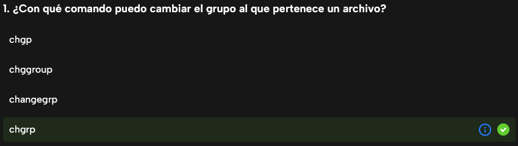
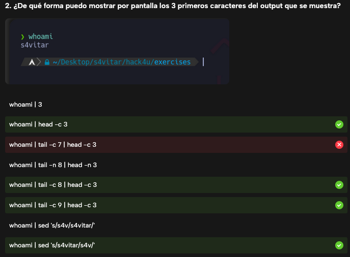

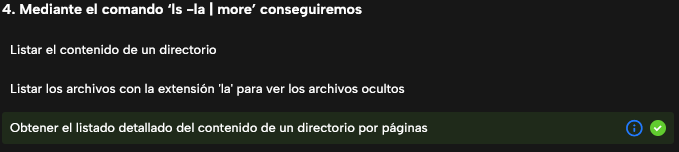
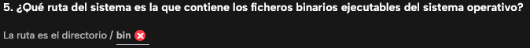

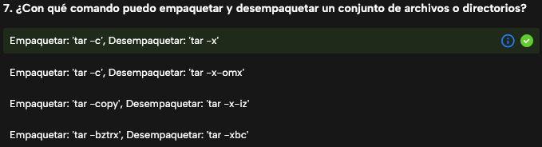
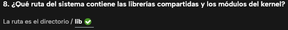
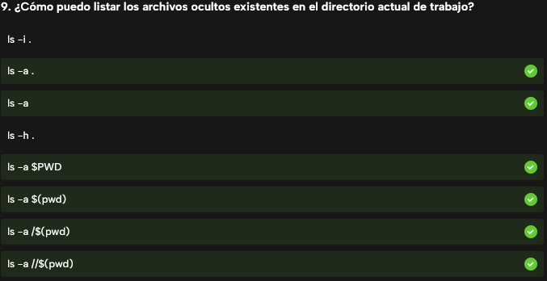
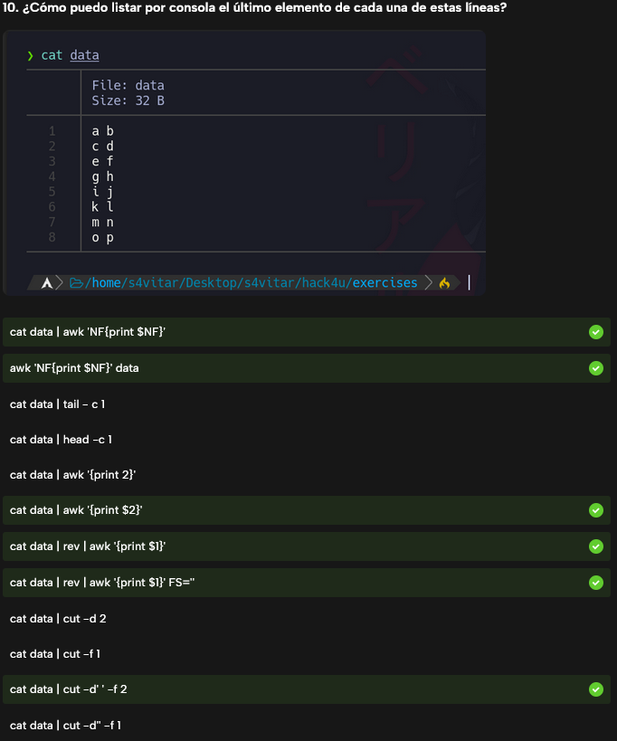
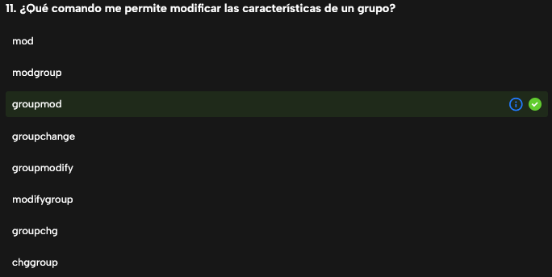
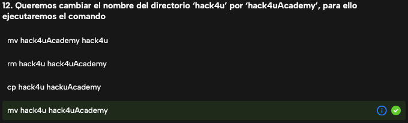
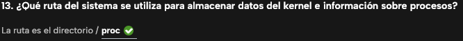
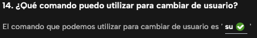

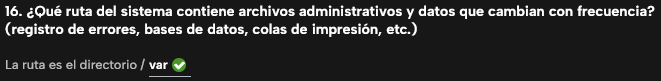
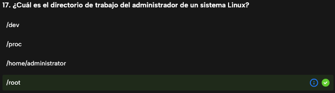
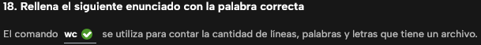

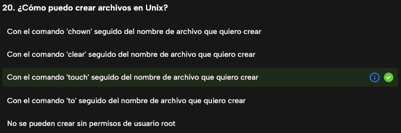
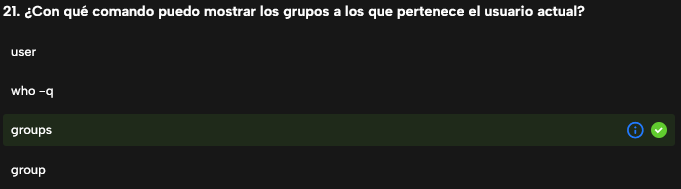
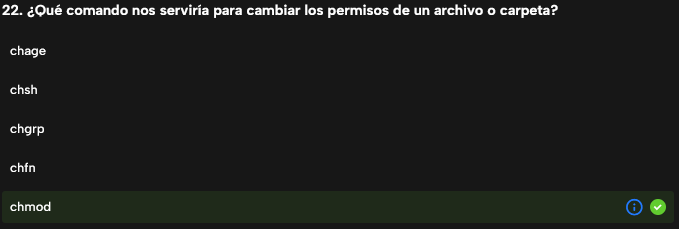
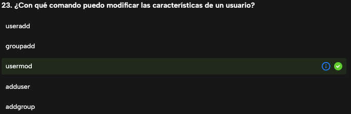

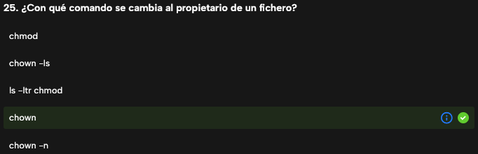
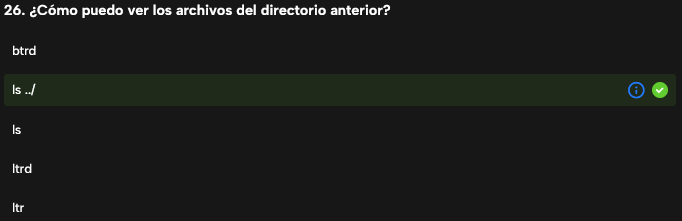
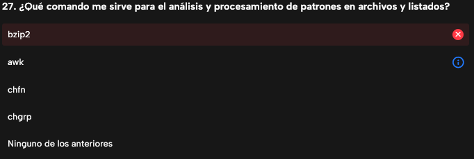
**