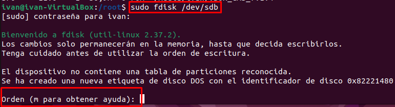
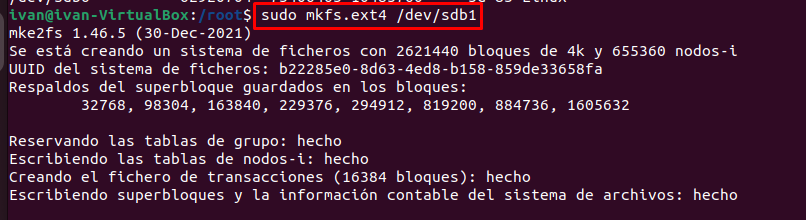

# **Práctica de particionado**

## Enunciado

Realiza el particionado MBR de un disco de 50GiB con:

1. Dos particiones primarias de 10 GiB y 15 GiB.
2. Partición extendida.
3. Dos particiones lógicas de 5 GiB cada una.

- Todas las particiones tendrán como sistema de ficheros ext4.
- Crea un archivo de texto en cada partición con el texto "Soy la partición X y tengo un tamaño de X GiB".
- Las particiones se han de cargar en /media/sdX.
- Realiza las modificaciones necesarias del /etc/fstab para poder montarlas en el arranque del sistema.

---

## Índice

- [**Práctica de particionado**](#práctica-de-particionado)
  - [Enunciado](#enunciado)
  - [Índice](#índice)
  - [Entorno](#entorno)
  - [Particionado del disco](#particionado-del-disco)
    - [1. Comprobar que el disco está accesible.](#1-comprobar-que-el-disco-está-accesible)
    - [2. Herramienta de particionado.](#2-herramienta-de-particionado)
  - [Comprobación](#comprobación)
  - [Ahora pasamos a dar formato a las particiones:](#ahora-pasamos-a-dar-formato-a-las-particiones)
    - [Formato para la Primera partición primaria:](#formato-para-la-primera-partición-primaria)
    - [Formato para la Segunda partición primaria:](#formato-para-la-segunda-partición-primaria)
    - [Formato para la Primera partición lógica:](#formato-para-la-primera-partición-lógica)
    - [Formato para la Segunda partición lógica:](#formato-para-la-segunda-partición-lógica)
  - [Montaje de las particiones:](#montaje-de-las-particiones)
  - [Crear la estructura de carpetas que nos piden:](#crear-la-estructura-de-carpetas-que-nos-piden)
  - [Montamos las particiones en las carpetas creadas:](#montamos-las-particiones-en-las-carpetas-creadas)
  - [Montamos las particiones en el fstab para que sean permanentes:](#montamos-las-particiones-en-el-fstab-para-que-sean-permanentes)
  - [Por último crearemos los archivos de texto para terminar con las comprobaciones.](#por-último-crearemos-los-archivos-de-texto-para-terminar-con-las-comprobaciones)

---

## Entorno

Simulación donde instalaremos una máquina virtual con un SO Ubuntu 24. Añadiremos un disco de 50 GiB, mediante el entorno gráfico que nos ofrece VirtualBox, para poder realizar la tarea encomendada.

- 
- 
- 
- 

## Particionado del disco

### 1. Comprobar que el disco está accesible.

```bash
lsblk
```


### 2. Herramienta de particionado.

Para ello utilizaremos una herramienta de administración de discos llamada **fdisk.**

- Primero seleccionaremos el disco en el que vamos a hacer los cambios con:

  ```bash
  sudo fdisk /dev/sdb
  ```

  

  - En esta herramienta nos dan la opción de ver el manual al pulsar la tecla _'m'_ justo después de lanzar el anterior comando.

  ```bash
  Ayuda:

  DOS (MBR)
  a   conmuta el indicador de iniciable
  b   modifica la etiqueta de disco BSD anidada
  c   conmuta el indicador de compatibilidad con DOS

  General
  d   borra una partición
  F   lista el espacio libre no particionado
  l   lista los tipos de particiones conocidos
  n   añade una nueva partición
  p   muestra la tabla de particiones
  t   cambia el tipo de una partición
  v   verifica la tabla de particiones
  i   imprime información sobre una partición

  Miscelánea
  m   muestra este menú
  u   cambia las unidades de visualización/entrada
  x   funciones adicionales (sólo para usuarios avanzados)

  Script
  I   carga la estructura del disco de un fichero de script sfdisk
  O   vuelca la estructura del disco a un fichero de script sfdisk

  Guardar y Salir
  w   escribe la tabla en el disco y sale
  q   sale sin guardar los cambios

  Crea una nueva etiqueta
  g   crea una nueva tabla de particiones GPT vacía
  G   crea una nueva tabla de particiones SGI (IRIX) vacía
  o   crea una nueva tabla de particiones DOS vacía
  s   crea una nueva tabla de particiones Sun vacía
  ```

- En segundo lugar vamos a realizar las particiones que nos piden en el ejercicio:
- ## Creamos la primera partición:

  El enunciado nos pide que realicemos una primera partición primaria de 10GiB, para ello introduciremos las siguientes órdenes en el administrador de discos **fdisk** :

  ```bash
  Orden (m para obtener ayuda): n
    # n:para añadir una nueva partición
    Tipo de partición
        p   primaria (0 primary, 0 extended, 4 free)
        e   extendida (contenedor para particiones lógicas)
    Seleccionar (valor predeterminado p): p
    # p:le indicamos que es primaria.
    Número de partición (1-4, valor predeterminado 1): 1
    # 1: ya que es la primera partición que queremos realizar en el disco, se puede omitir e igualmente nos cogería la primera.
    Primer sector (2048-104857599, valor predeterminado 2048):
    # omitimos para que se sitúe en el primer sector disponible
    Last sector, +/-sectors or +/-size{K,M,G,T,P} (2048-104857599, valor predeterminado 104857599): +10G
    #Indicamos el tamaño de la partición.

    Crea una nueva partición 1 de tipo 'Linux' y de tamaño 10 GiB.
    Orden (m para obtener ayuda): p
    # Con p podemos comprobar que la partición ha sido creada.
    Disco /dev/sdb: 50 GiB, 53687091200 bytes, 104857600 sectores
    Disk model: VBOX HARDDISK
    Unidades: sectores de 1 * 512 = 512 bytes
    Tamaño de sector (lógico/físico): 512 bytes / 512 bytes
    Tamaño de E/S (mínimo/óptimo): 512 bytes / 512 bytes
    Tipo de etiqueta de disco: dos
    Identificador del disco: 0x82221480

    Dispositivo Inicio Comienzo    Final Sectores Tamaño Id Tipo
    /dev/sdb1              2048 20973567 20971520    10G 83 Linux
  ```

  

- ## Creamos la segunda partición:

  El enunciado nos pide que realicemos una segunda partición primaria de 15GiB, para ello introduciremos las mismas órdenes en el administrador de discos **fdisk** que en el apartado anterior modificando solamente el tamaño que en este caso será de 15 GiB:

  ```bash
    Orden (m para obtener ayuda): n
    Tipo de partición
   p   primaria (1 primary, 0 extended, 3 free)
   e   extendida (contenedor para particiones lógicas)
    Seleccionar (valor predeterminado p): p
    Número de partición (2-4, valor predeterminado 2):
    Primer sector (20973568-104857599, valor predeterminado 20973568):
    Last sector, +/-sectors or +/-size{K,M,G,T,P} (20973568-104857599, valor predeterminado 104857599): +15G

    Crea una nueva partición 2 de tipo 'Linux' y de tamaño 15 GiB.

  ```

  

  ## Comprobación

  - Con la orden **p** sacamos un listado de las particiones realizadas en el disco.

  

- ## Creamos la partición extendida:

  El enunciado nos pide que realicemos una tercera partición extendida que ocupará el restante del disco, para ello introduciremos las mismas órdenes en el administrador de discos:

  ```bash
  Orden (m para obtener ayuda): n
    Tipo de partición
        p   primaria (2 primary, 0 extended, 2 free)
        e   extendida (contenedor para particiones lógicas)
    Seleccionar (valor predeterminado p): e
    # E: indicamos que es una partición extendida
    Número de partición (3,4, valor predeterminado 3):
    #omitimos para que use la siguiente disponible
    Primer sector (52430848-104857599, valor predeterminado 52430848):
    # omitimos para que use el primer sector disponible
    Last sector, +/-sectors or +/-size{K,M,G,T,P} (52430848-104857599, valor predeterminado 104857599):
    # Aquí al contrario que en las otras dos particiones anteriores omitimos para que el administrador use el restante de la memoria disponible.

    Crea una nueva partición 3 de tipo 'Extended' y de tamaño 25 GiB.

  ```

  - ### Añadimos la primera partición lógica que nos pide el enunciado.
    Para ello tendremos que usar la opción **'n'** y como no queda espacio libre para realizar más particiones primarias por defecto ya nos crea la partición sdb5, solo tendremos que indicarle el espacio utilizado por dicha partición y la zona del disco si así lo deseáramos.

  ```bash
    Orden (m para obtener ayuda): n
    Se está utilizando todo el espacio para particiones primarias.
    Se añade la partición lógica 5
    Primer sector (52432896-104857599, valor predeterminado 52432896):
    Last sector, +/-sectors or +/-size{K,M,G,T,P} (52432896-104857599, valor predeterminado 104857599): +5G

    Crea una nueva partición 5 de tipo 'Linux' y de tamaño 5 GiB.

  ```

  - ### Añadimos la segunda partición lógica que nos pide el enunciado.

  ```bash
   Para realizar esta partición tenemos que hacer lo mismo que en el anterior apartado
   Orden (m para obtener ayuda): n
   Se está utilizando todo el espacio para particiones primarias.
   Se añade la partición lógica 6
   Primer sector (62920704-104857599, valor predeterminado 62920704):
   Last sector, +/-sectors or +/-size{K,M,G,T,P} (62920704-104857599, valor predeterminado 104857599): +5G

   Crea una nueva partición 6 de tipo 'Linux' y de tamaño 5 GiB.
  ```

  - ### Hacemos una pequeña comprobación.
    Para ver que todo salió como queremos usamos la orden **'p'**.
    
  - ### El paso más importante y último:
    Por último el paso más importante es escribir estas configuraciones antes de salir. Si no lo hacemos los cambios no se guardarán. Para ello usaremos la orden **'w'**
    

## Ahora pasamos a dar formato a las particiones:

Usaremos el formato **ext4** ya que es el más óptimo y compatible para nuestro SO.
En este apartado usaremos el comando **mkfs.ext4** + "ruta de la partición" con usuario administrador(sudo).

### Formato para la Primera partición primaria:

```bash
sudo mkfs.ext4 /dev/sdb1
```



### Formato para la Segunda partición primaria:

```bash
sudo mkfs.ext4 /dev/sdb2
```


### Formato para la Primera partición lógica:

```bash
sudo mkfs.ext4 /dev/sdb5
```


### Formato para la Segunda partición lógica:

```bash
sudo mkfs.ext4 /dev/sdb6
```


## Montaje de las particiones:

Para poder acceder a estas particiones tenemos que montarlas en nuestro sistema de archivos con el comando **mount** + el nombre del disco que queremos montar o uuid + la ruta en la que queremos que se monte esa partición:

```bash
    sudo mount /dev/sdb1 /media/juegos
```

En este ejemplo nos montaría la partición sdb1 (la primera primaria que hemos creado) en la ubicación /media/juegos.

- Vamos a realizar nuestros montajes:

## Crear la estructura de carpetas que nos piden:

```bash
   mkdir /media/sdb1 /media/sdb2 /media/sdb5 /media/sdb6
```


## Montamos las particiones en las carpetas creadas:

Lo podemos hacer de dos formas, en este caso lo haré por el nombre de la partición con el comando mount, lo malo de esta forma de hacerlo es que se perderán estos cambios al apagar el equipo.

```bash
   mount /dev/sdb1 /media/sdb1
   mount /dev/sdb2 /media/sdb2
   mount /dev/sdb5 /media/sdb5
   mount /dev/sdb6 /media/sdb6
```


```bash
    mount  | grep sdb
```


## Montamos las particiones en el fstab para que sean permanentes:

En este paso las montaré mediante **UUID** por seguridad. Así evitamos la suplantación de disco.
Al meterlas en este archivo lo que conseguimos es que al apagar el equipo e iniciarlo de nuevo estos montajes se realicen de forma automática.

1. hacemos una copia del archivo por si metemos la pata:

```bash
cp -pv /etc/fstab /etc/fstab_VIEJO
```

Ahora obtendremos el UUID de cada una de las particiones creadas para usarlas en el archivo **fstab**

```bash
blkid | grep sdb1 | awk -F ' ' '{print $2}' | sed 's/"//g'
blkid | grep sdb2 | awk -F ' ' '{print $2}' | sed 's/"//g'
blkid | grep sdb5 | awk -F ' ' '{print $2}' | sed 's/"//g'
blkid | grep sdb6 | awk -F ' ' '{print $2}' | sed 's/"//g'
```


Comprobamos que esté bien el archivo fstab con:

```bash
mount -a
```

Si no devuelve error estaría bien.

## Por último crearemos los archivos de texto para terminar con las comprobaciones.

Primero creamos los archivos en cada partición:

```bash
echo Soy la partición 1 y tengo un tamaño de 10 GiB > /media/sdb1/1.txt
echo Soy la partición 2 y tengo un tamaño de 15 GiB > /media/sdb2/2.txt
echo Soy la partición 5 y tengo un tamaño de 5 GiB > /media/sdb5/5.txt
echo Soy la partición 6 y tengo un tamaño de 5 GiB > /media/sdb6/6.txt
```


Una vez creados procedemos a reiniciar el equipo y vemos que las particiones siguen montadas en la ubicación que indicamos en el **fstab** con su contenido original.

