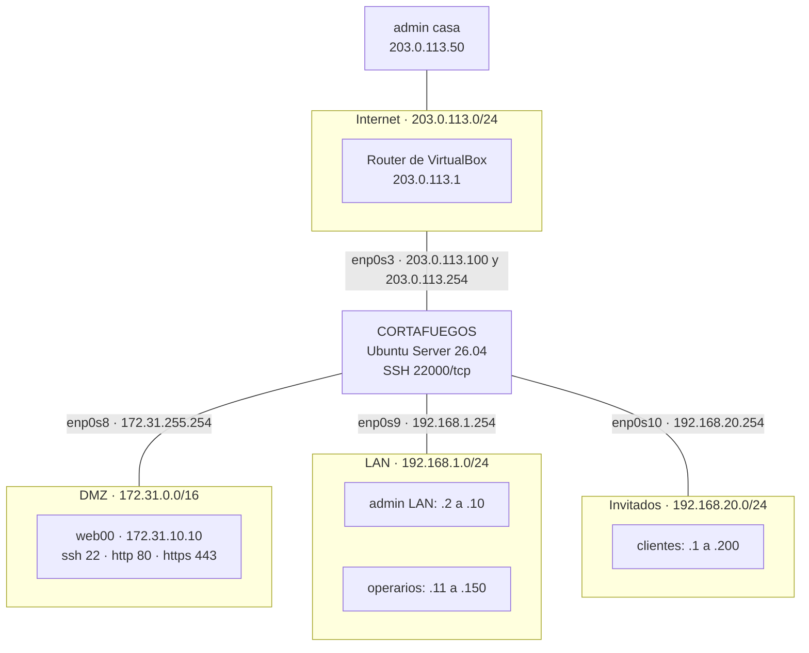

# **Solución 6.2: Cortafuegos perimetral con iptables**

### **Descripción de la tarea**

El administrador de red decide hacer cambios en el **cortafuegos perimetral** situado entre las redes de la organización e Internet. El cortafuegos tiene cuatro interfaces de red, una por cada red:



El cortafuegos ya está en funcionamiento con reglas activas y tiene las siguientes características:

- Está basado en **iptables**, en un **Ubuntu Server 26.04**.
- Ya tiene creadas las reglas para el tráfico `RELATED` y `ESTABLISHED`, y en las reglas nuevas hay que hacer **seguimiento de los estados**.
- Descarta todo el tráfico no deseado mediante la **política** de las cadenas predefinidas.
- La interfaz `enp0s3` tiene asignadas las IP públicas `203.0.113.100` y `203.0.113.254`.

Toda la teoría que se aplica en esta tarea (tablas, cadenas, estados, acciones, cadenas de usuario y NAT) está en el documento 46 de los apuntes. En particular, su apartado 11 recoge el método para pasar de un requisito a sus reglas, que es el que se sigue en cada apartado.

> **Nota:** Las direcciones `203.0.113.0/24` y `198.51.100.0/24` son rangos reservados para documentación y ejemplos (RFC 5737). En el laboratorio, la red `203.0.113.0/24` hace de «Internet»: es una Red NAT de VirtualBox, así que el cortafuegos tiene salida real a Internet a través del router de VirtualBox (`203.0.113.1`).

### **Pasos de la tarea**

**Preparación del laboratorio**

1. Crea en VirtualBox las redes del escenario: una **Red NAT** llamada `Internet`, con la red `203.0.113.0/24` y sin DHCP, y tres **redes internas** llamadas `dmz`, `lan` e `invitados`.

La Red NAT se crea desde el anfitrión. Las redes internas no hace falta crearlas: existen en cuanto una tarjeta de red se conecta a una red interna con ese nombre.

```powershell
PS C:\> VBoxManage natnetwork add --netname Internet --network "203.0.113.0/24" --enable --dhcp off
PS C:\> VBoxManage list natnets
NetworkName:    Internet
IP:             203.0.113.1
Network:        203.0.113.0/24
...
```

2. Prepara el **cortafuegos**: asígnale las cuatro tarjetas de red en el orden de la figura, configura sus direcciones IP con Netplan, activa de forma persistente el reenvío IP y haz que su servidor SSH escuche en el puerto `22000`. Instala también los paquetes `iptables-persistent` y `conntrack` y comprueba que `ufw` está inactivo.

Con la máquina apagada, se conectan sus cuatro tarjetas. Puede hacerse desde la configuración de red de la máquina en VirtualBox o desde el anfitrión:

```powershell
PS C:\> VBoxManage modifyvm "cortafuegos" --nic1 natnetwork --nat-network1 Internet --nic2 intnet --intnet2 dmz --nic3 intnet --intnet3 lan --nic4 intnet --intnet4 invitados
```

| Tarjeta de VirtualBox | Interfaz en Ubuntu | Red | IP del cortafuegos |
|---|---|---|---|
| Adaptador 1 | `enp0s3` | Red NAT `Internet` | `203.0.113.100/24` y `203.0.113.254/24` |
| Adaptador 2 | `enp0s8` | Red interna `dmz` | `172.31.255.254/16` |
| Adaptador 3 | `enp0s9` | Red interna `lan` | `192.168.1.254/24` |
| Adaptador 4 | `enp0s10` | Red interna `invitados` | `192.168.20.254/24` |

Se sustituye la configuración de red del instalador por una propia:

```bash
usuario@cortafuegos:~$ sudo hostnamectl hostname cortafuegos
usuario@cortafuegos:~$ sudo mv /etc/netplan/50-cloud-init.yaml /root/
usuario@cortafuegos:~$ sudo nano /etc/netplan/60-cortafuegos.yaml
```

```yaml
# /etc/netplan/60-cortafuegos.yaml
network:
  version: 2
  ethernets:
    enp0s3:
      addresses:
        - 203.0.113.100/24
        - 203.0.113.254/24
      routes:
        - to: default
          via: 203.0.113.1
      nameservers:
        addresses:
          - 8.8.8.8
    enp0s8:
      addresses:
        - 172.31.255.254/16
    enp0s9:
      addresses:
        - 192.168.1.254/24
    enp0s10:
      addresses:
        - 192.168.20.254/24
```

```bash
usuario@cortafuegos:~$ sudo chmod 600 /etc/netplan/60-cortafuegos.yaml
usuario@cortafuegos:~$ sudo netplan apply
usuario@cortafuegos:~$ ip -br -4 address
lo               UNKNOWN        127.0.0.1/8
enp0s3           UP             203.0.113.100/24 203.0.113.254/24
enp0s8           UP             172.31.255.254/16
enp0s9           UP             192.168.1.254/24
enp0s10          UP             192.168.20.254/24
```

Se activa el **reenvío IP**, sin el cual el cortafuegos no pasaría paquetes de una red a otra (apartado 3.1 del documento 31):

```bash
usuario@cortafuegos:~$ echo 'net.ipv4.ip_forward = 1' | sudo tee /etc/sysctl.d/99-router.conf
usuario@cortafuegos:~$ sudo sysctl -p /etc/sysctl.d/99-router.conf
net.ipv4.ip_forward = 1
```

Se cambia el puerto de SSH. Como se vio en la tarea 5.2, en Ubuntu Server SSH se activa por *socket*, así que tras el cambio hay que regenerarlo:

```bash
usuario@cortafuegos:~$ echo 'Port 22000' | sudo tee /etc/ssh/sshd_config.d/10-puerto.conf
usuario@cortafuegos:~$ sudo systemctl daemon-reload
usuario@cortafuegos:~$ sudo systemctl restart ssh.socket
usuario@cortafuegos:~$ sudo ss -tlnp | grep 22000
LISTEN 0  4096  0.0.0.0:22000  0.0.0.0:*  users:(("systemd",pid=1,fd=104))
LISTEN 0  4096     [::]:22000     [::]:*  users:(("systemd",pid=1,fd=105))
```

Por último se instalan los paquetes que harán falta y se comprueba que `ufw` no está gestionando el cortafuegos:

```bash
usuario@cortafuegos:~$ sudo apt update && sudo apt -y install iptables-persistent conntrack
usuario@cortafuegos:~$ sudo ufw status
Status: inactive
usuario@cortafuegos:~$ sudo iptables -V
iptables v1.8.11 (nf_tables)
```

_*Nota*_: Los paquetes deben instalarse **ahora**. En cuanto se cargue el estado inicial del paso 5, la política de `OUTPUT` en `DROP` impedirá que el cortafuegos se conecte a los repositorios. Al instalar `iptables-persistent`, el instalador pregunta si se quieren guardar las reglas actuales; en este momento da igual la respuesta, porque se guardarán al final de la tarea.

3. Prepara **web00**: instala Apache con HTTPS activado y el servidor SSH, conéctalo después a la red `dmz` y configura su IP (`172.31.10.10/16`), con el cortafuegos como puerta de enlace.

Mientras web00 tiene su tarjeta en modo NAT, y por tanto salida a Internet, se instalan los servicios:

```bash
root@web00:~# apt update && apt -y install apache2 openssh-server
root@web00:~# a2enmod ssl
root@web00:~# a2ensite default-ssl
root@web00:~# systemctl reload apache2
root@web00:~# echo '<h1>web00</h1>' > /var/www/html/index.html
```

`a2enmod ssl` activa el módulo de HTTPS y `a2ensite default-ssl` activa el sitio HTTPS por defecto, que usa un certificado autofirmado. Después se apaga la máquina, se conecta su tarjeta a la red interna `dmz` y se le asigna su IP fija en `/etc/network/interfaces`, sustituyendo la configuración por DHCP:

```bash
# /etc/network/interfaces
source /etc/network/interfaces.d/*

auto lo
iface lo inet loopback

auto enp0s3
iface enp0s3 inet static
    address 172.31.10.10/16
    gateway 172.31.255.254
```

```bash
root@web00:~# reboot
```

4. Prepara el **cliente**: instala `curl` y déjalo listo para cambiar de red y de IP en cada prueba.

Con la tarjeta en modo NAT se instala `curl`. Después se elimina, o se comenta, el bloque de `enp0s3` de `/etc/network/interfaces`, para que el cliente no intente obtener IP por DHCP, y se reinicia:

```bash
root@cliente:~# apt update && apt -y install curl
root@cliente:~# sed -i 's/^\(allow-hotplug enp0s3\|auto enp0s3\|iface enp0s3.*\)/# &/' /etc/network/interfaces
root@cliente:~# echo 'nameserver 8.8.8.8' > /etc/resolv.conf
root@cliente:~# reboot
```

El cliente hará el papel de cada equipo de la figura. Para cada prueba se cambia la red interna de su tarjeta en VirtualBox, lo que se puede hacer con la máquina encendida, y se le asigna la IP correspondiente de forma no persistente con `ip` (documento 31):

| Posición | Red de VirtualBox | IP del cliente | Puerta de enlace | Hace de |
|---|---|---|---|---|
| A | `lan` | `192.168.1.5/24` | `192.168.1.254` | admin LAN |
| B | `lan` | `192.168.1.20/24` | `192.168.1.254` | operario |
| C | `invitados` | `192.168.20.50/24` | `192.168.20.254` | invitado autorizado |
| D | `invitados` | `192.168.20.210/24` | `192.168.20.254` | invitado no autorizado |
| E | Red NAT `Internet` | `203.0.113.50/24` | `203.0.113.1` | admin casa |
| F | Red NAT `Internet` | `203.0.113.60/24` | `203.0.113.1` | otro equipo de Internet |

Por ejemplo, para colocar el cliente en la posición A:

```bash
root@cliente:~# ip address flush dev enp0s3
root@cliente:~# ip address add 192.168.1.5/24 dev enp0s3
root@cliente:~# ip route add default via 192.168.1.254
```

5. Carga en el cortafuegos su estado inicial con el *script* `cortafuegos_base.sh` y analiza las reglas y las políticas que deja.

El *script* reproduce el punto de partida del enunciado: un cortafuegos que ya está en funcionamiento. Se ejecuta desde la **consola** del cortafuegos:

```bash
usuario@cortafuegos:~$ wget https://raw.githubusercontent.com/martin2745/curso-linux/main/apuntes/tareas/tarea6.2/recursos/cortafuegos_base.sh
usuario@cortafuegos:~$ sudo bash cortafuegos_base.sh
usuario@cortafuegos:~$ sudo iptables -S
-P INPUT DROP
-P FORWARD DROP
-P OUTPUT DROP
-A INPUT -i lo -j ACCEPT
-A INPUT -m conntrack --ctstate RELATED,ESTABLISHED -j ACCEPT
-A INPUT -m conntrack --ctstate INVALID -j DROP
-A INPUT -s 192.168.1.0/24 -i enp0s9 -p icmp -m icmp --icmp-type 8 -m conntrack --ctstate NEW -j ACCEPT
-A INPUT -s 172.31.0.0/16 -i enp0s8 -p icmp -m icmp --icmp-type 8 -m conntrack --ctstate NEW -j ACCEPT
-A FORWARD -m conntrack --ctstate RELATED,ESTABLISHED -j ACCEPT
-A OUTPUT -o lo -j ACCEPT
-A OUTPUT -m conntrack --ctstate RELATED,ESTABLISHED -j ACCEPT
```

| Elemento | Efecto |
|---|---|
| Políticas en `DROP` | Todo lo que no esté expresamente permitido se descarta, en las tres cadenas. |
| `-i lo` / `-o lo` | El cortafuegos puede comunicarse consigo mismo. Lo necesitan, por ejemplo, el resolvedor DNS local y otros servicios del sistema. |
| `ESTABLISHED,RELATED` | Pasan las respuestas de cualquier conexión permitida, en las tres cadenas. |
| `INVALID` | Se descartan los paquetes que no pertenecen a ninguna conexión conocida. |
| Ping desde la LAN y la DMZ | Reglas 4 y 5 de `INPUT`. |

En este estado, el cortafuegos **no puede** resolver nombres ni conectarse a los repositorios, nadie puede abrir una conexión SSH nueva con él y no pasa ningún tráfico entre redes. Las sesiones SSH que ya estuvieran abiertas se mantienen gracias a la regla `ESTABLISHED,RELATED`.

_*Nota*_: El *script* deja **exactamente cinco reglas** en `INPUT` a propósito. El apartado 2 pide insertar una regla en la posición 5, y `iptables -I` solo admite posiciones en las que ya haya, como mínimo, la regla anterior. Además, la regla insertada desplazará la quinta regla actual a la sexta posición, lo que permite ver en la práctica cómo funciona `-I`. También cierra IPv6 con `ip6tables`, porque en el laboratorio no se usa.

**Apartado 1: resolución DNS y acceso a la caché de paquetes del cortafuegos**

6. Añade al final de las cadenas predefinidas que correspondan las reglas necesarias para que el cortafuegos pueda hacer consultas DNS al servidor `8.8.8.8`.

Aplicando el método del documento 46:

| Pregunta | Respuesta |
|---|---|
| ¿Al cortafuegos, desde él o a través de él? | **Desde** el cortafuegos: cadena `OUTPUT`. |
| ¿Interfaz? | Sale hacia Internet: `-o enp0s3`. |
| ¿Protocolo, puerto y destino? | DNS usa el puerto 53, normalmente por **UDP**, pero también por **TCP** cuando la respuesta es grande. Destino `8.8.8.8`. |
| ¿Al final o en una posición? | Al final: `-A`. |
| ¿Respuestas? | Ya las acepta la regla `ESTABLISHED,RELATED` de `INPUT`. |

```bash
usuario@cortafuegos:~$ sudo iptables -A OUTPUT -o enp0s3 -d 8.8.8.8 -p udp --dport 53 -m conntrack --ctstate NEW -j ACCEPT
usuario@cortafuegos:~$ sudo iptables -A OUTPUT -o enp0s3 -d 8.8.8.8 -p tcp --dport 53 -m conntrack --ctstate NEW -j ACCEPT
```

7. Añade al final de las cadenas predefinidas que correspondan las reglas necesarias para que el cortafuegos pueda acceder a la caché de paquetes configurada en `/etc/apt/apt.conf.d/01apt-cacher-ng`.

El fichero indica que `apt` debe conectarse a un *proxy* en `https://198.51.100.10:8080`. Para el cortafuegos, eso es una conexión TCP saliente a esa IP y ese puerto; que el *proxy* use HTTPS no cambia la regla, porque el puerto de destino es el `8080`:

```bash
usuario@cortafuegos:~$ sudo iptables -A OUTPUT -o enp0s3 -d 198.51.100.10 -p tcp --dport 8080 -m conntrack --ctstate NEW -j ACCEPT
```

Para comprobar el apartado, se hace una consulta DNS y se miran los contadores de `OUTPUT`:

```bash
usuario@cortafuegos:~$ resolvectl query debian.org
debian.org: 151.101.2.132                      -- link: enp0s3
...
usuario@cortafuegos:~$ sudo iptables -L OUTPUT -n -v --line-numbers
Chain OUTPUT (policy DROP 0 packets, 0 bytes)
num   pkts bytes target     prot opt in     out     source               destination
1       18  1404 ACCEPT     0    --  *      lo      0.0.0.0/0            0.0.0.0/0
2        6   452 ACCEPT     0    --  *      *       0.0.0.0/0            0.0.0.0/0            ctstate RELATED,ESTABLISHED
3        2   124 ACCEPT     17   --  *      enp0s3  0.0.0.0/0            8.8.8.8              udp dpt:53 ctstate NEW
4        0     0 ACCEPT     6    --  *      enp0s3  0.0.0.0/0            8.8.8.8              tcp dpt:53 ctstate NEW
5        0     0 ACCEPT     6    --  *      enp0s3  0.0.0.0/0            198.51.100.10        tcp dpt:8080 ctstate NEW
```

Los paquetes de la consulta DNS han pasado por la regla 3. El resolvedor de Ubuntu (`systemd-resolved`) recibe la consulta por la interfaz de bucle local (regla 1) y la reenvía a `8.8.8.8` (regla 3).

En el laboratorio no existe ningún *proxy* en `198.51.100.10`, pero la regla se puede comprobar igualmente con `nc`, comparando el puerto permitido con otro que no lo está:

```bash
usuario@cortafuegos:~$ nc -zv -w 3 198.51.100.10 8080
nc: connect to 198.51.100.10 port 8080 (tcp) timed out: Operation now in progress
usuario@cortafuegos:~$ nc -zv -w 3 198.51.100.10 8081
nc: connect to 198.51.100.10 port 8081 (tcp) failed: Operation not permitted
```

Con el puerto `8080`, el paquete **sale** del cortafuegos y nadie responde, así que la conexión agota su tiempo; el contador de la regla 5 sube. Con el `8081`, el propio núcleo descarta el paquete en `OUTPUT` antes de que salga, y lo comunica al instante al programa con el error `Operation not permitted`.

**Apartado 2: administración del cortafuegos por SSH mediante una cadena de usuario**

8. Crea una cadena de usuario llamada `SSH_FW`.

```bash
usuario@cortafuegos:~$ sudo iptables -N SSH_FW
```

9. Inserta una regla, en la **posición número 5** de la cadena predefinida que corresponda, que derive los intentos de acceso por SSH al cortafuegos a la cadena `SSH_FW`.

El tráfico SSH va dirigido **al** cortafuegos, así que la cadena es `INPUT`. La regla desvía a `SSH_FW` los intentos de conexión nuevos (`NEW`) al puerto `22000/tcp`:

```bash
usuario@cortafuegos:~$ sudo iptables -I INPUT 5 -p tcp --dport 22000 -m conntrack --ctstate NEW -j SSH_FW
usuario@cortafuegos:~$ sudo iptables -L INPUT -n --line-numbers
Chain INPUT (policy DROP)
num  target     prot opt source               destination
1    ACCEPT     0    --  0.0.0.0/0            0.0.0.0/0
2    ACCEPT     0    --  0.0.0.0/0            0.0.0.0/0            ctstate RELATED,ESTABLISHED
3    DROP       0    --  0.0.0.0/0            0.0.0.0/0            ctstate INVALID
4    ACCEPT     1    --  192.168.1.0/24       0.0.0.0/0            icmptype 8 ctstate NEW
5    SSH_FW     6    --  0.0.0.0/0            0.0.0.0/0            tcp dpt:22000 ctstate NEW
6    ACCEPT     1    --  172.31.0.0/16        0.0.0.0/0            icmptype 8 ctstate NEW
```

La regla ocupa la posición 5 y la que estaba en ella, el ping desde la DMZ, ha pasado a la 6.

10. Completa la cadena `SSH_FW`.

```bash
usuario@cortafuegos:~$ sudo iptables -A SSH_FW -i enp0s9 -m iprange --src-range 192.168.1.2-192.168.1.10 -j ACCEPT
usuario@cortafuegos:~$ sudo iptables -A SSH_FW -i enp0s3 -s 203.0.113.50 -j ACCEPT
usuario@cortafuegos:~$ sudo iptables -A SSH_FW -j LOG --log-prefix "ssh fw "
usuario@cortafuegos:~$ sudo iptables -A SSH_FW -p tcp -j REJECT --reject-with tcp-reset
```

| Regla | Qué hace |
|---|---|
| `-i enp0s9 -m iprange --src-range 192.168.1.2-192.168.1.10` | Acepta a los equipos **admin LAN**. El rango no coincide con una red completa, así que se usa el módulo `iprange`. |
| `-i enp0s3 -s 203.0.113.50` | Acepta al equipo **admin casa**. |
| `-j LOG --log-prefix "ssh fw "` | Registra cualquier otro intento. `LOG` no termina el recorrido, así que el paquete pasa a la regla siguiente. |
| `-p tcp -j REJECT --reject-with tcp-reset` | Rechaza el intento respondiendo con un `RST` de TCP. |

Indicar la interfaz en cada regla de permiso es lo que garantiza que **los paquetes llegan por la interfaz adecuada**: las IP de los administradores de la LAN solo se aceptan si entran por `enp0s9`, y la de admin casa solo si entra por `enp0s3`. Un equipo de otra red que falsificara una de esas IP no coincidiría con la regla y acabaría registrado y rechazado.

_*Nota*_: Se podría afinar más añadiendo también la IP de destino del cortafuegos en cada interfaz, por ejemplo `-d 192.168.1.254` en la regla de la LAN. No es imprescindible, porque la regla de `INPUT` ya solo deriva tráfico dirigido al propio cortafuegos.

Para comprobarlo, se coloca el cliente en cada posición e intenta conectarse:

```bash
# Posición A (admin LAN, 192.168.1.5): entra
root@cliente:~# ssh -p 22000 usuario@192.168.1.254
usuario@cortafuegos:~$ exit

# Posición B (operario, 192.168.1.20): rechazado al instante
root@cliente:~# ssh -p 22000 usuario@192.168.1.254
ssh: connect to host 192.168.1.254 port 22000: Connection refused

# Posición E (admin casa, 203.0.113.50): entra
root@cliente:~# ssh -p 22000 usuario@203.0.113.100
usuario@cortafuegos:~$ exit

# Posición F (otro equipo de Internet, 203.0.113.60): rechazado
root@cliente:~# ssh -p 22000 usuario@203.0.113.100
ssh: connect to host 203.0.113.100 port 22000: Connection refused
```

Los intentos rechazados quedan registrados con el prefijo indicado:

```bash
usuario@cortafuegos:~$ sudo journalctl -k -g "ssh fw"
oct 07 13:10:42 cortafuegos kernel: ssh fw IN=enp0s9 OUT= MAC=08:00:27:4b:1d:20:08:00:27:9e:12:44:08:00 SRC=192.168.1.20 DST=192.168.1.254 LEN=60 TOS=0x00 PREC=0x00 TTL=64 ID=31027 DF PROTO=TCP SPT=48712 DPT=22000 WINDOW=64240 RES=0x00 SYN URGP=0
oct 07 13:14:05 cortafuegos kernel: ssh fw IN=enp0s3 OUT= MAC=08:00:27:7c:02:9a:52:54:00:12:35:00:08:00 SRC=203.0.113.60 DST=203.0.113.100 LEN=60 TOS=0x00 PREC=0x00 TTL=64 ID=5512 DF PROTO=TCP SPT=39220 DPT=22000 WINDOW=64240 RES=0x00 SYN URGP=0
```

**Apartado 3: control de la red de invitados**

11. Añade al final de las cadenas predefinidas que correspondan las reglas necesarias para permitir a los clientes de la red de invitados cualquier tipo de tráfico hacia Internet, pero no hacia las demás redes internas. Saldrán a Internet con la IP pública `203.0.113.100`.

| Pregunta | Respuesta |
|---|---|
| ¿Al cortafuegos, desde él o a través de él? | **A través**: cadena `FORWARD`. |
| ¿Hay que cambiar alguna dirección? | Sí, el **origen**: SNAT en `POSTROUTING`, con la IP `203.0.113.100`. |
| ¿Interfaces? | Entra por `enp0s10` (invitados) y sale por `enp0s3` (Internet). |
| ¿Origen? | Solo los clientes de `.1` a `.200`: `-m iprange --src-range`. |
| ¿Cualquier tipo de tráfico? | No se indica protocolo ni puerto. |

```bash
usuario@cortafuegos:~$ sudo iptables -A FORWARD -i enp0s10 -o enp0s3 -m iprange --src-range 192.168.20.1-192.168.20.200 -m conntrack --ctstate NEW -j ACCEPT
usuario@cortafuegos:~$ sudo iptables -t nat -A POSTROUTING -o enp0s3 -m iprange --src-range 192.168.20.1-192.168.20.200 -j SNAT --to-source 203.0.113.100
```

La clave para que los invitados lleguen a Internet **pero no a las demás redes internas** está en `-o enp0s3`: la regla solo permite el tráfico que sale hacia Internet. El que fuera hacia la DMZ (`enp0s8`) o la LAN (`enp0s9`) no coincide con ninguna regla y lo descarta la política de `FORWARD`.

12. Los intentos de acceso de equipos no autorizados de la red de invitados deben registrarse y descartarse en silencio, con el prefijo `Bloqueo visitantes`.

Los equipos no autorizados son los que **no** están en el rango de `.1` a `.200`. El `!` delante de `--src-range` niega el rango. «Descartar en silencio» es la acción `DROP`:

```bash
usuario@cortafuegos:~$ sudo iptables -A FORWARD -i enp0s10 -m iprange ! --src-range 192.168.20.1-192.168.20.200 -j LOG --log-prefix "Bloqueo visitantes "
usuario@cortafuegos:~$ sudo iptables -A FORWARD -i enp0s10 -m iprange ! --src-range 192.168.20.1-192.168.20.200 -j DROP
```

_*Nota*_: La política de `FORWARD` ya descarta estos paquetes, así que el `DROP` explícito no cambia el resultado, pero deja clara la intención y no depende de la política. Los intentos de un invitado **autorizado** de acceder a las redes internas también se descartan en silencio, por la política, pero no se registran, porque el enunciado solo pide registrar los de los equipos no autorizados. Si se quisieran registrar todos, bastaría con quitar la condición del rango en las dos últimas reglas.

Para comprobarlo, con el cliente en la posición C (invitado autorizado, `192.168.20.50`):

```bash
root@cliente:~# curl -sI https://www.debian.org | head -1
HTTP/2 200
root@cliente:~# curl -m 5 http://172.31.10.10
curl: (28) Connection timed out after 5001 milliseconds
```

Navega por Internet, pero no llega a web00, en la DMZ. En el cortafuegos se ve que sale con la IP pública `203.0.113.100`:

```bash
usuario@cortafuegos:~$ sudo conntrack -L -s 192.168.20.50 -p tcp --dport 443
tcp      6 431997 ESTABLISHED src=192.168.20.50 dst=151.101.2.132 sport=46118 dport=443 src=151.101.2.132 dst=203.0.113.100 sport=443 dport=46118 [ASSURED] mark=0 use=1
```

Cada línea de `conntrack` muestra la conexión en los dos sentidos. En el primero, el origen es la IP privada del invitado; en el segundo, el de la respuesta, el destino es **`203.0.113.100`**: el servidor de Internet ha visto la conexión como si viniera de esa IP pública.

Con el cliente en la posición D (invitado no autorizado, `192.168.20.210`), no sale a Internet y el intento queda registrado:

```bash
root@cliente:~# curl -m 5 -sI https://www.debian.org
root@cliente:~# echo $?
28
```

```bash
usuario@cortafuegos:~$ sudo journalctl -k -g "Bloqueo visitantes"
oct 07 13:25:31 cortafuegos kernel: Bloqueo visitantes IN=enp0s10 OUT=enp0s3 MAC=08:00:27:61:a3:0e:08:00:27:9e:12:44:08:00 SRC=192.168.20.210 DST=8.8.8.8 LEN=72 TOS=0x00 PREC=0x00 TTL=63 ID=40711 DF PROTO=UDP SPT=51867 DPT=53 LEN=52
```

El primer paquete bloqueado es la consulta DNS a `8.8.8.8`: el invitado no autorizado ni siquiera consigue resolver el nombre del servidor. El código de salida `28` de `curl` indica que se agotó el tiempo.

**Apartado 4: acceso al servicio web de web00**

13. Añade al final de las cadenas predefinidas que correspondan las reglas necesarias para permitir el acceso a HTTP y HTTPS de web00 desde Internet, a través de la IP pública `203.0.113.254`, y desde la LAN, directamente a su IP privada.

| Pregunta | Respuesta |
|---|---|
| ¿Al cortafuegos, desde él o a través de él? | **A través**: cadena `FORWARD`. |
| ¿Hay que cambiar alguna dirección? | Desde Internet, sí: el **destino** `203.0.113.254` debe pasar a ser `172.31.10.10`, con DNAT en `PREROUTING`. Desde la LAN, no: se conecta directamente a la IP privada. |
| ¿Interfaces? | Desde Internet entra por `enp0s3`; desde la LAN, por `enp0s9`. En los dos casos sale por `enp0s8`, hacia la DMZ. |
| ¿Protocolo y puertos? | TCP, puertos `80` y `443`: `-m multiport --dports 80,443`. |

```bash
usuario@cortafuegos:~$ sudo iptables -t nat -A PREROUTING -i enp0s3 -d 203.0.113.254 -p tcp -m multiport --dports 80,443 -j DNAT --to-destination 172.31.10.10
usuario@cortafuegos:~$ sudo iptables -A FORWARD -i enp0s3 -o enp0s8 -d 172.31.10.10 -p tcp -m multiport --dports 80,443 -m conntrack --ctstate NEW -j ACCEPT
usuario@cortafuegos:~$ sudo iptables -A FORWARD -i enp0s9 -o enp0s8 -d 172.31.10.10 -p tcp -m multiport --dports 80,443 -m conntrack --ctstate NEW -j ACCEPT
```

| Regla | Qué hace |
|---|---|
| DNAT en `PREROUTING` | Las conexiones que llegan desde Internet a `203.0.113.254`, puertos 80 y 443, se redirigen a web00. `-d 203.0.113.254` hace que se publique **solo** en esa IP pública, y no en la `203.0.113.100`. |
| `FORWARD` desde `enp0s3` | Permite que esas conexiones atraviesen el cortafuegos. Usa la IP **privada** de web00, porque el DNAT ya se ha aplicado cuando el paquete llega a `FORWARD`. |
| `FORWARD` desde `enp0s9` | Permite el acceso desde la LAN, directamente a la IP privada. |

_*Nota*_: Las dos reglas de `FORWARD` podrían parecer resumibles en una sola, quitando `-i`. Pero esa regla también dejaría pasar a los invitados autorizados hacia web00, lo que el enunciado prohíbe. Indicar la interfaz de entrada en cada regla es lo que separa las redes que tienen permiso de las que no.

Para comprobarlo, con el cliente en la posición E (Internet, `203.0.113.50`):

```bash
root@cliente:~# curl -I http://203.0.113.254
HTTP/1.1 200 OK
Server: Apache/2.4.65 (Debian)
...
root@cliente:~# curl -kI https://203.0.113.254
HTTP/1.1 200 OK
...
root@cliente:~# curl -m 5 http://203.0.113.100
curl: (28) Connection timed out after 5001 milliseconds
```

web00 responde a través de `203.0.113.254`, pero no de `203.0.113.100`, porque el DNAT solo se aplica a la primera. La opción `-k` de `curl` acepta el certificado autofirmado de web00. En el registro de Apache se ve que web00 recibe la IP **real** del cliente de Internet, porque el DNAT solo cambia el destino:

```bash
root@web00:~# tail -n 1 /var/log/apache2/access.log
203.0.113.50 - - [07/Oct/2026:13:41:08 +0200] "HEAD / HTTP/1.1" 200 255 "-" "curl/8.14.1"
```

Desde la LAN (posición A o B) se accede directamente a la IP privada, y desde la red de invitados (posición C), no:

```bash
root@cliente:~# curl -I http://172.31.10.10
HTTP/1.1 200 OK
...
```

**Comprobación y cierre**

14. Comprueba el funcionamiento de cada apartado moviendo el cliente por las distintas redes, y consulta los registros y los contadores del cortafuegos.

Las pruebas de cada apartado se han hecho junto a sus reglas. El estado final completo del cortafuegos es el siguiente:

```bash
usuario@cortafuegos:~$ sudo iptables -S
-P INPUT DROP
-P FORWARD DROP
-P OUTPUT DROP
-N SSH_FW
-A INPUT -i lo -j ACCEPT
-A INPUT -m conntrack --ctstate RELATED,ESTABLISHED -j ACCEPT
-A INPUT -m conntrack --ctstate INVALID -j DROP
-A INPUT -s 192.168.1.0/24 -i enp0s9 -p icmp -m icmp --icmp-type 8 -m conntrack --ctstate NEW -j ACCEPT
-A INPUT -p tcp -m tcp --dport 22000 -m conntrack --ctstate NEW -j SSH_FW
-A INPUT -s 172.31.0.0/16 -i enp0s8 -p icmp -m icmp --icmp-type 8 -m conntrack --ctstate NEW -j ACCEPT
-A FORWARD -m conntrack --ctstate RELATED,ESTABLISHED -j ACCEPT
-A FORWARD -i enp0s10 -o enp0s3 -m iprange --src-range 192.168.20.1-192.168.20.200 -m conntrack --ctstate NEW -j ACCEPT
-A FORWARD -i enp0s10 -m iprange ! --src-range 192.168.20.1-192.168.20.200 -j LOG --log-prefix "Bloqueo visitantes "
-A FORWARD -i enp0s10 -m iprange ! --src-range 192.168.20.1-192.168.20.200 -j DROP
-A FORWARD -d 172.31.10.10/32 -i enp0s3 -o enp0s8 -p tcp -m multiport --dports 80,443 -m conntrack --ctstate NEW -j ACCEPT
-A FORWARD -d 172.31.10.10/32 -i enp0s9 -o enp0s8 -p tcp -m multiport --dports 80,443 -m conntrack --ctstate NEW -j ACCEPT
-A OUTPUT -o lo -j ACCEPT
-A OUTPUT -m conntrack --ctstate RELATED,ESTABLISHED -j ACCEPT
-A OUTPUT -d 8.8.8.8/32 -o enp0s3 -p udp -m udp --dport 53 -m conntrack --ctstate NEW -j ACCEPT
-A OUTPUT -d 8.8.8.8/32 -o enp0s3 -p tcp -m tcp --dport 53 -m conntrack --ctstate NEW -j ACCEPT
-A OUTPUT -d 198.51.100.10/32 -o enp0s3 -p tcp -m tcp --dport 8080 -m conntrack --ctstate NEW -j ACCEPT
-A SSH_FW -i enp0s9 -m iprange --src-range 192.168.1.2-192.168.1.10 -j ACCEPT
-A SSH_FW -s 203.0.113.50/32 -i enp0s3 -j ACCEPT
-A SSH_FW -j LOG --log-prefix "ssh fw "
-A SSH_FW -p tcp -j REJECT --reject-with tcp-reset
usuario@cortafuegos:~$ sudo iptables -t nat -S
-P PREROUTING ACCEPT
-P INPUT ACCEPT
-P OUTPUT ACCEPT
-P POSTROUTING ACCEPT
-A PREROUTING -d 203.0.113.254/32 -i enp0s3 -p tcp -m multiport --dports 80,443 -j DNAT --to-destination 172.31.10.10
-A POSTROUTING -o enp0s3 -m iprange --src-range 192.168.20.1-192.168.20.200 -j SNAT --to-source 203.0.113.100
```

`iptables -S` muestra cada regla con la sintaxis completa con la que se podría volver a crear. Al mostrarlas, iptables añade algunos detalles implícitos, como la máscara `/32` de una IP suelta o `-m tcp` delante de `--dport`.

15. Guarda las reglas de forma persistente y comprueba que se mantienen después de reiniciar el cortafuegos.

```bash
usuario@cortafuegos:~$ sudo netfilter-persistent save
run-parts: executing /usr/share/netfilter-persistent/plugins.d/15-ip4tables save
run-parts: executing /usr/share/netfilter-persistent/plugins.d/25-ip6tables save
usuario@cortafuegos:~$ sudo head -n 8 /etc/iptables/rules.v4
# Generated by iptables-save v1.8.11 (nf_tables) on Wed Oct  7 13:52:10 2026
*filter
:INPUT DROP [0:0]
:FORWARD DROP [0:0]
:OUTPUT DROP [0:0]
:SSH_FW - [0:0]
-A INPUT -i lo -j ACCEPT
-A INPUT -m conntrack --ctstate RELATED,ESTABLISHED -j ACCEPT
usuario@cortafuegos:~$ sudo reboot
```

Tras el reinicio, `sudo iptables -S` debe mostrar las mismas reglas, y `sysctl net.ipv4.ip_forward` debe seguir valiendo `1`. Las reglas se guardan en `/etc/iptables/rules.v4` (IPv4) y `/etc/iptables/rules.v6` (IPv6) con el formato de `iptables-save`, y el servicio `netfilter-persistent` las carga en cada arranque.

16. Responde razonadamente.

1. **¿Por qué en el apartado 1 no hace falta añadir reglas en `INPUT` para las respuestas del servidor DNS?** Porque la respuesta pertenece a una conexión que el propio cortafuegos inició y que netfilter está siguiendo, así que llega en estado `ESTABLISHED` y la acepta la regla `ESTABLISHED,RELATED` que ya existe en `INPUT`. Solo hace falta permitir la consulta, en `OUTPUT`, en estado `NEW`.

2. **¿Por qué la regla de `FORWARD` del apartado 4 usa la IP privada de web00?** Porque el DNAT se aplica en `PREROUTING`, antes de que el paquete llegue a `FORWARD`. Cuando se evalúa `FORWARD`, el destino del paquete ya no es `203.0.113.254`, sino `172.31.10.10`. Una regla con la IP pública nunca coincidiría.

3. **¿Qué diferencia percibe un operario de la LAN?** Con `REJECT --reject-with tcp-reset`, el cortafuegos le responde con un `RST` de TCP y su cliente SSH muestra al instante `Connection refused`, como si no hubiera ningún servicio en ese puerto. Con `DROP` no recibiría ninguna respuesta, y su cliente SSH se quedaría esperando hasta agotar el tiempo (`Connection timed out`).

4. **¿Por qué la regla de `REJECT` necesita `-p tcp`?** Porque un `RST` solo tiene sentido como respuesta a un paquete TCP, e iptables comprueba al crear la regla que `--reject-with tcp-reset` va acompañado de `-p tcp`; si no, la rechaza con un error. Esa comprobación se hace sobre la propia regla, sin tener en cuenta qué paquetes le llegarán a la cadena desde la regla de `INPUT`.
