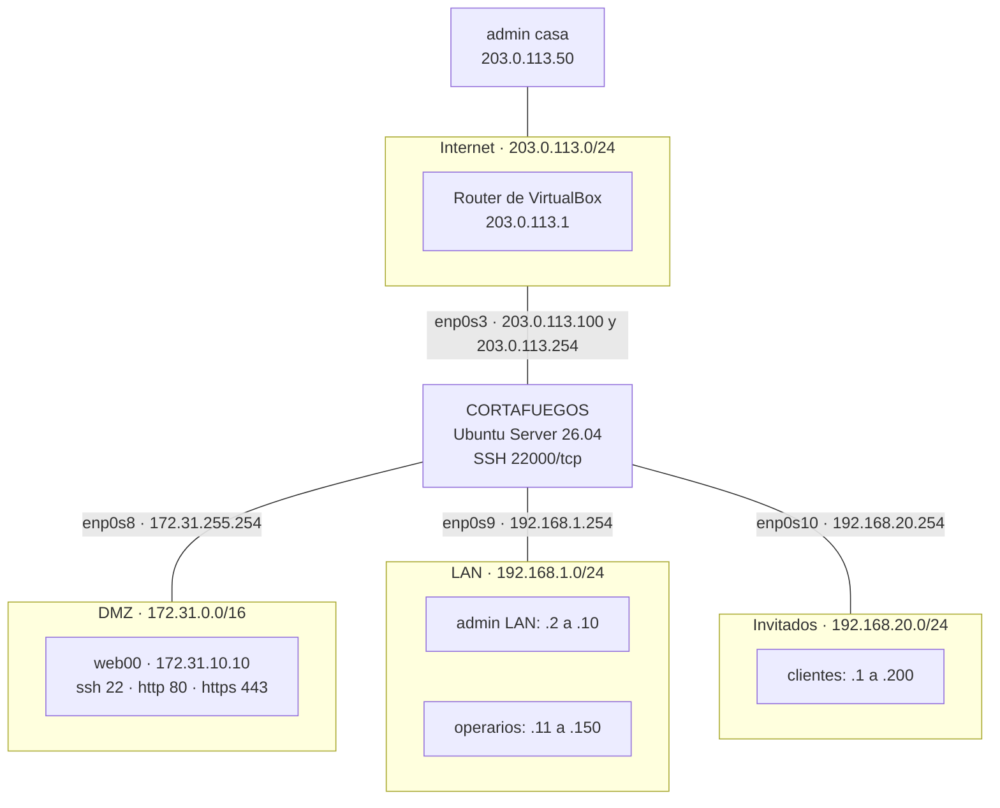

# **Tarea 6.2: Cortafuegos perimetral con iptables**

### **Descripción de la tarea**

El administrador de red decide hacer cambios en el **cortafuegos perimetral** situado entre las redes de la organización e Internet. El cortafuegos tiene cuatro interfaces de red, una por cada red:



El cortafuegos ya está en funcionamiento con reglas activas y tiene las siguientes características:

- Está basado en **iptables**, en un **Ubuntu Server 26.04**.
- Ya tiene creadas las reglas para el tráfico `RELATED` y `ESTABLISHED`, y en las reglas nuevas hay que hacer **seguimiento de los estados**.
- Descarta todo el tráfico no deseado mediante la **política** de las cadenas predefinidas.
- La interfaz `enp0s3` tiene asignadas las IP públicas `203.0.113.100` y `203.0.113.254`.

El laboratorio se monta en VirtualBox con tres máquinas virtuales: el **cortafuegos** (Ubuntu Server 26.04, con cuatro tarjetas de red), el servidor **web00** (Debian 13) y un **cliente** (Debian 13) que irá cambiando de red y de IP para hacer el papel de cada uno de los equipos de la figura.

### **Pasos de la tarea**

**Preparación del laboratorio**

1. Crea en VirtualBox las redes del escenario: una **Red NAT** llamada `Internet`, con la red `203.0.113.0/24` y sin DHCP, y tres **redes internas** llamadas `dmz`, `lan` e `invitados`.

2. Prepara el **cortafuegos**: asígnale las cuatro tarjetas de red en el orden de la figura, configura sus direcciones IP con Netplan, activa de forma persistente el reenvío IP y haz que su servidor SSH escuche en el puerto `22000`. Instala también los paquetes `iptables-persistent` y `conntrack` y comprueba que `ufw` está inactivo.

3. Prepara **web00**: instala Apache con HTTPS activado y el servidor SSH, conéctalo después a la red `dmz` y configura su IP (`172.31.10.10/16`), con el cortafuegos como puerta de enlace.

4. Prepara el **cliente**: instala `curl` y déjalo listo para cambiar de red y de IP en cada prueba.

5. Carga en el cortafuegos su estado inicial con el *script* [cortafuegos_base.sh](./recursos/cortafuegos_base.sh) y analiza las reglas y las políticas que deja.

**Apartado 1: resolución DNS y acceso a la caché de paquetes del cortafuegos**

6. Añade al final de las cadenas predefinidas que correspondan las reglas necesarias para que el cortafuegos pueda hacer consultas DNS al servidor `8.8.8.8`.

7. Añade al final de las cadenas predefinidas que correspondan las reglas necesarias para que el cortafuegos pueda acceder a la caché de paquetes configurada en el fichero `/etc/apt/apt.conf.d/01apt-cacher-ng`, cuyo contenido es:

```text
Acquire::https { Proxy "https://198.51.100.10:8080"; }
```

**Apartado 2: administración del cortafuegos por SSH mediante una cadena de usuario**

8. Crea una cadena de usuario llamada `SSH_FW`.

9. Inserta una regla, en la **posición número 5** de la cadena predefinida que corresponda, que derive los intentos de acceso por SSH al cortafuegos a la cadena `SSH_FW` para que se procesen allí. El servidor SSH escucha en el puerto `22000/tcp`.

10. Completa la cadena `SSH_FW` de forma que:
    - Se permita el acceso por SSH al cortafuegos a los equipos **admin LAN** (de `192.168.1.2` a `192.168.1.10`) y **admin casa** (`203.0.113.50`).
    - Se controle que los paquetes llegan por las **interfaces de red adecuadas**.
    - Los intentos de acceso de equipos distintos a los autorizados se **registren** y se **descarten con un mensaje de tipo `tcp-reset`**. Para facilitar la interpretación de los registros, se usará el prefijo `ssh fw`.

**Apartado 3: control de la red de invitados**

11. Añade al final de las cadenas predefinidas que correspondan las reglas necesarias para permitir a los equipos cliente de la red de invitados (de `.1` a `.200`) **cualquier tipo de tráfico hacia Internet**, pero no hacia las demás redes internas de la organización. Saldrán a Internet con la IP pública **`203.0.113.100`** del cortafuegos.

12. Los intentos de acceso de equipos **no autorizados** de la red de invitados deben **registrarse** y **descartarse en silencio**. Para facilitar la interpretación de los registros, se usará el prefijo `Bloqueo visitantes`.

**Apartado 4: acceso al servicio web de web00**

13. Añade al final de las cadenas predefinidas que correspondan las reglas necesarias para permitir el acceso a los servicios **HTTP** y **HTTPS** de web00:
    - Desde **Internet**, a través de los puertos por defecto y de la IP pública **`203.0.113.254`** del cortafuegos.
    - Desde la **LAN**, directamente a la IP privada de web00.
    - Los equipos de la red de invitados **no** deben poder acceder a web00.

**Comprobación y cierre**

14. Comprueba el funcionamiento de cada apartado moviendo el cliente por las distintas redes, y consulta los registros y los contadores del cortafuegos.

15. Guarda las reglas de forma persistente y comprueba que se mantienen después de reiniciar el cortafuegos.

16. Responde razonadamente:
    1. ¿Por qué en el apartado 1 no hace falta añadir reglas en `INPUT` para las respuestas del servidor DNS?
    2. ¿Por qué la regla de `FORWARD` del apartado 4 usa la IP privada de web00 y no la IP pública `203.0.113.254`?
    3. ¿Qué diferencia percibe un operario de la LAN al intentar conectarse por SSH al cortafuegos, frente a lo que percibiría si la acción fuera `DROP`?
    4. ¿Por qué la regla que rechaza con `tcp-reset` necesita indicar `-p tcp`, aunque a la cadena `SSH_FW` solo lleguen paquetes TCP?

_*Nota*_: Trabaja siempre desde la **consola** de la máquina virtual del cortafuegos. Con las políticas en `DROP`, un error en las reglas puede dejarte sin acceso por SSH. Las reglas y los conceptos que se usan en esta tarea se explican en el documento 46 de los apuntes.
