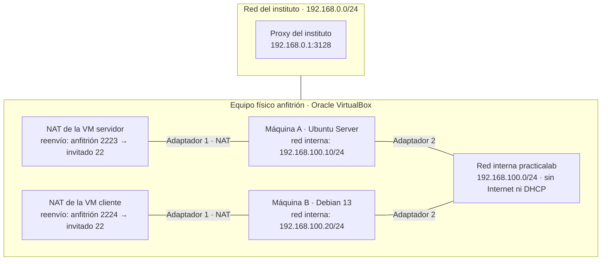

# **Tarea 6.3: Repaso de configuración de red**

### **Descripción de la tarea**

Partiendo del escenario de red de la práctica anterior, una máquina virtual **Ubuntu Server** y una máquina virtual cliente **Debian 13**, cada una con un adaptador **NAT** y un adaptador de **red interna** llamada `practicalab`, y ejecutándose ambas en el mismo equipo físico, hay que realizar y documentar los pasos siguientes.

Para cada paso, incluye en la documentación el **comando exacto** utilizado y una **captura de pantalla** que demuestre el resultado obtenido.

### **Pasos de la tarea**

1. **Configuración permanente y estática de las IP.** Configura la tarjeta de la red interna de cada máquina con estas direcciones:
    - Ubuntu Server (máquina A): `192.168.100.10/24`.
    - Cliente Debian 13 (máquina B): `192.168.100.20/24`.

    La configuración debe quedar guardada de forma permanente en el fichero de configuración de red correspondiente, de manera que la IP se mantenga tras reiniciar cada máquina.

2. **Comprobación de conectividad con ping.** Haz un `ping` desde la máquina A (Ubuntu Server) hacia la máquina B (Debian 13), enviando exactamente **3 paquetes ICMP**.

3. **Creación de ficheros en la máquina B.** En el equipo B (Debian 13), crea **1000 ficheros** cuyo contenido sea el texto «Soy el fichero XXXX», sustituyendo XXXX por el número de fichero correspondiente (por ejemplo: «Soy el fichero 0001», «Soy el fichero 0002»... «Soy el fichero 1000»). Todos los ficheros deben crearse dentro de una misma carpeta.

4. **Envío por SCP a la máquina A (Ubuntu Server).** Envía la carpeta completa con los 1000 ficheros creados en el paso anterior, desde el equipo B (Debian 13) hasta el equipo A (Ubuntu Server), utilizando el comando `scp`.

5. **Envío por SCP a la máquina anfitriona.** Envía la misma carpeta desde el equipo B (Debian 13) hasta el equipo físico anfitrión, utilizando el comando `scp`.

### **Criterios de corrección**

| Paso | Puntuación |
|---|---|
| 1. Configuración permanente y estática de las IP | 3 puntos |
| 2. Ping de la máquina A a la máquina B (3 paquetes ICMP) | 1 punto |
| 3. Creación de 1000 ficheros en la máquina B | 2 puntos |
| 4. Envío por SCP de la carpeta al equipo A (Ubuntu Server) | 2 puntos |
| 5. Envío por SCP de la carpeta a la máquina anfitriona | 2 puntos |
| **Total** | **10 puntos** |

_*Nota*_: La red interna usa `192.168.100.0/24` y no `192.168.0.0/24`, que es la red del instituto. Si la red interna usara la misma red que el instituto, cada máquina virtual tendría dos caminos hacia `192.168.0.0/24` y enviaría por la red interna, que no tiene salida, el tráfico dirigido al *proxy* `192.168.0.1`, con lo que perdería el acceso a Internet.
