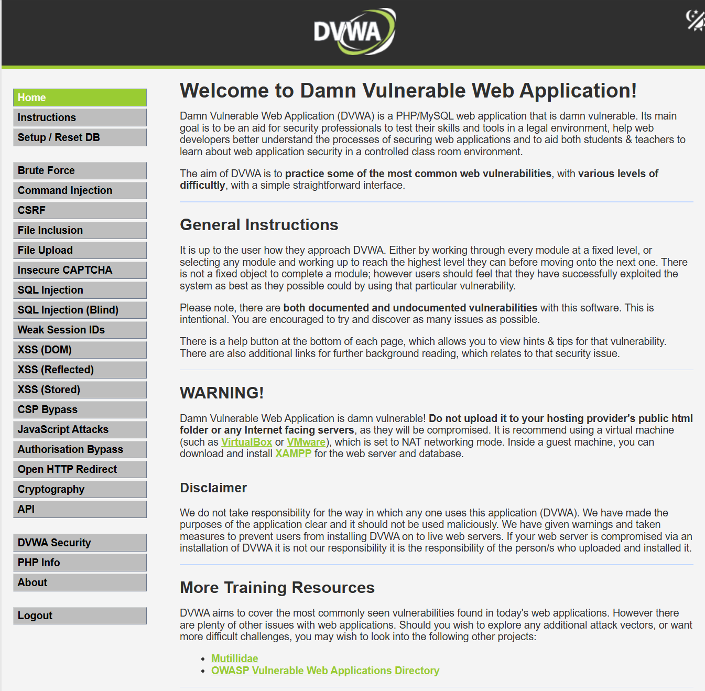

# Instalación de DVWA

## Índice

1. [Requisitos y Preparación del Entorno](#1-requisitos-y-preparación-del-entorno)
2. [Descarga y Ubicación de DVWA](#2-descarga-y-ubicación-de-dvwa)
3. [Configuración de la Aplicación](#3-configuración-de-la-aplicación)
4. [Permisos de Archivos](#4-permisos-de-archivos)
5. [Configuración de PHP](#5-configuración-de-php)
6. [Revisión y Creación de la Base de Datos](#6-revisión-y-creación-de-la-base-de-datos)

---

## 1. Requisitos y Preparación del Entorno

Instalación sobre Ubuntu Server 24.04 LTS en VirtualBox.

```bash
root@ubuntuserver:~# lsb_release -a
No LSB modules are available.
Distributor ID: Ubuntu
Description:    Ubuntu 24.04.3 LTS
Release:        24.04
Codename:       noble
```

La instalación se ejemplificará en una máquina virtual Linux Ubuntu 24.04 donde se instalarán Apache, PHP y MariaDB. Los paquetes requeridos son:

- Servidor web `apache2` con soporte para PHP.
- `php` con los siguientes módulos: `php-gd` y `php-mysql`.
- Cliente y servidor MariaDB (`mariadb-client`, `mariadb-server`).

Actualizamos los repositorios e instalamos los paquetes necesarios:

```bash
root@ubuntuserver:~# apt update && apt full-upgrade -y
root@ubuntuserver:~#  sudo apt install apache2 php libapache2-mod-php php-gd php-mysql mariadb-client mariadb-server -y
```

---

## 2. Descarga y Ubicación de DVWA

Finalizado el proceso, ejecutamos el comando `ss` mostrando que el servidor Apache y MariaDB están en escucha en los puertos por defecto `tcp/80` y `tcp/3306` respectivamente. El comando `ss` permite visualizar los sockets en escucha del sistema, lo que nos confirmará que los servicios se han levantado correctamente.

La configuración por defecto del servidor Apache en Ubuntu establece el directorio de publicación en la ruta `/var/www/html`, por lo que se copiarán los archivos de la aplicación DVWA en esta ruta. Descargamos de Github la información necesaria y modificamos el nombre del directorio de `DVWA` a `dvwa` para facilitar su uso.

```bash
root@ubuntuserver:~# cd /var/www/html/

root@ubuntuserver:/var/www/html# git clone https://github.com/digininja/DVWA.git
Cloning into 'DVWA'...
remote: Enumerating objects: 5703, done.
remote: Counting objects: 100% (35/35), done.
remote: Compressing objects: 100% (17/17), done.
remote: Total 5703 (delta 25), reused 18 (delta 18), pack-reused 5668 (from 2)
Receiving objects: 100% (5703/5703), 2.74 MiB | 374.00 KiB/s, done.
Resolving deltas: 100% (2836/2836), done.

root@ubuntuserver:/var/www/html# ls -lH
total 16
drwxr-xr-x 12 root root  4096 abr 24 07:56 DVWA
-rw-r--r--  1 root root 10671 abr 24 07:41 index.html

root@ubuntuserver:/var/www/html# mv DVWA/ dvwa

root@ubuntuserver:/var/www/html# ls -lHF
total 16
drwxr-xr-x 12 root root  4096 abr 24 07:56 dvwa/
-rw-r--r--  1 root root 10671 abr 24 07:41 index.html
```

> **Nota:** El comando `ls` con las opciones usadas permite obtener información detallada de los archivos en el directorio actual.

| Parámetro | Descripción |
|-----------|-------------|
| `-l`      | Muestra el listado en formato largo (permisos, propietario, tamaño, fecha). |
| `-H`      | Sigue los enlaces simbólicos indicados en la línea de comandos. |
| `-F`      | Añade un carácter indicador al final del nombre (ej: `/` para directorios). |

---

## 3. Configuración de la Aplicación

De acceder en este momento a la aplicación a través del navegador, se producirá un error, ya que es necesario realizar unas configuraciones en el fichero correspondiente.

```bash
DVWA System error - config file not found. Copy config/config.inc.php.dist to config/config.inc.php and configure to your environment.
```

Es necesario crear un archivo de configuración definitivo `config/config.inc.php` en base al archivo de ejemplo `config/config.inc.php.dist`. El archivo `.dist` es una plantilla de distribución que incluye la configuración por defecto, la cual copiaremos y renombraremos para que sea detectada por la aplicación.

```bash
root@ubuntuserver:/var/www/html# cp dvwa/config/config.inc.php.dist dvwa/config/config.inc.php
```

Usaremos los datos por defecto establecidos en la plantilla, por lo que procedemos a la configuración de la base de datos tal y como se espera.

```bash
$_DVWA = array();
$_DVWA[ 'db_server' ]   = getenv('DB_SERVER') ?: '127.0.0.1';
$_DVWA[ 'db_database' ] = getenv('DB_DATABASE') ?: 'dvwa';
$_DVWA[ 'db_user' ]     = getenv('DB_USER') ?: 'dvwa';
$_DVWA[ 'db_password' ] = getenv('DB_PASSWORD') ?: 'p@ssw0rd';
$_DVWA[ 'db_port']      = getenv('DB_PORT') ?: '3306';
```

Creamos la base de datos `dvwa` y el usuario `dvwa` con la contraseña `p@ssw0rd`.

> **Advertencia:** Se recomienda utilizar contraseñas más robustas en entornos de producción, pero al ser un entorno de laboratorio vulnerable por diseño, mantendremos las credenciales por defecto para facilitar las pruebas.

```bash
root@ubuntuserver:/var/www/html# sudo mariadb -u root
Welcome to the MariaDB monitor.  Commands end with ; or \g.
Your MariaDB connection id is 31
Server version: 10.11.14-MariaDB-0ubuntu0.24.04.1 Ubuntu 24.04

Copyright (c) 2000, 2018, Oracle, MariaDB Corporation Ab and others.

Type 'help;' or '\h' for help. Type '\c' to clear the current input statement.

MariaDB [(none)]> create database dvwa;
Query OK, 1 row affected (0,002 sec)

MariaDB [(none)]> create user dvwa@localhost identified by 'p@ssw0rd';
Query OK, 0 rows affected (0,034 sec)

MariaDB [(none)]> grant all on dvwa.* to dvwa@localhost;
Query OK, 0 rows affected (0,038 sec)

MariaDB [(none)]> flush privileges;
Query OK, 0 rows affected (0,001 sec)
```

---

## 4. Permisos de Archivos

Es necesario que el usuario `www-data` pueda escribir en el directorio `dvwa/hackable/uploads` con el objetivo de poder subir archivos a través de la aplicación web durante las pruebas de *File Upload*. El usuario `www-data` es la cuenta bajo la cual se ejecuta el servidor web Apache en sistemas basados en Debian/Ubuntu.

```bash
root@ubuntuserver:/var/www/html# ls -lhF dvwa/hackable/
total 12K
drwxr-xr-x 2 root root 4,0K abr 24 07:56 flags/
drwxr-xr-x 2 root root 4,0K abr 24 07:56 uploads/
drwxr-xr-x 2 root root 4,0K abr 24 07:56 users/
root@ubuntuserver:/var/www/html# chown -R www-data:www-data dvwa/hackable/uploads/
root@ubuntuserver:/var/www/html# ls -lhF dvwa/hackable/
total 12K
drwxr-xr-x 2 root     root     4,0K abr 24 07:56 flags/
drwxr-xr-x 2 www-data www-data 4,0K abr 24 07:56 uploads/
drwxr-xr-x 2 root     root     4,0K abr 24 07:56 users/
```

| Parámetro | Descripción |
|-----------|-------------|
| `-l`      | Muestra el listado en formato largo. |
| `-h`      | Muestra el tamaño de los archivos en un formato legible por humanos (K, M, G). |
| `-F`      | Añade un clasificador visual al final del nombre. |

Se repite el proceso de cambio de propietario en la carpeta `dvwa/config`. Esto permite que la aplicación pueda modificar su propio archivo de configuración de ser necesario, por ejemplo, en la fase de configuración inicial desde la interfaz web.

```bash
root@ubuntuserver:/var/www/html# chown -R www-data:www-data dvwa/config/

root@ubuntuserver:/var/www/html# ls -lhF dvwa/
total 636K
-rw-r--r--  1 root     root     2,9K abr 24 07:56 about.php
-rw-r--r--  1 root     root     7,0K abr 24 07:56 CHANGELOG.md
-rw-r--r--  1 root     root      726 abr 24 07:56 compose.yml
drwxr-xr-x  2 www-data www-data 4,0K abr 24 08:13 config/
```

---

## 5. Configuración de PHP

Se modifican en el archivo de configuración de PHP (`/etc/php/8.3/apache2/php.ini`) los valores de las directivas `allow_url_fopen` y `allow_url_include` para habilitar la vulnerabilidad RFI (Remote File Inclusion) y para que PHP muestre los errores por pantalla. 

> **Importante:** Previamente, se debe realizar siempre una copia de seguridad del archivo original antes de editarlo, lo que nos permitirá revertir los cambios en caso de un error de configuración.

```bash
root@ubuntuserver:/var/www/html# cp /etc/php/8.3/apache2/php.ini /etc/php/8.3/apache2/php.ini_BACK_UP
```

A continuación, verificamos el contenido de las directivas necesarias en el archivo `php.ini` tras su edición:

```bash
root@ubuntuserver:/var/www/html# cat /etc/php/8.3/apache2/php.ini
[....]
allow_url_fopen = On
allow_url_include = On
[....]
display_errors = On 
display_startup_errors = On
```

Llegados a este punto, se reinicia el servicio de Apache. Tras realizar modificaciones en la configuración del servidor web o del lenguaje PHP, es obligatorio reiniciar el servicio para que los cambios surtan efecto en el entorno de ejecución.

```bash
root@ubuntuserver:~# systemctl status apache2.service
● apache2.service - The Apache HTTP Server
     Loaded: loaded (/usr/lib/systemd/system/apache2.service; enabled; preset: enable>
     Active: active (running) since Fri 2026-04-24 09:45:27 UTC; 10s ago
       Docs: https://httpd.apache.org/docs/2.4/
    Process: 28459 ExecStart=/usr/sbin/apachectl start (code=exited, status=0/SUCCESS)
   Main PID: 28465 (apache2)
      Tasks: 6 (limit: 4605)
     Memory: 11.5M (peak: 12.2M)
        CPU: 84ms
     CGroup: /system.slice/apache2.service
             ├─28465 /usr/sbin/apache2 -k start
             ├─28467 /usr/sbin/apache2 -k start
             ├─28468 /usr/sbin/apache2 -k start
             ├─28469 /usr/sbin/apache2 -k start
             ├─28470 /usr/sbin/apache2 -k start
             └─28471 /usr/sbin/apache2 -k start

abr 24 09:45:27 ubuntuserver systemd[1]: Starting apache2.service - The Apache HTTP S>
abr 24 09:45:27 ubuntuserver apachectl[28464]: AH00558: apache2: Could not reliably d>
abr 24 09:45:27 ubuntuserver systemd[1]: Started apache2.service - The Apache HTTP Se>
root@ubuntuserver:~# ss -lnpt
State      Recv-Q     Send-Q         Local Address:Port         Peer Address:Port     Process
LISTEN     0          4096              127.0.0.54:53                0.0.0.0:*         users:(("systemd-resolve",pid=8133,fd=17))
LISTEN     0          4096                 0.0.0.0:22                0.0.0.0:*         users:(("sshd",pid=18593,fd=3),("systemd",pid=1,fd=110))
LISTEN     0          80                 127.0.0.1:3306              0.0.0.0:*         users:(("mariadbd",pid=26089,fd=22))
LISTEN     0          4096           127.0.0.53%lo:53                0.0.0.0:*         users:(("systemd-resolve",pid=8133,fd=15))
LISTEN     0          4096                    [::]:22                   [::]:*         users:(("sshd",pid=18593,fd=4),("systemd",pid=1,fd=111))
LISTEN     0          511                        *:80                      *:*         users:(("apache2",pid=28471,fd=4),("apache2",pid=28470,fd=4),("apache2",pid=28469,fd=4),("apache2",pid=28468,fd=4),("apache2",pid=28467,fd=4),("apache2",pid=28465,fd=4))
```

---

## 6. Revisión y Creación de la Base de Datos

Se accede a la interfaz web identificándose con las credenciales por defecto: `admin` / `password`.

Se revisan las opciones de configuración y se comprueba que todo está en verde excepto **reCAPTCHA**. Esto permitirá trabajar con todos los laboratorios salvo "Insecure CAPTCHA", para el cual se necesita obtener unas claves API de Google e indicarlas en el archivo de configuración.

En caso de encontrar advertencias en rojo, habrá que revisar las configuraciones afectadas y refrescar la página para verificar si ya tienen el valor adecuado.

Con todo comprobado, se pulsa el botón de **Create / Reset Database**. En este punto, volviendo a acceder con las credenciales `admin` / `password`, ya tendremos la aplicación DVWA completamente operativa.

