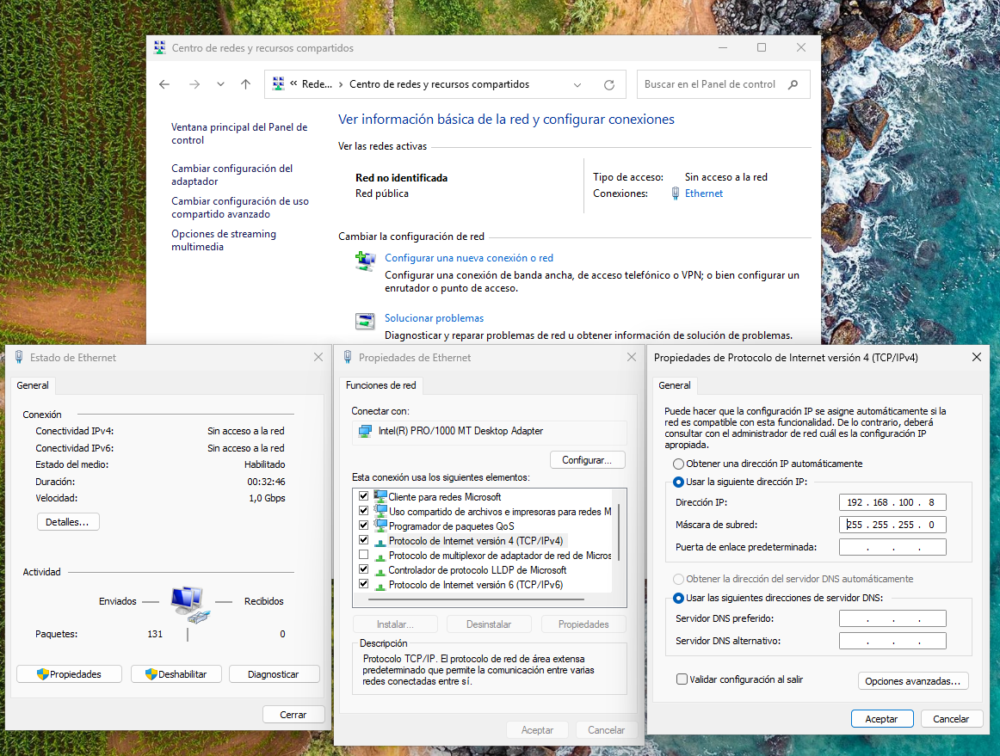
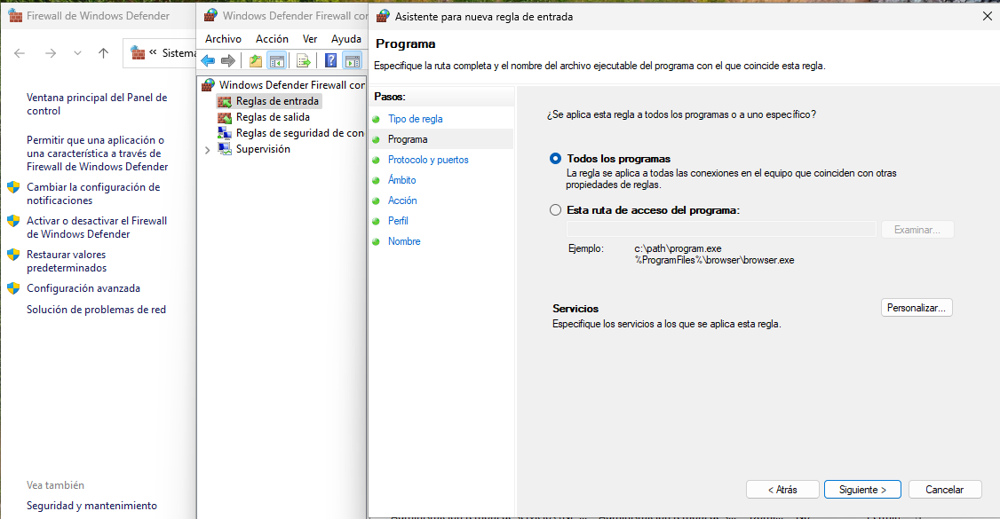
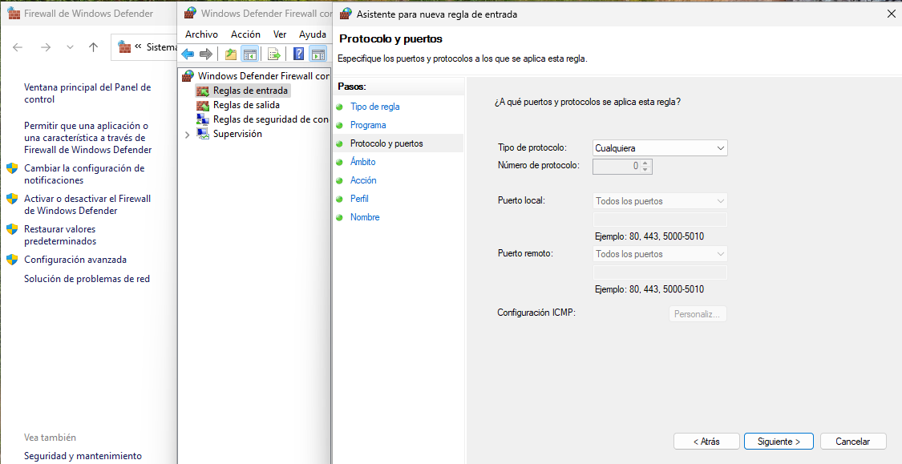
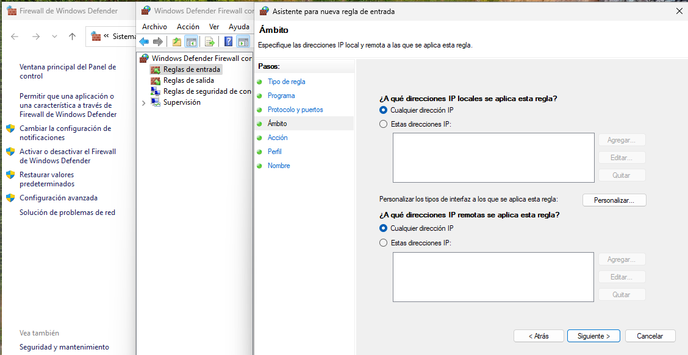
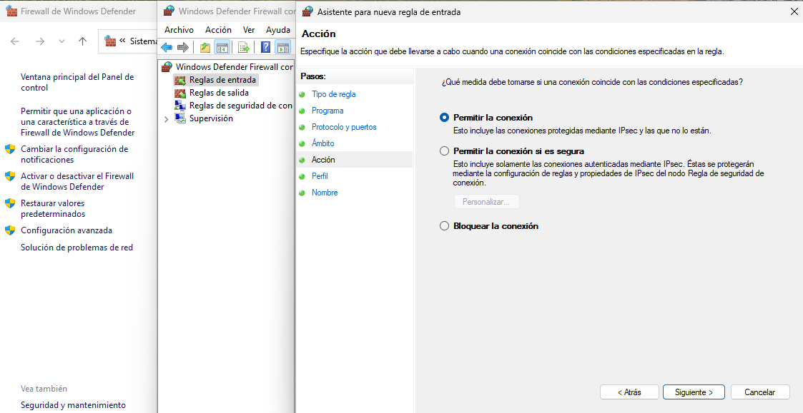

# Implementación de Infraestructura de Dominio con Samba 4 en Linux

**Escenario:** Despliegue de un Controlador de Dominio (DC) en Ubuntu Server simulando un entorno Microsoft Active Directory.

## Introducción al Escenario

El objetivo es configurar el servidor Linux para que actúe como un **PDC (Primary Domain Controller)**. Esto permite la gestión centralizada de identidades (usuarios, grupos), políticas de seguridad y recursos compartidos para clientes heterogéneos (Windows y Linux) en una red interna.

Para lograr esto, se utiliza la suite de software **Samba 4**, que integra y orquesta tres protocolos estándar de la industria: **SMB**, **LDAP** y **Kerberos**.

En este escenario proponemos el uso de tres máquinas en una red interna de VirtualBox que serán:

- Ubuntu server: 192.168.100.6/24
  - Adaptador en modo Nat que permite la salida a la red.
  - Adaptador en red interna.
- Ubuntu desktop: 192.168.100.7/24
  - Adaptador en red interna.
- Windows 11: 192.168.100.8/24
  - Adaptador en red interna.

## Componentes Técnicos Fundamentales

### A. Samba 4 (El Orquestador / Active Directory Emulator)

En versiones antiguas (Samba 3), el software se limitaba a servicios de ficheros e impresión (protocolo NT4). Sin embargo, **Samba 4** implementa la lógica necesaria para comportarse como un **Controlador de Dominio de Active Directory (AD DC)**.

- **Función Técnica:** Provee el servicio SMB (Server Message Block) y CIFS. Expone los recursos compartidos administrativos obligatorios para un dominio, como son `SYSVOL` (para políticas de grupo - GPOs) y `NETLOGON` (para scripts de inicio de sesión).
- **Rol en el servidor:** Actúa como el _frontend_ que interactúa con los clientes Windows, presentándose como un servidor Microsoft legítimo mediante llamadas RPC (Remote Procedure Call).

### B. LDAP (Lightweight Directory Access Protocol) - RFC 4511

Es el protocolo utilizado para acceder y modificar la **Base de Datos del Directorio**.

- **Definición:** Es una estructura de datos jerárquica (árbol) optimizada para lectura.
- **Función en el escenario:** Almacena los "objetos" del dominio. Cada usuario, computadora, impresora o grupo es un objeto dentro de esta base de datos.
- Cada objeto tiene un **DN (Distinguished Name)**. Ejemplo: `CN=Juan,OU=Ventas,DC=empresa,DC=local`.
- **Integración:** Samba 4 incluye su propio servidor LDAP interno (basado en LDB) que ya viene con el esquema de datos de Microsoft pre-cargado, lo que permite que las herramientas de administración de Windows (RSAT) puedan leer y escribir en él.

### C. Kerberos (Protocolo de Autenticación de Red) - RFC 4120

Es el protocolo de seguridad encargado de la **autenticación mutua** entre cliente y servidor mediante el uso de criptografía de clave simétrica y un sistema de confianza basado en tickets.

- **Componentes:**
- **KDC (Key Distribution Center):** Reside en tu Ubuntu Server.
- **TGT (Ticket Granting Ticket):** El "documento maestro" de identidad.

- **Flujo Técnico (Simplificado):**

1. El cliente (Windows 10) envía un _hash_ de su contraseña al KDC (Ubuntu).
2. Si es válido, el KDC devuelve un **TGT**.
3. El cliente guarda el TGT en memoria. Cuando el usuario quiere acceder a un recurso compartido, presenta el TGT para obtener un "Ticket de Servicio" específico, sin volver a enviar su contraseña por la red.

### D. DNS (Domain Name System) - El Servicio Crítico

- **Función:** Cuando un cliente Windows arranca, hace una consulta DNS preguntando por registros específicos (ej. `_ldap._tcp.dc._msdcs.tudominio.local`) para localizar qué IP tiene el Controlador de Dominio.
- **Samba:** Generalmente utiliza un servidor DNS interno o se integra con BIND9 para gestionar estas zonas automáticamente.

## Resumen del Flujo de Inicio de Sesión (Login)

Cuando el usuario intenta iniciar sesión en el cliente:

1. **Resolución (DNS):** El cliente pregunta al DNS: "¿Quién es el controlador del dominio `instituto.local`?". DNS responde: `192.168.100.6`.
2. **Autenticación (Kerberos):** El cliente contacta al puerto 88 del servidor. Envía credenciales cifradas. El KDC (Samba) verifica contra la base de datos y emite un TGT.
3. **Autorización (LDAP):** El servidor verifica en la estructura LDAP si el usuario tiene permiso para loguearse en esa máquina específica o si su cuenta está activa.
4. **Aplicación de Políticas (SMB):** El cliente descarga desde la carpeta compartida `SYSVOL` (vía puerto 445) las Políticas de Grupo (GPO) para aplicar fondos de pantalla, restricciones, etc.

## Implementación

Vamos a configurar Windows 11, Ubuntu Desktop y Ubuntu Server.

### Windows 11

En un primero momento desde un cmd podemo ejecutar lo siguiente:

```bash
C:\Users\usuario>ipconfig

Configuración IP de Windows


Adaptador de Ethernet Ethernet:

   Sufijo DNS específico para la conexión. . :
   Vínculo: dirección IPv6 local. . . : fe80::e087:def7:7334:dea7%4
   Dirección IPv4 de configuración automática: 169.254.177.199
   Máscara de subred . . . . . . . . . . . . : 255.255.0.0
   Puerta de enlace predeterminada . . . . . :
```

Podemos ver como el sistema asigna una dirección APIPA a la máquina. Lo que vamos a realizar en un primero momento es asignar de forma estática una IPv4 al equipo: 192.168.100.8/24. Para hacer esta configuración podemos proceder del siguiete modo:



Si vemos la IPv4 del equipo comprobamos lo siguiente:

```bash
C:\Users\usuario>ipconfig

Configuración IP de Windows


Adaptador de Ethernet Ethernet:

   Sufijo DNS específico para la conexión. . :
   Vínculo: dirección IPv6 local. . . : fe80::e087:def7:7334:dea7%4
   Dirección IPv4. . . . . . . . . . . . . . : 192.168.100.8
   Máscara de subred . . . . . . . . . . . . : 255.255.255.0
   Puerta de enlace predeterminada . . . . . :
```

Además, es importante tener en cuenta que es necesario configurar una regla de acceso de conexiones ping por lo que tendremos que crear una nueva regla de entrada en el firewall de linux. A continuación se indican los pasos:








### Ubuntu Desktop

Realizamos una configuración estática del equipo desde una terminal por lo que hacemos uso de netplan para configurar de forma persistente la IPv4: 192.168.100.7/24.

```bash
root@ubuntu:/etc/netplan# cat 01-network-manager-all.yaml
# Let NetworkManager manage all devices on this system
network:
  version: 2
  renderer: NetworkManager
  ethernets:
    enp0s3:
      addresses:
        - 192.168.100.7/24

root@ubuntu:/etc/netplan# netplan apply

root@ubuntu:/etc/netplan# ip -c a
1: lo: <LOOPBACK,UP,LOWER_UP> mtu 65536 qdisc noqueue state UNKNOWN group default qlen 1000
    link/loopback 00:00:00:00:00:00 brd 00:00:00:00:00:00
    inet 127.0.0.1/8 scope host lo
       valid_lft forever preferred_lft forever
    inet6 ::1/128 scope host noprefixroute
       valid_lft forever preferred_lft forever
2: enp0s3: <BROADCAST,MULTICAST,UP,LOWER_UP> mtu 1500 qdisc fq_codel state UP group default qlen 1000
    link/ether 08:00:27:93:c8:a9 brd ff:ff:ff:ff:ff:ff
    inet 192.168.100.7/24 brd 192.168.100.255 scope global noprefixroute enp0s3
       valid_lft forever preferred_lft forever
    inet6 fe80::a00:27ff:fe93:c8a9/64 scope link
       valid_lft forever preferred_lft forever
```

Llegados a este punto podemos comprobar si podemos hacer ping entre las máquinas.

```bash
root@ubuntu:~# ping -c 4 192.168.100.8
PING 192.168.100.8 (192.168.100.8) 56(84) bytes of data.
64 bytes from 192.168.100.8: icmp_seq=1 ttl=128 time=2.17 ms
64 bytes from 192.168.100.8: icmp_seq=2 ttl=128 time=1.50 ms
64 bytes from 192.168.100.8: icmp_seq=3 ttl=128 time=0.876 ms
64 bytes from 192.168.100.8: icmp_seq=4 ttl=128 time=2.05 ms

--- 192.168.100.8 ping statistics ---
4 packets transmitted, 4 received, 0% packet loss, time 3008ms
```

### Ubuntu Server

Configuramos del mismo modo que en Ubuntu Desktop la Ipv4 para la interfaz correspondiente:

```bash
root@ubuntuserver:~# cat /etc/netplan/50-cloud-init.yaml
network:
  version: 2
  ethernets:
    enp0s3:
      dhcp4: true
    enp0s8:
      addresses:
        - 192.168.100.6/24
root@ubuntuserver:~# netplan apply
root@ubuntuserver:~# ip -c a
1: lo: <LOOPBACK,UP,LOWER_UP> mtu 65536 qdisc noqueue state UNKNOWN group default qlen 1000
    link/loopback 00:00:00:00:00:00 brd 00:00:00:00:00:00
    inet 127.0.0.1/8 scope host lo
       valid_lft forever preferred_lft forever
    inet6 ::1/128 scope host noprefixroute
       valid_lft forever preferred_lft forever
2: enp0s3: <BROADCAST,MULTICAST,UP,LOWER_UP> mtu 1500 qdisc fq_codel state UP group default qlen 1000
    link/ether 08:00:27:26:d3:d7 brd ff:ff:ff:ff:ff:ff
    inet 10.0.2.15/24 metric 100 brd 10.0.2.255 scope global dynamic enp0s3
       valid_lft 86399sec preferred_lft 86399sec
    inet6 fe80::a00:27ff:fe26:d3d7/64 scope link
       valid_lft forever preferred_lft forever
3: enp0s8: <BROADCAST,MULTICAST,UP,LOWER_UP> mtu 1500 qdisc fq_codel state UP group default qlen 1000
    link/ether 08:00:27:a0:71:dc brd ff:ff:ff:ff:ff:ff
    inet 192.168.100.6/24 brd 192.168.100.255 scope global enp0s8
       valid_lft forever preferred_lft forever
    inet6 fe80::a00:27ff:fea0:71dc/64 scope link
       valid_lft forever preferred_lft forever
```

Llegados a este punto todas las máquinas pueden hacer ping entre si.
