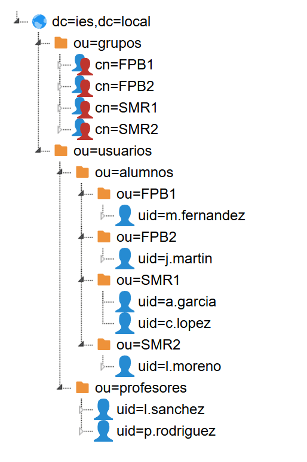

# LDAP con OpenLDAP (slapd) en Ubuntu Server 24.04.3 LTS
### Escenario práctico: Centro Educativo IES Ejemplo

## Índice

1. [Introducción a LDAP](#introducción-a-ldap)
   - 1.1 [¿Qué es LDAP?](#qué-es-ldap)
   - 1.2 [Conceptos clave del directorio](#conceptos-clave-del-directorio)
   - 1.3 [Estructura del árbol DIT del centro educativo](#estructura-del-árbol-dit-del-centro-educativo)
2. [Instalación del servidor slapd](#instalación-del-servidor-slapd)
   - 2.1 [Requisitos previos](#requisitos-previos)
   - 2.2 [Instalación de paquetes](#instalación-de-paquetes)
   - 2.3 [Configuración inicial con dpkg-reconfigure](#configuración-inicial-con-dpkg-reconfigure)
3. [Verificación del servicio](#verificación-del-servicio)
4. [Gestión de Unidades Organizativas (OU)](#gestión-de-unidades-organizativas-ou)
   - 4.1 [Planificación de las OUs del centro](#planificación-de-las-ous-del-centro)
   - 4.2 [Crear las OUs principales](#crear-las-ous-principales)
   - 4.3 [Crear las subunidades dentro de usuarios](#crear-las-subunidades-dentro-de-usuarios)
   - 4.4 [Listar OUs existentes](#listar-ous-existentes)
   - 4.5 [Eliminar una OU](#eliminar-una-ou)
   - 4.6 [Modificar una OU](#modificar-una-ou)
5. [Gestión de Usuarios](#gestión-de-usuarios)
   - 5.1 [Sobre los identificadores numéricos UID y GID en LDAP](#sobre-los-identificadores-numéricos-uid-y-gid-en-ldap)
   - 5.2 [Generar una contraseña cifrada](#generar-una-contraseña-cifrada)
   - 5.3 [Crear un alumno de FP](#crear-un-alumno-de-fp)
   - 5.4 [Crear varios alumnos en un solo fichero LDIF](#crear-varios-alumnos-en-un-solo-fichero-ldif)
   - 5.5 [Crear un profesor del departamento de informática](#crear-un-profesor-del-departamento-de-informática)
   - 5.6 [Modificar atributos de un usuario](#modificar-atributos-de-un-usuario)
   - 5.7 [Cambiar la contraseña de un usuario](#cambiar-la-contraseña-de-un-usuario)
   - 5.8 [Eliminar un usuario](#eliminar-un-usuario)
6. [Gestión de Grupos](#gestión-de-grupos)
   - 6.1 [OUs de curso vs. posixGroup — diferencia y complementariedad](#ous-de-curso-vs-posixgroup--diferencia-y-complementariedad)
   - 6.2 [Crear los grupos de curso](#crear-los-grupos-de-curso)
   - 6.3 [Añadir alumnos a un grupo](#añadir-alumnos-a-un-grupo)
   - 6.4 [Eliminar un alumno de un grupo](#eliminar-un-alumno-de-un-grupo)
   - 6.5 [Eliminar un grupo](#eliminar-un-grupo)
7. [Búsquedas con ldapsearch](#búsquedas-con-ldapsearch)
   - 7.1 [Buscar todos los objetos del directorio](#buscar-todos-los-objetos-del-directorio)
   - 7.2 [Buscar un usuario concreto](#buscar-un-usuario-concreto)
   - 7.3 [Buscar todos los alumnos de un curso](#buscar-todos-los-alumnos-de-un-curso)
   - 7.4 [Buscar todos los profesores](#buscar-todos-los-profesores)
   - 7.5 [Buscar grupos y sus miembros](#buscar-grupos-y-sus-miembros)
   - 7.6 [Filtros avanzados](#filtros-avanzados)
8. [Administración gráfica de OpenLDAP](#administración-gráfica-de-openldap)
9. [Carga total de datos en OpenLDAP](#carga-total-de-datos-en-openldap)
10. [Configuración del cliente LDAP con SSSD](#configuración-del-cliente-ldap-con-sssd)
    - 10.1 [¿Por qué SSSD en lugar de libnss-ldap?](#por-qué-sssd-en-lugar-de-libnss-ldap)
    - 10.2 [Instalación de paquetes en el cliente](#instalación-de-paquetes-en-el-cliente)
    - 10.3 [Configuración de SSSD](#configuración-de-sssd)
    - 10.4 [Configuración de NSS para usar SSSD](#configuración-de-nss-para-usar-sssd)
    - 10.5 [Configuración de PAM para usar SSSD](#configuración-de-pam-para-usar-sssd)
    - 10.6 [Creación automática del directorio home](#creación-automática-del-directorio-home)
    - 10.7 [Verificación desde el cliente](#verificación-desde-el-cliente)

---

> **Convención de etiquetas usada en estos apuntes:**
>
> **SERVIDOR** — El paso se realiza en la máquina Ubuntu Server 24.04.3 LTS con `slapd` instalado (`192.168.1.10`).
>
> **CLIENTE** — El paso se realiza en la máquina cliente del alumno o profesor (`192.168.1.20`). El cliente puede ser Debian 12 o Ubuntu Desktop.

---

## Introducción a LDAP

### ¿Qué es LDAP?

**LDAP** (*Lightweight Directory Access Protocol*) es un protocolo de red estándar utilizado para acceder y mantener servicios de directorio distribuidos. Un directorio LDAP funciona como una base de datos especializada, optimizada para lecturas frecuentes, que almacena información estructurada sobre usuarios, grupos y otros recursos de una organización.

A diferencia de una base de datos relacional tradicional (como MySQL), el directorio LDAP no está diseñado para gestionar transacciones complejas ni grandes volúmenes de escrituras. Su punto fuerte es permitir que **miles de equipos consulten simultáneamente** quién es un usuario, cuál es su contraseña o a qué grupos pertenece, de forma muy rápida y eficiente.

En el contexto de un **centro educativo**, LDAP permite que todos los ordenadores del aula consulten al mismo servidor para autenticar a alumnos y profesores. Cuando un alumno se sienta ante cualquier PC del centro e introduce su usuario y contraseña, ese equipo pregunta al servidor LDAP si las credenciales son correctas. Si lo son, el alumno entra. No hay que crear su cuenta en cada máquina individualmente.

**OpenLDAP** es la implementación de código abierto más extendida en Linux. El paquete principal es `slapd` (*Stand-alone LDAP Daemon*), que actúa como servidor del directorio y escucha las consultas de los clientes. En Ubuntu Server 24.04.3 LTS, OpenLDAP se instala desde los repositorios oficiales de Ubuntu y funciona con systemd de la misma forma que en otras distribuciones modernas.

> **Nota:** LDAP usa por defecto el puerto **389** (TCP) para conexiones no cifradas, y el puerto **636** para LDAPS (LDAP sobre TLS/SSL). En redes internas de prácticas se suele usar el 389; en producción se recomienda siempre cifrar con LDAPS o StartTLS.

---

### Conceptos clave del directorio

Antes de trabajar con LDAP es imprescindible entender su terminología, ya que es muy diferente a la de otros servicios. Cada objeto del directorio se identifica y describe mediante un conjunto de atributos y clases estandarizados.

| Término | Significado | Ejemplo en nuestro centro |
|---------|-------------|--------------------------|
| **DN** (*Distinguished Name*) | Identificador único y completo de una entrada. Es la "ruta completa" del objeto en el árbol | `uid=a.garcia,ou=SMR1,ou=alumnos,ou=usuarios,dc=ies,dc=local` |
| **RDN** (*Relative Distinguished Name*) | La parte más específica del DN, sin el resto de la ruta | `uid=a.garcia` |
| **dc** (*Domain Component*) | Componente del dominio. Cada parte del nombre de dominio separada por puntos se convierte en un `dc` | `ies.local` → `dc=ies,dc=local` |
| **ou** (*Organizational Unit*) | Unidad Organizativa. Es un contenedor que agrupa objetos relacionados | `ou=SMR1`, `ou=profesores`, `ou=grupos` |
| **cn** (*Common Name*) | Nombre común del objeto. En personas es el nombre completo; en grupos el nombre identificativo | `cn=Ana García López`, `cn=SMR1` |
| **uid** (*User ID*) | Identificador de usuario. Será el nombre con el que el usuario hace login en el sistema | `uid=a.garcia` |
| **sn** (*Surname*) | Apellido/s de una persona. Es obligatorio en el `objectClass inetOrgPerson` | `sn=García López` |
| **objectClass** | Define el "tipo" de objeto y determina qué atributos son obligatorios u opcionales para ese objeto | `posixAccount`, `inetOrgPerson`, `posixGroup` |
| **LDIF** (*LDAP Data Interchange Format*) | Formato de fichero de texto plano que se usa para describir entradas del directorio e importarlas/exportarlas | Ficheros `.ldif` que crearemos a lo largo de la práctica |

> **Recuerda:** El **DN** funciona como una dirección postal completa: identifica de forma única a cada objeto dentro del árbol del directorio. Si dos objetos tienen el mismo DN, son el mismo objeto. No pueden existir dos entradas con el mismo DN.

---

### Estructura del árbol DIT del centro educativo

El directorio LDAP se organiza en forma de árbol jerárquico llamado **DIT** (*Directory Information Tree*). La raíz del árbol representa el dominio de la organización. En nuestro caso, el dominio del centro será `ies.local`, por lo que la raíz del árbol será `dc=ies,dc=local`.

A partir de esa raíz, construiremos una estructura lógica que refleje la organización del centro. Cada curso tiene su propia Unidad Organizativa dentro de `ou=alumnos`, lo que hace el árbol navegable e intuitivo desde cualquier herramienta gráfica como LAM.

```bash
dc=ies,dc=local
├── ou=usuarios
│   ├── ou=alumnos
│   │   ├── ou=SMR1
│   │   │   ├── uid=a.garcia        ← uidNumber: 10001
│   │   │   └── uid=c.lopez         ← uidNumber: 10002
│   │   ├── ou=SMR2
│   │   │   └── uid=l.moreno        ← uidNumber: 11001
│   │   ├── ou=FPB1
│   │   │   └── uid=m.fernandez     ← uidNumber: 12001
│   │   └── ou=FPB2
│   │       └── uid=j.martin        ← uidNumber: 13001
│   └── ou=profesores
│       ├── uid=p.rodriguez         ← uidNumber: 20001
│       └── uid=l.sanchez           ← uidNumber: 20002
└── ou=grupos
    ├── cn=SMR1   ← posixGroup, gidNumber: 10000
    ├── cn=SMR2   ← posixGroup, gidNumber: 11000
    ├── cn=FPB1   ← posixGroup, gidNumber: 12000
    └── cn=FPB2   ← posixGroup, gidNumber: 13000
```

Esta estructura combina dos mecanismos complementarios. Las **OUs de curso** (`ou=SMR1`, `ou=FPB1`…) organizan visualmente el árbol: permiten ver de un vistazo qué alumnos pertenecen a cada curso sin necesidad de filtrar. Los **grupos posixGroup** (`cn=SMR1`, `cn=FPB1`…) son los que el sistema operativo utiliza para la autenticación Unix: el `gidNumber` del grupo se asigna al alumno y el sistema lo usa para gestionar permisos de ficheros y acceso a recursos.

> **Nota:** En LDAP las unidades organizativas pueden anidarse tanto como sea necesario. Una OU dentro de otra OU es completamente válido y es la forma recomendada de organizar directorios con múltiples subcolectivos.

---

## Instalación del servidor slapd

### Requisitos previos

**SERVIDOR**

Antes de instalar el servicio, es fundamental preparar correctamente el nombre de host del servidor. OpenLDAP utiliza el FQDN (*Fully Qualified Domain Name*) del servidor para construir internamente algunas referencias, y un hostname incorrecto puede causar errores en el arranque del servicio o en la conexión de los clientes.

En Ubuntu Server 24.04, el nombre de host se gestiona con `hostnamectl`, igual que en otras distribuciones modernas basadas en systemd. En nuestro escenario, el servidor tendrá la IP `192.168.1.10` y el nombre `ldap.ies.local`. Establecer el hostname:

```bash
root@ubuntu-server:~# hostnamectl set-hostname ldap.ies.local
```

Verificar que el cambio se ha aplicado correctamente:

```bash
root@ubuntu-server:~# hostnamectl
```

La salida debe mostrar `Static hostname: ldap.ies.local` entre otros datos del sistema.

A continuación, editar el fichero `/etc/hosts` para que el propio servidor pueda resolver su nombre sin depender de un servidor DNS externo. Este fichero asocia nombres de host a direcciones IP de forma estática y es consultado antes que el DNS:

```bash
root@ubuntu-server:~# nano /etc/hosts
```

El fichero debe contener al menos las siguientes líneas:

```
127.0.0.1       localhost
127.0.1.1       ldap.ies.local ldap
192.168.1.10    ldap.ies.local ldap
```

> **Nota:** En Ubuntu, la línea `127.0.1.1` es añadida automáticamente por el instalador y sirve para que el hostname resuelva incluso sin interfaz de red activa. Mantenerla y añadir también la línea con la IP real del servidor (`192.168.1.10`) para que los clientes de la red puedan resolver el nombre correctamente.

Guardar el fichero con `Ctrl+O`, confirmar con `Enter` y salir con `Ctrl+X`.

Verificar que el FQDN se resuelve correctamente:

```bash
root@ubuntu-server:~# hostname -f
```

La salida debe ser exactamente `ldap.ies.local`. Si devuelve solo `ldap` o algo diferente, revisar el fichero `/etc/hosts`.

> **Importante:** En Ubuntu Server 24.04, la configuración de red se gestiona con **Netplan** (ficheros en `/etc/netplan/`). Asegurarse de que la interfaz de red tiene una IP estática configurada antes de continuar, ya que un servidor LDAP con IP dinámica puede perder conectividad con los clientes si la IP cambia. Si es necesario configurar una IP estática, editar el fichero de Netplan correspondiente y aplicarlo con `netplan apply`. En nuestro caso se edita de la siguiente forma.

```bash
root@ubuntu-server:~# cat /etc/netplan/50-cloud-init.yaml
network:
  version: 2
  ethernets:
    enp0s3:
      dhcp4: false
      addresses:
        - 192.168.1.10/24
      routes:
        - to: default
          via: 192.168.1.1
      nameservers:
        addresses:
          - 8.8.8.8
          - 1.1.1.1
```

---

### Instalación de paquetes

**SERVIDOR**

Actualizar la lista de paquetes disponibles y el sistema operativo antes de instalar cualquier servicio. Esto garantiza que se instalan las versiones más recientes disponibles en los repositorios de Ubuntu 24.04:

```bash
root@ubuntu-server:~# apt update && apt upgrade -y
```

Instalar el servidor OpenLDAP (`slapd`) y las herramientas de línea de comandos (`ldap-utils`):

```bash
root@ubuntu-server:~# apt install slapd ldap-utils -y
```

| Paquete | Descripción |
|---------|-------------|
| `slapd` | El servidor OpenLDAP principal. Proporciona el demonio `slapd` que gestiona el directorio y escucha en el puerto 389 |
| `ldap-utils` | Conjunto de herramientas de línea de comandos: `ldapsearch` (consultas), `ldapadd` (añadir entradas), `ldapmodify` (modificar), `ldapdelete` (eliminar), `ldappasswd` (cambiar contraseñas) |

> **Importante — comportamiento en Ubuntu 24.04:** A diferencia de versiones anteriores de Ubuntu o de Debian, en **Ubuntu 24.04 la instalación de `slapd` no lanza automáticamente ningún asistente de configuración** en pantalla. El paquete se instala de forma silenciosa con una configuración por defecto usando el dominio del sistema como base. Esto significa que, tras la instalación, el directorio estará configurado con un DN base incorrecto o genérico. Es **obligatorio** ejecutar `dpkg-reconfigure slapd` en el siguiente paso para establecer el dominio del centro correctamente.

---

### Configuración inicial con dpkg-reconfigure

**SERVIDOR**

Dado que Ubuntu 24.04 no lanza el asistente durante la instalación, hay que ejecutarlo manualmente. El comando `dpkg-reconfigure` permite reconfigurar un paquete ya instalado lanzando de nuevo su asistente interactivo:

```bash
root@ldap:~# dpkg-reconfigure slapd
```

Aparecerá una pantalla de configuración de texto (interfaz ncurses, fondo azul). Responder a cada pregunta de la siguiente manera para nuestro centro educativo:

**Pantalla 1 — "Omit OpenLDAP server configuration?"**
Seleccionar **`<No>`** y pulsar `Enter`. Si se seleccionase `<Yes>`, el asistente terminaría sin hacer nada y el directorio quedaría sin configurar.

**Pantalla 2 — "DNS domain name:"**
Borrar el valor que aparezca por defecto y escribir:
```
ies.local
```
Este valor es el que determina el DN base del directorio. OpenLDAP construirá automáticamente `dc=ies,dc=local` a partir de este dato.

**Pantalla 3 — "Organization name:"**
Escribir el nombre del centro:
```
IES
```
Este nombre se usa como descripción de la raíz del árbol y puede contener espacios y caracteres especiales.

**Pantalla 4 — "Administrator password:"**
Introducir la contraseña deseada para la cuenta `cn=admin,dc=ies,dc=local`. Esta es la cuenta con privilegios máximos sobre el directorio.

**Pantalla 5 — "Confirm password:"**
Repetir exactamente la misma contraseña para confirmar.

**Pantalla 6 — "Do you want the database to be removed when slapd is purged?"**
Seleccionar **`<No>`**. Si algún día se desinstala el paquete con `apt purge slapd`, los datos del directorio se conservarán en `/var/lib/ldap/`.

**Pantalla 7 — "Move old database?"**
Seleccionar **`<Yes>`**. Esto mueve los archivos de datos existentes (con la configuración por defecto incorrecta) a una ubicación de respaldo (`/var/backups/`) antes de crear la nueva base de datos limpia con el dominio correcto.

Al terminar el asistente, `slapd` se reinicia automáticamente con la nueva configuración.

> **Nota:** El DN base `dc=ies,dc=local` es el punto de partida de todo el directorio. Cualquier objeto que creemos (usuarios, grupos) colgará de esta raíz. Cambiar el DN base después de haber creado objetos en el directorio requeriría migrar todos los datos, así que es importante definirlo correctamente desde el principio.

---

## Verificación del servicio

**SERVIDOR**

Una vez configurado, verificar que el servicio `slapd` está activo y funcionando correctamente. En Ubuntu 24.04, `slapd` se gestiona como un servicio de systemd:

```bash
root@ldap:~# systemctl status slapd
```

La salida debe mostrar `active (running)` en verde. Si el servicio aparece como `inactive` o `failed`, revisar los logs para identificar el error y arrancarlo manualmente:

```bash
root@ldap:~# journalctl -u slapd --no-pager | tail -20
root@ldap:~# systemctl start slapd
root@ldap:~# systemctl enable slapd
```

Con `systemctl enable` se crea un enlace simbólico en los targets de arranque de systemd, garantizando que `slapd` se inicie automáticamente cada vez que el servidor arranque.

Verificar que el servidor está escuchando conexiones en el puerto 389 (TCP). En Ubuntu 24.04, el comando `ss` muestra los sockets de red activos:

```bash
root@ldap:~# ss -putan | grep 389
```

La salida esperada será similar a la siguiente. La columna `Local Address:Port` debe mostrar `0.0.0.0:389`, lo que indica que el servidor acepta conexiones desde cualquier interfaz de red:

```
tcp   LISTEN 0      2048         0.0.0.0:389       0.0.0.0:*     users:(("slapd",pid=882,fd=8))
tcp   LISTEN 0      2048            [::]:389          [::]:*     users:(("slapd",pid=882,fd=9))
```

> **Nota:** La segunda línea con `[::]:389` indica que `slapd` también escucha en IPv6. Esto es normal en Ubuntu 24.04, que tiene IPv6 habilitado por defecto.

Realizar una búsqueda de prueba anónima (sin autenticarse) para confirmar que el directorio responde correctamente a consultas:

```bash
root@ldap:~# ldapsearch -x -H ldap://localhost -b "dc=ies,dc=local"
# extended LDIF
#
# LDAPv3
# base <dc=ies,dc=local> with scope subtree
# filter: (objectclass=*)
# requesting: ALL
#

# ies.local
dn: dc=ies,dc=local
objectClass: top
objectClass: dcObject
objectClass: organization
o: IES
dc: ies

# search result
search: 2
result: 0 Success

# numResponses: 2
# numEntries: 1
```

| Parámetro | Descripción |
|-----------|-------------|
| `-x` | Usa autenticación simple en lugar de SASL. Es el modo estándar para la mayoría de operaciones |
| `-H ldap://localhost` | Especifica la URI del servidor LDAP al que conectarse. También se puede usar `ldap://192.168.1.10` |
| `-b "dc=ies,dc=local"` | Define el punto de partida (*base*) de la búsqueda en el árbol. La búsqueda incluirá este nodo y todos sus descendientes |

La respuesta mostrará la entrada raíz del directorio y finalizará con `result: 0 Success`, lo que confirma que el servidor está operativo.

Verificar también que el firewall de Ubuntu (`ufw`) no está bloqueando el puerto 389. En Ubuntu 24.04, `ufw` viene instalado por defecto aunque puede estar desactivado:

```bash
root@ldap:~# ufw status
Status: inactive
```

Si `ufw` está activo (`Status: active`), permitir el puerto LDAP:

```bash
root@ldap:~# ufw allow 389/tcp
root@ldap:~# ufw allow 636/tcp
```

> **Nota:** Si `ufw` está `inactive`, no es necesario hacer nada con el firewall en este momento. En entornos de producción se recomienda activarlo y configurarlo adecuadamente, pero para la práctica de aula con una red interna es suficiente con tenerlo desactivado.

---

## Gestión de Unidades Organizativas (OU)

### Planificación de las OUs del centro

**SERVIDOR**

Antes de crear ningún objeto en el directorio, es importante planificar bien la estructura de Unidades Organizativas. Las OUs son los **contenedores** del directorio: no almacenan información de usuarios o recursos por sí mismas, sino que agrupan objetos de forma lógica, igual que las carpetas agrupan ficheros en un sistema de ficheros.

Una buena planificación de OUs facilita enormemente la administración futura: permite buscar usuarios por curso directamente usando la ruta del DN, aplicar permisos a una rama completa del árbol y mantener el directorio ordenado y visualmente navegable desde herramientas gráficas.

Para nuestro centro educativo, la estructura de OUs completa será la siguiente:

- `ou=usuarios,dc=ies,dc=local` → Contenedor principal de todos los usuarios del centro.
  - `ou=alumnos,ou=usuarios,dc=ies,dc=local` → Contenedor de todos los alumnos, dividido por curso.
    - `ou=SMR1,ou=alumnos,ou=usuarios,dc=ies,dc=local` → Alumnos de Sistemas Microinformáticos y Redes 1º.
    - `ou=SMR2,ou=alumnos,ou=usuarios,dc=ies,dc=local` → Alumnos de Sistemas Microinformáticos y Redes 2º.
    - `ou=FPB1,ou=alumnos,ou=usuarios,dc=ies,dc=local` → Alumnos de FP Básica 1º.
    - `ou=FPB2,ou=alumnos,ou=usuarios,dc=ies,dc=local` → Alumnos de FP Básica 2º.
  - `ou=profesores,ou=usuarios,dc=ies,dc=local` → Todos los profesores del departamento de informática.
- `ou=grupos,dc=ies,dc=local` → Grupos posixGroup para autenticación Unix (SMR1, SMR2, FPB1, FPB2).

Los objetos en LDAP se crean siempre a través de ficheros en formato **LDIF** (*LDAP Data Interchange Format*). Un fichero LDIF es un fichero de texto plano donde cada entrada del directorio se describe mediante pares `atributo: valor`, separando distintas entradas con una línea en blanco. Se importan al directorio con el comando `ldapadd`.

Crear un directorio dedicado para guardar todos los ficheros LDIF del centro de forma organizada:

```bash
root@ldap:~# mkdir -p /root/ldif_ies
```

---

### Crear las OUs principales

Crear el fichero LDIF que define las dos OUs de primer nivel: `usuarios` y `grupos`. En un mismo fichero LDIF se pueden definir varias entradas, separadas por líneas en blanco:

```bash
root@ldap:~# nano /root/ldif_ies/ous-principales.ldif
```

Contenido del fichero `/root/ldif_ies/ous-principales.ldif`:

```ldif
# Unidad Organizativa: usuarios
# Contendrá a su vez las subOUs de alumnos (con OUs de curso) y profesores
dn: ou=usuarios,dc=ies,dc=local
objectClass: organizationalUnit
ou: usuarios

# Unidad Organizativa: grupos
# Contendrá los grupos posixGroup de curso (SMR1, SMR2, FPB1, FPB2)
dn: ou=grupos,dc=ies,dc=local
objectClass: organizationalUnit
ou: grupos
```

> **Nota:** Las líneas que empiezan por `#` son comentarios en el formato LDIF. Son ignoradas durante la importación, pero ayudan a documentar el contenido del fichero.

Importar las OUs al directorio. El comando `ldapadd` requiere autenticarse como administrador con `-D` (bind DN) y `-W` (solicitar contraseña de forma interactiva):

```bash
root@ldap:~# ldapadd -c -x -H ldap://localhost -D "cn=admin,dc=ies,dc=local" -W -f /root/ldif_ies/ous-principales.ldif
```

Si la importación es correcta, se verá una línea `adding new entry` por cada entrada del fichero:

```
adding new entry "ou=usuarios,dc=ies,dc=local"
adding new entry "ou=grupos,dc=ies,dc=local"
```

| Parámetro | Descripción |
|-----------|-------------|
| `-c` | Continuar con la importación aunque haya errores en algunas entradas |
| `-x` | Autenticación simple (sin SASL) |
| `-H ldap://localhost` | URI del servidor LDAP |
| `-D "cn=admin,dc=ies,dc=local"` | DN del usuario administrador que realiza la operación (bind DN) |
| `-W` | Solicitar la contraseña del bind DN de forma interactiva |
| `-f /root/ldif_ies/ous-principales.ldif` | Fichero LDIF a importar |

> **Importante:** El parámetro `-W` es siempre preferible a escribir la contraseña directamente con `-w mipassword` en la línea de comandos. Con `-w`, la contraseña queda almacenada en texto claro en el historial del shell (`~/.bash_history`) y sería visible para otros usuarios con acceso al sistema.

---

### Crear las subunidades dentro de usuarios

La OU `usuarios` contendrá `alumnos` y `profesores`. Dentro de `alumnos`, cada curso tiene su propia OU. Todo se crea en un único fichero respetando el orden jerárquico: primero las OUs padre y después las OUs hijo.

```bash
root@ldap:~# nano /root/ldif_ies/ous-usuarios.ldif
```

Contenido del fichero `/root/ldif_ies/ous-usuarios.ldif`:

```ldif
# SubOU alumnos — contenedor de las OUs de curso
dn: ou=alumnos,ou=usuarios,dc=ies,dc=local
objectClass: organizationalUnit
ou: alumnos

# SubOU profesores — profesores del departamento de informática
dn: ou=profesores,ou=usuarios,dc=ies,dc=local
objectClass: organizationalUnit
ou: profesores

# OU de curso: SMR1 — Sistemas Microinformáticos y Redes 1º
# Los alumnos de este curso se crearán directamente aquí dentro
dn: ou=SMR1,ou=alumnos,ou=usuarios,dc=ies,dc=local
objectClass: organizationalUnit
ou: SMR1

# OU de curso: SMR2 — Sistemas Microinformáticos y Redes 2º
dn: ou=SMR2,ou=alumnos,ou=usuarios,dc=ies,dc=local
objectClass: organizationalUnit
ou: SMR2

# OU de curso: FPB1 — Formación Profesional Básica 1º
dn: ou=FPB1,ou=alumnos,ou=usuarios,dc=ies,dc=local
objectClass: organizationalUnit
ou: FPB1

# OU de curso: FPB2 — Formación Profesional Básica 2º
dn: ou=FPB2,ou=alumnos,ou=usuarios,dc=ies,dc=local
objectClass: organizationalUnit
ou: FPB2
```

Importar todas las subOUs de una sola pasada:

```bash
root@ldap:~# ldapadd -c -x -H ldap://localhost -D "cn=admin,dc=ies,dc=local" -W -f /root/ldif_ies/ous-usuarios.ldif
Enter LDAP Password:
adding new entry "ou=alumnos,ou=usuarios,dc=ies,dc=local"

adding new entry "ou=profesores,ou=usuarios,dc=ies,dc=local"

adding new entry "ou=SMR1,ou=alumnos,ou=usuarios,dc=ies,dc=local"

adding new entry "ou=SMR2,ou=alumnos,ou=usuarios,dc=ies,dc=local"

adding new entry "ou=FPB1,ou=alumnos,ou=usuarios,dc=ies,dc=local"

adding new entry "ou=FPB2,ou=alumnos,ou=usuarios,dc=ies,dc=local"
```

> **Recuerda:** Para poder crear `ou=SMR1` dentro de `ou=alumnos`, la OU padre (`ou=alumnos,ou=usuarios,dc=ies,dc=local`) debe existir ya en el directorio. LDAP no crea las OUs padre automáticamente si no existen. Por eso las entradas del fichero están ordenadas de forma jerárquica: primero `ou=alumnos`, después sus OUs hijas.

---

### Listar OUs existentes

Para verificar que todas las OUs se han creado correctamente, realizar una búsqueda filtrando por `objectClass=organizationalUnit`. La salida mostrará todos los DNs de las OUs existentes:

```bash
root@ldap:~# ldapsearch -x -H ldap://localhost -b "dc=ies,dc=local" "(objectClass=organizationalUnit)" dn
# extended LDIF
#
# LDAPv3
# base <dc=ies,dc=local> with scope subtree
# filter: (objectClass=organizationalUnit)
# requesting: dn
#

# usuarios, ies.local
dn: ou=usuarios,dc=ies,dc=local

# grupos, ies.local
dn: ou=grupos,dc=ies,dc=local

# alumnos, usuarios, ies.local
dn: ou=alumnos,ou=usuarios,dc=ies,dc=local

# profesores, usuarios, ies.local
dn: ou=profesores,ou=usuarios,dc=ies,dc=local

# SMR1, alumnos, usuarios, ies.local
dn: ou=SMR1,ou=alumnos,ou=usuarios,dc=ies,dc=local

# SMR2, alumnos, usuarios, ies.local
dn: ou=SMR2,ou=alumnos,ou=usuarios,dc=ies,dc=local

# FPB1, alumnos, usuarios, ies.local
dn: ou=FPB1,ou=alumnos,ou=usuarios,dc=ies,dc=local

# FPB2, alumnos, usuarios, ies.local
dn: ou=FPB2,ou=alumnos,ou=usuarios,dc=ies,dc=local

# search result
search: 2
result: 0 Success

# numResponses: 9
# numEntries: 8
```

También se puede ver la información de una forma más resumida:

```bash
root@ldap:~# ldapsearch -xLLL -H ldap://localhost -b "dc=ies,dc=local" dn
dn: dc=ies,dc=local
dn: ou=grupos,dc=ies,dc=local
dn: ou=usuarios,dc=ies,dc=local
dn: ou=alumnos,ou=usuarios,dc=ies,dc=local
dn: ou=profesores,ou=usuarios,dc=ies,dc=local
dn: ou=SMR1,ou=alumnos,ou=usuarios,dc=ies,dc=local
dn: ou=SMR2,ou=alumnos,ou=usuarios,dc=ies,dc=local
dn: ou=FPB1,ou=alumnos,ou=usuarios,dc=ies,dc=local
dn: ou=FPB2,ou=alumnos,ou=usuarios,dc=ies,dc=local
```

---

### Eliminar una OU

Una OU solo puede eliminarse si está **vacía**, es decir, si no contiene ningún objeto hijo (ni usuarios, ni grupos, ni otras OUs). Intentar borrar una OU con contenido devolverá el error `ldap_delete: Not Allowed On Non-leaf (66)`.

Podemos probar a eliminar la OU `ou=SMR2` del siguiente modo:

```bash
root@ldap:~# ldapdelete -x -H ldap://localhost -D "cn=admin,dc=ies,dc=local" -W "ou=SMR2,ou=alumnos,ou=usuarios,dc=ies,dc=local"
```

Si la eliminación es correcta, se verá una línea `delete successful`. En caso de hacer esto es necesario volver a crearla para seguir con el ejercicio. En esta situación se hace fundamental el parámetro `-c` del comando `ldapadd` ya que sin él, LDAP detectaría que parte de los elementos del archivo LDIF ya existen en el directorio y detendría la importación. Con el parámetro `-c` se le indica a LDAP que ignore los errores y continúe con la importación.

> **Advertencia:** Si es necesario eliminar una OU que contiene objetos, primero hay que eliminar todos los objetos que contiene, de dentro hacia afuera, empezando por los más profundos del árbol. LDAP no dispone de ninguna opción de borrado recursivo por defecto.

---

### Modificar objetos en una OU

Además de crear y borrar objetos de la base de datos del directorio LDAP, también se pueden modificar. Las modificaciones se realizan sobre los atributos de los objetos. Para hacer las modificaciones, se usa el comando `ldapmodify` y las modificaciones se cargan a partir de un archivo LDIF de forma idéntica a como se hace con `ldapadd`. Respecto a los atributos, se pueden hacer tres acciones:

- Comando `add`: Añadir un nuevo atributo.
- Comando `replace`: Modificar un atributo existente.
- Comando `delete`: Eliminar un atributo.

**Ejemplo: Modificar una Unidad Organizativa existente (OU SMR1)**

Estos comandos no solo se aplican a usuarios, sino a cualquier objeto del directorio, incluidas las propias Unidades Organizativas. Por ejemplo, vamos a modificar la OU `SMR1` que creamos previamente para añadirle un atributo nuevo: una descripción (`description`) que explique qué es este grupo. 

Recordemos que la entrada original de la OU es la siguiente:
```ldif
dn: ou=SMR1,ou=alumnos,ou=usuarios,dc=ies,dc=local
objectClass: organizationalUnit
ou: SMR1
```

Para añadir la descripción, creamos un archivo LDIF específico para la modificación:

```bash
root@ldap:~# nano /root/ldif_ies/mod-ou-smr1.ldif
```

Contenido del fichero `/root/ldif_ies/mod-ou-smr1.ldif`:

```ldif
# Añadir una descripción a la OU SMR1
dn: ou=SMR1,ou=alumnos,ou=usuarios,dc=ies,dc=local
changetype: modify
add: description
description: Alumnos de primer curso de Sistemas Microinformaticos y Redes
```

> **Nota:** En este caso usamos `add` porque el atributo `description` no existía previamente en la OU. Si la OU ya tuviera una descripción y quisiéramos actualizarla, deberíamos cambiar la directiva a `replace: description`.

Una vez guardado el fichero, aplicamos los cambios en el servidor ejecutando `ldapmodify`:

```bash
root@ldap:~# ldapmodify -x -H ldap://localhost -D "cn=admin,dc=ies,dc=local" -W -f /root/ldif_ies/mod-ou-smr1.ldif
```

Si la modificación es correcta, la consola devolverá un mensaje confirmando la operación: `modifying entry "ou=SMR1,ou=alumnos,ou=usuarios,dc=ies,dc=local"`.

---

## Gestión de Usuarios

**SERVIDOR**

Los usuarios en LDAP se representan combinando varias `objectClass`. En nuestro caso usaremos tres clases complementarias:

- **`inetOrgPerson`**: proporciona atributos de directorio corporativo/personal: nombre completo (`cn`), apellidos (`sn`), nombre de pila (`givenName`), correo electrónico (`mail`), número de teléfono, etc. Es el estándar para representar personas en directorios LDAP.
- **`posixAccount`**: añade los atributos necesarios para que el usuario pueda iniciar sesión en sistemas Unix/Linux: identificador numérico de usuario (`uidNumber`), identificador numérico de grupo primario (`gidNumber`), directorio personal (`homeDirectory`) y shell de inicio de sesión (`loginShell`).
- **`shadowAccount`**: gestiona las políticas de contraseñas (caducidad, bloqueo, etc.) compatibles con el sistema de Unix/Linux.

---

### Sobre los identificadores numéricos UID y GID en LDAP

Una pregunta habitual al empezar a trabajar con LDAP es: **¿por qué hay que asignar manualmente el `uidNumber` y el `gidNumber`? ¿No puede LDAP asignarlos automáticamente como haría una base de datos SQL con un campo autoincremental?**

La respuesta es que **LDAP no tiene mecanismo de autoincremento nativo**. Es una limitación de diseño del protocolo: LDAP es un directorio de lectura optimizada, no una base de datos transaccional. El cliente que crea la entrada siempre es responsable de proporcionar todos los valores, incluidos los numéricos únicos.

Esto tiene una implicación práctica importante: si el `uidNumber` de dos usuarios coincide, el sistema operativo los tratará como la misma persona, con consecuencias impredecibles en permisos de ficheros y acceso a recursos.

La solución adoptada en estos apuntes es asignar **un rango exclusivo de UIDs a cada curso**. De este modo el `uidNumber` se convierte en autodescriptivo: con solo verlo sabemos de qué curso es el alumno, y los rangos separados garantizan que nunca habrá colisiones entre cursos. El administrador simplemente toma el siguiente número disponible dentro del rango del curso correspondiente.

| Colectivo | Rango UID | GID del posixGroup | Ejemplo uidNumber |
|-----------|-----------|-------------------|-------------------|
| Alumnos SMR1 | `10001 – 10999` | `10000` | `10001`, `10002`… |
| Alumnos SMR2 | `11001 – 11999` | `11000` | `11001`, `11002`… |
| Alumnos FPB1 | `12001 – 12999` | `12000` | `12001`, `12002`… |
| Alumnos FPB2 | `13001 – 13999` | `13000` | `13001`, `13002`… |
| Profesores   | `20001 – 20999` | `30001` | `20001`, `20002`… |

Obsérvese que los GIDs de los grupos (`10000`, `11000`…) son distintos de los UIDs de los usuarios (`10001`, `11001`…). Esto es intencional: un UID y un GID son espacios de nombres independientes en Unix, y separar el GID del grupo del rango de UIDs de sus miembros evita cualquier ambigüedad.

> **Nota práctica:** Cuando se use el script de importación masiva por CSV (sección 9), el propio fichero CSV controla el siguiente UID disponible de cada rango, eliminando el riesgo de duplicados. Para altas individuales puntuales, basta con hacer una búsqueda rápida del UID más alto usado en ese rango antes de asignar el siguiente: `ldapsearch -x -H ldap://localhost -b "ou=SMR1,ou=alumnos,ou=usuarios,dc=ies,dc=local" "(objectClass=posixAccount)" uidNumber | grep uidNumber`

---

### Generar una contraseña cifrada

Las contraseñas en LDAP **nunca se almacenan en texto plano**. Se almacena un hash criptográfico de la contraseña. Para generar el hash de una contraseña, usar la herramienta `slappasswd`, que viene incluida con el paquete `slapd`:

```bash
root@ldap:~# slappasswd
```

El comando pedirá la contraseña dos veces para confirmar y devolverá una cadena como la siguiente:

```
New password:
Re-enter new password:
{SSHA}K8mP3xQ1nR7vT2wY9oA5bC6dE4fH0iJ2
```

Copiar esa cadena completa (incluyendo el prefijo `{SSHA}`) y pegarla en el campo `userPassword` del fichero LDIF del usuario.

| Esquema | Descripción |
|---------|-------------|
| `{SSHA}` | *Salted SHA-1*. Añade una sal aleatoria al hash SHA-1. Es el esquema recomendado por defecto en OpenLDAP |
| `{SHA}` | SHA-1 sin sal. Menos seguro que SSHA |
| `{MD5}` | MD5 sin sal. No recomendado, es criptográficamente débil |
| `{CRYPT}` | Usa el sistema de cifrado del SO. Útil para compatibilidad con `/etc/shadow` |

> **Nota:** Cada vez que se ejecuta `slappasswd` con la misma contraseña, genera un hash diferente porque la sal aleatoria varía. Todos esos hashes distintos representan la misma contraseña y son igualmente válidos. LDAP los verificará correctamente todos.

---

### Crear un alumno de FP

Vamos a crear el primer alumno del centro: **Ana García López**, alumna de SMR1. Fíjate en que el DN incluye la OU de su curso (`ou=SMR1`) y en que el `uidNumber` pertenece al rango de SMR1 (`10001–10999`), y el `gidNumber` es el GID del posixGroup SMR1 (`10000`). Primero, generar su contraseña:

```bash
root@ldap:~# slappasswd
```

Anotar el hash resultante. A continuación crear el fichero LDIF del alumno:

```bash
root@ldap:~# nano /root/ldif_ies/alumno-a.garcia.ldif
```

Contenido del fichero `/root/ldif_ies/alumno-a.garcia.ldif`:

```ldif
# Alumna: Ana García López
# Curso: SMR1 — Sistemas Microinformáticos y Redes 1º
# DN: ubicada dentro de ou=SMR1,ou=alumnos,ou=usuarios
dn: uid=a.garcia,ou=SMR1,ou=alumnos,ou=usuarios,dc=ies,dc=local
objectClass: inetOrgPerson
objectClass: posixAccount
objectClass: shadowAccount
# --- Atributos de inetOrgPerson ---
uid: a.garcia
cn: Ana García López
sn: García López
givenName: Ana
mail: a.garcia@ies.local
telephoneNumber: 600000001
# --- Atributos de posixAccount ---
# uidNumber: rango SMR1 → 10001–10999. Primer alumno: 10001
uidNumber: 10001
# gidNumber: GID del posixGroup SMR1 = 10000
gidNumber: 10000
homeDirectory: /home/alumnos/a.garcia
loginShell: /bin/bash
# --- Contraseña ---
# Hash generado previamente con: slappasswd
userPassword: {SSHA}K8mP3xQ1nR7vT2wY9oA5bC6dE4fH0iJ2
```

| Atributo | Valor en el ejemplo | Descripción |
|----------|---------------------|-------------|
| `uid` | `a.garcia` | Nombre de login. Convención: inicial del nombre + punto + primer apellido |
| `cn` | `Ana García López` | Nombre completo. Obligatorio en `inetOrgPerson` |
| `sn` | `García López` | Apellidos. Obligatorio en `inetOrgPerson` |
| `givenName` | `Ana` | Nombre de pila |
| `mail` | `a.garcia@ies.local` | Correo electrónico institucional |
| `uidNumber` | `10001` | UID único. Rango SMR1: 10001–10999 |
| `gidNumber` | `10000` | GID del posixGroup SMR1 |
| `homeDirectory` | `/home/alumnos/a.garcia` | Ruta del directorio personal |
| `loginShell` | `/bin/bash` | Shell por defecto al iniciar sesión |
| `userPassword` | `{SSHA}...` | Hash de la contraseña generado con `slappasswd` |

Importar el alumno al directorio:

```bash
root@ldap:~# ldapadd -c -x -H ldap://localhost -D "cn=admin,dc=ies,dc=local" -W -f /root/ldif_ies/alumno-a.garcia.ldif
```

---

### Crear varios alumnos en un solo fichero LDIF

En la práctica, es más eficiente crear todos los alumnos en un único fichero LDIF. Las entradas en el fichero se separan con **una línea en blanco**. Obsérvese cómo cada alumno va en la OU de su curso y con el UID del rango correspondiente:

```bash
root@ldap:~# nano /root/ldif_ies/alumnos-todos.ldif
```

Contenido del fichero `/root/ldif_ies/alumnos-todos.ldif`:

```ldif
# === ALUMNOS SMR1 (uidNumber: 10001-10999 | gidNumber: 10000) ===

dn: uid=c.lopez,ou=SMR1,ou=alumnos,ou=usuarios,dc=ies,dc=local
objectClass: inetOrgPerson
objectClass: posixAccount
objectClass: shadowAccount
uid: c.lopez
cn: Carlos López Martínez
sn: López Martínez
givenName: Carlos
mail: c.lopez@ies.local
telephoneNumber: 600000002
uidNumber: 10002
gidNumber: 10000
homeDirectory: /home/alumnos/c.lopez
loginShell: /bin/bash
userPassword: {SSHA}i3tEql8qmfMKmiibNzu1hz74/N0140uP

# === ALUMNOS SMR2 (uidNumber: 11001-11999 | gidNumber: 11000) ===

dn: uid=l.moreno,ou=SMR2,ou=alumnos,ou=usuarios,dc=ies,dc=local
objectClass: inetOrgPerson
objectClass: posixAccount
objectClass: shadowAccount
uid: l.moreno
cn: Laura Moreno Ruiz
sn: Moreno Ruiz
givenName: Laura
mail: l.moreno@ies.local
telephoneNumber: 600000003
uidNumber: 11001
gidNumber: 11000
homeDirectory: /home/alumnos/l.moreno
loginShell: /bin/bash
userPassword: {SSHA}i3tEql8qmfMKmiibNzu1hz74/N0140uP

# === ALUMNOS FPB1 (uidNumber: 12001-12999 | gidNumber: 12000) ===

dn: uid=m.fernandez,ou=FPB1,ou=alumnos,ou=usuarios,dc=ies,dc=local
objectClass: inetOrgPerson
objectClass: posixAccount
objectClass: shadowAccount
uid: m.fernandez
cn: Miguel Fernández Torres
sn: Fernández Torres
givenName: Miguel
mail: m.fernandez@ies.local
telephoneNumber: 600000004
uidNumber: 12001
gidNumber: 12000
homeDirectory: /home/alumnos/m.fernandez
loginShell: /bin/bash
userPassword: {SSHA}i3tEql8qmfMKmiibNzu1hz74/N0140uP

# === ALUMNOS FPB2 (uidNumber: 13001-13999 | gidNumber: 13000) ===

dn: uid=j.martin,ou=FPB2,ou=alumnos,ou=usuarios,dc=ies,dc=local
objectClass: inetOrgPerson
objectClass: posixAccount
objectClass: shadowAccount
uid: j.martin
cn: Julia Martín Díaz
sn: Martín Díaz
givenName: Julia
mail: j.martin@ies.local
telephoneNumber: 600000005
uidNumber: 13001
gidNumber: 13000
homeDirectory: /home/alumnos/j.martin
loginShell: /bin/bash
userPassword: {SSHA}i3tEql8qmfMKmiibNzu1hz74/N0140uP
```

Importar todos los alumnos de una sola vez:

```bash
root@ldap:~# ldapadd -c -x -H ldap://localhost -D "cn=admin,dc=ies,dc=local" -W -f /root/ldif_ies/alumnos-todos.ldif
```

---

### Crear un profesor del departamento de informática

Los profesores se crean en `ou=profesores` con el rango de UIDs `20001–20999`:

```bash
root@ldap:~# nano /root/ldif_ies/profesores-informatica.ldif
```

Contenido del fichero `/root/ldif_ies/profesores-informatica.ldif`:

```ldif
# Profesor: Pedro Rodríguez Gómez
# Departamento: Informática — Imparte Redes Locales y Servicios en Red (SMR)
dn: uid=p.rodriguez,ou=profesores,ou=usuarios,dc=ies,dc=local
objectClass: inetOrgPerson
objectClass: posixAccount
objectClass: shadowAccount
uid: p.rodriguez
cn: Pedro Rodríguez Gómez
sn: Rodríguez Gómez
givenName: Pedro
mail: p.rodriguez@ies.local
departmentNumber: Informática
telephoneNumber: 600100001
# Rango de UIDs para profesores: 20001–20999
uidNumber: 20001
gidNumber: 30001
homeDirectory: /home/profesores/p.rodriguez
loginShell: /bin/bash
userPassword: {SSHA}E5fG6hI7jK8lM9nO0pQ1rS2tU3vW4xY5

# Profesora: Lucía Sánchez Vega
# Departamento: Informática — Imparte Sistemas Operativos y FOL (FPB)
dn: uid=l.sanchez,ou=profesores,ou=usuarios,dc=ies,dc=local
objectClass: inetOrgPerson
objectClass: posixAccount
objectClass: shadowAccount
uid: l.sanchez
cn: Lucía Sánchez Vega
sn: Sánchez Vega
givenName: Lucía
mail: l.sanchez@ies.local
departmentNumber: Informática
telephoneNumber: 600100002
uidNumber: 20002
gidNumber: 30001
homeDirectory: /home/profesores/l.sanchez
loginShell: /bin/bash
userPassword: {SSHA}F6gH7iJ8kL9mN0oP1qR2sT3uV4wX5yZ6
```

Importar los profesores:

```bash
root@ldap:~# ldapadd -c -x -H ldap://localhost -D "cn=admin,dc=ies,dc=local" -W -f /root/ldif_ies/profesores-informatica.ldif
```

---

### Modificar atributos de un usuario

Como indicamos antes, para modificar una entrada existente se usa `ldapmodify` con un fichero LDIF especial que describe qué atributo se quiere cambiar y cómo. La sintaxis incluye el campo `changetype: modify` y la operación concreta.

Ejemplo: el alumno `c.lopez` ha cambiado de número de teléfono y se le quiere añadir un segundo correo electrónico:

```bash
root@ldap:~# nano /root/ldif_ies/mod-c.lopez.ldif
```

Contenido del fichero `/root/ldif_ies/mod-c.lopez.ldif`:

```ldif
# Modificación de atributos del alumno c.lopez
dn: uid=c.lopez,ou=SMR1,ou=alumnos,ou=usuarios,dc=ies,dc=local
changetype: modify
# Operación 1: sustituir el valor actual de telephoneNumber
replace: telephoneNumber
telephoneNumber: 611222333
-
# Operación 2: añadir un atributo mail adicional
add: mail
mail: carlos.lopez.alumno@gmail.com
```

> **Nota:** El guion `-` en una línea sola separa operaciones distintas dentro de un mismo bloque de modificación. Es obligatorio cuando se realizan múltiples operaciones sobre la misma entrada en el mismo fichero.

Aplicar la modificación:

```bash
root@ldap:~# ldapmodify -x -H ldap://localhost -D "cn=admin,dc=ies,dc=local" -W -f /root/ldif_ies/mod-c.lopez.ldif
```

| Operación | Descripción | Cuándo usarla |
|-----------|-------------|---------------|
| `replace` | Sustituye todos los valores actuales del atributo por el nuevo valor | Cambiar el teléfono, el email principal, el shell... |
| `add` | Añade un nuevo valor al atributo sin eliminar los existentes | Añadir un segundo correo, un segundo teléfono... |
| `delete` | Elimina un valor concreto del atributo, o todos si no se especifica ninguno | Quitar un correo alternativo, vaciar un campo... |

---

### Cambiar la contraseña de un usuario

El comando `ldappasswd` gestiona el cambio de contraseñas en el directorio. Es preferible a modificar el atributo `userPassword` directamente con `ldapmodify`, ya que `ldappasswd` se encarga automáticamente de generar el hash correcto.

Un administrador puede cambiar la contraseña de cualquier usuario:

```bash
root@ldap:~# ldappasswd -x -H ldap://localhost -D "cn=admin,dc=ies,dc=local" -W -S "uid=a.garcia,ou=SMR1,ou=alumnos,ou=usuarios,dc=ies,dc=local"
```

El parámetro `-S` hace que el comando solicite la nueva contraseña de forma interactiva, pidiéndola dos veces para confirmar.

Un usuario puede cambiar su propia contraseña autenticándose con sus propias credenciales:

```bash
root@ldap:~# ldappasswd -x -H ldap://localhost -D "uid=a.garcia,ou=SMR1,ou=alumnos,ou=usuarios,dc=ies,dc=local" -W -S "uid=a.garcia,ou=SMR1,ou=alumnos,ou=usuarios,dc=ies,dc=local"
```

| Parámetro | Descripción |
|-----------|-------------|
| `-D` | DN del usuario que se autentica para realizar la operación |
| `-W` | Solicitar la contraseña actual del usuario que hace el bind |
| `-S` | Solicitar la nueva contraseña de forma interactiva (recomendado) |
| `-s nueva_pass` | Establecer la nueva contraseña directamente (evitar, queda en el historial) |
| Último argumento | DN del usuario cuya contraseña se va a cambiar |

---

### Eliminar un usuario

El comando `ldapdelete` elimina una entrada del directorio indicando su DN completo. La operación es instantánea e irreversible:

```bash
root@ldap:~# ldapdelete -x -H ldap://localhost -D "cn=admin,dc=ies,dc=local" -W "uid=a.garcia,ou=SMR1,ou=alumnos,ou=usuarios,dc=ies,dc=local"
```

> **Advertencia:** LDAP no tiene papelera de reciclaje ni pide confirmación. Antes de ejecutar `ldapdelete`, verificar el DN exacto realizando primero una búsqueda con `ldapsearch` para visualizar la entrada que se va a eliminar.

En estos momentos, el estado del directorio debería ser similar al siguiente:

```bash
root@ldap:~# ldapsearch -xLLL -H ldap://localhost -b "dc=ies,dc=local" dn
dn: dc=ies,dc=local
dn: ou=grupos,dc=ies,dc=local
dn: ou=usuarios,dc=ies,dc=local
dn: ou=alumnos,ou=usuarios,dc=ies,dc=local
dn: ou=profesores,ou=usuarios,dc=ies,dc=local
dn: ou=SMR1,ou=alumnos,ou=usuarios,dc=ies,dc=local
dn: ou=SMR2,ou=alumnos,ou=usuarios,dc=ies,dc=local
dn: ou=FPB1,ou=alumnos,ou=usuarios,dc=ies,dc=local
dn: ou=FPB2,ou=alumnos,ou=usuarios,dc=ies,dc=local
dn: uid=c.lopez,ou=SMR1,ou=alumnos,ou=usuarios,dc=ies,dc=local
dn: uid=l.moreno,ou=SMR2,ou=alumnos,ou=usuarios,dc=ies,dc=local
dn: uid=m.fernandez,ou=FPB1,ou=alumnos,ou=usuarios,dc=ies,dc=local
dn: uid=j.martin,ou=FPB2,ou=alumnos,ou=usuarios,dc=ies,dc=local
dn: uid=l.sanchez,ou=profesores,ou=usuarios,dc=ies,dc=local
dn: uid=p.rodriguez,ou=profesores,ou=usuarios,dc=ies,dc=local
```

---

## Gestión de Grupos

### OUs de curso vs. posixGroup — diferencia y complementariedad

**SERVIDOR**

Con la nueva estructura del árbol pueden surgir dudas sobre la diferencia entre las OUs de curso y los grupos `posixGroup`. Ambos coexisten en el árbol y sirven propósitos distintos:

| | OU de curso (`ou=SMR1`) | Grupo posixGroup (`cn=SMR1`) |
|--|------------------------|------------------------------|
| **Ubicación** | `ou=SMR1,ou=alumnos,ou=usuarios,dc=ies,dc=local` | `cn=SMR1,ou=grupos,dc=ies,dc=local` |
| **Propósito** | Organización visual del árbol | Autenticación y permisos Unix |
| **¿Quién lo usa?** | Administradores y herramientas gráficas (LAM) | El sistema operativo (kernel, PAM, NSS) |
| **¿Contiene usuarios?** | Sí, como entradas hijas en el árbol | Sí, mediante el atributo `memberUid` |
| **¿Necesario para el login?** | No | Sí, aporta el `gidNumber` |

En resumen: las **OUs de curso** hacen el árbol navegable y organizado visualmente. Los **grupos posixGroup** son los que el sistema operativo Linux utiliza para asignar permisos de grupo. Ambos son necesarios y se complementan.

Esquema de GIDs para los grupos posixGroup. El GID de cada grupo se corresponde con el `gidNumber` asignado a los alumnos de ese curso:

| Grupo | GID | uidNumber de sus alumnos | Descripción |
|-------|-----|--------------------------|-------------|
| `SMR1` | `10000` | `10001–10999` | Sistemas Microinformáticos y Redes 1º |
| `SMR2` | `11000` | `11001–11999` | Sistemas Microinformáticos y Redes 2º |
| `FPB1` | `12000` | `12001–12999` | Formación Profesional Básica 1º |
| `FPB2` | `13000` | `13001–13999` | Formación Profesional Básica 2º |

> **Nota:** Los GIDs de los grupos (`10000`, `11000`…) son distintos de los UIDs de los usuarios (`10001`, `11001`…) pero pertenecen al mismo rango numérico de forma deliberada. Esto hace que la relación sea inmediatamente legible: si ves que un usuario tiene `gidNumber: 12000`, sabes al instante que es alumno de FPB1 sin necesidad de consultar el directorio.

---

### Crear los grupos de curso

```bash
root@ldap:~# nano /root/ldif_ies/grupos-cursos.ldif
```

Contenido del fichero `/root/ldif_ies/grupos-cursos.ldif`:

```ldif
# Grupo posixGroup: SMR1 — gidNumber debe coincidir con el gidNumber de los alumnos de ou=SMR1
dn: cn=SMR1,ou=grupos,dc=ies,dc=local
objectClass: posixGroup
cn: SMR1
gidNumber: 10000
memberUid: a.garcia
memberUid: c.lopez

# Grupo posixGroup: SMR2
dn: cn=SMR2,ou=grupos,dc=ies,dc=local
objectClass: posixGroup
cn: SMR2
gidNumber: 11000
memberUid: l.moreno

# Grupo posixGroup: FPB1
dn: cn=FPB1,ou=grupos,dc=ies,dc=local
objectClass: posixGroup
cn: FPB1
gidNumber: 12000
memberUid: m.fernandez

# Grupo posixGroup: FPB2
dn: cn=FPB2,ou=grupos,dc=ies,dc=local
objectClass: posixGroup
cn: FPB2
gidNumber: 13000
memberUid: j.martin
```

Importar todos los grupos:

```bash
root@ldap:~# ldapadd -c -x -H ldap://localhost -D "cn=admin,dc=ies,dc=local" -W -f /root/ldif_ies/grupos-cursos.ldif
```

> **Nota:** En `posixGroup`, el atributo `memberUid` almacena únicamente el `uid` del usuario (por ejemplo `a.garcia`), **no su DN completo**. Se repite una línea `memberUid` por cada miembro del grupo.

---

### Añadir alumnos a un grupo

Cuando se matricula un nuevo alumno, hay que crearlo en la OU de su curso y añadirlo como `memberUid` en el posixGroup correspondiente. Para añadir el miembro al grupo:

```bash
root@ldap:~# nano /root/ldif_ies/add-r.perez-smr1.ldif
```

Contenido del fichero `/root/ldif_ies/add-r.perez-smr1.ldif`:

```ldif
# Añadir al alumno r.perez como miembro del grupo SMR1
dn: cn=SMR1,ou=grupos,dc=ies,dc=local
changetype: modify
add: memberUid
memberUid: r.perez
```

```bash
root@ldap:~# ldapmodify -x -H ldap://localhost -D "cn=admin,dc=ies,dc=local" -W -f /root/ldif_ies/add-r.perez-smr1.ldif
```

---

### Eliminar un alumno de un grupo

Cuando un alumno cambia de curso o se da de baja, eliminarlo del grupo:

```bash
root@ldap:~# nano /root/ldif_ies/del-r.perez-smr1.ldif
```

Contenido del fichero `/root/ldif_ies/del-r.perez-smr1.ldif`:

```ldif
# Eliminar al alumno r.perez del grupo SMR1
dn: cn=SMR1,ou=grupos,dc=ies,dc=local
changetype: modify
delete: memberUid
memberUid: r.perez
```

```bash
root@ldap:~# ldapmodify -x -H ldap://localhost -D "cn=admin,dc=ies,dc=local" -W -f /root/ldif_ies/del-r.perez-smr1.ldif
```

> **Nota:** Si se usa `delete: memberUid` sin especificar el valor concreto debajo, LDAP eliminará **todos** los miembros del grupo de una sola vez. Especificar siempre el `uid` del miembro concreto que se quiere eliminar.

---

### Eliminar un grupo

> **Advertencia:** Eliminar un grupo no elimina a los usuarios que lo tienen como grupo primario (`gidNumber`). Esos usuarios quedarán con un GID que ya no existe en el directorio, lo que puede causar problemas al resolver su identidad en los clientes. Antes de eliminar un grupo, reasignar a sus miembros a otro grupo.

```bash
root@ldap:~# ldapdelete -x -H ldap://localhost -D "cn=admin,dc=ies,dc=local" -W "cn=FPB2,ou=grupos,dc=ies,dc=local"
```

---

## Búsquedas con ldapsearch

**SERVIDOR** (también ejecutable desde **CLIENTE** una vez configurado, sustituyendo `localhost` por `192.168.1.10`)

`ldapsearch` es la herramienta principal para consultar el directorio LDAP. La sintaxis general es:

```bash
root@ldap:~# ldapsearch -x -H ldap://SERVIDOR -b "BASE_DN" "FILTRO" [atributo1 atributo2 ...]
```

Si no se especifican atributos al final, se devuelven **todos** los atributos de cada entrada encontrada.

---

### Buscar todos los objetos del directorio

```bash
root@ldap:~# ldapsearch -x -H ldap://localhost -b "dc=ies,dc=local"
```

---

### Buscar un usuario concreto

Con la nueva estructura, se puede buscar especificando la OU del curso para mayor eficiencia, o buscar en toda la rama de alumnos si no se sabe el curso:

```bash
root@ldap:~# ldapsearch -x -H ldap://localhost -b "ou=SMR1,ou=alumnos,ou=usuarios,dc=ies,dc=local" "(uid=c.lopez)" cn mail uidNumber gidNumber homeDirectory
```

Para buscar sin conocer el curso, LDAP desciende automáticamente por todas las subOUs:

```bash
root@ldap:~# ldapsearch -x -H ldap://localhost -b "ou=alumnos,ou=usuarios,dc=ies,dc=local" "(uid=c.lopez)" cn mail uidNumber
```

---

### Buscar todos los alumnos de un curso

Con las OUs de curso, buscar los alumnos de un grupo concreto es tan sencillo como usar su OU como base de búsqueda:

```bash
root@ldap:~# ldapsearch -x -H ldap://localhost -b "ou=SMR1,ou=alumnos,ou=usuarios,dc=ies,dc=local" "(objectClass=posixAccount)" uid cn mail
```

Para buscar todos los alumnos del centro independientemente del curso:

```bash
root@ldap:~# ldapsearch -x -H ldap://localhost -b "ou=alumnos,ou=usuarios,dc=ies,dc=local" "(objectClass=posixAccount)" uid cn mail
```

---

### Buscar todos los profesores

```bash
root@ldap:~# ldapsearch -x -H ldap://localhost -b "ou=profesores,ou=usuarios,dc=ies,dc=local" "(objectClass=posixAccount)" uid cn mail departmentNumber
```

---

### Buscar grupos y sus miembros

Para ver todos los grupos de curso con sus miembros:

```bash
root@ldap:~# ldapsearch -x -H ldap://localhost -b "ou=grupos,dc=ies,dc=local" "(objectClass=posixGroup)" cn gidNumber memberUid
```

Para buscar únicamente el grupo SMR1:

```bash
root@ldap:~# ldapsearch -x -H ldap://localhost -b "ou=grupos,dc=ies,dc=local" "(cn=SMR1)" memberUid
```

---

### Filtros avanzados

Los filtros LDAP siguen la **notación polaca prefija** (el operador va antes de los operandos) y se encierran entre paréntesis:

| Operador | Sintaxis | Descripción |
|----------|----------|-------------|
| AND | `(&(filtro1)(filtro2))` | Ambas condiciones deben cumplirse |
| OR | `(\|(filtro1)(filtro2))` | Al menos una condición debe cumplirse |
| NOT | `(!(filtro))` | La condición no debe cumplirse |
| Presencia | `(atributo=*)` | El atributo existe y tiene algún valor |
| Comparación | `(atributo>=valor)` | Comparación numérica o alfabética |
| Comodín | `(atributo=a*)` | El atributo empieza por "a" |

**Ejemplo 1** — Buscar alumnos de SMR1 con email asignado usando la OU como base (más directo que filtrar por gidNumber):

```bash
root@ldap:~# ldapsearch -x -H ldap://localhost -b "ou=SMR1,ou=alumnos,ou=usuarios,dc=ies,dc=local" "(&(objectClass=posixAccount)(mail=*))" uid cn mail
```

**Ejemplo 2** — Buscar todos los usuarios (alumnos y profesores) en toda la OU usuarios:

```bash
root@ldap:~# ldapsearch -x -H ldap://localhost -b "ou=usuarios,dc=ies,dc=local" "(objectClass=posixAccount)" uid cn
```

**Ejemplo 3** — Buscar usuarios cuyo login empiece por la letra "a":

```bash
root@ldap:~# ldapsearch -x -H ldap://localhost -b "ou=usuarios,dc=ies,dc=local" "(uid=a*)" uid cn
```

> **Nota:** Los filtros LDAP son muy sensibles a los paréntesis. Un paréntesis mal cerrado o mal colocado devolverá inmediatamente el error `Invalid filter`. Comprobar siempre que cada paréntesis de apertura tiene su correspondiente cierre y que los operadores lógicos (`&`, `|`, `!`) están dentro de su propio paréntesis exterior.

---

## Administración Gráfica de OpenLDAP

Primero de todo tenemos que instalar el servicio correspondiente. Este paso implicará la instalación del servidor web Apache y PHP y podremos acceder a la administración gráfica de OpenLDAP a través de un navegador web.

```bash
root@ldap:~# apt update && apt install ldap-account-manager -y
```

Vemos que tenemos el servicio web Apache corriendo.

```bash
root@ldap:~# ss -putan | grep apache2
tcp   LISTEN    0      511                *:80               *:*     users:(("apache2",pid=29550,fd=4),("apache2",pid=29549,fd=4),("apache2",pid=29548,fd=4),("apache2",pid=29547,fd=4),("apache2",pid=29546,fd=4),("apache2",pid=29532,fd=4))
```

En este momento podremos visualizar la interfaz de administración del servicio. En nuestro caso la dirección será: `http://[IP_ADDRESS]/lam/` (podemos usar un port forward para acceder desde el navegador del anfitrión `http://localhost:8000/lam` o desde un equipo de la red NAT `http://192.168.1.10/lam`).


Una vez en este punto, tendremos que ir a **LAM Configuration** y luego a **Edit server profiles**.


En la siguiente vista introduciremos los datos por defecto que deben de modificarse lo antes posible (lam:lam).


Realizamos la siguiente configuración básica.


Indicamos los tipos de cuentas existentes en nuestro LDAP.


Establecemos los módulos de cada objeto.


Así como las preferencias del própio módulo


Podemos ver el árbol del LDAP actual con las OUs de curso:


En este momento a través de la interfaz podemos crear elementos, eliminarlos, modificarlos, etc.

---

## Carga total de datos en OpenLDAP

Primero de todo eliminamos toda la estructura LDAP creada anteriormente.

```bash
ldapdelete -x -H ldap://localhost -D "cn=admin,dc=ies,dc=local" -W \
"uid=m.fernandez,ou=FPB1,ou=alumnos,ou=usuarios,dc=ies,dc=local" \
"uid=j.martin,ou=FPB2,ou=alumnos,ou=usuarios,dc=ies,dc=local" \
"uid=c.lopez,ou=SMR1,ou=alumnos,ou=usuarios,dc=ies,dc=local" \
"uid=l.moreno,ou=SMR2,ou=alumnos,ou=usuarios,dc=ies,dc=local" \
"uid=l.sanchez,ou=profesores,ou=usuarios,dc=ies,dc=local" \
"uid=p.rodriguez,ou=profesores,ou=usuarios,dc=ies,dc=local" \
"ou=FPB1,ou=alumnos,ou=usuarios,dc=ies,dc=local" \
"ou=FPB2,ou=alumnos,ou=usuarios,dc=ies,dc=local" \
"ou=SMR1,ou=alumnos,ou=usuarios,dc=ies,dc=local" \
"ou=SMR2,ou=alumnos,ou=usuarios,dc=ies,dc=local" \
"ou=alumnos,ou=usuarios,dc=ies,dc=local" \
"ou=profesores,ou=usuarios,dc=ies,dc=local" \
"cn=FPB1,ou=grupos,dc=ies,dc=local" \
"cn=SMR1,ou=grupos,dc=ies,dc=local" \
"cn=SMR2,ou=grupos,dc=ies,dc=local" \
"ou=usuarios,dc=ies,dc=local" \
"ou=grupos,dc=ies,dc=local"
```

Como alternativa a lo anterior.

```bash
ldapdelete -x -H ldap://localhost -D "cn=admin,dc=ies,dc=local" -W -r "ou=usuarios,dc=ies,dc=local" "ou=grupos,dc=ies,dc=local"
```

A continuación, crearemos un fichero LDIF con los datos que queremos insertar por completo. Tenemos una opción que permite en LAM añadir toda la estructura LDAP importando el fichero.

```bash
# =============================================================================
# FICHERO: estructura-completa-ies.ldif
# DESCRIPCIÓN: Crea de una sola vez toda la estructura del directorio LDAP
#              del Centro Educativo IES Ejemplo adaptada a la nueva jerarquía.
# =============================================================================

# =============================================================================
# BLOQUE 1 — UNIDADES ORGANIZATIVAS PRINCIPALES
# =============================================================================

dn: ou=usuarios,dc=ies,dc=local
objectClass: organizationalUnit
ou: usuarios
description: Contenedor principal de todos los usuarios del centro

dn: ou=grupos,dc=ies,dc=local
objectClass: organizationalUnit
ou: grupos
description: Grupos de curso del centro educativo

# =============================================================================
# BLOQUE 2 — SUBUNIDADES ORGANIZATIVAS DE USUARIOS
# =============================================================================

dn: ou=alumnos,ou=usuarios,dc=ies,dc=local
objectClass: organizationalUnit
ou: alumnos
description: Alumnos matriculados en el centro

dn: ou=profesores,ou=usuarios,dc=ies,dc=local
objectClass: organizationalUnit
ou: profesores
description: Profesores del departamento de informatica

# =============================================================================
# BLOQUE 3 — SUBUNIDADES ORGANIZATIVAS DE CURSOS (DENTRO DE ALUMNOS)
# =============================================================================

dn: ou=SMR1,ou=alumnos,ou=usuarios,dc=ies,dc=local
objectClass: organizationalUnit
ou: SMR1
description: Alumnos de 1o de Sistemas Microinformaticos y Redes

dn: ou=SMR2,ou=alumnos,ou=usuarios,dc=ies,dc=local
objectClass: organizationalUnit
ou: SMR2
description: Alumnos de 2o de Sistemas Microinformaticos y Redes

dn: ou=FPB1,ou=alumnos,ou=usuarios,dc=ies,dc=local
objectClass: organizationalUnit
ou: FPB1
description: Alumnos de 1o de Formacion Profesional Basica

dn: ou=FPB2,ou=alumnos,ou=usuarios,dc=ies,dc=local
objectClass: organizationalUnit
ou: FPB2
description: Alumnos de 2o de Formacion Profesional Basica

# =============================================================================
# BLOQUE 4 — GRUPOS DE CURSO
# Esquema de GIDs: SMR1(10000), SMR2(11000), FPB1(12000), FPB2(13000)
# =============================================================================

dn: cn=SMR1,ou=grupos,dc=ies,dc=local
objectClass: posixGroup
cn: SMR1
gidNumber: 10000
description: Sistemas Microinformaticos y Redes 1 curso
memberUid: a.garcia
memberUid: c.lopez

dn: cn=SMR2,ou=grupos,dc=ies,dc=local
objectClass: posixGroup
cn: SMR2
gidNumber: 11000
description: Sistemas Microinformaticos y Redes 2 curso
memberUid: l.moreno

dn: cn=FPB1,ou=grupos,dc=ies,dc=local
objectClass: posixGroup
cn: FPB1
gidNumber: 12000
description: Formacion Profesional Basica 1 curso
memberUid: m.fernandez

dn: cn=FPB2,ou=grupos,dc=ies,dc=local
objectClass: posixGroup
cn: FPB2
gidNumber: 13000
description: Formacion Profesional Basica 2 curso
memberUid: j.martin

# =============================================================================
# BLOQUE 5 — ALUMNOS (Ubicados en sus respectivas OUs de curso)
# =============================================================================

# --- ALUMNOS DE SMR1 (gidNumber: 10000) ---

dn: uid=a.garcia,ou=SMR1,ou=alumnos,ou=usuarios,dc=ies,dc=local
objectClass: inetOrgPerson
objectClass: posixAccount
objectClass: shadowAccount
uid: a.garcia
cn: Ana Garcia Lopez
sn: Garcia Lopez
givenName: Ana
mail: a.garcia@ies.local
telephoneNumber: 600000001
uidNumber: 10001
gidNumber: 10000
homeDirectory: /home/alumnos/a.garcia
loginShell: /bin/bash
userPassword: {SSHA}Tihu2vGOlJH8D/ktAMo5GI6xT5I9L1KY

dn: uid=c.lopez,ou=SMR1,ou=alumnos,ou=usuarios,dc=ies,dc=local
objectClass: inetOrgPerson
objectClass: posixAccount
objectClass: shadowAccount
uid: c.lopez
cn: Carlos Lopez Martinez
sn: Lopez Martinez
givenName: Carlos
mail: c.lopez@ies.local
telephoneNumber: 600000002
uidNumber: 10002
gidNumber: 10000
homeDirectory: /home/alumnos/c.lopez
loginShell: /bin/bash
userPassword: {SSHA}Tihu2vGOlJH8D/ktAMo5GI6xT5I9L1KY

# --- ALUMNOS DE SMR2 (gidNumber: 11000) ---

dn: uid=l.moreno,ou=SMR2,ou=alumnos,ou=usuarios,dc=ies,dc=local
objectClass: inetOrgPerson
objectClass: posixAccount
objectClass: shadowAccount
uid: l.moreno
cn: Laura Moreno Ruiz
sn: Moreno Ruiz
givenName: Laura
mail: l.moreno@ies.local
telephoneNumber: 600000003
uidNumber: 11001
gidNumber: 11000
homeDirectory: /home/alumnos/l.moreno
loginShell: /bin/bash
userPassword: {SSHA}Tihu2vGOlJH8D/ktAMo5GI6xT5I9L1KY

# --- ALUMNOS DE FPB1 (gidNumber: 12000) ---

dn: uid=m.fernandez,ou=FPB1,ou=alumnos,ou=usuarios,dc=ies,dc=local
objectClass: inetOrgPerson
objectClass: posixAccount
objectClass: shadowAccount
uid: m.fernandez
cn: Miguel Fernandez Torres
sn: Fernandez Torres
givenName: Miguel
mail: m.fernandez@ies.local
telephoneNumber: 600000004
uidNumber: 12001
gidNumber: 12000
homeDirectory: /home/alumnos/m.fernandez
loginShell: /bin/bash
userPassword: {SSHA}Tihu2vGOlJH8D/ktAMo5GI6xT5I9L1KY

# --- ALUMNOS DE FPB2 (gidNumber: 13000) ---

dn: uid=j.martin,ou=FPB2,ou=alumnos,ou=usuarios,dc=ies,dc=local
objectClass: inetOrgPerson
objectClass: posixAccount
objectClass: shadowAccount
uid: j.martin
cn: Julia Martin Diaz
sn: Martin Diaz
givenName: Julia
mail: j.martin@ies.local
telephoneNumber: 600000005
uidNumber: 13001
gidNumber: 13000
homeDirectory: /home/alumnos/j.martin
loginShell: /bin/bash
userPassword: {SSHA}Tihu2vGOlJH8D/ktAMo5GI6xT5I9L1KY

# =============================================================================
# BLOQUE 6 — PROFESORES
# =============================================================================

dn: uid=p.rodriguez,ou=profesores,ou=usuarios,dc=ies,dc=local
objectClass: inetOrgPerson
objectClass: posixAccount
objectClass: shadowAccount
uid: p.rodriguez
cn: Pedro Rodriguez Gomez
sn: Rodriguez Gomez
givenName: Pedro
mail: p.rodriguez@ies.local
departmentNumber: Informatica
telephoneNumber: 600100001
uidNumber: 20001
gidNumber: 30001
homeDirectory: /home/profesores/p.rodriguez
loginShell: /bin/bash
userPassword: {SSHA}Tihu2vGOlJH8D/ktAMo5GI6xT5I9L1KY

dn: uid=l.sanchez,ou=profesores,ou=usuarios,dc=ies,dc=local
objectClass: inetOrgPerson
objectClass: posixAccount
objectClass: shadowAccount
uid: l.sanchez
cn: Lucia Sanchez Vega
sn: Sanchez Vega
givenName: Lucia
mail: l.sanchez@ies.local
departmentNumber: Informatica
telephoneNumber: 600100002
uidNumber: 20002
gidNumber: 30001
homeDirectory: /home/profesores/l.sanchez
loginShell: /bin/bash
userPassword: {SSHA}Tihu2vGOlJH8D/ktAMo5GI6xT5I9L1KY
```

Como resultado de la importación tenemos lo siguiente:



---

## Configuración del cliente LDAP con SSSD

### ¿Por qué SSSD en lugar de libnss-ldap?

**CLIENTE**

En versiones antiguas de Ubuntu y Debian se usaba la combinación `libnss-ldap` + `libpam-ldap` para conectar el cliente al directorio LDAP. Este enfoque, aunque funcional, tiene varios inconvenientes: no tiene caché propia (dependía del demonio `nscd`), la configuración está fragmentada en múltiples ficheros y no soporta bien escenarios avanzados.

**SSSD** (*System Security Services Daemon*) es el método **recomendado actualmente en Ubuntu 24.04** para integrar clientes Linux con directorios LDAP (y también con Active Directory, Kerberos, etc.). Sus ventajas frente al enfoque clásico son:

| Característica | libnss-ldap + libpam-ldap | SSSD |
|----------------|--------------------------|------|
| Caché integrada | No (depende de nscd) | Sí, incorporada |
| Configuración | Múltiples ficheros | Un único fichero `/etc/sssd/sssd.conf` |
| Soporte offline | No | Sí (usa caché cuando el servidor no está disponible) |
| Rendimiento | Bajo en redes lentas | Alto gracias a la caché |
| Mantenimiento activo | Abandonado | Activamente mantenido |

> **Nota:** En Ubuntu 24.04.3 LTS, los paquetes `libnss-ldap` y `libpam-ldap` están disponibles en los repositorios pero su uso ya no se recomienda. SSSD es la solución oficial y moderna para esta tarea.

---

### Instalación de paquetes en el cliente

**CLIENTE**

Instalar SSSD y los paquetes auxiliares necesarios:

```bash
root@cliente:~# apt update
root@cliente:~# apt install sssd sssd-ldap ldap-utils libpam-sss libnss-sss -y
```

| Paquete | Descripción |
|---------|-------------|
| `sssd` | El demonio principal de SSSD. Gestiona la comunicación con el servidor LDAP, la caché y la integración con NSS y PAM |
| `sssd-ldap` | Proveedor LDAP para SSSD. Permite que SSSD consulte directorios OpenLDAP |
| `ldap-utils` | Herramientas de línea de comandos (`ldapsearch`, etc.) para pruebas desde el cliente |
| `libpam-sss` | Módulo PAM que delega la autenticación a SSSD |
| `libnss-sss` | Módulo NSS que delega la resolución de usuarios y grupos a SSSD |

---

### Configuración de SSSD

**CLIENTE**

Toda la configuración de SSSD se centraliza en el fichero `/etc/sssd/sssd.conf`. Este fichero **no existe tras la instalación** y debe crearse manualmente. Tiene un formato tipo `ini` con secciones entre corchetes:

```bash
root@cliente:~# nano /etc/sssd/sssd.conf
```

Contenido completo del fichero `/etc/sssd/sssd.conf`:

```bash
[sssd]
domains = ies.local
services = nss, pam
config_file_version = 2

[domain/ies.local]
id_provider = ldap
auth_provider = ldap
ldap_uri = ldap://192.168.1.10
ldap_search_base = dc=ies,dc=local
ldap_schema = rfc2307
ldap_user_search_base = ou=usuarios,dc=ies,dc=local
ldap_user_name = uid
ldap_group_search_base = ou=grupos,dc=ies,dc=local
cache_credentials = true
entry_cache_timeout = 300
enumerate = true
chpass_provider = ldap
ldap_chpass_uri = ldap://192.168.1.10
ldap_tls_reqcert = never
ldap_chpass_update_last_change = true
ldap_id_use_start_tls = false
ldap_auth_disable_tls_never_use_in_production = true
```

> **Importante:** Gracias a que SSSD realiza búsquedas en profundidad (*subtree*), con `ldap_user_search_base = ou=usuarios,dc=ies,dc=local` encuentra correctamente a todos los alumnos independientemente de en qué OU de curso estén. No es necesario configurar una `search_base` por cada curso.

> **Importante:** El fichero `/etc/sssd/sssd.conf` debe tener permisos estrictamente `600` (lectura y escritura solo para root) y ser propiedad del usuario `root`. Si los permisos son más permisivos, SSSD se negará a arrancar por motivos de seguridad.

Aplicar los permisos correctos:

```bash
root@cliente:~# chmod 600 /etc/sssd/sssd.conf
root@cliente:~# chown root:root /etc/sssd/sssd.conf
```

Iniciar y habilitar el servicio SSSD:

```bash
root@cliente:~# systemctl start sssd
root@cliente:~# systemctl enable sssd
```

Verificar que SSSD ha arrancado correctamente:

```bash
root@cliente:~# systemctl status sssd
```

Si el servicio aparece como `failed`, revisar los logs de SSSD para identificar el error:

```bash
root@cliente:~# journalctl -u sssd --no-pager | tail -30
```

---

### Configuración de NSS para usar SSSD

**CLIENTE**

El fichero `/etc/nsswitch.conf` define el orden en que el sistema busca información sobre usuarios y grupos. Hay que indicarle que use `sss` (SSSD) como fuente adicional junto con los ficheros locales:

```bash
root@cliente:~# nano /etc/nsswitch.conf
```

Localizar y modificar las líneas `passwd`, `group` y `shadow` para incluir `sss`:

```bash
passwd:         files systemd sss
group:          files systemd sss
shadow:         files systemd sss
gshadow:        files systemd
```

El orden `files sss` es importante: el sistema consulta primero los ficheros locales (`/etc/passwd`, `/etc/group`) y si no encuentra al usuario, consulta SSSD (que a su vez consulta el servidor LDAP o su caché). Esto garantiza que `root` y las cuentas del sistema siempre se resuelven localmente, incluso si el servidor LDAP no está disponible.

---

### Configuración de PAM para usar SSSD

**CLIENTE**

En Ubuntu 24.04, la instalación de `libpam-sss` modifica automáticamente los ficheros PAM para incluir el módulo de SSSD. Sin embargo, es recomendable verificar que la configuración es correcta.

Revisar el fichero de autenticación principal:

```bash
root@cliente:~# nano /etc/pam.d/common-auth
```

Debe contener lo siguiente:

```bash
#
# /etc/pam.d/common-auth - authentication settings common to all services
#
# This file is included from other service-specific PAM config files,
# and should contain a list of the authentication modules that define
# the central authentication scheme for use on the system
# (e.g., /etc/shadow, LDAP, Kerberos, etc.).  The default is to use the
# traditional Unix authentication mechanisms.
#
# As of pam 1.0.1-6, this file is managed by pam-auth-update by default.
# To take advantage of this, it is recommended that you configure any
# local modules either before or after the default block, and use
# pam-auth-update to manage selection of other modules.  See
# pam-auth-update(8) for details.

# here are the per-package modules (the "Primary" block)
auth    [success=2 default=ignore]      pam_unix.so nullok
auth    [success=1 default=ignore]      pam_sss.so use_first_pass
# here's the fallback if no module succeeds
auth    requisite                       pam_deny.so
# prime the stack with a positive return value if there isn't one already;
# this avoids us returning an error just because nothing sets a success code
# since the modules above will each just jump around
auth    required                        pam_permit.so
# and here are more per-package modules (the "Additional" block)
auth    optional                        pam_cap.so
# end of pam-auth-update config
```

Revisar también el fichero de cuentas:

```bash
root@cliente:~# nano /etc/pam.d/common-account
```

Debe incluir:

```bash
#
# /etc/pam.d/common-account - authorization settings common to all services
#
# This file is included from other service-specific PAM config files,
# and should contain a list of the authorization modules that define
# the central access policy for use on the system.  The default is to
# only deny service to users whose accounts are expired in /etc/shadow.
#
# As of pam 1.0.1-6, this file is managed by pam-auth-update by default.
# To take advantage of this, it is recommended that you configure any
# local modules either before or after the default block, and use
# pam-auth-update to manage selection of other modules.  See
# pam-auth-update(8) for details.
#

# here are the per-package modules (the "Primary" block)
account [success=1 new_authtok_reqd=done default=ignore]        pam_unix.so
# here's the fallback if no module succeeds
account requisite                       pam_deny.so
# prime the stack with a positive return value if there isn't one already;
# this avoids us returning an error just because nothing sets a success code
# since the modules above will each just jump around
account required                        pam_permit.so
# and here are more per-package modules (the "Additional" block)
account sufficient                      pam_localuser.so
account [default=bad success=ok user_unknown=ignore]    pam_sss.so
# end of pam-auth-update config
```

Si alguno de estos módulos no está presente, añadirlo manualmente **antes** de la línea de `pam_unix.so` correspondiente.

> **Recuerda:** Los ficheros de `/etc/pam.d/` son extremadamente delicados. Un error en la configuración de PAM puede impedir completamente el acceso al sistema, incluyendo a `root`. Antes de modificarlos, abrir una segunda sesión de terminal activa como respaldo.

> **Nota:** En Ubuntu 24.04, existe el comando `pam-auth-update` que gestiona la configuración de PAM de forma automatizada a través de perfiles. Si se prefiere, ejecutar `pam-auth-update` y activar el perfil de SSSD desde el menú interactivo en lugar de editar los ficheros manualmente.

---

### Creación automática del directorio home

Antes de nada procedemos a reiniciar el servicio si no lo hemos realizado anteriormente.

```bash
root@cliente:~# sss_cache -E
root@cliente:~# systemctl restart sssd
```

**CLIENTE**

Cuando un alumno LDAP inicia sesión por primera vez en un PC del aula, su directorio home (`/home/alumnos/a.garcia`) no existe físicamente en ese equipo. El módulo PAM `pam_mkhomedir.so` crea automáticamente ese directorio la primera vez que el usuario inicia sesión, copiando la plantilla de `/etc/skel`.

Editar el fichero de sesión de PAM:

```bash
root@cliente:~# nano /etc/pam.d/common-session
```

Añadir la siguiente línea al **final** del fichero:

```
session required    pam_mkhomedir.so skel=/etc/skel umask=077
```

| Parámetro | Descripción |
|-----------|-------------|
| `skel=/etc/skel` | Plantilla a copiar al crear el directorio home. Contiene `.bashrc`, `.profile`, `.bash_logout`, etc. |
| `umask=077` | Permisos del directorio home creado. Con `077` solo el propietario tiene acceso (permisos `700`) |

A continuación, crear los directorios base para los homes si aún no existen en el cliente:

```bash
root@cliente:~# mkdir -p /home/alumnos
root@cliente:~# mkdir -p /home/profesores
```

> **Importante:** El directorio padre del home debe existir físicamente en el cliente. Si el `homeDirectory` del usuario LDAP es `/home/alumnos/a.garcia`, el directorio `/home/alumnos/` debe existir en el disco del cliente antes de que el usuario intente iniciar sesión. `pam_mkhomedir` crea el directorio del usuario, pero no los directorios padre intermedios.

---

### Verificación desde el cliente

**CLIENTE**

Reiniciar SSSD para asegurarse de que aplica la configuración más reciente y limpiar la caché:

```bash
root@cliente:~# systemctl restart sssd
```

**Prueba 1 — Verificar que NSS resuelve usuarios LDAP a través de SSSD:**

El comando `getent passwd` consulta el subsistema NSS. Si SSSD y el servidor LDAP están correctamente configurados, debe devolver la información del alumno aunque no exista en `/etc/passwd` local:

```bash
root@cliente:~# getent passwd a.garcia
```

Salida esperada:

```
a.garcia:x:10001:10000:Ana García López:/home/alumnos/a.garcia:/bin/bash
```

**Prueba 2 — Verificar que NSS resuelve grupos LDAP:**

```bash
root@cliente:~# getent group SMR1
```

Salida esperada:

```
SMR1:x:10000:a.garcia,c.lopez
```

**Prueba 3 — Verificar que PAM autentica usuarios LDAP a través de SSSD:**

Intentar cambiar al usuario `a.garcia` con `sudo su -`. El sistema consultará SSSD para verificar la contraseña:

```bash
root@cliente:~$ sudo su - a.garcia
Creando directorio «/home/a.garcia».```
```

Si la autenticación funciona, se iniciará la sesión como `a.garcia`, se creará automáticamente `/home/alumnos/a.garcia/` y el prompt cambiará a `a.garcia@cliente:~$`.

**Prueba 4 — Verificar login por SSH:**

```bash
root@cliente:~# ssh a.garcia@localhost
```

**Prueba 5 — Ver el contenido de la caché de SSSD** (herramienta de diagnóstico):

```bash
root@cliente:~# sss_cache -E
root@cliente:~# id a.garcia
```

El comando `id` devuelve el UID, GID y grupos del usuario resolviendo a través de NSS:

```
uid=10001(a.garcia) gid=10000(SMR1) groups=10000(SMR1)
```

> **Nota de diagnóstico:** Si `getent` no devuelve nada, el problema puede estar en la configuración de SSSD (`/etc/sssd/sssd.conf`), en la conectividad de red con el servidor LDAP o en los permisos del fichero de configuración. Verificar con `ping 192.168.1.10` y revisar los logs de SSSD con `journalctl -u sssd -f`. Si `getent` funciona pero el login falla, el problema está en PAM (revisar `/etc/pam.d/common-auth`).
