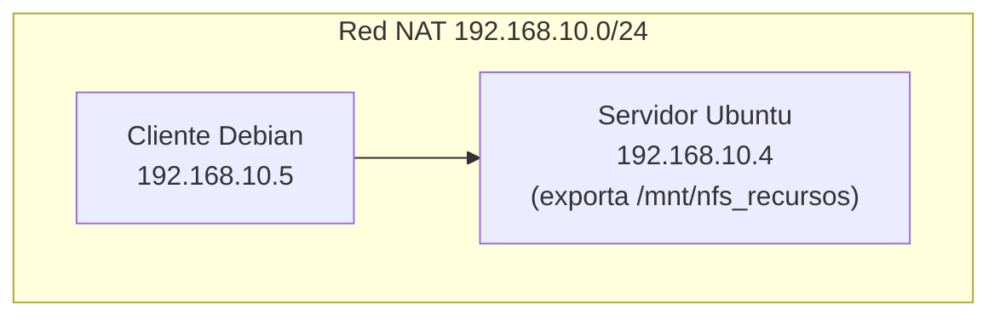

# NFS

## Índice

1. [¿Qué es NFS?](#1-qué-es-nfs)
2. [Escenario de la práctica](#2-escenario-de-la-práctica)
3. [Instalación del servidor NFS](#3-instalación-del-servidor-nfs)
4. [Instalación del cliente Debian](#4-instalación-del-cliente-debian)
5. [Nota sobre clientes Windows](#5-nota-sobre-clientes-windows)
6. [El problema de los usuarios y los UID](#6-el-problema-de-los-usuarios-y-los-uid)

---

## 1. ¿Qué es NFS?

**NFS** (*Network File System*) es un protocolo de red utilizado para distribuir sistemas de ficheros en una red local. Se estructura en una arquitectura **cliente-servidor**, de forma que los clientes acceden de forma remota a los recursos compartidos por el servidor.

> **Nota:** NFS nació en el mundo Unix y es el protocolo natural para compartir ficheros entre sistemas Linux. Para el cliente, el directorio remoto se comporta como una carpeta más de su árbol de directorios: se monta igual que un disco local.

---

## 2. Escenario de la práctica

La implementación de la práctica requiere de la siguiente configuración: una red NAT `192.168.10.0/24` con al menos tres equipos:

- Servidor Ubuntu con IP `192.168.10.4`.
- Cliente Debian con IP `192.168.10.5`.



El objetivo es la instalación de un servidor y un cliente NFS para poder acceder de este modo a los documentos de un terminal desde otro, en lo que llamaremos una «memoria compartida».

---

## 3. Instalación del servidor NFS

Los pasos que se deben seguir para instalar un servidor NFS son los siguientes:

1. Instalar los paquetes necesarios para montar un servidor NFS, en concreto el paquete `nfs-kernel-server`:

```bash
usuario@servidor:~$ sudo apt install -y nfs-kernel-server
[sudo: authenticate] Password:
Los paquetes indicados a continuación se instalaron de forma automática y ya no son necesarios:
  linux-headers-7.0.0-14                   linux-modules-7.0.0-14-generic
  linux-headers-7.0.0-14-generic           linux-tools-7.0.0-14
  linux-image-unsigned-7.0.0-14-generic    linux-tools-7.0.0-14-generic
  linux-main-modules-zfs-7.0.0-14-generic  pollinate
Utilice «sudo apt autoremove» para eliminarlos.

Instalando:
  nfs-kernel-server

Instalando dependencias:
  keyutils  libnfsidmap1  nfs-common  rpcbind
```

2. Crear la carpeta que queremos que sea compartida con el resto de clientes NFS:

```bash
usuario@servidor:~$ sudo mkdir -p /mnt/nfs_recursos
usuario@servidor:~$ ls -ld /mnt/nfs_recursos/
drwxr-xr-x 2 root root 4096 Aug 19 12:12 /mnt/nfs_recursos/
```

3. Cambiar el propietario y los permisos del directorio para que sea accesible por todos los usuarios de todos los grupos:


```bash
usuario@servidor:~$ sudo chown nobody:nogroup /mnt/nfs_recursos/
usuario@servidor:~$ sudo chmod 777 /mnt/nfs_recursos/
usuario@servidor:~$ ls -ld /mnt/nfs_recursos/
drwxrwxrwx 2 nobody nogroup 4096 Aug 19 12:12 /mnt/nfs_recursos/
```

> **Nota:** `nobody:nogroup` es el usuario y grupo sin privilegios que NFS utiliza para las peticiones anónimas. Con `chmod 777` cualquier usuario podrá leer y escribir en la carpeta; es una configuración adecuada para esta práctica, pero en un entorno real los permisos deberían ajustarse a los usuarios que realmente necesiten acceso.

4. A continuación hay que darles permiso a los clientes para que puedan acceder al equipo. En este caso se tiene que modificar el fichero `/etc/exports`:

```bash
usuario@servidor:~$ sudo nano /etc/exports
usuario@servidor:~$ cat /etc/exports
# /etc/exports: the access control list for filesystems which may be exported
#               to NFS clients.  See exports(5).
#
# Example for NFSv2 and NFSv3:
# /srv/homes       hostname1(rw,sync,no_subtree_check) hostname2(ro,sync,no_subtree_check)
#
# Example for NFSv4:
# /srv/nfs4        gss/krb5i(rw,sync,fsid=0,crossmnt,no_subtree_check)
# /srv/nfs4/homes  gss/krb5i(rw,sync,no_subtree_check)
#

# Recursos NFS
/mnt/nfs_recursos       192.168.10.0/24(rw,sync,no_subtree_check)
```

Al final del fichero se añade la línea que exporta el directorio a toda la red:

```bash
/mnt/nfs_recursos       192.168.10.0/24(rw,sync,no_subtree_check)
```

Cada línea de `/etc/exports` indica el directorio exportado, los equipos autorizados (una IP, una red o un nombre de equipo) y, entre paréntesis, las opciones de exportación. Las opciones más habituales son las siguientes:

| Opción | Descripción |
|---|---|
| `ro` | Solo lectura: los clientes pueden leer el recurso pero no modificarlo. Es el valor por defecto. |
| `rw` | Lectura y escritura: los clientes pueden leer y modificar el contenido del recurso. |
| `root_squash` | El usuario `root` del cliente se «convierte» en el usuario anónimo (`nobody:nogroup`) al acceder al recurso, evitando que un root remoto tenga privilegios de root en el servidor. Es el valor por defecto. |
| `no_root_squash` | El `root` del cliente conserva sus privilegios de root sobre el recurso. Debe evitarse salvo casos muy justificados (por ejemplo, clientes sin disco), ya que supone un riesgo de seguridad. |
| `all_squash` | Todos los usuarios del cliente, sean quienes sean, se convierten en el usuario anónimo. Útil para recursos públicos donde no interesa distinguir usuarios. |
| `anonuid=xxx` | UID que se asigna al usuario anónimo en lugar del de `nobody`. Permite que los accesos anónimos se traduzcan a un usuario local concreto del servidor. |
| `anongid=xxx` | GID que se asigna al grupo anónimo en lugar del de `nogroup`. Se usa junto a `anonuid` para controlar a qué grupo local se mapean los accesos anónimos. |
| `secure` | Solo acepta peticiones procedentes de puertos privilegiados del cliente (menores de 1024), que únicamente puede usar root. Es el valor por defecto. |
| `insecure` | Acepta peticiones desde cualquier puerto. Necesario para algunos clientes que no pueden usar puertos privilegiados (por ejemplo, ciertos clientes NFS de macOS o aplicaciones sin privilegios). |
| `sync` | Confirma las escrituras en disco antes de responder al cliente, evitando pérdidas de datos ante un fallo del servidor. Es más seguro, aunque algo más lento. |
| `async` | Responde al cliente sin esperar a que la escritura llegue al disco. Mejora el rendimiento, pero puede perder o corromper datos si el servidor cae con escrituras pendientes. |
| `subtree_check` | Cuando se exporta un subdirectorio (y no la partición completa), el servidor verifica en cada petición que el fichero sigue dentro del subárbol exportado. Añade sobrecarga y puede dar problemas al renombrar ficheros abiertos. |
| `no_subtree_check` | Desactiva la comprobación anterior, mejorando el rendimiento y la fiabilidad. Es el valor por defecto en las versiones actuales y la opción recomendada. |

> **Advertencia:** Las parejas de opciones son excluyentes entre sí (`ro`/`rw`, `sync`/`async`, `root_squash`/`no_root_squash`, `secure`/`insecure`, `subtree_check`/`no_subtree_check`). Las opciones se escriben entre paréntesis, separadas por comas y **sin espacios** tras la dirección: un espacio antes del paréntesis cambia el significado de la línea y abriría el recurso a cualquier equipo.

5. Se exporta el directorio compartido:

```bash
usuario@servidor:~$ sudo exportfs -a
```

6. Se reinicia el servidor NFS para aplicar la configuración:

```bash
usuario@servidor:~$ sudo systemctl restart nfs-kernel-server
usuario@servidor:~$ systemctl status nfs-kernel-server
● nfs-server.service - NFS server and services
     Loaded: loaded (/usr/lib/systemd/system/nfs-server.service; enabled; preset: enabled)
     Active: active (exited) since Wed 2026-08-19 12:19:54 UTC; 1s ago
 Invocation: 1b65af065f4040e48717eb23eb35d1c5
       Docs: man:rpc.nfsd(8)
             man:exportfs(8)
    Process: 3182 ExecStartPre=/usr/sbin/exportfs -r (code=exited, status=0/SUCCESS)
    Process: 3184 ExecStart=/bin/sh -c /usr/sbin/nfsdctl autostart || /usr/sbin/rpc.nfsd (code=exited, status=0/SUCCESS)
   Main PID: 3184 (code=exited, status=0/SUCCESS)
   Mem peak: 1.9M
        CPU: 35ms

ago 19 12:19:54 servidor systemd[1]: Starting nfs-server.service - NFS server and services...
ago 19 12:19:54 servidor systemd[1]: Finished nfs-server.service - NFS server and services.
```

> **Nota:** `sudo exportfs -a` aplica todas las exportaciones definidas en `/etc/exports` sin necesidad de reiniciar. Puede comprobarse lo que el servidor está exportando en cada momento con `sudo exportfs -v`.

---

## 4. Instalación del cliente Debian

Los pasos que se deben seguir para instalar un cliente NFS en Debian son los siguientes:

1. Instalar el paquete `nfs-common`:

```bash
usuario@debian:~$ sudo apt install nfs-common
```

2. Crear un directorio donde el equipo montará la carpeta compartida:

```bash
usuario@debian:~$ sudo mkdir -p /mnt/nfs_cliente_debian
```

3. Finalmente, montar la carpeta compartida indicando la IP del servidor, la ruta exportada y el punto de montaje local:

```bash
usuario@debian:~$ sudo mount -t nfs 192.168.10.4:/mnt/nfs_recursos /mnt/nfs_cliente_debian/

usuario@debian:~$ df -Th
S.ficheros                     Tipo     Tamaño Usados  Disp Uso% Montado en
udev                           devtmpfs   1,9G      0  1,9G   0% /dev
tmpfs                          tmpfs      393M   1,3M  391M   1% /run
/dev/sda1                      ext4        47G   5,3G   39G  12% /
tmpfs                          tmpfs      2,0G    12K  2,0G   1% /dev/shm
tmpfs                          tmpfs      5,0M   8,0K  5,0M   1% /run/lock
tmpfs                          tmpfs      1,0M      0  1,0M   0% /run/credentials/systemd-journald.service
tmpfs                          tmpfs      2,0G    16K  2,0G   1% /tmp
tmpfs                          tmpfs      393M    96K  393M   1% /run/user/1000
192.168.10.4:/mnt/nfs_recursos nfs4        24G   7,1G   16G  32% /mnt/nfs_cliente_debian
```

> **Nota:** Puede verificarse que el montaje se ha realizado correctamente con `df -h` o con `mount | grep nfs`. A partir de este momento, todo lo que se escriba en `/mnt/nfs_cliente_debian` se está escribiendo realmente en el servidor.

4. Modificar el fichero `/etc/fstab` para que la configuración sea permanente y el recurso se monte automáticamente en cada arranque:

Antes de nada hacemos una copia de seguridad del `/etc/fstab`.

```bash
usuario@debian:~$ sudo cp -pv /etc/fstab /etc/fstab_COPIA
'/etc/fstab' -> '/etc/fstab_COPIA'
```

```bash
usuario@debian:~$ sudo nano /etc/fstab
```

Añadimos la siguiente línea al final del fichero:

```text
192.168.10.4:/mnt/nfs_recursos    /mnt/nfs_cliente_debian    nfs    defaults    0    0
```

Comprobamos que no hay errores en la configuración ejecutando `sudo mount -a`: si no devuelve errores, la línea es válida y podemos reiniciar el cliente con seguridad.

```bash
usuario@debian:~$ sudo mount -a
usuario@debian:~$ sudo reboot
```

---

## 5. Nota sobre clientes Windows

Windows también puede actuar como cliente NFS: las ediciones Pro, Enterprise y Education incluyen los **Servicios para NFS** como característica opcional (Panel de control > Programas > Activar o desactivar las características de Windows), y una vez activados es posible montar el recurso desde el símbolo del sistema con el comando `mount`, que lo presenta como una unidad de red más.

Sin embargo, en la práctica **tiene poco sentido**. El cliente NFS de Windows no integra bien la autenticación: no existe correspondencia entre el usuario de Windows y los UID de Linux, por lo que Windows accede al recurso como usuario anónimo (`nobody:nogroup`, UID 65534) y todo depende de abrir los permisos de la carpeta a cualquiera. En una red con clientes Windows, la solución natural es compartir mediante **SMB** con **SAMBA**: es el protocolo nativo de Windows, viene incluido en todas sus ediciones y permite autenticar a cada usuario con su nombre y contraseña.

> **Recuerda:** La regla general es utilizar cada protocolo con sus clientes naturales: **NFS entre sistemas Linux/Unix** y **SMB (Samba) cuando hay clientes Windows** de por medio.

---

## 6. El problema de los usuarios y los UID

En NFS los ficheros no tienen dueño «con nombre»: lo que se guarda y lo que viaja por la red es el **UID y el GID numéricos**. El nombre que muestra `ls -l` lo traduce cada máquina por su cuenta consultando su `/etc/passwd` local. Si en el servidor y en el cliente el UID 1000 se llama `usuario` en ambos, todo parece coherente, pero se trata de **dos cuentas distintas que casualmente comparten el número**: si en el cliente el UID 1000 perteneciera a otra persona, esta aparecería como propietaria de los ficheros y tendría permisos de propietaria sobre ellos, porque el servidor solo comprueba el número.

Con `root` ocurre un caso particular: por la opción por defecto `root_squash`, el root de un cliente queda degradado al usuario anónimo (`nobody:nogroup`) cuando accede a través del montaje NFS, de modo que ser root en el cliente no otorga privilegios sobre el recurso del servidor.

La consecuencia es clara: para que NFS funcione con permisos reales por usuario, los UID y GID deben ser **coherentes en todas las máquinas de la red**, y eso no puede depender de la casualidad ni de la disciplina del administrador. La solución correcta es centralizar las cuentas en un servicio de directorio como **OpenLDAP** (visto en la [UD3](<../UD3 - Administración de un servidor Linux/UD3.md>)): todas las máquinas consultan la misma base de usuarios, con lo que `usuario` es de verdad la misma cuenta, con el mismo UID, en todas partes. En un despliegue real, el orden lógico es ese: **primero el directorio centralizado (LDAP) y después NFS** apoyándose en él; es la base, por ejemplo, de los perfiles móviles, donde el `/home` de cada usuario se sirve por NFS a cualquier equipo en el que inicie sesión.
