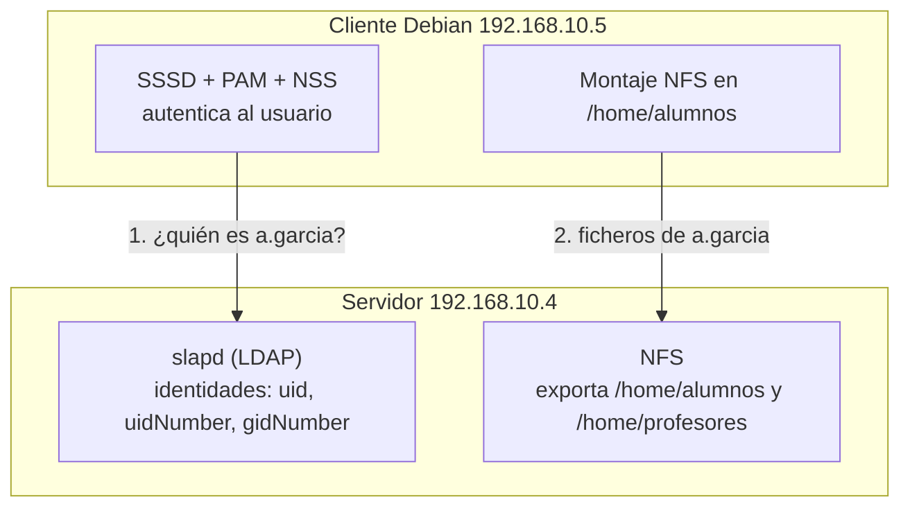

# Perfiles móviles en Linux con LDAP y NFS

## Índice

1. [¿Qué es un perfil móvil?](#1-qué-es-un-perfil-móvil)
   - [1.1. Perfiles móviles en Windows y en Linux](#11-perfiles-móviles-en-windows-y-en-linux)
   - [1.2. Arquitectura de la solución](#12-arquitectura-de-la-solución)
2. [Escenario de partida y comprobaciones previas](#2-escenario-de-partida-y-comprobaciones-previas)
   - [2.1. Máquinas y direccionamiento](#21-máquinas-y-direccionamiento)
   - [2.2. Comprobaciones en el servidor](#22-comprobaciones-en-el-servidor)
   - [2.3. Comprobaciones en el cliente](#23-comprobaciones-en-el-cliente)
3. [Configuración del servidor NFS](#3-configuración-del-servidor-nfs)
   - [3.1. Instalación del servicio](#31-instalación-del-servicio)
   - [3.2. Exportación de los directorios home](#32-exportación-de-los-directorios-home)
   - [3.3. Aplicación y verificación de las exportaciones](#33-aplicación-y-verificación-de-las-exportaciones)
4. [Preparación del cliente](#4-preparación-del-cliente)
   - [4.1. Instalación del cliente NFS](#41-instalación-del-cliente-nfs)
   - [4.2. Retirada de los homes locales](#42-retirada-de-los-homes-locales)
   - [4.3. Desactivación de pam_mkhomedir](#43-desactivación-de-pam_mkhomedir)
5. [Montaje de los homes en el cliente](#5-montaje-de-los-homes-en-el-cliente)
   - [5.1. Montaje manual de prueba](#51-montaje-manual-de-prueba)
   - [5.2. Montaje permanente con /etc/fstab](#52-montaje-permanente-con-etcfstab)
6. [Verificación del perfil móvil](#6-verificación-del-perfil-móvil)
   - [6.1. Resolución de identidades](#61-resolución-de-identidades)
   - [6.2. Prueba de sesión](#62-prueba-de-sesión)
   - [6.3. Prueba de movilidad real](#63-prueba-de-movilidad-real)
7. [Mejora: montaje bajo demanda con autofs](#7-mejora-montaje-bajo-demanda-con-autofs)
8. [Problemas frecuentes y diagnóstico](#8-problemas-frecuentes-y-diagnóstico)
9. [Ejercicio 4.1](#9-ejercicio-41)

---

> **Convención de etiquetas usada en estos apuntes:**
>
> **SERVIDOR** — El paso se realiza en la máquina Ubuntu Server 26.04 LTS con `slapd` y NFS (`192.168.10.4`).
>
> **CLIENTE** — El paso se realiza en la máquina Debian 13 del alumno o profesor (`192.168.10.5`).

---

## 1. ¿Qué es un perfil móvil?

Un **perfil móvil** (*roaming profile*) es un perfil de usuario que no reside en el disco del equipo donde se trabaja, sino en un servidor de la red. Gracias a ello, el usuario encuentra sus documentos, su escritorio y su configuración personal **en cualquier equipo del aula en el que inicie sesión**, sin depender de haber usado antes esa máquina concreta.

En un centro educativo el problema que resuelve es evidente: un alumno no se sienta siempre en el mismo ordenador. Sin perfiles móviles, los trabajos que guardó el lunes en el PC de la primera fila no estarían disponibles el martes en el PC del fondo. Con perfiles móviles, su carpeta personal le acompaña.

> **Recuerda:** En la [UD3](<../UD3 - Administración de un servidor Linux/ldap.md>) se centralizaron las **identidades** con LDAP: el alumno ya puede autenticarse en cualquier equipo. Lo que falta ahora es centralizar sus **datos**. Son dos problemas distintos y complementarios: LDAP responde a «quién eres» y NFS a «dónde están tus ficheros».

### 1.1. Perfiles móviles en Windows y en Linux

El término procede del mundo Windows, pero conviene entender que el mecanismo no es el mismo en ambos sistemas:

| | Windows (perfil móvil clásico) | Linux (home compartido por NFS) |
|---|---|---|
| **Ubicación de los datos** | Copia local temporal en cada equipo | Única copia, siempre en el servidor |
| **Momento de la transferencia** | Descarga completa al iniciar sesión y subida al cerrarla | Acceso en tiempo real a cada fichero, según se abre o se guarda |
| **Tiempo de inicio de sesión** | Aumenta con el tamaño del perfil | Constante, independiente del tamaño |
| **Riesgo de conflicto** | Alto si se inicia sesión en dos equipos (gana el último que cierra) | Bajo: todos los equipos escriben sobre los mismos ficheros |
| **Si falla la red** | Se trabaja con la copia local en caché | No hay acceso al home |

En Linux, por tanto, no existe una «sincronización» de ida y vuelta: el directorio personal del usuario **está** físicamente en el servidor todo el tiempo, y el cliente simplemente lo monta. Esto elimina de raíz los problemas de perfiles desincronizados típicos de Windows, a cambio de exigir que el servidor esté disponible durante toda la sesión.

> **Nota:** Por precisión terminológica, en el mundo Unix esta técnica se denomina habitualmente **home compartido** o *network home*. Se emplea aquí la expresión «perfil móvil» por ser la que utiliza el currículo y por resultar más descriptiva del resultado obtenido.

### 1.2. Arquitectura de la solución

La solución completa combina tres piezas que ya se han trabajado por separado:



El proceso al iniciar sesión un alumno en cualquier equipo del aula es el siguiente:

1. El alumno introduce su usuario y contraseña. **PAM** delega la comprobación en **SSSD**, que consulta al servidor **LDAP**.
2. LDAP confirma las credenciales y devuelve los datos POSIX del usuario: `uidNumber`, `gidNumber`, `loginShell` y, sobre todo, `homeDirectory` (por ejemplo `/home/alumnos/a.garcia`).
3. El cliente sitúa al usuario en ese directorio, que **no está en su disco local** sino en el montaje NFS del servidor.
4. Todo lo que el alumno cree o modifique se escribe directamente en el disco del servidor.

> **Importante:** El atributo `homeDirectory` de LDAP y el punto de montaje NFS del cliente deben coincidir exactamente. Si LDAP dice que el home es `/home/alumnos/a.garcia` y el cliente monta la exportación en `/mnt/homes`, el usuario iniciará sesión en un directorio que no existe.

---

## 2. Escenario de partida y comprobaciones previas

### 2.1. Máquinas y direccionamiento

Se parte del escenario ya montado en la unidad anterior, sin añadir ninguna máquina nueva:

| Equipo | Sistema | IP | Función |
|---|---|---|---|
| `ldap.ies.local` | Ubuntu Server 26.04 LTS | `192.168.10.4` | Servidor LDAP y, a partir de ahora, servidor NFS de los homes |
| `cliente` | Debian 13 | `192.168.10.5` | Equipo del aula, ya integrado en el directorio mediante SSSD |

Los usuarios y grupos del directorio, con sus identificadores numéricos y sus homes, son los definidos en la UD3:

| Usuario | uidNumber | gidNumber | Grupo | homeDirectory |
|---|---|---|---|---|
| `a.garcia` | `10001` | `10000` | SMR1 | `/home/alumnos/a.garcia` |
| `c.lopez` | `10002` | `10000` | SMR1 | `/home/alumnos/c.lopez` |
| `l.moreno` | `11001` | `11000` | SMR2 | `/home/alumnos/l.moreno` |
| `m.fernandez` | `12001` | `12000` | FPB1 | `/home/alumnos/m.fernandez` |
| `j.martin` | `13001` | `13000` | FPB2 | `/home/alumnos/j.martin` |
| `p.rodriguez` | `20001` | `30000` | profesores | `/home/profesores/p.rodriguez` |
| `l.sanchez` | `20002` | `30000` | profesores | `/home/profesores/l.sanchez` |

> **Snapshot:** Antes de comenzar, crear una instantánea de ambas máquinas virtuales (por ejemplo, `ldap-ok` y `cliente-ldap-ok`). El escenario LDAP funcionando es el resultado de toda una unidad de trabajo y conviene poder recuperarlo si algo sale mal durante el montaje de los homes.

### 2.2. Comprobaciones en el servidor

**SERVIDOR**

Antes de exportar nada, verificar que el directorio LDAP sigue operativo:

```bash
root@ldap:~# systemctl is-active slapd
active
```

Comprobar que los homes provisionados en la sección 5.6 de los apuntes de LDAP existen y conservan sus propietarios numéricos:

```bash
root@ldap:~# ls -ln /home/alumnos/
total 20
drwx------ 2 10001 10000 4096 ago 19 18:02 a.garcia
drwx------ 2 10002 10000 4096 ago 19 18:04 c.lopez
drwx------ 2 13001 13000 4096 ago 19 18:04 j.martin
drwx------ 2 11001 11000 4096 ago 19 18:04 l.moreno
drwx------ 2 12001 12000 4096 ago 19 18:04 m.fernandez

root@ldap:~# ls -ln /home/profesores/
total 8
drwx------ 2 20002 30000 4096 ago 19 18:05 l.sanchez
drwx------ 2 20001 30000 4096 ago 19 18:05 p.rodriguez
```

> **Importante:** Si algún usuario del directorio no tiene su home provisionado aquí, debe crearse **antes** de continuar (`mkdir`, copia de `/etc/skel`, `chown` numérico y `chmod 700`). Un usuario sin home en el servidor podrá autenticarse en el cliente, pero iniciará sesión en un directorio inexistente.

> **Recuerda:** Los propietarios se muestran como números (`10001`, `10000`) porque el servidor no es cliente de su propio LDAP y no sabe traducir esos identificadores a nombres. Es exactamente el comportamiento explicado en la sección [El problema de los usuarios y los UID](NFS.md#6-el-problema-de-los-usuarios-y-los-uid) de los apuntes de NFS.

### 2.3. Comprobaciones en el cliente

**CLIENTE**

Verificar que el cliente sigue resolviendo los usuarios del directorio a través de SSSD:

```bash
root@cliente:~# getent passwd a.garcia
a.garcia:x:10001:10000:Ana Garcia Lopez:/home/alumnos/a.garcia:/bin/bash

root@cliente:~# id a.garcia
uid=10001(a.garcia) gid=10000(SMR1) groups=10000(SMR1)
```

Comprobar también que hay conectividad con el servidor:

```bash
root@cliente:~# ping -c 2 192.168.10.4
```

> **Importante:** Si `getent passwd a.garcia` no devuelve nada, el cliente ha perdido la integración con LDAP y no tiene sentido continuar: primero hay que resolver ese problema revisando SSSD, tal y como se explica en los apuntes de la UD3. El montaje NFS por sí solo no da acceso a nadie.

---

## 3. Configuración del servidor NFS

### 3.1. Instalación del servicio

**SERVIDOR**

Instalar el servidor NFS en la máquina que ya actúa como servidor LDAP:

```bash
root@ldap:~# apt update && apt install nfs-kernel-server -y
```

Verificar que el servicio ha quedado activo:

```bash
root@ldap:~# systemctl is-active nfs-kernel-server
active
```

> **Nota:** En un centro real, el servidor de directorio y el servidor de ficheros suelen ser máquinas distintas por motivos de rendimiento y disponibilidad. En esta práctica se concentran en un único equipo para simplificar el escenario, pero la configuración es idéntica: solo cambiaría la dirección IP a la que apuntan los clientes.

### 3.2. Exportación de los directorios home

**SERVIDOR**

Editar el fichero de exportaciones para publicar los dos árboles de homes:

```bash
root@ldap:~# nano /etc/exports
```

Añadir al final del fichero las siguientes líneas:

```text
# Perfiles móviles - homes de los alumnos
/home/alumnos       192.168.10.0/24(rw,sync,no_subtree_check,root_squash)

# Perfiles móviles - homes de los profesores
/home/profesores    192.168.10.0/24(rw,sync,no_subtree_check,root_squash)
```

| Opción | Motivo por el que se emplea aquí |
|---|---|
| `192.168.10.0/24` | Solo los equipos de la red del aula pueden montar los homes. Nunca debe exportarse a `*` (cualquier equipo). |
| `rw` | Imprescindible: el usuario tiene que poder guardar sus trabajos, no solo leerlos. |
| `sync` | Confirma cada escritura en disco antes de responder. Con datos de alumnado, la integridad prima sobre la velocidad. |
| `no_subtree_check` | Se exporta un subdirectorio (`/home/alumnos`) y no una partición completa; esta opción evita la sobrecarga y los fallos al renombrar ficheros abiertos. |
| `root_squash` | El `root` de un equipo del aula queda degradado a `nobody` sobre la exportación: no puede leer ni manipular los homes de los usuarios. |

> **Importante:** Mantener `root_squash` es posible precisamente porque los homes ya están creados en el servidor. Si se hubiese dejado que el cliente los creara con `pam_mkhomedir`, habría hecho falta `no_root_squash` —el módulo se ejecuta como root en el cliente— y cualquier alumno con privilegios de administrador en un PC del aula tendría control total sobre los ficheros de todos sus compañeros.

> **Recuerda:** La tabla completa de opciones de `/etc/exports` (`ro`, `all_squash`, `anonuid`, `secure`, `async`…) está en los apuntes de [NFS](NFS.md#3-instalación-del-servidor-nfs).

### 3.3. Aplicación y verificación de las exportaciones

**SERVIDOR**

Aplicar los cambios sin necesidad de reiniciar el servicio:

```bash
root@ldap:~# exportfs -ra
```

| Parámetro | Descripción |
|---|---|
| `-r` | Reexporta todo, sincronizando el estado del servidor con el contenido actual de `/etc/exports` |
| `-a` | Aplica la operación a todas las exportaciones del fichero |
| `-v` | Muestra el detalle de lo que el servidor está exportando en este momento |

Comprobar el resultado. La salida muestra las opciones efectivas, incluidas las que se aplican por defecto sin haberlas escrito:

```bash
root@ldap:~# exportfs -v
/home/alumnos   192.168.10.0/24(sync,wdelay,hide,no_subtree_check,sec=sys,rw,secure,root_squash,no_all_squash)
/home/profesores
                192.168.10.0/24(sync,wdelay,hide,no_subtree_check,sec=sys,rw,secure,root_squash,no_all_squash)
```

> **Nota:** Si el firewall `ufw` estuviera activo en el servidor, habría que permitir el servicio NFS con `ufw allow from 192.168.10.0/24 to any port nfs`. En el escenario de la práctica `ufw` está inactivo, por lo que no es necesario.

---

## 4. Preparación del cliente

### 4.1. Instalación del cliente NFS

**CLIENTE**

Instalar las utilidades de cliente NFS:

```bash
root@cliente:~# apt update && apt install nfs-common -y
```

Comprobar desde el cliente qué está exportando el servidor. Es la forma más rápida de verificar que la configuración del servidor es correcta y visible desde la red:

```bash
root@cliente:~# showmount -e 192.168.10.4
Export list for 192.168.10.4:
/home/profesores 192.168.10.0/24
/home/alumnos    192.168.10.0/24
```

> **Nota:** Si `showmount` no devuelve nada o da un error de conexión, el problema está en el servidor (servicio parado, exportación mal escrita) o en la red, y no tiene sentido intentar el montaje todavía.

### 4.2. Retirada de los homes locales

**CLIENTE**

Durante la práctica de LDAP, el módulo `pam_mkhomedir` creó homes locales en el disco del cliente para los usuarios que iniciaron sesión. Esos directorios **quedarían ocultos bajo el montaje NFS**: no se borran, pero dejan de ser accesibles, y el espacio que ocupan permanece invisible.

Antes de montar, comprobar qué homes locales existen:

```bash
root@cliente:~# ls -l /home/alumnos/
total 4
drwx------ 3 a.garcia SMR1 4096 ago 19 17:40 a.garcia
```

Apartar los directorios locales renombrándolos, en lugar de borrarlos, para poder recuperar cualquier fichero de las pruebas anteriores:

```bash
root@cliente:~# mv /home/alumnos /home/alumnos.local.bak
root@cliente:~# mv /home/profesores /home/profesores.local.bak
```

Crear de nuevo los directorios vacíos, que a partir de ahora serán únicamente **puntos de montaje**:

```bash
root@cliente:~# mkdir /home/alumnos /home/profesores
```

> **Advertencia:** No debe montarse `/home` completo. En el cliente existen cuentas locales (como `usuario`) cuyos directorios están directamente bajo `/home`; si se montara todo `/home` por NFS, esas cuentas se quedarían sin acceso a su directorio personal y podría perderse el acceso administrativo al equipo. Montar únicamente `/home/alumnos` y `/home/profesores` mantiene intactas las cuentas locales.

### 4.3. Desactivación de pam_mkhomedir

**CLIENTE**

Con los homes servidos por NFS, el módulo `pam_mkhomedir` ya no cumple ninguna función útil: los directorios existen en el servidor y el módulo solo actúa cuando el directorio no existe.

El motivo para desactivarlo no es la redundancia, sino la seguridad de los datos. Si un día el montaje NFS fallara (servidor apagado, cable desconectado), `pam_mkhomedir` crearía **silenciosamente** un home local vacío sobre el punto de montaje: el alumno iniciaría sesión, encontraría su escritorio vacío, trabajaría durante toda la clase y guardaría sus ficheros en el disco local de ese PC, creyendo que están en el servidor. Es preferible que el inicio de sesión falle de forma visible.

```bash
root@cliente:~# nano /etc/pam.d/common-session
```

Comentar la línea del módulo anteponiendo una almohadilla:

```text
# session required    pam_mkhomedir.so skel=/etc/skel umask=077
```

> **Snapshot:** Cualquier modificación en los ficheros de `/etc/pam.d/` puede impedir el inicio de sesión en el equipo. Antes de editarlos, crear una instantánea del cliente y mantener abierta una segunda terminal con sesión de `root` ya iniciada.

> **Nota:** Si en la UD3 se activó el módulo mediante `pam-auth-update` en lugar de editando el fichero a mano, la forma correcta de desactivarlo es volver a ejecutar `pam-auth-update` y desmarcar la opción *Create home directory on login*.

---

## 5. Montaje de los homes en el cliente

### 5.1. Montaje manual de prueba

**CLIENTE**

Antes de configurar el montaje permanente conviene probarlo a mano, ya que un error en `/etc/fstab` puede afectar al arranque del sistema:

```bash
root@cliente:~# mount -t nfs 192.168.10.4:/home/alumnos /home/alumnos
root@cliente:~# mount -t nfs 192.168.10.4:/home/profesores /home/profesores
```

Verificar que ambos montajes aparecen y que el sistema de ficheros es `nfs4`:

```bash
root@cliente:~# df -Th | grep nfs
192.168.10.4:/home/alumnos     nfs4   24G  7,2G   16G  32% /home/alumnos
192.168.10.4:/home/profesores  nfs4   24G  7,2G   16G  32% /home/profesores
```

> **Nota:** Ambos montajes muestran el mismo tamaño y ocupación porque no son dos discos distintos: son dos directorios de la misma partición del servidor. Lo que informa `df` es el espacio de esa partición.

Si la prueba es correcta, desmontar para continuar con la configuración permanente:

```bash
root@cliente:~# umount /home/alumnos /home/profesores
```

### 5.2. Montaje permanente con /etc/fstab

**CLIENTE**

Para que los homes se monten automáticamente en cada arranque hay que declararlos en `/etc/fstab`. Antes de editarlo, hacer una copia de seguridad:

```bash
root@cliente:~# cp -pv /etc/fstab /etc/fstab_COPIA
'/etc/fstab' -> '/etc/fstab_COPIA'
```

```bash
root@cliente:~# nano /etc/fstab
```

Añadir al final del fichero las dos líneas siguientes:

```text
192.168.10.4:/home/alumnos     /home/alumnos     nfs  defaults,_netdev,x-systemd.automount,x-systemd.mount-timeout=10  0  0
192.168.10.4:/home/profesores  /home/profesores  nfs  defaults,_netdev,x-systemd.automount,x-systemd.mount-timeout=10  0  0
```

| Opción | Descripción |
|---|---|
| `defaults` | Conjunto de opciones habituales: lectura y escritura, montaje automático, permitir ejecución de binarios, etc. |
| `_netdev` | Indica que el recurso depende de la red. `systemd` no intentará montarlo hasta que la red esté disponible, evitando el fallo típico de los montajes de red en el arranque. |
| `x-systemd.automount` | El recurso no se monta durante el arranque, sino la **primera vez que se accede a él**. El equipo arranca con normalidad aunque el servidor no responda. |
| `x-systemd.mount-timeout=10` | Tiempo máximo (en segundos) que se espera al montar antes de dar error, en lugar de quedarse esperando indefinidamente. |

Tras modificar `/etc/fstab` con opciones de `systemd` es necesario recargar la configuración para que se generen las unidades de montaje automático correspondientes:

```bash
root@cliente:~# systemctl daemon-reload
root@cliente:~# mount -a
root@cliente:~# reboot
```

Comprobar que no se ha producido ningún error y que las unidades `automount` están activas:

```bash
root@cliente:~# systemctl list-units --type=automount | grep home
home-alumnos.automount        loaded active running Automount /home/alumnos
home-profesores.automount     loaded active running Automount /home/profesores
```

> **Advertencia:** Un error de sintaxis en `/etc/fstab` puede impedir que el sistema arranque correctamente. La comprobación con `mount -a` es obligatoria antes de reiniciar: si no devuelve ningún error, la configuración es válida.

> **Importante:** Sin `x-systemd.automount`, un cliente que arranque mientras el servidor está apagado puede quedarse esperando en el proceso de arranque hasta agotar el tiempo de espera. En un aula con veinte equipos que se encienden a la vez cada mañana, esta opción marca la diferencia entre un arranque normal y veinte equipos bloqueados.

Comprobar que todo sigue funcionando tras el arranque:

```bash
root@cliente:~# ls /home/alumnos/
a.garcia  c.lopez  j.martin  l.moreno  m.fernandez
```

---

## 6. Verificación del perfil móvil

### 6.1. Resolución de identidades

**CLIENTE**

Este es el momento en el que se comprueba que las dos piezas encajan. Listar los homes montados **desde el cliente**:

```bash
root@cliente:~# ls -l /home/alumnos/
total 20
drwx------ 2 a.garcia    SMR1 4096 ago 19 18:02 a.garcia
drwx------ 2 c.lopez     SMR1 4096 ago 19 18:04 c.lopez
drwx------ 2 j.martin    FPB2 4096 ago 19 18:04 j.martin
drwx------ 2 l.moreno    SMR2 4096 ago 19 18:04 l.moreno
drwx------ 2 m.fernandez FPB1 4096 ago 19 18:04 m.fernandez
```

Los mismos directorios que en el servidor aparecían como `10001 10000` se muestran ahora con nombres (`a.garcia`, `SMR1`). No ha cambiado nada en el disco: lo único que viaja por NFS siguen siendo los números, pero el cliente **sí** es capaz de traducirlos porque consulta LDAP a través de SSSD.

> **Recuerda:** Esta es la demostración práctica de por qué LDAP debe implantarse antes que NFS. Sin un directorio centralizado, cada equipo traduciría el UID 10001 según su fichero `/etc/passwd` local y el mismo directorio parecería pertenecer a personas distintas en cada máquina.

### 6.2. Prueba de sesión

**CLIENTE**

Iniciar sesión como una alumna del directorio y comprobar dónde está situada:

```bash
root@cliente:~# su - a.garcia
a.garcia@cliente:~$ pwd
/home/alumnos/a.garcia
a.garcia@cliente:~$ df -h .
S.ficheros                  Tamaño Usados  Disp Uso% Montado en
192.168.10.4:/home/alumnos    24G   7,2G   16G  32% /home/alumnos
```

La salida de `df -h .` confirma que el directorio actual **no está en el disco del equipo**, sino en el servidor. Crear un fichero de prueba y cerrar la sesión:

```bash
a.garcia@cliente:~$ echo "Trabajo de SORE realizado en el cliente" > trabajo.txt
a.garcia@cliente:~$ ls -l
total 4
-rw------- 1 a.garcia SMR1 40 ago 19 18:20 trabajo.txt
a.garcia@cliente:~$ exit
```

**SERVIDOR**

Comprobar desde el servidor que el fichero se ha escrito realmente allí, con el propietario numérico correcto:

```bash
root@ldap:~# ls -ln /home/alumnos/a.garcia/
total 4
-rw------- 1 10001 10000 40 ago 19 18:20 trabajo.txt

root@ldap:~# cat /home/alumnos/a.garcia/trabajo.txt
Trabajo de SORE realizado en el cliente
```

> **Nota:** El fichero pertenece al UID `10001`, es decir, a `a.garcia`, y no a `nobody`. Esto confirma que `root_squash` no interfiere en el trabajo normal: solo afecta al usuario `root` del cliente, no a los usuarios corrientes.

### 6.3. Prueba de movilidad real

La verificación anterior demuestra que el home está centralizado, pero no que sea **móvil**. Para comprobarlo de verdad hace falta un segundo equipo del aula:

1. Apagar el cliente y **clonar la máquina virtual** en VirtualBox, marcando la opción de: **Generar nuevas direcciones MAC para todos los adaptadores de red**.
2. Arrancar el clon y cambiarle el nombre de host y la dirección IP para que no colisionen con los del original:

```bash
root@cliente:~# hostnamectl set-hostname cliente2
```

Editar la configuración de red del clon para asignarle la dirección `192.168.10.6`, y reiniciar. A partir de ahí, iniciar sesión en el **segundo** equipo con la misma alumna:

```bash
root@cliente2:~# su - a.garcia
a.garcia@cliente2:~$ ls
trabajo.txt
a.garcia@cliente2:~$ cat trabajo.txt
Trabajo de SORE realizado en el cliente
```

El fichero creado en el primer equipo está disponible en el segundo sin haber copiado nada: el perfil móvil funciona.

> **Advertencia:** No conviene iniciar sesión **gráfica** con el mismo usuario en dos equipos a la vez. Los entornos de escritorio mantienen ficheros de bloqueo y bases de datos de configuración (`dconf`, el llavero de claves) dentro del home, y su acceso simultáneo desde dos máquinas puede corromperlos o provocar comportamientos erráticos. En sesiones de consola, como las de esta práctica, no supone ningún problema.

---

## 7. Mejora: montaje bajo demanda con autofs

El montaje declarado en `/etc/fstab` monta **todo** el árbol de homes en cada equipo, aunque en ese PC solo vaya a trabajar un alumno. La alternativa profesional en aulas es **autofs**, un servicio que monta cada directorio personal **en el momento en que se accede a él** y lo desmonta automáticamente tras un periodo de inactividad.

Sus ventajas en un aula son claras: menos montajes activos y menos tráfico de red, recuperación automática si el servidor se reinicia (el siguiente acceso vuelve a montar) y ningún montaje huérfano cuando el alumno cierra la sesión.

**CLIENTE**

Antes de configurarlo hay que **retirar las líneas añadidas a `/etc/fstab`** en el punto 5.2 y desmontar los recursos, ya que ambos métodos son excluyentes y se estorbarían mutuamente:

```bash
root@cliente:~# nano /etc/fstab
root@cliente:~# systemctl daemon-reload
root@cliente:~# umount /home/alumnos /home/profesores
```

Instalar el servicio:

```bash
root@cliente:~# apt install autofs -y
```

Definir el mapa maestro, que asocia un punto de montaje con el fichero que describe su contenido:

```bash
root@cliente:~# nano /etc/auto.master.d/homes.autofs
```

```text
/home/alumnos      /etc/auto.alumnos      --timeout=60
/home/profesores   /etc/auto.profesores   --timeout=60
```

Crear a continuación los mapas concretos. El asterisco actúa como comodín (cualquier nombre solicitado) y el ampersand se sustituye por ese mismo nombre:

```bash
root@cliente:~# nano /etc/auto.alumnos
```

```text
*   -fstype=nfs4,rw   192.168.10.4:/home/alumnos/&
```

```bash
root@cliente:~# nano /etc/auto.profesores
```

```text
*   -fstype=nfs4,rw   192.168.10.4:/home/profesores/&
```

| Elemento | Descripción |
|---|---|
| `*` | Clave comodín: representa cualquier subdirectorio solicitado dentro del punto de montaje |
| `&` | Se sustituye por el valor que ha tomado el comodín. Si se accede a `/home/alumnos/a.garcia`, monta `192.168.10.4:/home/alumnos/a.garcia` |
| `-fstype=nfs4` | Tipo de sistema de ficheros que se va a montar |
| `--timeout=60` | Segundos de inactividad tras los cuales el recurso se desmonta automáticamente |

Reiniciar el servicio para aplicar los mapas:

```bash
root@cliente:~# systemctl restart autofs
root@cliente:~# systemctl enable autofs
```

Comprobar el funcionamiento. Al listar el directorio aparece vacío, porque todavía no se ha montado nada; en cuanto se accede al home de una alumna concreta, `autofs` lo monta al vuelo:

```bash
root@cliente:~# ls /home/alumnos/
root@cliente:~# ls /home/alumnos/a.garcia/
trabajo.txt
root@cliente:~# df -h | grep a.garcia
192.168.10.4:/home/alumnos/a.garcia   24G  7,2G   16G  32% /home/alumnos/a.garcia
```

> **Nota:** El listado inicial vacío es el comportamiento normal y esperado de `autofs` con mapas de comodín: el servicio no sabe qué directorios existen en el servidor hasta que alguien los solicita por su nombre. El inicio de sesión de un usuario provoca ese acceso automáticamente.

> **Nota:** En instalaciones grandes, los mapas de `autofs` pueden almacenarse en el propio directorio LDAP (clases `automountMap` y `automount`) en lugar de en ficheros locales de cada equipo. De este modo, un cambio en la ubicación de los homes se aplica a todos los clientes del centro modificando una única entrada del directorio.

---

## 8. Problemas frecuentes y diagnóstico

| Síntoma | Causa habitual | Comprobación y solución |
|---|---|---|
| El usuario inicia sesión pero aparece `Could not chdir to home directory` | El montaje NFS no está activo o el usuario no tiene home provisionado en el servidor | `df -h \| grep nfs` en el cliente y `ls -ln /home/alumnos/` en el servidor |
| El inicio de sesión se queda bloqueado | El servidor NFS no responde y el montaje es de tipo `hard` sin `automount` | Comprobar `ping 192.168.10.4` y `showmount -e 192.168.10.4`; añadir `x-systemd.automount` |
| Los ficheros aparecen como propiedad de `nobody` | La exportación tiene `all_squash`, o el UID del usuario no coincide en ambas máquinas | Revisar `/etc/exports` y comparar `id usuario` en cliente y `ls -ln` en servidor |
| `Permission denied` al guardar en el home | Los permisos del home en el servidor no corresponden al UID del usuario | En el servidor: `chown -R uid:gid` y `chmod 700` sobre el home |
| El alumno entra pero su escritorio está vacío y sus ficheros no se ven en el servidor | El montaje falló y `pam_mkhomedir` creó un home local vacío | Verificar que `pam_mkhomedir` está desactivado (punto 4.3) y revisar el montaje |
| El equipo tarda muchísimo en arrancar | Falta `_netdev` o `x-systemd.automount` en `/etc/fstab` | Revisar las opciones de montaje y ejecutar `systemctl daemon-reload` |
| `getent passwd a.garcia` no devuelve nada | Problema de SSSD o de conectividad con LDAP, no de NFS | `systemctl status sssd` y `journalctl -u sssd -f` |

Herramientas de diagnóstico útiles durante la puesta en marcha:

```bash
root@cliente:~# showmount -e 192.168.10.4
root@cliente:~# mount | grep nfs
root@cliente:~# journalctl -u sssd -f
root@ldap:~# exportfs -v
root@ldap:~# journalctl -u nfs-kernel-server --no-pager | tail -20
```

> **Recuerda:** Ante cualquier fallo, el primer paso es determinar si el problema es de **identidad** (LDAP/SSSD) o de **datos** (NFS). Si `getent passwd` funciona pero el home no está disponible, el problema es de NFS; si `getent passwd` no devuelve nada, el problema es de LDAP y NFS no tiene nada que ver.

---

## 9. Ejercicio 4.1

> **Importante:** El retraso sobre la fecha estimada de entrega supone la anulación de la misma.

Partiendo del escenario LDAP de la unidad anterior, configura los perfiles móviles del centro educativo. En todo el ejercicio se deben realizar las pertinentes capturas de pantalla que justifiquen cada uno de los pasos.

El ejercicio debe realizarse en un documento que posteriormente debe ser convertido a formato `.pdf`, con el nombre `perfilesmovilestunombretusapellidos.pdf`.

El documento debe constar de los siguientes elementos:

- Portada con el nombre del alumno, asignatura y curso.
- Índice de contenidos autogenerado.
- Índice de figuras autogenerado.
- Contenido propiamente dicho justificado con las capturas de pantalla.
- Bibliografía y referencias.

Pasos a realizar:

- a) Comprueba y documenta el estado de partida: servicio LDAP activo, homes provisionados en el servidor y resolución de usuarios en el cliente.
- b) Instala y configura el servidor NFS exportando `/home/alumnos` y `/home/profesores` únicamente a la red del aula. Justifica cada una de las opciones de exportación elegidas.
- c) Prepara el cliente: retira los homes locales, desactiva `pam_mkhomedir` y explica por qué es necesario hacerlo.
- d) Configura el montaje permanente de ambos recursos y demuestra que sobrevive a un reinicio del equipo.
- e) Verifica el perfil móvil: inicia sesión con un alumno, crea un fichero y comprueba desde el servidor que se ha escrito allí con el UID correcto.
- f) Clona el cliente para disponer de un segundo equipo y demuestra que el mismo usuario accede a sus ficheros desde ambas máquinas.
- g) Sustituye el montaje de `/etc/fstab` por `autofs` y comprueba que los homes se montan bajo demanda.

**Ponderación de la corrección:**

| Apartado | Puntuación |
|---|---|
| a) Comprobaciones del estado de partida | 0,5 puntos |
| b) Servidor NFS y exportaciones justificadas | 1,5 puntos |
| c) Preparación del cliente y justificación de `pam_mkhomedir` | 1 punto |
| d) Montaje permanente verificado tras reinicio | 1,25 puntos |
| e) Verificación del perfil móvil | 1,25 puntos |
| f) Demostración de movilidad con un segundo equipo | 1 punto |
| g) Configuración de `autofs` | 1 punto |
| Limpieza, orden y claridad | 2,5 puntos |
| **Total** | **10 puntos** |
