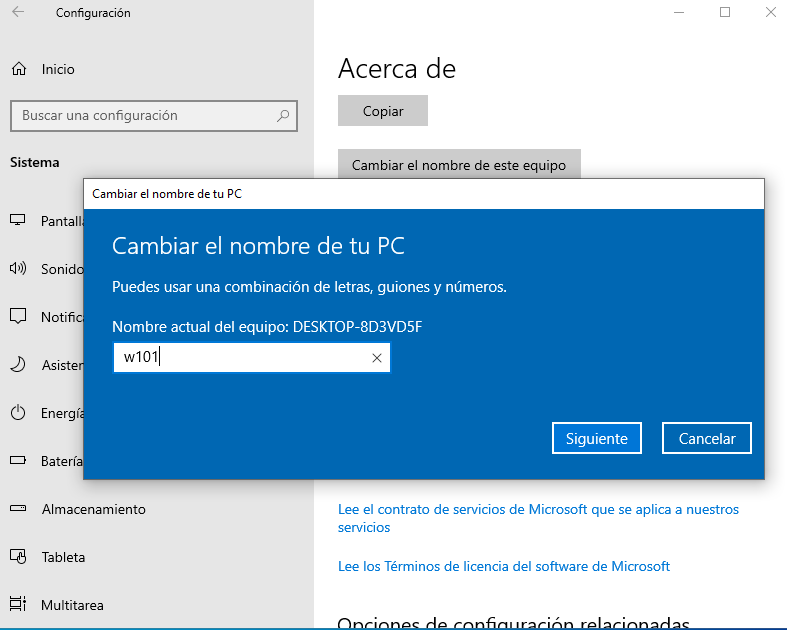
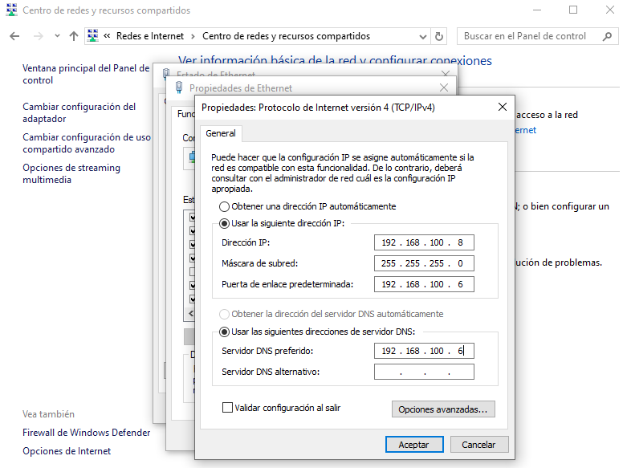
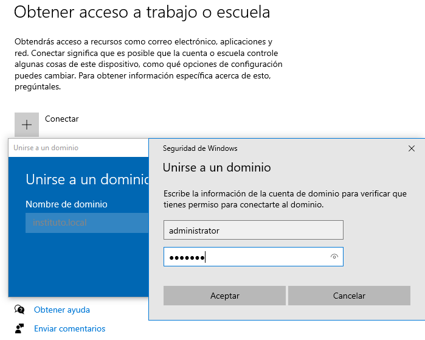
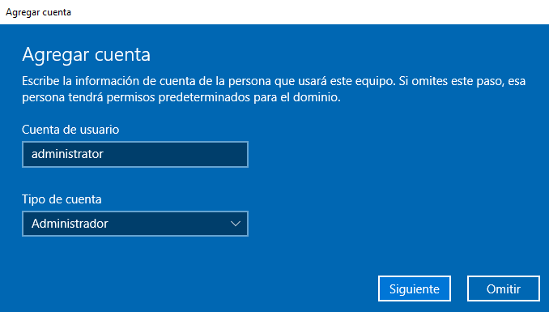

# 03 Unir Windows 10 al dominio

Vamos a unir nuestro equipo Windows 10 pero antes vamos a editar el nombre del equipo a w101 (Windows 10 - equipo 1). Para ello realizamos los siguientes pasos:



```bash
C:\Users\usuario>whoami
w101\usuario
```

A continuación, vamos a añadir un nuevo equipo al dominio de la siguiente forma.




Una vez reiniciado el equipo podemos comprobar que en samba tenemos un nuevo equipo conectado y podemos proceder a conectarnos con un usuario existente.

```bash
root@dc:~# samba-tool computer list
W101$
DC$
```

Llegados a este punto podemos acceder con el usuario alumno anteriormente creado.

```bash
root@dc:~# samba-tool user list
alumno
Guest
Administrator
krbtgt
```


