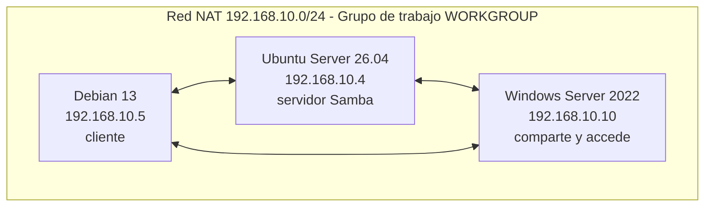

# Samba

## Índice

1. [¿Qué es Samba?](#1-qué-es-samba)
   - [1.1. Componentes y paquetes](#11-componentes-y-paquetes)
2. [Escenario de la práctica](#2-escenario-de-la-práctica)
3. [Instalación y configuración inicial del servidor Samba](#3-instalación-y-configuración-inicial-del-servidor-samba)
   - [3.1. Instalación de paquetes](#31-instalación-de-paquetes)
   - [3.2. El fichero smb.conf y el grupo de trabajo](#32-el-fichero-smbconf-y-el-grupo-de-trabajo)
   - [3.3. Validación de la configuración con testparm](#33-validación-de-la-configuración-con-testparm)
   - [3.4. Servicios y visibilidad en la red](#34-servicios-y-visibilidad-en-la-red)
4. [Compartir una carpeta desde Windows Server](#4-compartir-una-carpeta-desde-windows-server)
   - [4.1. Preparación de Windows Server](#41-preparación-de-windows-server)
   - [4.2. Compartir la carpeta](#42-compartir-la-carpeta)
   - [4.3. Acceso desde el explorador de archivos de Linux](#43-acceso-desde-el-explorador-de-archivos-de-linux)
   - [4.4. Acceso desde la línea de comandos con smbclient](#44-acceso-desde-la-línea-de-comandos-con-smbclient)
   - [4.5. Montaje del recurso con mount -t cifs](#45-montaje-del-recurso-con-mount--t-cifs)
5. [Compartir una carpeta desde el servidor Linux](#5-compartir-una-carpeta-desde-el-servidor-linux)
   - [5.1. Crear el grupo y la carpeta compartida](#51-crear-el-grupo-y-la-carpeta-compartida)
   - [5.2. Crear el usuario de Samba](#52-crear-el-usuario-de-samba)
   - [5.3. Declarar el recurso en smb.conf](#53-declarar-el-recurso-en-smbconf)
   - [5.4. Validar y aplicar la configuración](#54-validar-y-aplicar-la-configuración)
   - [5.5. Acceso desde Windows Server](#55-acceso-desde-windows-server)
6. [Ampliación: compartir con los usuarios del directorio LDAP](#6-ampliación-compartir-con-los-usuarios-del-directorio-ldap)
7. [Ejercicio 4.2](#7-ejercicio-42)

---

> **Convención de etiquetas usada en estos apuntes:**
>
> **SERVIDOR** — El paso se realiza en la máquina Ubuntu Server 26.04 LTS (`192.168.10.4`), que actuará como servidor Samba.
>
> **CLIENTE** — El paso se realiza en la máquina Debian 13 (`192.168.10.5`).
>
> **WINDOWS** — El paso se realiza en la máquina Windows Server 2022 (`192.168.10.10`).

---

## 1. ¿Qué es Samba?

**Samba** es la implementación libre para Linux del protocolo **SMB** (*Server Message Block*), el protocolo que utilizan los sistemas Windows para compartir archivos e impresoras en red. Gracias a Samba, un equipo Linux puede acceder a los recursos compartidos por máquinas Windows y, a la vez, compartir sus propios recursos con ellas, integrándose de forma transparente en una red mixta.

La forma más sencilla de uso con Samba es un **grupo de trabajo**. En dicha configuración, cada equipo puede actuar a la vez como servidor (compartiendo recursos) y como cliente (accediendo a recursos de otras máquinas).

> **Nota:** El grupo de trabajo es un modelo entre iguales: no hay un servidor central que administre usuarios y permisos, sino que cada equipo gestiona los suyos. Es el modelo opuesto al dominio que se estudiará con Windows Server en las unidades siguientes.

> **Recuerda:** En la unidad anterior se compartieron ficheros entre equipos Linux con **NFS**. Samba resuelve el mismo problema, pero hablando el idioma de Windows. La regla general es utilizar cada protocolo con sus clientes naturales: NFS entre sistemas Unix/Linux y SMB cuando hay equipos Windows de por medio.

### 1.1. Componentes y paquetes

Una confusión habitual al empezar con Samba es no distinguir qué paquete hace falta para cada cosa. En Linux, el papel de cliente y el de servidor los cubren paquetes distintos:

| Paquete | Función | ¿Cuándo se necesita? |
|---|---|---|
| `samba` | Servidor: instala los demonios `smbd` y `nmbd` | Solo si la máquina Linux va a **compartir** carpetas |
| `smbclient` | Cliente de línea de comandos, similar a un cliente FTP | Para explorar y acceder a recursos ajenos desde el terminal |
| `cifs-utils` | Utilidades para **montar** recursos SMB en el árbol de directorios | Para integrar una carpeta de Windows como un directorio local |
| `gvfs-backends` | Soporte de `smb://` en el explorador de archivos gráfico | Solo en equipos con entorno de escritorio |

El servidor Samba levanta dos demonios con responsabilidades diferentes:

- **`smbd`**: sirve los ficheros y las impresoras, y gestiona la autenticación de los usuarios. Es el que hace el trabajo real y escucha en el puerto **445/TCP**.
- **`nmbd`**: se encarga de la resolución de nombres NetBIOS y del anuncio del equipo en el grupo de trabajo.

> **Importante:** Un equipo que solo vaya a **acceder** a recursos ajenos no necesita instalar el paquete `samba`: le basta con `smbclient` y `cifs-utils`. Instalar el servidor completo en todos los equipos del aula es un error frecuente que expone servicios innecesarios.

---

## 2. Escenario de la práctica

Esta práctica parte de la **instantánea del escenario LDAP** creada al terminar la unidad anterior, antes de montar NFS y los perfiles móviles. Se reutilizan las mismas máquinas y el mismo direccionamiento, y se añade el Windows Server instalado en la UD1:

| Equipo | Sistema | IP | Papel en la práctica |
|---|---|---|---|
| `ldap.ies.local` | Ubuntu Server 26.04 LTS | `192.168.10.4` | Servidor Samba: comparte una carpeta con la red |
| `cliente` | Debian 13 | `192.168.10.5` | Equipo Linux que accede a los recursos compartidos |
| `WS2022` | Windows Server 2022 | `192.168.10.10` | Equipo Windows: comparte una carpeta y accede a la del servidor Linux |

Todos los equipos pertenecen al grupo de trabajo `WORKGROUP` y se encuentran en la misma red NAT:



> **Snapshot:** Antes de empezar, restaurar en el servidor y en el cliente la instantánea tomada al finalizar la práctica de LDAP. De este modo se parte de un sistema con el directorio funcionando pero sin los montajes NFS de los perfiles móviles, que no intervienen aquí.

> **Nota:** El Windows Server se utiliza **sin promover a controlador de dominio**, tal y como quedó tras su instalación. En un grupo de trabajo, un Windows Server comparte carpetas exactamente igual que un Windows cliente: los diálogos y el protocolo son los mismos. La configuración del dominio y del Directorio Activo se abordará en las unidades siguientes.

Antes de instalar nada, comprobar que las tres máquinas se ven entre sí. La mayoría de los problemas que aparecen más adelante en esta práctica tienen su origen en un fallo de red que podría haberse detectado aquí:

```bash
root@ldap:~# ping -c 2 192.168.10.5
root@ldap:~# ping -c 2 192.168.10.10
```

```text
C:\Users\Administrador> ping 192.168.10.4
```

> **Nota:** Si el Windows Server no responde al `ping` desde Linux, no significa necesariamente que la red falle: el firewall de Windows bloquea por defecto las peticiones de eco entrantes. Lo relevante es que el Windows sí alcance a las máquinas Linux y que, más adelante, responda en el puerto 445. Puede comprobarse la conectividad del servicio, una vez configurado, con `smbclient -L`.

---

## 3. Instalación y configuración inicial del servidor Samba

### 3.1. Instalación de paquetes

**SERVIDOR**

Instalar el servidor Samba junto con el cliente de línea de comandos, que resultará útil para las comprobaciones:

```bash
root@ldap:~# apt update && apt install samba smbclient -y
```

Comprobar que el binario del servidor está disponible y anotar la versión instalada desde los repositorios:

```bash
root@ldap:~# smbd --version
```

**CLIENTE**

En el equipo Debian, que solo va a acceder a recursos ajenos, basta con instalar el cliente y las utilidades de montaje:

```bash
root@cliente:~# apt update && apt install smbclient cifs-utils -y
```

> **Nota:** Si el cliente Debian dispone de entorno gráfico y se quiere acceder a los recursos desde el explorador de archivos escribiendo direcciones `smb://`, hay que instalar además el paquete `gvfs-backends`.

### 3.2. El fichero smb.conf y el grupo de trabajo

**SERVIDOR**

Toda la configuración de Samba se centraliza en `/etc/samba/smb.conf`. Es un fichero con formato `ini`: una sección `[global]` con los parámetros generales del servidor y, a continuación, una sección por cada recurso compartido.

Antes de modificarlo, hacer una copia de seguridad del fichero original, que viene ampliamente comentado y sirve de referencia:

```bash
root@ldap:~# cp -pv /etc/samba/smb.conf /etc/samba/smb.conf.ORIGINAL
'/etc/samba/smb.conf' -> '/etc/samba/smb.conf.ORIGINAL'
```

Editar el fichero y localizar en la sección `[global]` la directiva `workgroup`:

```bash
root@ldap:~# nano /etc/samba/smb.conf
```

```ini
[global]
   workgroup = WORKGROUP
   server string = Servidor Samba del IES
   security = user
```

| Directiva | Descripción |
|---|---|
| `workgroup` | Nombre del grupo de trabajo. Debe coincidir con el de los equipos Windows; el valor por defecto en Windows es `WORKGROUP` |
| `server string` | Descripción del servidor que se muestra al explorar la red |
| `security = user` | Modo de seguridad: cada usuario debe autenticarse con nombre y contraseña antes de acceder a ningún recurso. Es el valor por defecto y el recomendado |

> **Importante:** Para que los equipos se vean entre sí, todos deben compartir el mismo valor de `workgroup`. Puede consultarse el grupo de trabajo del equipo Windows ejecutando `systeminfo` o desde las propiedades del sistema.

### 3.3. Validación de la configuración con testparm

**SERVIDOR**

Antes de reiniciar el servicio conviene comprobar que el fichero de configuración no contiene errores. La herramienta `testparm` analiza `smb.conf`, informa de cualquier problema de sintaxis y muestra la configuración efectiva que aplicará el servidor:

```bash
root@ldap:~# testparm
Load smb config files from /etc/samba/smb.conf
Loaded services file OK.
Weak crypto is allowed by GnuTLS (e.g. NTLM as a compatibility fallback)

Server role: ROLE_STANDALONE

Press enter to see a dump of your service definitions
```

La línea `Loaded services file OK` confirma que la configuración es válida. Al pulsar `Intro` se muestra el detalle de las secciones y de todos los parámetros aplicados, incluidos los que tienen valor por defecto.

> **Importante:** `testparm` cumple con `smb.conf` la misma función que `mount -a` con `/etc/fstab`: detecta los errores **antes** de que provoquen un fallo del servicio. Debe ejecutarse siempre después de modificar la configuración y antes de reiniciar Samba.

### 3.4. Servicios y visibilidad en la red

**SERVIDOR**

Reiniciar los dos demonios de Samba para aplicar la configuración y comprobar su estado:

```bash
root@ldap:~# systemctl restart smbd nmbd
root@ldap:~# systemctl is-active smbd nmbd
active
active
```

Los sistemas Windows actuales ya no localizan los equipos de la red mediante NetBIOS, sino con el protocolo **WSD** (*Web Services Dynamic Discovery*). Por ese motivo, un servidor Samba correctamente configurado puede ser accesible por su dirección IP y, sin embargo, **no aparecer** en el apartado «Red» del explorador de Windows. La solución es instalar el servicio `wsdd`, que anuncia el equipo Linux mediante ese protocolo:

```bash
root@ldap:~# apt install wsdd -y
root@ldap:~# systemctl enable --now wsdd
```

> **Importante:** Sin `wsdd`, el equipo Linux no se mostrará al navegar por la red desde Windows aunque el recurso funcione perfectamente escribiendo su dirección. Es una de las causas más frecuentes de confusión en las prácticas de redes mixtas: el alumnado interpreta como un fallo de Samba algo que en realidad es una limitación del mecanismo de descubrimiento de Windows.

Comprobar por último qué está publicando el servidor. La opción `-L` de `smbclient` lista los recursos compartidos de un equipo:

```bash
root@ldap:~# smbclient -L //localhost -N

        Sharename       Type      Comment
        ---------       ----      -------
        print$          Disk      Printer Drivers
        IPC$            IPC       IPC Service (Servidor Samba del IES)
```

| Parámetro | Descripción |
|---|---|
| `-L` | Lista los recursos compartidos del servidor indicado |
| `//localhost` | Equipo a consultar; puede ser un nombre o una dirección IP |
| `-N` | No solicita contraseña (conexión anónima) |
| `-U usuario` | Realiza la consulta autenticándose como el usuario indicado |

> **Nota:** Los recursos `print$` e `IPC$` los crea Samba automáticamente: el primero almacena los controladores de impresión y el segundo es un canal interno de comunicación entre procesos. Todavía no hay ninguna carpeta compartida propia, algo que se resolverá en el punto 5.

---

## 4. Compartir una carpeta desde Windows Server

En este primer sentido de la comunicación, el equipo Windows actúa como servidor y los equipos Linux como clientes.

### 4.1. Preparación de Windows Server

**WINDOWS**

Comprobar en primer lugar la configuración de red del servidor Windows, que debe tener la dirección estática `192.168.10.10`:

```text
C:\Users\Administrador> ipconfig /all
```

Windows Server llega con la detección de redes y el uso compartido desactivados por seguridad. Para habilitarlos, acceder al **Centro de redes y recursos compartidos > Cambiar configuración de uso compartido avanzado** y activar, en el perfil de red **Privado**:

- Activar la detección de redes.
- Activar el uso compartido de archivos e impresoras.

> **Advertencia:** En muchos manuales se resuelve este paso desactivando por completo el firewall de Windows. Es una mala práctica que no debe adquirirse como costumbre: al activar el uso compartido de archivos e impresoras, Windows habilita automáticamente las reglas de firewall necesarias para el protocolo SMB (puerto 445/TCP), que es exactamente lo que se necesita y nada más.

### 4.2. Compartir la carpeta

**WINDOWS**

Crear una carpeta en el disco, por ejemplo `C:\CompartidaWS`, hacer clic con el botón derecho sobre ella y seleccionar **Propiedades > pestaña Compartir > Uso compartido avanzado**. Marcar **Compartir esta carpeta** y, en **Permisos**, conceder los permisos adecuados al usuario `Administrador`.

Crear dentro de la carpeta un fichero de texto que servirá para comprobar el acceso desde los equipos Linux.

> **Recuerda:** En Windows conviven dos niveles de permisos que deben ser coherentes entre sí: los **permisos del recurso compartido** (pestaña Compartir) y los **permisos NTFS** del sistema de ficheros (pestaña Seguridad). El acceso efectivo de un usuario es el más restrictivo de los dos. Si un recurso parece accesible pero devuelve un error al abrirlo, casi siempre es porque los permisos NTFS no lo permiten.

### 4.3. Acceso desde el explorador de archivos de Linux

**CLIENTE**

Desde un equipo Linux con entorno gráfico, en el explorador de archivos se accede mediante **Otras ubicaciones**, escribiendo la dirección del equipo Windows con el esquema `smb://`:

```text
smb://192.168.10.10
```

El sistema solicitará las credenciales de un usuario **del equipo Windows** (por ejemplo, `Administrador`), el dominio o grupo de trabajo (`WORKGROUP`) y la contraseña. Una vez autenticado, se mostrarán los recursos que publica el equipo Windows y podrá abrirse la carpeta compartida.

> **Nota:** Junto a la carpeta compartida aparecerán otros recursos como `ADMIN$`, `C$` o `IPC$`. Son comparticiones administrativas que Windows crea automáticamente; el símbolo `$` final hace que permanezcan ocultas al explorar la red desde otro equipo Windows.

### 4.4. Acceso desde la línea de comandos con smbclient

**CLIENTE**

En un servidor sin entorno gráfico, el acceso se realiza desde el terminal. El primer paso es siempre listar los recursos disponibles:

```bash
root@cliente:~# smbclient -L //192.168.10.10 -U Administrador
Password for [WORKGROUP\Administrador]:

        Sharename       Type      Comment
        ---------       ----      -------
        ADMIN$          Disk      Admin remota
        C$              Disk      Recurso predeterminado
        CompartidaWS    Disk
        IPC$            IPC       IPC remota
```

Una vez identificado el nombre del recurso, se abre una sesión interactiva contra él:

```bash
root@cliente:~# smbclient //192.168.10.10/CompartidaWS -U Administrador
Password for [WORKGROUP\Administrador]:
Try "help" to get a list of possible commands.
smb: \>
```

Dentro de la sesión se dispone de un conjunto de comandos muy similar al de un cliente FTP:

```bash
smb: \> dir
  .                                   D        0  Wed Aug 20 10:14:22 2026
  ..                                  D        0  Wed Aug 20 10:14:22 2026
  documento.txt                       A       48  Wed Aug 20 10:15:03 2026

smb: \> get documento.txt
getting file \documento.txt of size 48 as documento.txt
smb: \> exit
```

| Comando | Descripción |
|---|---|
| `dir` | Lista el contenido del directorio actual del recurso |
| `cd` | Cambia de directorio dentro del recurso |
| `get fichero` | Descarga un fichero del recurso al directorio local |
| `put fichero` | Sube un fichero local al recurso |
| `help` | Muestra la lista completa de comandos disponibles |
| `exit` | Cierra la sesión |

> **Nota:** `smbclient` no monta el recurso: descarga y sube ficheros de uno en uno, igual que un cliente FTP. Para trabajar con la carpeta como si fuera parte del sistema de ficheros local hay que montarla, como se ve a continuación.

### 4.5. Montaje del recurso con mount -t cifs

**CLIENTE**

Crear un punto de montaje y montar el recurso indicando el tipo de sistema de ficheros `cifs`:

```bash
root@cliente:~# mkdir -p /mnt/windows
root@cliente:~# mount -t cifs //192.168.10.10/CompartidaWS /mnt/windows -o username=Administrador,vers=3.0
Password for Administrador@//192.168.10.10/CompartidaWS:
```

| Opción | Descripción |
|---|---|
| `-t cifs` | Tipo de sistema de ficheros. CIFS es el nombre histórico del protocolo SMB, que se conserva en el módulo del núcleo y en el paquete `cifs-utils` |
| `username=` | Usuario del equipo Windows con el que se realiza la conexión |
| `vers=3.0` | Versión del protocolo SMB que se negocia con el servidor |
| `uid=`, `gid=` | Usuario y grupo locales a los que se asignarán los ficheros del recurso montado |

Comprobar el montaje y el acceso al contenido:

```bash
root@cliente:~# df -Th | grep cifs
//192.168.10.10/CompartidaWS  cifs   60G   12G   48G  20% /mnt/windows

root@cliente:~# ls -l /mnt/windows/
total 1
-rwxr-xr-x 1 root root 48 ago 20 10:15 documento.txt
```

> **Advertencia:** La versión 1 del protocolo (**SMB1**) está desactivada por inseguridad en todos los Windows actuales: fue el vector de propagación del ransomware *WannaCry*. Si un montaje falla con un error de protocolo, la solución nunca es reactivar SMB1 en Windows, sino especificar una versión moderna con `vers=3.0` (o `vers=2.1` en sistemas más antiguos).

> **Nota:** Este montaje es temporal y se pierde al reiniciar. Puede hacerse permanente declarándolo en `/etc/fstab`, igual que se hizo con NFS; en ese caso, la contraseña nunca debe escribirse en `fstab` —que es legible por todos los usuarios— sino en un fichero de credenciales aparte con permisos `600`, referenciado con la opción `credentials=`.

---

## 5. Compartir una carpeta desde el servidor Linux

En el sentido contrario, el servidor Linux publica una carpeta y el equipo Windows accede a ella. Este es el escenario más habitual en un centro educativo: un servidor Linux que da servicio a los equipos del aula.

### 5.1. Crear el grupo y la carpeta compartida

**SERVIDOR**

En lugar de abrir la carpeta a todo el mundo, se creará un **grupo dedicado** al que pertenecerán los usuarios autorizados. Este planteamiento permite conceder o retirar el acceso simplemente añadiendo o quitando usuarios del grupo:

```bash
root@ldap:~# groupadd sambausers
```

Crear la carpeta que se va a compartir. Se utiliza `/srv`, que es el directorio previsto por el estándar de jerarquía del sistema de ficheros para los datos servidos por los servicios del equipo:

```bash
root@ldap:~# mkdir -p /srv/samba/compartida
```

Asignar el grupo y los permisos:

```bash
root@ldap:~# chgrp -R sambausers /srv/samba/compartida
root@ldap:~# chmod 2770 /srv/samba/compartida
root@ldap:~# ls -ld /srv/samba/compartida
drwxrws--- 2 root sambausers 4096 ago 20 11:02 /srv/samba/compartida
```

| Dígito de `2770` | Significado |
|---|---|
| `2` | Bit **SETGID**: los ficheros y carpetas que se creen dentro heredan automáticamente el grupo `sambausers`, de modo que todos los miembros pueden trabajar sobre ellos |
| `7` | El propietario (`root`) tiene control total |
| `7` | El grupo `sambausers` puede leer, escribir y entrar en el directorio |
| `0` | El resto de usuarios del sistema no tiene ningún acceso |

> **Importante:** Los permisos del sistema de ficheros y los de Samba actúan en cascada, y el acceso efectivo es el más restrictivo de los dos. Un error muy frecuente es declarar el recurso con `read only = no` y no poder escribir en él: si los permisos Unix del directorio no autorizan al usuario, Samba tampoco lo hará por mucho que su configuración lo permita.

> **Advertencia:** Debe evitarse la receta, muy extendida en tutoriales, de resolver los problemas de acceso con `chmod 777`. Deja la carpeta abierta a cualquier usuario del sistema, incluidos los procesos de servicios que no deberían tocarla, y oculta el verdadero origen del problema en lugar de corregirlo.

### 5.2. Crear el usuario de Samba

**SERVIDOR**

Samba mantiene su **propia base de datos de contraseñas** (`tdbsam`), independiente de la del sistema. Sin embargo, todo usuario de Samba debe existir también como usuario del sistema, porque es de ahí de donde se obtienen el UID y el GID con los que se accede a los ficheros.

Crear la cuenta del sistema. Como se trata de un usuario que solo va a acceder por red, no necesita ni directorio personal ni posibilidad de iniciar sesión interactiva:

```bash
root@ldap:~# useradd -M -s /usr/sbin/nologin -G sambausers usuariosmb
```

| Parámetro | Descripción |
|---|---|
| `-M` | No crea directorio personal: el usuario no va a iniciar sesión en el equipo |
| `-s /usr/sbin/nologin` | Asigna una shell que impide el inicio de sesión interactivo |
| `-G sambausers` | Añade el usuario al grupo con acceso a la carpeta compartida |

> **Importante:** Limitar la cuenta de este modo es una medida de seguridad básica. Un usuario creado únicamente para compartir ficheros no debe poder abrir una sesión en el servidor ni por consola ni por SSH.

Asignar a continuación la contraseña **de Samba**, que se almacena en su base de datos propia:

```bash
root@ldap:~# smbpasswd -a usuariosmb
New SMB password:
Retype new SMB password:
Added user usuariosmb.
```

| Parámetro | Descripción |
|---|---|
| `-a` | Añade el usuario a la base de datos de Samba y establece su contraseña |
| `-e` | Habilita una cuenta previamente deshabilitada |
| `-d` | Deshabilita una cuenta sin borrarla |
| `-x` | Elimina el usuario de la base de datos de Samba |

Comprobar que el usuario figura en la base de datos de Samba. La salida muestra el nombre de usuario seguido de su UID en el sistema, cuyo valor concreto dependerá de las cuentas creadas previamente en el servidor:

```bash
root@ldap:~# pdbedit -L
usuariosmb:1001:
```

> **Importante:** La contraseña de Samba y la contraseña del sistema son **independientes**: cambiar una no modifica la otra. Un usuario que exista en el sistema pero no haya sido dado de alta con `smbpasswd -a` recibirá siempre un error de acceso denegado, por muy correctos que sean los permisos de la carpeta.

### 5.3. Declarar el recurso en smb.conf

**SERVIDOR**

Añadir al final del fichero de configuración la sección que define el recurso compartido:

```bash
root@ldap:~# nano /etc/samba/smb.conf
```

```ini
[compartida]
   comment = Carpeta compartida del servidor Linux
   path = /srv/samba/compartida
   browseable = yes
   read only = no
   valid users = @sambausers
   create mask = 0660
   directory mask = 2770
```

| Directiva | Descripción |
|---|---|
| `[compartida]` | Nombre con el que el recurso se verá en la red: `\\192.168.10.4\compartida` |
| `comment` | Descripción que se muestra al listar los recursos del servidor |
| `path` | Ruta del directorio local que se publica |
| `browseable = yes` | El recurso aparece al explorar el servidor desde la red. Con `no` seguiría siendo accesible escribiendo su nombre, pero permanecería oculto |
| `read only = no` | Permite la escritura en el recurso |
| `valid users = @sambausers` | Solo los miembros del grupo `sambausers` pueden acceder. El símbolo `@` indica que se trata de un grupo y no de un usuario |
| `create mask = 0660` | Permisos con los que se crean los ficheros nuevos: lectura y escritura para propietario y grupo |
| `directory mask = 2770` | Permisos de las carpetas nuevas, conservando el bit SETGID para que hereden el grupo |

> **Nota:** Sin la directiva `valid users`, cualquier usuario dado de alta en Samba podría acceder al recurso. Restringir el acceso a un grupo concreto es la forma correcta de controlar quién entra, y permite gestionar los permisos añadiendo o quitando usuarios del grupo sin volver a tocar la configuración.

### 5.4. Validar y aplicar la configuración

**SERVIDOR**

Comprobar que la nueva sección no contiene errores antes de reiniciar el servicio:

```bash
root@ldap:~# testparm
Load smb config files from /etc/samba/smb.conf
Loaded services file OK.

Server role: ROLE_STANDALONE
```

Aplicar la configuración recargando el servicio:

```bash
root@ldap:~# systemctl restart smbd nmbd
```

Verificar desde el propio servidor que el recurso ya se publica:

```bash
root@ldap:~# smbclient -L //localhost -U usuariosmb
Password for [WORKGROUP\usuariosmb]:

        Sharename       Type      Comment
        ---------       ----      -------
        print$          Disk      Printer Drivers
        compartida      Disk      Carpeta compartida del servidor Linux
        IPC$            IPC       IPC Service (Servidor Samba del IES)
```

> **Nota:** Es buena práctica comprobar el recurso desde el propio servidor antes de intentar el acceso desde Windows. Si aquí no aparece, el problema está en la configuración de Samba; si aparece aquí pero no desde Windows, el problema está en la red, en el firewall o en las credenciales.

### 5.5. Acceso desde Windows Server

**WINDOWS**

Desde el equipo Windows, abrir el cuadro de diálogo **Ejecutar** (`Windows + R`) e introducir la ruta de red del recurso, utilizando la dirección del servidor Linux y el nombre del recurso:

```text
\\192.168.10.4\compartida
```

Windows solicitará las credenciales. Deben introducirse las del usuario **de Samba** creado en el punto 5.2 (`usuariosmb`) con la contraseña asignada con `smbpasswd`. Tras autenticarse, el explorador mostrará el contenido de la carpeta compartida por el servidor Linux.

Crear un fichero desde Windows dentro del recurso y comprobar en el servidor Linux que se ha escrito con el usuario y el grupo esperados:

```bash
root@ldap:~# ls -l /srv/samba/compartida/
total 4
-rw-rw---- 1 usuariosmb sambausers 26 ago 20 11:20 desde_windows.txt
```

El fichero pertenece a `usuariosmb` porque es el usuario con el que se autenticó la conexión, y al grupo `sambausers` gracias al bit SETGID del directorio. Los permisos `0660` son los que impuso la directiva `create mask`.

> **Advertencia:** Si el acceso se deniega, la causa habitual es una de estas tres: el usuario no ha sido dado de alta con `smbpasswd -a`, no pertenece al grupo indicado en `valid users`, o los permisos Unix del directorio no le autorizan. Algunos manuales recomiendan habilitar en `gpedit.msc` la directiva *Habilitar inicios de sesión de invitado no seguros*; conviene saber que **esa opción solo afecta a los accesos sin credenciales** y no resuelve nada cuando se está iniciando sesión con un usuario y una contraseña válidos, además de rebajar la seguridad del cliente SMB de Windows.

Para que el recurso quede disponible de forma permanente en Windows, puede asignarse una letra de unidad desde el explorador con **Este equipo > Conectar a unidad de red**, indicando la misma ruta y marcando la opción de conectar de nuevo al iniciar sesión.

---

## 6. Ampliación: compartir con los usuarios del directorio LDAP

Hasta aquí, el acceso al recurso lo controla un usuario local del servidor. En un centro con decenas de alumnos, crear una cuenta Samba local por persona sería tan poco práctico como crear cuentas locales en cada equipo, que es precisamente el problema que resolvió LDAP en la unidad anterior.

Samba puede utilizar como usuarios **las cuentas que el sistema resuelve a través de NSS**, incluidas las que provienen de LDAP. Para ello, el servidor Ubuntu debe convertirse también en cliente del directorio, igual que se hizo con el equipo Debian.

**SERVIDOR**

Instalar los paquetes de SSSD:

```bash
root@ldap:~# apt install sssd sssd-ldap libnss-sss libpam-sss -y
```

Crear el fichero de configuración de SSSD apuntando al directorio local, con los permisos estrictos que exige el servicio:

```bash
root@ldap:~# nano /etc/sssd/sssd.conf
```

```ini
[sssd]
domains = ies.local
services = nss, pam
config_file_version = 2

[domain/ies.local]
id_provider = ldap
auth_provider = ldap
ldap_uri = ldap://192.168.10.4
ldap_search_base = dc=ies,dc=local
ldap_schema = rfc2307
ldap_user_search_base = ou=usuarios,dc=ies,dc=local
ldap_group_search_base = ou=grupos,dc=ies,dc=local
cache_credentials = true
ldap_auth_disable_tls_never_use_in_production = true
```

```bash
root@ldap:~# chmod 600 /etc/sssd/sssd.conf
root@ldap:~# chown root:root /etc/sssd/sssd.conf
root@ldap:~# systemctl enable --now sssd
```

Añadir `sss` como fuente adicional en las líneas de `/etc/nsswitch.conf` que resuelven usuarios y grupos:

```bash
root@ldap:~# nano /etc/nsswitch.conf
```

```text
passwd:         files systemd sss
group:          files systemd sss
shadow:         files systemd sss
```

Comprobar que el servidor ya resuelve los usuarios del directorio:

```bash
root@ldap:~# getent passwd a.garcia
a.garcia:x:10001:10000:Ana Garcia Lopez:/home/alumnos/a.garcia:/bin/bash
```

> **Recuerda:** El orden `files sss` es importante: el sistema consulta primero los ficheros locales y solo después el directorio, garantizando que `root` y las cuentas del sistema se resuelvan siempre localmente aunque LDAP no esté disponible.

A partir de este momento, los usuarios de LDAP pueden darse de alta en Samba igual que cualquier usuario local:

```bash
root@ldap:~# smbpasswd -a a.garcia
New SMB password:
Retype new SMB password:
Added user a.garcia.
```

Para conceder acceso al recurso a todo un curso, basta con indicar su grupo del directorio en la directiva `valid users`:

```ini
   valid users = @sambausers, @SMR1
```

```bash
root@ldap:~# testparm
root@ldap:~# systemctl restart smbd
```

> **Importante:** Con esta configuración, la **identidad** del usuario (su nombre, su UID y sus grupos) procede de LDAP, pero la **contraseña de Samba** sigue guardándose en la base de datos local de Samba y es independiente de la contraseña LDAP. Es decir, el alumno tendría dos contraseñas distintas: una para iniciar sesión en los equipos y otra para acceder a los recursos compartidos.

> **Nota:** Unificar ambas contraseñas exige que Samba comparta el almacén de credenciales con el directorio, algo que hoy se resuelve configurando Samba como controlador de dominio de Active Directory en lugar de con OpenLDAP. Es el planteamiento que se estudiará en las unidades dedicadas a Windows Server, donde el propio directorio se encarga de la autenticación SMB.

---

## 7. Ejercicio 4.2

> **Importante:** El retraso sobre la fecha estimada de entrega supone la anulación de la misma.

Partiendo de la instantánea del escenario LDAP y de la máquina Windows Server instalada en la UD1, configura la compartición de recursos en una red mixta. En todo el ejercicio se deben realizar las pertinentes capturas de pantalla que justifiquen cada uno de los pasos.

El ejercicio debe realizarse en un documento que posteriormente debe ser convertido a formato `.pdf`, con el nombre `sambatunombretusapellidos.pdf`.

El documento debe constar de los siguientes elementos:

- Portada con el nombre del alumno, asignatura y curso.
- Índice de contenidos autogenerado.
- Índice de figuras autogenerado.
- Contenido propiamente dicho justificado con las capturas de pantalla.
- Bibliografía y referencias.

Pasos a realizar:

- a) Instala Samba en el servidor Linux y configura el grupo de trabajo. Valida la configuración con `testparm` e incluye su salida.
- b) Comparte una carpeta desde el Windows Server y accede a ella desde el equipo Linux de tres formas distintas: explorador de archivos, `smbclient` y montaje con `mount -t cifs`. Explica la diferencia entre las tres.
- c) Crea en el servidor Linux un grupo `sambausers`, una carpeta compartida con permisos `2770` y un usuario de Samba que no pueda iniciar sesión interactiva. Justifica cada una de las opciones empleadas.
- d) Declara el recurso en `smb.conf` restringiendo el acceso al grupo mediante `valid users`, y accede a él desde el Windows Server.
- e) Crea un fichero desde Windows en el recurso compartido y comprueba en el servidor Linux con qué usuario, grupo y permisos se ha creado. Explica por qué son esos y no otros.
- f) Como ampliación, configura el servidor para que resuelva los usuarios del directorio LDAP y concede acceso al recurso a un grupo de curso. Explica qué contraseña se utiliza en cada caso.

**Ponderación de la corrección:**

| Apartado | Puntuación |
|---|---|
| a) Instalación y configuración inicial validada | 1 punto |
| b) Acceso al recurso de Windows por los tres métodos | 1,75 puntos |
| c) Grupo, carpeta y usuario de Samba correctamente creados | 1,5 puntos |
| d) Recurso declarado y accesible desde Windows | 1,5 puntos |
| e) Análisis de propietario, grupo y permisos del fichero creado | 0,75 puntos |
| f) Ampliación con usuarios del directorio LDAP | 1 punto |
| Limpieza, orden y claridad | 2,5 puntos |
| **Total** | **10 puntos** |
