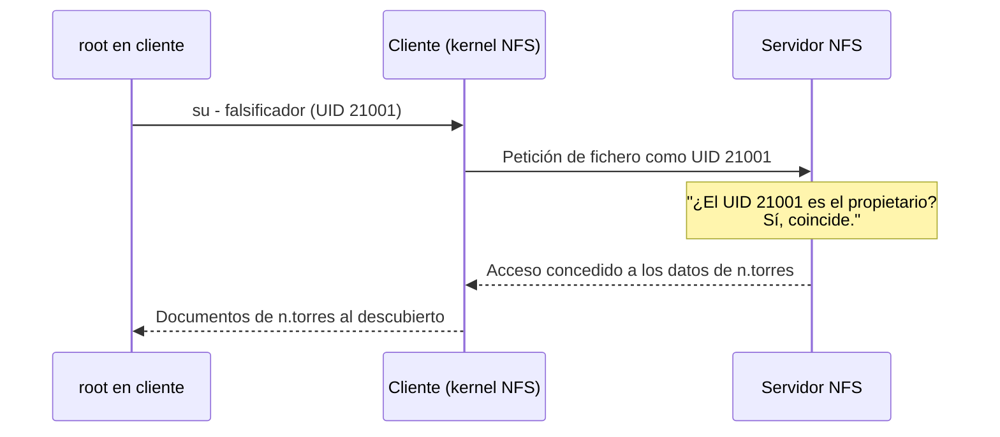
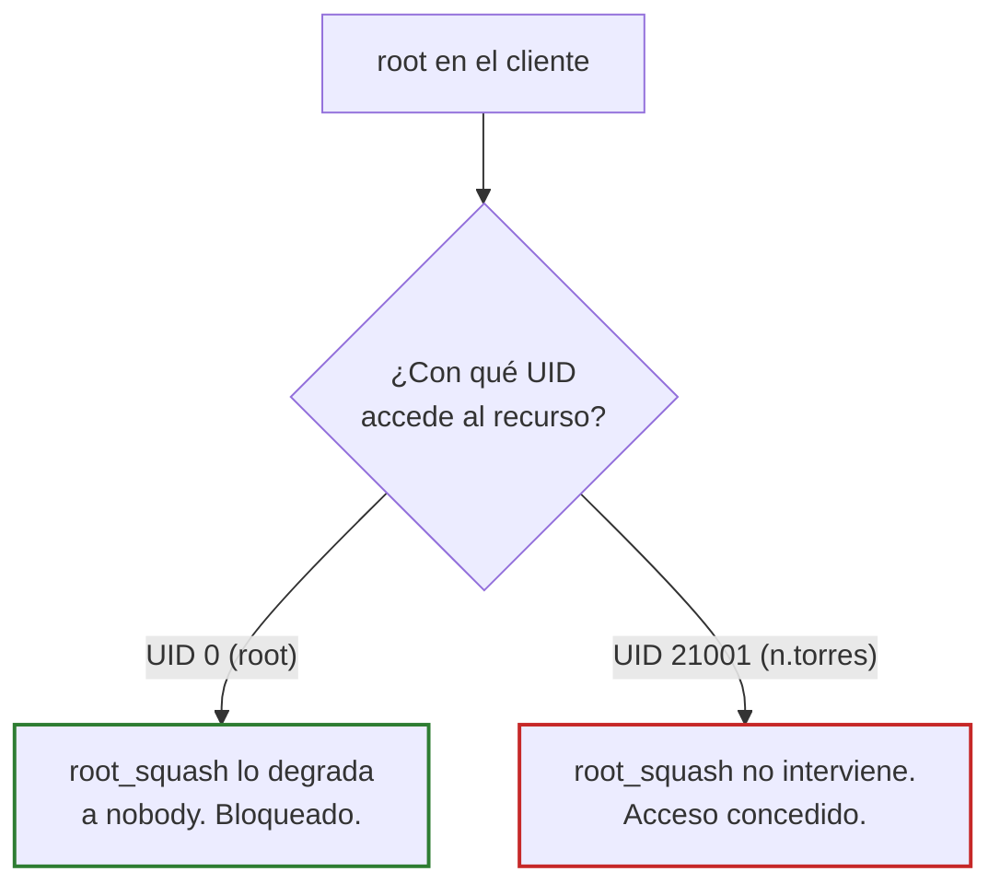
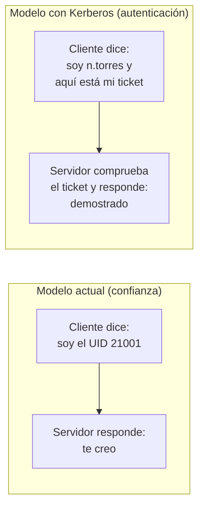
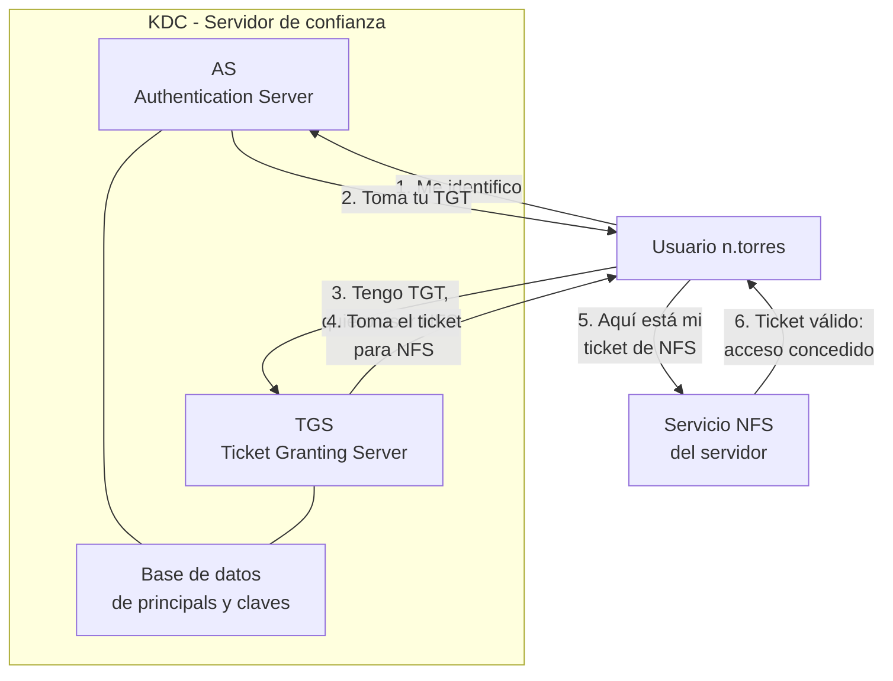
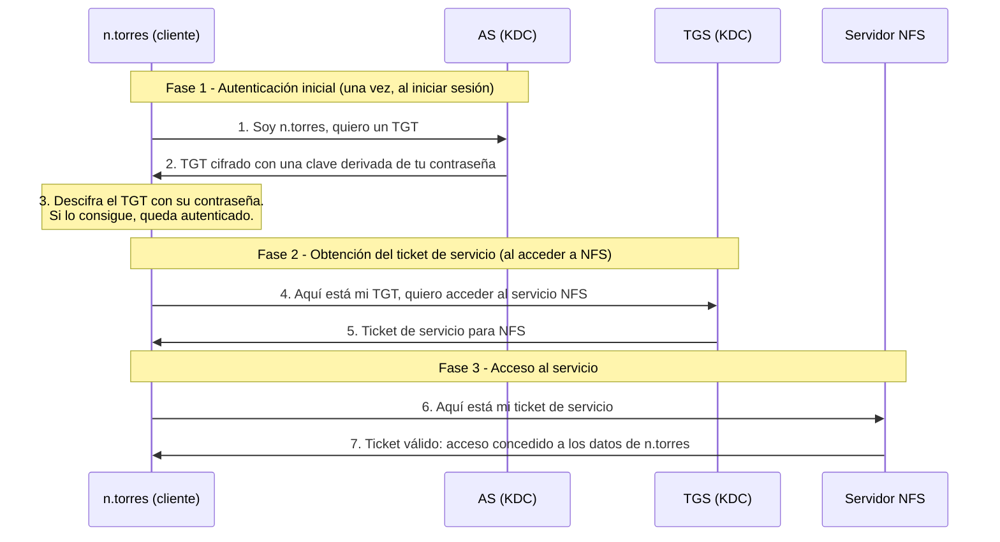
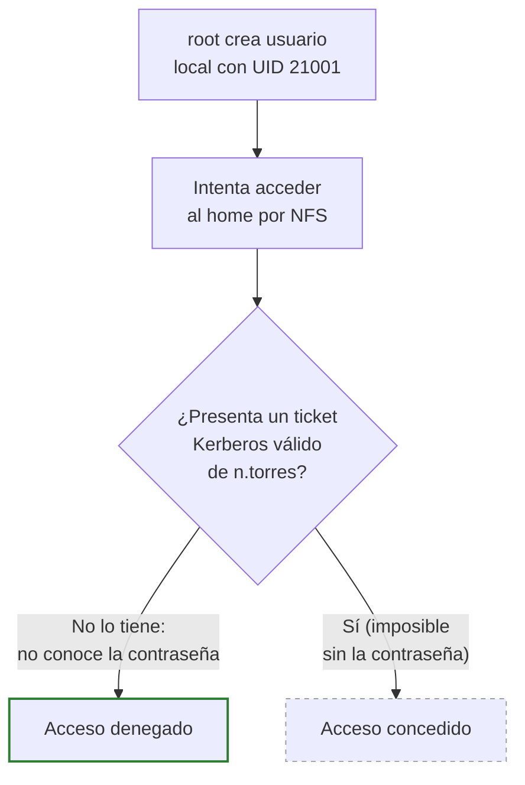
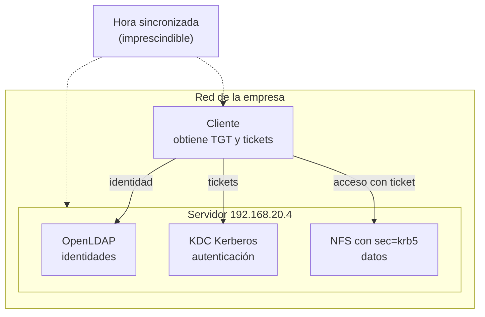
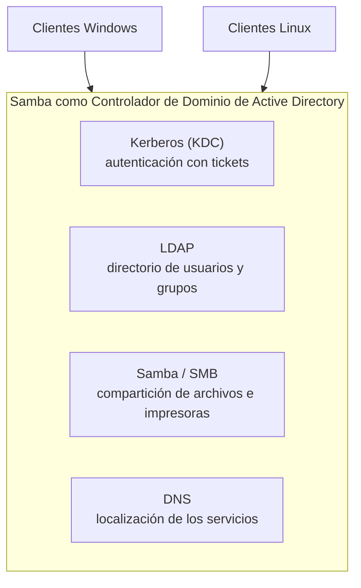

# Seguridad del escenario LDAP + NFS y solución con Kerberos

## Índice

1. [Introducción: un escenario que funciona no es un escenario seguro](#1-introducción-un-escenario-que-funciona-no-es-un-escenario-seguro)
2. [Debilidades de nuestra infraestructura](#2-debilidades-de-nuestra-infraestructura)
   - [2.1. Suplantación de identidad por UID (la más grave)](#21-suplantación-de-identidad-por-uid-la-más-grave)
     - [Demostración: suplantar a la alumna a.garcia](#demostración-suplantar-a-la-alumna-agarcia)
   - [2.2. Por qué root_squash no protege de esto](#22-por-qué-root_squash-no-protege-de-esto)
   - [2.3. Tráfico sin cifrar](#23-tráfico-sin-cifrar)
   - [2.4. Confianza en la dirección IP del cliente](#24-confianza-en-la-dirección-ip-del-cliente)
   - [2.5. LDAP sin TLS](#25-ldap-sin-tls)
   - [2.6. Resumen de debilidades](#26-resumen-de-debilidades)
3. [La raíz del problema: autenticar frente a confiar](#3-la-raíz-del-problema-autenticar-frente-a-confiar)
4. [¿Qué es Kerberos?](#4-qué-es-kerberos)
   - [4.1. La idea central](#41-la-idea-central)
   - [4.2. Componentes](#42-componentes)
   - [4.3. Cómo funciona: tickets y el KDC](#43-cómo-funciona-tickets-y-el-kdc)
   - [4.4. El flujo completo paso a paso](#44-el-flujo-completo-paso-a-paso)
5. [Kerberos aplicado a nuestro NFS](#5-kerberos-aplicado-a-nuestro-nfs)
   - [5.1. Los niveles de seguridad de NFSv4](#51-los-niveles-de-seguridad-de-nfsv4)
   - [5.2. Cómo se frena el ataque de suplantación](#52-cómo-se-frena-el-ataque-de-suplantación)
   - [5.3. Piezas necesarias en el despliegue](#53-piezas-necesarias-en-el-despliegue)
6. [La solución integrada: Samba como controlador de dominio de Active Directory](#6-la-solución-integrada-samba-como-controlador-de-dominio-de-active-directory)
7. [Conclusión](#7-conclusión)

---

## 1. Introducción: un escenario que funciona no es un escenario seguro

A lo largo de esta unidad se ha construido una infraestructura completa: un servidor con **OpenLDAP** que centraliza las identidades, **NFS** que sirve los directorios personales y los **perfiles móviles** que permiten a cada trabajador encontrar sus documentos en cualquier equipo. Todo funciona.

Sin embargo, que un sistema funcione no significa que sea seguro. El escenario que hemos montado es perfectamente válido para un **laboratorio o un aula controlada**, donde el administrador gobierna todas las máquinas y los usuarios no tienen privilegios de administrador. Pero contiene debilidades que lo hacen inadecuado para un entorno real sin protecciones adicionales.

Este documento analiza esas debilidades, empezando por la más grave, que permite a un atacante suplantar a cualquier usuario y explica cómo se corrige la principal mediante **Kerberos**.

> **Importante:** Entender estas debilidades no es un ejercicio teórico. Es lo que distingue montar un servicio de administrarlo con criterio. Un administrador de sistemas debe saber qué está confiando y en quién, porque de ello depende la protección de los datos que custodia.

---

## 2. Debilidades de nuestra infraestructura

### 2.1. Suplantación de identidad por UID (la más grave)

Como se estudió en los apuntes de NFS, este protocolo **no autentica a las personas: confía en números**. Cuando un cliente pide un fichero, lo que viaja por la red es el **UID** del usuario, no su identidad. El servidor comprueba únicamente si ese número coincide con el del propietario del fichero y, si coincide, concede el acceso. No verifica quién es realmente esa persona ni si el equipo desde el que llega la petición es de fiar.

Esto abre un ataque directo. El usuario `n.torres` tiene el UID 21001 y sus documentos están en el servidor. Si un atacante consigue privilegios de **root en cualquier equipo cliente** o conecta su propio portátil a la red, puede crear un usuario local con ese mismo UID:

```bash
root@atacante:~# useradd -u 21001 falsificador
root@atacante:~# su - falsificador
```

Ni siquiera necesita crear el usuario: como root puede convertirse directamente en cualquier UID. A partir de ese momento, cuando acceda al home montado por NFS, el servidor verá llegar peticiones con el UID 21001, las considerará legítimas y le dará **acceso completo a los documentos de `n.torres`**, tanto para leerlos como para modificarlos o borrarlos.



El problema de fondo es que **root, en su propia máquina, es dueño absoluto**: decide qué usuarios existen, qué UID tienen y como quién actúa cada proceso. Y NFS confía en lo que ese root le diga.

> **Advertencia:** Esta es la debilidad más importante del escenario. En una infraestructura NFS clásica, la seguridad de los datos de cada usuario depende por completo de que se confíe en el root de **todos** los equipos cliente. Basta con que un solo equipo se vea comprometido, o con que alguien conecte una máquina propia con root, para que todos los documentos de todos los trabajadores queden expuestos.

#### Demostración: suplantar a la alumna a.garcia

Veámoslo con un caso concreto. La alumna `a.garcia` (UID 10001, grupo SMR1 con GID 10000) ha trabajado en su equipo y ha guardado un fichero en su directorio personal:

```bash
a.garcia@cliente:~$ echo "Trabajo de SORE realizado en el cliente" > trabajo.txt
a.garcia@cliente:~$ ls -l
total 4
-rw------- 1 a.garcia SMR1 40 ago 19 18:20 trabajo.txt
a.garcia@cliente:~$ exit
```

Obsérvese que el fichero tiene permisos `-rw-------` (600): **solo su propietaria puede leerlo**. Ni el grupo ni el resto de usuarios tienen ningún acceso. En apariencia, el trabajo de `a.garcia` está protegido.

Sin embargo, un atacante con root en un equipo cliente puede saltarse esa protección por completo. En el servidor, el fichero pertenece al UID 10001, que es lo único que NFS comprueba:

```bash
root@ldap:~# ls -ln /home/alumnos/a.garcia/
total 4
-rw------- 1 10001 10000 40 ago 19 18:20 trabajo.txt
```

El atacante crea en su máquina un usuario local con **ese mismo UID** y se convierte en él:

```bash
root@debian:~# useradd -u 10001 -M -s /bin/bash intruso
useradd: el UID 10001 no es único
root@debian:~# useradd -o -u 10001 -M -s /bin/bash intruso
root@debian:~# passwd intruso
```

> **Nota:** El primer intento falla con `el UID 10001 no es único`, y el motivo es revelador: al comprobar si el UID está libre, `useradd` consulta **todas las fuentes de NSS**, incluida LDAP, y encuentra que el 10001 ya pertenece a `a.garcia`. Es la misma agregación de fuentes (`files sss`) configurada en `/etc/nsswitch.conf`. La opción `-o` (*non-unique*) fuerza la creación permitiendo un UID duplicado. En el equipo propio de un atacante, que no está unido al dominio, el UID 10001 estaría libre y el comando funcionaría sin `-o`: que la máquina integrada avise y la ajena no, ilustra el problema de fondo.

A partir de aquí, para NFS ese usuario **es** `a.garcia`, porque comparte su UID. El atacante accede al home montado y lee sin ninguna dificultad el fichero que los permisos `600` deberían proteger:

```bash
root@debian:~# su - intruso
su: atención: no se puede cambiar el directorio a /home/intruso: No existe el fichero o el directorio
intruso@debian:/root$ cd /home/alumnos/a.garcia/
intruso@debian:/home/alumnos/a.garcia$ ls
Descargas   Escritorio  Música      Público      Vídeos
Documentos  Imágenes    Plantillas  trabajo.txt
intruso@debian:/home/alumnos/a.garcia$ cat trabajo.txt
Trabajo de SORE realizado en el cliente
```

Y no solo puede leerlo: al ser considerado el propietario, también puede **modificarlo o borrarlo**:

```bash
intruso@atacante:~$ echo "Contenido manipulado por el intruso" > trabajo.txt
```

La alumna `a.garcia`, al volver a iniciar sesión en su equipo, encontraría su trabajo alterado sin haber hecho nada y sin dejar rastro de quién fue.

> **Importante:** Los permisos `600` no han fallado: han hecho exactamente lo que se les pidió, conceder acceso solo al UID 10001. El problema es que el atacante **se ha convertido en el UID 10001**. Ningún esquema de permisos, ni siquiera las ACL, protege contra esto, porque todos ellos se basan en la identidad numérica, y esa identidad es justamente lo que el atacante falsifica.

### 2.2. Por qué root_squash no protege de esto

Es un punto que genera mucha confusión y conviene tenerlo muy claro. En las exportaciones usamos la opción `root_squash`, y podría pensarse que resuelve el problema. **No lo hace.**

`root_squash` protege únicamente contra que el root del cliente actúe **como root** (UID 0) sobre la exportación: cuando llega una petición con UID 0, el servidor la degrada al usuario anónimo `nobody`. Pero el ataque anterior **no usa el UID 0**: el atacante se convierte antes en un usuario normal (UID 21001) y accede con esa identidad. El squash solo vigila el 0, así que deja pasar cualquier otro número sin objeción.



Dicho de otro modo: `root_squash` impide que el administrador de un cliente sea root en el servidor, pero **no impide que suplante a un usuario normal**, que es justo lo que hace este ataque.

### 2.3. Tráfico sin cifrar

Tanto NFS (en la configuración que hemos usado) como LDAP viajan **en texto plano** por la red. Cualquiera que pueda capturar el tráfico de la red local, con un analizador como Wireshark, puede leer el contenido de los ficheros que se transfieren y la información del directorio que se consulta.

En una red de aula con un switch esto ya supone un riesgo; en una red con wifi o con equipos no confiables, es una exposición directa de los datos.

### 2.4. Confianza en la dirección IP del cliente

Las exportaciones de NFS se restringen a una red (`192.168.20.0/24`). Es una barrera útil, pero débil por sí sola: una **dirección IP se puede falsificar** (*IP spoofing*), y basta con conectar un equipo a esa red y asignarle una dirección del rango para que el servidor lo acepte como cliente legítimo. El control por IP disuade, pero no autentica.

### 2.5. LDAP sin TLS

En el escenario, el cliente consulta el directorio con `ldap://` (puerto 389), sin cifrado. La propia configuración de SSSD incluye la opción `ldap_auth_disable_tls_never_use_in_production`, cuyo nombre es una advertencia explícita: **no debe usarse en producción**. Sin TLS, las credenciales que el cliente envía al servidor para validar a un usuario pueden interceptarse.

### 2.6. Resumen de debilidades

| Debilidad | Consecuencia | Solución |
|---|---|---|
| Suplantación de identidad por UID | Un root en un cliente accede a los datos de cualquier usuario | **Kerberos** (NFSv4 con `sec=krb5`) |
| `root_squash` no frena la suplantación | Falsa sensación de seguridad | Kerberos (no basta con opciones de exportación) |
| Tráfico NFS y LDAP sin cifrar | Escucha del contenido en la red | Kerberos con `krb5p` y LDAP sobre TLS (LDAPS) |
| Confianza en la IP del cliente | IP falsificable, cliente no autenticado | Kerberos autentica la máquina y el usuario |
| LDAP sin TLS | Credenciales interceptables | Configurar StartTLS o LDAPS |

Como se observa, **la mayoría de las debilidades convergen en una misma solución: Kerberos**, que sustituye la confianza ciega por autenticación criptográfica. El resto se cubre añadiendo cifrado TLS al directorio.

---

## 3. La raíz del problema: autenticar frente a confiar

Todas las debilidades anteriores comparten una causa común. Nuestro sistema se basa en **confiar**:

- El servidor NFS **confía** en que el UID que le llega es de quien dice ser.
- El servidor NFS **confía** en que la IP del cliente es legítima.
- El cliente **confía** en el directorio LDAP sin comprobar su identidad.

La seguridad real no se construye sobre la confianza, sino sobre la **autenticación**: en lugar de creer lo que dice la otra parte, se le exige que **demuestre criptográficamente** quién es. Eso es exactamente lo que aporta Kerberos.



---

## 4. ¿Qué es Kerberos?

**Kerberos** es un protocolo de autenticación en red, desarrollado en el MIT en los años 80, que permite a usuarios y servicios demostrar su identidad de forma segura sobre una red no fiable, **sin que las contraseñas viajen por ella en ningún momento**. Es la base de la autenticación del Directorio Activo de Windows y de las versiones seguras de NFS.

> **Recuerda:** El término Kerberos aparece en el glosario de esta unidad: «protocolo de autenticación en red basado en tickets emitidos por un servidor de confianza (KDC)». Este documento desarrolla en detalle esa definición.

Su nombre procede de **Cerbero**, el perro de tres cabezas de la mitología griega que guardaba la entrada del inframundo. Las tres cabezas representan las tres partes que intervienen en toda autenticación: el **cliente**, el **servicio** al que se quiere acceder y el **servidor de confianza** que media entre ambos.

### 4.1. La idea central

La idea que hace funcionar a Kerberos es la de un **tercero de confianza**. En lugar de que cada servicio compruebe directamente las contraseñas de los usuarios, existe un único servidor central en el que todos confían, tanto usuarios como servicios y que se encarga de emitir **tickets**.

Un ticket es una credencial temporal y cifrada que demuestra que su portador es quien dice ser. Funciona como una entrada de cine: una vez que el taquillero (el servidor de confianza) ha comprobado tu identidad y te ha dado la entrada, ya no tienes que volver a identificarte; basta con enseñar la entrada en la puerta de la sala. Y esa entrada caduca: no sirve para siempre.

### 4.2. Componentes

| Componente | Descripción |
|---|---|
| **Principal** | Cualquier entidad que Kerberos puede autenticar: un usuario (`n.torres`) o un servicio (`nfs/servidor`). Es el equivalente a un «usuario» en el mundo Kerberos. |
| **KDC** (*Key Distribution Center*) | El servidor de confianza, corazón del sistema. Se compone de dos servicios: el AS y el TGS. |
| **AS** (*Authentication Server*) | Parte del KDC que autentica inicialmente al usuario y le entrega el primer ticket (el TGT). |
| **TGS** (*Ticket Granting Server*) | Parte del KDC que, a cambio del TGT, entrega tickets para servicios concretos. |
| **TGT** (*Ticket Granting Ticket*) | El «ticket para pedir tickets». Se obtiene al iniciar sesión y sirve para solicitar acceso a los servicios sin volver a introducir la contraseña. |
| **Ticket de servicio** | Ticket que autoriza el acceso a un servicio concreto (por ejemplo, el NFS del servidor). |
| **Realm** (reino) | El dominio administrativo de Kerberos, que se escribe en mayúsculas. En nuestra empresa sería `RIASBAIXAS.LOCAL`. |
| **Keytab** | Fichero que almacena la clave de un servicio (por ejemplo, la del servidor NFS), para que pueda autenticarse ante el KDC sin intervención humana. |

### 4.3. Cómo funciona: tickets y el KDC

Kerberos separa dos cosas que en nuestro sistema actual van juntas: **demostrar quién eres** (una sola vez, al iniciar sesión) y **acceder a los servicios** (muchas veces a lo largo de la sesión).

Para no tener que enviar la contraseña una y otra vez, se usa un sistema de dos pasos:

1. Al iniciar sesión, el usuario se autentica **una vez** ante el KDC y recibe un **TGT**, un ticket maestro que demuestra que ya se ha identificado.
2. Cada vez que quiere usar un servicio, presenta el TGT al KDC y recibe un **ticket de servicio** específico para ese servicio, sin volver a teclear la contraseña.



Lo esencial, y lo que hace seguro a Kerberos, es que **la contraseña del usuario nunca viaja por la red**. Se emplea solo localmente, en el equipo del usuario, para descifrar la respuesta del AS. Un atacante que capture todo el tráfico no obtiene la contraseña ni puede reutilizar los tickets, porque están cifrados y caducan.

### 4.4. El flujo completo paso a paso

El proceso detallado, cuando `n.torres` inicia sesión y accede a su directorio por NFS, es el siguiente:



- **Fase 1 (autenticación):** el cliente pide un TGT al AS. El AS responde con el TGT cifrado con una clave derivada de la contraseña del usuario. Solo el verdadero `n.torres`, que conoce la contraseña, puede descifrarlo. Aquí es donde se demuestra la identidad, y ocurre **una sola vez** por sesión.
- **Fase 2 (autorización):** para acceder al NFS, el cliente presenta el TGT al TGS y recibe un ticket de servicio específico para el NFS.
- **Fase 3 (acceso):** el cliente presenta ese ticket al servidor NFS, que lo valida y concede el acceso.

En ningún momento el servidor NFS ha visto la contraseña de `n.torres`, ni ha tenido que confiar en el UID que le llegaba: ha comprobado un ticket criptográfico que solo el verdadero `n.torres` pudo obtener.

---

## 5. Kerberos aplicado a nuestro NFS

### 5.1. Los niveles de seguridad de NFSv4

Kerberos se integra en NFS a partir de la **versión 4** del protocolo, mediante la opción de exportación y de montaje `sec=`, que puede tomar tres valores:

| Nivel | Qué garantiza |
|---|---|
| `sec=krb5` | **Autenticación**: se verifica criptográficamente la identidad del usuario. Es lo que frena la suplantación de UID. |
| `sec=krb5i` | Autenticación **más integridad**: además, se comprueba que los datos no han sido modificados durante el tránsito. |
| `sec=krb5p` | Autenticación, integridad **y privacidad**: además, todo el tráfico viaja **cifrado**. Es el nivel más alto y el que resuelve también el problema del tráfico en texto plano. |

Frente a la opción `sec=sys` que usa NFS por defecto y que es la que confía ciegamente en el UID cualquiera de estos tres niveles cambia el modelo de raíz.

### 5.2. Cómo se frena el ataque de suplantación

Con Kerberos activado, el ataque de la sección 2.1 deja de funcionar. El atacante puede seguir creando un usuario local con el UID 21001 en su máquina, pero eso ya **no le sirve de nada**: para que el servidor NFS le conceda el acceso, necesita presentar un **ticket de servicio válido**, y ese ticket solo puede obtenerlo quien previamente haya conseguido un TGT, para lo cual hace falta **la contraseña de `n.torres`**.



El UID pasa de ser una **credencial** (algo en lo que el servidor confía para dar acceso) a ser un simple **identificador** (una etiqueta para saber de quién es cada fichero). La decisión de conceder o denegar el acceso ya no depende del número, sino del ticket criptográfico. Esa es la diferencia esencial.

### 5.3. Piezas necesarias en el despliegue

Añadir Kerberos a nuestro escenario implicaría incorporar estos elementos:

- Un **KDC** en la red, que en un entorno pequeño suele instalarse en el propio servidor. En el mundo Linux, la implementación habitual es **MIT Kerberos** (paquetes `krb5-kdc` y `krb5-admin-server`).
- Un **realm** que englobe la organización, por ejemplo `RIASBAIXAS.LOCAL`.
- Un **principal por cada usuario** del directorio y un **principal de servicio** para el NFS (`nfs/ldap.riasbaixas.local`), cuya clave se guarda en un fichero **keytab** en el servidor.
- La **sincronización horaria** entre todas las máquinas, que en Kerberos es **crítica**: los tickets llevan marca de tiempo y caducan, de modo que si los relojes del cliente y del servidor difieren más de unos minutos, la autenticación falla. Es el mismo motivo por el que en la práctica hubo que ajustar la hora tras restaurar las instantáneas.
- La exportación y el montaje del NFS con la opción `sec=krb5` (o `krb5i` / `krb5p`) en lugar de la confianza por defecto.



> **Nota:** La configuración completa de un KDC excede el alcance de esta unidad y suele abordarse en módulos de administración avanzada o de seguridad. Lo importante aquí es comprender **qué problema resuelve** y **por qué es la solución correcta**, para poder tomar la decisión adecuada al diseñar una infraestructura real.

---

## 6. La solución integrada: Samba como controlador de dominio de Active Directory

A lo largo de esta unidad y de la anterior hemos ido montando por separado las piezas que necesita una red bien administrada:

- **OpenLDAP** para centralizar las identidades (UD3).
- **NFS** para compartir los directorios y ofrecer perfiles móviles (UD4).
- **Kerberos** para autenticar de forma fuerte y cerrar la debilidad de la suplantación de UID (este documento).
- **Samba** para compartir recursos con equipos Windows (UD4).

Cada servicio resuelve su parte, pero **integrarlos y mantenerlos coordinados es laborioso**: hay que configurar LDAP, después Kerberos, sincronizar ambos, ajustar SSSD, PAM y NSS en cada cliente… y aun así seguimos teniendo, como se vio en la práctica de Samba, el problema de que la contraseña de Samba y la de LDAP son independientes.

Existe una forma de tener **todas estas piezas trabajando juntas y ya integradas de fábrica**: promover un servidor **Samba a controlador de dominio de Active Directory** (AD DC). Desde la versión 4, Samba puede comportarse exactamente como un controlador de dominio de Windows, y lo consigue porque en su interior reúne los tres servicios que hemos estudiado:



### Por qué es una buena solución

**1. Un único servicio con todo integrado.** En lugar de instalar y coordinar OpenLDAP, un KDC de MIT Kerberos y Samba por separado, el controlador de dominio los proporciona ya montados y hablando entre sí. Su directorio interno es LDAP, su autenticación es Kerberos y su compartición de ficheros es SMB. No hay que «pegar» los servicios: vienen unidos.

**2. Autenticación fuerte de serie.** Active Directory usa **Kerberos como mecanismo de autenticación por defecto**. Esto significa que el problema de seguridad central de este documento la suplantación por UID y queda resuelto sin configuración adicional: los accesos se validan con tickets, no con la confianza en un número. Es exactamente la solución que hemos justificado, pero ya incorporada.

**3. Una sola identidad y una sola contraseña.** El trabajador tiene **una única cuenta** que le sirve para iniciar sesión en el equipo, acceder a las carpetas compartidas y usar las impresoras. Desaparece el problema que vimos con Samba, donde la contraseña del sistema y la de Samba eran distintas: aquí el propio dominio gestiona una credencial única.

**4. Redes verdaderamente mixtas.** Un controlador de dominio Samba puede autenticar tanto a **equipos Windows** como a **equipos Linux** (estos últimos uniéndose al dominio con SSSD). Es la pieza que da pleno sentido al título de la unidad, «compartición de recursos en redes mixtas»: un único directorio para todos los sistemas operativos.

**5. Administración centralizada y con directivas.** Además de usuarios y grupos, el dominio permite aplicar **directivas de grupo** (*GPO*), gestionar equipos, delegar permisos de administración y todo ello desde las mismas herramientas gráficas que se usan en un dominio Windows.

### El paralelismo con lo estudiado

| Pieza montada por separado en el curso | Su equivalente dentro del dominio AD |
|---|---|
| OpenLDAP (UD3) | El directorio interno del controlador de dominio |
| Kerberos (este documento) | La autenticación por defecto del dominio |
| Samba en grupo de trabajo (UD4) | La compartición de recursos del dominio |
| Perfiles móviles con NFS (UD4) | Los perfiles móviles y carpetas personales del dominio |

Haber montado cada servicio por separado tiene un enorme valor: permite **entender qué hace cada pieza por dentro**. Cuando después se administra un controlador de dominio, ya no es una caja negra, porque se sabe que ahí dentro hay un LDAP guardando los usuarios, un Kerberos emitiendo tickets y un Samba sirviendo los ficheros.

> **Nota:** La instalación y administración de un controlador de dominio de Active Directory con Windows Server es precisamente el contenido de las siguientes unidades del módulo. Llegarás a ellas sabiendo ya qué ocurre en este escenario, porque habrás construido a mano cada una de las piezas que el dominio integra.

---

## 7. Conclusión

El escenario de LDAP con NFS y perfiles móviles que hemos construido es funcional y didácticamente completo, pero descansa sobre un modelo de **confianza**: el servidor cree lo que el cliente le dice sobre quién es cada usuario. En un aula controlada es asumible; en un entorno real, no.

La debilidad más grave es la **suplantación de identidad por UID**: cualquiera con privilegios de root en un equipo cliente puede hacerse pasar por otro usuario y acceder a sus documentos, y la opción `root_squash` no lo impide.

La solución profesional es **Kerberos**, que reemplaza la confianza por autenticación criptográfica mediante tickets, de forma que el UID deja de ser una credencial y pasa a ser un mero identificador. En su nivel `krb5p`, además, cifra el tráfico, cubriendo también la escucha en la red. Completando el conjunto con LDAP sobre TLS, la infraestructura pasaría de ser un laboratorio a estar preparada para producción.

> **Recuerda:** La secuencia correcta al diseñar estos servicios refleja esta misma lógica: primero la **identidad** (LDAP), después los **datos** (NFS) y, cuando el entorno lo requiere, la **autenticación fuerte** que protege ambos (Kerberos). Cada capa resuelve un problema distinto y las tres se complementan.
