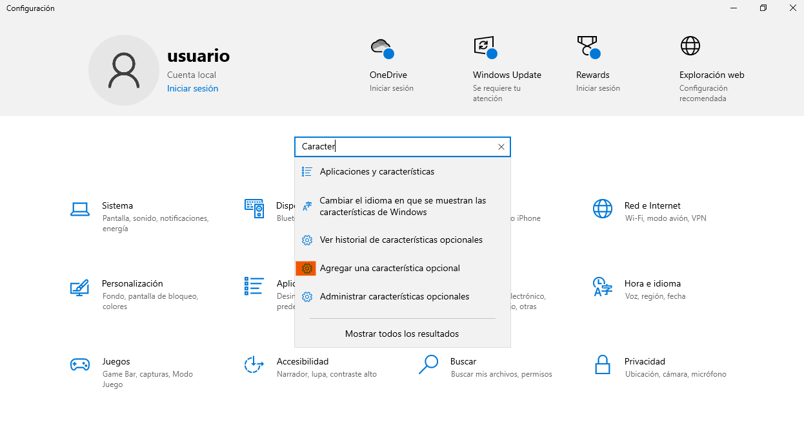
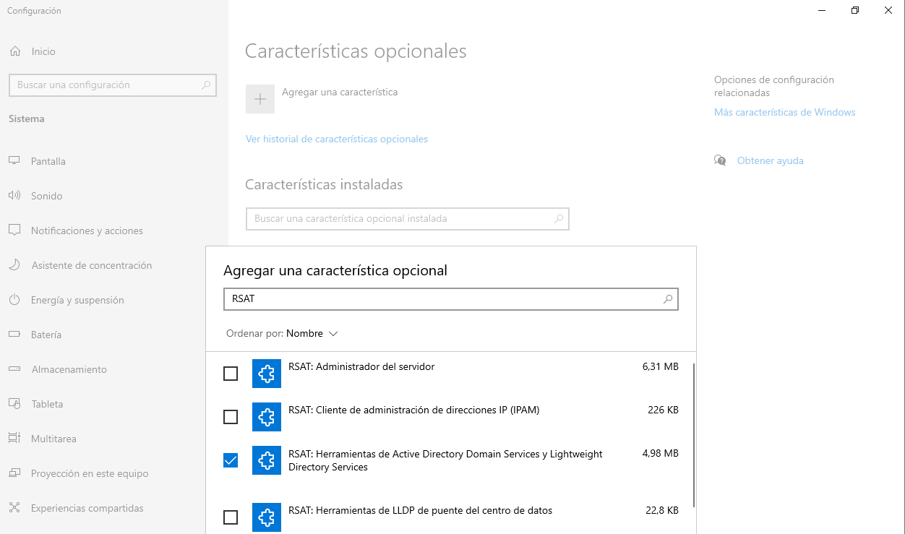
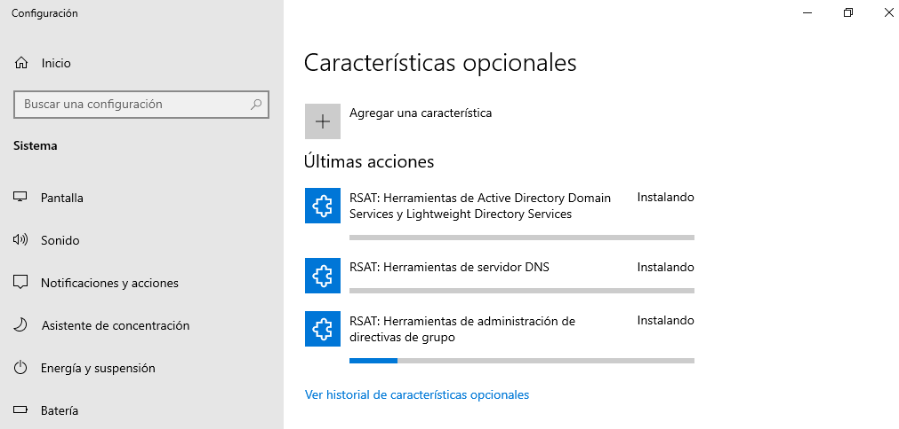
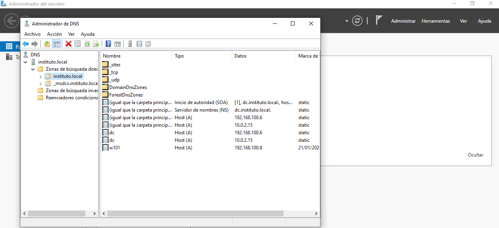
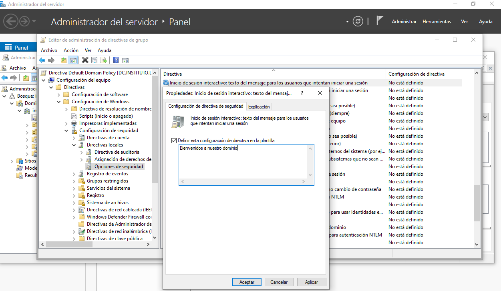
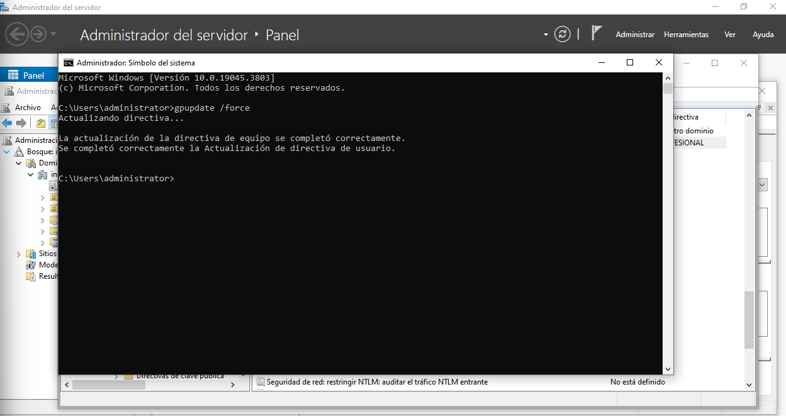
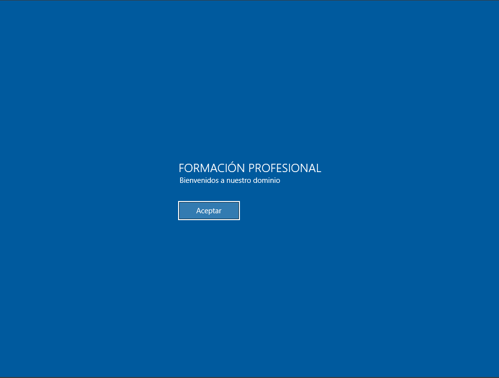

# 06 RSAT para administrar un servidor Samba

Vamos a hacer uso del equipo Windows para administrar el servidor Samba4 (este es equivalente a un Windows Server 2008).

Las RSAT (Remote Server Administration Tools o Herramientas de Administración Remota del Servidor) son un conjunto de utilidades creadas por Microsoft que permiten a los administradores de sistemas gestionar roles y características de servidores (como Active Directory) desde un equipo cliente (normalmente Windows 10 u 11), sin tener que iniciar sesión directamente en el servidor.

Para realizar este proceso debemos instalar las RSAT en nuestro cliente Windows con el usuario administrador. Necesitaremos las siguientes herramientas:

- **Active Directory Users and Computers**: Para administrar usuarios y equipos de Active Directory.
- **DNS Manager**: Para gestionar el servidor DNS interno de Samba.
- **Group Policy Management Console (GPMC)**: Para configurar las GPO.

Como beneficios del uso de las RSAT destacamos:

- **Simplificación de la administración**: Con RSAT, podemos administrar el servidor Samba 4 de forma remota desde tu equipo Windows 10, facilitando la gestión de usuarios, equipos, DNS y políticas de grupo.
- **Aumento de la productividad**: Con acceso directo a herramientas como Active Directory Users and Computers, DNS Manager y GPMC, podemos realizar tareas de administración de forma eficiente y rápida.
- **Integración con el entorno Windows**: Al utilizar herramientas familiares de administración de Windows, podemos aprovechar los conocimientos previos del manejo de un Windows Server para administrar un servidor Samba 4 sin problemas.

Para la instalación de las RSAT realizaremos los siguientes pasos:

Una vez instaladas las RSAT podemos hacer uso de las diferentes herramientas que nos aporta Windows para administrar el servidor, ya que esto no es un curso de Windows no entraremos en detalles en este manual.

Desde el panel de control podemos acceder a todas las herramientas instaladas:

Es recomendable hacer uso de la herramienta _Administrador del servidor_ donde se integran las diferentes funcionalidades:

Desde aquí podemos realizar diferentes acciones:

1. Crear unidades organizativas y usuarios:
   

2. Administrar el servidor DNS:
   
   

3. Administrar GPOs para los equipos Windows.
   
   
   
   
   
