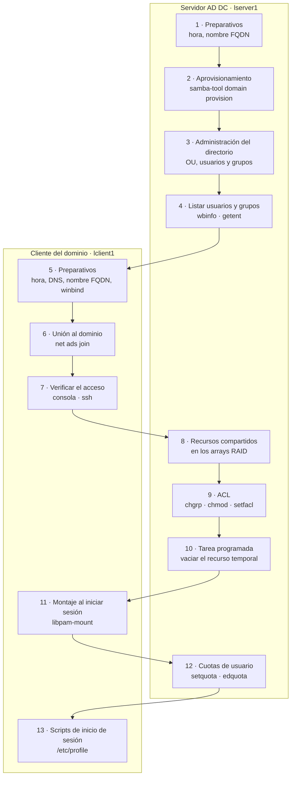
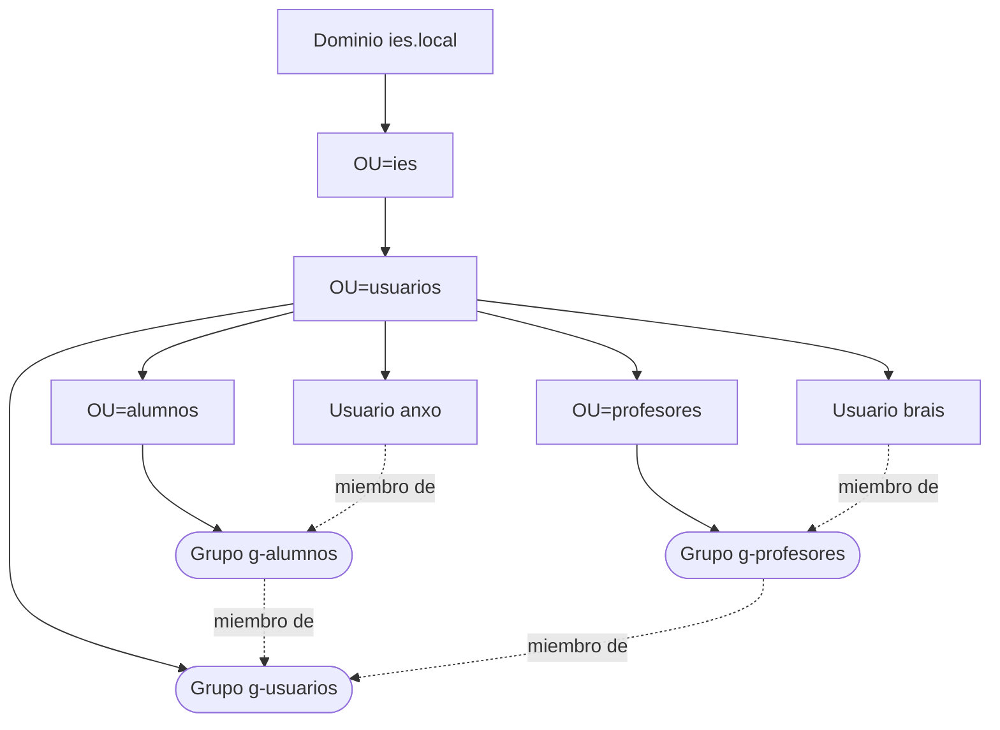

# Samba como controlador de dominio Active Directory (AD DC) en Debian

> **Nota sobre autoría y licencia:** Estos apuntes son una adaptación al castellano, ampliada y actualizada a Debian 13, de la *Cheat-Sheet: Samba4 Debian GNU/Linux - AD DC (Active Directory Domain Controller)* de **Ricardo Feijoo Costa** ([repoEDU-CCbySA](https://ricardofc.github.io/repoEDU-CCbySA/)), publicada bajo licencia [Creative Commons Reconocimiento-CompartirIgual 4.0 (CC BY-SA 4.0)](https://creativecommons.org/licenses/by-sa/4.0/deed.es). Por ese motivo, **este documento se distribuye también bajo la licencia CC BY-SA 4.0**, a diferencia del resto del repositorio. Es la continuación del [documento 05](./05_samba_standalone.md), sobre Samba como servidor independiente, del que reutiliza el escenario y los arrays de discos.

## Índice

1. [Introducción: Samba como controlador de dominio](#1-introducción-samba-como-controlador-de-dominio)
2. [Escenario y hoja de ruta](#2-escenario-y-hoja-de-ruta)
3. [Preparación del servidor](#3-preparación-del-servidor)
   1. [Sincronización horaria con chrony](#31-sincronización-horaria-con-chrony)
   2. [Nombre del equipo (FQDN)](#32-nombre-del-equipo-fqdn)
   3. [Eliminar servicios y datos en conflicto](#33-eliminar-servicios-y-datos-en-conflicto)
   4. [Instalación de los paquetes](#34-instalación-de-los-paquetes)
4. [Promoción a controlador de dominio](#4-promoción-a-controlador-de-dominio)
   1. [Aprovisionamiento del dominio](#41-aprovisionamiento-del-dominio)
   2. [Configuración de Kerberos](#42-configuración-de-kerberos)
   3. [Servicios del controlador de dominio](#43-servicios-del-controlador-de-dominio)
   4. [DNS: apuntar al servidor y verificar](#44-dns-apuntar-al-servidor-y-verificar)
   5. [Comprobación de Kerberos](#45-comprobación-de-kerberos)
   6. [El smb.conf de un controlador de dominio](#46-el-smbconf-de-un-controlador-de-dominio)
5. [Administración del directorio LDAP](#5-administración-del-directorio-ldap)
   1. [Conceptos: DN, OU, DC y CN](#51-conceptos-dn-ou-dc-y-cn)
   2. [ldb-tools y ficheros LDIF](#52-ldb-tools-y-ficheros-ldif)
6. [Usuarios y grupos del dominio](#6-usuarios-y-grupos-del-dominio)
   1. [Atributos Unix (RFC 2307) de los grupos del dominio](#61-atributos-unix-rfc-2307-de-los-grupos-del-dominio)
   2. [Crear grupos y usuarios con samba-tool](#62-crear-grupos-y-usuarios-con-samba-tool)
   3. [Unidades organizativas para alumnos y profesores](#63-unidades-organizativas-para-alumnos-y-profesores)
   4. [Listar usuarios y grupos](#64-listar-usuarios-y-grupos)
7. [Clientes del dominio](#7-clientes-del-dominio)
   1. [De pbis-open a winbind](#71-de-pbis-open-a-winbind)
   2. [Script de preparación del cliente](#72-script-de-preparación-del-cliente)
   3. [Unión al dominio](#73-unión-al-dominio)
   4. [Verificar el acceso de los usuarios](#74-verificar-el-acceso-de-los-usuarios)
8. [Recursos compartidos en los arrays RAID](#8-recursos-compartidos-en-los-arrays-raid)
   1. [Preparación de los arrays y carpetas](#81-preparación-de-los-arrays-y-carpetas)
   2. [Privilegio SeDiskOperatorPrivilege](#82-privilegio-sediskoperatorprivilege)
   3. [Requisitos previos de las ACL](#83-requisitos-previos-de-las-acl)
   4. [ACL de los recursos [usuarios] y [temporal]](#84-acl-de-los-recursos-usuarios-y-temporal)
   5. [Definición de los recursos en smb.conf](#85-definición-de-los-recursos-en-smbconf)
9. [Tarea programada: vaciar [temporal] cada día](#9-tarea-programada-vaciar-temporal-cada-día)
10. [Montaje de recursos al iniciar sesión (libpam-mount)](#10-montaje-de-recursos-al-iniciar-sesión-libpam-mount)
11. [Cuotas de disco](#11-cuotas-de-disco)
12. [Scripts de inicio de sesión](#12-scripts-de-inicio-de-sesión)
13. [Apéndice: configuración de red](#13-apéndice-configuración-de-red)

---

## 1. Introducción: Samba como controlador de dominio

Un **controlador de dominio Active Directory** (*AD DC*) es el servidor que centraliza la identidad de todos los usuarios y equipos de una red. En lugar de que cada máquina tenga sus propios usuarios, como en el servidor independiente del [documento 05](./05_samba_standalone.md), todos se definen una sola vez en el dominio y pueden iniciar sesión en cualquier equipo que pertenezca a él.

Samba 4 puede actuar como controlador de dominio compatible con el Active Directory de Microsoft. Para ello integra en un único servicio los tres componentes que necesita un dominio:

| Componente | Función en el dominio |
|---|---|
| **DNS** (servidor interno de Samba) | Permite a los equipos localizar el controlador de dominio y sus servicios mediante registros especiales (`SRV`). |
| **LDAP** (directorio) | Base de datos donde se guardan usuarios, grupos, equipos y unidades organizativas. |
| **Kerberos** (implementación Heimdal) | Sistema de autenticación: el usuario demuestra su identidad una vez y recibe *tickets* que le dan acceso a los servicios. |

Estos son los conceptos que aparecen a lo largo del documento:

| Concepto | Significado | Valor en el escenario |
|---|---|---|
| Dominio DNS | Nombre DNS del dominio. | `ies.local` |
| Reino (*realm*) Kerberos | El mismo nombre, escrito siempre en **mayúsculas**. | `IES.LOCAL` |
| Dominio NetBIOS | Nombre corto del dominio, heredado de las redes Windows antiguas. | `IES` |
| Unidad organizativa (OU) | Contenedor para organizar los objetos del directorio, como si fueran carpetas. | `OU=usuarios,OU=ies` |
| SID | Identificador de seguridad único de cada objeto del dominio. | `S-1-5-21-...` |
| Cuenta de equipo | Cada equipo del dominio tiene su propia cuenta, terminada en `$`. | `LSERVER1$`, `LCLIENT1$` |

| | Servidor independiente ([documento 05](./05_samba_standalone.md)) | Controlador de dominio (este documento) |
|---|---|---|
| Quién valida a los usuarios | El propio servidor | El controlador de dominio, para todos los equipos |
| Dónde se guardan los usuarios | `/var/lib/samba/private/passdb.tdb` | Directorio LDAP (`/var/lib/samba/private/sam.ldb`) |
| Herramienta de usuarios | `smbpasswd` y `pdbedit` | `samba-tool` |
| Servicios | `smbd` y `nmbd` | `samba-ad-dc` |

> **Nota:** En el escenario original, este paso se llama «promocionar a PDC» (*Primary Domain Controller*). Es un término de los dominios de Windows NT4: en Active Directory todos los controladores de dominio son iguales y se replican entre sí. Hoy «PDC» solo sobrevive como el nombre de uno de los roles especiales (*PDC emulator*) que asume uno de ellos.

> **Nota:** Este repositorio tiene también una serie de apuntes sobre Samba AD con Ubuntu Server y clientes Windows, en la carpeta [Active-Directory-Samba](./Active-Directory-Samba/). Este documento es una vía alternativa, íntegramente sobre Debian y con clientes Linux.

---

## 2. Escenario y hoja de ruta

Se usa el mismo escenario que en el apartado 2 del [documento 05](./05_samba_standalone.md): el servidor `lserver1` (`172.16.10.254`), que pasa de servidor independiente a controlador de dominio, y el cliente `lclient1` (`172.16.10.150`), que se une al dominio. Los datos del dominio son:

| Dato | Valor |
|---|---|
| Reino Kerberos | `IES.LOCAL` |
| Dominio NetBIOS | `IES` |
| Dominio DNS | `ies.local` |
| Controlador de dominio | `lserver1.ies.local` - `172.16.10.254` |
| Cliente | `lclient1.ies.local` - `172.16.10.150` |
| Administrador del dominio | `Administrator` / `abc123.` |

> **Advertencia:** Se mantiene el dominio `ies.local` del escenario original, pero en una red real **no conviene usar `.local`**: ese sufijo está reservado para mDNS (Avahi en Linux, Bonjour en macOS), y algunos equipos lo resuelven por multidifusión en lugar de preguntar al DNS. La recomendación de Samba es usar un subdominio de un dominio propio, como `ad.ies-montedavila.es`.

El trabajo se reparte entre el servidor y el cliente en trece pasos:



| Paso | Equipo | Apartado |
|---|---|---|
| 1. Preparativos | Servidor | 3 |
| 2. Aprovisionamiento | Servidor | 4 |
| 3. Administración del directorio | Servidor | 5 y 6 |
| 4. Listar usuarios y grupos | Servidor | 6.4 |
| 5, 6 y 7. Preparar el cliente, unirlo y verificar el acceso | Cliente | 7 |
| 8 y 9. Recursos compartidos y ACL | Servidor | 8 |
| 10. Tarea programada | Servidor | 9 |
| 11. Montaje al iniciar sesión | Cliente | 10 |
| 12. Cuotas de usuario | Servidor | 11 |
| 13. Scripts de inicio de sesión | Cliente | 12 |

> **Recuerda:** La prioridad de permisos del apartado 3 del [documento 05](./05_samba_standalone.md) sigue vigente: sistema de ficheros del servidor, configuración de Samba y montaje del cliente, en ese orden. La diferencia es que aquí la primera capa incluye también las **ACL** del sistema de ficheros, que se consultan con `getfacl` (apartado 8).

---

## 3. Preparación del servidor

### 3.1 Sincronización horaria con chrony

Kerberos incluye marcas de tiempo en sus *tickets* y rechaza cualquiera cuyo reloj difiera del servidor en más de **5 minutos**. Por eso todos los equipos del dominio deben tener la hora sincronizada, y lo habitual es que el propio controlador de dominio sea la fuente de hora de la red.

```bash
root@lserver1:~# apt -y install chrony
root@lserver1:~# sed -i 's/^pool .*/pool es.pool.ntp.org iburst/' /etc/chrony/chrony.conf
root@lserver1:~# echo 'allow 172.16.10.0/24' > /etc/chrony/conf.d/dominio.conf
root@lserver1:~# systemctl restart chrony
root@lserver1:~# chronyc sources
MS Name/IP address         Stratum Poll Reach LastRx Last sample
===============================================================================
^* 150.214.94.5                  1   6    17    23   -312us[ -455us] +/-   18ms
...
```

| Orden | Qué hace |
|---|---|
| `sed -i 's/^pool .*/.../'` | Cambia los servidores de hora de Debian por los del *pool* español. |
| `allow 172.16.10.0/24` | Permite que los equipos de la red del laboratorio pidan la hora a este servidor. |
| `chronyc sources` | Muestra los servidores de hora; el marcado con `^*` es con el que está sincronizado. |

> **Nota:** El escenario original usa el paquete `ntp` (`ntpsec`). Aquí se sustituye por **chrony**, que es el demonio que recomienda hoy la documentación de Samba y el que se trata en la práctica del apartado 3 del [documento 30](../apuntes/30_Localizacion_e_internacionalizacion.md) de los apuntes. Una vez aprovisionado el dominio se le añadirá la firma de respuestas para los clientes Windows (apartado 4.3).

### 3.2 Nombre del equipo (FQDN)

El servidor debe tener un nombre DNS completo (*FQDN*), `lserver1.ies.local`, que coincida con el reino Kerberos y que se resuelva a su **IP real**:

```bash
root@lserver1:~# hostnamectl hostname lserver1
root@lserver1:~# sed -i '/^127\.0\.1\.1/d' /etc/hosts
root@lserver1:~# echo '172.16.10.254 lserver1.ies.local lserver1' >> /etc/hosts
root@lserver1:~# hostname -f
lserver1.ies.local
root@lserver1:~# hostname -d
ies.local
```

El instalador de Debian asocia el nombre del equipo a la dirección `127.0.1.1` en `/etc/hosts` ([documento 31](../apuntes/31_Configuracion_de_red.md)). En un controlador de dominio esa línea debe **eliminarse**: si el nombre del servidor se resolviera a `127.0.1.1`, Samba registraría en el DNS del dominio una dirección que ningún otro equipo puede alcanzar.

> **Nota:** El escenario original escribe el FQDN completo en `/etc/hostname`. La documentación de Samba recomienda, en cambio, dejar en `/etc/hostname` el nombre corto y que el FQDN se obtenga de `/etc/hosts`, como se hace aquí. Lo importante es que `hostname -f` devuelva el FQDN y `hostname -d` el dominio.

El servidor debe tener además una **IP fija** (`172.16.10.254`), configurada en `/etc/network/interfaces` como en el apartado 14 del [documento 05](./05_samba_standalone.md). De momento, `/etc/resolv.conf` sigue apuntando a un DNS externo: al aprovisionar el dominio, Samba lo tomará como el servidor al que reenviar las consultas que no sean del dominio.

```bash
root@lserver1:~# cat /etc/resolv.conf
nameserver 8.8.4.4
```

### 3.3 Eliminar servicios y datos en conflicto

El servidor DNS interno de Samba no puede convivir con otros servidores DNS, y un controlador de dominio debe partir de una instalación de Samba limpia:

```bash
root@lserver1:~# dpkg -l bind9 ; [ $? -eq 0 ] && apt -y purge bind9
root@lserver1:~# dpkg -l dnsmasq ; [ $? -eq 0 ] && apt -y purge dnsmasq
root@lserver1:~# dpkg -l samba ; [ $? -eq 0 ] && apt -y purge samba
root@lserver1:~# mv /etc/samba/smb.conf /etc/samba/smb.conf.standalone.server
root@lserver1:~# find /var/lib/samba /var/cache/samba \( -name '*.tdb' -o -name '*.ldb' \) -print -delete
```

| Orden | Qué hace |
|---|---|
| `apt -y purge bind9` | Elimina el servidor DNS `bind9`, si estuviera instalado. |
| `apt -y purge dnsmasq` | Elimina el servidor DNS y DHCP `dnsmasq`, si estuviera instalado. |
| `apt -y purge samba` | Elimina el Samba del servidor independiente. |
| `mv ... smb.conf.standalone.server` | Guarda la configuración anterior: el aprovisionamiento se niega a continuar si ya existe un `smb.conf`. |
| `find ... -delete` | Borra las bases de datos que dejó el servidor independiente ([documento 17](../apuntes/17_Comando_find.md)). Si quedaran, el aprovisionamiento podría fallar o mezclarse con datos antiguos. |

> **Importante:** Con las bases de datos se borran también los usuarios de Samba del servidor independiente (`ana`, `xurxo`, `usuario`). El dominio tendrá su propia base de datos de usuarios, que empieza vacía salvo por las cuentas predefinidas.

### 3.4 Instalación de los paquetes

```bash
root@lserver1:~# echo 'samba-common samba-common/dhcp boolean false' | debconf-set-selections
root@lserver1:~# DEBIAN_FRONTEND=noninteractive apt -y install samba samba-ad-dc winbind libnss-winbind libpam-winbind krb5-user bind9-host
```

| Paquete | Para qué |
|---|---|
| `samba` | Servidor de ficheros e impresoras. |
| `samba-ad-dc` | El demonio del controlador de dominio (`samba`) y su servicio `samba-ad-dc`. |
| `winbind` | Integra los usuarios del dominio en el sistema Linux. |
| `libnss-winbind`, `libpam-winbind` | Permiten que el sistema reconozca a los usuarios del dominio (`getent`, `id`) y que puedan iniciar sesión (apartado 6.4). |
| `krb5-user` | Herramientas de Kerberos (`kinit`, `klist`) para comprobar la autenticación. |
| `bind9-host` | La orden `host`, para comprobar el DNS. Es solo un cliente DNS, no el servidor `bind9`. |

> **Importante:** En el escenario original basta con `apt install samba`, pero en Debian 13 el demonio del controlador de dominio se distribuye en un paquete aparte, **`samba-ad-dc`**. Sin él, el servicio `samba-ad-dc` no existe y el controlador de dominio no puede arrancar. `DEBIAN_FRONTEND=noninteractive` evita las preguntas de configuración de Kerberos, porque su fichero se sustituirá por el que genera Samba.

---

## 4. Promoción a controlador de dominio

### 4.1 Aprovisionamiento del dominio

El aprovisionamiento crea el dominio: el directorio LDAP, la base de datos de Kerberos, la zona DNS y una nueva configuración de Samba.

```bash
root@lserver1:~# samba-tool domain provision --use-rfc2307 --realm=IES.LOCAL --domain=IES --server-role=dc \
--dns-backend=SAMBA_INTERNAL --adminpass=abc123.
...
Server Role:           active directory domain controller
Hostname:              lserver1
NetBIOS Domain:        IES
DNS Domain:            ies.local
DOMAIN SID:            S-1-5-21-307976336-692820594-3996066041
```

| Opción | Significado |
|---|---|
| `--use-rfc2307` | Activa los atributos Unix (RFC 2307) en el directorio: UID, GID, shell... Son los que permiten que un usuario del dominio tenga el mismo UID en todos los equipos Linux (apartado 6.1). |
| `--realm=IES.LOCAL` | Reino Kerberos, en mayúsculas. |
| `--domain=IES` | Nombre NetBIOS del dominio. |
| `--server-role=dc` | El servidor será controlador de dominio. |
| `--dns-backend=SAMBA_INTERNAL` | Usa el servidor DNS interno de Samba. |
| `--adminpass=abc123.` | Contraseña del usuario `Administrator` del dominio. |

> **Nota:** La contraseña del administrador debe cumplir la política de complejidad de Samba (al menos 7 caracteres y tres tipos distintos entre minúsculas, mayúsculas, números y símbolos); si no, el aprovisionamiento falla al final. Como siempre que una contraseña se escribe en la línea de órdenes, queda en el historial. Ejecutando `samba-tool domain provision --use-rfc2307 --interactive`, la orden pregunta los datos uno a uno, incluida la contraseña.

### 4.2 Configuración de Kerberos

El aprovisionamiento genera el fichero de configuración de Kerberos del dominio, pero no lo instala. Hay que copiarlo a su sitio:

```bash
root@lserver1:~# cp /var/lib/samba/private/krb5.conf /etc/krb5.conf
```

> **Nota:** Este paso no aparece en el escenario original, pero lo indica la documentación de Samba. Sin él, herramientas como `kinit` no saben dónde está el controlador de dominio del reino `IES.LOCAL`.

### 4.3 Servicios del controlador de dominio

Un controlador de dominio no usa los servicios del servidor independiente, sino uno solo, **`samba-ad-dc`**, que arranca internamente todo lo necesario: el servidor de ficheros, el DNS, el LDAP, el Kerberos y su propio `winbindd`.

```bash
root@lserver1:~# systemctl disable --now smbd nmbd winbind
root@lserver1:~# systemctl mask smbd nmbd winbind
root@lserver1:~# systemctl unmask samba-ad-dc
root@lserver1:~# systemctl enable --now samba-ad-dc
root@lserver1:~# systemctl status samba-ad-dc
● samba-ad-dc.service - Samba AD Daemon
     Loaded: loaded (/usr/lib/systemd/system/samba-ad-dc.service; enabled; preset: enabled)
     Active: active (running) since lun 2026-10-06 13:05:12 CEST; 4s ago
```

> **Nota:** El escenario original solo **para** `smbd` y `nmbd`. Aquí además se **enmascaran** ([documento 29](../apuntes/29_Iniciadores_del_sistema_SysVinit_Systemd_Upstart.md) y [tarea 4.2](../apuntes/tareas/tarea4.2/4.2_tarea.md)), igual que `winbind`, para que ningún reinicio ni actualización de paquetes los vuelva a arrancar: ocuparían los mismos puertos que `samba-ad-dc` y el controlador de dominio fallaría. El servicio `winbind` independiente sobra porque `samba-ad-dc` ya incluye su propio `winbindd`.

| Servidor independiente: `smbd` y `nmbd` | Controlador de dominio: `samba-ad-dc` |
|---|---|
| Al instalar Samba, es la configuración por defecto, con `samba-ad-dc` desactivado. | Al convertir Samba en controlador de dominio, se paran `smbd` y `nmbd` y se usa `samba-ad-dc`. |
| `systemctl status smbd && systemctl status nmbd` | `systemctl status samba-ad-dc` |
| `systemctl start smbd && systemctl start nmbd` | `systemctl start samba-ad-dc` |
| `systemctl stop smbd && systemctl stop nmbd` | `systemctl stop samba-ad-dc` |
| `systemctl reload smbd && systemctl reload nmbd` | `systemctl reload samba-ad-dc` |
| `smbcontrol all reload-config` | `smbcontrol all reload-config` |

Con el dominio ya en marcha, se completa la configuración de chrony del apartado 3.1. El controlador de dominio debe **firmar** las respuestas de hora para que los clientes Windows confíen en ellas, y para ello chrony necesita acceder al *socket* de firma de Samba:

```bash
root@lserver1:~# echo 'ntpsigndsocket /var/lib/samba/ntp_signd' >> /etc/chrony/conf.d/dominio.conf
root@lserver1:~# install -d -o root -g _chrony -m 750 /var/lib/samba/ntp_signd
root@lserver1:~# systemctl restart chrony
```

`install -d` crea el directorio si no existe y le asigna a la vez propietario, grupo y permisos: el grupo `_chrony`, que es el del servicio de chrony en Debian, puede entrar en él, y nadie más.

### 4.4 DNS: apuntar al servidor y verificar

Ahora el servidor debe usar **su propio DNS**, que es el que conoce los registros del dominio:

```bash
root@lserver1:~# echo -e "search ies.local\nnameserver 172.16.10.254" > /etc/resolv.conf
root@lserver1:~# host -t SRV _ldap._tcp.ies.local.
_ldap._tcp.ies.local has SRV record 0 100 389 lserver1.ies.local.
root@lserver1:~# host -t SRV _kerberos._tcp.ies.local.
_kerberos._tcp.ies.local has SRV record 0 100 88 lserver1.ies.local.
root@lserver1:~# host -t A lserver1.ies.local.
lserver1.ies.local has address 172.16.10.254
root@lserver1:~# host -t A www.debian.org
www.debian.org has address 151.101.134.132
```

| Registro | Qué indica |
|---|---|
| `_ldap._tcp.ies.local` (`SRV`) | Dónde está el servicio LDAP del dominio: `lserver1`, puerto 389. Es el que buscan los equipos para encontrar el controlador de dominio. |
| `_kerberos._tcp.ies.local` (`SRV`) | Dónde está el servicio Kerberos: `lserver1`, puerto 88. |
| `lserver1.ies.local` (`A`) | La dirección IP del controlador de dominio. |
| `www.debian.org` (`A`) | Un nombre de fuera del dominio: comprueba que el reenvío al DNS externo (`dns forwarder`) funciona. |

> **Nota:** El escenario original escribe en `resolv.conf` tanto `domain ies.local` como `search ies.local`, pero son directivas excluyentes y solo vale la última (apartado 14.1 del [documento 05](./05_samba_standalone.md)). Basta con `search`. Como el servidor tiene IP fija, nada sobrescribirá este fichero; si estuviera instalado el paquete `resolvconf`, habría que indicar estos valores con `dns-nameservers` y `dns-search` en `/etc/network/interfaces`.

### 4.5 Comprobación de Kerberos

La prueba definitiva de que el dominio funciona es pedir un *ticket* de Kerberos para el administrador:

```bash
root@lserver1:~# kinit administrator
Password for administrator@IES.LOCAL:
root@lserver1:~# klist
Ticket cache: FILE:/tmp/krb5cc_0
Default principal: administrator@IES.LOCAL

Valid starting       Expires              Service principal
06/10/26 13:08:41    06/10/26 23:08:41    krbtgt/IES.LOCAL@IES.LOCAL
	renew until 07/10/26 13:08:37
```

`klist` muestra el *ticket* inicial (`krbtgt`), válido durante diez horas. Si `kinit` falla, las causas más habituales son la hora desincronizada, el DNS mal configurado o no haber copiado `krb5.conf` en el apartado 4.2.

### 4.6 El smb.conf de un controlador de dominio

El aprovisionamiento genera un `smb.conf` nuevo y mucho más corto que el de un servidor independiente:

```ini
# Global parameters
[global]
	dns forwarder = 8.8.4.4
	netbios name = LSERVER1
	realm = IES.LOCAL
	server role = active directory domain controller
	workgroup = IES
	idmap_ldb:use rfc2307 = yes

[sysvol]
	path = /var/lib/samba/sysvol
	read only = No

[netlogon]
	path = /var/lib/samba/sysvol/ies.local/scripts
	read only = No
```

| Elemento | Significado |
|---|---|
| `[global]` | Sección **obligatoria** con la configuración global. |
| `[sysvol]` | Sección **obligatoria** con los ficheros públicos del dominio (directivas de grupo, *scripts*), que se replican en cada controlador de dominio. |
| `[netlogon]` | Sección **obligatoria** para los *scripts* que se ejecutan al iniciar sesión en los clientes Windows. |
| `dns forwarder = 8.8.4.4` | DNS al que se reenvían las consultas que el DNS interno no sabe resolver. Se tomó del `resolv.conf` durante el aprovisionamiento. |
| `netbios name = LSERVER1` | Nombre NetBIOS del servidor. |
| `realm = IES.LOCAL` | Reino Kerberos. |
| `server role = active directory domain controller` | Modo de funcionamiento: controlador de dominio. |
| `workgroup = IES` | Nombre NetBIOS del dominio. |
| `idmap_ldb:use rfc2307 = yes` | Usa los atributos Unix (RFC 2307) del directorio para asignar UID y GID a los usuarios y grupos del dominio en este servidor. |
| `path = /var/lib/samba/sysvol` | Carpeta real del recurso `[sysvol]`. |
| `path = /var/lib/samba/sysvol/ies.local/scripts` | Carpeta real del recurso `[netlogon]`. |

> **Nota:** La sintaxis del fichero es la misma que en el [documento 05](./05_samba_standalone.md): `#` para comentarios, `testparm` para comprobarlo y `man 5 smb.conf`, `man 7 samba` y `man 8 samba` como documentación.

---

## 5. Administración del directorio LDAP

### 5.1 Conceptos: DN, OU, DC y CN

Cada objeto del directorio se identifica por su **DN** (*Distinguished Name*), que es la ruta completa desde el objeto hasta la raíz del dominio. Se lee de izquierda a derecha, del objeto hacia la raíz, de forma parecida a como en una ruta de ficheros se leería de derecha a izquierda:

| Componente | Significado | Ejemplo |
|---|---|---|
| `DC` (*Domain Component*) | Cada una de las partes del nombre DNS del dominio. | `DC=ies,DC=local` es `ies.local`. |
| `OU` (*Organizational Unit*) | Unidad organizativa: un contenedor creado para organizar objetos. | `OU=usuarios,OU=ies` |
| `CN` (*Common Name*) | Nombre de un objeto, o de algunos contenedores predefinidos. | `CN=Domain Admins,CN=Users` |

Así, `OU=usuarios,OU=ies,DC=ies,DC=local` es la unidad organizativa `usuarios`, que está dentro de la unidad `ies`, en el dominio `ies.local`. Los DN no distinguen mayúsculas de minúsculas: `OU=ies,DC=ies,DC=local` y `ou=IES,DC=iEs,DC=lOcal` son el mismo.

### 5.2 ldb-tools y ficheros LDIF

El paquete **`ldb-tools`** ofrece las órdenes para administrar los datos del directorio. Funcionan con ficheros LDIF y tienen una sintaxis parecida a sus equivalentes de OpenLDAP (paquete `ldap-utils`, [documento 01](./01_ldap-slapd.md) de esta carpeta):

| Orden | Acción | Equivalente en `ldap-utils` |
|---|---|---|
| `ldbadd` | Añadir entradas. | `ldapadd` |
| `ldbmodify` | Modificar entradas (y también añadir o borrar, según el LDIF). | `ldapmodify` |
| `ldbsearch` | Buscar entradas. | `ldapsearch` |
| `ldbdel` | Eliminar entradas. | `ldapdelete` |
| `ldbedit` | Editar entradas con un editor de texto. | - |
| `ldbrename` | Renombrar o mover entradas. | `ldapmodrdn` |

Un fichero **LDIF** describe una o varias entradas como pares `atributo: valor`, separando cada entrada de la siguiente con una línea en blanco. Este crea las unidades organizativas `ies` y, dentro de ella, `usuarios`:

```text
# create-OU.ldif
dn: OU=ies,DC=ies,DC=local
changetype: add
objectClass: top
objectClass: organizationalunit
description: ies OU

dn: OU=usuarios,OU=ies,DC=ies,DC=local
changetype: add
objectClass: top
objectClass: organizationalunit
description: usuarios OU
```

```bash
root@lserver1:~# apt -y install ldb-tools
root@lserver1:~# ldbmodify -H ldap://localhost -UAdministrator%abc123. create-OU.ldif
Modified 2 records successfully
root@lserver1:~# ldbsearch -H ldap://localhost -UAdministrator%abc123. OU=ies
root@lserver1:~# ldbsearch -H ldap://localhost -UAdministrator%abc123. -b 'OU=ies,DC=ies,DC=local'
```

| Orden | Acción |
|---|---|
| `ldbmodify ... create-OU.ldif` | Crea las OU del fichero. `ldbadd ... create-OU.ldif` es equivalente. |
| `ldbsearch ... OU=ies` | Busca las entradas que cumplen el filtro `OU=ies`. |
| `ldbsearch ... -b 'OU=ies,DC=ies,DC=local'` | Busca las entradas que hay a partir de esa base (`-b`), es decir, la OU `ies` y todo lo que contiene. |

| Opción | Significado |
|---|---|
| `-H ldap://localhost` | Directorio con el que se trabaja: el LDAP del propio servidor. |
| `-UAdministrator%abc123.` | Usuario y contraseña, separados por `%`. |

Para deshacerlo, este otro LDIF borra las dos OU. Primero la de dentro, porque no se puede borrar una OU que contiene objetos:

```text
# delete-OU.ldif
dn: OU=usuarios,OU=ies,DC=ies,DC=local
changetype: delete

dn: OU=ies,DC=ies,DC=local
changetype: delete
```

```bash
root@lserver1:~# ldbmodify -H ldap://localhost -UAdministrator%abc123. delete-OU.ldif
```

> **Advertencia:** No hay que borrar las OU si se va a seguir con el documento, porque los apartados siguientes las usan. Además, el borrado se hace con `ldbmodify` y no con `ldbdel`, porque `ldbdel` no admite ficheros LDIF: recibe directamente los DN, por ejemplo `ldbdel -H ldap://localhost -UAdministrator 'OU=usuarios,OU=ies,DC=ies,DC=local'`.

> **Nota:** Escribir la contraseña tras `%` la deja en el historial. Con `-UAdministrator` a secas, la orden la pide de forma interactiva. Además, en el propio servidor y como `root` se puede trabajar directamente sobre la base de datos, sin pasar por la red ni autenticarse: `-H /var/lib/samba/private/sam.ldb`.

> **Nota:** Para las operaciones más comunes con OU, `samba-tool` ofrece órdenes más directas que los LDIF: `samba-tool ou create 'OU=ies'` y `samba-tool ou list`. Los LDIF siguen siendo útiles para crear muchos objetos de una vez y para modificar atributos concretos, como en el apartado 6.1.

---

## 6. Usuarios y grupos del dominio

### 6.1 Atributos Unix (RFC 2307) de los grupos del dominio

Para que un usuario del dominio tenga en Linux **el mismo UID y GID en todos los equipos**, esos números se guardan en el propio directorio, en los atributos `uidNumber` y `gidNumber` definidos por la norma RFC 2307. Es lo que se activó con `--use-rfc2307` al aprovisionar. Tener los mismos números en todas partes es imprescindible para que la propiedad de los ficheros sea coherente, por ejemplo en recursos compartidos o con NFS ([documento 02](./02_NFS.md)).

Los usuarios y grupos que se crean con `samba-tool` reciben sus números al crearlos, pero los **grupos predefinidos** del dominio no tienen `gidNumber`. Dos de ellos lo necesitan:

- **`Domain Users`**: todo usuario del dominio pertenece a él y es su **grupo principal**. Si no tiene `gidNumber`, los clientes Linux no pueden asignar un grupo principal a los usuarios y no los reconocen (apartado 7).
- **`Domain Admins`**: se usará como grupo propietario de las carpetas compartidas (apartado 8).

Se les asigna con un LDIF de modificación:

```text
# modify-gidNumber.ldif
dn: CN=Domain Admins,CN=Users,DC=ies,DC=local
changetype: modify
replace: gidNumber
gidNumber: 12000

dn: CN=Domain Users,CN=Users,DC=ies,DC=local
changetype: modify
replace: gidNumber
gidNumber: 12001
```

```bash
root@lserver1:~# ldbmodify -H ldap://localhost -UAdministrator%abc123. modify-gidNumber.ldif
Modified 2 records successfully
```

> **Nota:** El escenario original asigna el `gidNumber` solo a `Domain Admins`, al llegar a las ACL. Aquí se asigna también a `Domain Users` desde el principio, porque lo necesita la unión de clientes con winbind del apartado 7. La orden `samba-tool group addunixattrs "Domain Users" 12001` hace lo mismo sin LDIF.

Estos son todos los identificadores que se usan en el escenario:

| Objeto | Tipo | Identificador |
|---|---|---|
| `g-usuarios` | Grupo | GID `10000` |
| `g-alumnos` | Grupo | GID `10001` |
| `g-profesores` | Grupo | GID `10002` |
| `anxo` | Usuario | UID `11000` |
| `brais` | Usuario | UID `11001` |
| `Domain Admins` | Grupo predefinido | GID `12000` |
| `Domain Users` | Grupo predefinido | GID `12001` |

### 6.2 Crear grupos y usuarios con samba-tool

**`samba-tool`** es la herramienta de administración del dominio, y la evolución de `pdbedit`, que a su vez lo era de `smbpasswd`.

```bash
root@lserver1:~# samba-tool group add g-usuarios \
--groupou=OU=USUARIOS,OU=IES --nis-domain=ies --gid-number=10000
root@lserver1:~# samba-tool user create anxo --random-password --must-change-at-next-login \
--userou='OU=Usuarios,OU=IES' --gecos 'Perteneciente a g-usuarios' \
--uid-number=11000 --gid-number=12001 --login-shell=/bin/bash \
--mail-address=anxo@ies.local --telephone-number=600000001
root@lserver1:~# samba-tool user create brais 123passbraisABC --must-change-at-next-login \
--userou='OU=Usuarios,OU=IES' --gecos 'Perteneciente a g-usuarios' \
--uid-number=11001 --gid-number=12001 --login-shell=/bin/bash \
--mail-address=brais@ies.local --telephone-number=600000002 \
-H ldap://localhost -UAdministrator%abc123.
root@lserver1:~# samba-tool user setpassword anxo --newpassword=123passanxoABC
root@lserver1:~# samba-tool group addmembers g-usuarios anxo,brais
root@lserver1:~# samba-tool group listmembers g-usuarios
anxo
brais
```

| Orden | Acción |
|---|---|
| `samba-tool group add g-usuarios ...` | Crea el grupo `g-usuarios` en la OU `USUARIOS` (dentro de `IES`), con GID `10000`. |
| `samba-tool user create anxo ...` | Crea el usuario `anxo` trabajando sobre la base de datos local. |
| `samba-tool user create brais ... -H ldap://localhost -U...` | Crea el usuario `brais` a través del servidor LDAP indicado. Así se podría crear desde otro equipo de la red. |
| `samba-tool user setpassword anxo --newpassword=...` | Cambia la contraseña de `anxo`. Su contraseña aleatoria solo tiene sentido para cuentas de servicio, que no inician sesión. |
| `samba-tool group addmembers g-usuarios anxo,brais` | Añade los dos usuarios al grupo. |
| `samba-tool group listmembers g-usuarios` | Lista los miembros del grupo. |

| Opción | Significado |
|---|---|
| `--groupou`, `--userou` | OU donde se crea el grupo o el usuario, sin la parte del dominio (`DC=...`). |
| `--nis-domain=ies` | Dominio NIS de los atributos Unix del grupo. |
| `--gid-number`, `--uid-number` | GID o UID de Unix (RFC 2307). |
| `--random-password` | Asigna una contraseña aleatoria, en lugar de escribirla tras el nombre como con `brais`. |
| `--must-change-at-next-login` | Obliga a cambiar la contraseña en el primer inicio de sesión. |
| `--gecos`, `--login-shell` | Descripción y shell de Unix del usuario. |
| `--mail-address`, `--telephone-number` | Correo y teléfono del usuario. |

> **Nota:** El escenario original da a cada usuario un `--gid-number` igual a su UID (`11000`, `11001`), pero en el dominio no existe ningún grupo con esos números. Aquí se usa el `gidNumber` de `Domain Users` (`12001`), que es el grupo principal real de todo usuario del dominio.

> **Nota:** `setpassword` sin `--must-change-at-next-login` anula la obligación de cambiar la contraseña, así que `anxo` no tendrá que cambiarla y `brais` sí.

Para ver todas las cuentas del dominio:

```bash
root@lserver1:~# samba-tool user list
Administrator
brais
Guest
krbtgt
anxo
root@lserver1:~# samba-tool computer list
LSERVER1$
```

| Cuenta | Significado |
|---|---|
| `Administrator` | Administrador del dominio. |
| `Guest` | Invitado, deshabilitada por defecto. |
| `krbtgt` | Cuenta interna de Kerberos, con la que se firman los *tickets*. |
| `anxo`, `brais` | Las cuentas creadas, miembros del grupo `g-usuarios`. |
| `LSERVER1$` | `samba-tool computer list` muestra los equipos: igual que los usuarios y los grupos, **cada equipo tiene una cuenta** en el directorio. |

Los usuarios que se crearon con `smbpasswd` en el servidor independiente ya no aparecen, porque el controlador de dominio usa su propia base de datos (apartado 3.3).

Como referencia, estas son las órdenes para deshacer lo anterior. **No hay que ejecutarlas** si se va a seguir con el documento:

| Orden | Acción |
|---|---|
| `samba-tool group removemembers g-usuarios anxo,brais` | Quita los usuarios del grupo. |
| `samba-tool group delete g-usuarios` | Elimina el grupo. |
| `for i in anxo brais; do samba-tool user delete ${i}; done` | Elimina los dos usuarios. |

### 6.3 Unidades organizativas para alumnos y profesores

Se organiza el dominio con una OU para alumnos y otra para profesores dentro de `usuarios`, cada una con su grupo. El grupo general `g-usuarios` pasa a contener a los otros dos grupos, en lugar de a los usuarios directamente:



Las flechas continuas indican qué contiene cada OU, y las discontinuas, la pertenencia a los grupos. Las OU se crean con otro LDIF:

```text
# create-OU-2.ldif
dn: OU=alumnos,OU=usuarios,OU=ies,DC=ies,DC=local
changetype: add
objectClass: top
objectClass: organizationalunit
description: alumnos OU

dn: OU=profesores,OU=usuarios,OU=ies,DC=ies,DC=local
changetype: add
objectClass: top
objectClass: organizationalunit
description: profesores OU
```

```bash
root@lserver1:~# ldbmodify -H ldap://localhost -UAdministrator%abc123. create-OU-2.ldif
root@lserver1:~# samba-tool group add g-alumnos \
--groupou=OU=ALUMNOS,OU=USUARIOS,OU=IES --nis-domain=ies --gid-number=10001
root@lserver1:~# samba-tool group add g-profesores \
--groupou=OU=PROFESORES,OU=USUARIOS,OU=IES --nis-domain=ies --gid-number=10002
root@lserver1:~# samba-tool group addmembers g-usuarios g-alumnos,g-profesores
root@lserver1:~# samba-tool group addmembers g-alumnos anxo
root@lserver1:~# samba-tool group addmembers g-profesores brais
root@lserver1:~# samba-tool group removemembers g-usuarios anxo,brais
root@lserver1:~# samba-tool group listmembers g-usuarios
g-alumnos
g-profesores
root@lserver1:~# samba-tool group listmembers g-alumnos
anxo
root@lserver1:~# samba-tool group listmembers g-profesores
brais
```

`anxo` y `brais` siguen perteneciendo a `g-usuarios`, pero ahora **a través** de su grupo. Es la forma habitual de organizar los permisos en un dominio: se conceden a los grupos y los usuarios los heredan.

### 6.4 Listar usuarios y grupos

Hay varias formas de ver los usuarios y grupos del dominio desde el servidor:

```bash
root@lserver1:~# pdbedit -L
nobody:65534:nobody
LSERVER1$:4294967295:
brais:4294967295:
anxo:4294967295:
Administrator:4294967295:
krbtgt:4294967295:
root@lserver1:~# wbinfo -u && wbinfo -g
```

| Orden | Acción |
|---|---|
| `pdbedit -L` | Lista las cuentas de Samba, que ahora son las del directorio: las mismas que `samba-tool user list` y `samba-tool computer list`. |
| `wbinfo -u`, `wbinfo -g` | Lista los usuarios y los grupos del dominio a través de `winbindd`. |
| `getent passwd`, `getent group` | Lista los usuarios y grupos que ve el **sistema Linux**, según las fuentes de `/etc/nsswitch.conf`. |

Para que el sistema Linux del propio servidor reconozca a los usuarios del dominio, y estos puedan iniciar sesión en él, se usa **winbind**. Al instalar `libnss-winbind` en el apartado 3.4, Debian añadió automáticamente `winbind` como fuente de usuarios y grupos en `/etc/nsswitch.conf`:

```bash
root@lserver1:~# grep -E '^(passwd|group):' /etc/nsswitch.conf
passwd:         files systemd winbind
group:          files systemd winbind
```

Solo falta indicar en `smb.conf` cómo deben verse esos usuarios en Linux. Se añaden estas líneas en la sección `[global]`:

```ini
	template shell = /bin/bash
	template homedir = /home/%D/%U
	winbind use default domain = yes
```

| Directiva | Significado |
|---|---|
| `template shell = /bin/bash` | Shell de los usuarios del dominio. |
| `template homedir = /home/%D/%U` | Carpeta personal: `/home/IES/anxo` (`%D` es el dominio y `%U` el usuario). |
| `winbind use default domain = yes` | Los usuarios se llaman `anxo` y no `IES\anxo`. |

```bash
root@lserver1:~# systemctl restart samba-ad-dc
root@lserver1:~# pam-auth-update --enable mkhomedir
root@lserver1:~# getent passwd anxo | cut -d: -f1,3,4,6,7
anxo:11000:12001:/home/IES/anxo:/bin/bash
root@lserver1:~# id anxo
uid=11000(anxo) gid=12001(domain users) grupos=12001(domain users),10001(g-alumnos),10000(g-usuarios)
```

`pam-auth-update --enable mkhomedir` activa la creación automática de la carpeta personal en el primer inicio de sesión. Con esto, `anxo` y `brais` ya pueden entrar en el servidor por consola (`tty1`) o por SSH (`ssh anxo@lserver1`).

> **Nota:** `getent passwd` sin argumentos **no** lista los usuarios del dominio: winbind no los enumera por defecto, para no recorrer el directorio entero en dominios grandes. Hay que preguntar por un usuario concreto, como `getent passwd anxo`, o usar `wbinfo -u`. En `id` pueden aparecer también grupos internos del dominio, como `BUILTIN\users`.

> **Importante:** El escenario original resuelve este apartado instalando **`nslcd`** en el servidor, lo que le obliga a añadir a `smb.conf` `ldap server require strong auth = no` y `acl:search = no`. Esas dos directivas permiten consultar el directorio con contraseñas enviadas **sin cifrar** y desactivan las comprobaciones de acceso en las búsquedas, lo que es un riesgo de seguridad. winbind, en cambio, está integrado en Samba, no necesita rebajar la seguridad y es la solución que recomienda la documentación de Samba.

> **Advertencia:** En un dominio real, los usuarios no deberían iniciar sesión en el controlador de dominio. Aquí se hace solo para comprobar en el laboratorio que el dominio y winbind funcionan.

---

## 7. Clientes del dominio

### 7.1 De pbis-open a winbind

El escenario original une los clientes al dominio con **pbis-open** (antes *Likewise Open*), de BeyondTrust. Ese proyecto está **abandonado**: su repositorio está archivado y no tiene versiones para las distribuciones actuales. En estos apuntes se sustituye por **winbind**, la herramienta del propio proyecto Samba, que es también la que usa la serie [Active-Directory-Samba](./Active-Directory-Samba/) para los clientes Ubuntu. Cada ajuste de pbis-open tiene su equivalente:

| pbis-open (escenario original) | winbind (estos apuntes) |
|---|---|
| `domainjoin-cli join IES.LOCAL Administrator abc123.` | `net ads join -U administrator` |
| `domainjoin-cli leave Administrator@IES.LOCAL abc123.` | `net ads leave -U administrator` |
| `config AssumeDefaultDomain true` (entrar sin escribir el dominio) | `winbind use default domain = yes` |
| `config UserDomainPrefix IES` | `workgroup = IES` |
| `config HomeDirTemplate %H/%D/%U` (`/home/IES/usuario`) | `template homedir = /home/%D/%U` |
| `config HomeDirUmask 077` | `HOME_MODE 0700` en `/etc/login.defs`, que ya es el valor por defecto en Debian 13 |
| `config LoginShellTemplate /bin/bash` | `template shell = /bin/bash` |
| `config --list` (ver la configuración) | `testparm -s` |

### 7.2 Script de preparación del cliente

Igual que en el escenario original, la preparación de cada cliente se automatiza con un *script* que se ejecuta como `root` **en la consola** de cada equipo (no por SSH, porque cambia la configuración de red), modificando antes la IP y el nombre. Se guarda, por ejemplo, como `preparar_cliente.sh`:

```bash
#!/bin/bash
# Prepara un cliente Debian 13 para unirlo al dominio IES.LOCAL.
# Ejecutar como root en la consola de cada cliente, cambiando IP y NOMBRE.

IP="172.16.10.150"
NOMBRE="lclient1"
DOMINIO="ies.local"
REINO="IES.LOCAL"
DC="172.16.10.254"

# Sincronizar la hora con el controlador de dominio
function f_NTP() {
  apt -y install chrony
  sed -i 's/^pool /#pool /' /etc/chrony/chrony.conf
  echo "server ${DC} iburst" > /etc/chrony/conf.d/dominio.conf
  systemctl restart chrony
}

# IP fija y el controlador de dominio como servidor DNS
function f_DNS() {
  systemctl disable --now NetworkManager 2>/dev/null
  ifdown enp0s3 2>/dev/null
  cat > /etc/network/interfaces <<EOF
source /etc/network/interfaces.d/*

auto lo
iface lo inet loopback

auto enp0s3
iface enp0s3 inet static
  address ${IP}/24
  gateway 172.16.10.1
EOF
  printf 'search %s\nnameserver %s\n' "${DOMINIO}" "${DC}" > /etc/resolv.conf
  systemctl enable networking
  ifup enp0s3
}

# Nombre del equipo y su FQDN
function f_modify_hostname() {
  hostnamectl hostname "${NOMBRE}"
  sed -i '/^127\.0\.1\.1/d' /etc/hosts
  echo "${IP} ${NOMBRE}.${DOMINIO} ${NOMBRE}" >> /etc/hosts
  if [ "$(hostname -f)" != "${NOMBRE}.${DOMINIO}" ]; then
    echo '#################### El FQDN es incorrecto ####################'
    return 55
  fi
}

# Paquetes para unirse al dominio con winbind
function f_install_winbind() {
  echo 'samba-common samba-common/dhcp boolean false' | debconf-set-selections
  DEBIAN_FRONTEND=noninteractive apt -y install winbind libnss-winbind libpam-winbind krb5-user
}

# Configuración de Kerberos, winbind y PAM
function f_config_winbind() {
  cat > /etc/krb5.conf <<EOF
[libdefaults]
    default_realm = ${REINO}
    dns_lookup_realm = false
    dns_lookup_kdc = true
EOF
  cat > /etc/samba/smb.conf <<EOF
[global]
   workgroup = IES
   realm = ${REINO}
   security = ads
   winbind use default domain = yes
   winbind refresh tickets = yes
   template shell = /bin/bash
   template homedir = /home/%D/%U
   idmap config * : backend = tdb
   idmap config * : range = 3000-7999
   idmap config IES : backend = ad
   idmap config IES : schema_mode = rfc2307
   idmap config IES : range = 10000-999999
EOF
  pam-auth-update --enable mkhomedir
}

function f_main() {
  f_NTP && f_DNS && f_modify_hostname && f_install_winbind && f_config_winbind
}

f_main
```

| Función | Qué hace |
|---|---|
| `f_NTP` | Instala chrony, desactiva los servidores de hora de Debian y usa como única fuente el controlador de dominio. |
| `f_DNS` | Desactiva NetworkManager, que es incompatible con `/etc/network/interfaces` (apartado 14.2 del [documento 05](./05_samba_standalone.md)), configura la IP fija y pone el controlador de dominio como DNS. Baja la tarjeta **antes** de cambiar su configuración, para que se detenga el cliente DHCP que la gestionaba. |
| `f_modify_hostname` | Fija el nombre corto, asocia el FQDN a la IP real y comprueba que `hostname -f` es correcto; si no, devuelve el código `55` y el *script* se detiene. |
| `f_install_winbind` | Instala winbind, sus módulos NSS y PAM y las herramientas de Kerberos. |
| `f_config_winbind` | Escribe la configuración de Kerberos y de Samba, y activa la creación automática de la carpeta personal. |
| `f_main` | Encadena las funciones con `&&`: si una falla, no se ejecutan las siguientes. |

Las directivas de `smb.conf` del cliente son las que hacen el trabajo de pbis-open:

| Directiva | Significado |
|---|---|
| `security = ads` | El equipo es miembro de un dominio Active Directory. |
| `winbind use default domain = yes` | Se inicia sesión como `anxo`, sin escribir `IES\anxo`. |
| `winbind refresh tickets = yes` | Renueva automáticamente los *tickets* de Kerberos de los usuarios con sesión abierta. |
| `template shell`, `template homedir` | Shell y carpeta personal de los usuarios del dominio. |
| `idmap config * : ...` | Rango de IDs para los objetos que no tienen atributos Unix, como los grupos internos del dominio. |
| `idmap config IES : backend = ad` y `schema_mode = rfc2307` | Toma el UID y el GID de cada usuario y grupo de los atributos RFC 2307 del directorio: `anxo` tendrá el UID `11000` en este equipo y en cualquier otro. |
| `idmap config IES : range = 10000-999999` | Rango de IDs del dominio. Debe incluir todos los `uidNumber` y `gidNumber` asignados, y no solaparse con el anterior. |

> **Nota:** `libnss-winbind` añade `winbind` a `/etc/nsswitch.conf` y `libpam-winbind` activa su perfil de PAM automáticamente al instalarse, como en el servidor. `pam-auth-update --enable mkhomedir` es el equivalente al `HomeDirUmask` de pbis: crea la carpeta personal en el primer inicio de sesión con los permisos de `HOME_MODE` (`0700` en Debian 13).

### 7.3 Unión al dominio

Con el cliente preparado, se une al dominio con la cuenta del administrador:

```bash
root@lclient1:~# bash preparar_cliente.sh
root@lclient1:~# net ads join -U administrator
Password for [IES\administrator]:
Using short domain name -- IES
Joined 'LCLIENT1' to dns domain 'ies.local'
root@lclient1:~# systemctl restart winbind
root@lclient1:~# wbinfo -t
checking the trust secret for domain IES via RPC calls succeeded
root@lclient1:~# getent passwd anxo | cut -d: -f1,3,4,6,7
anxo:11000:12001:/home/IES/anxo:/bin/bash
root@lclient1:~# reboot
```

| Orden | Acción |
|---|---|
| `net ads join -U administrator` | Une el equipo al dominio: crea su cuenta `LCLIENT1$` en el directorio y registra su nombre en el DNS. |
| `wbinfo -t` | Comprueba la relación de confianza entre el equipo y el dominio. |
| `getent passwd anxo` | Comprueba que el sistema ya reconoce a un usuario del dominio, con el UID del directorio. |

Para sacar el equipo del dominio se usa `net ads leave -U administrator`. Desde el servidor se pueden gestionar las cuentas de los equipos:

| Orden en el servidor | Acción |
|---|---|
| `samba-tool computer list` | Lista los equipos del dominio: ahora aparece también `LCLIENT1$`. |
| `samba-tool computer show LCLIENT1$` | Muestra el objeto del equipo `LCLIENT1$` en el directorio. |
| `samba-tool computer delete LCLIENT1$` | Elimina la cuenta del equipo. |

> **Advertencia:** Si `getent passwd anxo` no devuelve nada, la causa más frecuente es que `Domain Users` no tiene `gidNumber` (apartado 6.1): sin grupo principal, winbind no puede presentar al usuario en Linux.

### 7.4 Verificar el acceso de los usuarios

Tras reiniciar el cliente, se comprueba que los usuarios del dominio pueden iniciar sesión en una consola (`tty1`, `tty2`...) y por SSH (`ssh anxo@lclient1`). Todos los usuarios del dominio pertenecen al grupo **`domain users`**, que les da acceso a los recursos compartidos.

`anxo` no tiene que cambiar su contraseña, porque se reinició con `setpassword` (apartado 6.2):

```bash
anxo@lclient1:~$ id anxo
uid=11000(anxo) gid=12001(domain users) grupos=12001(domain users),10001(g-alumnos),10000(g-usuarios)
anxo@lclient1:~$ groups anxo
anxo : domain users g-alumnos g-usuarios
```

`brais`, en cambio, debe cambiar la contraseña en su primer inicio de sesión, tal como se indicó al crearlo: el sistema le pide la actual y una nueva antes de dejarle entrar.

```bash
brais@lclient1:~$ id brais
uid=11001(brais) gid=12001(domain users) grupos=12001(domain users),10002(g-profesores),10000(g-usuarios)
brais@lclient1:~$ groups brais
brais : domain users g-profesores g-usuarios
```

> **Nota:** En el escenario original, con pbis-open, `anxo` aparecía con un UID calculado a partir de su SID, como `1843922004`, y el grupo como `domain^users`. Con winbind y los atributos RFC 2307, el UID es el `11000` asignado en el directorio, **el mismo en todos los equipos**, y el grupo se llama `domain users`, con un espacio.

---

## 8. Recursos compartidos en los arrays RAID

### 8.1 Preparación de los arrays y carpetas

Los recursos compartidos del dominio se alojan en los arrays que se crearon en el apartado 13 del [documento 05](./05_samba_standalone.md): `/dev/md5` (RAID5) para las carpetas de los usuarios y `/dev/md0` (RAID0) para la carpeta temporal. Si no se han creado aún, hay que hacerlo antes de seguir.

```bash
root@lserver1:~# findmnt /mnt/md5 && findmnt /mnt/md0
root@lserver1:~# cat /proc/mdstat
root@lserver1:~# mdadm --detail /dev/md5
root@lserver1:~# mdadm --detail /dev/md0
root@lserver1:~# rm -r /mnt/md5/dir5 /mnt/md0/dir0
root@lserver1:~# mkdir /mnt/md0/temporal
root@lserver1:~# mkdir -p /mnt/md5/usuarios/alumnos /mnt/md5/usuarios/profesores
root@lserver1:~# apt -y install tree
root@lserver1:~# tree -a /mnt/md5 /mnt/md0
/mnt/md5
├── lost+found
└── usuarios
    ├── alumnos
    └── profesores
/mnt/md0
├── lost+found
└── temporal

6 directories, 0 files
```

El `rm -r` borra las carpetas de prueba que se crearon al comprobar los arrays en el [documento 05](./05_samba_standalone.md). El grupo propietario y los permisos de las carpetas se asignan en el apartado 8.4, una vez cumplidos los requisitos de las ACL.

### 8.2 Privilegio SeDiskOperatorPrivilege

En un dominio, solo los usuarios y grupos con el privilegio **`SeDiskOperatorPrivilege`** pueden configurar los permisos de los recursos compartidos (por ejemplo, desde un cliente Windows con las herramientas RSAT). Se concede al grupo `Domain Admins`:

```bash
root@lserver1:~# net rpc rights grant "IES\Domain Admins" SeDiskOperatorPrivilege -U "IES\administrator"
Password for [IES\administrator]:
Successfully granted rights.
```

La documentación de Samba sugiere además crear un grupo propio, `Unix Admins`, añadirlo al grupo `Administrators` y usarlo en Linux allí donde normalmente se usaría `Domain Admins`:

```bash
root@lserver1:~# samba-tool group add "Unix Admins"
root@lserver1:~# samba-tool group addmembers Administrators "Unix Admins"
root@lserver1:~# net rpc rights grant "IES\Unix Admins" SeDiskOperatorPrivilege -U "IES\administrator"
```

> **Nota:** En el escenario original, la última orden concede el privilegio a un grupo `User Admins`, que no existe. Es una errata: el grupo creado es `Unix Admins`.

### 8.3 Requisitos previos de las ACL

Las ACL (*listas de control de acceso*) permiten dar permisos a usuarios y grupos concretos, más allá del propietario, el grupo y el resto de los permisos UGO. Para usarlas se tienen que cumplir tres requisitos:

**1. Soporte de ACL en el sistema de ficheros.** El núcleo de Debian ya trae incorporado el soporte de ACL para los sistemas de ficheros habituales, y ext4 las activa por defecto al montar:

```bash
root@lserver1:~# grep -i acl /boot/config-$(uname -r)
CONFIG_EXT4_FS_POSIX_ACL=y
...
root@lserver1:~# tune2fs -l /dev/md5 | grep 'Default mount options'
Default mount options:    user_xattr acl
root@lserver1:~# apt -y install acl
```

El paquete `acl` aporta las órdenes `setfacl` y `getfacl`. Si un sistema de ficheros no tuviera `acl` entre sus opciones por defecto, habría que añadirla en el cuarto campo de su línea en `/etc/fstab`, por ejemplo `defaults,acl`, y volver a montarlo sin reiniciar con `mount -o remount /mnt/md5`.

**2. Soporte de ACL en Samba.** Samba debe haberse compilado con soporte de ACL, y un controlador de dominio lo tiene siempre activado mediante el módulo `acl_xattr`:

```bash
root@lserver1:~# smbd -b | grep "HAVE_LIBACL"
   HAVE_LIBACL
root@lserver1:~# testparm -sv 2>/dev/null | grep -m1 'vfs objects'
	vfs objects = dfs_samba4 acl_xattr
```

**3. GID de `Domain Admins`.** El grupo que va a ser propietario de las carpetas necesita un `gidNumber`. Ya se le asignó el `12000` en el apartado 6.1.

> **Nota:** En un controlador de dominio, la documentación de Samba indica que los recursos compartidos deben gestionarse con **ACL extendidas** (las ACL de Windows, que se guardan con `acl_xattr`) y no con las ACL POSIX de Linux. Las órdenes `setfacl` del apartado siguiente funcionan, porque el núcleo de Linux aplica igualmente los permisos del sistema de ficheros, pero si hay clientes Windows lo recomendable es administrar los permisos desde Windows con RSAT (documentos [06](./Active-Directory-Samba/06_rsat_administrar_servidor_samba.md) y [09](./Active-Directory-Samba/09_recurso_compartido.md) de la serie [Active-Directory-Samba](./Active-Directory-Samba/)).

### 8.4 ACL de los recursos [usuarios] y [temporal]

Las órdenes de `setfacl` siguen siempre el mismo esquema:

| Elemento | Significado |
|---|---|
| `-m` | Modifica (añade o cambia) una entrada de la ACL. |
| `-d` | La entrada es **por defecto**: la heredan los ficheros y carpetas que se creen dentro. |
| `u:usuario:permisos` | Permisos de un usuario concreto. |
| `g:grupo:permisos` | Permisos de un grupo concreto. `g::` sin nombre es el grupo propietario. |
| `o::permisos` | Permisos del resto de usuarios. |

**ACL del recurso `[usuarios]`.** Los profesores pueden ver las carpetas de los alumnos, pero los alumnos no pueden ver las de los profesores:

```bash
root@lserver1:~# chgrp -R "Domain Admins" /mnt/md5/usuarios/
root@lserver1:~# chmod 2770 /mnt/md5/usuarios/

root@lserver1:~# setfacl -m g:g-usuarios:rwx /mnt/md5/usuarios
root@lserver1:~# setfacl -m g:"Domain Admins":rwx /mnt/md5/usuarios
root@lserver1:~# setfacl -dm g:"Domain Admins":rwx /mnt/md5/usuarios

root@lserver1:~# setfacl -m g:"Domain Admins":rwx /mnt/md5/usuarios/alumnos
root@lserver1:~# setfacl -m g:g-profesores:rx /mnt/md5/usuarios/alumnos
root@lserver1:~# setfacl -m g:g-alumnos:rx /mnt/md5/usuarios/alumnos

root@lserver1:~# setfacl -m g:"Domain Admins":rwx /mnt/md5/usuarios/profesores
root@lserver1:~# setfacl -m g:g-profesores:rx /mnt/md5/usuarios/profesores
root@lserver1:~# setfacl -m g:g-alumnos:--- /mnt/md5/usuarios/profesores
root@lserver1:~# setfacl -dm o::--- /mnt/md5/usuarios/profesores
root@lserver1:~# setfacl -dm g::--- /mnt/md5/usuarios/profesores
```

Cada usuario tiene además su propia carpeta, en la que solo él puede escribir:

```bash
root@lserver1:~# mkdir -p /mnt/md5/usuarios/alumnos/anxo
root@lserver1:~# setfacl -m u:anxo:rwx /mnt/md5/usuarios/alumnos/anxo
root@lserver1:~# setfacl -dm u:anxo:rwx /mnt/md5/usuarios/alumnos/anxo
root@lserver1:~# mkdir -p /mnt/md5/usuarios/profesores/brais
root@lserver1:~# setfacl -m u:brais:rwx /mnt/md5/usuarios/profesores/brais
root@lserver1:~# setfacl -dm u:brais:rwx /mnt/md5/usuarios/profesores/brais
```

**ACL del recurso `[temporal]`.** Los profesores pueden escribir y los alumnos solo leer:

```bash
root@lserver1:~# chgrp -R "Domain Admins" /mnt/md0/temporal/
root@lserver1:~# chmod 2750 /mnt/md0/temporal/
root@lserver1:~# setfacl -m g:g-profesores:rwx /mnt/md0/temporal/
root@lserver1:~# setfacl -dm g:g-profesores:rwx /mnt/md0/temporal/
root@lserver1:~# setfacl -m g:g-alumnos:rx /mnt/md0/temporal/
root@lserver1:~# setfacl -dm g:g-alumnos:rx /mnt/md0/temporal/
```

| Orden | Qué hace |
|---|---|
| `chgrp -R "Domain Admins"` | Asigna `Domain Admins` como grupo propietario, de forma recursiva. Las comillas son necesarias por el espacio del nombre. |
| `chmod 2750` | Permisos `rwx r-x ---`. El `2` es el bit SGID: cada subcarpeta que se cree seguirá teniendo como grupo `Domain Admins`. |
| `setfacl -m g:g-profesores:rwx` | Da permisos `rwx` al grupo `g-profesores` en la carpeta. |
| `setfacl -dm g:g-profesores:rwx` | Hace que todo lo que se cree dentro herede esos permisos para `g-profesores`. |
| `setfacl -m g:g-alumnos:rx` | Da permisos `r-x` al grupo `g-alumnos` en la carpeta. |
| `setfacl -dm g:g-alumnos:rx` | Hace que todo lo que se cree dentro herede esos permisos para `g-alumnos`. |

Para revisar las ACL resultantes:

```bash
root@lserver1:~# getfacl /mnt/md0/temporal/
# file: mnt/md0/temporal/
# owner: root
# group: domain\040admins
# flags: -s-
user::rwx
group::r-x
group:g-profesores:rwx
group:g-alumnos:r-x
mask::rwx
other::---
default:user::rwx
default:group::r-x
default:group:g-profesores:rwx
default:group:g-alumnos:r-x
default:mask::rwx
default:other::---

root@lserver1:~# getfacl -R /mnt/md5/usuarios/ && getfacl -R /mnt/md0/temporal/
```

> **Nota:** `getfacl` escribe el espacio de `domain admins` como `\040`, su código octal, para que el nombre no se confunda con el separador. La línea `flags: -s-` indica que la carpeta tiene el bit SGID, y `mask` es el permiso máximo que puede tener cualquier entrada de usuario o grupo concreto.

### 8.5 Definición de los recursos en smb.conf

Se añaden las dos secciones al final de `/etc/samba/smb.conf` del servidor:

```ini
[usuarios]
	comment = Carpeta de los usuarios
	path = /mnt/md5/usuarios
	read only = no
	guest ok = no
	force create mode = 0600
	force directory mode = 0700

[temporal]
	comment = temporal
	path = /mnt/md0/temporal
	browseable = yes
	read only = no
	create mask = 0660
	directory mask = 0770
```

| Directiva | Significado |
|---|---|
| `force create mode = 0600` | Todo fichero nuevo tendrá **como mínimo** permisos `rw- --- ---` (apartado 7.1 del [documento 05](./05_samba_standalone.md)). |
| `force directory mode = 0700` | Todo directorio nuevo tendrá como mínimo permisos `rwx --- ---`. |
| `create mask = 0660` | Permisos **máximos** de los ficheros nuevos en `[temporal]` (`rw- rw- ---`). |
| `directory mask = 0770` | Permisos máximos de los directorios nuevos en `[temporal]` (`rwx rwx ---`). |

> **Advertencia:** En un controlador de dominio **no debe llamarse `homes`** a un recurso, porque Samba trata ese nombre de forma especial (apartado 7.1 del [documento 05](./05_samba_standalone.md)) y no funciona igual que en un servidor independiente. Por eso las carpetas de los usuarios se comparten como `[usuarios]`. Para que los usuarios de Windows tengan su carpeta y su perfil en el servidor, la opción adecuada son los **perfiles móviles** (*roaming profiles*), relacionados con el [documento 03](./03_perfiles_moviles.md) de esta carpeta.

```bash
root@lserver1:~# testparm
root@lserver1:~# smbcontrol all reload-config
```

> **Nota:** La documentación de Samba desaconseja usar el controlador de dominio como servidor de ficheros en producción: lo recomendable es tener un servidor miembro del dominio para compartir carpetas. En el laboratorio se hace todo en `lserver1` para no multiplicar máquinas.

---

## 9. Tarea programada: vaciar [temporal] cada día

El recurso `[temporal]` debe vaciarse todos los días. Se programa en el `crontab` del sistema ([documento 35](../apuntes/35_Cron_y_at.md)):

```bash
root@lserver1:~# echo '@daily root rm -rf /mnt/md0/temporal/*' >> /etc/crontab
```

`@daily` equivale a «todos los días a las 00:00», y el campo `root` indica con qué usuario se ejecuta: a diferencia del `crontab` de cada usuario (`crontab -e`), el de `/etc/crontab` incluye ese campo.

> **Nota:** El comodín `*` no incluye los ficheros ocultos (los que empiezan por punto), así que esos sobrevivirían al borrado. Una alternativa más completa es `find /mnt/md0/temporal -mindepth 1 -delete`, que borra todo el contenido de la carpeta sin borrar la carpeta en sí (`-mindepth 1`). Y, como siempre con `rm -rf` en una tarea automática, hay que revisar dos veces la ruta: un error en ella borraría otra cosa cada noche.

---

## 10. Montaje de recursos al iniciar sesión (libpam-mount)

En el cliente, cada usuario del dominio debe tener montados automáticamente los recursos que le corresponden al iniciar sesión, y desmontados al cerrarla. Se usa `libpam-mount`, igual que en el apartado 11.4 del [documento 05](./05_samba_standalone.md), con una diferencia importante: los usuarios del dominio **no tienen que existir en el cliente** como usuarios locales, porque winbind los aporta.

```bash
root@lclient1:~# apt -y install libpam-mount cifs-utils
```

La carpeta personal de los usuarios ya es `/home/IES/<usuario>`, gracias a `template homedir = /home/%D/%U` del apartado 7.2 (en el escenario original se lograba con `config HomeDirTemplate` de pbis). Los volúmenes se definen en `/etc/security/pam_mount.conf.xml`, debajo de `<!-- Volume definitions -->`:

```xml
<volume sgrp="g-alumnos" fstype="cifs" server="lserver1" path="usuarios/alumnos/%(USER)"
        mountpoint="/home/IES/%(USER)/Documentos"
        options="nodev,nosuid,workgroup=IES,file_mode=0640,dir_mode=0750" />

<volume sgrp="g-profesores" fstype="cifs" server="lserver1" path="usuarios/profesores/%(USER)"
        mountpoint="/home/IES/%(USER)/Documentos"
        options="nodev,nosuid,workgroup=IES,uid=%(USER)" />

<volume sgrp="g-usuarios" fstype="cifs" server="lserver1" path="temporal"
        mountpoint="/mnt/%(USER)/temporal"
        options="nodev,nosuid,workgroup=IES,file_mode=0600,dir_mode=0700" />
```

| Volumen | A quién se aplica | Qué monta | Resultado |
|---|---|---|---|
| 1 | Miembros de `g-alumnos` (`anxo`) | Su carpeta dentro de `[usuarios]`, en `~/Documentos` | En el cliente se ve con `640`/`750` y a nombre del usuario; en el servidor, las ACL solo dan escritura a `anxo` en su carpeta. |
| 2 | Miembros de `g-profesores` (`brais`) | Su carpeta dentro de `[usuarios]`, en `~/Documentos` | `brais` puede escribir; en el servidor, las ACL solo se lo permiten a él en su carpeta. |
| 3 | Miembros de `g-usuarios` (`anxo` y `brais`) | `[temporal]`, en `/mnt/<usuario>/temporal` | En el cliente se ve con `600`/`700`, pero en el servidor las ACL solo dejan escribir a `g-profesores`: `brais` puede y `anxo` no. |

`sgrp` limita cada volumen a los miembros de un grupo **del dominio** (sea principal o secundario), y `path` combina el nombre del recurso con una subcarpeta: `usuarios/alumnos/anxo` es la carpeta `alumnos/anxo` dentro del recurso `[usuarios]`. Si la carpeta de montaje no existe, `pam_mount` la crea.

> **Nota:** Como se explicó en el [documento 05](./05_samba_standalone.md), la orden de montaje CIFS de `pam_mount` ya incluye por defecto `uid` y `gid` del usuario que inicia sesión. Por eso los ficheros aparecen a su nombre en los tres volúmenes, y el `uid=%(USER)` del segundo es redundante.

> **Importante:** `pam_mount` monta los recursos con la contraseña que el usuario escribe al iniciar sesión, que es su contraseña del dominio. Si un usuario inicia sesión **sin** escribirla, por ejemplo por SSH con clave pública, no se montará nada. Si hay que cambiar la contraseña de un usuario desde el servidor, se hace con `samba-tool user setpassword anxo --newpassword=...`; en un controlador de dominio no se usa `smbpasswd`.

Para probarlo, se inicia sesión con `anxo` y con `brais` y se intenta crear ficheros y carpetas en cada recurso, comprobando el resultado tanto en el cliente como en el servidor. Desde un escritorio gráfico también se puede acceder a los recursos con el gestor de archivos, tras instalar `gvfs-backends`: `smb://lserver1/usuarios` y `smb://lserver1/temporal`.

---

## 11. Cuotas de disco

Las **cuotas** limitan el espacio en disco y el número de ficheros que puede usar cada usuario o grupo. Se configuran en el servidor, sobre los sistemas de ficheros de los arrays:

```bash
root@lserver1:~# apt -y install quota
root@lserver1:~# for i in $(grep -nE 'md5|md0' /etc/fstab | cut -d':' -f1 | xargs); do \
sed -i "${i} s/defaults/defaults,usrquota,grpquota/g" /etc/fstab; done
root@lserver1:~# mount -o remount /mnt/md5
root@lserver1:~# mount -o remount /mnt/md0
root@lserver1:~# quotacheck -avug
root@lserver1:~# quotaon -av
```

| Orden | Qué hace |
|---|---|
| Bucle con `sed` | Busca en `/etc/fstab` los números de línea de los arrays (`grep -n`) y en cada una cambia `defaults` por `defaults,usrquota,grpquota`, que activa las cuotas de usuarios y de grupos. |
| `mount -o remount` | Vuelve a montar los arrays para que se apliquen las nuevas opciones. |
| `quotacheck -avug` | Revisa todos (`-a`) los sistemas de ficheros con cuotas de usuarios (`-u`) y grupos (`-g`), mostrando el máximo de información (`-v`). Si no existen los ficheros de cuotas `aquota.user` y `aquota.group` en la raíz de cada sistema de ficheros, los crea. |
| `quotaon -av` | Activa las cuotas. |

> **Nota:** Si `quotacheck` avisa de que no puede volver a montar el sistema de ficheros en solo lectura porque está en uso, se puede forzar la comprobación con la opción `-m`.

Con las cuotas activas, se asignan los límites:

```bash
root@lserver1:~# setquota -u anxo 180000 200000 0 0 /mnt/md5
```

Esta orden establece para `anxo` en `/mnt/md5` una cuota de **bloques** (espacio en disco) con un límite blando de 180000 KiB y uno duro de 200000 KiB, y sin cuota de **inodos** (número de ficheros), indicada con los dos ceros.

| Concepto | Significado |
|---|---|
| **Límite blando** (*soft limit*) | Límite de aviso. Al superarlo, el usuario empieza a recibir avisos, pero puede seguir escribiendo durante un **periodo de gracia** (*grace period*). Cuando el periodo termina, el límite blando pasa a comportarse como el duro. |
| **Límite duro** (*hard limit*) | Límite absoluto. Al alcanzarlo, cualquier intento de escribir más falla con un error de espacio en disco insuficiente. |
| Cuotas de bloques | Se expresan por defecto en KiB (1 KiB = 1024 bytes). Se pueden usar los sufijos `K`, `M`, `G` y `T` para KiB, MiB, GiB y TiB. |
| Cuotas de inodos | Se expresan en número de ficheros. Se pueden usar los sufijos `k`, `m`, `g` y `t` para miles, millones, miles de millones y billones. |

| Orden | Acción |
|---|---|
| `setquota -h` | Muestra la ayuda de `setquota`. |
| `edquota -u anxo` | Edita las cuotas de `anxo` con un editor de texto. |
| `edquota -uT anxo` | Edita el periodo de gracia de `anxo`. |
| `edquota -t` | Edita el periodo de gracia general. |
| `setquota -u anxo 0 0 0 0 /mnt/md5` | Elimina las cuotas de `anxo` en `/mnt/md5`. |
| `quota -v anxo` | Muestra las cuotas de `anxo`. |
| `repquota -a` | Muestra un informe de las cuotas de todos los sistemas de ficheros. |
| `repquota -av` | Lo mismo, incluyendo los usuarios y grupos que no usan espacio. |

> **Nota:** Las órdenes de cuotas funcionan con los usuarios del dominio (`anxo` tiene el UID `11000`) porque el servidor los reconoce a través de winbind, configurado en el apartado 6.4.

---

## 12. Scripts de inicio de sesión

Por último, se hace que en el cliente se ejecute un *script* cada vez que inicia sesión un usuario. Este, como ejemplo, crea un fichero en `/tmp` con la fecha y la hora si el usuario pertenece al grupo `g-usuarios`:

```bash
root@lclient1:~# mkdir -p /etc/netlogon/user
root@lclient1:~# cat > /etc/netlogon/user/script_01.sh <<'EOF'
#!/bin/bash
if id -nG | grep -qw g-usuarios; then
  data=$(date +%F-%H_%M)
  touch /tmp/file-$data
fi
EOF
root@lclient1:~# echo '/bin/bash /etc/netlogon/user/script_01.sh' >> /etc/profile
```

`/etc/profile` lo ejecutan todas las shells de inicio de sesión, así que el *script* se ejecuta en cada inicio de sesión. Se comprueba entrando con `anxo`:

```bash
root@lclient1:~# su - anxo
anxo@lclient1:~$ ls -l /tmp/
total 0
-rw-r--r-- 1 anxo domain users 0 oct  6 13:40 file-2026-10-06-13_40
```

| Elemento | Qué hace |
|---|---|
| `<<'EOF'` | *Here document* con el delimitador entre comillas: el texto se escribe tal cual, sin que el shell sustituya `$(...)` ni `$data` al crear el fichero. |
| `id -nG` | Muestra los nombres de los grupos del usuario actual. |
| `grep -qw g-usuarios` | Busca `g-usuarios` como palabra completa (`-w`) y sin mostrar nada (`-q`): solo interesa si lo encuentra. |

> **Nota:** El *script* del escenario original usaba `groups ${u}`, pero la variable `u` no estaba definida en ningún sitio, y `grep` sin `-q` mostraba la línea de grupos en cada inicio de sesión. Funcionaba por casualidad: `groups` sin argumento devuelve los grupos del usuario actual. Además, escribía el *script* con un *here document* sin comillas, lo que obligaba a escapar con `\` cada `$`. Aquí se han corregido las dos cosas.

> **Nota:** `/etc/profile` solo lo ejecutan las shells de inicio de sesión: la consola, SSH o `su -`. Un inicio de sesión gráfico puede no ejecutarlo. En los clientes Windows, los *scripts* de inicio de sesión del dominio se guardan en el recurso **`[netlogon]`** del controlador de dominio (`/var/lib/samba/sysvol/ies.local/scripts`) y se asignan a cada usuario con la opción `--script-path` de `samba-tool user create`.

---

## 13. Apéndice: configuración de red

La configuración de red que necesita el escenario está en el apartado 14 del [documento 05](./05_samba_standalone.md), y la configuración de red de Debian se trata en detalle en el [documento 31](../apuntes/31_Configuracion_de_red.md) de los apuntes.
