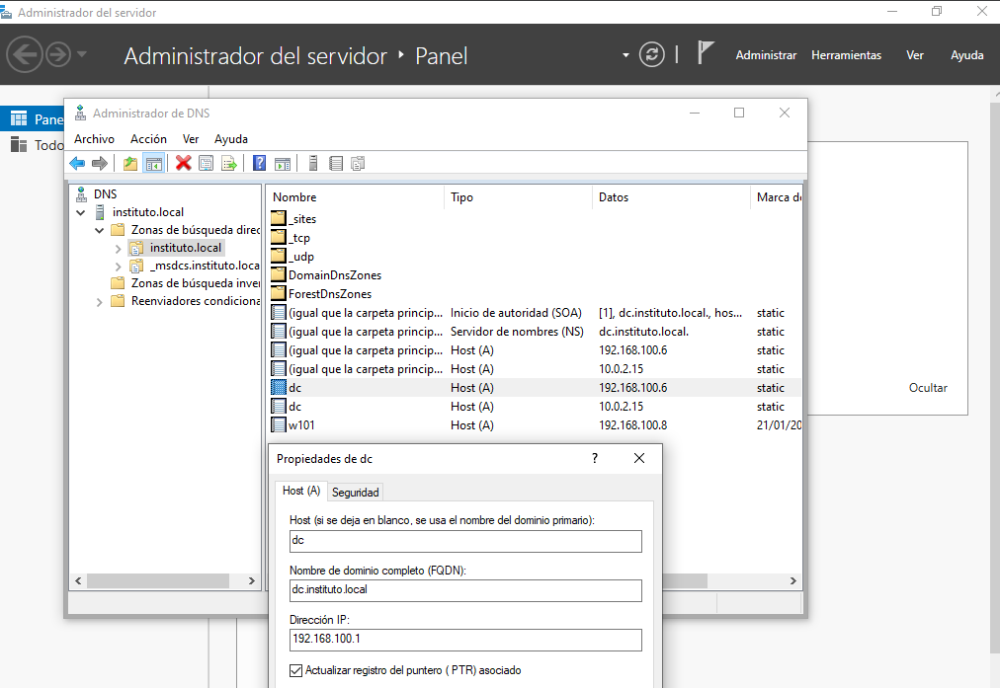
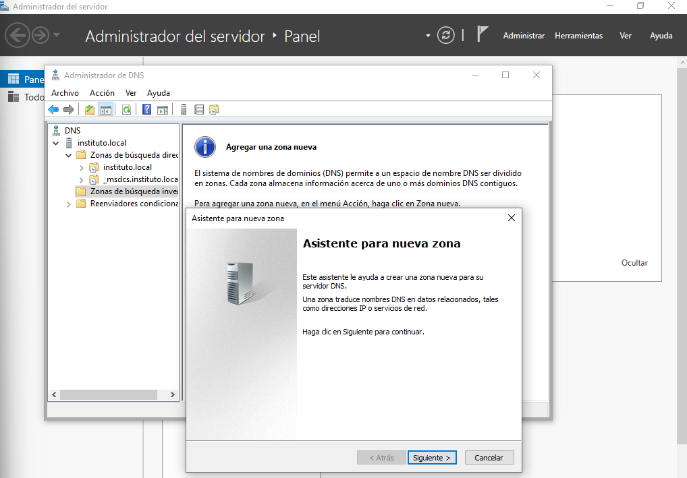
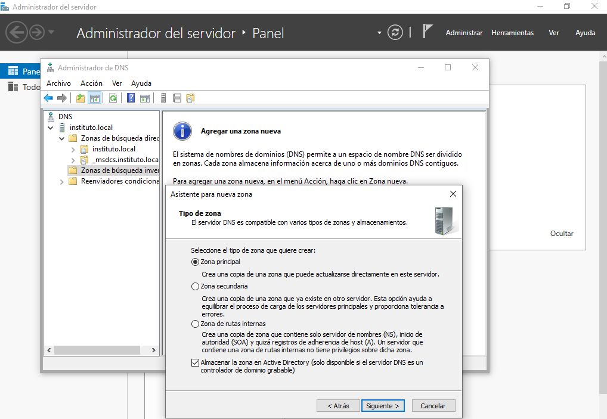
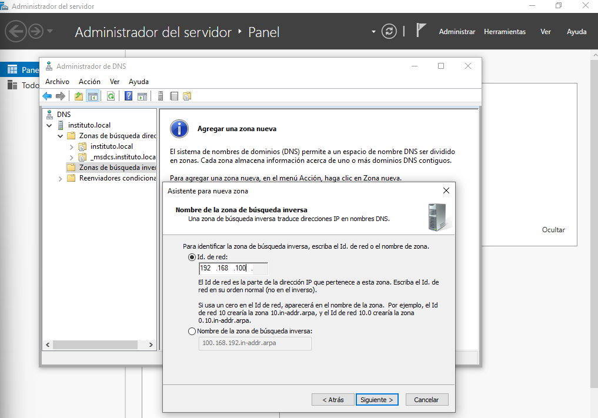
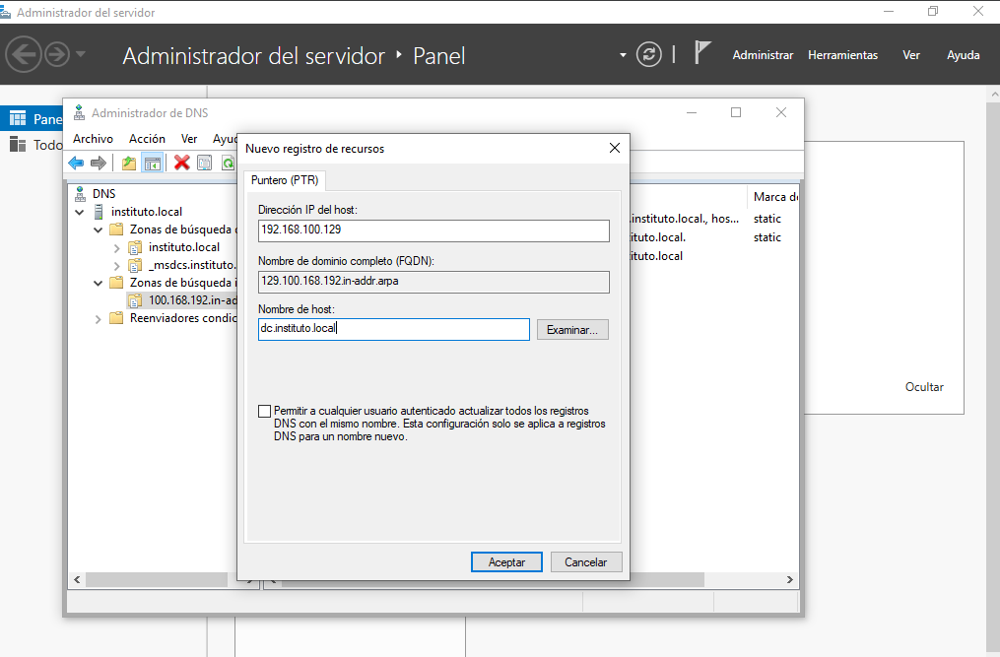

# 07 Servidor DHCP con dos subredes

Vamos a instalar un servidor DHCP en nuestro controlador de dominio tenido en cuenta el contexto de tu proyecto (Servidor Samba4 AD-DC con clientes Windows y Ubuntu) y dos máquinas cliente. En nuestra red las máquinas tienen las siguientes IPs:

- **Ubuntu Server**: 192.168.100.6/24.
- **Ubuntu Desktop**: 192.168.100.7/24.
- **Windows 10**: 192.168.100.8/24.

Vamos a realizar las modificaciones necesarias para poder tener dos subredes teniendo en cuenta que al tener el CIDR 192.168.100.0/24 vamos a dividir la red en dos subredes iguales (192.168.100.0/25 y 192.168.100.128/25):

- **Ubuntu Server**: Tenemos que añadir un nuevo adaptador de red para trabajar una interfaz en la red de Ubuntu Desktop (192.168.100.1/25) y la otra interfaz en la red de Windows 10 (192.168.100.129/25).
- **Ubuntu Desktop**: Trabajará e la red 192.168.100.0/25 siendo esta la Subred1.
- **Windows 10**: Trabajará e la red 192.168.100.128/25 siendo esta la Subred2.

Tenemos que realizar entonces las siguientes modificaciones en nuestro Ubuntu Server para configurar estas IPs de forma estática:

```bash
network:
  version: 2
  ethernets:
    enp0s3:
      dhcp4: true
    enp0s8:
      addresses:
        - 192.168.100.1/25
    enp0s9:
      addresses:
        - 192.168.100.129/25
```

```bash
enp0s8: <BROADCAST,MULTICAST,UP,LOWER_UP> mtu 1500 qdisc fq_codel state UP group default qlen 1000
    link/ether 08:00:27:a0:71:dc brd ff:ff:ff:ff:ff:ff
    inet 192.168.100.1/25 brd 192.168.100.127 scope global enp0s8
       valid_lft forever preferred_lft forever
    inet6 fe80::a00:27ff:fea0:71dc/64 scope link
       valid_lft forever preferred_lft forever
enp0s9: <BROADCAST,MULTICAST,UP,LOWER_UP> mtu 1500 qdisc fq_codel state UP group default qlen 1000
    link/ether 08:00:27:bc:38:14 brd ff:ff:ff:ff:ff:ff
    inet 192.168.100.129/25 brd 192.168.100.255 scope global enp0s9
       valid_lft forever preferred_lft forever
    inet6 fe80::a00:27ff:febc:3814/64 scope link
       valid_lft forever preferred_lft forever
```

## Implementación del servidor DHCP

### 1. Instalación del Servidor DHCP

El primer paso consiste en actualizar los repositorios e instalar el software necesario.

```bash
root@dc:~# apt update && apt install -y isc-dhcp-server
```

### 2. Configuración de las Interfaces de Red

Debemos indicar al servicio DHCP por qué tarjetas de red debe "escuchar" y servir direcciones IP.

```bash
root@dc:~# grep INTERFACESv4 /etc/default/isc-dhcp-server
INTERFACESv4="enp0s8 enp0s9"
```

- **`INTERFACESv4="..."`**: Aquí definimos las interfaces físicas o virtuales por las que el servidor aceptará peticiones DHCP.
- En nuestro caso, al poner `"enp0s8 enp0s9"`, estamos indicando que queremos servir IPs por dos tarjetas de red diferentes, lo cual coincide con nuestra estrategia de tener dos redes separadas.

### 3. Configuración Principal del Servicio (dhcpd.conf)

A continuación editamos el archivo `/etc/dhcp/dhcpd.conf` donde se definen las reglas del reparto de IPs.

#### Opciones Globales (Configuración del Dominio)

Estas líneas se colocan al principio para afectar a todas las subredes (a menos que se especifique lo contrario dentro de una subred).

```bash
option domain-name "instituto.local";
option domain-name-servers dc.instituto.local;

default-lease-time 3600;
max-lease-time 7200;
```

- **`option domain-name "instituto.local";`**: Asigna el sufijo DNS que se entregará a los clientes. Esto es vital para nuestro **Samba AD-DC**, ya que permite que los equipos se encuentren usando nombres cortos (ej. `pc1.instituto.local`).
- **`option domain-name-servers dc.instituto.local;`**: Especifica la dirección del servidor DNS que usarán los clientes. En un entorno de Dominio (AD), **este DNS debe ser el propio Servidor Samba AD-DC**.

- **`default-lease-time 3600`**: El tiempo (en segundos) que una IP se asigna a un cliente por defecto si este no pide un tiempo específico.
- **`max-lease-time 7200`**: El tiempo máximo que se le permite tener la IP antes de obligar a renovarla.

#### Activación del Modo Autoritativo

Descomentamos la siguiente directiva indicando que nuestro Ubuntu Server actua como servidor DHCP.

```bash
authoritative;
```

- **`authoritative;`**: Esta línea es crucial. Le dice al servidor: "Yo soy el servidor DHCP oficial y legítimo de esta red". Si un cliente intenta renovar una IP antigua que no es válida en esta red, este servidor tiene la potestad de rechazarla y forzarle a coger una nueva inmediatamente, acelerando la conexión.

#### Definición de Subredes

Configuramos los rangos específicos para cada una de las dos redes en el fichero `/etc/dhcp/dhcpd.conf`.

##### Subred 1 (Parte baja - 192.168.100.0/25)

Esta subred abarca desde la IP `.0` hasta la `.127`.

```bash
subnet 192.168.100.0 netmask 255.255.255.128 {
    option routers 192.168.100.1;
    option subnet-mask 255.255.255.128;
    option domain-search "instituto.local";
    option domain-name-servers 192.168.100.1;
    range 192.168.100.10 192.168.100.110;
}
```

- **`subnet 192.168.100.0 netmask 255.255.255.128`**: Define el primer bloque de la red. Observemos que la máscara termina en **.128** (equivalente a /25), lo que limita esta red a solo la mitad de las direcciones disponibles (hasta la .127).
- **`option routers 192.168.100.1;`**: Es la **Puerta de Enlace (Gateway)**. Hemos asignado la primera IP útil de este bloque a la interfaz del servidor (`enp0s8`).
- **`option subnet-mask 255.255.255.128;`**: Es vital que esta máscara coincida con la definición de la subnet. Indica a los clientes que la red se "corta" en la .127.
- **`option domain-search "instituto.local";`**: Especifica el nombre del dominio.
- **`option domain-name-servers 192.168.100.1;`**: El DNS apunta a la propia IP del servidor en esta subred para que resuelva el dominio Samba.
- **`range 192.168.100.10 192.168.100.110;`**: El **Pool de IPs**. Se entregan IPs desde la .10 hasta la .110. Es importante no sobrepasar la .126, que es la última IP utilizable de este bloque.

##### Subred 2 (Parte alta - 192.168.100.128/25)

Esta subred abarca desde la IP `.128` hasta la `.255`.

```bash
subnet 192.168.100.128 netmask 255.255.255.128 {
    option routers 192.168.100.129;
    option subnet-mask 255.255.255.128;
    option domain-search "instituto.local";
    option domain-name-servers 192.168.100.129;
    range 192.168.100.140 192.168.100.240;
}
```

#### Reiniciamos el servicio DHCP

Debemos reiniciar el servicio para que este comience a funcionar.

```bash
root@dc:~# systemctl restart isc-dhcp-server
root@dc:~# systemctl status isc-dhcp-server
● isc-dhcp-server.service - ISC DHCP IPv4 server
     Loaded: loaded (/usr/lib/systemd/system/isc-dhcp-server.service; enabled; preset: enabled)
     Active: active (running) since Wed 2026-01-21 19:48:57 CET; 3s ago
       Docs: man:dhcpd(8)
   Main PID: 1480 (dhcpd)
      Tasks: 1 (limit: 4605)
     Memory: 3.9M (peak: 4.1M)
        CPU: 36ms
     CGroup: /system.slice/isc-dhcp-server.service
             └─1480 dhcpd -user dhcpd -group dhcpd -f -4 -pf /run/dhcp-server/dhcpd.pid -cf /etc/dhcp/dhcpd.conf enp0s8 enp0>

ene 21 19:48:57 dc sh[1480]: Listening on LPF/enp0s9/08:00:27:bc:38:14/192.168.100.128/25
ene 21 19:48:57 dc sh[1480]: Sending on   LPF/enp0s9/08:00:27:bc:38:14/192.168.100.128/25
ene 21 19:48:57 dc dhcpd[1480]: Sending on   LPF/enp0s9/08:00:27:bc:38:14/192.168.100.128/25
ene 21 19:48:57 dc dhcpd[1480]: Listening on LPF/enp0s8/08:00:27:a0:71:dc/192.168.100.0/25
ene 21 19:48:57 dc sh[1480]: Listening on LPF/enp0s8/08:00:27:a0:71:dc/192.168.100.0/25
ene 21 19:48:57 dc sh[1480]: Sending on   LPF/enp0s8/08:00:27:a0:71:dc/192.168.100.0/25
ene 21 19:48:57 dc sh[1480]: Sending on   Socket/fallback/fallback-net
ene 21 19:48:57 dc dhcpd[1480]: Sending on   LPF/enp0s8/08:00:27:a0:71:dc/192.168.100.0/25
ene 21 19:48:57 dc dhcpd[1480]: Sending on   Socket/fallback/fallback-net
ene 21 19:48:57 dc dhcpd[1480]: Server starting service.
```

## Configuraciones en clientes

### Configuración de Ubuntu Desktop

Editamos el fichero de configuración de netplan para así decirle que recibimos una IPv4 por DHCP y aplicamos los cambios.

```bash
network:
  version: 2
  renderer: NetworkManager
  ethernets:
    enp0s3:
      renderer: networkd
      dhcp4: true
```

```bash
root@ud101:~# ping -c 4 192.168.100.1
PING 192.168.100.1 (192.168.100.1) 56(84) bytes of data.
64 bytes from 192.168.100.1: icmp_seq=1 ttl=64 time=2.77 ms
64 bytes from 192.168.100.1: icmp_seq=2 ttl=64 time=1.28 ms
64 bytes from 192.168.100.1: icmp_seq=3 ttl=64 time=1.13 ms
64 bytes from 192.168.100.1: icmp_seq=4 ttl=64 time=0.903 ms

--- 192.168.100.1 ping statistics ---
4 packets transmitted, 4 received, 0% packet loss, time 3003ms
rtt min/avg/max/mdev = 0.903/1.519/2.770/0.734 ms
```

### Configuración de Windows 10

Tenemos que realizar la modificación necesaria para que el equipo adquiera una IP de forma automática del rango concreto especificado y que tengamos conectividad con el AD-DC.


```bash
C:\Users\usuario>ipconfig /all

Configuración IP de Windows

   Nombre de host. . . . . . . . . : w101
   Sufijo DNS principal  . . . . . : instituto.local
   Tipo de nodo. . . . . . . . . . : híbrido
   Enrutamiento IP habilitado. . . : no
   Proxy WINS habilitado . . . . . : no
   Lista de búsqueda de sufijos DNS: instituto.local

Adaptador de Ethernet Ethernet:

   Sufijo DNS específico para la conexión. . : instituto.org
   Descripción . . . . . . . . . . . . . . . : Intel(R) PRO/1000 MT Desktop Adapter
   Dirección física. . . . . . . . . . . . . : 08-00-27-4A-E8-B4
   DHCP habilitado . . . . . . . . . . . . . : sí
   Configuración automática habilitada . . . : sí
   Vínculo: dirección IPv6 local. . . : fe80::12fe:4f07:30d4:41cd%3(Preferido)
   Dirección IPv4. . . . . . . . . . . . . . : 192.168.100.140(Preferido)
   Máscara de subred . . . . . . . . . . . . : 255.255.255.128
   Concesión obtenida. . . . . . . . . . . . : miércoles, 21 de enero de 2026 20:20:50
   La concesión expira . . . . . . . . . . . : miércoles, 21 de enero de 2026 21:21:53
   Puerta de enlace predeterminada . . . . . : 192.168.100.129
   Servidor DHCP . . . . . . . . . . . . . . : 192.168.100.129
   IAID DHCPv6 . . . . . . . . . . . . . . . : 101187623
   DUID de cliente DHCPv6. . . . . . . . . . : 00-01-00-01-30-F3-24-5D-08-00-27-4A-E8-B4
   Servidores DNS. . . . . . . . . . . . . . : 192.168.100.129
   NetBIOS sobre TCP/IP. . . . . . . . . . . : habilitado
   Lista de búsqueda de sufijos DNS específicos de conexión:   instituto.local

C:\Users\usuario>ping 192.168.100.129

Haciendo ping a 192.168.100.129 con 32 bytes de datos:
Respuesta desde 192.168.100.129: bytes=32 tiempo=1ms TTL=64
Respuesta desde 192.168.100.129: bytes=32 tiempo=1ms TTL=64
Respuesta desde 192.168.100.129: bytes=32 tiempo=1ms TTL=64
Respuesta desde 192.168.100.129: bytes=32 tiempo=1ms TTL=64

Estadísticas de ping para 192.168.100.129:
    Paquetes: enviados = 4, recibidos = 4, perdidos = 0
    (0% perdidos),
Tiempos aproximados de ida y vuelta en milisegundos:
    Mínimo = 1ms, Máximo = 1ms, Media = 1ms
```

## Modificación de NFTABLES

Actualmente tenemos una configuración de nftables que permite la salida de nuestra red a través de la interfaz enp0s3 para la red 192.168.100.0/24. Actualmente tenemos dos subredes y por lo tanto tenemos que editar esta configuración.

```bash
root@dc:~# nft list table nat
table ip nat {
        chain postrouting {
                type nat hook postrouting priority srcnat; policy accept;
                oifname "enp0s3" ip saddr 192.168.100.0/24 counter packets 88 bytes 4752 masquerade
        }
}
```

Añadimos las siguientes reglas para nuestras subredes.

```bash
root@dc:~# nft add rule ip nat postrouting oifname "enp0s3" ip saddr 192.168.100.0/25 counter masquerade
root@dc:~# nft add rule ip nat postrouting oifname "enp0s3" ip saddr 192.168.100.128/25 counter masquerade
```

```bash
root@dc:~# nft list table nat
table ip nat {
        chain postrouting {
                type nat hook postrouting priority srcnat; policy accept;
                oifname "enp0s3" ip saddr 192.168.100.0/24 counter packets 90 bytes 4856 masquerade
                oifname "enp0s3" ip saddr 192.168.100.0/25 counter packets 0 bytes 0 masquerade
                oifname "enp0s3" ip saddr 192.168.100.128/25 counter packets 0 bytes 0 masquerade
        }
}
```

Hacemos persistente la configuración de las reglas.

````bash
root@dc:~# nft list ruleset
table ip nat {
        chain postrouting {
                type nat hook postrouting priority srcnat; policy accept;
                oifname "enp0s3" ip saddr 192.168.100.0/24 counter packets 1 bytes 52 masquerade
                oifname "enp0s3" ip saddr 192.168.100.0/25 counter packets 0 bytes 0 masquerade
                oifname "enp0s3" ip saddr 192.168.100.128/25 counter packets 0 bytes 0 masquerade
        }
}
root@dc:~# nft list ruleset > /etc/nftables.conf
root@dc:~# systemctl restart nftables```
````

En estos momentos los clientes deberían tener salida a internet.

## Configuración del Servidor Samba4 AD-DC

Tenemos que realizar la configuración de chrony para que los clientes sean capaces de sincronizarse con el servidor con los nuevos parámetros de red.

En un entorno Active Directory (AD), la autenticación funciona mediante un protocolo llamado Kerberos. Kerberos es extremadamente sensible al tiempo: si el reloj del servidor y el del cliente difieren en más de 5 minutos, el inicio de sesión fallará.

Por eso configuramos chrony para que el servidor Samba sea también el "reloj de referencia" de toda la red. Para ello editamos el fichero `/etc/chrony/chrony.conf` con la siguiente información de red.

```bash
# Configuración para NTP del AD
bindcmdaddress 192.168.100.1
bindcmdaddress 192.168.100.129
allow 192.168.100.0/25
allow 192.168.100.128/25
ntpsigndsocket /var/lib/samba/ntp_signd
```

### Otras configuraciones menores en los clientes

#### Cliente Ubuntu Desktop

Tenemos que editar el fichero `/etc/hosts` con la información correcta ya que ahora no es necesaria las entradas de instituto.local y dc.instituto.local ya que son asignadas directamente por el servidor.

```bash
root@ud101:~# cat /etc/hosts
127.0.0.1 localhost
127.0.1.1 ubuntu

# The following lines are desirable for IPv6 capable hosts
::1     ip6-localhost ip6-loopback
fe00::0 ip6-localnet
ff00::0 ip6-mcastprefix
ff02::1 ip6-allnodes
ff02::2 ip6-allrouters
```

Podemos ver que el servidor ya nos asigna la información de instituto.local y dc.instituto.local al final del archivo `/etc/resolv.conf`

```bash
root@ud101:~# tail -1 /etc/resolv.conf
search instituto.org instituto.local
```

Podemos ver como tenemos ping con instituto.local.

```bash
root@ud101:~# ping -c 3 instituto.local
PING instituto.local (192.168.100.1) 56(84) bytes of data.
64 bytes from instituto.local (192.168.100.1): icmp_seq=1 ttl=64 time=24.7 ms
64 bytes from instituto.local (192.168.100.1): icmp_seq=2 ttl=64 time=1.89 ms
64 bytes from instituto.local (192.168.100.1): icmp_seq=3 ttl=64 time=1.57 ms
--- instituto.local ping statistics ---
3 packets transmitted, 3 received, 0% packet loss, time 2010ms
rtt min/avg/max/mdev = 1.572/9.380/24.680/10.819 ms

root@ud101:~# ping -c 3 dc.instituto.local
PING dc.instituto.local (192.168.100.1) 56(84) bytes of data.
64 bytes from instituto.local (192.168.100.1): icmp_seq=1 ttl=64 time=5.59 ms
64 bytes from instituto.local (192.168.100.1): icmp_seq=2 ttl=64 time=1.65 ms
64 bytes from instituto.local (192.168.100.1): icmp_seq=3 ttl=64 time=1.49 ms
--- dc.instituto.local ping statistics ---
3 packets transmitted, 3 received, 0% packet loss, time 2002ms
rtt min/avg/max/mdev = 1.492/2.908/5.589/1.896 ms
```

#### Windows 10 con RSAT

Debemos hacer modificaciones del DNS en las zonas de búsqueda tanto directa como inversa. Para comprenderlo de forma sencilla podemos hacer un símil como el siguiente entendiendo el DNS como la "agenda telefónica" de la red. Sin esa agenda, tu servidor Active Directory y tus clientes (Windows/Ubuntu) no podrían comunicarse entre si. En un servidor DNS, las zonas son las dos formas posibles de buscar información:

- **Zona de Búsqueda Directa**: "Tengo el nombre, quiero la IP". Es la zona más importante y obligatoria. Sin ella, Active Directory no funciona. Convierte nombres de equipos (hostnames) en direcciones IP. Cuando un cliente Windows o linux quiere iniciar sesión, le pregunta al DNS: "¿Dónde está el controlador de dominio dc.instituto.local?" respondiendo: "Está en la IP 192.168.100.1/192.168.100.129".
- **Zona de Búsqueda Inversa**: "Tengo la IP, quiero el nombre". Es la zona "espejo". No es estrictamente obligatoria para que el dominio arranque, pero es muy recomendada para evitar errores extraños, lentitud y problemas de diagnóstico. Se encarga de convertir la direcciones IP en nombres de equipos. En nuestro caso si hacemos un ping a 192.168.100.100 y queremos saber cómo se llama ese equipo, el servidor consulta esta zona. La respuesta sería "Esa IP pertenece a alumno.instituto.local".

En la zona de búsqueda directa tendremos que editar el Host dc que presenta la IP 192.168.100.6/24 por la IP 192.168.100.1/25 y actualizar el puntero.

A mayores tenemos que añadir un nuevo host para la otra surbred con la IP 192.168.100.129/25 y marcar la opción del puntero.


Estas dos modificaciones permitirán a los clientes saber quien es dc, es decir, la IP del AD-DC que en función de la subred tendrá una IP u otra. Este es el motivo por el cual podemos eliminar del cliente Ubuntu Desktop las entradas del `/etc/hosts`.

Ahora vamos a crear las zonas inversas.







Una vez creada la zona de búsqueda inversa creamos las dos entradas del servidor para que cualquiera de los equipos de la subred pueda ejecutar un **nslookup** y ver para una IP que nombre de dominio tiene el equipo en cuestión.





Desde Windows 10.

```bash
C:\Users\alumno>nslookup dc
Servidor:  dc.instituto.local
Address:  192.168.100.129

Nombre:  dc.instituto.local
Addresses:  192.168.100.1
          10.0.2.15
          192.168.100.129
```

Desde Ubuntu Desktop.

```bash
alumno@ud101:~$ nslookup dc.instituto.local
Server:		127.0.0.53
Address:	127.0.0.53#53

dc.instituto.local	canonical name = instituto.local.
Name:	instituto.local
Address: 192.168.100.1

alumno@ud101:~$ nslookup 192.168.100.1
1.100.168.192.in-addr.arpa	name = instituto.local.
1.100.168.192.in-addr.arpa	name = dc.instituto.local.
1.100.168.192.in-addr.arpa	name = dc.
1.100.168.192.in-addr.arpa	name = instituto.

alumno@ud101:~$ ping -c3 google.es
PING google.es (142.250.185.3) 56(84) bytes of data.
64 bytes from mad41s11-in-f3.1e100.net (142.250.185.3): icmp_seq=1 ttl=116 time=55.7 ms
64 bytes from mad41s11-in-f3.1e100.net (142.250.185.3): icmp_seq=2 ttl=116 time=56.0 ms
64 bytes from mad41s11-in-f3.1e100.net (142.250.185.3): icmp_seq=3 ttl=116 time=47.5 ms

--- google.es ping statistics ---
3 packets transmitted, 3 received, 0% packet loss, time 2009ms
rtt min/avg/max/mdev = 47.483/53.048/55.984/3.937 ms
```

1. El primer comando **nslookup dc.instituto.local** prueba la **Zona de Búsqueda Directa**.

- **Server: 127.0.0.53**: Indica que Ubuntu está usando su servicio interno (_systemd-resolved_) para gestionar la petición. Este servicio reenvía la consulta al servidor Samba.
- **Address: 192.168.100.1**: **Éxito**. El servidor DNS ha respondido correctamente que el nombre _dc.instituto.local_ corresponde a la IP del servidor.

2. El segundo comando **nslookup 192.168.100.1** prueba la **Zona de Búsqueda Inversa** anteriormente configurada.

- Ateriormente hemos creado la zona _100.168.192.in-addr.arpa_ y dentro hay un registro **Puntero (PTR)** para la _192.168.100.1_. El comando devuelve 4 nombres (_instituto.local_, _dc.instituto.local_, _dc_, _instituto_). Este es el comportamiento normal de un Controlador de Dominio (DC). Esa única IP (_.1_) actúa como la cara de todo el dominio, la del servidor específico (_dc_) y los alias cortos (NetBIOS).

El cliente Ubuntu puede ver al servidor y el servidor sabe a quien corresponde la IP. La comunicación DNS está completa.

3. El tercer comando **ping -c3 google.es** prueba que el servidor Samba no solo resuelve lo interno, sino que está **reenviando** correctamente las peticiones de internet (forwarders) y la configuración NAT con _nftables_ es correcta.

### Configuraciones finales del servidor AD-DC

Teniendo en cuenta los cambios realizados anteriormente tenemos que editar los ficheros `/etc/hosts` ya que en este punto vamos a editar `/etc/resolv.conf` como DNS interno.

```bash
root@dc:~# cat /etc/hosts
127.0.0.1 localhost
127.0.1.1 ubuntuserver

# Configuraciones
# 192.168.100.1   dc.instituto.local dc instituto.local instituto

# The following lines are desirable for IPv6 capable hosts
::1     ip6-localhost ip6-loopback
fe00::0 ip6-localnet
ff00::0 ip6-mcastprefix
ff02::1 ip6-allnodes
ff02::2 ip6-allrouters
```

Editamos `/etc/resolv.conf` para modificar los datos del DNS interno.

```bash
root@dc:~# lsattr /etc/resolv.conf
----i---------e------- /etc/resolv.conf

root@dc:~# chattr -i /etc/resolv.conf

root@dc:~# lsattr /etc/resolv.conf
--------------e------- /etc/resolv.conf

root@dc:~# nano /etc/resolv.conf

root@dc:~# cat /etc/resolv.conf
nameserver 192.168.100.1
nameserver 8.8.8.8
search instituto.local
```

Podemos ver que el DNS funciona y resulve la autenticación.

```bash
root@dc:~# ping -c3 w101
PING w101.instituto.local (192.168.100.140) 56(84) bytes of data.
64 bytes from 192.168.100.140: icmp_seq=1 ttl=128 time=1.36 ms
64 bytes from 192.168.100.140: icmp_seq=2 ttl=128 time=0.637 ms
64 bytes from 192.168.100.140: icmp_seq=3 ttl=128 time=1.18 ms

--- w101.instituto.local ping statistics ---
3 packets transmitted, 3 received, 0% packet loss, time 2069ms
rtt min/avg/max/mdev = 0.637/1.058/1.355/0.306 ms
```
