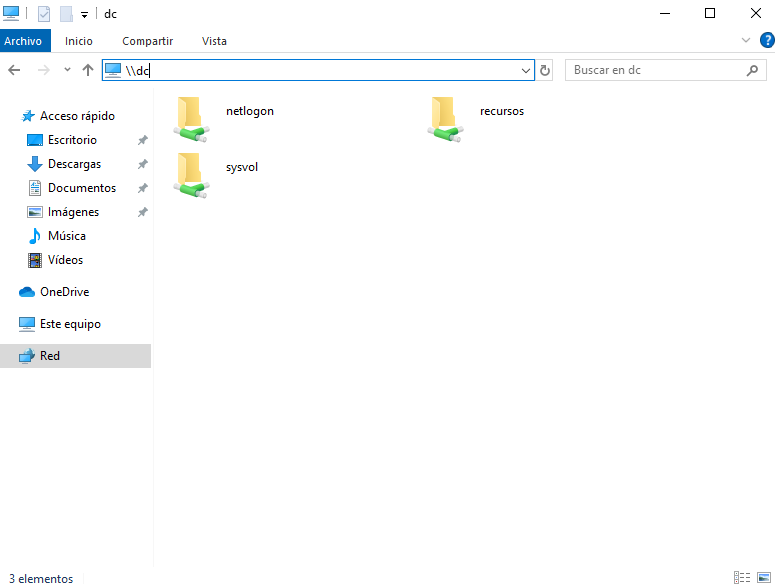
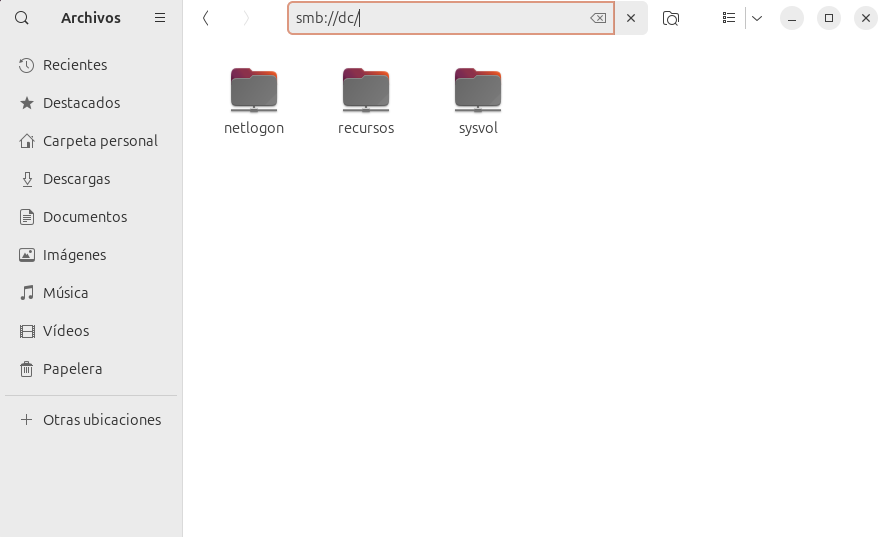
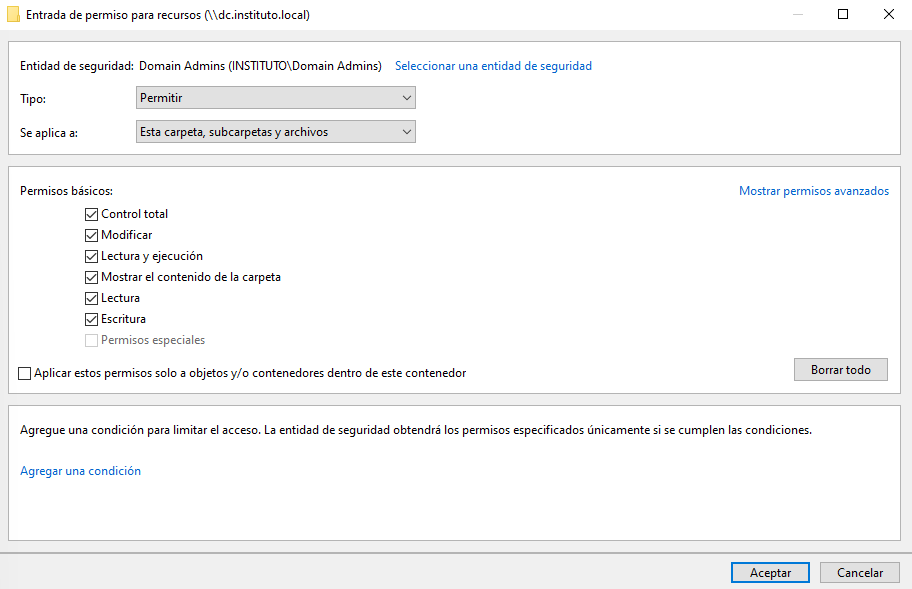
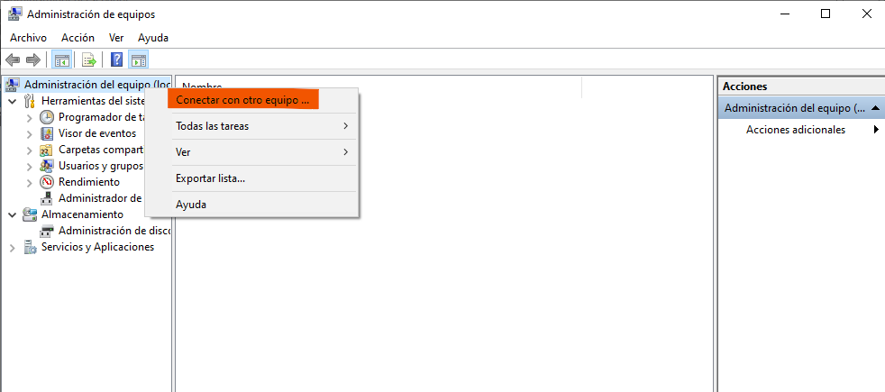
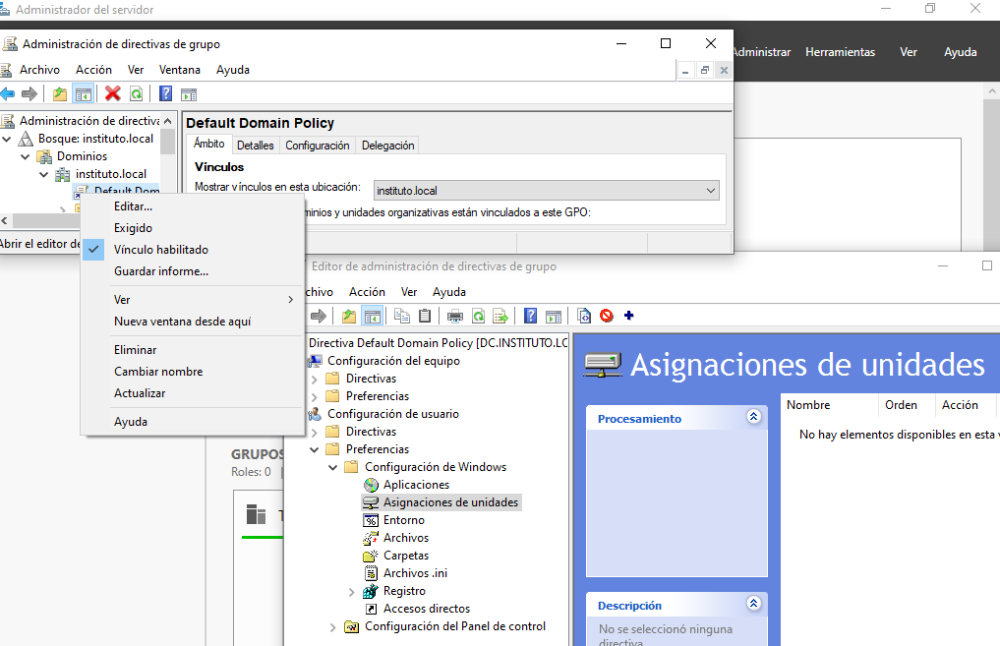
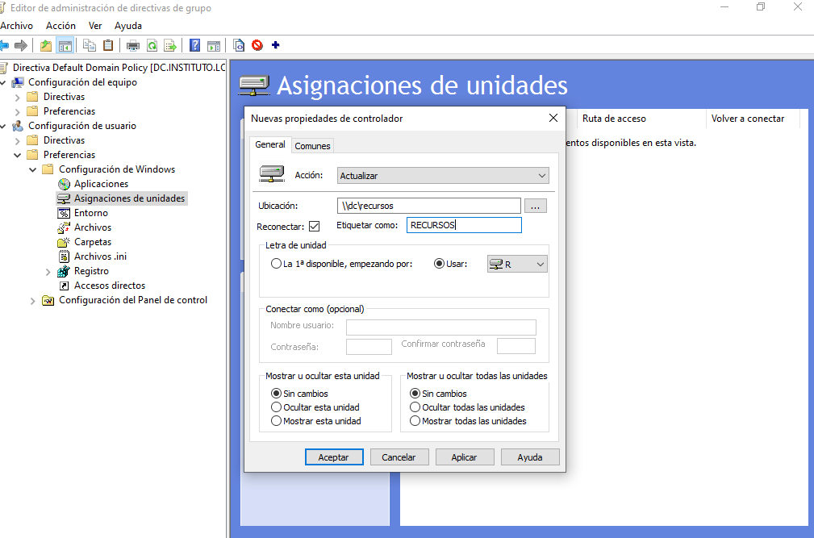
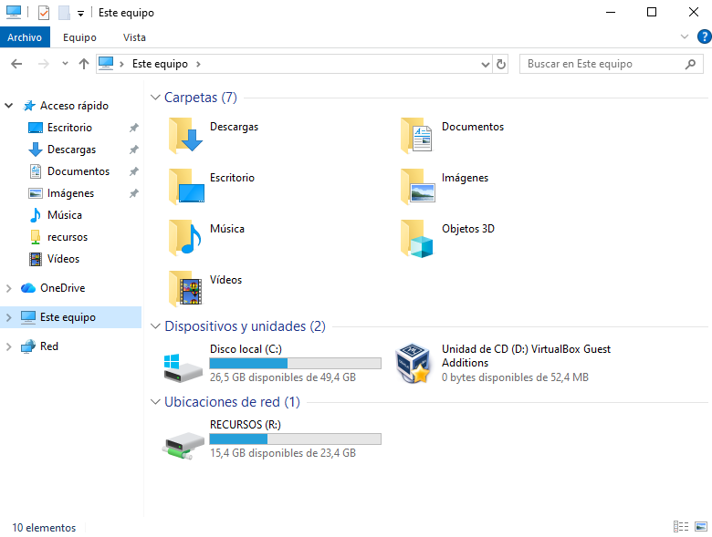

# 09 Recurso compartido

En este punto vamos a realizar los pasos necesarios para crear, gestionar y acceder a un recurso compartido en nuestro directorio activo en el servidor Samba 4 funciona como Controlador de Dominio de Active Directory (AD). Desde la creación del directorio compartido hasta la configuración de permisos y el acceso desde clientes Windows y Linux, cada paso se presenta de manera clara y concisa para facilitar el proceso.

En entornos empresariales donde se utiliza Samba 4 como Controlador de Dominio de Active Directory, configurar y administrar recursos compartidos es fundamental para facilitar el acceso a archivos y carpetas en la red. Vamos a detallar los pasos para:

- Crear un directorio compartido en el servidor Samba 4 AD DC.
- Configurar el recurso compartido Samba en el archivo de configuración de Samba.
- Administrar permisos de acceso desde el Explorador de archivos de Windows y la Administración de equipos.
- Asignar el recurso compartido mediante políticas de grupo (GPO) para su montaje automático en clientes Windows.
- Acceder al recurso compartido desde clientes Linux, instalando los paquetes necesarios y utilizando comandos específicos de Samba.

El procedimiento es el siguiente:

## Configuración en el servidor Samba

1. Creamos el recurso compartido.

```bash
root@dc:~# mkdir /recursos
root@dc:~# chmod -R 755 /recursos/
root@dc:~# ls -ld /recursos/
drwxr-xr-x 2 root root 4096 ene 23 09:06 /recursos/
```

2. A continuación vamos a establecer como usuario propietario a root y como grupo los usuarios del dominio.

```bash
root@dc:~# chown -R root:"domain users" /recursos/
root@dc:~# ls -ld /recursos/
drwxr-xr-x 2 root users 4096 ene 23 09:06 /recursos/
```

3. Indicamos en la configuración del servidor cual va a ser el recurso compartido y reiniciamos el servidor Samba.

```bash
root@dc:~# tail -3  /etc/samba/smb.conf
[recursos]
        path = /recursos
        read only = no
root@dc:~# systemctl restart samba-ad-dc.service
```

## Configuración con las RSAT

1. Llegados a este punto podemos ver la carpeta de recursos compartidos.
   
   

Además podemos modificar los permisos si entramos como usuario administrator para que los usuarios del dominio tengan permisos de lectura y ejecución en la carpeta recursos, subcarpetas y archivos mientras que los administradores del dominio tengan control total.




Tambien podemos administrar los recursos compartidos desde el _Administrador de equipos_.



2. Vamos a crear una GPO que nos permita que los equipos Windows del dominio al encender se conecte automáticamente al recurso compartido donde tenemos un fichero EMANEN.txt.



Creamos una nueva unidad llamada recursos con la letra: R y la etiqueta: RECURSOS.



Forzamos la aplicación de la GPO para que una vez arrancado el equipo tengamos la unidad de red.



## Configuración el Ubuntu Desktop

1. Instalamos el cliente smb para la compartición del recurso y cift-utils.

- **smbclient**: Es una herramienta para la comunicación con el servidor Samba de forma manual.
- **cift-utils**: Fundamenal para permitir la integración del recurso compartido se integre en el sistema de archivos comprendiendo el protocolo SMB/CIFS.

```bash
root@ud101:~# apt update && apt install -y smbclient cift-utils
```

2. Conexión por linea de comandos.

```bash
root@ud101:~# smbclient -L dc.instituto.local -U%

	Sharename       Type      Comment
	---------       ----      -------
	sysvol          Disk
	netlogon        Disk
	recursos        Disk
	IPC$            IPC       IPC Service (Samba 4.19.5-Ubuntu)
SMB1 disabled -- no workgroup available
```

```bash
root@ud101:~# smbclient //dc/recursos -U administrator
Password for [INSTITUTO\administrator]:
Try "help" to get a list of possible commands.
smb: \> ls
  .                                   D        0  Fri Jan 23 10:13:27 2026
  ..                                  D        0  Fri Jan 23 10:13:27 2026
  EXAMEN.txt                          A       29  Fri Jan 23 10:14:19 2026

		24590672 blocks of size 1024. 16204456 blocks available
smb: \> get EXAMEN.txt
getting file \EXAMEN.txt of size 29 as EXAMEN.txt (0,5 KiloBytes/sec) (average 0,3 KiloBytes/sec)
smb: \> exit
root@ud101:~# ls
EXAMEN.txt

root@ud101:~# cat EXAMEN.txt
Aprendiendo sobre Dominios :)
```

3. Proceso de forma gráfica

Es interesante que tengamos de forma gráfica la carpeta de recursos integrada en el sistema. Para ello podemos realizar los siguientes pasos:


4. Configuración para montaje de recurso de forma persistente

Este proceso podemos hacerlo editando el archivo `/etc/fstab` para configurar el montaje persistente en el cliente.

- Crear el directorio de montaje

```bash
root@ud101:~$ mkdir -p /mnt/recursos

```

- Crear el archivo de credenciales seguro.

```bash
root@ud101:~$ nano /etc/samba/.smbcredentials
root@ud101:~$ cat /etc/samba/.smbcredentials
username=administrator
password=abc123.
domain=INSTITUTO
```

- Protegemos el archivo de credenciales

```bash
root@ud101:~$ chmod 600 /etc/samba/.smbcredentials

```

- Editar el fichero `/etc/fstab`

```bash
root@ud101:~$ nano /etc/fstab

```

Añadimos la siguiente línea al final del archivo:

````bash
//dc/recursos /mnt/recursos cifs defaults,user,credentials=/etc/samba/.smbcredentials 0 2
```

- Probamos el montaje y verificamos.

```bash
root@ud101:~$ mount -a
````
