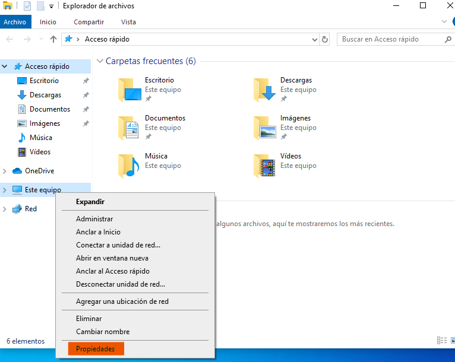
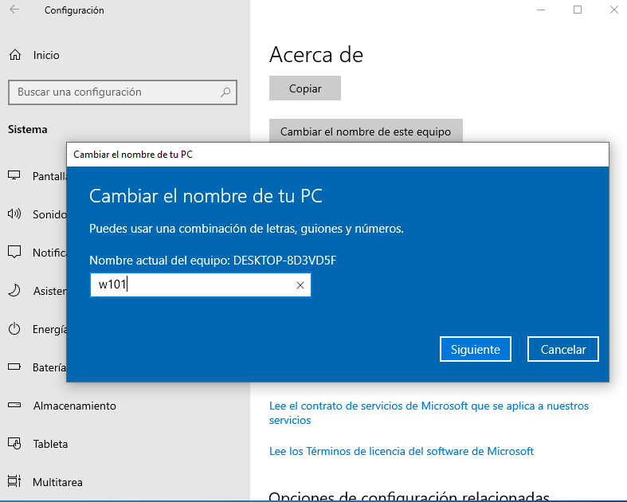
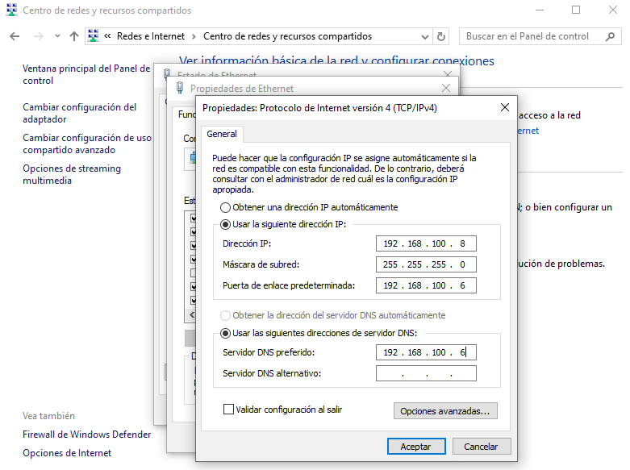
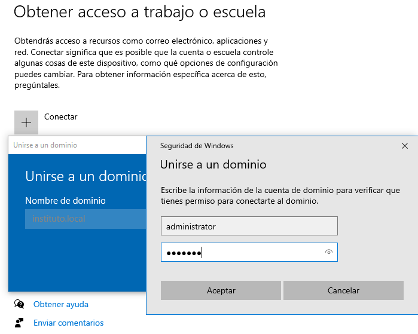
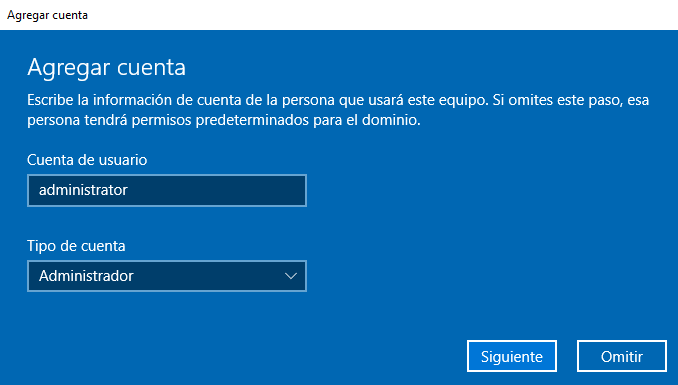
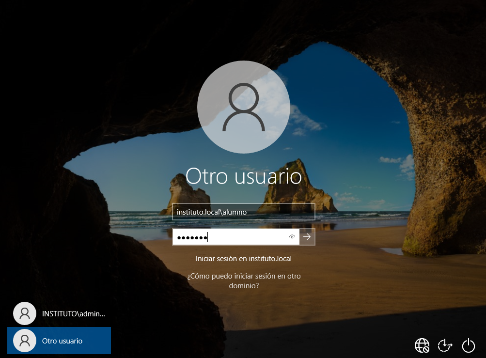

# 03 Unir Windows 10 al dominio

## Índice

1. [Cambiar el nombre del equipo](#cambiar-el-nombre-del-equipo)
2. [Unir el equipo al dominio](#unir-el-equipo-al-dominio)
3. [Verificación desde el Controlador de Dominio](#verificación-desde-el-controlador-de-dominio)

---

## Cambiar el nombre del equipo

Vamos a unir nuestro equipo `Windows 10` al dominio de Active Directory, pero antes vamos a editar el nombre del equipo para seguir una nomenclatura estándar, en este caso `w101` (Windows 10 - equipo 1). 

> **Importante:** Es fundamental establecer un nombre de equipo descriptivo antes de unirlo al dominio para facilitar su posterior identificación y gestión en el servidor `Samba`.

Para ello, realizamos los siguientes pasos desde la configuración del sistema:



Una vez aplicados los cambios y reiniciado el equipo, el sistema solicitará iniciar sesión nuevamente.



Podemos verificar que el cambio se ha aplicado correctamente abriendo una terminal (`cmd`) y ejecutando el siguiente comando:

```bash
C:\Users\usuario>whoami
w101\usuario
```

---

## Unir el equipo al dominio

A continuación, vamos a añadir el equipo al dominio `instituto.local`. Debemos asegurarnos de que el servidor DNS en la configuración de red de Windows apunte a la IP de nuestro `Ubuntu Server` (`192.168.100.6`).

Navegamos a las propiedades del sistema y seleccionamos la opción para cambiar la pertenencia a dominio:



Introducimos el nombre del dominio (`instituto.local`). El sistema nos pedirá las credenciales de un usuario con permisos para unir equipos al dominio (por ejemplo, el usuario `Administrator` del dominio).



Si todo es correcto, recibiremos un mensaje de bienvenida al dominio y se nos pedirá reiniciar el equipo para aplicar los cambios de seguridad y establecer la relación de confianza con el Controlador de Dominio.



---

## Verificación desde el Controlador de Dominio

Una vez reiniciado el equipo Windows, podemos comprobar desde nuestro `Ubuntu Server` que tenemos un nuevo equipo conectado a la estructura de Active Directory.

Listamos los equipos mediante la herramienta `samba-tool`:

```bash
root@dc:~# samba-tool computer list
W101$
DC$
```

Llegados a este punto, podemos acceder al equipo `Windows 10` no con una cuenta local, sino utilizando un usuario del dominio previamente creado (por ejemplo, el usuario `alumno`).

Para recordar los usuarios disponibles, podemos consultarlos en el servidor:

```bash
root@dc:~# samba-tool user list
alumno
Guest
Administrator
krbtgt
```

Finalmente, en la pantalla de inicio de sesión de Windows seleccionamos "Otro usuario" e introducimos las credenciales de dominio del usuario `alumno`:


