# 06 RSAT para administrar un servidor Samba

## Índice

1. [¿Qué son las RSAT?](#qué-son-las-rsat)
2. [Beneficios del uso de RSAT](#beneficios-del-uso-de-rsat)
3. [Instalación de las RSAT](#instalación-de-las-rsat)
4. [Uso de las herramientas administrativas](#uso-de-las-herramientas-administrativas)

---

## ¿Qué son las RSAT?

Vamos a hacer uso del equipo `Windows 10` cliente para administrar de forma remota el servidor `Samba4` (que se comporta y es el equivalente directo a un `Windows Server 2008 R2`).

Las **RSAT** (Remote Server Administration Tools o Herramientas de Administración Remota del Servidor) son un conjunto de utilidades creadas por Microsoft que permiten a los administradores de sistemas gestionar roles y características de servidores (como un Active Directory) de manera gráfica desde un equipo cliente (normalmente `Windows 10` u `11`), sin tener que iniciar sesión por consola o SSH directamente en el servidor Linux.

Para realizar este proceso debemos instalar las herramientas opcionales de RSAT en nuestro cliente Windows, habiendo iniciado sesión con el usuario `Administrator` del dominio. Necesitaremos las siguientes herramientas clave:

- **Active Directory Users and Computers**: Para administrar gráficamente la creación y modificación de usuarios, grupos, Unidades Organizativas (OUs) y equipos del AD.
- **DNS Manager**: Para gestionar de forma visual las zonas y registros del servidor DNS interno gestionado por `Samba`.
- **Group Policy Management Console (GPMC)**: Para crear y vincular las Políticas de Grupo (GPO) que se aplicarán a los ordenadores cliente.

---

## Beneficios del uso de RSAT

- **Simplificación de la administración**: Con RSAT, podemos administrar el servidor Samba 4 de forma remota desde un entorno de escritorio amigable, facilitando operaciones complejas que por línea de comandos resultarían tediosas.
- **Aumento de la productividad**: Con acceso directo a consolas centralizadas, podemos realizar tareas de soporte o mantenimiento de forma eficiente e intuitiva.
- **Integración con el entorno corporativo**: Al utilizar herramientas estándar y familiares proporcionadas por Windows, un administrador con conocimientos en Microsoft Server puede administrar directamente el servidor de `Samba 4` sin necesitar amplios conocimientos de administración de sistemas Linux.

---

## Instalación de las RSAT

Para la instalación de las herramientas RSAT en `Windows 10`, realizaremos los siguientes pasos desde el panel de "Características opcionales" de Configuración:

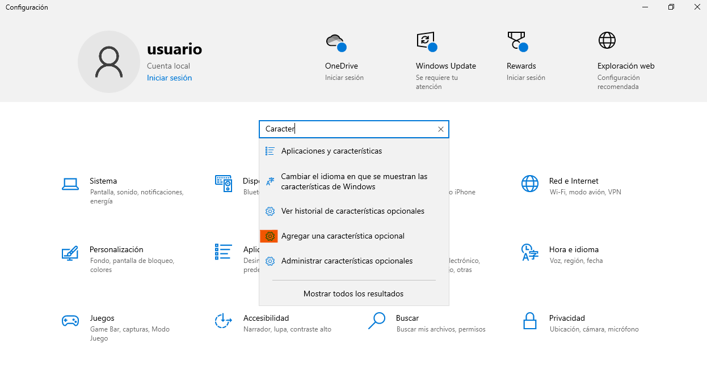
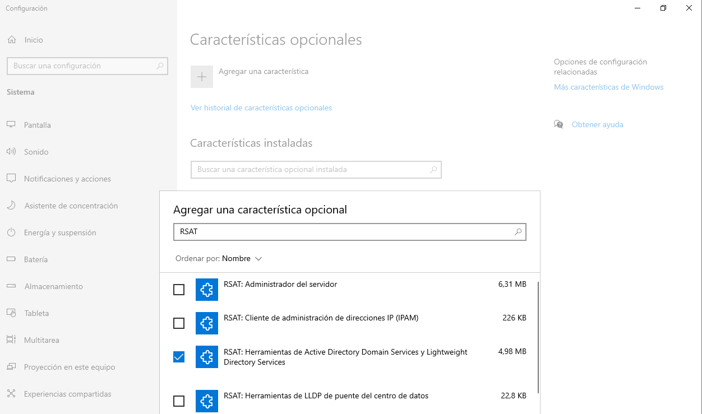
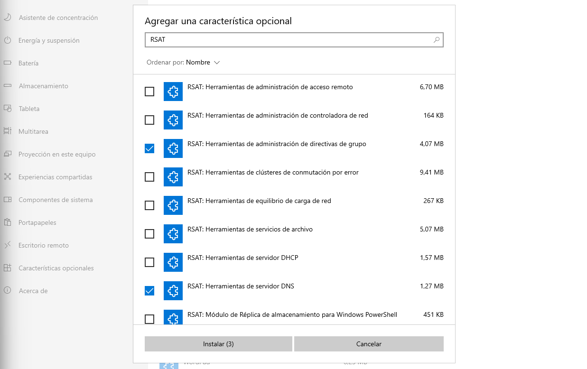
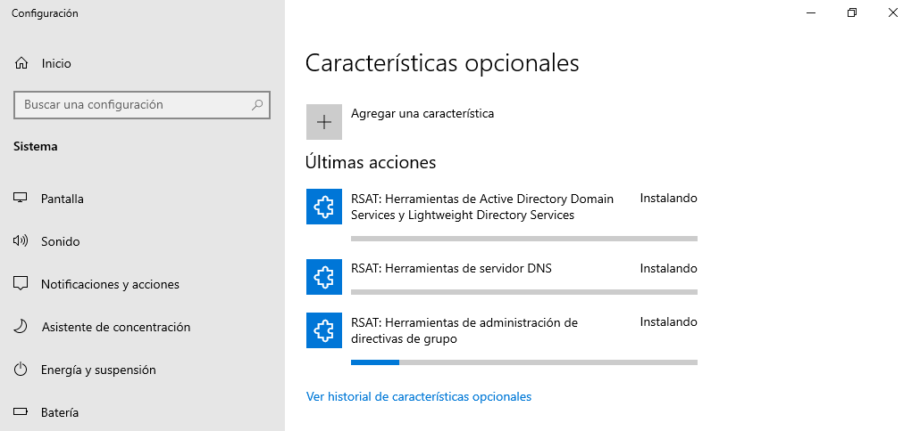

> **Importante:** El equipo Windows debe tener conexión a Internet para poder descargar los paquetes RSAT desde los servidores de Microsoft durante este proceso.

---

## Uso de las herramientas administrativas

Una vez instaladas las RSAT, podemos hacer uso de las diferentes herramientas administrativas para conectarnos a nuestro Controlador de Dominio `Samba`. Ya que esto no es un curso extenso de administración gráfica de Windows, solo mostraremos su estructura principal.

Desde las "Herramientas Administrativas de Windows" en el menú de inicio podemos acceder a todas las consolas individuales instaladas:

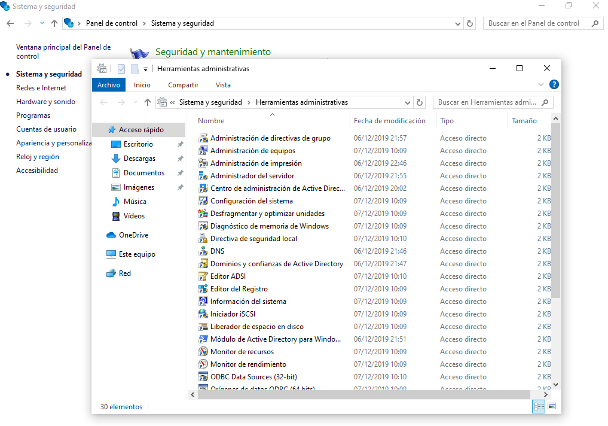

También es altamente recomendable hacer uso de la herramienta unificada **Administrador del servidor** (`Server Manager`), donde se integran las diferentes funcionalidades en un panel central.

Desde las distintas consolas podemos realizar diferentes acciones clave:

1. **Crear Unidades Organizativas (OUs) y usuarios:**
   Mediante "Usuarios y equipos de Active Directory", podemos estructurar lógicamente nuestro centro y aplicar políticas granulares.
   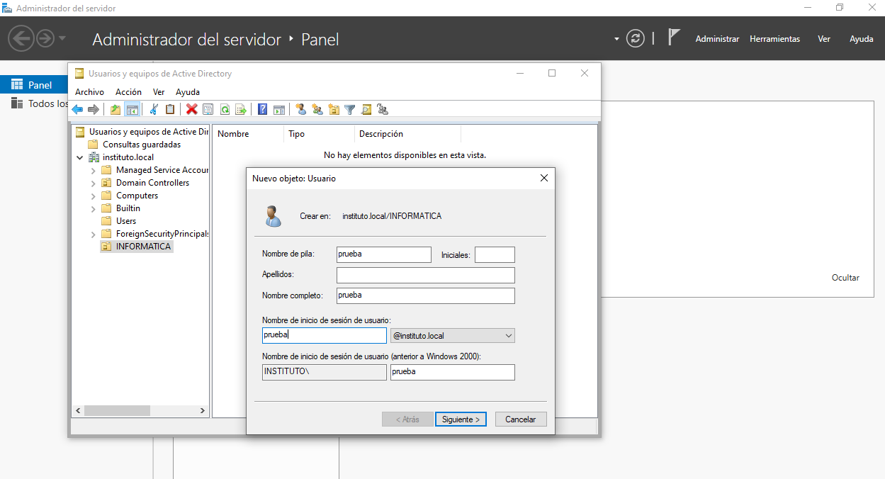

2. **Administrar el servidor DNS interno:**
   Con el "Administrador de DNS", nos conectamos a la IP del servidor `Ubuntu` y podemos revisar la zona de búsqueda directa de `instituto.local`, donde observaremos todos los equipos registrados dinámicamente y los registros críticos (SRV, SOA, NS).
   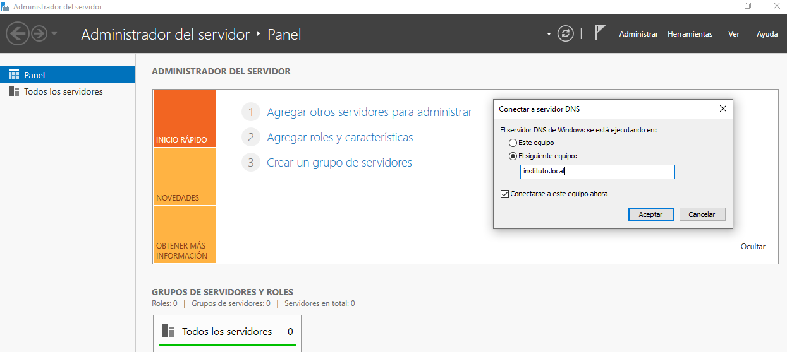
   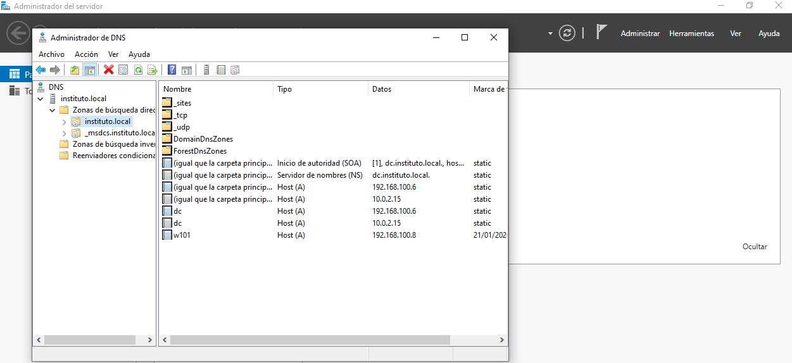

3. **Administrar GPOs para los equipos de la red:**
   A través de la consola de "Administración de directivas de grupo" (GPMC), podemos generar directivas que configuren fondos de pantalla automáticos, restrinjan accesos a unidades locales o bloqueen paneles de control en las máquinas `Windows 10` del dominio.
   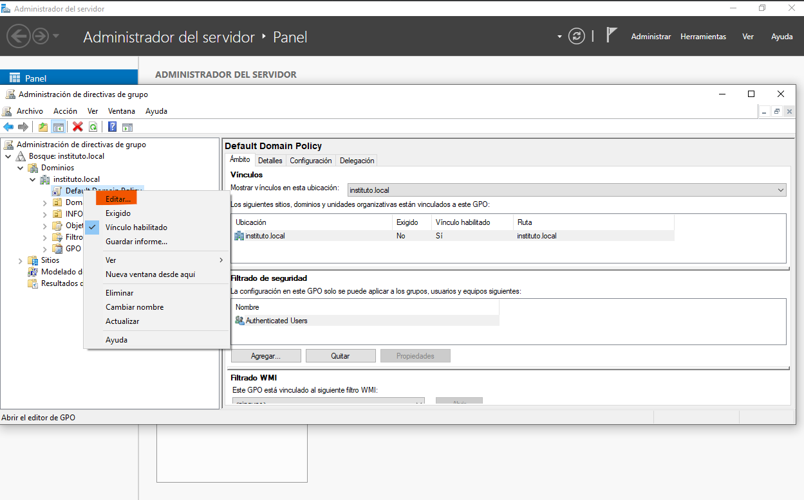
   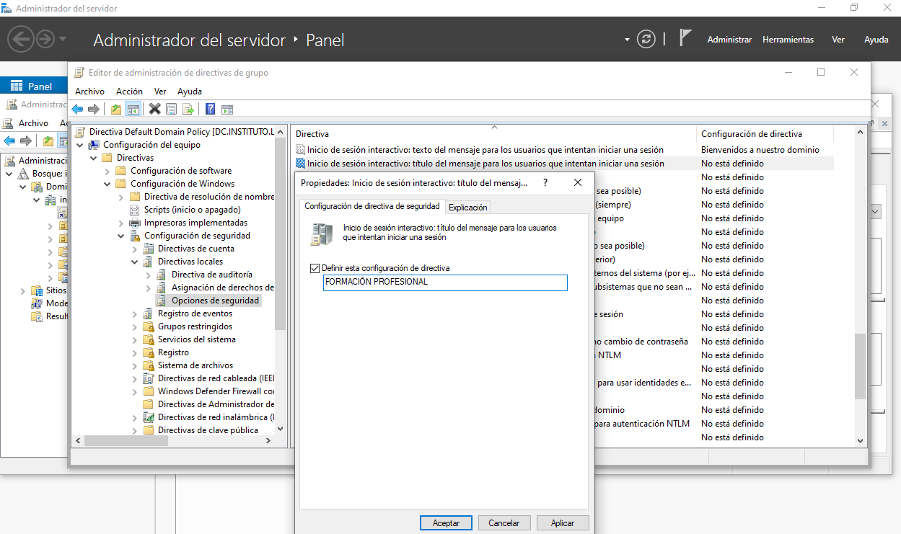
   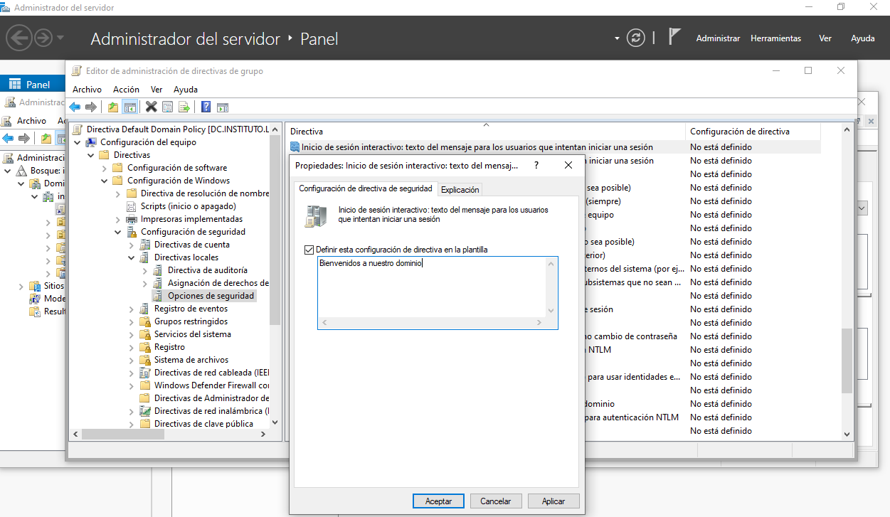
   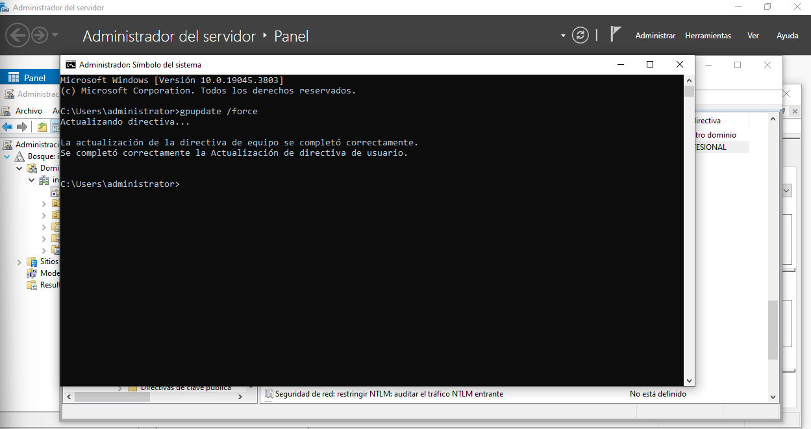
   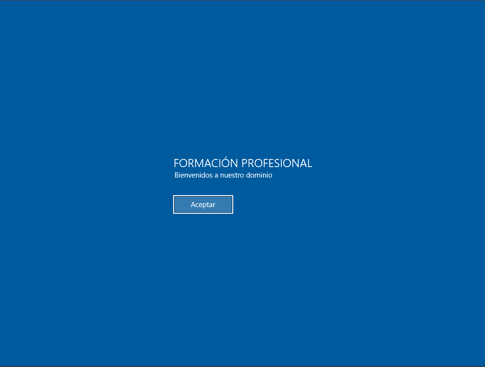
