# 07 Servidor DHCP con dos subredes

## Índice

1. [Introducción al escenario](#introducción-al-escenario)
2. [Implementación del servidor DHCP](#implementación-del-servidor-dhcp)
   - [1. Instalación del Servidor DHCP](#1-instalación-del-servidor-dhcp)
   - [2. Configuración de las Interfaces de Red](#2-configuración-de-las-interfaces-de-red)
   - [3. Configuración Principal del Servicio (dhcpd.conf)](#3-configuración-principal-del-servicio-dhcpdconf)
   - [Reiniciamos el servicio DHCP](#reiniciamos-el-servicio-dhcp)
3. [Configuraciones en clientes](#configuraciones-en-clientes)
   - [Configuración de Ubuntu Desktop](#configuración-de-ubuntu-desktop)
   - [Configuración de Windows 10](#configuración-de-windows-10)
4. [Modificación de NFTABLES](#modificación-de-nftables)
5. [Configuración del Servidor Samba4 AD-DC](#configuración-del-servidor-samba4-ad-dc)
   - [Otras configuraciones menores en los clientes](#otras-configuraciones-menores-en-los-clientes)
   - [Configuraciones finales del servidor AD-DC](#configuraciones-finales-del-servidor-ad-dc)

---

## Introducción al escenario

Vamos a instalar un servidor DHCP en nuestro controlador de dominio teniendo en cuenta el contexto de nuestro proyecto (`Servidor Samba4 AD-DC` con clientes `Windows` y `Ubuntu`) y dos máquinas cliente. Inicialmente en nuestra red las máquinas tienen las siguientes IPs estáticas:

- `Ubuntu Server`: `192.168.100.6/24`.
- `Ubuntu Desktop`: `192.168.100.7/24`.
- `Windows 10`: `192.168.100.8/24`.

Vamos a realizar las modificaciones necesarias para poder tener dos subredes separadas. Teniendo en cuenta que partimos del CIDR `192.168.100.0/24`, vamos a dividir la red en dos subredes de igual tamaño utilizando una máscara `/25` (`192.168.100.0/25` y `192.168.100.128/25`):

- `Ubuntu Server`: Tenemos que añadir un nuevo adaptador de red virtual para tener presencia en ambas. Una interfaz trabajará en la subred de `Ubuntu Desktop` (`192.168.100.1/25`) y la otra interfaz en la subred de `Windows 10` (`192.168.100.129/25`). Ambas interfaces actuarán como puerta de enlace (Gateway) para sus respectivas subredes.
- `Ubuntu Desktop`: Trabajará en la red `192.168.100.0/25`, siendo esta la Subred 1.
- `Windows 10`: Trabajará en la red `192.168.100.128/25`, siendo esta la Subred 2.

Tenemos que realizar entonces las siguientes modificaciones en nuestro `Ubuntu Server` (fichero Netplan) para configurar estas IPs de forma estática:

```bash
network:
  version: 2
  ethernets:
    enp0s3:
      dhcp4: true
    enp0s8:
      addresses:
        - 192.168.100.1/25
    enp0s9:
      addresses:
        - 192.168.100.129/25
```

Tras aplicar la configuración con `netplan apply`, verificamos que las interfaces tienen asignadas las IPs correctas:

```bash
enp0s8: <BROADCAST,MULTICAST,UP,LOWER_UP> mtu 1500 qdisc fq_codel state UP group default qlen 1000
    link/ether 08:00:27:a0:71:dc brd ff:ff:ff:ff:ff:ff
    inet 192.168.100.1/25 brd 192.168.100.127 scope global enp0s8
       valid_lft forever preferred_lft forever
    inet6 fe80::a00:27ff:fea0:71dc/64 scope link
       valid_lft forever preferred_lft forever
enp0s9: <BROADCAST,MULTICAST,UP,LOWER_UP> mtu 1500 qdisc fq_codel state UP group default qlen 1000
    link/ether 08:00:27:bc:38:14 brd ff:ff:ff:ff:ff:ff
    inet 192.168.100.129/25 brd 192.168.100.255 scope global enp0s9
       valid_lft forever preferred_lft forever
    inet6 fe80::a00:27ff:febc:3814/64 scope link
       valid_lft forever preferred_lft forever
```

---

## Implementación del servidor DHCP

### 1. Instalación del Servidor DHCP

El primer paso consiste en actualizar los repositorios e instalar el software oficial de servidor DHCP de Internet Systems Consortium (`isc-dhcp-server`).

```bash
root@dc:~# apt update && apt install -y isc-dhcp-server
```

### 2. Configuración de las Interfaces de Red

Debemos indicar al servicio DHCP por qué tarjetas de red debe "escuchar" las peticiones y servir direcciones IP.

```bash
root@dc:~# grep INTERFACESv4 /etc/default/isc-dhcp-server
INTERFACESv4="enp0s8 enp0s9"
```

- **`INTERFACESv4="..."`**: Aquí definimos las interfaces físicas o virtuales por las que el servidor aceptará peticiones DHCP IPv4.
- En nuestro caso, al poner `"enp0s8 enp0s9"`, estamos indicando explícitamente que queremos servir IPs por dos tarjetas de red diferentes, lo cual coincide con nuestra estrategia de tener dos redes separadas.

### 3. Configuración Principal del Servicio (dhcpd.conf)

A continuación editamos el archivo principal `/etc/dhcp/dhcpd.conf` donde se definen las opciones globales y las reglas del reparto de IPs para cada subred.

#### Opciones Globales (Configuración del Dominio)

Estas líneas se colocan al principio para afectar a todas las subredes (a menos que se especifique lo contrario dentro de la declaración de una subred particular).

```bash
option domain-name "instituto.local";
option domain-name-servers dc.instituto.local;

default-lease-time 3600;
max-lease-time 7200;
```

- **`option domain-name "instituto.local";`**: Asigna el sufijo DNS que se entregará a los clientes. Esto es vital para nuestro **Samba AD-DC**, ya que permite que los equipos se encuentren usando nombres cortos (ej. buscar `pc1` resolverá a `pc1.instituto.local`).
- **`option domain-name-servers dc.instituto.local;`**: Especifica la dirección del servidor DNS que usarán los clientes. En un entorno de Dominio (AD), **este DNS debe ser el propio Servidor Samba AD-DC** para garantizar la resolución de registros Kerberos y LDAP.
- **`default-lease-time 3600`**: El tiempo (en segundos, equivale a 1 hora) que una IP se asigna a un cliente por defecto si este no pide un tiempo de concesión específico.
- **`max-lease-time 7200`**: El tiempo máximo (2 horas) que se le permite tener la IP antes de obligar al cliente a renovarla con el servidor.

#### Activación del Modo Autoritativo

Descomentamos la directiva `authoritative` indicando que nuestro `Ubuntu Server` actúa como el servidor DHCP principal y autorizado de la red.

```bash
authoritative;
```

> **Importante:** La directiva `authoritative;` es crucial. Le dice al servidor: "Yo soy el servidor DHCP oficial y legítimo de esta red". Si un cliente intenta renovar una IP antigua que pertenece a otra red o que ya no es válida, este servidor tiene la potestad de rechazarla enviando un `DHCPNAK` y forzando al cliente a solicitar una nueva concesión inmediatamente.

#### Definición de Subredes

Configuramos los rangos específicos para cada una de las dos redes en el fichero.

**Subred 1 (Parte baja - 192.168.100.0/25)**

Esta subred abarca desde la IP `.0` (identificador de red) hasta la `.127` (dirección de broadcast).

```bash
subnet 192.168.100.0 netmask 255.255.255.128 {
    option routers 192.168.100.1;
    option subnet-mask 255.255.255.128;
    option domain-search "instituto.local";
    option domain-name-servers 192.168.100.1;
    range 192.168.100.10 192.168.100.110;
}
```

- **`subnet 192.168.100.0 netmask 255.255.255.128`**: Define el primer bloque de la red. Observemos que la máscara termina en **.128** (equivalente a `/25`), lo que divide el bloque `/24` original.
- **`option routers 192.168.100.1;`**: Es la **Puerta de Enlace (Gateway)** entregada al cliente. Apunta a la primera IP útil de este bloque configurada en la interfaz `enp0s8` del servidor.
- **`option subnet-mask 255.255.255.128;`**: Indica a los clientes que la red termina en la `.127`.
- **`option domain-name-servers 192.168.100.1;`**: El DNS apunta a la IP local del servidor en esta subred para que resuelva el dominio Samba más rápido.
- **`range 192.168.100.10 192.168.100.110;`**: El **Pool de IPs** dinámicas. Es importante no sobrepasar la `.126`.

**Subred 2 (Parte alta - 192.168.100.128/25)**

Esta subred abarca desde la IP `.128` hasta la `.255`.

```bash
subnet 192.168.100.128 netmask 255.255.255.128 {
    option routers 192.168.100.129;
    option subnet-mask 255.255.255.128;
    option domain-search "instituto.local";
    option domain-name-servers 192.168.100.129;
    range 192.168.100.140 192.168.100.240;
}
```

#### Reiniciamos el servicio DHCP

Debemos reiniciar el servicio `isc-dhcp-server` para aplicar la configuración. Comprobamos su estado para verificar que está escuchando (Listening) en ambas interfaces correctamente.

```bash
root@dc:~# systemctl restart isc-dhcp-server
root@dc:~# systemctl status isc-dhcp-server
● isc-dhcp-server.service - ISC DHCP IPv4 server
     Loaded: loaded (/usr/lib/systemd/system/isc-dhcp-server.service; enabled; preset: enabled)
     Active: active (running) since Wed 2026-01-21 19:48:57 CET; 3s ago
...
ene 21 19:48:57 dc dhcpd[1480]: Listening on LPF/enp0s9/08:00:27:bc:38:14/192.168.100.128/25
ene 21 19:48:57 dc dhcpd[1480]: Listening on LPF/enp0s8/08:00:27:a0:71:dc/192.168.100.0/25
ene 21 19:48:57 dc dhcpd[1480]: Server starting service.
```

---

## Configuraciones en clientes

### Configuración de Ubuntu Desktop

Editamos el fichero de configuración de `netplan` en el cliente para indicarle que debe obtener su IPv4 dinámicamente por DHCP en lugar de tenerla estática, y aplicamos los cambios.

```bash
network:
  version: 2
  renderer: NetworkManager
  ethernets:
    enp0s3:
      renderer: networkd
      dhcp4: true
```

Tras aplicar con `netplan apply`, comprobamos que el equipo recibe una IP del rango `.10` al `.110` y que tiene conectividad con la puerta de enlace.

```bash
root@ud101:~# ping -c 4 192.168.100.1
PING 192.168.100.1 (192.168.100.1) 56(84) bytes of data.
64 bytes from 192.168.100.1: icmp_seq=1 ttl=64 time=2.77 ms
64 bytes from 192.168.100.1: icmp_seq=2 ttl=64 time=1.28 ms
64 bytes from 192.168.100.1: icmp_seq=3 ttl=64 time=1.13 ms
64 bytes from 192.168.100.1: icmp_seq=4 ttl=64 time=0.903 ms

--- 192.168.100.1 ping statistics ---
4 packets transmitted, 4 received, 0% packet loss, time 3003ms
```

### Configuración de Windows 10

En la máquina Windows 10 (Subred 2), debemos modificar las propiedades del adaptador de red para obtener una IP y DNS de forma automática.

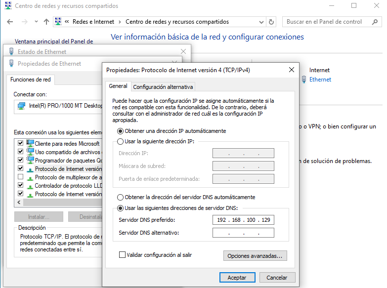

A continuación, abrimos una consola de comandos `cmd` y verificamos que ha adquirido una IP del rango `.140` a `.240` y que los servidores DNS y DHCP apuntan a `192.168.100.129`.

```bash
C:\Users\usuario>ipconfig /all

Configuración IP de Windows
   ...
   Sufijo DNS principal  . . . . . : instituto.local

Adaptador de Ethernet Ethernet:
   ...
   Dirección IPv4. . . . . . . . . . . . . . : 192.168.100.140(Preferido)
   Máscara de subred . . . . . . . . . . . . : 255.255.255.128
   Puerta de enlace predeterminada . . . . . : 192.168.100.129
   Servidor DHCP . . . . . . . . . . . . . . : 192.168.100.129
   Servidores DNS. . . . . . . . . . . . . . : 192.168.100.129
```

Verificamos la conexión con la puerta de enlace:

```bash
C:\Users\usuario>ping 192.168.100.129

Haciendo ping a 192.168.100.129 con 32 bytes de datos:
Respuesta desde 192.168.100.129: bytes=32 tiempo=1ms TTL=64
...
```

---

## Modificación de NFTABLES

Actualmente, el servidor tenía una configuración de `nftables` que permitía la salida SNAT (Masquerade) para la red original `192.168.100.0/24`. Al haber segmentado la red, es una buena práctica (y en algunos kernels, obligatorio) crear reglas precisas para las nuevas subredes originadas.

Visualizamos la tabla actual:

```bash
root@dc:~# nft list table nat
table ip nat {
        chain postrouting {
                type nat hook postrouting priority srcnat; policy accept;
                oifname "enp0s3" ip saddr 192.168.100.0/24 counter packets 88 bytes 4752 masquerade
        }
}
```

Añadimos las siguientes reglas específicas para nuestras dos subredes `/25`.

```bash
root@dc:~# nft add rule ip nat postrouting oifname "enp0s3" ip saddr 192.168.100.0/25 counter masquerade
root@dc:~# nft add rule ip nat postrouting oifname "enp0s3" ip saddr 192.168.100.128/25 counter masquerade
```

Revisamos la inserción en memoria:

```bash
root@dc:~# nft list table nat
table ip nat {
        chain postrouting {
                ...
                oifname "enp0s3" ip saddr 192.168.100.0/24 counter masquerade
                oifname "enp0s3" ip saddr 192.168.100.0/25 counter masquerade
                oifname "enp0s3" ip saddr 192.168.100.128/25 counter masquerade
        }
}
```

Para hacer persistente la configuración de las reglas a través de reinicios, volcamos el conjunto al fichero y reiniciamos el servicio.

```bash
root@dc:~# nft list ruleset > /etc/nftables.conf
root@dc:~# systemctl restart nftables
```

En estos momentos los clientes de ambas subredes deberían tener salida transparente a Internet.

---

## Configuración del Servidor Samba4 AD-DC

Tenemos que realizar la re-configuración del servidor de tiempo `chrony` para que los clientes sean capaces de sincronizarse con el servidor escuchando en sus nuevas interfaces.

> **Advertencia:** En un entorno Active Directory (AD), la autenticación funciona mediante Kerberos. Kerberos es extremadamente sensible al tiempo: si el reloj del servidor y el del cliente difieren en más de 5 minutos, el inicio de sesión será denegado por seguridad para evitar ataques de repetición.

Editamos el fichero `/etc/chrony/chrony.conf` para vincular (`bindcmdaddress`) el servicio a ambas interfaces de red y autorizar (`allow`) a ambas subredes.

```bash
# Configuración para NTP del AD
bindcmdaddress 192.168.100.1
bindcmdaddress 192.168.100.129
allow 192.168.100.0/25
allow 192.168.100.128/25
ntpsigndsocket /var/lib/samba/ntp_signd
```

### Otras configuraciones menores en los clientes

#### Cliente Ubuntu Desktop

Tenemos que editar el fichero `/etc/hosts` en el cliente Ubuntu para limpiarlo. Ahora no son necesarias las entradas estáticas (hardcoded) para `instituto.local` ni `dc.instituto.local`, ya que el servidor DNS dinámico provisto por el DHCP se encargará de resolverlas.

```bash
root@ud101:~# cat /etc/hosts
127.0.0.1 localhost
127.0.1.1 ubuntu

# Eliminamos o comentamos las líneas antiguas del DC
# The following lines are desirable for IPv6 capable hosts
...
```

Verificamos que el DHCP ha insertado correctamente la búsqueda de dominio en la configuración DNS del cliente (`resolv.conf`).

```bash
root@ud101:~# tail -1 /etc/resolv.conf
search instituto.org instituto.local
```

Comprobamos resoluciones y conectividad:

```bash
root@ud101:~# ping -c 3 instituto.local
...
64 bytes from instituto.local (192.168.100.1): icmp_seq=1 ttl=64 time=24.7 ms

root@ud101:~# ping -c 3 dc.instituto.local
...
64 bytes from instituto.local (192.168.100.1): icmp_seq=1 ttl=64 time=5.59 ms
```

#### Windows 10 con RSAT

Debemos realizar modificaciones del DNS del controlador de dominio usando las herramientas gráficas **RSAT** en Windows. 

> **Recuerda:** Entendemos el DNS como la "agenda telefónica" de la red.
> - **Zona de Búsqueda Directa**: "Tengo el nombre, quiero la IP". Obligatoria. Convierte `dc.instituto.local` a IP.
> - **Zona de Búsqueda Inversa**: "Tengo la IP, quiero el nombre". Zona "espejo", convierte la IP devuelta en un nombre. Es fundamental para diagnósticos de red o servicios de auditoría.

En la **zona de búsqueda directa**, tendremos que editar el Host `dc` (que previamente apuntaba a la antigua IP `192.168.100.6`) y cambiarlo por la IP de la Subred 1 (`192.168.100.1`), asegurándonos de marcar "Actualizar registro de puntero PTR".
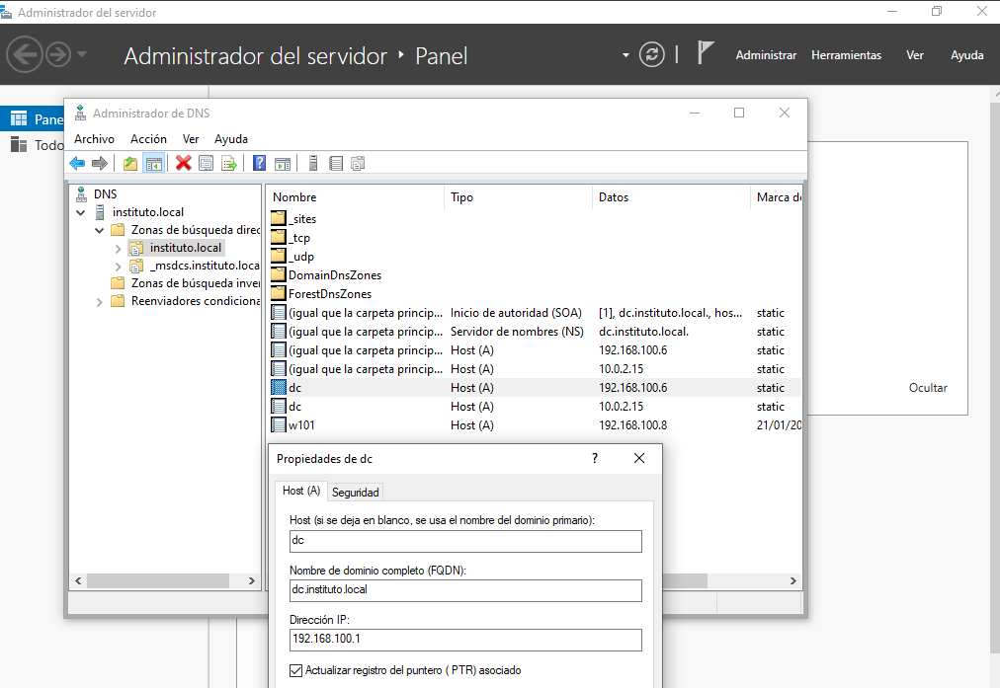

Adicionalmente, agregamos un **Nuevo Host (A)** llamado `dc` asociado a la IP de la Subred 2 (`192.168.100.129`). 
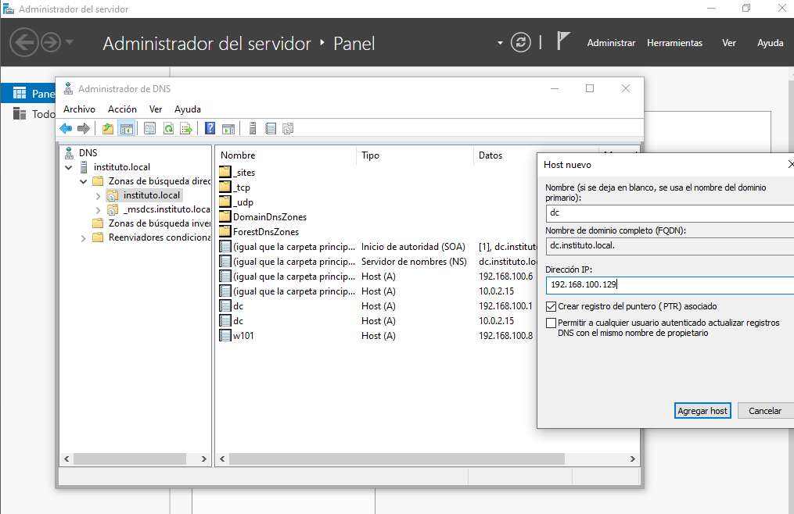

Estas modificaciones permitirán a cualquier cliente, independientemente de su subred, localizar la IP de un Controlador de Dominio válido.

A continuación, vamos a crear las correspondientes **Zonas Inversas** para el rango de red `192.168.100.x` utilizando el asistente:

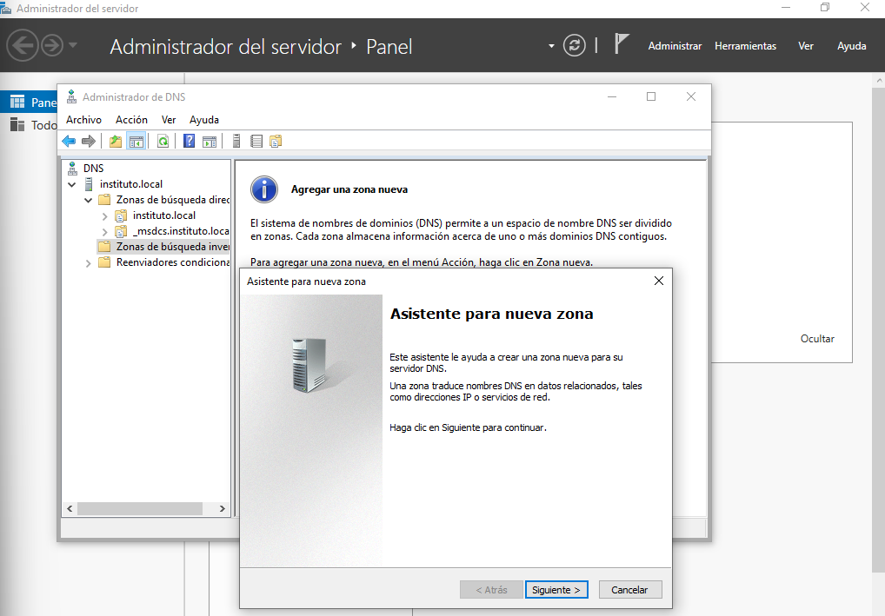
*(Sigue las capturas de pantalla para establecer la zona Principal, replicada a todos los servidores DNS del dominio).*
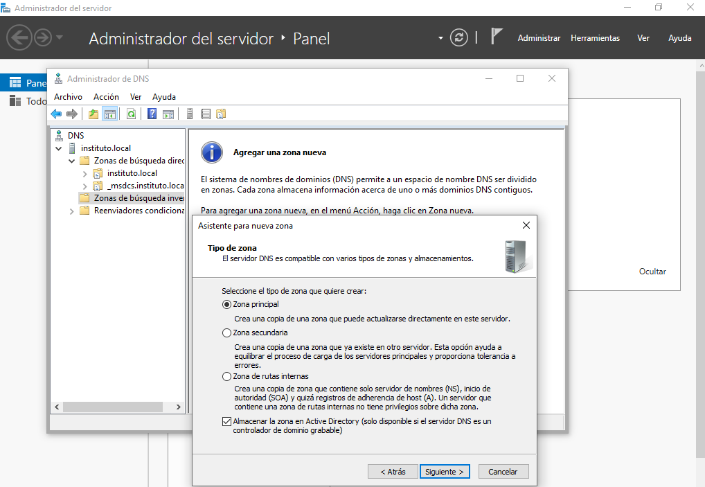
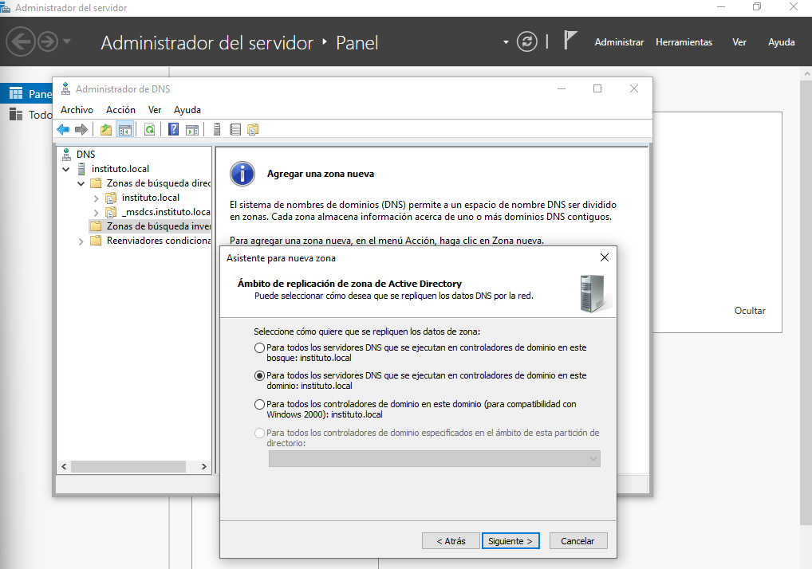
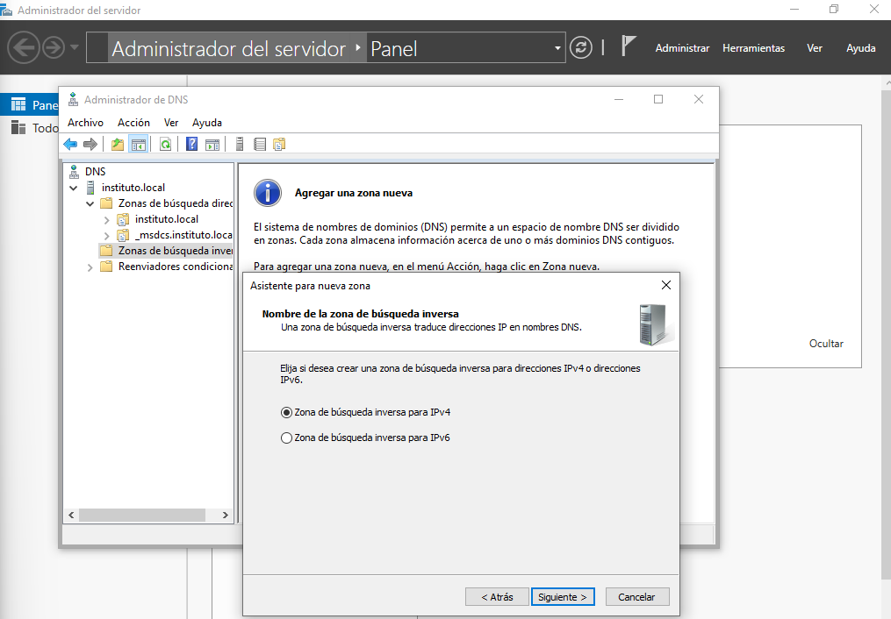
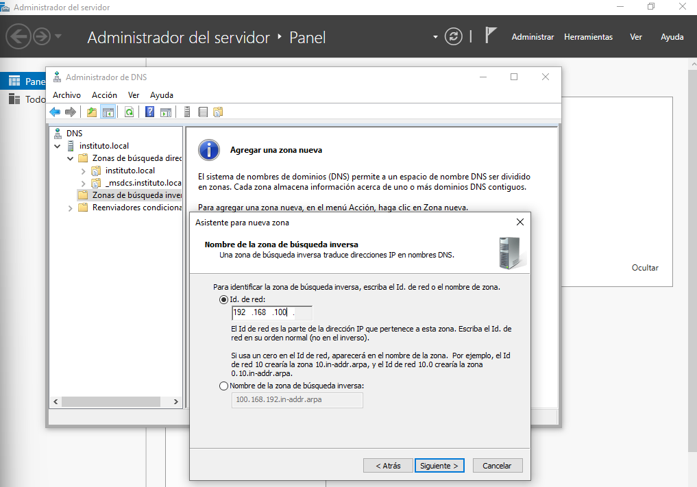
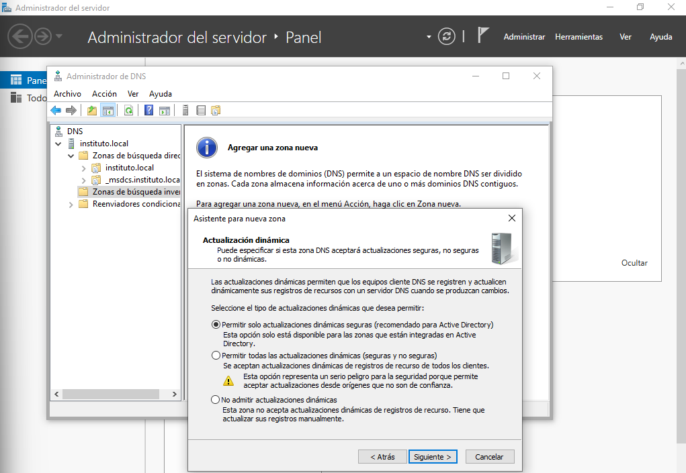
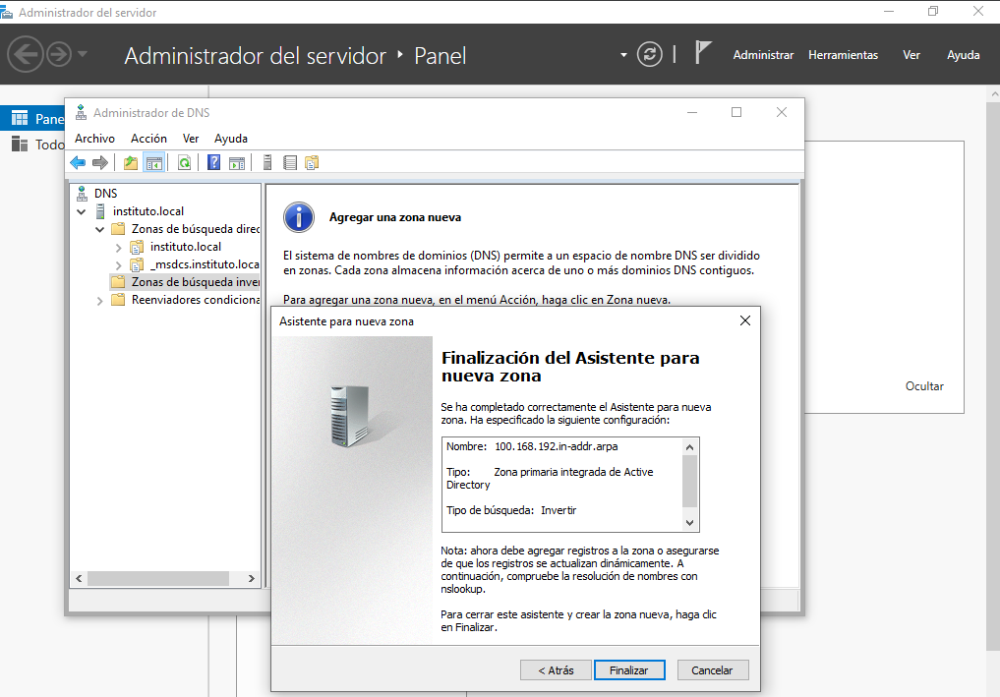

Tras finalizar el asistente, creamos los registros **Puntero (PTR)** manualmente para las interfaces del servidor, apuntando `192.168.100.1` y `192.168.100.129` al nombre de host `dc.instituto.local`.

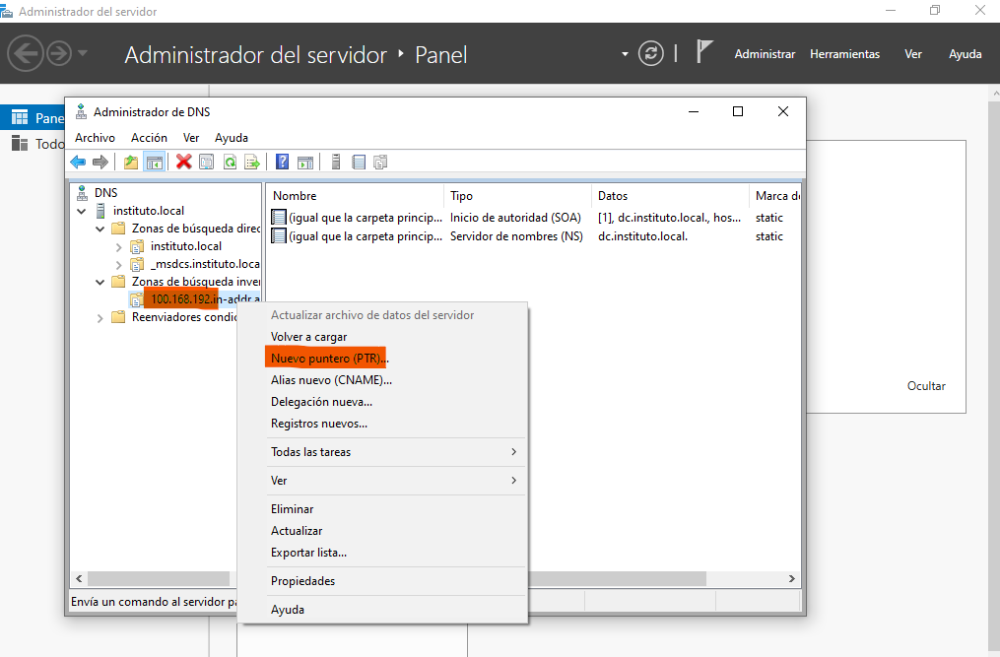
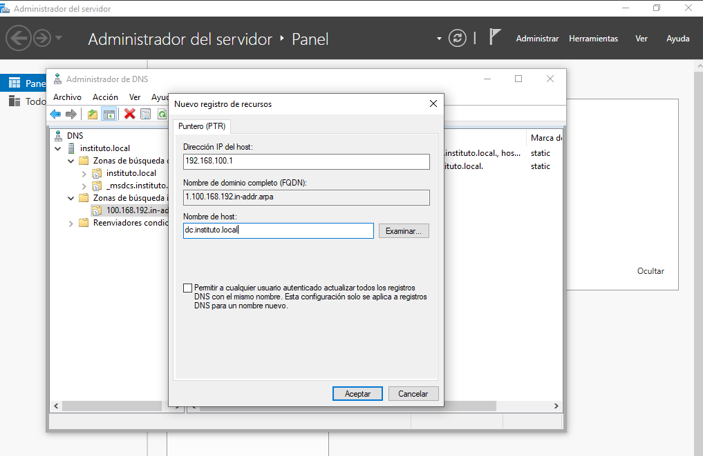
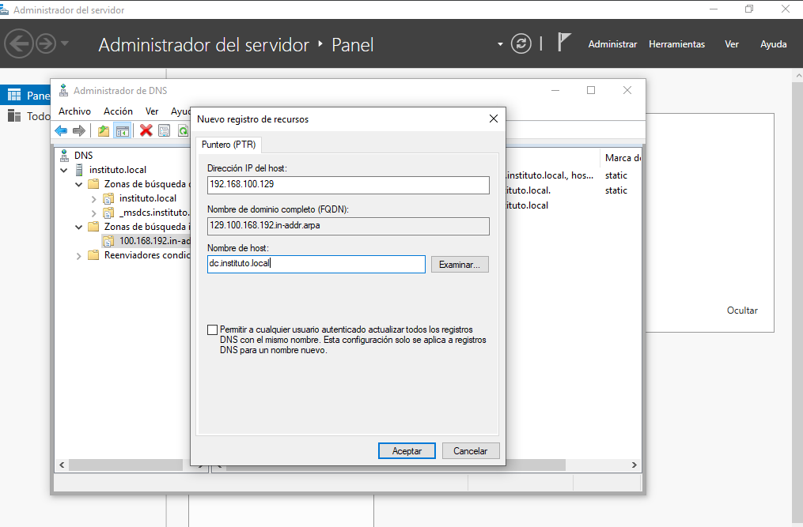
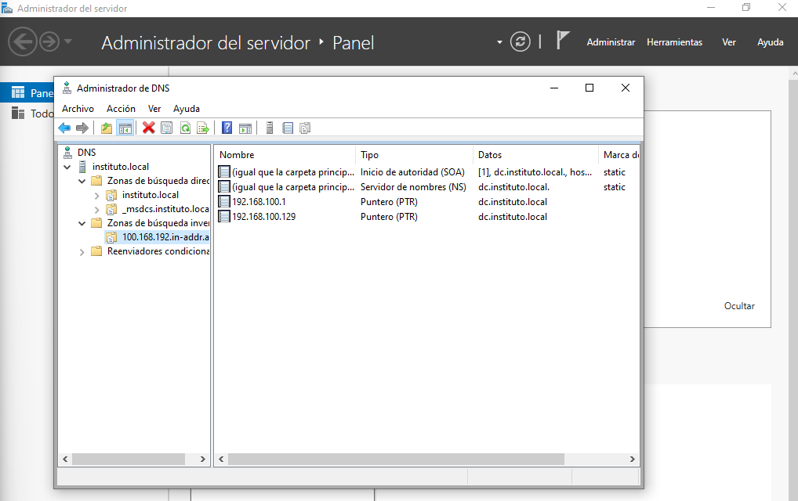

Para probar la efectividad, utilizamos `nslookup` desde el propio cliente Windows:

```bash
C:\Users\alumno>nslookup dc
Servidor:  dc.instituto.local
Address:  192.168.100.129

Nombre:  dc.instituto.local
Addresses:  192.168.100.1
          10.0.2.15
          192.168.100.129
```

Y desde el cliente Ubuntu:

```bash
alumno@ud101:~$ nslookup dc.instituto.local
Server:		127.0.0.53
Address:	127.0.0.53#53

dc.instituto.local	canonical name = instituto.local.
Name:	instituto.local
Address: 192.168.100.1

alumno@ud101:~$ nslookup 192.168.100.1
1.100.168.192.in-addr.arpa	name = instituto.local.
1.100.168.192.in-addr.arpa	name = dc.instituto.local.
1.100.168.192.in-addr.arpa	name = dc.
1.100.168.192.in-addr.arpa	name = instituto.

alumno@ud101:~$ ping -c3 google.es
...
64 bytes from mad41s11-in-f3.1e100.net (142.250.185.3): icmp_seq=1 ttl=116 time=55.7 ms
```

> **Nota:** La prueba de `nslookup 192.168.100.1` demuestra que la **Zona Inversa** funciona al devolver múltiples nombres asociados a una misma IP del Controlador de Dominio. El `ping` a Google verifica que los forwarders DNS y el NAT siguen activos tras los cambios.

### Configuraciones finales del servidor AD-DC

Como nuestro servidor `Ubuntu Server` ha cambiado sus propias IPs, debemos limpiar su fichero `/etc/hosts` para no crear un bucle confuso, delegando toda resolución interna al archivo `/etc/resolv.conf` y a `Samba`.

```bash
root@dc:~# cat /etc/hosts
127.0.0.1 localhost
127.0.1.1 ubuntuserver

# Configuraciones
# Comentamos la línea de dc manual
# 192.168.100.1   dc.instituto.local dc instituto.local instituto
...
```

Editamos `/etc/resolv.conf` para que el servidor se pregunte a sí mismo (`192.168.100.1`), pero debemos remover temporalmente el atributo inmutable (`-i`) para permitir el cambio.

```bash
root@dc:~# lsattr /etc/resolv.conf
----i---------e------- /etc/resolv.conf

root@dc:~# chattr -i /etc/resolv.conf
root@dc:~# nano /etc/resolv.conf
```

Introducimos:

```bash
root@dc:~# cat /etc/resolv.conf
nameserver 192.168.100.1
nameserver 8.8.8.8
search instituto.local
```

Restablecemos el atributo inmutable para proteger el fichero (`chattr +i /etc/resolv.conf`) y confirmamos que la red está completamente operativa haciendo ping al cliente Windows por nombre:

```bash
root@dc:~# ping -c3 w101
PING w101.instituto.local (192.168.100.140) 56(84) bytes of data.
...
--- w101.instituto.local ping statistics ---
3 packets transmitted, 3 received, 0% packet loss, time 2069ms
```
