# 09 Recurso compartido

## Índice

1. [Introducción](#introducción)
2. [Configuración en el servidor Samba](#configuración-en-el-servidor-samba)
3. [Configuración con las RSAT (Windows)](#configuración-con-las-rsat-windows)
4. [Configuración en Ubuntu Desktop](#configuración-en-ubuntu-desktop)

---

## Introducción

En este punto vamos a realizar los pasos necesarios para crear, gestionar y acceder a un recurso compartido en nuestro directorio activo en el servidor `Samba 4` que funciona como Controlador de Dominio de Active Directory (AD). Desde la creación del directorio compartido hasta la configuración de permisos y el acceso desde clientes Windows y Linux, cada paso se presenta de manera clara y concisa para facilitar el proceso.

En entornos empresariales donde se utiliza `Samba 4` como Controlador de Dominio, configurar y administrar recursos compartidos es fundamental para facilitar el acceso centralizado a archivos y carpetas en la red. Vamos a detallar los pasos para:

- Crear un directorio compartido en el servidor `Samba 4 AD DC`.
- Configurar el recurso compartido en el archivo de configuración `smb.conf`.
- Administrar permisos de acceso mediante Listas de Control de Acceso (ACLs) desde el Explorador de archivos de Windows y la Administración de equipos (usando RSAT).
- Asignar el recurso compartido mediante Políticas de Grupo (GPO) para su montaje automático como unidad de red en clientes Windows.
- Acceder al recurso compartido desde clientes Linux, instalando los paquetes necesarios y configurando puntos de montaje persistentes.

---

## Configuración en el servidor Samba

1. Creamos el recurso compartido (la carpeta física en el servidor) y le otorgamos permisos base estándar.

```bash
root@dc:~# mkdir /recursos
root@dc:~# chmod -R 755 /recursos/
root@dc:~# ls -ld /recursos/
drwxr-xr-x 2 root root 4096 ene 23 09:06 /recursos/
```

2. A continuación, vamos a establecer al usuario `root` como propietario y al grupo `domain users` (usuarios del dominio) como el grupo principal de la carpeta.

```bash
root@dc:~# chown -R root:"domain users" /recursos/
root@dc:~# ls -ld /recursos/
drwxr-xr-x 2 root users 4096 ene 23 09:06 /recursos/
```

3. Indicamos en el archivo de configuración del servidor (`/etc/samba/smb.conf`) cuál va a ser el recurso compartido, añadiendo el bloque al final del archivo, y reiniciamos el servicio `Samba` para aplicar los cambios.

```bash
root@dc:~# tail -3  /etc/samba/smb.conf
[recursos]
        path = /recursos
        read only = no
```

```bash
root@dc:~# systemctl restart samba-ad-dc.service
```

---

## Configuración con las RSAT (Windows)

1. Llegados a este punto, si accedemos al servidor desde un equipo Windows mediante su ruta de red (`\\dc` o `\\192.168.100.1`), podremos visualizar la carpeta de recursos compartidos.

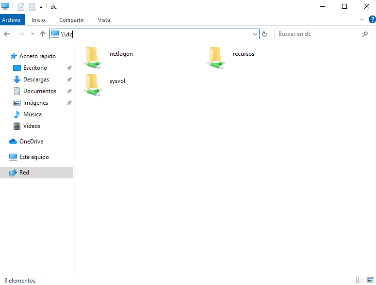
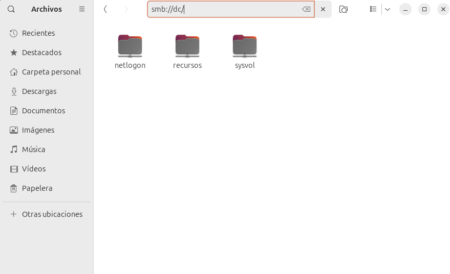

Además, si hemos iniciado sesión con el usuario `Administrator` o un administrador de dominio, podemos modificar los permisos de seguridad (ACLs NTFS) gráficamente. El objetivo será configurar que:
- Los usuarios base (`domain users`) tengan permisos de lectura y ejecución en la carpeta recursos, subcarpetas y archivos.
- Los administradores del dominio (`domain admins`) tengan control total sobre ella.

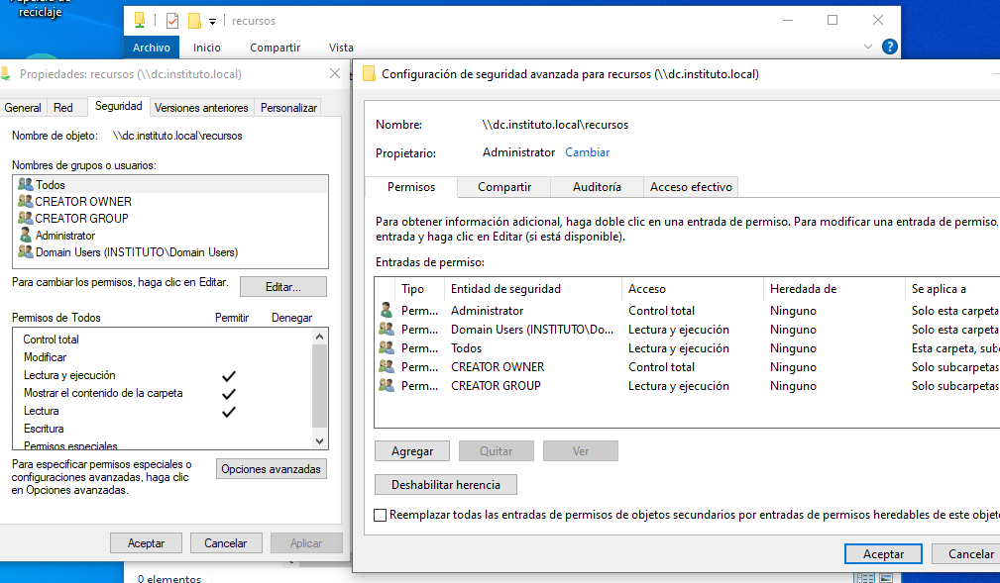
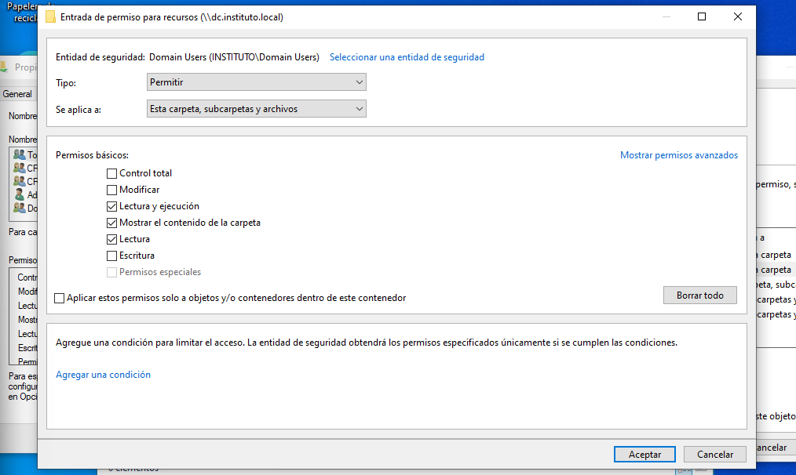
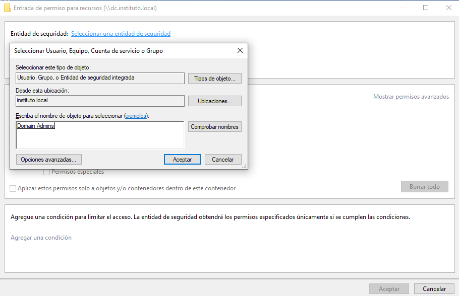
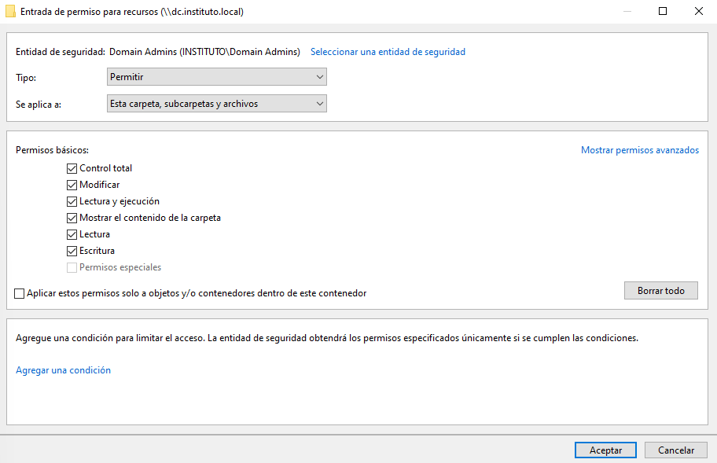

> **Nota:** También podemos administrar estos recursos compartidos de manera centralizada desde la consola **Administración de equipos** conectándonos remotamente al servidor `Samba`.

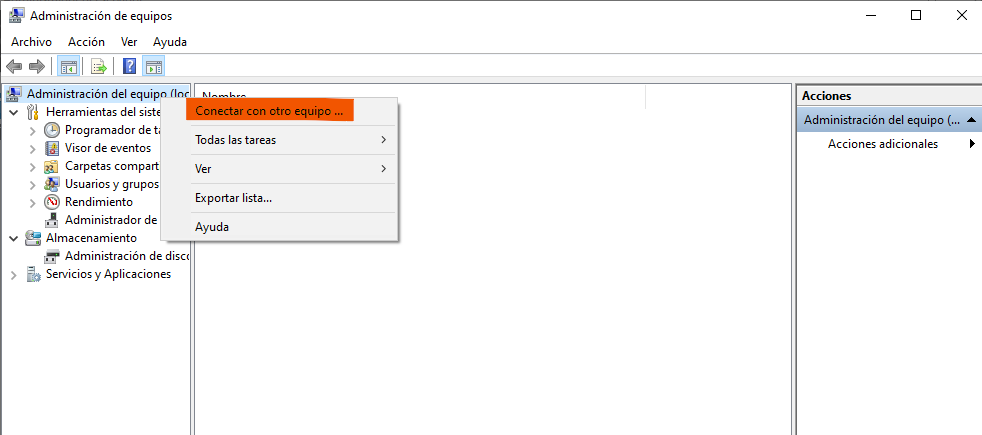
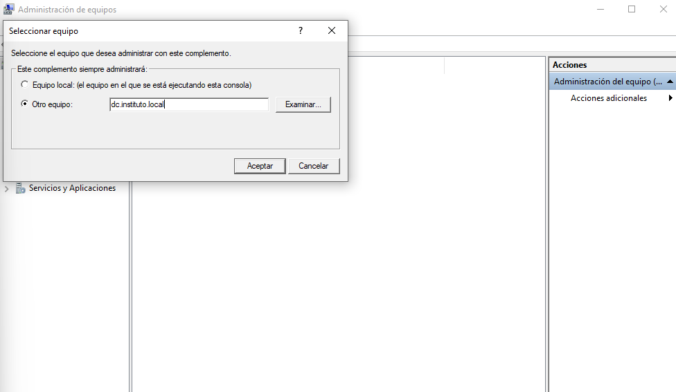
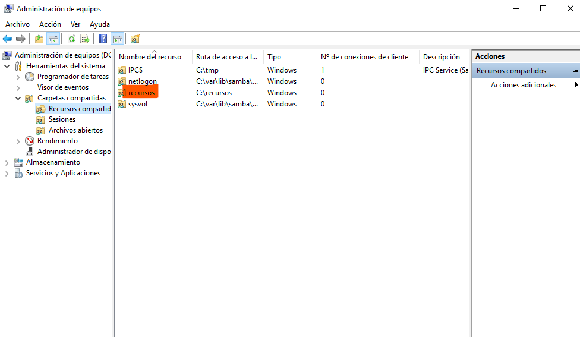
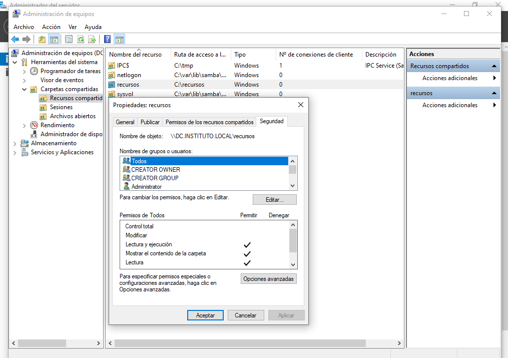

2. Vamos a crear una Política de Grupo (GPO) que permita que los equipos Windows del dominio, al iniciar sesión, se conecten y mapeen automáticamente este recurso compartido como una unidad de red local. 

Para demostrar su funcionalidad, hemos creado dentro de la carpeta un fichero de prueba llamado `EXAMEN.txt`.

Abrimos el **Administrador de directivas de grupo** (GPMC) y creamos un nuevo objeto:

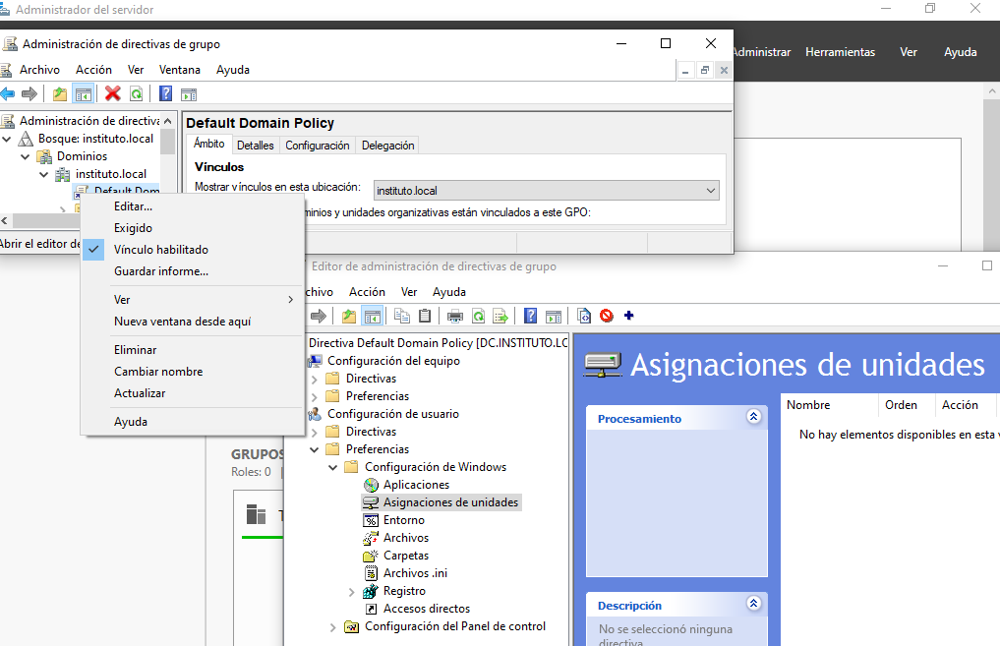

Navegamos a *Configuración de usuario > Preferencias > Configuración de Windows > Asignaciones de unidades*. Creamos una nueva asignación con las siguientes características:
- **Acción:** Crear o Actualizar.
- **Ubicación:** `\\dc\recursos`
- **Etiqueta:** `RECURSOS`
- **Letra de unidad:** `R:`

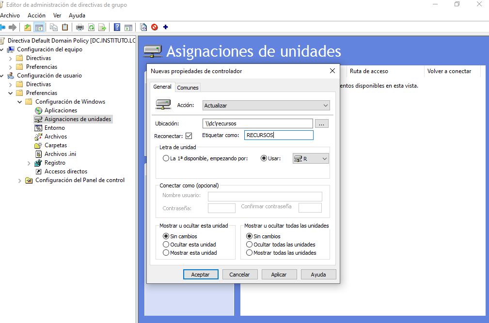

Para forzar la aplicación de la nueva política inmediatamente en el cliente sin tener que reiniciar, ejecutamos `gpupdate /force` desde la consola.

```cmd
C:\> gpupdate /force
Actualizando directiva...
La actualización de la directiva de usuario se completó correctamente.
```

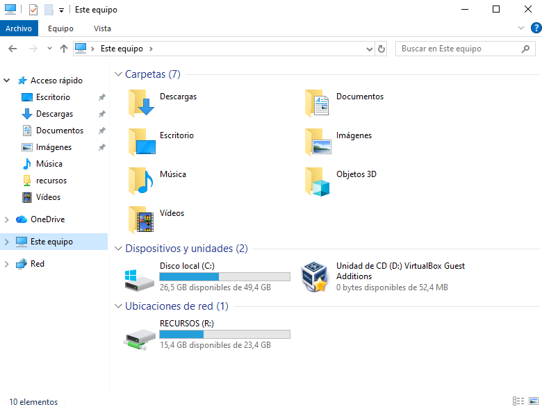

---

## Configuración en Ubuntu Desktop

1. Instalamos las herramientas necesarias en el cliente Linux para interactuar y montar recursos compartidos por SMB/CIFS.

- `smbclient`: Es una herramienta que nos permite conectarnos a servidores SMB desde la línea de comandos de forma interactiva (similar a un cliente FTP).
- `cifs-utils`: Es el paquete fundamental que proporciona soporte a nivel del sistema de archivos, permitiendo que un recurso de red SMB se pueda montar y tratar como si fuera una carpeta local.

```bash
root@ud101:~# apt update && apt install -y smbclient cifs-utils
```

2. **Conexión por línea de comandos interactiva:**

Listamos los recursos ofrecidos por el servidor de dominio omitiendo la contraseña (usuario anónimo/porcentaje):

```bash
root@ud101:~# smbclient -L dc.instituto.local -U%

	Sharename       Type      Comment
	---------       ----      -------
	sysvol          Disk
	netlogon        Disk
	recursos        Disk
	IPC$            IPC       IPC Service (Samba 4.19.5-Ubuntu)
SMB1 disabled -- no workgroup available
```

Nos conectamos interactivamente al recurso `recursos` empleando un usuario del dominio:

```bash
root@ud101:~# smbclient //dc/recursos -U administrator
Password for [INSTITUTO\administrator]:
Try "help" to get a list of possible commands.
smb: \> ls
  .                                   D        0  Fri Jan 23 10:13:27 2026
  ..                                  D        0  Fri Jan 23 10:13:27 2026
  EXAMEN.txt                          A       29  Fri Jan 23 10:14:19 2026

		24590672 blocks of size 1024. 16204456 blocks available
smb: \> get EXAMEN.txt
getting file \EXAMEN.txt of size 29 as EXAMEN.txt (0,5 KiloBytes/sec) (average 0,3 KiloBytes/sec)
smb: \> exit
```

Verificamos el archivo descargado localmente:

```bash
root@ud101:~# ls
EXAMEN.txt

root@ud101:~# cat EXAMEN.txt
Aprendiendo sobre Dominios :)
```

3. **Proceso de forma gráfica:**

Es muy interesante que, de cara a los usuarios finales, la carpeta de recursos esté integrada de forma gráfica en el sistema (Files / Nautilus). Para ello, desde el navegador de archivos nos dirigimos a "+ Otras ubicaciones" y conectamos al servidor usando el protocolo SMB: `smb://dc.instituto.local/recursos`.

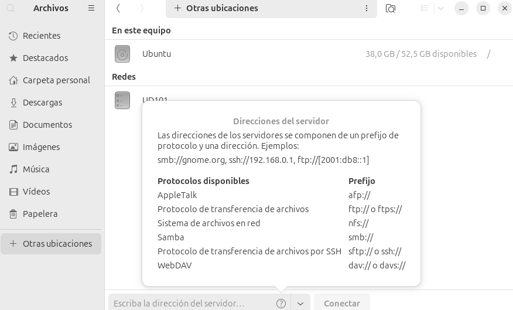
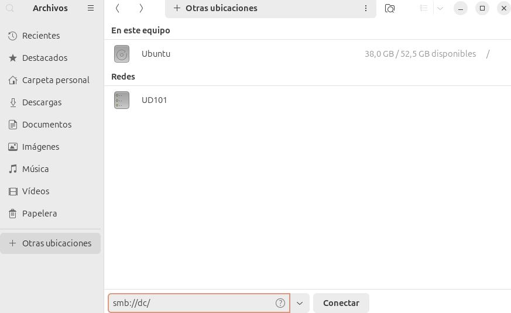
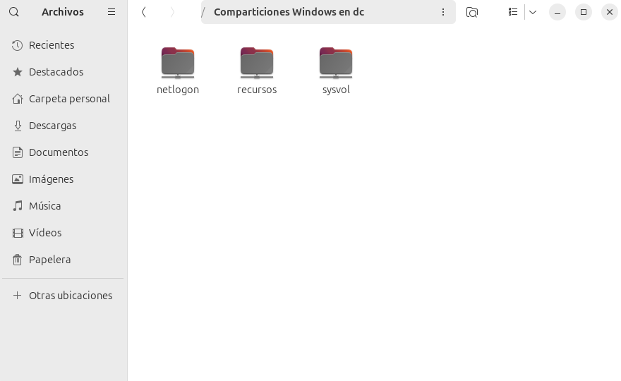

4. **Configuración para montaje persistente en Linux:**

Si queremos que el recurso compartido esté permanentemente accesible en el sistema de archivos Linux sin depender de la GUI y tras reinicios, debemos editar el archivo `/etc/fstab`.

- Crear el directorio de montaje (donde residirán los archivos de la red):

```bash
root@ud101:~$ mkdir -p /mnt/recursos
```

- Crear el archivo de credenciales de forma segura para no escribir las contraseñas en texto plano en el fichero `/etc/fstab` (el cual es legible por todos los usuarios).

```bash
root@ud101:~$ nano /etc/samba/.smbcredentials
root@ud101:~$ cat /etc/samba/.smbcredentials
username=administrator
password=abc123.
domain=INSTITUTO
```

- Protegemos estrictamente el archivo de credenciales (solo `root` puede leer/escribir):

```bash
root@ud101:~$ chmod 600 /etc/samba/.smbcredentials
```

- Editar el fichero `/etc/fstab` para añadir la directiva de montaje de red CIFS:

```bash
root@ud101:~$ nano /etc/fstab
```

Añadimos la siguiente línea al final del archivo:

```bash
//dc/recursos /mnt/recursos cifs defaults,user,credentials=/etc/samba/.smbcredentials 0 2
```

- Probamos el montaje (que leerá todo lo contenido en `/etc/fstab`) y verificamos que no lanza ningún error:

```bash
root@ud101:~$ mount -a
```
